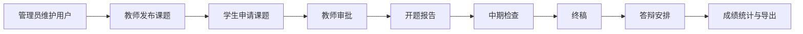

# 项目概述与答辩路线

## 1. 项目名称

毕业设计管理系统。

## 2. 解决的问题

传统毕业设计流程中，课题、申请、文档、反馈、答辩和成绩分散在表格、聊天软件和纸质材料中，
容易出现：

- 学生不知道选题是否通过。
- 教师难以统一查看待审批和待评阅任务。
- 文档修改版本难追踪。
- 管理员统计和答辩安排效率低。
- 不同角色之间的信息缺少统一入口。

本系统将毕业设计全过程集中到一个 Web 平台。

## 3. 三类角色

### 管理员

- 用户管理
- 公告管理
- 答辩安排
- Excel 导入导出
- 数据统计
- 消息和操作日志

### 教师

- 发布课题
- 设置选题名额
- 审批学生申请
- 审核开题、中期和终稿
- 查看学生进度和答辩

### 学生

- 浏览和筛选课题
- 提交选题申请
- 查看审批状态
- 提交阶段文档
- 查看反馈、成绩和答辩安排

## 4. 核心业务闭环



## 5. 技术栈

### 前端

- JSP
- HTML5
- CSS3
- 原生 JavaScript
- Bootstrap 5
- ECharts 5

### 后端

- Java 8
- Servlet 4.0
- JavaBean
- DAO
- JDBC / PreparedStatement
- Druid 连接池
- HttpSession
- Filter

### 数据和工具

- MySQL 8
- Apache POI
- BCrypt
- Maven
- Tomcat

## 6. 架构定位

系统不是现代 SPA 前后端分离，而是传统 JavaWeb 服务端渲染：

```text
浏览器
→ Filter
→ Servlet
→ DAO
→ SQLHelper/Druid
→ MySQL
→ JavaBean
→ request
→ JSP
→ HTML
```

统计页面额外使用 AJAX 获取 JSON。

## 7. 项目规模

- 15 个 Servlet Controller
- 10 个 DAO
- 9 个 JavaBean
- 9 张数据库业务表
- 管理员、教师、学生三套页面

当前本机数据库：

- 8 个账号
- 6 个课题
- 5 条选题记录
- 4 条当前文档
- 3 条答辩安排
- 59 条操作日志

## 8. 答辩重点

不要只介绍页面，要重点讲以下技术：

1. MVC 请求链路。
2. Session 和 Filter 权限。
3. DAO、SQLHelper 和 PreparedStatement。
4. 选题事务和 `FOR UPDATE`。
5. 文档状态机和版本历史。
6. 数据库唯一约束。
7. 文件上传与鉴权下载。
8. AJAX、ECharts 和 Excel。

## 9. 推荐答辩顺序

```text
项目背景
→ 三类角色
→ 系统架构
→ 数据库 ER 图
→ 选题核心流程
→ 文档状态机
→ 权限和安全
→ 系统演示
→ 创新点与不足
```

## 10. 项目亮点

- 与课程技术栈一致，不依赖 Spring 等大型框架。
- 不只是单表 CRUD，而是完整业务状态流。
- 选题和文档使用事务控制。
- 数据库约束和后端校验双重保证业务规则。
- 文件、消息、日志、Excel 和图表模块较完整。
- 针对越权访问、CSRF、XSS、密码和上传进行了安全处理。

## 11. 项目不足

- 部分辅助 JSP 仍有 DAO 查询。
- 没有独立 Service 层。
- JSP Scriptlet 较多。
- 测试覆盖不足。
- Tomcat Maven Plugin 较旧。
- Bootstrap 和 ECharts 使用 CDN。

答辩时主动说明不足并给出下一版本方案，比回避问题更专业。
