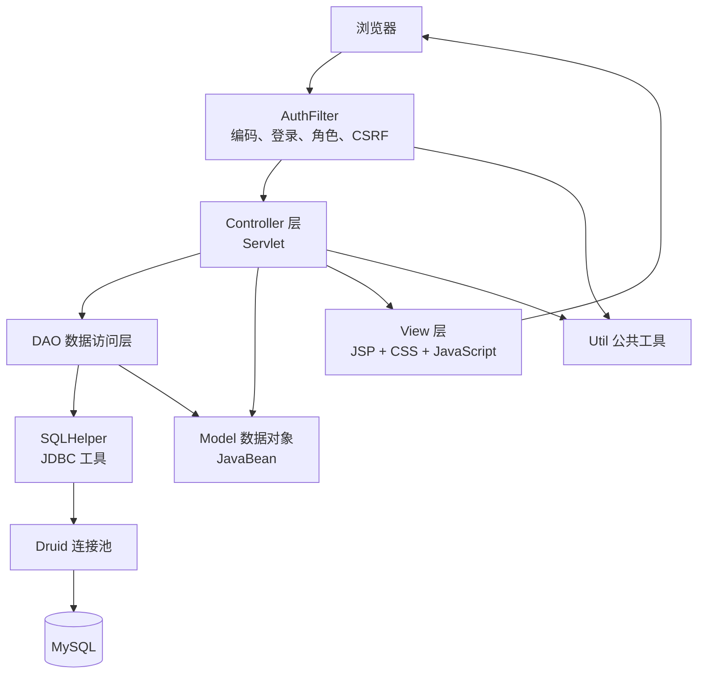
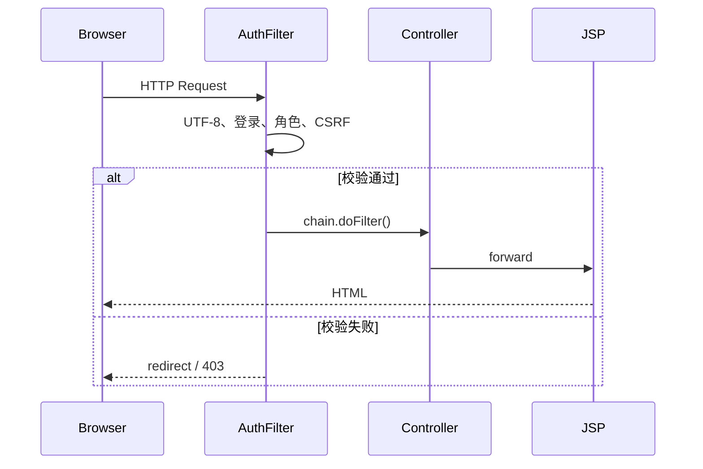
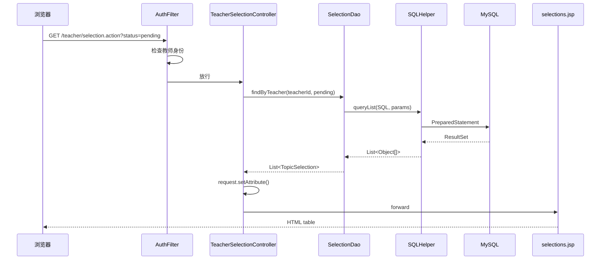
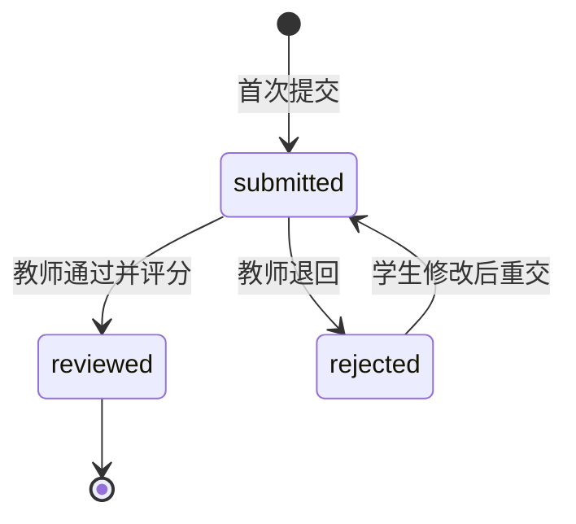
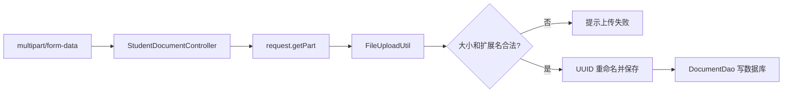

# 项目架构与技术细节讲解

## 1. 项目定位

毕业设计管理系统是一个基于传统 JavaWeb 技术的 MVC Web 应用，围绕管理员、教师、学生
三个角色完成：

- 用户与公告管理
- 教师课题发布
- 学生申请选题
- 教师审批
- 文档分阶段提交与审核
- 成绩和答辩安排
- 站内消息、日志和统计

核心技术：

```text
Java 8
JSP
Servlet
JavaBean
DAO
JDBC / PreparedStatement
Druid
MySQL
Maven
Tomcat
```

## 2. 总体架构



严格来说，本项目没有单独的 Service 包。简单业务由 Controller 调用 DAO，复杂且必须保证
原子性的选题、文档逻辑暂时放在 DAO 的事务方法中。

## 3. 各层职责

### 3.1 View 表示层

目录：

```text
WebContent/
├── admin/
├── teacher/
├── student/
├── WEB-INF/includes/
├── css/
└── js/
```

主要职责：

1. 显示 Controller 放入 request 域的数据。
2. 生成 HTML 表格和表单。
3. 提交业务请求到 `.action`。
4. 通过 JavaScript 完成交互。
5. 复用页头、侧边栏、分页和状态标签。

不应承担的职责：

- 编写 SQL
- 管理 JDBC 连接
- 判断复杂业务状态
- 完成跨表事务

本次调整把三个核心页面中的 DAO 查询移到了 Servlet：

- `teacher/selections.jsp`
- `teacher/documents.jsp`
- `student/documents.jsp`

### 3.2 Controller 控制层

目录：

```text
src/controller/
```

Controller 相当于交通调度中心，职责是：

1. 接收 HTTP 请求。
2. 读取 `request.getParameter()`。
3. 从 Session 获取登录用户。
4. 调用 DAO。
5. 将结果写入 request。
6. forward 到 JSP 或 redirect 到下一个 URL。

典型查询：

```java
List<TopicSelection> selections =
    dao.findByTeacher(user.getId(), status);
request.setAttribute("selections", selections);
request.getRequestDispatcher("/teacher/selections.jsp")
       .forward(request, response);
```

典型写操作：

```java
int result = dao.review(...);
if (result > 0) {
    response.sendRedirect("selection.action?msg=approved");
}
```

### 3.3 JavaBean 模型层

目录：

```text
src/bean/
```

JavaBean 的规范：

- 字段私有
- 提供无参构造器
- 提供公开 getter/setter
- 尽量不依赖 Servlet API

例如 `TopicSelection` 表示一条选题申请。它既保存：

- `studentId`
- `topicId`
- `status`

也保存 JOIN 后用于页面展示的：

- `studentName`
- `studentNo`
- `topicTitle`
- `teacherName`

这是一种课程项目常见的 Entity/DTO 合并方式，减少额外类数量。

### 3.4 DAO 数据访问层

目录：

```text
src/dao/
```

DAO 每个类负责一类数据：

| DAO | 主要职责 |
| --- | --- |
| `UserDao` | 用户、登录、角色统计 |
| `TopicDao` | 课题查询和 CRUD |
| `SelectionDao` | 申请、审批、名额事务 |
| `DocumentDao` | 文档状态、审核、版本事务 |
| `DefenseScheduleDao` | 答辩安排 |
| `MessageDao` | 收件箱、发件箱、已读状态 |
| `AnnouncementDao` | 公告 |
| `StatsDao` | 聚合统计 |

DAO 负责把数据库行映射为 Bean：

```text
ResultSet/Object[]
       ↓
new TopicSelection()
       ↓
setId/setStatus/setStudentName...
       ↓
List<TopicSelection>
```

### 3.5 DBUtil 基础设施层

文件：

```text
src/dbutil/SQLHelper.java
```

它对应课程讲义中的 SQLHelper，但增加 Druid 连接池。

提供：

```java
queryList(sql, params)
queryScalar(sql, params)
executeInsert(sql, params)
executeUpdate(sql, params)
getConnection()
```

为什么需要 SQLHelper：

- 避免每个 DAO 重复加载驱动。
- 避免重复编写 Connection 和 PreparedStatement。
- 统一参数绑定。
- 统一资源关闭。
- 方便事务方法获取连接。

### 3.6 Filter 横切层

文件：

```text
src/filter/AuthFilter.java
```

Filter 在 Controller 之前运行：



使用 Filter 的原因：

若每个 Servlet 都重复判断登录和角色，会产生大量重复代码，并容易遗漏。Filter 把共同逻辑
集中管理，这就是“横切关注点”。

### 3.7 Util 工具层

目录：

```text
src/util/
```

典型工具：

| 工具 | 作用 |
| --- | --- |
| `WebUtil` | 统一带 contextPath 重定向 |
| `PageUtil` | 解析分页参数 |
| `PasswordUtil` | BCrypt 和旧 MD5 兼容 |
| `EscapeUtil` | HTML 属性和正文转义 |
| `FileUploadUtil` | 文件类型、大小、命名 |
| `CsrfUtil` | CSRF Token |
| `ValidationUtil` | 输入格式校验 |
| `OperationLogUtil` | 写操作日志 |
| `MessageNotifyUtil` | 发送业务通知 |

工具类一般是无状态、可复用的小功能，不应该放具体页面业务。

## 4. MVC 的实际落地

以“教师查看选题申请”为例：



对应 MVC：

| MVC | 项目文件 |
| --- | --- |
| Model | `TopicSelection`、`SelectionDao` |
| View | `teacher/selections.jsp` |
| Controller | `TeacherSelectionController` |

## 5. Request、Session 和 Application 数据范围

### Request

生命周期：一次请求。

适合保存：

- 查询结果列表
- 当前筛选条件
- 当前文档
- 页面标题

例如：

```java
request.setAttribute("documents", documents);
```

### Session

生命周期：用户的一次会话。

适合保存：

- 登录用户
- 登录时间
- CSRF Token

不适合保存大列表，因为数据可能过期并占用服务器内存。

### Application/ServletContext

生命周期：整个 Web 应用。

项目中主要用于：

```java
getServletContext().getRealPath(...)
```

它不用于保存每个用户自己的数据。

## 6. JDBC 与连接池

课程早期写法：

```text
DriverManager.getConnection()
```

每次请求都新建物理连接，成本较高。

项目写法：

```text
SQLHelper
  ↓
Druid DataSource
  ↓
从连接池借 Connection
  ↓
close() 时归还连接池
```

Druid 没有改变 JDBC 编程模型，DAO 仍然使用：

- Connection
- PreparedStatement
- ResultSet

因此它是 JDBC 的性能增强，不是替代 JDBC 的 ORM 框架。

## 7. 事务和业务一致性

课程 CRUD 通常一条 SQL 就完成。项目中的选题审批需要同时修改：

1. 选题申请状态。
2. 课题已选人数。
3. 课题开放状态。

如果三步分开提交，中间失败就会造成数据不一致。因此使用：

```java
conn.setAutoCommit(false);
try {
    // 多条 SQL
    conn.commit();
} catch (Exception ex) {
    conn.rollback();
}
```

并发名额控制还使用：

```sql
SELECT ... FOR UPDATE
```

这相当于在事务中锁住相关行，避免两位教师同时批准最后一个名额。

## 8. 文档状态机

文档不是简单 CRUD，而是状态流转：



阶段顺序：

```text
选题 approved
   ↓
proposal reviewed
   ↓
midterm reviewed
   ↓
final reviewed
   ↓
具备答辩资格
```

这种规则由 Controller 和 DAO 共同校验，不能只依赖页面按钮隐藏。

## 9. 文件上传

上传链路：



文件上传与数据库写入是两种不同资源。本项目在数据库提交失败时删除本次新文件，减少孤儿文件。

## 10. 为什么这样设计

### 为什么 JSP 不直接写 SQL

- 页面和数据库高度耦合。
- SQL 难以复用。
- 测试困难。
- 页面代码混乱。

### 为什么使用 DAO

- 集中管理 SQL。
- 便于更换查询实现。
- Controller 不关心 JDBC 细节。
- Bean 映射逻辑可复用。

### 为什么使用 Controller

- 统一处理参数和业务结果。
- 决定 forward 或 redirect。
- 使 JSP 专注展示。

### 为什么保留 Scriptlet

课程示例主要使用 Scriptlet。为了与课堂代码容易对照，当前没有一次性改成 JSTL/EL。
但 Scriptlet 中只保留展示循环和简单判断，数据库查询逐步迁移到 Controller。

### 为什么暂时没有 Service 层

当前课程主线到 Controller + DAO 已经完整。直接增加完整 Service 层会扩大改造范围。项目当前采用：

```text
简单业务：Controller -> DAO
事务业务：Controller -> DAO transaction method
```

若后续需要多人协作、单元测试或更多跨模块流程，再加入 Service 层。

## 11. 目录快速讲解

```text
毕业设计管理系统/
├── src/
│   ├── bean/        JavaBean 数据对象
│   ├── controller/  Servlet 控制器
│   ├── dao/         SQL 与数据库访问
│   ├── dbutil/      JDBC 公共封装
│   ├── filter/      登录和权限过滤
│   └── util/        通用工具
├── WebContent/
│   ├── admin/       管理员 JSP
│   ├── teacher/     教师 JSP
│   ├── student/     学生 JSP
│   ├── WEB-INF/     Web 配置和公共 JSP
│   ├── css/
│   └── js/
├── sql/             初始化和迁移脚本
├── test/            JUnit 测试
└── pom.xml          Maven 配置
```

## 12. 推荐课堂讲解顺序

1. `User.java`：JavaBean。
2. `SQLHelper.java`：JDBC 公共步骤。
3. `UserDao.java`：DAO 和 PreparedStatement。
4. `LoginController.java`：request、response、Session。
5. `AuthFilter.java`：Filter。
6. `StudentTopicController.java`：标准 MVC 查询。
7. `TeacherSelectionController.java`：MVC + 写操作。
8. `SelectionDao.java`：事务和并发。
9. `StudentDocumentController.java`：Servlet 文件上传。
10. `AdminStatsController.java`：AJAX/JSON/ECharts。
