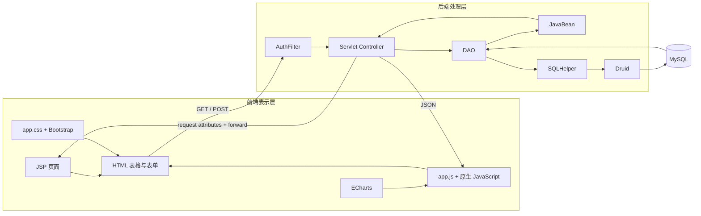
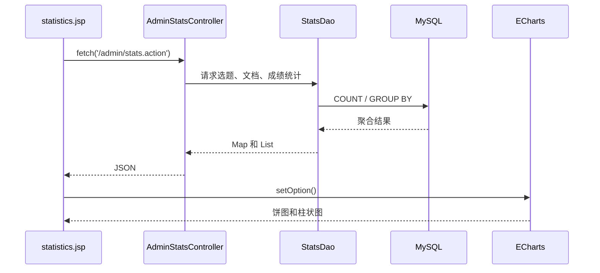
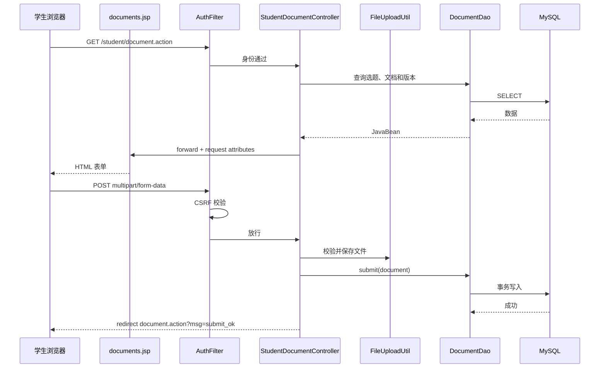

# 前后端实现与接口讲解

## 1. 系统是不是前后端分离

本项目不是 Vue、React 加 REST API 的前后端分离项目，而是传统 JavaWeb 的
**服务端渲染模式**：

```text
浏览器
  ↓ HTTP 请求
Servlet Controller
  ↓ 查询数据库、准备 JavaBean
JSP 在服务器生成 HTML
  ↓ HTTP 响应
浏览器显示页面
```

因此，答辩时可以这样描述：

> 系统逻辑上分为前端表示层和后端处理层，但部署上是一个 Maven WAR。前端采用 JSP、
> HTML、CSS、JavaScript 和 Bootstrap，后端采用 Servlet、JavaBean、DAO、JDBC、
> Druid 和 MySQL。页面主要由服务器端 JSP 渲染，统计模块使用 AJAX 获取 JSON。

这种结构与课程中的 JSP、Servlet、JDBC、MVC 综合案例一致。

## 2. 前后端总体结构



## 3. 前端技术实现

### 3.1 JSP 页面

前端页面位于：

```text
WebContent/
├── login.jsp
├── dashboard.jsp
├── admin/
├── teacher/
├── student/
└── WEB-INF/includes/
```

角色页面：

| 角色 | 主要页面 | 功能 |
| --- | --- | --- |
| 管理员 | `users.jsp` | 用户管理、角色和学院筛选 |
| 管理员 | `announcements.jsp` | 公告增删改 |
| 管理员 | `defenses.jsp` | 答辩安排和 Excel 导入 |
| 管理员 | `statistics.jsp` | 图表统计和 Excel 导出 |
| 管理员 | `messages.jsp`、`logs.jsp` | 消息和操作日志 |
| 教师 | `topics.jsp` | 发布和维护课题 |
| 教师 | `selections.jsp` | 审批学生选题 |
| 教师 | `documents.jsp` | 审核文档和评分 |
| 教师 | `students.jsp`、`defense.jsp` | 学生进度和答辩查看 |
| 学生 | `topics.jsp` | 浏览和申请课题 |
| 学生 | `my-selection.jsp` | 查看申请状态 |
| 学生 | `documents.jsp` | 分阶段提交文档 |
| 学生 | `grades.jsp`、`defense.jsp` | 查看成绩和答辩 |

### 3.2 公共页面组件

公共 JSP 放在 `WEB-INF/includes`，不能被浏览器直接访问，只能由其他 JSP include：

| 文件 | 作用 |
| --- | --- |
| `header.jsp` | HTML 头部、Bootstrap CSS、公共 CSS |
| `sidebar.jsp` | 三角色导航栏、用户信息、未读消息 |
| `footer.jsp` | 公共确认弹窗、Bootstrap JS、`app.js` |
| `pagination.jsp` | 分页导航 |
| `status-badge.jsp` | 业务状态徽章 |
| `csrf-meta.jsp` | 输出当前 Session 的 CSRF Token |

公共 include 的意义：

- 避免每个页面重复写页头、侧边栏和脚本。
- 修改导航时只改一处。
- 保持所有角色页面风格一致。

### 3.3 CSS 设计

项目使用两部分样式：

1. Bootstrap 5.3.3：表单、按钮、Modal、栅格布局。
2. `WebContent/css/app.css`：项目专属主题。

`app.css` 使用 CSS 变量统一主题：

```css
:root {
  --primary: #1e3a5f;
  --accent: #3b82f6;
  --bg: #f0f4f8;
  --success: #10b981;
  --danger: #ef4444;
}
```

主要组件：

- 固定侧边栏和顶部栏
- 统计卡片
- 内容卡片
- 现代化表格
- 课题卡片网格
- 状态徽章
- Toast 消息
- 响应式移动端导航

响应式设计：

```css
@media (max-width: 768px) {
  .sidebar { transform: translateX(-100%); }
  .main-content { margin-left: 0; }
}
```

### 3.4 JavaScript 交互

公共脚本：`WebContent/js/app.js`。

主要功能：

| 函数 | 作用 |
| --- | --- |
| `showToast()` | 显示成功或失败提示 |
| `togglePassword()` | 登录密码显示/隐藏 |
| `confirmAction()` | 删除等操作的二次确认 |
| `validateScore()` | 前端限制分数 0～100 |
| `injectCsrfToken()` | 给 POST 表单加入 CSRF Token |
| `initPageMessages()` | 将 URL 中的 `msg` 转成中文提示 |

前端校验用于改善体验，后端仍会再次校验。答辩时应强调：

> 前端校验可以被绕过，所以名额、权限、分数、文档阶段等关键规则都以后端和数据库校验
> 为准。

### 3.5 表单提交

普通写操作使用：

```html
<form action="../teacher/document.action" method="post">
```

文件上传使用：

```html
<form method="post" enctype="multipart/form-data">
```

Servlet 通过：

```java
request.getParameter("title");
request.getPart("file");
```

获取数据。

### 3.6 前端状态展示

数据库状态不会直接显示英文代码，而是通过状态徽章展示：

```text
pending   -> 待审批
approved  -> 已通过
submitted -> 待审核
reviewed  -> 已评阅
rejected  -> 已退回
open      -> 开放
closed    -> 已关闭
```

颜色含义：

- 绿色：通过、开放
- 黄色：等待处理
- 红色：驳回、关闭
- 蓝色：已提交

### 3.7 AJAX 和 ECharts

大多数页面由 JSP 直接渲染，管理员统计页是典型 AJAX 模块：



这是系统中最接近“前后端分离接口”的部分。

## 4. 后端技术实现

### 4.1 Filter 请求入口

所有请求先经过：

```java
@WebFilter("/*")
public class AuthFilter implements Filter
```

Filter 完成：

1. 设置 UTF-8。
2. 设置安全响应头。
3. 禁止直接访问 `/uploads/`。
4. 判断是否登录。
5. 校验数据库中的账号状态和角色是否改变。
6. 按 `/admin/`、`/teacher/`、`/student/` 控制角色。
7. 校验非安全方法的 CSRF Token。

所以后端不是靠“页面不显示按钮”实现权限，而是在请求进入 Controller 前统一拦截。

### 4.2 Servlet Controller

后端共有 15 个 Servlet Controller：

| Controller | URL | 职责 |
| --- | --- | --- |
| `LoginController` | `/login.action` | 登录认证 |
| `LogoutController` | `/logout.action` | 注销 Session |
| `AdminUserController` | `/admin/user.action` | 用户 CRUD |
| `AdminAnnouncementController` | `/admin/announcement.action` | 公告 CRUD |
| `AdminDefenseController` | `/admin/defense.action` | 答辩安排 |
| `AdminDefenseImportController` | `/admin/defense-import.action` | Excel 导入 |
| `AdminExportController` | `/admin/export.action` | Excel 导出 |
| `AdminStatsController` | `/admin/stats.action` | JSON 统计接口 |
| `TeacherTopicController` | `/teacher/topic.action` | 课题 CRUD |
| `TeacherSelectionController` | `/teacher/selection.action` | 选题审批 |
| `TeacherDocumentController` | `/teacher/document.action` | 文档审核 |
| `StudentTopicController` | `/student/topic.action` | 浏览与申请 |
| `StudentDocumentController` | `/student/document.action` | 文档上传 |
| `MessageController` | `/message.action` | 消息操作 |
| `DownloadController` | `/download.action` | 鉴权下载 |

### 4.3 查询请求与写请求

查询使用 GET：

```text
GET action
→ Controller 查询 DAO
→ request.setAttribute()
→ forward JSP
```

写操作使用 POST：

```text
POST action
→ Controller 校验并修改数据库
→ redirect GET action
→ 再查询并展示
```

这叫 PRG（Post/Redirect/Get），可以避免刷新页面导致重复新增、重复审批。

### 4.4 JavaBean

`src/bean` 中有 9 个 JavaBean：

- `User`
- `Topic`
- `TopicSelection`
- `Document`
- `DocumentVersion`
- `DefenseSchedule`
- `Announcement`
- `Message`
- `OperationLog`

Bean 用于：

```text
数据库记录
  ↕
DAO
  ↕
Controller
  ↕
JSP
```

例如 `Document` 不仅保存表字段，还保存 JOIN 得到的学生姓名、学号和课题标题，方便页面展示。

### 4.5 DAO 数据访问

后端有 10 个 DAO，每个 DAO 对应一个业务数据域。

DAO 的基本模式：

```java
List<Object[]> rows = SQLHelper.queryList(sql, params);
for (Object[] row : rows) {
    Document document = new Document();
    document.setId(((Number) row[0]).intValue());
    ...
}
```

DAO 负责：

- SQL
- PreparedStatement 参数
- 数据行映射
- 查询筛选
- 部分必须与数据库操作一起完成的事务规则

### 4.6 SQLHelper 和 Druid

`SQLHelper` 是课程 SQLHelper 的增强版本：

```text
jdbc.properties
  ↓
DruidDataSourceFactory
  ↓
DataSource
  ↓
Connection
  ↓
PreparedStatement
```

通用方法：

- `queryList`
- `queryScalar`
- `executeInsert`
- `executeUpdate`
- `getConnection`

Druid 的作用是复用连接。调用 `conn.close()` 时不是销毁物理连接，而是归还连接池。

### 4.7 事务控制

选题申请、审批和文档提交不是单条 SQL，需要事务：

```java
conn.setAutoCommit(false);
try {
    // 锁定、检查、更新多个表
    conn.commit();
} catch (Exception ex) {
    conn.rollback();
}
```

并发控制使用：

```sql
SELECT ... FOR UPDATE
```

例如最后一个课题名额被两个教师同时审批时，行锁保证只有一个事务能够成功。

### 4.8 文件上传和下载

上传：

```java
@MultipartConfig
Part filePart = request.getPart("file");
```

`FileUploadUtil` 负责：

- 最大 10MB
- 只允许 pdf/doc/docx/zip/rar
- 禁止 jsp/exe/bat 等类型
- UUID 重命名

下载：

- 管理员可以访问上传文件。
- 教师只能访问自己指导课题的文档。
- 学生只能访问自己目录的文档。
- 直接访问 `/uploads/...` 会被 Filter 返回 404。

### 4.9 Excel 导入导出

Apache POI 用于：

- 导入答辩安排：读取 Excel 行，按学号匹配学生。
- 导出成绩：创建 `.xlsx`，输出学号、课题、教师、阶段成绩、答辩信息。

这体现了系统与外部办公文件的数据交换能力。

## 5. 主要前后端接口

| 方法 | URL | 参数/返回 | 前端入口 |
| --- | --- | --- | --- |
| POST | `/login.action` | username、password | `login.jsp` |
| GET | `/student/topic.action` | keyword、college，forward 课题列表 | 学生侧边栏 |
| POST | `/student/topic.action` | topicId、applyReason | 课题申请 Modal |
| GET | `/teacher/selection.action` | status，forward 申请列表 | 教师侧边栏 |
| POST | `/teacher/selection.action` | id、action、reviewComment | 审批 Modal |
| GET | `/student/document.action` | type，forward 文档和版本 | 学生侧边栏 |
| POST | `/student/document.action` | docType、title、content、file | 文档表单 |
| GET | `/teacher/document.action` | type、status | 文档审核页 |
| POST | `/teacher/document.action` | id、action、score、feedback | 审核 Modal |
| GET | `/admin/stats.action` | JSON | `fetch()` |
| GET | `/admin/export.action` | Excel 文件 | 导出按钮 |
| GET | `/download.action` | path，文件流 | 附件链接 |

## 6. 一次完整前后端交互示例

以学生提交开题报告为例：



## 7. 前后端设计优点与不足

### 优点

- 与课程 JSP/Servlet 技术栈一致。
- 后端权限逻辑集中在 Filter。
- Controller、DAO、Bean 职责较清楚。
- 不依赖大型框架，便于展示底层原理。
- 写操作采用 PRG。
- 前后端均有输入校验。

### 不足

- 部分非核心 JSP 仍直接创建 DAO，后续可继续迁移到 Controller。
- 尚未完整使用 EL/JSTL，Scriptlet 较多。
- 没有独立 Service 层，复杂事务方法位于 DAO。
- 统计 JSON 目前手工拼接，规模扩大后可统一序列化。
- 前端依赖 CDN，离线部署时应改成本地静态资源。

## 8. 答辩简述模板

> 本项目采用传统 JavaWeb 服务端渲染架构。前端由 JSP、HTML、CSS、原生 JavaScript、
> Bootstrap 和 ECharts 组成；后端由 Servlet Controller、JavaBean、DAO、SQLHelper、
> Druid 和 MySQL 组成。请求首先经过 AuthFilter 完成登录、角色和 CSRF 校验，再由
> Servlet 调用 DAO 查询数据库。查询结果封装成 JavaBean 放入 request 域，由 JSP 渲染；
> 写操作完成后采用 Post/Redirect/Get。统计模块通过 fetch 调用 JSON 接口，是项目中的
> AJAX 交互。整个结构保留了课程中的 JSP、Servlet、JDBC 和 MVC 核心技术。
