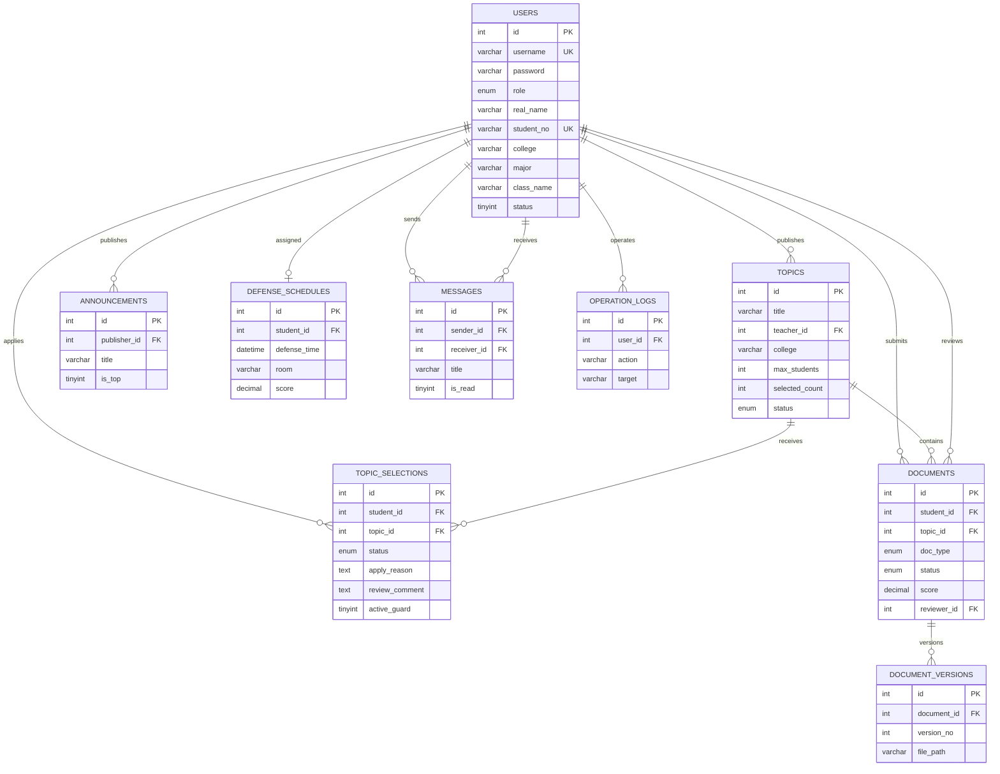
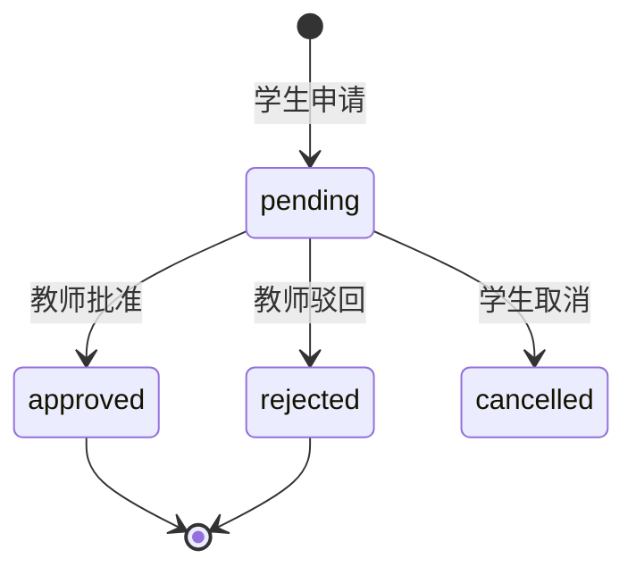

# 数据库设计说明

## 1. 数据库概况

数据库名称：

```text
graduation_design
```

数据库引擎和字符集：

```text
MySQL 8
InnoDB
utf8mb4
utf8mb4_unicode_ci
```

选择 InnoDB 的原因：

- 支持事务。
- 支持行级锁。
- 支持外键。
- 适合选题审批和文档提交等多表一致性操作。

系统共有 9 张业务表：

1. `users`
2. `topics`
3. `topic_selections`
4. `documents`
5. `document_versions`
6. `announcements`
7. `defense_schedules`
8. `messages`
9. `operation_logs`

当前本机数据库数据量（2026-06-22 查询）：

| 表 | 记录数 |
| --- | ---: |
| users | 8 |
| topics | 6 |
| topic_selections | 5 |
| documents | 4 |
| document_versions | 0 |
| announcements | 3 |
| defense_schedules | 3 |
| messages | 7 |
| operation_logs | 59 |

当前账号：

- 管理员 1 个
- 教师 2 个
- 学生 5 个

注意：`sql/init.sql` 是全新初始化脚本，包含更丰富的演示数据；当前本机数据库来自旧版本持续迁移，
所以当前记录数和重新执行初始化脚本后的数量可能不同。

## 2. ER 关系图



## 3. users 用户表

作用：统一保存管理员、教师和学生。

核心字段：

| 字段 | 含义 | 设计 |
| --- | --- | --- |
| `id` | 用户主键 | 自增 |
| `username` | 登录账号 | 唯一 |
| `password` | 密码摘要 | 长度 128，兼容 BCrypt |
| `role` | 用户角色 | admin/teacher/student |
| `real_name` | 真实姓名 | 必填 |
| `student_no` | 学号 | 学生唯一，教师和管理员为空 |
| `college` | 学院代码 | 用代码减少重复文本 |
| `major` | 专业代码 | 与学院组合解释 |
| `class_name` | 班级 | 学生信息 |
| `status` | 启用状态 | 1 启用，0 停用 |

为什么三类角色共用一张表：

- 登录逻辑统一。
- Session 只需保存一种 User 对象。
- 消息、公告、日志都可以统一关联用户。
- 课程项目规模下比拆成三张账号表更简单。

不足：数据库外键无法直接保证 `topics.teacher_id` 一定是教师，需要后端校验角色。

## 4. topics 课题表

作用：保存教师发布的毕业设计课题。

核心字段：

| 字段 | 含义 |
| --- | --- |
| `teacher_id` | 发布教师 |
| `college` | 课题所属学院 |
| `max_students` | 最大人数 |
| `selected_count` | 当前已批准人数 |
| `status` | open/closed |

`selected_count` 是冗余计数字段。虽然可以实时 COUNT 选题表，但保留它的原因是：

- 列表展示更快。
- 容易判断是否满员。
- 审批事务可以原子更新并自动关闭课题。

代价是必须通过事务保证它与 approved 申请数一致。

## 5. topic_selections 选题申请表

作用：记录学生申请课题及教师审批。

状态：



关键设计：`active_guard`

```sql
active_guard TINYINT GENERATED ALWAYS AS (
  CASE WHEN status IN ('pending','approved') THEN 1 ELSE NULL END
) STORED
```

配合：

```sql
UNIQUE KEY uk_student_active_selection(student_id, active_guard)
```

MySQL 唯一索引允许多个 NULL，所以：

- 同一学生只能有一条 pending 或 approved。
- 可以保留多条历史 rejected/cancelled。

这是“一人只能有一个有效选题”的数据库兜底。

## 6. documents 文档表

作用：保存学生当前阶段文档。

文档类型：

- `proposal`：开题报告
- `midterm`：中期检查
- `final`：终稿

状态：

- `draft`
- `submitted`
- `reviewed`
- `rejected`

约束：

```sql
UNIQUE(student_id, doc_type)
```

表示每名学生每个阶段只有一条“当前文档”。

分数约束：

```sql
CHECK(score IS NULL OR (score >= 0 AND score <= 100))
```

后端和数据库双重保证分数范围。

阶段顺序：


## 7. document_versions 文档版本表

作用：学生修改被退回文档时，保存旧标题、正文和文件路径。

关系：

```text
documents 1 ---- N document_versions
```

唯一约束：

```sql
UNIQUE(document_id, version_no)
```

设计思想：

- `documents` 保存当前版本。
- `document_versions` 保存历史快照。
- 页面查询当前版本快，历史仍可追溯。

## 8. defense_schedules 答辩安排表

作用：保存答辩时间、教室、分组、分数和备注。

约束：

```sql
UNIQUE(student_id)
```

确保每个学生最多一条答辩安排。

答辩分数同样限制在 0～100。

后端安排前检查：

- 用户是启用学生。
- 存在 approved 选题。
- 终稿已 reviewed。
- 没有重复答辩记录。

## 9. announcements 公告表

作用：管理员发布系统通知。

字段：

- 标题
- 内容
- 发布者
- 是否置顶
- 发布时间

查询时通常按 `is_top DESC, created_at DESC` 排序，使置顶公告优先。

## 10. messages 消息表

作用：管理员、教师和学生之间发送站内消息。

一条记录同时关联：

- `sender_id`
- `receiver_id`

读取消息详情时必须满足：

```sql
sender_id = 当前用户
OR receiver_id = 当前用户
```

防止通过修改 URL 中的消息 ID 查看他人消息。

当前 `is_read` 只表示接收方是否已读。

## 11. operation_logs 操作日志表

作用：记录关键操作：

- 登录
- 新增、修改、删除
- 申请和审批
- 文档提交和审核
- Excel 导入导出

字段设计：

| 字段 | 含义 |
| --- | --- |
| `user_id` | 操作人 |
| `action` | 动作代码 |
| `target` | 目标模块 |
| `detail` | 详细描述 |
| `created_at` | 操作时间 |

日志用于问题追踪和答辩展示，不用于恢复数据。

## 12. 主键、外键和唯一约束

### 主键

所有表使用自增整数主键，优点是：

- JOIN 简单。
- 索引体积小。
- 适合课程项目。

### 外键

外键保证引用的数据存在，例如：

```text
topic.teacher_id 必须存在于 users
document.topic_id 必须存在于 topics
```

### 唯一约束

| 约束 | 业务意义 |
| --- | --- |
| `users.username` | 登录名不重复 |
| `users.student_no` | 学号不重复 |
| `student_id + active_guard` | 一人一个有效选题 |
| `student_id + doc_type` | 每阶段一个当前文档 |
| `document_id + version_no` | 版本号不重复 |
| `defense_schedules.student_id` | 一人一个答辩安排 |

## 13. 索引设计

当前主键、唯一键和外键列会建立索引，覆盖主要课程项目查询。

如果数据量扩大，建议增加：

```sql
INDEX idx_selection_topic_status(topic_id, status)
INDEX idx_document_topic_status(topic_id, status)
INDEX idx_message_receiver_read(receiver_id, is_read, created_at)
INDEX idx_log_user_time(user_id, created_at)
INDEX idx_topic_college_status(college, status)
```

当前演示数据量很小，不需要过度索引。

## 14. 规范化与冗余

大部分结构符合第三范式：

- 用户、课题、申请、文档分别建表。
- 多对多关系通过选题申请表表示。
- 文档历史拆为版本表。

有意保留的冗余：

- `topics.selected_count`
- `users.department` 兼容旧数据

`selected_count` 用于性能和名额控制，必须通过事务维护；`department` 是迁移兼容字段，新功能主要使用
`college/major/class_name`。

## 15. 事务边界

### 选题申请事务

```text
锁定学生
→ 检查有效申请
→ 锁定课题
→ 检查名额
→ 插入申请
→ commit
```

### 选题审批事务

```text
锁定申请
→ 验证教师所有权
→ 锁定学生和课题
→ 检查一人一题和名额
→ 更新申请
→ selected_count + 1
→ 满员关闭课题
→ commit
```

### 文档提交事务

```text
锁定选题
→ 检查阶段
→ 锁定当前文档
→ 保存旧版本
→ 更新或插入当前文档
→ commit
```

任一步失败都 rollback。

## 16. 初始化与迁移

全新部署：

```text
sql/init.sql
```

旧数据库升级：

```text
sql/migrate_business_logic_20260619.sql
```

二者区别：

- `init.sql` 会 DROP 并重建表，适合全新环境。
- 迁移脚本保留旧数据并增加字段、索引和约束。

## 17. 数据库设计答辩模板

> 数据库采用 MySQL 8 和 InnoDB，共设计 9 张表。users 统一存储三类账号；topics 和
> topic_selections 形成教师发布、学生申请的核心关系；documents 保存当前阶段文档，
> document_versions 保存历史版本；defense_schedules 保存答辩；messages、
> announcements 和 operation_logs 支撑辅助业务。数据库通过外键保证引用完整性，通过
> 唯一索引保证一人一题、每阶段一份当前文档和一人一条答辩安排，通过 CHECK 约束保证
> 分数范围。选题审批和文档提交使用 InnoDB 事务及行锁，保证并发情况下的数据一致性。
