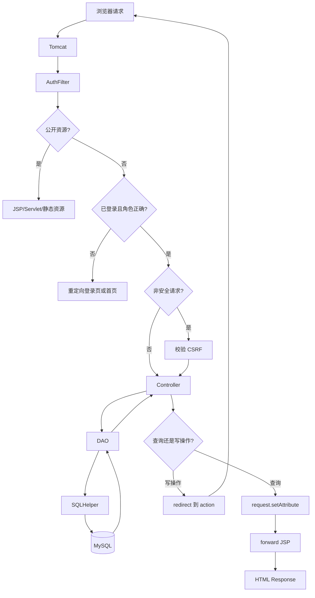
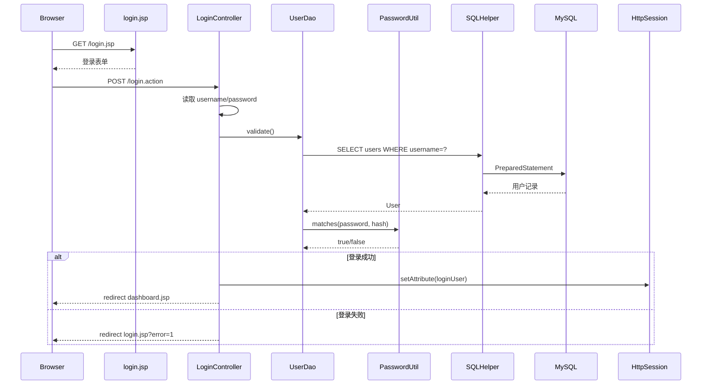
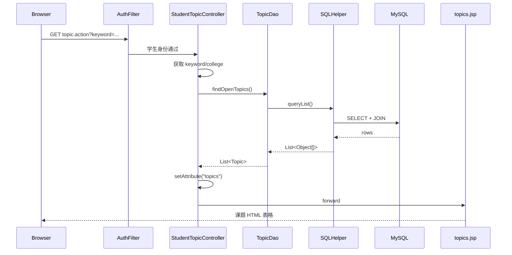
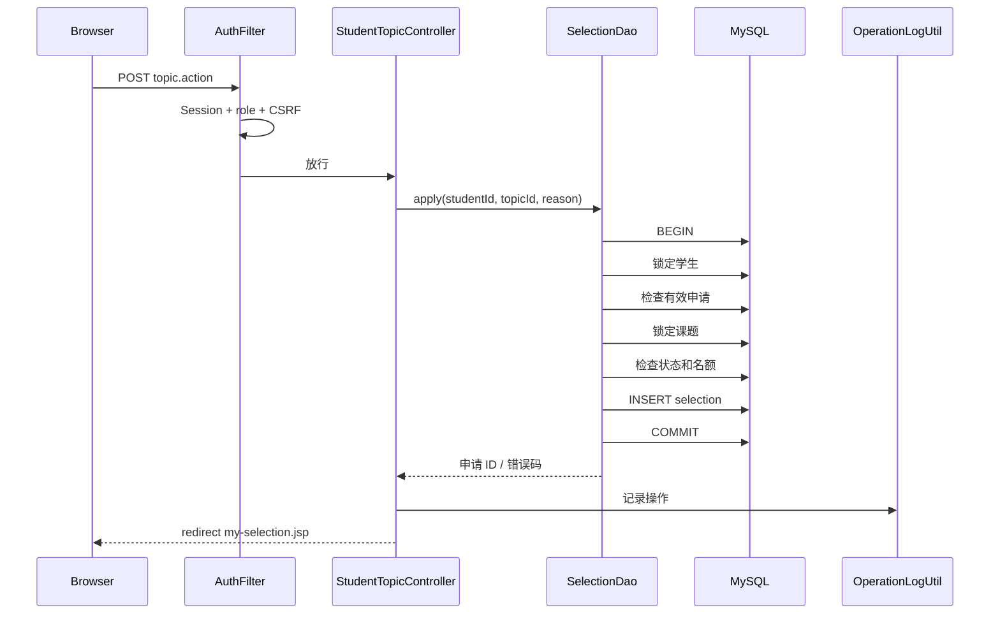
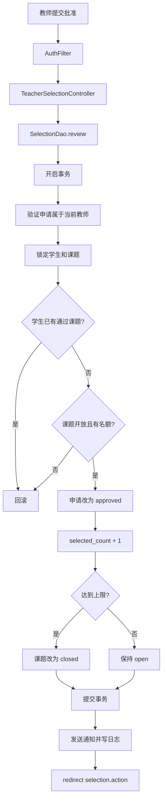
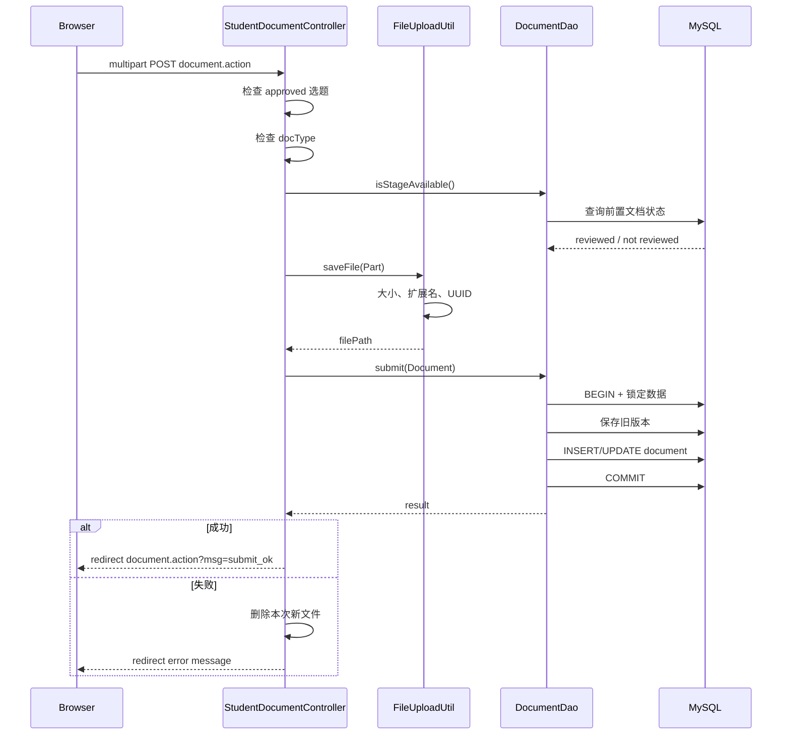
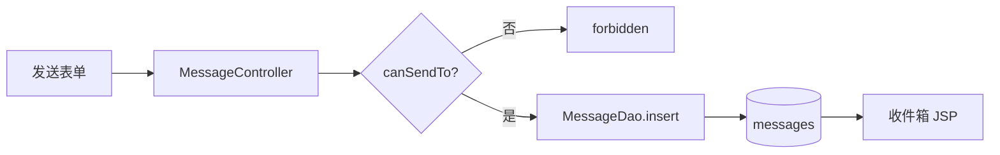
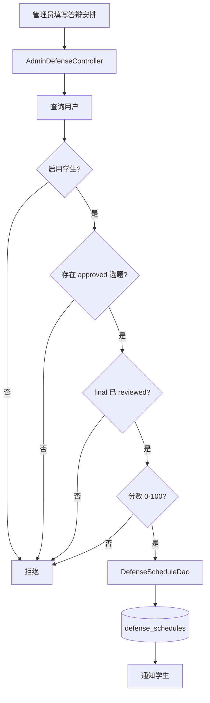
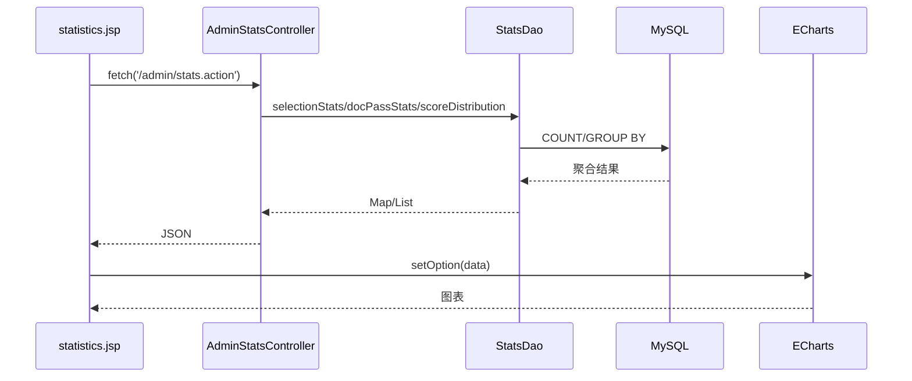
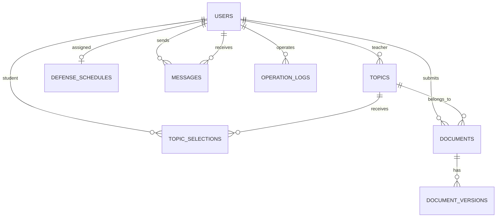

# 项目数据流与请求生命周期

## 1. HTTP 请求总流程



## 2. 登录数据流



关键知识点：

- 表单 POST
- request 参数
- DAO 查询
- PreparedStatement
- Session
- response redirect

## 3. 学生浏览课题数据流

入口：

```text
GET /student/topic.action
```



数据对象变化：

```text
数据库记录
  ↓
Object[]
  ↓
Topic JavaBean
  ↓
List<Topic>
  ↓
request 属性
  ↓
JSP 表格行
```

## 4. 学生申请课题数据流



为什么要事务：

```text
检查是否已有选题
+ 检查课题名额
+ 插入申请
```

必须作为一个整体，否则两个并发请求可能同时通过检查。

## 5. 教师审批选题数据流

### 5.1 查询页面

```text
GET /teacher/selection.action?status=pending
```

Controller 查询后：

```java
request.setAttribute("selections", selections);
request.setAttribute("statusFilter", status);
forward("/teacher/selections.jsp");
```

JSP 只负责：

- 遍历 `List<TopicSelection>`
- 输出学生、课题和状态
- 生成批准/驳回表单

### 5.2 审批写操作



## 6. 学生文档提交数据流

### 6.1 页面加载

```text
GET /student/document.action?type=proposal
```

Controller 准备：

- `approvedSelection`
- `currentDocument`
- `documentVersions`
- `activeType`
- `typeNames`

然后 forward 到 `student/documents.jsp`。

这体现课程 MVC 的关键原则：

> JSP 接收数据并展示，不在页面中创建 SelectionDao、DocumentDao 和
> DocumentVersionDao。

### 6.2 上传和提交



## 7. 教师文档审核数据流

```text
GET /teacher/document.action
        ↓
Controller 查询教师课题下的 documents
        ↓
request.setAttribute("documents")
        ↓
forward teacher/documents.jsp
```

写操作：

```text
POST /teacher/document.action
        ↓
校验 score
        ↓
DocumentDao.review()
        ↓
WHERE document.status='submitted'
AND topic.teacher_id=当前教师
        ↓
更新 status/score/feedback/reviewer
        ↓
通知学生
        ↓
redirect GET 页面
```

## 8. 消息数据流



查看消息时 DAO 使用：

```sql
WHERE id=?
AND (sender_id=? OR receiver_id=?)
```

避免用户通过修改消息 ID 查看其他人的消息。

## 9. 答辩安排数据流



## 10. 统计 AJAX 数据流



对应课程知识：

- JavaScript `fetch`
- Servlet 输出响应
- DAO 聚合查询
- JSON
- DOM/图表渲染

## 11. 页面跳转规则

### 查询请求

```text
GET action
  ↓
Controller 查询
  ↓
request 属性
  ↓
forward JSP
```

### 写请求

```text
POST action
  ↓
Controller 修改
  ↓
redirect GET action
  ↓
重新查询
  ↓
forward JSP
```

第二种叫 PRG：

```text
Post -> Redirect -> Get
```

优点：

- 刷新不会重复新增或审批。
- 地址栏是可再次访问的 GET URL。
- 页面显示的数据来自最新数据库状态。

## 12. 三类角色数据流边界

| 角色 | URL 前缀 | 允许的核心操作 |
| --- | --- | --- |
| 管理员 | `/admin/` | 用户、公告、答辩、统计、日志 |
| 教师 | `/teacher/` | 课题、选题审批、文档评阅 |
| 学生 | `/student/` | 浏览课题、申请、提交文档、查看成绩 |

`AuthFilter` 根据 URL 前缀和 Session 中的角色统一判断，避免只依赖页面是否显示链接。

## 13. 数据库主要关系



## 14. 从课程示例到当前项目的数据流升级

### classwork3

```text
JSP -> DAO -> JDBC -> MySQL
```

适合解释最基础的数据访问。

### classwork4/讲义第四、第五版

```text
Servlet -> DAO -> SQLHelper -> MySQL
       \-> JSP
```

引入 MVC 和 Controller。

### 当前项目

```text
Filter -> Controller -> DAO -> SQLHelper/Druid -> MySQL
                    \-> JSP
```

新增权限、连接池和事务，但主链路与课程完全一致。
