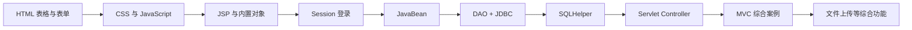

# 课程内容与项目技术栈对照

## 1. 对照目的

本文件把 `classwork1`～`classwork5`、`homework1`、`homework2` 和
`2026-05-15讲义` 中出现的知识点，与毕业设计管理系统中的实际代码逐项对应。

结论先行：

> 本项目没有偏离课程主线。它仍然是 JSP、Servlet、JavaBean、DAO、JDBC、
> MySQL 和 Tomcat 组成的传统 JavaWeb 项目，只是在课程案例基础上增加了连接池、
> 事务、安全校验、Excel 和图表等综合功能。

## 2. 课程技术演进

| 课程目录 | 主要内容 | 项目中的对应实现 |
| --- | --- | --- |
| `homework1` | HTML 标签、表格、表单、HTML5 | 所有 JSP 页面的表格、表单、语义化布局 |
| `homework2` | CSS、JavaScript、DOM 交互 | `WebContent/css/app.css`、`WebContent/js/app.js` |
| `classwork1` | JSP 基础语法、表单、Session、JavaBean | JSP Scriptlet、登录表单、`User` Bean、Session 用户 |
| `classwork2` | request、response、session、out | Controller 读取参数、forward/redirect、登录 Session |
| `classwork3` | JSP + JavaBean + DAO + JDBC | `bean`、`dao`、`SQLHelper`、MySQL 数据表 |
| `2026-05-15讲义` 第一～三版 | CRUD、DAO、SQLHelper 演进 | 用户、课题、公告等 CRUD 和通用 JDBC 工具 |
| `2026-05-15讲义` 第四～五版 | Servlet Controller、MVC | `src/controller` 中的 15 个 Servlet |
| `classwork4` | Controller + DAO + Bean 的 MVC 综合案例 | `.action` 控制器、request 域、JSP 展示 |
| `classwork5` | Servlet、验证码、文件上传 | `@MultipartConfig`、`Part`、登录失败锁定、上传校验 |

课程路线可以概括为：



毕业设计管理系统正是在这条路线的最后阶段进行综合。

## 3. 逐项技术对应

### 3.1 HTML、表格和表单

课程示例：

- `homework1/table-demo.jsp`
- `homework1/form-demo.jsp`
- `classwork1/form.jsp`

项目对应：

- `WebContent/admin/users.jsp`：用户列表和新增、编辑表单
- `WebContent/teacher/topics.jsp`：课题表格和课题表单
- `WebContent/student/topics.jsp`：课题浏览和申请表单
- `WebContent/teacher/documents.jsp`：文档审核表单

课程中的单个表单在项目中扩展成了完整的业务表单，但提交原理没有变化：

```text
用户填写 input/textarea/select
        ↓
浏览器提交 name=value
        ↓
Servlet 使用 request.getParameter() 读取
```

### 3.2 CSS 和 JavaScript

课程示例：

- `homework2/assets/style.css`
- `homework2/assets/experiment2.js`

项目对应：

- `WebContent/css/app.css`
- `WebContent/js/app.js`

JavaScript 主要完成：

- 弹窗操作
- 表单确认
- 分数范围提示
- CSRF 隐藏字段注入
- URL 消息提示
- ECharts 图表加载

这些仍属于原生 JavaScript 和 DOM 操作，没有引入 Vue、React 等课程外框架。

### 3.3 JSP 基础语法

课程示例使用：

```jsp
<% Java 代码 %>
<%= 表达式 %>
<%@ page ... %>
```

项目中的 JSP 继续使用同类写法，例如：

```jsp
<%@ page import="bean.*,java.util.*" %>
<%
  User loginUser = (User) session.getAttribute("loginUser");
%>
<%= loginUser.getRealName() %>
```

因此项目与课程讲解方式一致。项目暂未使用 JSTL 和 EL，避免突然切换到课程中未重点使用的写法。

### 3.4 JSP 内置对象

| 内置对象 | 课程用途 | 项目用途 |
| --- | --- | --- |
| `request` | 获取表单参数 | 获取筛选条件、业务参数、request 域数据 |
| `response` | 页面跳转 | `sendRedirect()`、错误状态返回 |
| `session` | 保存登录状态 | 保存 `loginUser`、登录时间、CSRF Token |
| `application` | Web 应用上下文 | ServletContext 获取上传目录 |
| `out` | 页面输出 | JSP 表达式和动态 HTML 输出 |

项目中更推荐在 Servlet 中处理 request/response，然后把结果交给 JSP。

### 3.5 Session 登录

课程示例：

```text
login.jsp -> check.jsp -> session-home.jsp -> logout.jsp
```

项目对应：

```text
login.jsp -> LoginController -> Session -> dashboard.jsp
                                  ↓
                              AuthFilter
```

项目保留了课程的核心机制：

```java
session.setAttribute("loginUser", user);
```

区别是项目将登录校验放入 Servlet，将每次请求的权限判断放入 Filter，职责更加清晰。

### 3.6 JavaBean

课程 `Customer.java` 使用私有字段和 getter/setter。

项目 `src/bean` 中的类完全遵循同一规范：

- `User`
- `Topic`
- `TopicSelection`
- `Document`
- `DocumentVersion`
- `DefenseSchedule`
- `Announcement`
- `Message`
- `OperationLog`

JavaBean 的作用是：

1. 把数据库的一行记录封装成 Java 对象。
2. 在 DAO、Controller、JSP 之间传递结构化数据。
3. 避免在页面中直接操作 `ResultSet`。

### 3.7 DAO 和 JDBC

`classwork3` 的链路是：

```text
list.jsp -> CustomerDao -> DriverManager -> MySQL
```

项目中的对应链路是：

```text
Servlet -> XxxDao -> SQLHelper -> Druid DataSource -> MySQL
```

课程版 `CustomerDao` 展示了 JDBC 的基本步骤：

1. 加载驱动。
2. 获取 Connection。
3. 创建 Statement/PreparedStatement。
4. 执行 SQL。
5. 遍历 ResultSet。
6. 关闭连接。

项目中的 `SQLHelper` 把这些重复步骤统一封装，DAO 只保留 SQL 和对象映射。这是课程
`SQLHelper` 思路的直接延伸。

### 3.8 PreparedStatement

课程后期案例已经使用参数化 SQL：

```java
String sql = "insert into customers values(?,?,?)";
```

项目全面使用 `?` 占位符：

```java
SQLHelper.queryList(
    "SELECT ... FROM users WHERE username=?", username);
```

这样既符合课程内容，也避免把用户输入直接拼进 SQL。

### 3.9 Servlet Controller

`classwork4` 使用 `CustomerController` 根据 `opttype` 处理 CRUD。

项目使用相同思想，但按业务角色拆分控制器：

```text
AdminUserController
TeacherTopicController
TeacherSelectionController
TeacherDocumentController
StudentTopicController
StudentDocumentController
```

例如教师查看选题：

```text
GET /teacher/selection.action
        ↓
TeacherSelectionController.doGet()
        ↓
SelectionDao.findByTeacher()
        ↓
request.setAttribute("selections", selections)
        ↓
forward 到 selections.jsp
```

本次课程化调整后，教师选题审核、教师文档审核和学生文档提交页面均改为由 Servlet
准备数据，JSP 不再直接创建对应 DAO。

### 3.10 forward 和 redirect

项目同时展示两种跳转方式。

查询页面使用 forward：

```java
request.setAttribute("documents", documents);
request.getRequestDispatcher("/teacher/documents.jsp")
       .forward(request, response);
```

写操作完成后使用 redirect：

```java
response.sendRedirect("document.action?msg=reviewed");
```

区别：

| 对比 | forward | redirect |
| --- | --- | --- |
| 请求次数 | 1 次 | 2 次 |
| 地址栏 | 不变化 | 变化 |
| request 数据 | 可以保留 | 不保留 |
| 适用场景 | 查询后显示 | 新增、修改、删除后跳转 |

项目的写操作采用 Post/Redirect/Get，可以避免刷新页面重复提交。

### 3.11 文件上传

`classwork5` 展示 Servlet 文件上传。

项目对应：

```java
@MultipartConfig(...)
Part filePart = request.getPart("file");
```

项目额外增加：

- 10MB 大小限制
- 扩展名白名单
- UUID 文件名
- 上传失败清理
- 下载身份校验

基础原理与课程一致，额外内容属于安全增强。

## 4. 当前项目比课程案例多出的内容

| 增强内容 | 是否保留 | 原因 |
| --- | --- | --- |
| Druid 连接池 | 保留 | 仍属于 JDBC，只优化 Connection 管理 |
| JDBC 事务 | 保留 | 保证选题和文档数据一致 |
| `SELECT ... FOR UPDATE` | 保留 | 防止课题名额并发超选 |
| BCrypt | 保留 | 比明文或普通 MD5 更合理 |
| CSRF、XSS 防护 | 保留 | 作为安全增强说明 |
| Apache POI | 保留 | 支持课程设计的 Excel 功能 |
| ECharts | 保留 | 属于前端综合展示 |
| 操作日志和通知 | 保留 | 支撑完整业务闭环 |
| Gson | 移除 | 源码未实际使用，避免无关依赖 |

这些功能应在报告中标为“在课程核心技术之上的扩展”，而不是作为新的基础框架。

## 5. 项目与课程案例的主要差异

| 项目 | 课程案例 | 当前系统 |
| --- | --- | --- |
| 业务规模 | 单页面或单表 CRUD | 三角色、多业务表、状态流转 |
| 控制器 | 一个 Servlet 处理客户 CRUD | 按角色和模块拆分多个 Servlet |
| 数据访问 | DriverManager 或简单 SQLHelper | SQLHelper + Druid + 事务 |
| 页面取数 | JSP 直接调用 DAO 较多 | 核心流程逐步改为 Controller 传值 |
| 登录 | 固定账号或简单 DAO | 数据库账号、Session、Filter、角色权限 |
| 文件上传 | 演示上传成功 | 上传、版本、权限、状态机一体化 |

## 6. 本次课程化调整

为了更接近 `classwork4` 和讲义第四、第五版的 MVC 结构，本次进行了以下小幅调整：

1. `TeacherSelectionController` 增加 `doGet()`，负责加载选题申请。
2. `TeacherDocumentController` 增加 `doGet()`，负责加载文档列表和筛选条件。
3. `StudentDocumentController` 增加 `doGet()`，负责加载已通过选题、当前文档和版本。
4. 对应 JSP 不再直接创建上述 DAO。
5. 侧边栏优先访问 `.action`，由 Servlet 再 forward 到 JSP。
6. 写操作统一重定向回 `.action`，保持 PRG 流程。
7. 删除未使用的 Gson 依赖，使依赖与实际课程功能一致。

调整后的代表性结构：

```text
浏览器
  ↓
*.action Servlet
  ↓
DAO
  ↓
SQLHelper
  ↓
MySQL
  ↓
Servlet 设置 request 属性
  ↓
JSP 展示
```

## 7. 为什么没有强行改成 Spring 或完全引入 Service

课程重点是 JSP、Servlet、JDBC、DAO 和 MVC。若改成 Spring Boot、MyBatis 或前后端分离：

- 会改变老师讲授的请求处理方式；
- 会隐藏 Servlet、Session、JDBC 等核心知识；
- 课程代码与项目代码难以逐行对照。

因此当前选择是：

> 保留 Servlet + JSP + DAO 主结构，只整理 Controller 和 JSP 的职责，不进行脱离课程的
> 大框架重构。

项目中复杂事务暂时放在 DAO 内，是为了同时保持课程结构简单和业务数据正确。后续若课程
要求增加 Service 层，再把跨 DAO 的业务协调迁移到 Service。
