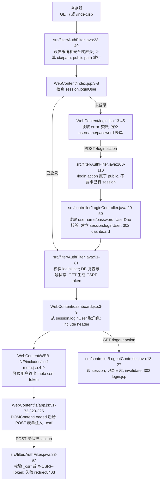
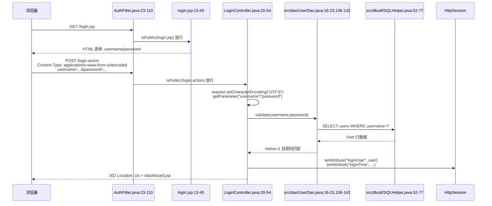
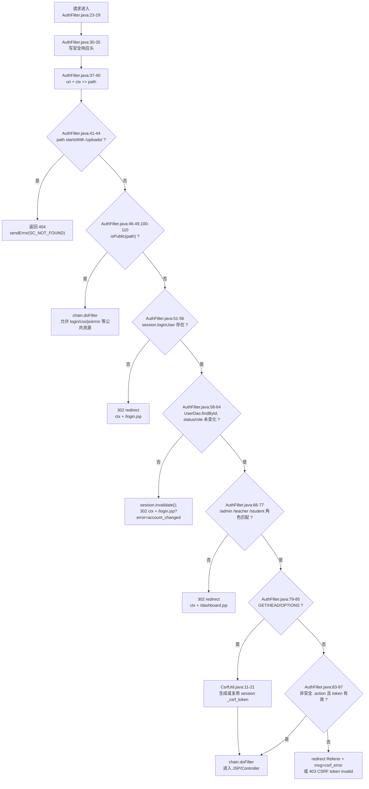
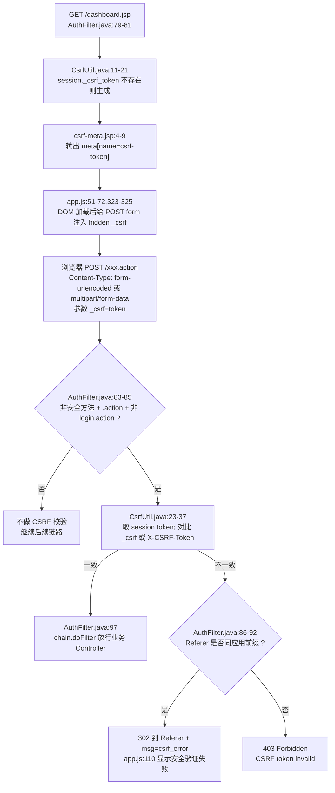

# 01. 登录 / 退出 / 全局鉴权 / CSRF / 公共资源网络数据流详解

本节只说明基础访问控制链路：登录、退出、`AuthFilter` 全局鉴权、CSRF token 生成与校验、公共静态资源放行；其他业务模块不纳入本节。

## 1. 涉及 URL、方法与参数

| 场景 | URL / 匹配规则 | HTTP 方法 | 典型 Content-Type | 请求参数 / Cookie | 后端入口 | 结果 |
|---|---|---:|---|---|---|---|
| 访问系统根入口 | `/`、`/index.jsp` | GET | 无请求体 | `JSESSIONID` 可选 | `AuthFilter` -> `index.jsp` | 已登录跳 `dashboard.jsp`；未登录跳 `login.jsp` |
| 打开登录页 | `/login.jsp` | GET | 无请求体 | `error` 查询参数可选，如 `?error=empty` | `AuthFilter` -> `login.jsp` | 渲染登录表单和错误提示 |
| 提交登录表单 | `/login.action` | POST | `application/x-www-form-urlencoded` | 表单体：`username=...&password=...` | `AuthFilter` -> `LoginController.doPost` | 成功建立 session 并 302 到 `dashboard.jsp`；失败 302 回 `login.jsp?...` |
| 访问仪表盘 | `/dashboard.jsp` | GET | 无请求体 | `JSESSIONID`；无显式业务参数 | `AuthFilter` -> `dashboard.jsp` | 按 `session.loginUser.role` 渲染 admin / teacher / student 视图 |
| 退出登录 | `/logout.action` | GET | 无请求体 | `JSESSIONID` | `AuthFilter` -> `LogoutController.doGet` | 记录退出日志、`session.invalidate()`、302 到 `login.jsp` |
| 受保护业务提交 | 任意受保护 `*.action`，排除 `/login.action` | POST / 非 GET | 常见为 `application/x-www-form-urlencoded` 或 `multipart/form-data` | `_csrf` 表单参数 / 查询参数，或 `X-CSRF-Token` 请求头 | `AuthFilter` 先校验，再进入具体 Controller | token 正确才放行；错误则回来源页带 `msg=csrf_error` 或返回 403 |
| 公共静态资源 | `/css/*`、`/js/*`、`/error/*` | GET | 由资源决定 | 无需登录 | `AuthFilter.isPublic` 放行 | 登录前也能加载样式和公共 JS |
| 上传文件直链 | `/uploads/*` | 任意 | 任意 | 任意 | `AuthFilter` | 直接返回 404，不进入资源或业务处理 |

### 关键 URL 约定

- `.action`：本项目用它表示“Servlet 控制器动作”地址，例如 `login.action` 映射到 `LoginController`。`AuthFilter` 只对非安全方法且 `path.endsWith(".action")` 的受保护提交做 CSRF 校验。
- `?`：URL 中查询字符串的开始，例如 `login.jsp?error=empty`。`error=empty` 不在请求体里，而是 query parameter。
- `&`：多个查询参数的分隔符。`AuthFilter.appendMsg` 会根据 URL 中是否已有 `?` 自动选择 `?msg=csrf_error` 或 `&msg=csrf_error`。
- `_csrf`：服务端约定的 CSRF 参数名。普通 POST 表单由前端自动追加隐藏字段 `<input name="_csrf" ...>`。
- `X-CSRF-Token`：服务端支持的另一种提交方式，适合脚本或 AJAX 把 token 放在请求头里。
- `ctx`：`request.getContextPath()`，即应用部署上下文。例如部署在 `/gdms` 时，`ctx=/gdms`。
- `path`：`AuthFilter` 用 `uri.substring(ctx.length())` 去掉部署上下文后的应用内路径。例如请求 URI `/gdms/admin/users.jsp` 会变成 `/admin/users.jsp`，这样权限判断不受部署名影响。
- `/`：应用内根路径，是 public path，会进入 `index.jsp` 再按 session 状态跳转。
- `../`：浏览器解析相对 URL 时的“上一级目录”符号。后端权限判断最终看 Servlet 容器解析后的请求 URI / path，而不是页面源码里原始的相对写法；因此权限边界应以 `AuthFilter` 计算出的 `path` 为准。
- `302 redirect`：`response.sendRedirect(...)` 产生的客户端重定向。浏览器会收到 302，再发起第二次 GET 到新地址；本模块没有使用 server-side forward。
- `403`：CSRF token 无效且不能安全回来源页时，服务端返回 Forbidden。
- `404`：`/uploads/*` 被过滤器主动隐藏为 Not Found，避免通过静态直链绕过业务下载控制。
- GET / HEAD / OPTIONS 安全方法：在本项目中被 `isSafeMethod` 视为“不直接改变业务状态”的方法，不做 CSRF 校验，但会生成 session token 供后续 POST 使用。

## 2. 总链路 flowchart



这条总链路里有两个核心状态：

1. **登录态**：服务端 session 中是否存在 `loginUser`。没有它，受保护 URL 会被 `AuthFilter` 302 到登录页。
2. **CSRF 态**：session 中是否存在 `_csrf_token`，且本次非安全 `.action` 请求是否提交了相同值。没有或不一致，业务 Controller 不会执行。

## 3. 登录请求生命周期：从浏览器表单到 `request.getParameter`

### 3.1 登录页如何产生请求

`login.jsp` 中登录表单是：

- `action="login.action"`：提交到当前应用上下文下的 `/login.action`。
- `method="post"`：浏览器用 POST 发送请求体。
- `<input name="username">`：用户名字段名是 `username`。
- `<input type="password" name="password">`：密码字段名是 `password`。

用户点击“登录”后，浏览器默认编码为 `application/x-www-form-urlencoded`，请求体类似：

```text
username=admin&password=admin123
```

这里的 `&` 只是参数分隔符，不是密码的一部分；如果用户名或密码含特殊字符，浏览器会 URL encode 后再发送。后端调用 `request.getParameter("username")` 和 `request.getParameter("password")` 时，Servlet 容器会从 POST 表单体解析出对应参数。

### 3.2 登录 sequence



### 3.3 后端逐段解释

1. `LoginController` 的 Servlet 映射是 `/login.action`，所以表单 POST 命中这个控制器。
2. 控制器先 `request.setCharacterEncoding("UTF-8")`，保证表单体中的中文用户名等内容按 UTF-8 解析。
3. `request.getParameter("username")` 和 `request.getParameter("password")` 读取的就是登录页两个 input 的 `name` 字段，不是 label 文本，也不是 `id`。
4. 用户名或密码为空时，不进入数据库验证，直接 `WebUtil.redirect(request,response,"/login.jsp?error=empty")`。这会生成带上下文路径的 302，浏览器再 GET 登录页；登录页读取 `error=empty` 后显示“请输入用户名和密码”。
5. 控制器创建或获取 session：`request.getSession(true)`。这是登录成功后保存用户对象的容器。
6. `UserDao.validate` 先按 username 查数据库用户，再要求 `status=1`，最后用密码工具匹配提交密码和库内密码摘要。
7. 认证成功后，控制器再次取完整 `User`，把 `password` 置空，然后放入 `session.setAttribute("loginUser", user)`。这样后续请求不必每次重新输入密码，只要浏览器带同一个 `JSESSIONID` Cookie，服务端就能从 session 找到登录用户。
8. 登录成功还写入 `loginTime`，清理失败计数，记录登录日志，然后 302 到 `/dashboard.jsp`。
9. 认证失败时记录失败次数，302 到 `/login.jsp?error=1`；登录页根据 query 参数显示“用户名或密码错误”。

### 3.4 为什么登录成功要放 session

HTTP 请求本身是无状态的。登录 POST 只发生一次；如果不把认证结果保存到 session，下一次访问 `dashboard.jsp` 时服务端无法知道这是刚登录过的浏览器。把去密码后的 `User` 放进 session 有三个作用：

- 后续鉴权统一读取 `session.loginUser`，不用每个 JSP / Controller 自己重新校验用户名密码。
- 页面可以从 `loginUser.role` 判断展示 admin、teacher、student 哪一套功能。
- 配合服务端 session 生命周期，退出时一次 `invalidate()` 就能清理登录态。

## 4. 访问控制生命周期：`AuthFilter` 如何根据 path / role 放行或重定向

`AuthFilter` 标注 `@WebFilter("/*")`，说明它拦截应用内所有请求。它的处理顺序非常重要：

1. **统一编码和安全响应头**：先设置请求 / 响应 UTF-8，再给所有响应加安全头。
2. **计算路径**：取 `request.getRequestURI()` 和 `request.getContextPath()`，再截出应用内 `path`。
3. **隐藏上传直链**：如果 `path.startsWith("/uploads/")`，立即 404。
4. **公共路径放行**：登录页、登录动作、CSS、JS、错误页等无需 session。
5. **登录态检查**：非 public path 必须有 `session.loginUser`；没有则 302 到 `ctx + "/login.jsp"`。
6. **账号实时复查**：根据 session 用户 id 重新查数据库。账号被删除、停用或角色变化时，清空 session 并 302 到 `login.jsp?error=account_changed`。
7. **角色路径控制**：
   - `/admin/*` 只能 admin 访问。
   - `/teacher/*` 只能 teacher 访问。
   - `/student/*` 只能 student 访问。
   - 角色不匹配不返回 403，而是 302 到 `dashboard.jsp`，让用户回到自己角色可访问的首页。
8. **安全方法生成 token**：GET / HEAD / OPTIONS 请求会确保 session 中已有 CSRF token。
9. **非安全 `.action` 校验 CSRF**：受保护 POST 等动作必须提交 token，验证通过才 `chain.doFilter` 进入后续 Servlet / JSP。



### 4.1 为什么要用统一 `AuthFilter`

如果每个 JSP 或 Controller 自己写登录检查，容易漏掉某个 URL，形成未授权访问。统一过滤器的好处是：

- 所有请求先过同一个入口，鉴权策略集中。
- 公共资源、登录页、角色路径、CSRF 校验顺序固定，减少重复代码。
- 安全响应头可在所有响应上一致生效，包括登录页和静态资源。
- 账号状态变化能在下一次请求立即生效：管理员停用某个用户后，该用户 session 会被过滤器复查并失效。

### 4.2 public path 为什么要放行

登录页和登录动作必须允许未登录访问，否则用户永远无法提交登录。CSS / JS 也必须放行，否则登录页虽然能打开，但样式、密码显示按钮、全局消息等前端功能加载失败。当前 public path 包括：

```text
/
/index.jsp
/login.jsp
/login.action
/css/*
/js/*
/error/*
```

注意：`/uploads/*` 虽然可能是静态文件路径，但过滤器在 public 判断之前先返回 404，因此它不是公共资源。

### 4.3 `index.jsp` 与 `dashboard.jsp` 的分工

`index.jsp` 不是业务主页，它只做入口跳转：

- session 中已有 `loginUser`：302 到 `dashboard.jsp`。
- 没有 `loginUser`：302 到 `login.jsp`。

`dashboard.jsp` 是登录后的角色首页。它直接从 `session.getAttribute("loginUser")` 取用户并读取 `role`。这依赖 `AuthFilter` 已经保证未登录请求不能进入该 JSP；否则 `loginUser.getRole()` 会空指针。

## 5. CSRF 生命周期：GET 生成 token，POST 校验 token

### 5.1 token 在哪里生成

CSRF token 保存在 session 属性 `_csrf_token` 中。`CsrfUtil.getToken(session)` 的逻辑是：

1. session 为空则返回 `null`。
2. session 中已有 `_csrf_token` 就复用。
3. 没有则用 `UUID.randomUUID().toString().replace("-", "")` 生成一个无横杠随机字符串。
4. 写回 session。

`AuthFilter` 在 GET / HEAD / OPTIONS 这类安全方法上调用 `CsrfUtil.getToken(session)`，目的是让用户打开页面时就准备好后续 POST 需要的 token。之后 JSP include 的 `csrf-meta.jsp` 也会在登录用户存在时输出：

```html
<meta name="csrf-token" content="...">
```

前端 `app.js` 在 `DOMContentLoaded` 后读取这个 meta，并给所有 POST 表单补一个隐藏字段：

```html
<input type="hidden" name="_csrf" value="...">
```

对于 `multipart/form-data` 文件上传表单，脚本还会把 `_csrf` 同步追加到 action URL 的查询参数里。这是为了让过滤器阶段的 `request.getParameter("_csrf")` 更稳定地拿到 token；某些 multipart 请求在进入业务上传解析前，不一定适合依赖普通表单字段完成安全校验。

### 5.2 token 在哪里校验

`AuthFilter` 的 CSRF 条件是：

```text
非 GET/HEAD/OPTIONS
并且 path 以 .action 结尾
并且 path 不是 /login.action
```

满足这些条件时，过滤器调用 `CsrfUtil.validate(request)`。校验顺序：

1. 取现有 session；没有 session，失败。
2. 从 session 取 `_csrf_token`；没有或为空，失败。
3. 先读请求参数 `_csrf`。
4. 参数没有时，再读请求头 `X-CSRF-Token`。
5. 提交值与 session 中的 expected 完全相等才通过。



### 5.3 为什么 POST 要校验 CSRF

浏览器会自动携带同站点 session Cookie。如果用户已登录，攻击页面可能诱导浏览器向本系统发起 POST；没有 CSRF token 时，服务端只看到合法 Cookie，无法区分这是用户主动提交还是跨站伪造。把随机 token 存在 session，并要求页面表单或请求头提交同一个 token，可以证明请求来自本系统页面渲染出的上下文。

### 5.4 为什么 GET 生成 token 而不是 POST 时才生成

POST 到达过滤器时，业务操作已经准备执行，必须“校验已有 token”，不能临时生成一个再通过。GET 页面是用户正常进入表单的阶段，此时生成 token 并渲染到 meta，后续 POST 才有可提交的凭证。

### 5.5 当前退出接口的特殊点

`/logout.action` 使用 GET。按当前过滤器规则，GET 属于安全方法，不触发 CSRF 校验；但 `/logout.action` 不是 public path，所以仍要求已登录。请求到达 `LogoutController` 后：

1. `request.getSession(false)` 获取现有 session，不创建新 session。
2. 如果 session 里有 `loginUser`，记录退出日志。
3. `session.invalidate()` 清除登录态和 CSRF token。
4. 302 到 `/login.jsp`。

这解释了为什么退出后再访问 `dashboard.jsp` 会被过滤器重定向回登录页：原 session 已失效，新的请求找不到 `loginUser`。

## 6. 安全响应头与公共资源

`AuthFilter` 在判断 public path 之前就写安全响应头，因此登录页、CSS、JS、业务页、Controller 响应都会带这些头：

| Header | 当前值 / 作用 |
|---|---|
| `X-Content-Type-Options` | `nosniff`，要求浏览器不要把响应猜成其他 MIME 类型 |
| `X-Frame-Options` | `SAMEORIGIN`，限制页面只能被同源页面嵌入 frame |
| `X-XSS-Protection` | `1; mode=block`，兼容旧浏览器的 XSS 过滤开关 |
| `Strict-Transport-Security` | `max-age=31536000; includeSubDomains`，声明 HTTPS 访问策略；只有 HTTPS 下浏览器才会实际采纳 |
| `Content-Security-Policy` | 限制默认资源同源，允许 jsdelivr CDN、内联脚本 / 样式等项目当前需要的资源 |

登录页自己引用 `css/app.css` 和 `js/app.js`。这两个路径在 `/css/`、`/js/` public 规则内，所以未登录时也能加载。页面还引用 jsdelivr 的 Bootstrap CSS / JS，这类请求直接发往 CDN 域名，不经过本应用的 `AuthFilter`。

## 7. redirect 目的地汇总

| 触发条件 | 代码行为 | 浏览器下一跳 |
|---|---|---|
| `index.jsp` 发现已登录 | `response.sendRedirect("dashboard.jsp")` | GET `/dashboard.jsp` |
| `index.jsp` 发现未登录 | `response.sendRedirect("login.jsp")` | GET `/login.jsp` |
| 登录参数为空 | `WebUtil.redirect(..., "/login.jsp?error=empty")` | GET `ctx + /login.jsp?error=empty` |
| 登录账号被锁 | `WebUtil.redirect(..., "/login.jsp?error=locked")` | GET `ctx + /login.jsp?error=locked` |
| 登录成功 | `WebUtil.redirect(..., "/dashboard.jsp")` | GET `ctx + /dashboard.jsp` |
| 登录失败 | `WebUtil.redirect(..., "/login.jsp?error=1")` | GET `ctx + /login.jsp?error=1` |
| 未登录访问受保护路径 | `response.sendRedirect(ctx + "/login.jsp")` | GET `ctx + /login.jsp` |
| session 用户被删除 / 停用 / 角色变化 | `session.invalidate(); response.sendRedirect(ctx + "/login.jsp?error=account_changed")` | GET 登录页并带错误码 |
| 角色访问错目录 | `response.sendRedirect(ctx + "/dashboard.jsp")` | 回自己的仪表盘 |
| CSRF 失败且 Referer 是本应用 | `response.sendRedirect(appendMsg(referer,"csrf_error"))` | 回来源页，query 增加 `msg=csrf_error` |
| CSRF 失败且 Referer 不可信 | `sendError(403,"CSRF token invalid")` | 停止请求，显示 403 |
| 访问 `/uploads/*` | `sendError(404)` | 停止请求，显示 404 |
| 退出登录 | `session.invalidate(); WebUtil.redirect(..., "/login.jsp")` | GET `ctx + /login.jsp` |

## 8. 关键代码逐段解释

### 8.1 `login.jsp`

- `request.getParameter("error")` 读取 URL query 中的错误码，决定显示哪条登录失败提示。
- `<form action="login.action" method="post">` 决定浏览器向 `/login.action` 发 POST。
- `name="username"` / `name="password"` 决定后端 `getParameter` 的参数名。`id="password"` 只服务于前端“显示 / 隐藏密码”按钮，不参与后端取值。
- 登录页没有 include `csrf-meta.jsp`；这是符合当前后端规则的，因为 `/login.action` 是 public 并被 CSRF 校验排除。

### 8.2 `LoginController`

- `@WebServlet("/login.action")` 把 `.action` URL 绑定到这个 Servlet。
- `setCharacterEncoding` 必须在 `getParameter` 之前调用，否则 POST 体里的非 ASCII 字符可能已经按错误编码解析。
- 空值检查在数据库访问前完成，避免无效请求消耗数据库连接。
- `request.getSession(true)` 在登录流程中合理：即使之前没有 session，登录成功也需要创建一个来保存状态。
- `user.setPassword(null)` 是重要的安全处理，避免把密码摘要或密码字段放进 session。
- `session.setAttribute("loginUser", user)` 是整个后续鉴权链路的依据。
- 所有结果都用 redirect，不用 forward。这样登录成功或失败后的地址栏会变成目标页，刷新页面不会重复提交登录表单。

### 8.3 `AuthFilter`

- 安全响应头放在最前面，保证即使后面 public 放行、redirect 或错误响应也尽量带上统一安全策略。
- `path` 是去掉 `ctx` 的路径，用它做权限判断可以兼容不同部署上下文。
- `/uploads/` 先于 public 判断返回 404，说明上传文件不允许被当成普通静态目录直接访问。
- `isPublic` 只放行登录必需资源和错误页，不包含 dashboard、admin、teacher、student。
- session 中有 `loginUser` 还不够，过滤器会再查一次数据库确认账号仍存在、启用且角色未变化。
- 角色目录判断使用路径前缀：`/admin/`、`/teacher/`、`/student/`。不匹配时重定向到 dashboard，而不是让用户留在无权限 URL。
- CSRF 校验只发生在受保护的非安全 `.action` 请求上；普通 GET 页面不会被拦截，但会生成 token。

### 8.4 `CsrfUtil`、`csrf-meta.jsp`、`app.js`

- `CsrfUtil.TOKEN_ATTR="_csrf_token"` 是 session 内部保存名；`PARAM_NAME="_csrf"` 是浏览器提交名。
- `getToken` 是懒生成：第一次 GET 页面时创建，之后同一 session 复用。
- `validate` 同时支持参数 `_csrf` 和请求头 `X-CSRF-Token`。参数适合普通表单；请求头适合脚本请求。
- `csrf-meta.jsp` 只在 `loginUser != null` 时输出 token，避免未登录页面暴露无意义 token。
- `app.js` 不要求每个表单手写隐藏字段，而是在 DOM 加载后统一扫描 POST 表单并注入 `_csrf`。

### 8.5 `UserDao`、`SQLHelper`、`jdbc.properties`

- `UserDao.findByUsername` 使用 `WHERE username=?`，参数通过 `SQLHelper` 绑定进 `PreparedStatement`，不是字符串拼接。
- `UserDao.validate` 要求用户存在且 `status=1`，再做密码匹配。
- `AuthFilter` 的账号复查使用 `UserDao.findById`，不是完全信任 session 中旧对象。
- `SQLHelper` 启动时从 classpath 读取 `jdbc.properties`，创建 Druid 数据源；查询时获取连接、prepare SQL、绑定参数、执行查询、最后关闭资源。

## 9. 代码证据清单

- `WebContent/login.jsp:13-21`
- `WebContent/login.jsp:32-45`
- `WebContent/login.jsp:55-56`
- `WebContent/index.jsp:3-8`
- `WebContent/dashboard.jsp:3-9`
- `WebContent/dashboard.jsp:211-211`
- `WebContent/WEB-INF/includes/header.jsp:7-12`
- `WebContent/WEB-INF/includes/footer.jsp:17-18`
- `WebContent/WEB-INF/includes/csrf-meta.jsp:4-9`
- `WebContent/js/app.js:51-72`
- `WebContent/js/app.js:74-83`
- `WebContent/js/app.js:100-113`
- `WebContent/js/app.js:323-324`
- `src/controller/LoginController.java:16-22`
- `src/controller/LoginController.java:24-29`
- `src/controller/LoginController.java:31-38`
- `src/controller/LoginController.java:40-54`
- `src/controller/LoginController.java:57-61`
- `src/controller/LogoutController.java:14-27`
- `src/filter/AuthFilter.java:18-35`
- `src/filter/AuthFilter.java:37-49`
- `src/filter/AuthFilter.java:51-64`
- `src/filter/AuthFilter.java:66-77`
- `src/filter/AuthFilter.java:79-97`
- `src/filter/AuthFilter.java:100-121`
- `src/util/CsrfUtil.java:8-21`
- `src/util/CsrfUtil.java:23-37`
- `src/util/WebUtil.java:8-27`
- `src/dao/UserDao.java:16-23`
- `src/dao/UserDao.java:34-41`
- `src/dao/UserDao.java:136-142`
- `src/dbutil/SQLHelper.java:19-27`
- `src/dbutil/SQLHelper.java:30-46`
- `src/dbutil/SQLHelper.java:52-77`
- `src/dbutil/SQLHelper.java:96-115`
- `src/dbutil/SQLHelper.java:139-155`
- `src/jdbc.properties:2-18`
