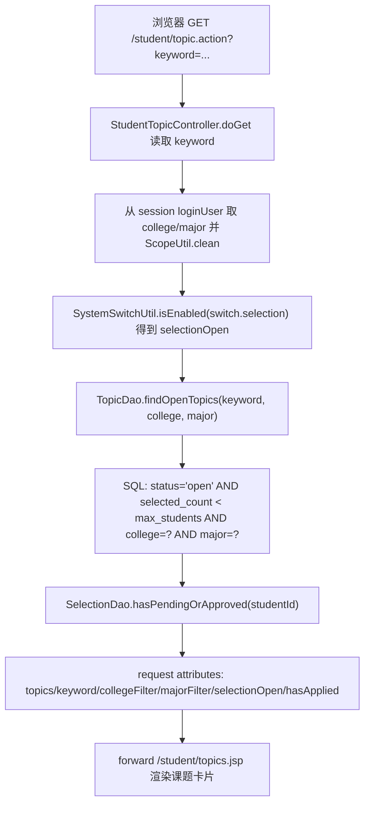
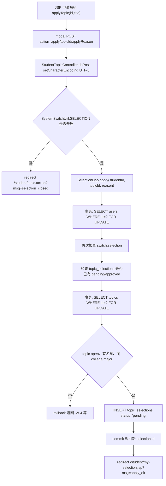
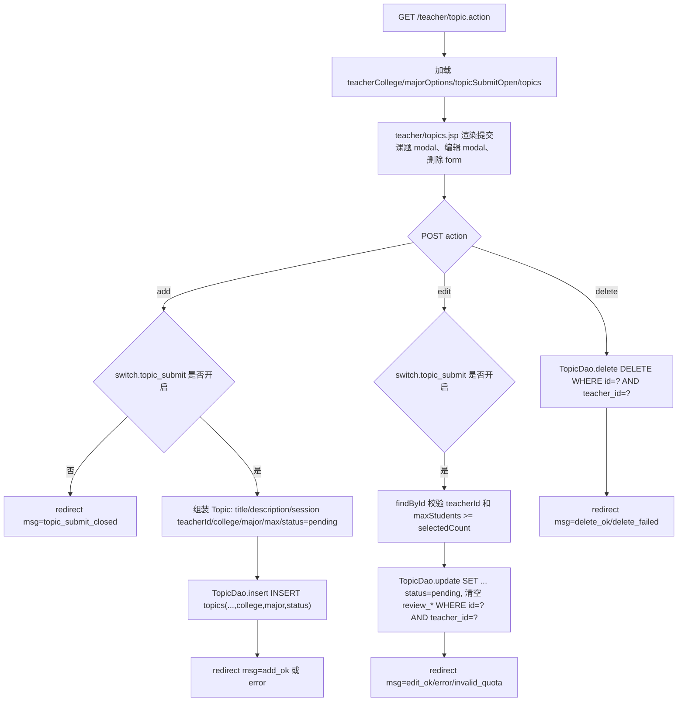
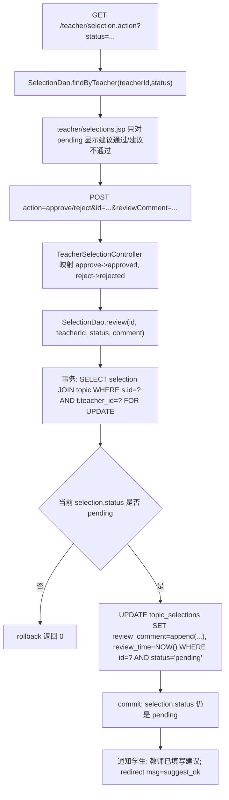
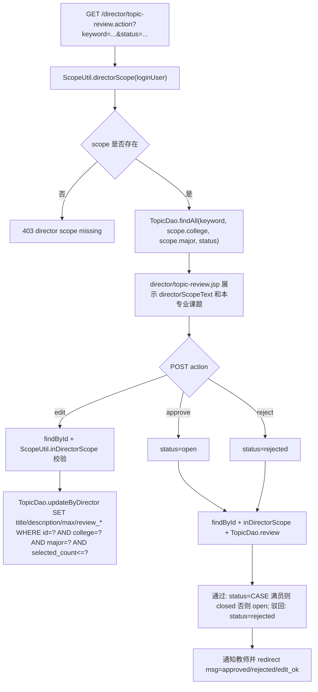
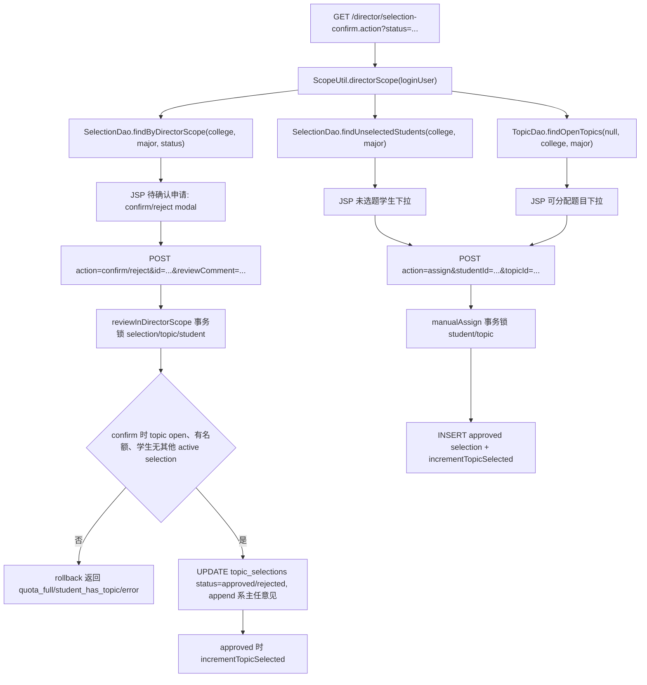

# 02. 选题浏览、申请、课题管理与审批的数据流

本部分只覆盖普通选题业务：学生浏览/申请选题、学生查看自己的申请记录、教师课题提交/编辑/删除、教师填写选题建议、专业负责人（director，页面文案为“系主任”）审核课题和确认/分配学生选题。不包含任何 AI 模块。

核心结论：当前代码已经把“教师建议”和“专业负责人终审”拆开。教师提交课题后默认进入 `topics.status='pending'`，只有 director 审核通过后才变成 `open`，学生端才可见；学生申请后进入 `topic_selections.status='pending'`，教师端只追加“建议通过/建议不通过”的 `review_comment`，不改终态、不占名额，最终由 director 确认为 `approved` 或 `rejected`。所有修改动作基本走 POST 后 redirect，再用 `msg` 查询参数表达结果，属于 PRG（Post/Redirect/Get）写法。

---

## 1. URL、方法、参数、开关与页面入口总览

| 使用者 | 业务动作 | URL | 方法 | 请求参数/表单字段 | 后端入口 | 最终视图/跳转 |
|---|---|---:|---:|---|---|---|
| 学生 | 浏览/搜索本专业开放课题 | `/student/topic.action` | GET | query：`keyword`；学院/专业不是请求参数，而是 session 中 `loginUser.college/major` | `StudentTopicController.doGet` | forward 到 `/student/topics.jsp` |
| 学生 | 提交选题申请 | `/student/topic.action` | POST | form：`action=apply`、`topicId`、`applyReason` | `StudentTopicController.doPost` | 成功 redirect `/student/my-selection.jsp?msg=apply_ok`；失败 redirect `/student/topic.action?msg=...` |
| 学生 | 查看我的选题 | `/student/my-selection.jsp` | GET | 无必需参数；`msg=apply_ok` 当前 JSP 不显示 | JSP 直接调用 `SelectionDao.findByStudent` | 直接渲染 JSP |
| 教师 | 查看自己提交的课题 | `/teacher/topic.action` | GET | 无 query；学院/专业来自 session | `TeacherTopicController.doGet` | forward 到 `/teacher/topics.jsp` |
| 教师 | 提交课题审核 | `/teacher/topic.action` | POST | form：`action=add`、`title`、`description`、`college`、`major`、`maxStudents` | `TeacherTopicController.doPost` | redirect `/teacher/topic.action?msg=add_ok/error/topic_submit_closed` |
| 教师 | 编辑并重提交课题 | `/teacher/topic.action` | POST | form：`action=edit`、`id`、`title`、`description`、`college`、`major`、`maxStudents` | `TeacherTopicController.doPost` | redirect `/teacher/topic.action?msg=edit_ok/error/invalid_quota/topic_submit_closed` |
| 教师 | 删除课题 | `/teacher/topic.action` | POST | form：`action=delete`、`id` | `TeacherTopicController.doPost` | redirect `/teacher/topic.action?msg=delete_ok/delete_failed` |
| 教师 | 查看学生选题申请并筛选 | `/teacher/selection.action` | GET | query：`status=pending/approved/rejected/all` | `TeacherSelectionController.doGet` | forward 到 `/teacher/selections.jsp` |
| 教师 | 填写选题建议 | `/teacher/selection.action` | POST | form：`action=approve/reject`、`id`、`reviewComment` | `TeacherSelectionController.doPost` | redirect `/teacher/selection.action?msg=suggest_ok` 或错误 msg |
| director | 本专业课题审核列表 | `/director/topic-review.action` | GET | query：`keyword`、`status`；学院/专业来自 director scope | `DirectorTopicReviewController.doGet` | forward 到 `/director/topic-review.jsp` |
| director | 调整本专业课题 | `/director/topic-review.action` | POST | form：`action=edit`、`id`、`title`、`description`、`maxStudents`、`reviewComment` | `DirectorTopicReviewController.doPost` | redirect `/director/topic-review.action?msg=edit_ok/invalid_quota/error` |
| director | 通过/驳回课题 | `/director/topic-review.action` | POST | form：`action=approve/reject`、`id`、`reviewComment` | `DirectorTopicReviewController.doPost` | redirect `/director/topic-review.action?msg=approved/rejected/error` |
| director | 本专业选题确认列表 | `/director/selection-confirm.action` | GET | query：`status=pending/approved/rejected/all`；学院/专业来自 director scope | `DirectorSelectionConfirmController.doGet` | forward 到 `/director/selection-confirm.jsp` |
| director | 确认/不确认学生选题 | `/director/selection-confirm.action` | POST | form：`action=confirm/reject`、`id`、`reviewComment` | `DirectorSelectionConfirmController.doPost` | redirect `/director/selection-confirm.action?msg=approved/rejected/quota_full/student_has_topic/error` |
| director | 手动分配未选题学生 | `/director/selection-confirm.action` | POST | form：`action=assign`、`studentId`、`topicId`、`reviewComment` | `DirectorSelectionConfirmController.doPost` | redirect `/director/selection-confirm.action?msg=assign_ok/quota_full/student_has_topic/error` |

### 1.1 当前状态值和含义

- 课题 `topics.status`：
  - `pending`：教师已提交，等待 director 审核。
  - `open`：director 审核通过，学生端可见且可申请。
  - `closed`：课题关闭或名额已满。`TopicDao.review` 和 `SelectionDao.incrementTopicSelected` 都会在满员边界把课题置为 `closed`。
  - `rejected`：director 驳回课题。
- 选题申请 `topic_selections.status`：
  - `pending`：学生已申请，等待 teacher 建议和 director 最终确认。
  - `approved`：director 已确认，正式占用课题名额。
  - `rejected`：director 未确认，学生后续可重新申请或被手动分配。
  - `cancelled`：数据库枚举保留值，当前本流程没有页面入口写入。
- `selected_count`：只在 director 确认通过或手动分配时递增。教师“建议通过”不递增。
- `major`：当前所有关键查询都按学院+专业限制。学生只能看/申请本人学院本人专业的开放课题；director 只能管理本人 `UserScope(college, major)` 范围内的课题和选题。

### 1.2 当前开关和范围限制

- `switch.selection`（兼容旧 `switch.selection_round1`）：控制学生是否可以提交选题申请。关闭时学生仍可浏览已开放课题，但按钮禁用，POST 也会被 Controller 和 DAO 双重拒绝。
- `switch.topic_submit`：控制教师是否可新增/编辑课题。关闭时教师页面禁用“提交课题审核/编辑并重提”，Controller 也会拒绝 add/edit。删除课题当前不受该开关阻断。
- `directorScopeText`：由 `ScopeUtil.scopeText` 按 director 的学院/专业生成，JSP 用它提示“当前系主任权限范围”。真正的安全边界不依赖提示文本，而是 Controller 和 DAO 中的 `college=? AND major=?` 条件。

---

## 2. 学生 GET 浏览/搜索课题

### 2.1 JSP 表单 name 与 Controller getParameter 对应

学生课题页当前只有 `keyword` 搜索输入，没有学院/专业下拉框。学院、专业由后端从 session 中的 `loginUser` 取出并清洗，页面只显示“仅显示本人专业：学院 / 专业”。

| JSP 表单/展示位置 | HTML 字段或展示 | 浏览器请求示例 | Controller 读取 | 实际含义 |
|---|---|---|---|---|
| `WebContent/student/topics.jsp:43-58` | `<input name="keyword">` | `/student/topic.action?keyword=网络` | `request.getParameter("keyword")` | 按标题/描述模糊搜索 |
| `WebContent/student/topics.jsp:48-51` | 无可提交字段，只显示学院/专业 | 无 | `ScopeUtil.clean(user.getCollege())`、`ScopeUtil.clean(user.getMajor())` | 强制限定为当前学生自己的学院和专业 |
| `WebContent/student/topics.jsp:60-62` | `selectionOpen` 警告 | 无 | `SystemSwitchUtil.isEnabled(SELECTION)` | 关闭时只浏览、不能申请 |

### 2.2 Mermaid：学生 GET 浏览课题数据流



### 2.3 Controller 与 DAO 逻辑

`StudentTopicController.doGet` 的流程是：

1. 读取 query string 中的 `keyword`。
2. 从 session 取 `loginUser`，用 `ScopeUtil.clean` 清洗 `college` 和 `major`。这意味着学生不能通过 URL 改学院/专业过滤范围。
3. 调用 `SystemSwitchUtil.isEnabled(SystemSwitchUtil.SELECTION)`，结果写入 `selectionOpen`。
4. 调用 `TopicDao.findOpenTopics(keyword, college, major)`。这个 DAO 只返回 `status='open'` 且 `selected_count < max_students` 的课题，并继续追加 `t.college=?`、`t.major=?`。
5. 调用 `SelectionDao.hasPendingOrApproved(user.getId())` 判断学生是否已经有 `pending` 或 `approved` 选题。如果有，页面不再显示申请按钮。
6. forward 到 `/student/topics.jsp`。这里是服务端转发，不改变浏览器地址。

`TopicDao.findOpenTopics` 是普通查询，不开启事务。它使用 `SQLHelper.queryList` 创建 `PreparedStatement` 并绑定 `%keyword%`、`college`、`major`，避免把用户输入直接拼进 SQL 值位置。

---

## 3. 学生 POST 申请选题

### 3.1 JSP 表单 name 与 Controller getParameter 对应

学生点击课题卡片中的“申请选题”按钮后，前端 JS 把课题 id 写入 hidden input，再打开 modal。提交时浏览器发送 `application/x-www-form-urlencoded` POST 到 `/student/topic.action`。

| JSP 位置 | HTML/JS | POST 字段 | Controller 读取 | 含义 |
|---|---|---|---|---|
| `WebContent/student/topics.jsp:79-87` | 只有 `selectionOpen && !hasApplied && selected_count < maxStudents` 才显示按钮 | 无直接提交 | 无 | 前端层面减少无效提交 |
| `WebContent/student/topics.jsp:92-103` | `<form action="topic.action" method="post">` | `action=apply` | `request.getParameter("action")` | 进入学生申请分支 |
| `WebContent/student/topics.jsp:92-103` | `<input type="hidden" name="topicId" id="applyTopicId">` | `topicId` | `Integer.parseInt(request.getParameter("topicId"))` | 被申请课题 id |
| `WebContent/student/topics.jsp:92-103` | `<textarea name="applyReason">` | `applyReason` | `request.getParameter("applyReason")` | 申请理由 |
| `WebContent/student/topics.jsp:107-112` | `applyTopic(id,title)` | 写入 `applyTopicId` | POST 后读取 | 把按钮所在课题绑定到 modal |

hidden input 不能作为安全边界。后端仍然重新校验：开关、用户角色、学生是否已有活跃申请、课题是否开放/有名额、学生和课题是否同学院同专业。

### 3.2 Mermaid：学生 POST apply 数据流



### 3.3 redirect msg 和业务返回值

`SelectionDao.apply` 的返回值在 Controller 中映射为：

| DAO 返回值 | 业务含义 | redirect |
|---:|---|---|
| `-1` | 学生已有 `pending` 或 `approved` 申请 | `/student/topic.action?msg=already_applied` |
| `-2` | 课题不存在、非 `open` 或名额已满 | `/student/topic.action?msg=quota_full` |
| `-3` | 学生选题开关已关闭 | `/student/topic.action?msg=selection_closed` |
| `-4` | 学生学院/专业与课题学院/专业不一致 | `/student/topic.action?msg=major_mismatch` |
| `<=0` | 其他失败 | `/student/topic.action?msg=error` |
| `>0` | 插入 `topic_selections` 成功 | `/student/my-selection.jsp?msg=apply_ok` |

`student/topics.jsp` 当前会显示 `already_applied`、`quota_full`、`selection_closed`、`major_mismatch` 四类提示；`error` 没有专门映射。`my-selection.jsp` 不解析 `apply_ok`，只展示申请记录。

### 3.4 事务、并发和 SQL

申请选题涉及“一个学生只能有一个活跃选题”和“课题容量不能超额”，所以 `SelectionDao.apply` 手工管理事务：

1. `SQLHelper.getConnection()` 取同一个连接，`conn.setAutoCommit(false)` 开启事务。
2. `SELECT role,status,college,major FROM users WHERE id=? FOR UPDATE` 锁住学生行，并确认用户是启用状态的学生。
3. 再次检查 `SystemSwitchUtil.SELECTION`。即使 Controller 通过后管理员瞬间关停，DAO 也会 rollback。
4. `SELECT 1 FROM topic_selections WHERE student_id=? AND status IN ('pending','approved') LIMIT 1` 检查活跃申请。
5. `SELECT status,max_students,selected_count,college,major FROM topics WHERE id=? FOR UPDATE` 锁住课题行，检查 `open`、名额和专业范围。
6. `INSERT INTO topic_selections(student_id,topic_id,status,apply_reason) VALUES(?,?,'pending',?)` 创建待确认申请。
7. `commit`；异常时 rollback，finally 中恢复 `autoCommit` 并关闭连接。

数据库表还定义了 `active_guard` 生成列和 `UNIQUE KEY uk_student_active_selection(student_id, active_guard)`，对 `pending/approved` 活跃申请做第二道唯一性约束。即使应用层并发校验失效，数据库也能阻断同一学生同时拥有多个活跃选题。

---

## 4. 学生查看“我的选题”

学生申请成功后跳转到 `/student/my-selection.jsp?msg=apply_ok`。这个 JSP 不经过 Controller：

1. 从 session 取 `loginUser`。
2. `new SelectionDao().findByStudent(loginUser.getId())`。
3. DAO 使用 `SELECT_SQL + "WHERE s.student_id=? ORDER BY s.apply_time DESC"` 查询该学生所有申请。
4. 页面展示课题、指导教师、申请理由、申请时间、状态、审批意见。

这里的状态含义要按当前两级流程理解：`pending` 可能已经有教师建议，但仍等待 director 终审；`approved` 才是 director 最终确认；`rejected` 是未确认或被驳回。

---

## 5. 教师 GET 查看自己提交的课题

教师进入 `/teacher/topic.action` 时，Controller 从 session 取教师用户并准备以下 request attributes：

- `topics`：`TopicDao.findByTeacher(user.getId())`，只查当前教师自己的课题。
- `teacherCollege` / `teacherCollegeName`：教师所属学院代码和展示名。
- `teacherMajor`：教师自己的专业代码，用于专业下拉默认值。
- `majorOptions`：`CollegeUtil.getMajorsByCollege(teacherCollege)`，教师提交课题时只能选择本学院专业列表中的专业。
- `topicSubmitOpen`：`SystemSwitchUtil.isEnabled(SystemSwitchUtil.TOPIC_SUBMIT)`，控制新增/编辑入口。

JSP 如果直接访问导致 `topics == null`，会 redirect 回 `/teacher/topic.action`，保证页面数据由 Controller 统一准备。

---

## 6. 教师 POST 提交、编辑、删除课题

### 6.1 JSP 表单 name 与 Controller getParameter 对应

| 操作 | JSP 位置 | POST 字段 | Controller 读取/设置 | 当前业务含义 |
|---|---|---|---|---|
| 提交 | `WebContent/teacher/topics.jsp:84-110` | `action=add` | `request.getParameter("action")` | 进入 add 分支 |
| 提交 | `WebContent/teacher/topics.jsp:90-91` | `title`、`description` | `request.getParameter("title/description")` | 课题名称与描述 |
| 提交 | `WebContent/teacher/topics.jsp:93-96` | `college` hidden | `resolveCollege(user, request)` | 优先用教师 session 中的学院，不信任表单覆盖 |
| 提交 | `WebContent/teacher/topics.jsp:97-105` | `maxStudents`、`major` | `Integer.parseInt(...)`、`resolveMajor(...)` | 最大人数和所属专业 |
| 编辑 | `WebContent/teacher/topics.jsp:114-141` | `action=edit`、`id`、`title`、`description`、`college`、`maxStudents`、`major` | 同名 `getParameter` | 编辑后重新进入 `pending` |
| 删除 | `WebContent/teacher/topics.jsp:73-78` | `action=delete`、`id` | `request.getParameter("id")` | 按当前教师 id 删除自己的课题 |

当前教师表单不再提交 `status`。新增和编辑都由 Controller 强制 `t.setStatus("pending")`，等待 director 审核。

### 6.2 Mermaid：教师 topic add/edit/delete 数据流



### 6.3 新增课题逻辑

新增分支的关键点：

- `switch.topic_submit` 关闭时，直接 redirect `topic_submit_closed`。
- `teacherId` 来自 session 的 `loginUser.getId()`，不是表单字段。
- `college` 优先来自 session 中的教师学院；只有教师没有学院时才退回表单 `college`。
- `major` 必须存在于 `CollegeUtil.getMajorsByCollege(college)`。如果表单传了非法专业，Controller 会退回教师自己的专业；再不行才取本学院第一个专业。
- `status` 固定为 `pending`，说明教师只是提交审核，不是直接开放给学生。
- DAO SQL：

```sql
INSERT INTO topics(title,description,teacher_id,college,major,max_students,status)
VALUES(?,?,?,?,?,?,?)
```

### 6.4 编辑课题逻辑

编辑分支的关键点：

1. `switch.topic_submit` 关闭时拒绝编辑。
2. `id` 来自 hidden input，但 Controller 先 `TopicDao.findById(id)` 查真实课题。
3. 如果课题不存在、不是当前教师所有，或新 `maxStudents` 小于当前 `selected_count`，redirect `invalid_quota`。
4. 保存时强制 `status='pending'`，并通过 `TopicDao.update` 清空 `review_comment/reviewer_id/review_time`，表示“重新提交审核”。
5. DAO SQL 带 `WHERE id=? AND teacher_id=?`，即使浏览器篡改 hidden `id`，也不能改别的教师的课题。

核心 SQL：

```sql
UPDATE topics
SET title=?,description=?,college=?,major=?,max_students=?,status=?,
    review_comment=NULL,reviewer_id=NULL,review_time=NULL
WHERE id=? AND teacher_id=?
```

### 6.5 删除课题逻辑

删除分支只提交 `action=delete` 和 `id`。Controller 使用 session 中的教师 id 调用：

```sql
DELETE FROM topics WHERE id=? AND teacher_id=?
```

所以教师只能删除自己的课题。当前删除不受 `switch.topic_submit` 限制；如果该课题已有选题申请，是否删除成功取决于数据库外键约束。`SQLHelper.executeUpdate` 捕获异常后返回 0，Controller 映射为 `delete_failed`。

### 6.6 教师课题管理 redirect msg

`teacher/topics.jsp` 当前显示：

- `add_ok`：课题已提交审核。
- `edit_ok`：课题已修改并重新进入待审核。
- `delete_ok`：课题删除成功。
- `delete_failed`：删除课题失败。
- `topic_submit_closed`：管理员已关闭教师出题入口。

Controller 还可能 redirect `error`、`invalid_quota`，当前 JSP 未给这两个结果码单独渲染 alert。

---

## 7. 教师 GET 查看选题申请和 POST 填写建议

### 7.1 GET 筛选

教师审批页文案已经调整为“选题建议”。GET 请求参数是 `status`：

| JSP 链接 | URL | Controller 读取 | DAO 查询 |
|---|---|---|---|
| 待给建议 | `selection.action?status=pending` | `request.getParameter("status")` | `WHERE t.teacher_id=? AND s.status='pending'` |
| 已由系主任确认 | `selection.action?status=approved` | 同上 | `WHERE t.teacher_id=? AND s.status='approved'` |
| 已驳回 | `selection.action?status=rejected` | 同上 | `WHERE t.teacher_id=? AND s.status='rejected'` |
| 全部 | `selection.action?status=all` | 同上，Controller 转成 `null` | 只保留 `WHERE t.teacher_id=?` |

如果没有 `status`，Controller 默认 `pending`。

### 7.2 POST 表单 name 与 getParameter 对应

| JSP 位置 | HTML/JS | POST 字段 | Controller 读取 | 含义 |
|---|---|---|---|---|
| `WebContent/teacher/selections.jsp:39-45` | 只有 `pending` 行显示按钮 | 无直接提交 | 无 | 非 pending 只显示已有意见 |
| `WebContent/teacher/selections.jsp:53-64` | hidden `reviewAction/reviewId` | `action`、`id` | `request.getParameter("action/id")` | `approve` 或 `reject`，申请 id |
| `WebContent/teacher/selections.jsp:60-61` | `<textarea name="reviewComment">` | `reviewComment` | `request.getParameter("reviewComment")` | 教师建议 |
| `WebContent/teacher/selections.jsp:68-74` | `reviewSel(id, action, name)` | 写入 hidden | POST 后读取 | 把按钮动作和申请 id 放入 modal |

### 7.3 Mermaid：教师 selection review 数据流



### 7.4 当前教师建议不是终审

旧文档里把教师 `approve/reject` 解释为直接批准/驳回并占用名额；当前代码不是这样。

- Controller 仍把按钮动作映射成字符串 `approved/rejected`，但 DAO 只用这个字符串选择“指导教师建议通过/指导教师建议退回”的评论标签。
- `SelectionDao.review` 不更新 `s.status`，只更新 `review_comment` 和 `review_time`。
- 不读取或更新 `topics.selected_count`。
- redirect 成功结果统一是 `msg=suggest_ok`。
- 因为状态仍是 `pending`，该申请仍会留在 director 的“待确认”列表中。

并发上，教师建议也使用事务和 `FOR UPDATE` 锁住对应申请行，避免多个教师页面同时覆盖同一条 `review_comment`。但它不处理名额竞争；名额竞争留到 director 确认阶段处理。

---

## 8. director GET/POST 本专业课题审核

### 8.1 GET 筛选和 scope

director 进入 `/director/topic-review.action` 时，Controller 调用 `ScopeUtil.directorScope(user)`。只有 `role='director'` 且用户配置了非空 `college`、`major`，才会得到有效 scope；否则返回 403。

GET 参数：

| JSP 位置 | HTML 字段 | Controller 读取 | DAO 限制 |
|---|---|---|---|
| `WebContent/director/topic-review.jsp:37-47` | `keyword` | `request.getParameter("keyword")` | `title/description LIKE ?` |
| `WebContent/director/topic-review.jsp:37-47` | `status` | `request.getParameter("status")` | 非 `all` 时追加 `t.status=?` |
| `WebContent/director/topic-review.jsp:33-35` | 无字段，展示 `directorScopeText` | `ScopeUtil.scopeText(scope)` | DAO 固定 `t.college=? AND t.major=?` |

`status` 缺省为 `pending`；如果传空字符串，则 Controller 转成 `all`。

### 8.2 POST 表单 name 与 getParameter 对应

| 操作 | JSP 位置 | POST 字段 | Controller 读取 | DAO 动作 |
|---|---|---|---|---|
| 调整课题 | `WebContent/director/topic-review.jsp:78-91` | `action=edit`、`id`、`title`、`description`、`maxStudents`、`reviewComment` | 同名 `getParameter` | `TopicDao.updateByDirector` |
| 通过课题 | `WebContent/director/topic-review.jsp:95-106` | `action=approve`、`id`、`reviewComment` | `action` 映射为 `status='open'` | `TopicDao.review` |
| 驳回课题 | `WebContent/director/topic-review.jsp:95-106` | `action=reject`、`id`、`reviewComment` | `action` 映射为 `status='rejected'` | `TopicDao.review` |
| JS 写值 | `WebContent/director/topic-review.jsp:110-123` | hidden `reviewAction/reviewId` 或 `editId` | POST 后读取 | 打开 modal 前绑定具体课题 |

### 8.3 Mermaid：director topic review 数据流



### 8.4 director 调整课题

director 的“调整”不是教师编辑，不改变 `college/major/teacher_id/status`。它只允许在本人 scope 内修改：

- `title`
- `description`
- `max_students`
- `review_comment`
- `reviewer_id`
- `review_time`

Controller 先 `TopicDao.findById(id)`，再 `ScopeUtil.inDirectorScope(user, current)`。DAO SQL 还带 `WHERE id=? AND college=? AND major=? AND selected_count<=?`，防止越权和把最大人数调到已选人数以下。

### 8.5 director 通过/驳回课题

director 点击“通过”时，Controller 把 `action=approve` 映射为 `status='open'`；点击“驳回”映射为 `status='rejected'`。

`TopicDao.review` 的行为：

- 通过：`UPDATE topics SET status=CASE WHEN selected_count>=max_students THEN 'closed' ELSE 'open' END, review_comment=?, reviewer_id=?, review_time=NOW() WHERE id=? AND status IN (...)`。即使 director 点击通过，如果课题已经满员，也会落成 `closed`。
- 驳回：`UPDATE topics SET status='rejected', review_comment=?, reviewer_id=?, review_time=NOW() WHERE id=? AND status IN (...)`。

成功后给教师发送站内通知，并记录操作日志。当前 `director/topic-review.jsp` 没有像教师/学生页那样解析 `msg` 渲染 alert；结果主要体现在列表状态变化。

---

## 9. director GET/POST 本专业选题确认与手动分配

### 9.1 GET 列表数据

director 进入 `/director/selection-confirm.action` 时，同样先取 `ScopeUtil.directorScope(user)`。有效 scope 后一次准备三组数据：

- `selections`：`SelectionDao.findByDirectorScope(scope.college, scope.major, status)`，要求课题和学生都在同一学院/专业范围内。
- `unselectedStudents`：`SelectionDao.findUnselectedStudents(scope.college, scope.major)`，查询本专业启用学生中没有 `pending/approved` 活跃选题的人。
- `availableTopics`：`TopicDao.findOpenTopics(null, scope.college, scope.major)`，只取本专业 `open` 且未满员课题。
- `directorScopeText`：页面提示当前专业负责人范围。

状态筛选链接和教师页类似：`pending` 待确认、`approved` 已确认、`rejected` 未确认、`all` 全部；缺省为 `pending`。

### 9.2 POST 表单 name 与 getParameter 对应

| 操作 | JSP 位置 | POST 字段 | Controller 读取 | DAO 动作 |
|---|---|---|---|---|
| 确认对应 | `WebContent/director/selection-confirm.jsp:110-121` | `action=confirm`、`id`、`reviewComment` | `request.getParameter("action/id/reviewComment")` | `SelectionDao.confirmByDirector` |
| 不确认 | `WebContent/director/selection-confirm.jsp:110-121` | `action=reject`、`id`、`reviewComment` | 同上 | `SelectionDao.rejectByDirector` |
| JS 写值 | `WebContent/director/selection-confirm.jsp:125-131` | hidden `reviewAction/reviewId` | POST 后读取 | 按按钮绑定 selection id |
| 手动分配 | `WebContent/director/selection-confirm.jsp:79-106` | `action=assign`、`studentId`、`topicId`、`reviewComment` | `request.getParameter("studentId/topicId/reviewComment")` | `SelectionDao.manualAssign` |

### 9.3 Mermaid：director selection confirm/assign 数据流



### 9.4 director 确认/不确认的事务

`confirmByDirector` 和 `rejectByDirector` 都调用 `reviewInDirectorScope`，区别只是目标状态：

- `confirm` -> `approved`
- `reject` -> `rejected`

事务步骤：

1. `SELECT ... FROM topic_selections s JOIN topics t JOIN users u WHERE s.id=? AND t.college=? AND t.major=? AND u.college=? AND u.major=? FOR UPDATE`。这一步同时锁住申请相关行，并验证学生和课题都在 director 本专业范围内。
2. 当前 `s.status` 必须是 `pending`；否则 rollback。
3. `SELECT id FROM users WHERE id=? FOR UPDATE` 锁学生行，使同一学生相关确认串行化。
4. 如果目标是 `approved`，检查：
   - 课题状态必须是 `open`。
   - `selected_count < max_students`。
   - 学生没有除当前申请外的其他 `pending/approved` 活跃选题。
5. `UPDATE topic_selections SET status=?, review_comment=?, review_time=NOW() WHERE id=? AND status='pending'`。`review_comment` 会在原教师建议后追加“系主任意见”。
6. 如果目标是 `approved`，调用 `incrementTopicSelected`：`selected_count=selected_count+1`，并在达到 `max_students` 时把课题状态置为 `closed`。
7. commit；异常或任何校验失败 rollback。

这才是真正决定学生选题终态和课题人数的位置。

### 9.5 director 手动分配的事务

手动分配用于第二轮后仍未选题的学生。它不依赖学生先提交申请，而是直接插入一条 `approved` 记录：

1. `SELECT id FROM users WHERE id=? AND role='student' AND status=1 AND college=? AND major=? FOR UPDATE`，确认学生在 director 本专业 scope 内。
2. `hasActiveSelection(conn, studentId, 0)` 检查学生没有 `pending/approved` 活跃选题。
3. `SELECT status,max_students,selected_count FROM topics WHERE id=? AND college=? AND major=? FOR UPDATE`，确认课题在本专业、`open` 且未满员。
4. `INSERT INTO topic_selections(student_id,topic_id,status,apply_reason,review_comment,review_time) VALUES(?,?,'approved','系主任手动分配',?,NOW())`。
5. 调用 `incrementTopicSelected` 增加课题已选人数，满员时自动关闭课题。
6. commit；失败 rollback。

成功后 Controller 给学生发送“选题分配结果”通知，记录操作日志，redirect `msg=assign_ok`。

---

## 10. 普通 SQL、事务 SQL 与 SQLHelper 边界

### 10.1 普通 SQL：TopicDao

`TopicDao.findAll/findByTeacher/findOpenTopics/findById` 使用 `SQLHelper.queryList`，`insert` 使用 `SQLHelper.executeInsert`，`update/updateByDirector/review/delete` 使用 `SQLHelper.executeUpdate`。这些都是单条 SQL，依赖 JDBC 默认自动提交。

普通 SQL 的特点：

- 每次调用都从 Druid 连接池取一个连接。
- 用 `PreparedStatement` 绑定参数。
- finally 中关闭 ResultSet/PreparedStatement/Connection。
- 出错时打印 SQL 错误并返回空列表、0 或 null。

### 10.2 事务 SQL：SelectionDao

`SelectionDao.apply`、`review`、`reviewInDirectorScope`、`manualAssign` 都必须共享同一个 `Connection`，所以不能用 `SQLHelper.queryList/executeUpdate` 分散执行，而是：

- `SQLHelper.getConnection()`
- `conn.setAutoCommit(false)`
- 多条 `PreparedStatement`
- 关键行 `FOR UPDATE`
- 成功 `commit`
- 失败 `rollback`
- finally 中 `conn.setAutoCommit(true)` 并关闭连接

### 10.3 WebUtil.redirect

Controller 中大多数 redirect 传入以 `/` 开头的应用内路径。`WebUtil.redirect` 会自动拼接 `request.getContextPath()`，再 `response.sendRedirect(...)`。因此项目部署在非根路径时，`/student/topic.action`、`/teacher/topic.action`、`/director/...` 仍能跳回同一个 Web 应用。

---

## 11. 设计原因总结

1. **GET 只读，POST 改状态**：浏览、筛选、列表页都用 GET；申请、提交课题、编辑、删除、建议、确认、分配都用 POST。
2. **POST 后 redirect**：避免刷新浏览器重复提交表单。
3. **学生范围由 session 决定**：学生不能通过 URL 或 hidden 字段选择别的学院/专业。
4. **教师只能直接管理自己的课题**：`teacherId` 从 session 取，update/delete SQL 都带 `teacher_id=?`。
5. **教师建议不是终审**：教师只写 `review_comment`，不改变 `topic_selections.status`，不递增 `selected_count`。
6. **director 是专业范围终审**：director scope 必须同时匹配课题和学生的 `college/major`。
7. **名额竞争只在最终确认/分配时处理**：director 确认和手动分配都会锁学生、锁课题、检查 active selection、递增 `selected_count`。
8. **开关前后端双重控制**：JSP 负责禁用按钮和提示，Controller/DAO 负责真实拒绝。
9. **数据库约束兜底**：`active_guard` 唯一索引让同一学生不能同时拥有多个 `pending/approved` 活跃选题。

---

## 12. 代码证据清单

- `WebContent/student/topics.jsp:8-23`：学生课题页读取 `topics/keyword/collegeFilter/majorFilter/hasApplied/selectionOpen`，缺少 Controller 数据时 redirect。
- `WebContent/student/topics.jsp:25-31`：学生端 `already_applied/quota_full/selection_closed/major_mismatch` 提示映射。
- `WebContent/student/topics.jsp:43-58`：学生 GET 搜索表单当前只有 `keyword`，学院/专业以只读文本展示。
- `WebContent/student/topics.jsp:60-62`：`selectionOpen=false` 时显示“只能浏览不能申请”提示。
- `WebContent/student/topics.jsp:64-89`：课题卡片展示学院/专业/教师/名额，并根据开关、已有申请和名额决定按钮。
- `WebContent/student/topics.jsp:92-103`：学生申请 modal POST 表单，字段 `action=apply`、`topicId`、`applyReason`。
- `WebContent/student/topics.jsp:107-112`：`applyTopic` JS 写入 hidden `topicId` 并打开 modal。
- `WebContent/student/my-selection.jsp:5-8`：学生“我的选题”直接从 session 取用户并调用 `SelectionDao.findByStudent`。
- `WebContent/student/my-selection.jsp:22-34`：学生选题记录表格展示课题、教师、理由、时间、状态、审批意见。
- `WebContent/teacher/topics.jsp:7-23`：教师课题页依赖 Controller 注入 `topics/majorOptions/teacherCollege/topicSubmitOpen`。
- `WebContent/teacher/topics.jsp:25-33`：教师课题页 `add_ok/edit_ok/delete_ok/delete_failed/topic_submit_closed` 提示映射。
- `WebContent/teacher/topics.jsp:45-50`：教师出题开关关闭时提示，并禁用提交课题按钮。
- `WebContent/teacher/topics.jsp:53-80`：教师课题卡片展示状态、审核意见、编辑按钮、删除 POST 表单。
- `WebContent/teacher/topics.jsp:84-110`：教师新增课题 POST 表单，字段 `action/title/description/college/maxStudents/major`。
- `WebContent/teacher/topics.jsp:114-141`：教师编辑并重提 POST 表单，字段 `action/id/title/description/college/maxStudents/major`。
- `WebContent/teacher/topics.jsp:145-153`：`editTopic` JS 把课题当前值写入编辑 modal。
- `WebContent/teacher/selections.jsp:6-12`：教师选题建议页读取 `statusFilter/selections`，缺少数据时 redirect。
- `WebContent/teacher/selections.jsp:18-23`：教师 GET 状态筛选链接 `pending/approved/rejected/all`。
- `WebContent/teacher/selections.jsp:39-45`：只有 `pending` 申请显示“建议通过/建议不通过”，非 pending 显示意见。
- `WebContent/teacher/selections.jsp:53-64`：教师建议 POST 表单，字段 `action/id/reviewComment`。
- `WebContent/teacher/selections.jsp:68-74`：`reviewSel` JS 写入 hidden `reviewId/reviewAction`。
- `WebContent/director/topic-review.jsp:6-18`：director 课题审核页读取 `topics/keyword/statusFilter/topicStatusOptions/directorScopeText`。
- `WebContent/director/topic-review.jsp:33-47`：director scope 提示和 GET 查询表单 `keyword/status`。
- `WebContent/director/topic-review.jsp:50-75`：director 本专业课题表格及“调整/通过/驳回”操作按钮。
- `WebContent/director/topic-review.jsp:78-91`：director 调整课题 POST 表单，字段 `action=edit/id/title/description/maxStudents/reviewComment`。
- `WebContent/director/topic-review.jsp:95-106`：director 课题审核 POST 表单，字段 `action/id/reviewComment`。
- `WebContent/director/topic-review.jsp:110-123`：director 审核/调整 JS 写入 hidden 字段并打开 modal。
- `WebContent/director/selection-confirm.jsp:6-17`：director 选题确认页读取 `selections/unselectedStudents/availableTopics/statusFilter/directorScopeText`。
- `WebContent/director/selection-confirm.jsp:23-31`：director scope 提示和选题确认状态筛选链接。
- `WebContent/director/selection-confirm.jsp:39-67`：director 选题申请表格，`pending` 行显示确认/不确认按钮。
- `WebContent/director/selection-confirm.jsp:69-107`：未选题学生手动分配表单，字段 `action=assign/studentId/topicId/reviewComment`。
- `WebContent/director/selection-confirm.jsp:110-121`：director 确认/不确认 POST 表单，字段 `action/id/reviewComment`。
- `WebContent/director/selection-confirm.jsp:125-131`：`reviewSelection` JS 写入 hidden `reviewId/reviewAction`。
- `src/controller/StudentTopicController.java:23-39`：学生 GET 读取 `keyword`，用 session 学院/专业查开放课题，设置 `selectionOpen/hasApplied` 并 forward。
- `src/controller/StudentTopicController.java:42-83`：学生 POST `apply` 分支检查选题开关，读取 `topicId/applyReason`，按 DAO 返回值 redirect。
- `src/controller/TeacherTopicController.java:24-39`：教师 GET 查询本人课题，设置学院、专业选项、题目提交开关并 forward。
- `src/controller/TeacherTopicController.java:50-68`：教师 add 分支检查 `TOPIC_SUBMIT`，组装 `Topic` 并固定 `status='pending'`。
- `src/controller/TeacherTopicController.java:69-95`：教师 edit 分支检查开关、归属、名额，并重新提交为 `pending`。
- `src/controller/TeacherTopicController.java:95-106`：教师 delete 分支按当前教师 id 删除课题并 redirect。
- `src/controller/TeacherTopicController.java:109-132`：教师学院/专业解析逻辑，优先 session 学院并校验专业属于本学院。
- `src/controller/TeacherSelectionController.java:19-31`：教师选题建议 GET 默认 `pending`，调用 `SelectionDao.findByTeacher`。
- `src/controller/TeacherSelectionController.java:34-77`：教师建议 POST 读取 `action/id/reviewComment`，调用 `SelectionDao.review`，成功通知学生并 redirect `suggest_ok`。
- `src/controller/DirectorTopicReviewController.java:22-48`：director 课题审核 GET 获取 scope，按 `keyword/status/college/major` 查询并设置 `directorScopeText`。
- `src/controller/DirectorTopicReviewController.java:50-94`：director 调整课题 POST 校验 scope、最大人数并调用 `TopicDao.updateByDirector`。
- `src/controller/DirectorTopicReviewController.java:96-126`：director 通过/驳回课题，将 `approve/reject` 映射为 `open/rejected` 并通知教师。
- `src/controller/DirectorSelectionConfirmController.java:23-47`：director 选题确认 GET 加载本专业申请、未选题学生、可分配课题和 scope 文本。
- `src/controller/DirectorSelectionConfirmController.java:49-95`：director 确认/不确认 POST 调用 `confirmByDirector/rejectByDirector` 并按返回值 redirect。
- `src/controller/DirectorSelectionConfirmController.java:97-124`：director 手动分配 POST 读取 `studentId/topicId/reviewComment`，调用 `manualAssign`。
- `src/controller/DirectorSelectionConfirmController.java:127-133`：director Controller 的 `parseInt` 无效输入返回 0。
- `src/dao/TopicDao.java:11-16`：课题查询统一列集合包含 `major/review_comment/reviewer_id/reviewer_name/review_time`。
- `src/dao/TopicDao.java:26-52`：`findAll` 支持 `keyword/college/major/status` 过滤。
- `src/dao/TopicDao.java:54-59`：`findByTeacher` 只按 `teacher_id` 查询教师自己的课题。
- `src/dao/TopicDao.java:65-88`：`findOpenTopics` 固定 `status='open'`、未满员，并可追加学院/专业限制。
- `src/dao/TopicDao.java:90-98`：`findById` 用于编辑/审核前读取真实课题。
- `src/dao/TopicDao.java:100-113`：教师 insert/update SQL，包含 `college/major`，update 清空审核信息并带 `teacher_id` 条件。
- `src/dao/TopicDao.java:115-121`：director 调整课题 SQL 带 `college/major/selected_count<=maxStudents` 条件。
- `src/dao/TopicDao.java:123-138`：director 课题审核 SQL，`open` 时满员自动转 `closed`，驳回转 `rejected`。
- `src/dao/TopicDao.java:140-142`：教师删除课题 SQL 带 `teacher_id` 条件。
- `src/dao/TopicDao.java:168-194`：课题行映射到 `Topic`，并通过 `CollegeUtil` 翻译学院/专业名称。
- `src/dao/SelectionDao.java:17-23`：选题申请统一查询 SQL 连接学生、课题、教师。
- `src/dao/SelectionDao.java:25-35`：教师按自己课题和可选状态查询选题申请。
- `src/dao/SelectionDao.java:38-50`：director scope 查询同时限制课题和学生的学院/专业。
- `src/dao/SelectionDao.java:52-56`：学生按本人 id 查询自己的选题申请。
- `src/dao/SelectionDao.java:75-88`：`findById` 和 `hasPendingOrApproved` 判断学生是否已有活跃申请。
- `src/dao/SelectionDao.java:90-168`：学生申请事务，包含学生锁、开关复查、活跃申请检查、课题锁、专业匹配和插入 `pending`。
- `src/dao/SelectionDao.java:170-224`：教师建议事务，只追加 `review_comment/review_time`，不改变申请状态。
- `src/dao/SelectionDao.java:262-286`：director 查询本专业未选题学生，排除 `pending/approved` 活跃选题。
- `src/dao/SelectionDao.java:288-294`：director 确认/不确认包装方法映射到 `approved/rejected`。
- `src/dao/SelectionDao.java:296-369`：director 手动分配事务，锁学生、锁课题、插入 `approved` 并递增课题人数。
- `src/dao/SelectionDao.java:396-487`：director 确认/不确认事务，锁申请/课题/学生、校验 scope、名额和活跃选题，更新终态。
- `src/dao/SelectionDao.java:489-510`：`hasActiveSelection` 和 `incrementTopicSelected`，用于防重复选题和满员自动关闭。
- `src/dao/SelectionDao.java:512-519`：`appendReviewComment` 保留原意见并追加教师/系主任意见。
- `src/dao/SelectionDao.java:521-538`：事务 rollback 和关闭连接时恢复 `autoCommit`。
- `src/dao/SelectionDao.java:540-545`：学生申请时比较学院/专业是否一致。
- `src/util/SystemSwitchUtil.java:6-18`：系统开关键定义，包括 `TOPIC_SUBMIT`、`SELECTION` 和兼容旧 `SELECTION_ROUND1`。
- `src/util/SystemSwitchUtil.java:42-47`：`SELECTION` 开关读取时兼容旧 `selection_round1`。
- `src/util/SystemSwitchUtil.java:56-74`：开关更新和默认值初始化，`SELECTION` 同步写新旧配置。
- `src/util/ScopeUtil.java:15-25`：director scope 要求角色为 `director` 且学院/专业非空。
- `src/util/ScopeUtil.java:27-40`：`inDirectorScope` 和 `scopeText` 用于专业范围校验和页面提示。
- `src/util/ScopeUtil.java:42-47`：scope 字符串清洗逻辑。
- `src/util/CollegeUtil.java:16-24`：学院列表来自 `colleges` 表。
- `src/util/CollegeUtil.java:34-67`：学院/专业名称和本学院专业列表来自数据库。
- `src/util/WebUtil.java:12-27`：redirect 统一处理 contextPath、外部 URL 和相对路径。
- `src/dbutil/SQLHelper.java:16-23`：Druid 数据源初始化。
- `src/dbutil/SQLHelper.java:48-50`：对外提供数据库连接，供事务代码复用同一 Connection。
- `src/dbutil/SQLHelper.java:52-76`：普通列表查询执行流程。
- `src/dbutil/SQLHelper.java:79-94`：普通更新 SQL 执行流程。
- `src/dbutil/SQLHelper.java:96-115`：普通标量查询执行流程。
- `src/dbutil/SQLHelper.java:117-136`：普通插入 SQL 执行和生成主键获取。
- `src/dbutil/SQLHelper.java:139-155`：PreparedStatement 参数绑定和资源关闭。
- `sql/init.sql:73-105`：`topics` 和 `topic_selections` 表结构，包含 `major`、课题/选题状态枚举、`active_guard` 唯一约束。
