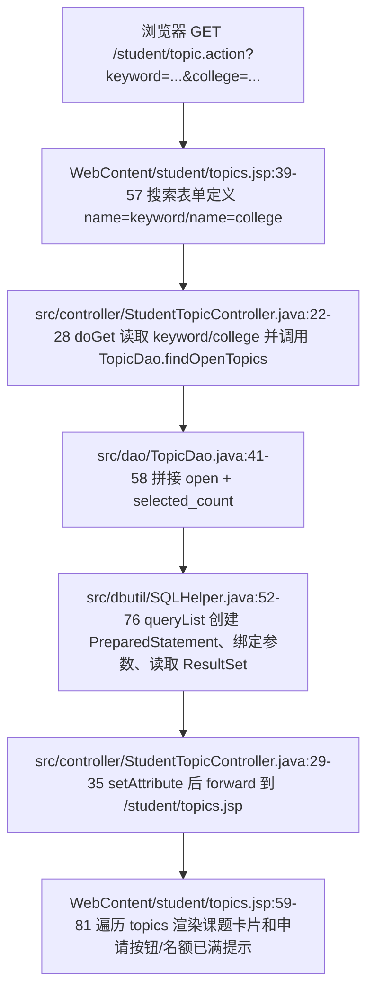
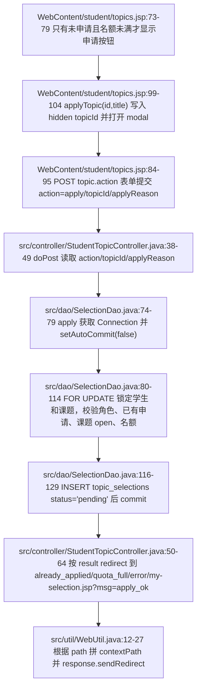
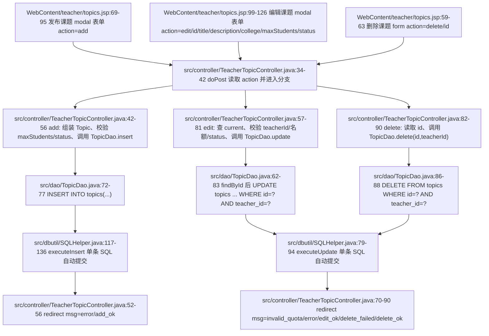
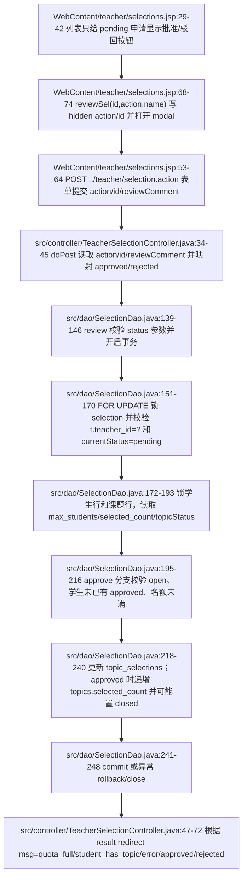

# 02. 选题浏览、申请、课题管理与审批的数据流

本部分只覆盖普通选题业务：学生浏览/申请选题、学生查看自己的申请记录、教师管理课题、教师审批学生申请。不包含任何 AI 模块。

核心结论：这个模块把“查询页面”和“修改状态”分得比较清楚。GET 负责读取条件并渲染页面；POST 负责新增申请、增删改课题、审批申请。POST 成功或失败后基本都用 `WebUtil.redirect(...)` 跳转回列表页，通过 `msg` 查询参数携带结果，属于典型 PRG（Post/Redirect/Get）写法，可以避免浏览器刷新时重复提交表单。

---

## 1. URL、方法、参数与页面入口总览

| 使用者 | 业务动作 | URL | 方法 | 请求体 Content-Type | 参数来源 | 后端入口 | 最终视图/跳转 |
|---|---|---:|---:|---|---|---|---|
| 学生 | 浏览/搜索开放课题 | `/student/topic.action` | GET | 无请求体，参数在 query string | `keyword`、`college` | `StudentTopicController.doGet` | forward 到 `/student/topics.jsp` |
| 学生 | 提交选题申请 | `/student/topic.action` | POST | 默认 `application/x-www-form-urlencoded` | hidden/input/textarea：`action`、`topicId`、`applyReason` | `StudentTopicController.doPost` | redirect 到 `/student/my-selection.jsp?msg=apply_ok` 或 `/student/topic.action?msg=...` |
| 学生 | 查看我的选题 | `/student/my-selection.jsp` | GET | 无请求体 | 无必需参数；`msg=apply_ok` 当前 JSP 未显示 | JSP 直接调用 `SelectionDao.findByStudent` | 直接渲染 JSP |
| 教师 | 查看自己发布的课题 | `/teacher/topic.action` | GET | 无请求体 | 无 | `TeacherTopicController.doGet` | forward 到 `/teacher/topics.jsp` |
| 教师 | 发布课题 | `/teacher/topic.action` | POST | 默认 `application/x-www-form-urlencoded` | `action=add`、`title`、`description`、`college`、`maxStudents`、`status` | `TeacherTopicController.doPost` | redirect 到 `/teacher/topic.action?msg=add_ok` 或错误 msg |
| 教师 | 编辑课题 | `/teacher/topic.action` | POST | 默认 `application/x-www-form-urlencoded` | `action=edit`、`id`、`title`、`description`、`college`、`maxStudents`、`status` | `TeacherTopicController.doPost` | redirect 到 `/teacher/topic.action?msg=edit_ok` 或错误 msg |
| 教师 | 删除课题 | `/teacher/topic.action` | POST | 默认 `application/x-www-form-urlencoded` | `action=delete`、`id` | `TeacherTopicController.doPost` | redirect 到 `/teacher/topic.action?msg=delete_ok` 或 `delete_failed` |
| 教师 | 查看申请审批列表 | `/teacher/selection.action` | GET | 无请求体，参数在 query string | `status=pending/approved/rejected/all` | `TeacherSelectionController.doGet` | forward 到 `/teacher/selections.jsp` |
| 教师 | 批准/驳回申请 | `/teacher/selection.action` | POST | 默认 `application/x-www-form-urlencoded` | `action=approve/reject`、`id`、`reviewComment` | `TeacherSelectionController.doPost` | redirect 到 `/teacher/selection.action?msg=approved/rejected/...` |

### 1.1 特殊 URL 和表单约定

- `.action` 不是磁盘上的 JSP 文件，而是 Servlet 映射名。例如 `@WebServlet("/student/topic.action")` 把 `/student/topic.action` 交给 `StudentTopicController`，`@WebServlet("/teacher/topic.action")` 把 `/teacher/topic.action` 交给 `TeacherTopicController`。
- `?keyword=xx&college=yy`、`?status=pending` 这种写法叫查询字符串。`?` 后面是参数，多个参数用 `&` 连接。Controller 用 `request.getParameter("keyword")`、`request.getParameter("college")`、`request.getParameter("status")` 读取。
- `?action=apply` 从语法上也可以表示查询参数，但当前学生申请表单不是把 `action=apply` 放在 URL 里，而是通过 `<input type="hidden" name="action" value="apply">` 放在 POST 请求体里。Controller 读取方式仍然是 `request.getParameter("action")`。
- `&msg=...` 中的 `msg` 是 redirect 后给 JSP 或下一次 Controller 使用的结果码。比如 `/student/topic.action?msg=quota_full` 表示返回课题列表时显示“名额已满”提示。
- `method="post"` 表示浏览器把表单字段编码进请求体，而不是拼在 URL 后面；未设置 `enctype` 时，浏览器默认使用 `application/x-www-form-urlencoded`。
- hidden input 是页面上不可见、但会随表单一起提交的字段。本模块用 hidden input 传 `action`、`topicId`、`id`，让同一个 URL 根据 `action` 分支执行不同业务。
- `../teacher/selection.action` 是相对路径。教师审批 JSP 里表单写这个路径，浏览器会把它解析到同一个 Web 应用下的 `/teacher/selection.action`，用于把 modal 里的审批表单提交到教师审批 Controller。
- 状态值约定：
  - 课题状态：`open` 表示可申请；`closed` 表示关闭或名额已满。
  - 选题申请状态：`pending` 表示待审批；`approved` 表示通过；`rejected` 表示驳回。
  - `selected_count` 是 `topics` 表中已批准人数计数，用来和 `max_students` 比较，决定名额是否已满。

---

## 2. 学生 GET 浏览/搜索课题

### 2.1 浏览器发送了什么

学生在浏览课题页看到一个 GET 搜索表单。表单的 `action="topic.action"` 是相对 URL，在 `/student/topic.action` 对应页面中会解析为当前目录下的 `/student/topic.action`；`method="get"` 表示字段拼进 URL 查询字符串。

表单字段和 Controller 参数一一对应：

| JSP 位置 | HTML 字段 | 浏览器请求示例 | Controller 读取 | 含义 |
|---|---|---|---|---|
| `WebContent/student/topics.jsp:39-43` | `<input name="keyword">` | `/student/topic.action?keyword=算法` | `request.getParameter("keyword")` | 按课题标题或描述模糊搜索 |
| `WebContent/student/topics.jsp:44-50` | `<select name="college">` | `/student/topic.action?college=computer` | `request.getParameter("college")` | 按学院筛选 |

如果两个字段都为空，请求就是 `/student/topic.action`，DAO 会查询所有仍开放且未满员的课题。

### 2.2 Mermaid：学生 GET 浏览课题数据流



### 2.3 Controller 逐段解释

`StudentTopicController.doGet` 的关键逻辑是：

1. `request.getParameter("keyword")` 和 `request.getParameter("college")` 读取 GET 查询参数。这里不修改数据库，只把筛选条件传给 DAO。
2. 从 session 取 `loginUser`，用于后续判断这个学生是否已经有待审批或已通过的选题申请。
3. `TopicDao.findOpenTopics(keyword, college)` 只返回 `status='open'` 且 `selected_count < max_students` 的课题，所以学生端默认看不到已关闭或已满员课题。
4. `new SelectionDao().hasPendingOrApproved(user.getId())` 判断当前学生是否已有 `pending` 或 `approved` 申请。如果有，JSP 不再显示“申请选题”按钮，而显示“您已有选题申请”。
5. 最后用 `request.getRequestDispatcher("/student/topics.jsp").forward(...)` 服务端转发到 JSP。forward 不是浏览器重定向，浏览器地址栏仍是 `/student/topic.action`，JSP 直接使用 request attribute 渲染页面。

### 2.4 DAO 与 SQL 执行

`TopicDao.findOpenTopics` 是普通查询，不开启事务：

- 初始 SQL 固定包含 `WHERE t.status='open' AND t.selected_count < t.max_students`，这保证学生浏览页只展示可申请且未满员的课题。
- 如果 `keyword` 非空，追加 `AND (t.title LIKE ? OR t.description LIKE ?)`，并把 `%keyword%` 放进参数列表。这里使用 `?` 占位符，不是字符串拼接用户输入，可以避免常见 SQL 注入。
- 如果 `college` 非空，追加 `AND t.college=?`。
- 最后按 `t.created_at DESC` 倒序展示。
- 进入 `SQLHelper.queryList` 后，每次查询从 Druid 连接池取连接，创建 `PreparedStatement`，调用 `bindParams` 逐个绑定参数，再执行 `executeQuery` 并把每行转换成 `Object[]`。

这个 GET 流程的设计原因是：浏览/搜索是幂等读操作，不应该改变数据库，所以不需要 POST，也不需要事务锁。真正涉及名额占用的动作在“申请”和“审批”阶段完成。

---

## 3. 学生 POST 申请选题

### 3.1 浏览器发送了什么

学生点击“申请选题”按钮时，先执行前端 JS，把具体课题 id 填入 hidden input，再弹出 modal。提交 modal 后浏览器发送 POST 请求到 `/student/topic.action`。

字段对应关系：

| JSP 位置 | HTML 字段 | 提交值来源 | Controller 读取 | 含义 |
|---|---|---|---|---|
| `WebContent/student/topics.jsp:86-87` | `name="action"` hidden | 固定值 `apply` | `request.getParameter("action")` | 告诉 `doPost` 走申请分支 |
| `WebContent/student/topics.jsp:88` | `name="topicId"` hidden | JS `applyTopic(id,title)` 填入 | `Integer.parseInt(request.getParameter("topicId"))` | 被申请的课题 id |
| `WebContent/student/topics.jsp:91-92` | `name="applyReason"` textarea | 学生填写 | `request.getParameter("applyReason")` | 申请理由 |

这里的 `topicId` 不是用户直接输入的文本框，而是 hidden input。hidden 只能减少界面干扰，不能当安全机制；后端仍必须校验课题是否存在、是否开放、是否满员。

### 3.2 Mermaid：学生 POST apply 数据流



### 3.3 Controller 逐段解释

`StudentTopicController.doPost` 的关键分支：

1. `request.setCharacterEncoding("UTF-8")` 放在读取参数前，保证中文申请理由按 UTF-8 解码。
2. `String action = request.getParameter("action")` 读取 hidden input。只有 `"apply".equals(action)` 才执行申请逻辑；其他 action 直接 redirect 回 `/student/topic.action`。
3. `topicId` 用 `Integer.parseInt(...)` 转为整数，`applyReason` 作为字符串传给 DAO。
4. `dao.apply(user.getId(), topicId, reason)` 返回业务结果：
   - `-1`：学生已有 `pending` 或 `approved` 申请，redirect 到 `/student/topic.action?msg=already_applied`。
   - `-2`：课题不可申请或名额已满，redirect 到 `/student/topic.action?msg=quota_full`。
   - `<=0`：其他失败，redirect 到 `/student/topic.action?msg=error`。
   - `>0`：插入成功，记录操作日志，然后 redirect 到 `/student/my-selection.jsp?msg=apply_ok`。

学生课题列表 JSP 只对 `already_applied` 和 `quota_full` 做了提示映射；`error` 会出现在 URL 中，但当前 JSP 没有显示对应文案。`my-selection.jsp` 也会收到 `msg=apply_ok`，但当前文件没有解析这个参数，只负责展示申请列表。

### 3.4 DAO 事务与并发控制

申请选题不是单条普通 SQL，而是一个事务，因为它同时依赖“学生是否已有申请”和“课题是否还有名额”两个条件。没有事务时，两个并发请求可能同时看到名额未满，导致超额申请或重复申请。

`SelectionDao.apply` 的事务步骤：

1. `SQLHelper.getConnection()` 从连接池取连接，`conn.setAutoCommit(false)` 关闭自动提交，开始手工事务。
2. `SELECT role,status FROM users WHERE id=? FOR UPDATE` 锁定当前学生行，并确认用户确实是启用状态的学生。这个锁把同一学生的并发申请串行化。
3. 查询 `topic_selections` 中是否已经存在同一学生的 `pending` 或 `approved` 申请。如果有，rollback 并返回 `-1`。
4. `SELECT status,max_students,selected_count FROM topics WHERE id=? FOR UPDATE` 锁定课题行，并确认课题 `status='open'` 且 `selected_count < max_students`。这个锁防止多个学生同时申请同一满员边界课题时读到旧名额。
5. 插入 `topic_selections(student_id,topic_id,status,apply_reason)`，状态固定为 `pending`。注意：申请阶段不增加 `selected_count`，因为只有教师批准后才真正占用名额。
6. `conn.commit()` 提交事务；任何异常都会 rollback，finally 中恢复自动提交并关闭连接。

这个设计的关键是：学生申请只创建“待审批”记录，不直接改变课题人数；真正修改 `selected_count` 的位置在教师批准审批时。

---

## 4. 学生查看“我的选题”

学生申请成功后 redirect 到 `/student/my-selection.jsp?msg=apply_ok`。这个 JSP 没有经过 Controller，而是在页面脚本中直接创建 `SelectionDao` 查询。

关键数据流：

- JSP 从 session 中取 `loginUser`。
- 调用 `new SelectionDao().findByStudent(loginUser.getId())`。
- DAO 使用 `SELECT_SQL + "WHERE s.student_id=? ORDER BY s.apply_time DESC"` 查询该学生所有申请。
- 页面展示课题、指导教师、申请理由、申请时间、状态、审批意见。

这里的 `msg=apply_ok` 只是 URL 上的结果码，当前 `my-selection.jsp` 没有读取它。因此用户看到的是申请记录本身，而不是额外的“申请成功”alert。

---

## 5. 教师 GET 查看自己发布的课题

教师进入 `/teacher/topic.action` 时，`TeacherTopicController.doGet` 从 session 取教师用户，调用 `TopicDao.findByTeacher(user.getId())`，只查询 `t.teacher_id=?` 的课题，然后设置：

- `topics`：教师自己的课题列表；
- `collegeOptions`：学院下拉框选项；
- `topicStatusOptions`：课题状态下拉框选项。

随后 forward 到 `/teacher/topics.jsp`。JSP 如果直接访问时没有 `topics` request attribute，会 redirect 回 `/teacher/topic.action`，保证页面数据由 Controller 准备。

这个设计保证教师课题列表不是全站课题列表，而是当前登录教师自己的课题。

---

## 6. 教师 POST 发布、编辑、删除课题

### 6.1 表单字段与 getParameter 对应

教师课题管理页有三类 POST 表单，共用 `/teacher/topic.action`，通过 hidden `action` 分支。

| 操作 | JSP 位置 | 表单字段 name | Controller 读取 | 说明 |
|---|---|---|---|---|
| 发布 | `WebContent/teacher/topics.jsp:71-72` | `action=add` | `request.getParameter("action")` | 进入 add 分支 |
| 发布 | `WebContent/teacher/topics.jsp:75` | `title` | `request.getParameter("title")` | 课题名称 |
| 发布 | `WebContent/teacher/topics.jsp:76` | `description` | `request.getParameter("description")` | 课题描述 |
| 发布 | `WebContent/teacher/topics.jsp:79-84` | `college` | `request.getParameter("college")` | 所属学院 |
| 发布 | `WebContent/teacher/topics.jsp:86` | `maxStudents` | `Integer.parseInt(request.getParameter("maxStudents"))` | 最大人数 |
| 发布 | `WebContent/teacher/topics.jsp:88-92` | `status` | `request.getParameter("status")` | 初始状态，一般为 open/closed |
| 编辑 | `WebContent/teacher/topics.jsp:101-103` | `action=edit`、`id` | `action`、`id` | 指定编辑哪条课题 |
| 编辑 | `WebContent/teacher/topics.jsp:106-120` | `title`、`description`、`college`、`maxStudents`、`status` | 同名 `getParameter` | 保存编辑后的字段 |
| 删除 | `WebContent/teacher/topics.jsp:59-62` | `action=delete`、`id` | `action`、`id` | 删除指定课题 |

### 6.2 Mermaid：教师 POST add/edit/delete topic 数据流



### 6.3 发布课题逻辑解释

发布课题时，Controller 创建一个新的 `Topic` 对象：

- `title`、`description`、`college`、`maxStudents`、`status` 都来自表单同名字段；
- `teacherId` 不来自表单，而是来自 session 中的 `loginUser.getId()`。这是安全设计：浏览器不能自己声明“我是哪个教师”；
- `maxStudents < 1` 或 `status` 不在字典中时，直接 redirect 到 `/teacher/topic.action?msg=error`；
- DAO 插入成功后 redirect 到 `/teacher/topic.action?msg=add_ok`。

`TopicDao.insert` 是普通单条插入 SQL：

```sql
INSERT INTO topics(title,description,teacher_id,college,max_students,status)
VALUES(?,?,?,?,?,?)
```

它通过 `SQLHelper.executeInsert` 执行，使用 `PreparedStatement.RETURN_GENERATED_KEYS` 获取自增 id。这里不需要显式事务，因为只写一张表的一行，不涉及跨表一致性判断。

### 6.4 编辑课题逻辑解释

编辑课题比发布多了几个后端校验：

1. 从表单读 `id`，先 `dao.findById(id)` 查当前课题。
2. 如果 `current == null`，说明课题不存在，拒绝。
3. 如果 `current.getTeacherId() != user.getId()`，说明当前教师不是课题所有者，拒绝。这是 Controller 层的归属校验。
4. 如果新 `maxStudents` 小于当前 `selectedCount`，拒绝，避免已批准人数大于最大人数。
5. 如果新状态不在字典中，拒绝。
6. 如果当前已选人数已经达到或超过新最大人数，强制把课题状态改为 `closed`。
7. 最后调用 `TopicDao.update`。

`TopicDao.update` 的 SQL 还带了第二层归属校验：

```sql
UPDATE topics
SET title=?,description=?,college=?,max_students=?,status=?
WHERE id=? AND teacher_id=?
```

即使有人篡改 hidden `id`，只要这个课题不是当前教师的，`WHERE id=? AND teacher_id=?` 就不会更新任何行。

### 6.5 删除课题逻辑解释

删除表单只提交 `action=delete` 和课题 `id`。Controller 仍然用 session 中的教师 id 调用 `dao.delete(id, user.getId())`。DAO SQL 是：

```sql
DELETE FROM topics WHERE id=? AND teacher_id=?
```

所以教师只能删除自己的课题。删除成功 redirect `msg=delete_ok`；影响行数为 0 时 redirect `msg=delete_failed`。

需要注意：当前 `TopicDao.delete` 本身只执行删除 SQL，没有在 DAO 中显式检查该课题是否已有选题申请；是否能删除取决于数据库外键约束或执行结果。如果数据库因为外键拒绝删除，`SQLHelper.executeUpdate` 捕获异常并返回 0，Controller 会走 `delete_failed`。

### 6.6 教师课题管理的 msg 显示

教师课题 JSP 当前显示这些结果码：

- `add_ok`：课题发布成功；
- `edit_ok`：课题更新成功；
- `delete_ok`：课题删除成功；
- `delete_failed`：删除课题失败。

Controller 还可能 redirect `msg=error`、`msg=invalid_quota`，但当前 JSP 没有为这两个值设置 `msgTitle/msgContent`，所以 URL 会带结果码，页面不显示对应 alert。

---

## 7. 教师 GET 查看审批列表

教师审批列表使用 `/teacher/selection.action` 的 GET 请求，查询参数是 `status`。

| JSP 链接位置 | URL | Controller 读取 | DAO 查询含义 |
|---|---|---|---|
| `WebContent/teacher/selections.jsp:19` | `selection.action?status=pending` | `request.getParameter("status")` | 只查待审批 |
| `WebContent/teacher/selections.jsp:20` | `selection.action?status=approved` | 同上 | 只查已通过 |
| `WebContent/teacher/selections.jsp:21` | `selection.action?status=rejected` | 同上 | 只查已驳回 |
| `WebContent/teacher/selections.jsp:22` | `selection.action?status=all` | 同上 | Controller 把 all 转成 null，DAO 不加状态条件 |

Controller 如果没有收到 `status`，默认设为 `pending`。DAO 查询时固定带教师归属条件 `WHERE t.teacher_id=?`，所以教师审批列表只出现自己课题下的申请。

---

## 8. 教师 POST 批准/驳回申请

### 8.1 表单字段与 getParameter 对应

审批按钮不是直接提交表单，而是先调用 `reviewSel(id, action, name)`，由 JS 把当前申请 id 和操作类型写入 modal 的 hidden input。

| JSP 位置 | HTML/JS | 提交字段 | Controller 读取 | 含义 |
|---|---|---|---|---|
| `WebContent/teacher/selections.jsp:40-42` | 待审批行显示“批准/驳回”按钮 | 无直接提交 | 无 | 只有 `pending` 申请才显示审批按钮 |
| `WebContent/teacher/selections.jsp:55-57` | hidden inputs | `action`、`id` | `request.getParameter("action")`、`request.getParameter("id")` | 操作类型和申请 id |
| `WebContent/teacher/selections.jsp:60-61` | textarea | `reviewComment` | `request.getParameter("reviewComment")` | 审批意见 |
| `WebContent/teacher/selections.jsp:68-74` | `reviewSel` JS | 写入 `reviewAction`、`reviewId` | 通过 POST 提交后读取 | 把按钮对应的 approve/reject 和申请 id 带到后端 |

`action` 在页面按钮中是 `approve` 或 `reject`，Controller 会把它转换成数据库状态 `approved` 或 `rejected`。

### 8.2 Mermaid：教师 POST approve/reject 数据流



### 8.3 Controller 逐段解释

`TeacherSelectionController.doPost` 只接受两种 action：

- `approve`：转换为数据库状态 `approved`；
- `reject`：转换为数据库状态 `rejected`。

之后读取：

- `id`：申请记录 id；
- `reviewComment`：审批意见；
- `user.getId()`：当前教师 id，来自 session，不相信表单传来的教师身份。

DAO 返回值含义：

- `-1`：课题非 open 或名额已满，redirect `/teacher/selection.action?msg=quota_full`；
- `-2`：学生已有其他已通过课题，redirect `/teacher/selection.action?msg=student_has_topic`；
- `<=0`：无权限、状态不是 pending、更新失败等，redirect `/teacher/selection.action?msg=error`；
- `>0`：审批成功，发送站内通知，记录操作日志，redirect `/teacher/selection.action?msg=approved` 或 `?msg=rejected`。

当前 `teacher/selections.jsp` 没有解析 `msg` 参数显示 alert；并且 redirect 没有保留原来的 `status` 筛选参数，所以审批后再次 GET 时 `status` 缺省为 `pending`，通常会回到待审批列表。

### 8.4 DAO 事务与并发控制

审批通过会真正占用名额并更新 `selected_count`，所以它必须比普通查询更严格。`SelectionDao.review` 采用手工事务和多处 `FOR UPDATE` 锁。

事务步骤：

1. 先校验传入状态只能是 `approved` 或 `rejected`。Controller 已经映射过一次，DAO 再校验一次，防止错误调用。
2. `conn.setAutoCommit(false)` 开启事务。
3. 用 `SELECT s.student_id,s.topic_id,s.status FROM topic_selections s JOIN topics t ... WHERE s.id=? AND t.teacher_id=? FOR UPDATE` 锁定申请行，并同时校验这个申请属于当前教师的课题。这里是教师只能审批自己课题申请的核心。
4. 如果当前申请状态不是 `pending`，rollback 返回 0，防止重复批准或重复驳回。
5. `SELECT id FROM users WHERE id=? FOR UPDATE` 锁定学生行，使同一学生相关审批串行化。
6. `SELECT max_students,selected_count,status FROM topics WHERE id=? FOR UPDATE` 锁定课题行，读取名额和状态。
7. 如果目标状态是 `approved`，还要检查：
   - 课题必须是 `open`；
   - 该学生不能已经有其他 `approved` 申请；
   - `selected_count < max_students`。
8. 更新 `topic_selections`：`status=?`、`review_comment=?`、`review_time=NOW()`，并且 SQL 带 `WHERE id=? AND status='pending'`，再次防止并发下重复审批。
9. 如果是批准，再更新 `topics`：`selected_count=selected_count+1`；如果加 1 后达到 `max_students`，用 `CASE WHEN selected_count+1>=max_students THEN 'closed' ELSE status END` 自动关闭课题。
10. 全部成功才 `commit`；中途任意失败或异常都 rollback。

这个设计解决两个并发问题：

- 多个教师端窗口同时审批同一条申请时，只有第一个能把 `pending` 改成终态；
- 多个学生/多个申请竞争同一个课题最后一个名额时，课题行锁和 `selected_count` 检查保证不会批准超过最大人数。

---

## 9. 普通 SQL、事务 SQL 与 SQLHelper 的边界

### 9.1 普通 SQL：TopicDao

课题列表、发布、编辑、删除大多是单条 SQL：

- `findByTeacher`、`findOpenTopics`：调用 `SQLHelper.queryList`；
- `insert`：调用 `SQLHelper.executeInsert`；
- `update`、`delete`：调用 `SQLHelper.executeUpdate`。

这些方法没有显式 `conn.setAutoCommit(false)`，依赖 JDBC 默认自动提交。单条 SQL 成功即提交，失败时 `SQLHelper` 打印错误并返回空列表、0 或 null。

### 9.2 事务 SQL：SelectionDao.apply/review

申请和审批不是单条 SQL，而是多次读取、校验、写入的组合，必须共享同一个 `Connection`：

- 通过 `SQLHelper.getConnection()` 只取连接，不交给 `SQLHelper.queryList/executeUpdate`，因为后者每次都会自己开关连接，无法组成事务。
- 手动 `conn.setAutoCommit(false)`；
- 使用 `PreparedStatement` 和 `FOR UPDATE` 锁定关键行；
- 成功 `commit`，失败 `rollback`；
- finally 中 `conn.setAutoCommit(true)` 并关闭连接。

这就是为什么 `TopicDao` 看起来短，而 `SelectionDao.apply/review` 明显更长：后者在处理跨表状态一致性和并发边界。

### 9.3 WebUtil.redirect 的作用

Controller 中传入的路径多数以 `/` 开头，例如 `/teacher/topic.action?msg=add_ok`。`WebUtil.redirect` 遇到这种路径会自动拼上 `request.getContextPath()`，再调用 `response.sendRedirect(...)`。这样项目部署在非根路径时，redirect 仍能跳回正确 Web 应用。

---

## 10. 设计原因总结

1. **GET 只渲染页面**：浏览课题和筛选审批列表都只是读数据，使用 GET 可以让 URL 表达筛选条件，也方便刷新、收藏和返回。
2. **POST 修改状态**：申请、发布、编辑、删除、审批都会改变数据库，使用 POST 避免把修改动作暴露为普通链接点击。
3. **POST 后 redirect**：修改完成后不直接 forward 到 JSP，而是 redirect 回列表页，避免浏览器刷新时重复提交表单。这就是 PRG。
4. **申请/审批需要事务**：选题人数和学生唯一选题是竞争资源。必须在同一事务里锁住学生和课题，再检查、插入或更新。
5. **教师只能操作自己的数据**：教师 id 从 session 取，不从表单取；编辑先检查 `current.teacherId`；update/delete SQL 带 `teacher_id=?`；审批查询通过 `JOIN topics` 并加 `t.teacher_id=?`。
6. **hidden input 只传业务分支，不承担信任**：`action`、`topicId`、`id` 都可以被浏览器篡改，所以后端用数据库条件和事务重新校验归属、状态、名额。

---

## 11. 代码证据清单

- `WebContent/student/topics.jsp:8-20`：读取 Controller 放入的 `topics`、`keyword`、`collegeFilter`、`hasApplied`、`collegeOptions`。
- `WebContent/student/topics.jsp:22-27`：学生课题列表页对 `msg=already_applied`、`msg=quota_full` 的提示映射。
- `WebContent/student/topics.jsp:39-57`：学生 GET 搜索表单，字段 `keyword`、`college`。
- `WebContent/student/topics.jsp:73-79`：根据 `hasApplied` 和 `selected_count/maxStudents` 决定显示申请按钮、已有申请或名额已满。
- `WebContent/student/topics.jsp:84-95`：学生申请 modal POST 表单，hidden `action=apply`、hidden `topicId`、textarea `applyReason`。
- `WebContent/student/topics.jsp:99-104`：`applyTopic` JS 写入 `applyTopicId` 并打开 modal。
- `WebContent/student/my-selection.jsp:5-8`：学生“我的选题”直接从 session 取用户并调用 `SelectionDao.findByStudent`。
- `WebContent/student/my-selection.jsp:22-34`：学生选题记录表格渲染课题、教师、申请理由、状态、审批意见。
- `WebContent/teacher/topics.jsp:7-15`：教师课题页依赖 Controller 注入 `topics`、学院选项、状态选项，缺失时 redirect 回 action。
- `WebContent/teacher/topics.jsp:19-25`：教师课题页对 `add_ok`、`edit_ok`、`delete_ok`、`delete_failed` 的提示映射。
- `WebContent/teacher/topics.jsp:59-63`：教师删除课题 POST 表单，hidden `action=delete`、`id`。
- `WebContent/teacher/topics.jsp:69-95`：教师发布课题 POST 表单，字段 `action`、`title`、`description`、`college`、`maxStudents`、`status`。
- `WebContent/teacher/topics.jsp:99-126`：教师编辑课题 POST 表单，字段 `action`、`id`、`title`、`description`、`college`、`maxStudents`、`status`。
- `WebContent/teacher/topics.jsp:130-139`：`editTopic` JS 把课题当前值写入编辑 modal。
- `WebContent/teacher/selections.jsp:6-12`：教师审批页读取 `statusFilter` 和 `selections`，缺失时 redirect 回 action。
- `WebContent/teacher/selections.jsp:18-23`：教师审批 GET 筛选链接，`status=pending/approved/rejected/all`。
- `WebContent/teacher/selections.jsp:39-45`：只有 `pending` 申请显示批准/驳回按钮，非 pending 显示审批意见。
- `WebContent/teacher/selections.jsp:53-64`：教师审批 POST 表单，action 为 `../teacher/selection.action`，字段 `action`、`id`、`reviewComment`。
- `WebContent/teacher/selections.jsp:68-74`：`reviewSel` JS 写入 hidden `reviewId`、`reviewAction`。
- `src/controller/StudentTopicController.java:19-35`：学生课题 Servlet 映射、GET 读取 `keyword/college`、查询开放课题、设置 request attribute 并 forward。
- `src/controller/StudentTopicController.java:38-67`：学生 POST 读取 `action/topicId/applyReason`，调用 `SelectionDao.apply`，按返回值 redirect。
- `src/controller/TeacherTopicController.java:19-31`：教师课题 Servlet 映射、GET 查询当前教师课题并 forward。
- `src/controller/TeacherTopicController.java:34-56`：教师 POST add 分支读取表单字段、校验并 insert，redirect `add_ok/error`。
- `src/controller/TeacherTopicController.java:57-81`：教师 POST edit 分支校验课题归属、名额和状态，更新后 redirect。
- `src/controller/TeacherTopicController.java:82-93`：教师 POST delete 分支按 `id` 和当前教师 id 删除，redirect `delete_ok/delete_failed`。
- `src/controller/TeacherTopicController.java:96-98`：课题状态合法性由 `DictionaryUtil.contains("topic_status", status)` 判断。
- `src/controller/TeacherSelectionController.java:17-31`：教师审批 Servlet 映射、GET 读取 `status`，默认 pending，查询后 forward。
- `src/controller/TeacherSelectionController.java:34-45`：教师审批 POST 读取 `action/id/reviewComment`，把 approve/reject 映射为 approved/rejected。
- `src/controller/TeacherSelectionController.java:47-72`：教师审批按 DAO 返回值 redirect，并在成功后通知学生、记录日志。
- `src/dao/TopicDao.java:11-12`：课题查询统一列集合，包括 `selected_count`、`status`。
- `src/dao/TopicDao.java:34-38`：按教师 id 查询课题。
- `src/dao/TopicDao.java:41-59`：学生浏览开放课题 SQL，包含 `status='open'`、`selected_count < max_students`、可选 `keyword/college`。
- `src/dao/TopicDao.java:62-69`：按课题 id 查询，用于编辑前归属和名额校验。
- `src/dao/TopicDao.java:72-87`：课题 insert/update/delete 普通 SQL，其中 update/delete 都带 `teacher_id` 条件。
- `src/dao/SelectionDao.java:23-33`：教师按状态查询自己课题下的申请。
- `src/dao/SelectionDao.java:36-39`：学生按 student id 查询自己的申请记录。
- `src/dao/SelectionDao.java:67-71`：判断学生是否已有 pending 或 approved 申请。
- `src/dao/SelectionDao.java:74-129`：学生申请选题事务，包含学生锁、已有申请检查、课题锁、插入 pending 申请、commit。
- `src/dao/SelectionDao.java:139-249`：教师审批事务，包含状态校验、申请归属锁、pending 校验、学生锁、课题锁、名额校验、更新申请、批准时递增 `selected_count` 并可能关闭课题。
- `src/dao/SelectionDao.java:291-308`：事务失败 rollback 和关闭连接时恢复 autoCommit。
- `src/dbutil/SQLHelper.java:17-23`：Druid 数据源初始化。
- `src/dbutil/SQLHelper.java:48-50`：对外提供数据库连接，供事务代码复用同一 Connection。
- `src/dbutil/SQLHelper.java:52-76`：普通列表查询执行流程。
- `src/dbutil/SQLHelper.java:79-94`：普通更新 SQL 执行流程。
- `src/dbutil/SQLHelper.java:117-136`：普通插入 SQL 执行流程和生成主键获取。
- `src/dbutil/SQLHelper.java:139-155`：PreparedStatement 参数绑定和资源关闭。
- `src/util/WebUtil.java:12-27`：redirect 统一处理 contextPath、绝对 URL 和相对路径。
