# 03 学生文档提交上传 / 教师文档审核 / 文件下载 / 模板下载网络数据流详解

本部分只解释毕业设计管理系统中的文档与文件模板网络数据流，不包含 AI 模块。当前代码把“毕业设计文档”和“文件模板”分成两组入口：

- 毕业设计文档：学生提交开题 / 中期 / 终稿，教师审核，附件通过 `download.action?path=...` 下载。
- 文件模板：管理员上传和删除模板，学生 / 教师 / 管理员查看模板列表，模板通过 `file-template-download.action?id=...` 下载。

## 1. 接口总览

| 流程 | URL | 方法 | 请求体类型 | 关键参数 / 字段 | 响应 |
|---|---|---|---|---|---|
| 学生打开文档提交页 | `/student/document.action?type=proposal|midterm|final` | GET | 无 | `type`：文档阶段，非法值归一化为 `proposal` | forward 到 `/student/documents.jsp` |
| 学生提交文档 | `/student/document.action` | POST | `multipart/form-data` | `docType`, `title`, `content`, `file` | 302 回学生文档页，带 `msg` 和 `type` |
| 教师打开文档审核页 | `/teacher/document.action?type=proposal&status=submitted` | GET | 无 | `type`, `status`；`status=all` 表示不过滤 | forward 到 `/teacher/documents.jsp` |
| 教师提交审核 | `/teacher/document.action` | POST | `application/x-www-form-urlencoded` | `id`, `docType`, `action=review|reject`, `score`, `feedback` | 302 回教师文档页 |
| 下载学生文档附件 | `/download.action?path=uploads/4/proposal_xxxx.pdf` | GET | 无 | `path`：数据库保存的相对文件路径 | 通过权限和路径校验后输出文件流 |
| 学生模板列表 | `/student/file-template.action?type=proposal&page=1&pageSize=10` | GET | 无 | `type`, `page`, `pageSize` | forward 到 `/student/file-templates.jsp` |
| 教师模板列表 | `/teacher/file-template.action?type=proposal&page=1&pageSize=10` | GET | 无 | `type`, `page`, `pageSize` | forward 到 `/teacher/file-templates.jsp` |
| 管理员模板管理页 | `/admin/file-template.action?type=proposal&page=1&pageSize=10` | GET | 无 | `type`, `page`, `pageSize`, `msg` | forward 到 `/admin/file-templates.jsp` |
| 管理员上传模板 | `/admin/file-template.action` | POST | `multipart/form-data` | `action=upload`, `templateName`, `docType`, `file`, `description` | 302 回管理员模板页 |
| 管理员删除模板 | `/admin/file-template.action` | POST | `application/x-www-form-urlencoded` | `action=delete`, `id` | 删除数据库记录和物理文件后 302 |
| 下载模板文件 | `/file-template-download.action?id=12` | GET | 无 | `id`：`file_templates.id` | 通过登录和路径校验后输出文件流 |

几个参数约定：

- `docType` / `type`：必须存在于 `document_type` 字典；学生文档 Controller 对非法值默认使用 `proposal`，模板 Controller 对非法值按 `null` 处理，表示全部 / 通用。
- `path`：只用于学生文档附件下载，浏览器传的是相对路径，后端会拒绝 `..` 并做 canonical path 校验。
- `id`：模板下载不让浏览器传文件路径，只传模板主键；后端先查数据库拿 `file_path`，再校验文件系统路径。
- `uploadOpen`：当前文档阶段上传开关。它不是只控制页面按钮，后端 POST 也会再次校验，防止手工构造请求绕过页面禁用。

## 2. 学生 GET 文档页：打开页面时的数据准备

学生点击“文档提交”或切换开题 / 中期 / 终稿标签时，浏览器发出无请求体 GET：

```http
GET /student/document.action?type=proposal HTTP/1.1
Cookie: JSESSIONID=...
```

后端处理顺序：

1. `StudentDocumentController` 从 session 取当前学生，读取 URL 中的 `type` 并归一化。
2. 查询该学生是否有已通过审批的选题；没有通过选题时，页面只显示“无法提交文档”。
3. 如果有通过选题，再查询当前阶段文档和历史版本。
4. 读取系统上传开关 `uploadOpen` 和允许扩展名 `uploadAccept`，放入 request attribute。
5. forward 到 `/student/documents.jsp`，由 JSP 渲染阶段标签、当前状态、上传表单、历史版本和下载链接。

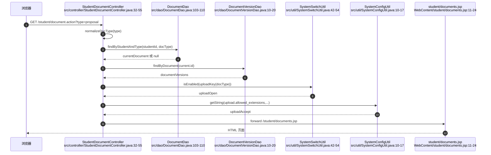

### 2.1 uploadOpen 在页面和后端分别做什么

`uploadOpen` 是“当前阶段是否允许上传”的运行期开关：

- Controller 的 GET 阶段用 `SystemSwitchUtil.uploadKey(docType)` 把 `proposal/midterm/final` 映射到 `switch.upload_proposal/switch.upload_midterm/switch.upload_final`，再读取开关值。
- JSP 如果发现 `uploadOpen=false`，显示黄色提示，并把标题输入框、正文、文件选择框、提交按钮都置为 `disabled`。
- Controller 的 POST 阶段仍然再次检查同一个开关；即使攻击者绕过前端禁用手工提交 multipart 请求，也会得到 `upload_closed`。

设计原因是：文档提交通常受毕业设计时间节点控制。页面禁用负责用户体验，后端开关负责真实安全边界。开关默认值由 `SystemConfigUtil.isEnabled(key, true)` 支持，配置缺失时按开启处理；`SystemSwitchUtil.ensureDefaults()` 会补齐默认开关项。

## 3. 学生 multipart POST 文档上传

学生提交文档表单时，JSP 表单使用：

```jsp
<form action="../student/document.action" method="post" enctype="multipart/form-data">
  <input type="hidden" name="docType" value="proposal">
  <input name="title" ...>
  <textarea name="content" ...></textarea>
  <input type="file" name="file" ...>
</form>
```

`multipart/form-data` 的意义是：浏览器不会把所有字段拼成普通 `a=b&c=d`，而是按 boundary 把每个字段拆成一个 part。普通字段仍可用 `request.getParameter("docType")`、`request.getParameter("title")`、`request.getParameter("content")` 读取；文件字段必须用 `request.getPart("file")` 读取。`StudentDocumentController` 标注了 `@MultipartConfig`，Servlet 容器才会解析 multipart 请求并提供 `Part` 对象。

典型请求形态：

```http
POST /student/document.action HTTP/1.1
Content-Type: multipart/form-data; boundary=----WebKitFormBoundary...
Cookie: JSESSIONID=...

------WebKitFormBoundary...
Content-Disposition: form-data; name="docType"

proposal
------WebKitFormBoundary...
Content-Disposition: form-data; name="title"

开题报告
------WebKitFormBoundary...
Content-Disposition: form-data; name="file"; filename="proposal.pdf"
Content-Type: application/pdf

...二进制文件...
------WebKitFormBoundary...--
```

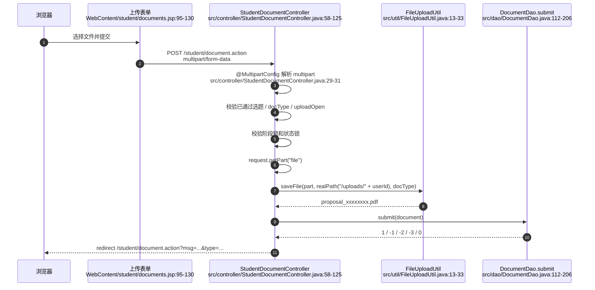

### 3.1 上传前的业务校验

学生 POST 不是“先落库再说”，而是先做业务校验：

1. 必须存在已通过选题，否则文档没有合法 `topic_id`，返回 `no_topic`。
2. `docType` 必须在 `document_type` 字典中，否则返回 `error`。
3. 当前阶段上传开关必须开启，否则返回 `upload_closed`。
4. 阶段锁必须满足：`proposal` 无前置；`midterm` 需要 `proposal` 已 `reviewed`；`final` 需要 `midterm` 已 `reviewed`。
5. 状态锁必须满足：同阶段已有文档时，只有 `rejected` 允许重交；`submitted` 正在等待审核，`reviewed` 已通过归档，都不允许被学生覆盖。

Controller 先做一次校验是为了及时给出重定向消息；DAO 在事务里再做一次锁定校验，才是并发场景下的最终约束。

### 3.2 文件保存路径、文件名和数据库路径

文档附件保存路径分两层：

- 物理目录：`getServletContext().getRealPath("/uploads/" + user.getId())`，即 Web 应用部署目录下的 `uploads/学生ID`。
- 数据库路径：`uploads/学生ID/保存后文件名`，例如 `uploads/4/proposal_ab12cd34.pdf`。

代码不保存绝对磁盘路径，原因是部署目录变化时数据库不用改，同时下载接口可以统一按相对路径做权限和目录边界校验。

`FileUploadUtil.saveFile(...)` 对文件做这些处理：

1. 空文件返回 `null`。
2. 读取 `upload.max_size_bytes`，默认最大 10MB，超限抛出 `IOException`。
3. 从 multipart part 的 `content-disposition` 中解析原始 `filename`。
4. 去掉浏览器可能带上的 Windows 反斜杠路径或 Unix 斜杠路径，只保留文件名本体。
5. 提取并小写化扩展名，要求在 `upload.allowed_extensions` 内，同时不能在 `upload.blocked_extensions` 内。
6. 创建上传目录。
7. 用 `docType_UUID前8位.ext` 生成保存名，再调用 `Part.write(...)` 写入磁盘。

这意味着用户上传的原始文件名不能决定最终目录，也不能构造 `../../xxx.jsp` 这类路径写入；目录由 Controller 固定，文件名由后端随机生成。

### 3.3 DocumentDao.submit 的事务与版本历史

`DocumentDao.submit` 是文档状态变化的核心：

- 事务开始后，先用 `FOR UPDATE` 锁定该学生对该课题的 approved 选题，保证文档确实挂在合法课题下。
- 中期 / 终稿会检查前置阶段是否已有 `reviewed` 文档；不满足时返回 `-2`。
- 对当前学生当前阶段已有文档记录加 `FOR UPDATE`，读取旧状态、旧标题、旧正文和旧附件。
- 如果已有记录但状态不是 `rejected`，返回 `-3`，阻止覆盖。
- 如果是 `rejected` 后重交，先把旧内容写入 `document_versions`，再更新同一条 `documents` 主记录为 `submitted`，并清空旧分数、反馈、审核时间和审核人。
- 如果没有旧记录，插入一条新 `documents`，初始状态为 `submitted`。

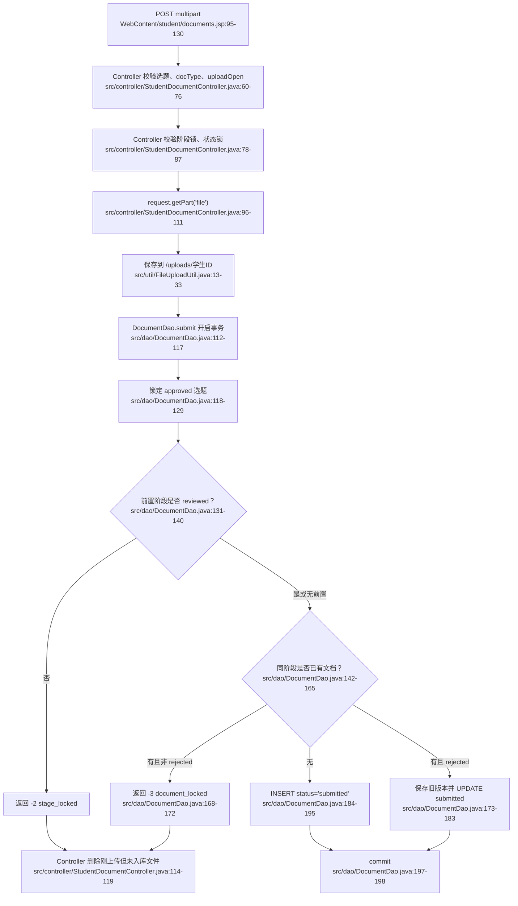

失败时删除刚上传文件的原因：文件先写磁盘，数据库后提交。如果 DAO 返回失败码或异常，数据库不会引用这个新文件，Controller 必须清理 `newFilePath`，避免产生孤儿附件。

## 4. 教师审核文档：列表、弹窗、状态更新

教师打开审核列表时：

```http
GET /teacher/document.action?type=proposal&status=submitted HTTP/1.1
Cookie: JSESSIONID=...
```

处理链路：

- Controller 读取教师、规范化文档阶段，`status` 缺省为 `submitted`。
- `DocumentDao.findByTeacher` 基础条件是 `topics.teacher_id = 当前教师ID`，再按 `doc_type` 和 `status` 追加过滤；`status=all` 时 Controller 传 `null`，表示不过滤状态。
- JSP 渲染阶段标签、状态筛选按钮、文档表格和审核 modal。
- 审核 modal 的 POST 表单提交 `id/docType/action/score/feedback`。

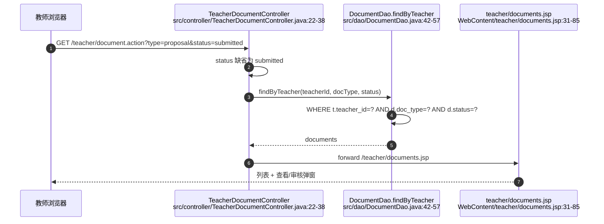

教师点击“通过并评分”或“驳回”时，浏览器发出普通表单 POST：

```http
POST /teacher/document.action HTTP/1.1
Content-Type: application/x-www-form-urlencoded
Cookie: JSESSIONID=...

id=12&docType=proposal&action=review&score=88&feedback=...
```

这里没有文件字段，所以不需要 `multipart/form-data`。审核规则：

- `action=review` 映射为 `status=reviewed`，必须提供 0-100 分。
- `action=reject` 映射为 `status=rejected`，DAO 会强制把分数置空。
- DAO 的更新 SQL 要求 `d.status='submitted'`，所以已审核通过或已驳回的记录不能被重复审核。
- DAO 的更新 SQL `JOIN topics` 并要求 `t.teacher_id=?`，所以教师只能审核自己指导课题下的文档。

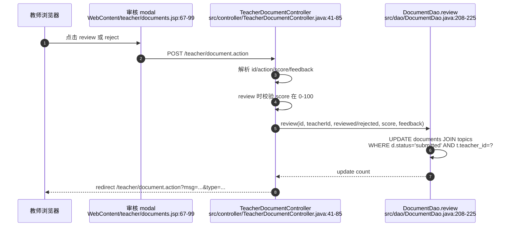

当前教师 JSP 的附件区域只是把 `filePath` 填成文本，没有直接渲染下载链接；但 `download.action` 支持教师权限校验：只要请求路径等于该教师名下某个文档的 `file_path`，即可下载。

## 5. download.action 文件流：path 参数、权限和防目录穿越

学生文档页会为当前附件和历史版本附件生成链接：

```text
../download.action?path=uploads%2F4%2Fproposal_ab12cd34.pdf
```

`path` 来自数据库中保存的相对路径。下载不直接暴露 `/uploads/4/xxx.pdf`，而是统一走 Controller，原因是静态文件服务无法判断“当前登录用户是否有权下载这个文件”。

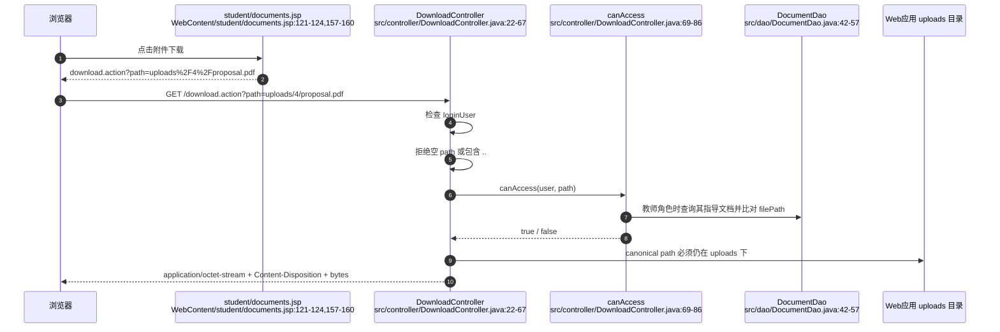

下载校验分四层：

1. 登录校验：没有 session 或没有 `loginUser` 时跳转登录页。
2. 字符串路径校验：`path == null` 或包含 `..` 立即返回 400；开头 `/` 会被去掉，统一成相对路径。
3. 角色权限校验：
   - 管理员：允许访问 `uploads/` 下文件。
   - 教师：必须是 `uploads/` 下路径，并且路径等于该教师指导文档中的某个 `file_path`。
   - 学生：只能访问 `uploads/自己的用户ID/` 前缀下文件。
4. canonical path 校验：目标文件 canonical path 必须位于 Web 根目录下的 `uploads` canonical path 内，并且真实存在且是普通文件。

防目录穿越的关键是两道门：

- 第一门：拒绝 `../../WEB-INF/web.xml` 这类包含 `..` 的参数。
- 第二门：即使路径经过分隔符、符号链接或编码变形，`getCanonicalFile()` 后仍必须以 `uploads` 目录 canonical path 加分隔符开头。

文件流响应：

- `Content-Type: application/octet-stream`：按通用二进制流返回。
- `Content-Disposition: attachment; filename="..."; filename*=UTF-8''...`：提示浏览器下载而不是渲染，并兼容 UTF-8 文件名。
- 通过 `FileInputStream` 每次读取 4096 bytes 写入 `response.getOutputStream()`。

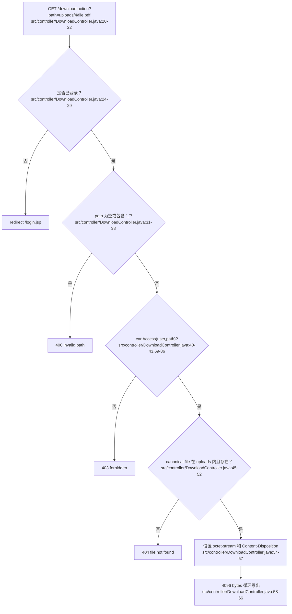

## 6. 文件模板列表：学生、教师、管理员共用 Controller

模板列表由同一个 `FileTemplateController` 处理三个 URL：

- `/student/file-template.action`
- `/teacher/file-template.action`
- `/admin/file-template.action`

GET 请求读取 `type/page/pageSize`，调用 `FileTemplateDao.findAll(type, page, pageSize)` 和 `countAll(type)`，再根据 servlet path 选择不同 JSP：

- `/admin/`：`/admin/file-templates.jsp`
- `/student/`：`/student/file-templates.jsp`
- 其他：`/teacher/file-templates.jsp`

DAO 查询只返回 `status=1` 的模板，并按 `created_at DESC, id DESC` 排序；带分页时拼接 `LIMIT ? OFFSET ?`。因此学生、教师看到的是可用模板列表，管理员当前管理页也展示可用模板，删除操作是物理删除数据库记录。

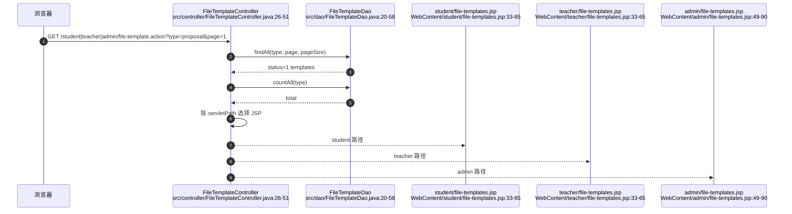

学生和教师模板 JSP 的结构基本一致：顶部按文档类型过滤，表格展示模板名称、类型、原文件名、大小、上传人、上传时间、说明，并通过 `../file-template-download.action?id=模板ID` 下载。管理员 JSP 多了消息提示、上传按钮、删除表单和上传 modal。

## 7. 管理员模板上传 / 删除管理

管理员上传模板的表单也使用 `multipart/form-data`，因为它同样包含文件字段：

```jsp
<form action="../admin/file-template.action" method="post" enctype="multipart/form-data">
  <input type="hidden" name="action" value="upload">
  <input name="templateName" ...>
  <select name="docType">...</select>
  <input type="file" name="file" ...>
  <textarea name="description"></textarea>
</form>
```

后端处理：

1. `FileTemplateController` 映射了管理员 / 教师 / 学生三个模板 URL，并标注 `@MultipartConfig`。
2. POST 入口首先检查当前用户角色必须是 `admin`，非管理员直接 403。
3. `action=upload` 时：
   - `templateName` 不能为空。
   - `request.getPart("file")` 必须存在且大小大于 0。
   - 上传目录固定为 `/uploads/templates`。
   - 使用 `FileUploadUtil.getFileName(part)` 记录原始文件名。
   - 使用 `FileUploadUtil.saveFile(part, uploadDir, "template")` 生成随机保存名，例如 `template_ab12cd34.docx`。
   - 数据库保存 `file_path=uploads/templates/保存名`、`original_filename=原文件名`、`file_size`、`uploader_id` 等字段。
4. `action=delete` 时：
   - 从请求中解析 `id`。
   - 先按 id 查询模板记录。
   - 删除数据库记录。
   - 再按记录中的 `file_path` 删除物理文件；删除物理文件前会拒绝包含 `..` 的路径。

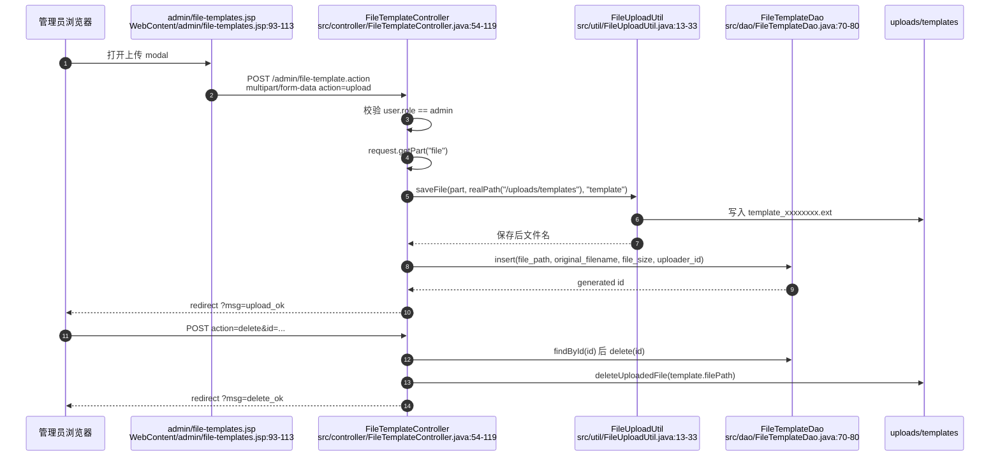

模板上传和学生文档上传复用同一套 `FileUploadUtil`，所以大小限制、允许扩展名、禁止扩展名、文件名路径剥离、随机保存名逻辑一致。管理员 JSP 文件选择框写死了 `accept=".pdf,.doc,.docx,.zip,.rar"`，但真正的安全边界仍在后端 `FileUploadUtil.validateExtension(...)` 和系统配置。

## 8. 模板下载流：id 参数到文件流

模板下载链接不把 `file_path` 暴露给浏览器，而是只传主键：

```text
../file-template-download.action?id=12
```

后端流程：

1. 必须已登录，否则跳转登录页。
2. 将 `id` 解析为整数，失败返回 400。
3. 通过 `FileTemplateDao.findById(id)` 查询模板记录。
4. 记录不存在、`file_path` 为空或包含 `..` 时返回 404。
5. 计算 Web 根目录、`uploads/templates` canonical path、模板文件 canonical path。
6. 文件 canonical path 必须位于 `uploads/templates` 下，且真实存在并为普通文件。
7. `Content-Type` 设为 `application/octet-stream`。
8. 下载文件名优先使用数据库中的 `original_filename`，为空时才使用磁盘保存名。
9. 设置 `Content-Disposition` 的 `filename` 和 `filename*`，再循环写出文件 bytes。

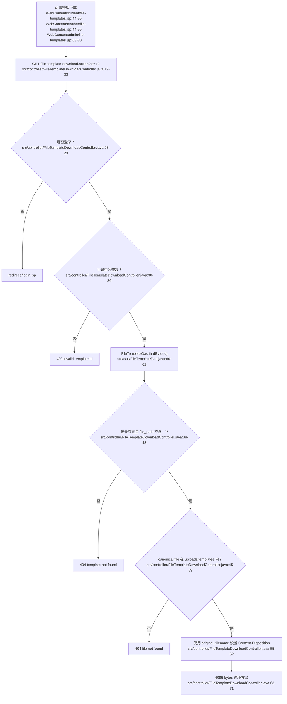

模板下载用 `id` 而不是 `path` 的设计理由：模板文件是公共资源，不需要像学生文档那样按学生 / 指导教师关系逐个比对；但仍然不能让浏览器任意指定文件路径。因此让客户端只提供数据库主键，由服务端根据记录反查 `file_path`，再限定在 `uploads/templates` 目录内。

## 9. 状态锁、阶段锁、系统开关和路径安全的整体关系

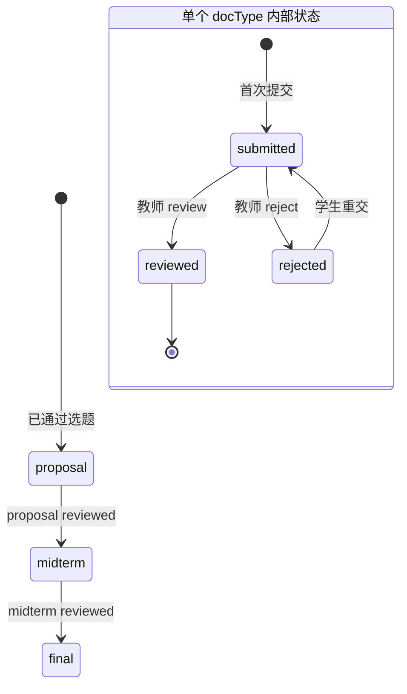

- 阶段锁解决“毕业设计流程顺序”问题：没有通过开题不能交中期，没有通过中期不能交终稿。
- 状态锁解决“同一阶段能不能覆盖”问题：等待审核和已通过不能被学生覆盖，只有退回后才能重交。
- 教师审核锁解决“谁能审、能不能重复审”问题：只有指导教师能审，且只有 `submitted` 能变成 `reviewed/rejected`。
- 系统开关解决“当前时间段是否允许上传”问题：页面禁用只是提示，POST 校验才是硬限制。
- 上传路径安全解决“客户端文件名不能控制服务器路径”问题：目录由 Controller 固定，保存名由后端随机生成，原文件名只用于展示或模板下载名。
- 下载路径安全解决“不能越权读文件”问题：学生文档下载用 `path` 但有角色权限和 canonical path 双重校验；模板下载用 `id` 间接定位文件，并限定在 `uploads/templates` 内。

## 10. 代码证据清单

- `WebContent/student/documents.jsp:11-24`：学生文档页读取 Controller 注入的属性，缺少关键属性时重定向回 `/student/document.action`。
- `WebContent/student/documents.jsp:18-21`：读取 `uploadAccept` 和 `uploadOpen`，并设置默认允许扩展名和默认开启上传。
- `WebContent/student/documents.jsp:39-55`：没有通过选题时显示空状态，不渲染上传表单。
- `WebContent/student/documents.jsp:59-64`：按文档类型生成学生阶段切换 GET 链接。
- `WebContent/student/documents.jsp:75-79`：`uploadOpen=false` 时显示上传关闭提示。
- `WebContent/student/documents.jsp:81-91`：显示当前文档提交状态、分数和反馈。
- `WebContent/student/documents.jsp:95-130`：学生文档上传表单使用 POST、`multipart/form-data`、隐藏 `docType`、文件字段 `file`，并按 `uploadOpen` 禁用输入和提交按钮。
- `WebContent/student/documents.jsp:121-124`：当前附件下载链接使用 `download.action?path=...` 并对相对路径做 URL 编码。
- `WebContent/student/documents.jsp:137-167`：历史版本列表和历史版本附件下载链接。
- `WebContent/teacher/documents.jsp:6-14`：教师文档页读取 `docType/statusFilter/documents/typeNames`，缺失时重定向回 Controller。
- `WebContent/teacher/documents.jsp:31-42`：教师阶段标签和 `submitted/reviewed/rejected/all` 状态筛选链接。
- `WebContent/teacher/documents.jsp:48-63`：教师文档表格和“查看/审核”按钮。
- `WebContent/teacher/documents.jsp:67-85`：教师审核 modal 表单，提交 `id/docType/action/score/feedback`。
- `WebContent/teacher/documents.jsp:89-99`：前端脚本填充 modal，并且只有 `submitted` 状态显示审核按钮。
- `WebContent/student/file-templates.jsp:13-20`：学生模板页读取模板列表、类型字典、分页和过滤条件，缺失时重定向回 Controller。
- `WebContent/student/file-templates.jsp:33-37`：学生模板页按文档类型生成过滤链接。
- `WebContent/student/file-templates.jsp:44-55`：学生模板列表展示模板信息并用 `file-template-download.action?id=...` 下载。
- `WebContent/student/file-templates.jsp:60-64`：学生模板页复用分页组件。
- `WebContent/teacher/file-templates.jsp:13-20`：教师模板页读取模板列表、类型字典、分页和过滤条件，缺失时重定向回 Controller。
- `WebContent/teacher/file-templates.jsp:33-37`：教师模板页按文档类型生成过滤链接。
- `WebContent/teacher/file-templates.jsp:44-55`：教师模板列表展示模板信息并用 `file-template-download.action?id=...` 下载。
- `WebContent/teacher/file-templates.jsp:60-64`：教师模板页复用分页组件。
- `WebContent/admin/file-templates.jsp:28-36`：管理员模板页根据 `msg` 参数生成上传、删除、校验失败等提示。
- `WebContent/admin/file-templates.jsp:49-57`：管理员模板页生成类型过滤链接和“上传模板”按钮。
- `WebContent/admin/file-templates.jsp:63-80`：管理员模板表格展示下载按钮和删除表单，删除提交 `action=delete&id=...`。
- `WebContent/admin/file-templates.jsp:93-113`：管理员上传模板 modal，表单使用 POST、`multipart/form-data`、`action=upload` 和文件字段 `file`。
- `src/controller/StudentDocumentController.java:29-31`：学生文档 Controller 映射 `/student/document.action` 并启用 `@MultipartConfig`。
- `src/controller/StudentDocumentController.java:32-55`：学生 GET 文档页准备通过选题、当前文档、版本历史、`uploadOpen`、`uploadAccept` 并 forward 到 JSP。
- `src/controller/StudentDocumentController.java:50-54`：按文档阶段读取上传开关和允许扩展名。
- `src/controller/StudentDocumentController.java:58-76`：学生 POST 设置编码、校验已通过选题、校验 `docType`、校验上传开关。
- `src/controller/StudentDocumentController.java:78-87`：学生 POST 校验阶段锁和状态锁。
- `src/controller/StudentDocumentController.java:89-112`：构造 Document，读取 `request.getPart("file")`，保存到 `/uploads/用户ID` 并生成相对路径。
- `src/controller/StudentDocumentController.java:114-125`：调用 `DocumentDao.submit`，失败清理刚上传文件，成功记录日志并重定向。
- `src/controller/StudentDocumentController.java:128-140`：学生文档重定向、文档类型归一化和字典项读取。
- `src/controller/StudentDocumentController.java:142-149`：删除刚上传但未成功入库的物理文件。
- `src/controller/TeacherDocumentController.java:20-21`：教师文档 Controller 映射 `/teacher/document.action`。
- `src/controller/TeacherDocumentController.java:22-38`：教师 GET 审核页读取阶段和状态，查询文档列表并 forward。
- `src/controller/TeacherDocumentController.java:41-65`：教师 POST 审核入口，解析 action 和 score，并校验通过评分为 0-100。
- `src/controller/TeacherDocumentController.java:67-84`：教师 POST 调用 DAO 审核，发送通知，记录日志并重定向。
- `src/controller/TeacherDocumentController.java:87-100`：教师审核后的重定向和文档类型归一化。
- `src/controller/DownloadController.java:20-22`：学生文档附件下载 Controller 映射 `/download.action`。
- `src/controller/DownloadController.java:24-29`：下载前必须存在登录用户，否则跳转登录。
- `src/controller/DownloadController.java:31-38`：校验 `path`，拒绝空路径和包含 `..` 的路径，并去掉开头 `/`。
- `src/controller/DownloadController.java:40-43`：下载前调用角色权限校验。
- `src/controller/DownloadController.java:45-52`：canonical path 限定目标文件必须位于 `uploads` 目录下且真实存在。
- `src/controller/DownloadController.java:54-66`：设置 `application/octet-stream`、`Content-Disposition`，并循环写出文件 bytes。
- `src/controller/DownloadController.java:69-86`：管理员、教师、学生三类附件下载权限规则。
- `src/controller/FileTemplateController.java:23-25`：模板 Controller 同时映射管理员、教师、学生模板 URL，并启用 `@MultipartConfig`。
- `src/controller/FileTemplateController.java:26-51`：模板 GET 列表读取过滤和分页，查询模板和总数，并按 servlet path 选择 JSP。
- `src/controller/FileTemplateController.java:54-71`：模板 POST 只允许管理员，并按 `action=upload|delete` 分发。
- `src/controller/FileTemplateController.java:73-119`：管理员模板上传校验名称和文件，保存到 `/uploads/templates`，插入 `file_templates` 并记录日志。
- `src/controller/FileTemplateController.java:121-145`：管理员模板删除按 id 查询记录、删除数据库记录、删除物理文件并记录日志。
- `src/controller/FileTemplateController.java:147-163`：模板文档类型归一化、字符串 trim、删除物理文件时拒绝包含 `..` 的路径。
- `src/controller/FileTemplateDownloadController.java:19-22`：模板下载 Controller 映射 `/file-template-download.action`。
- `src/controller/FileTemplateDownloadController.java:23-28`：模板下载必须已登录，否则跳转登录。
- `src/controller/FileTemplateDownloadController.java:30-36`：模板下载解析 `id`，非法 id 返回 400。
- `src/controller/FileTemplateDownloadController.java:38-43`：按 id 查询模板，拒绝不存在、空路径或包含 `..` 的模板路径。
- `src/controller/FileTemplateDownloadController.java:45-53`：canonical path 限定模板文件必须在 `uploads/templates` 下且真实存在。
- `src/controller/FileTemplateDownloadController.java:55-62`：模板下载使用原始文件名设置 `Content-Disposition`。
- `src/controller/FileTemplateDownloadController.java:63-71`：模板下载循环读取 4096 bytes 写入响应流。
- `src/dao/DocumentDao.java:15-20`：文档基础查询关联 documents、users、topics。
- `src/dao/DocumentDao.java:42-57`：教师按指导课题、文档类型和状态查询文档。
- `src/dao/DocumentDao.java:95-110`：按 id 或学生加文档类型查询单个文档。
- `src/dao/DocumentDao.java:112-117`：学生提交文档时开启数据库事务。
- `src/dao/DocumentDao.java:118-140`：事务内锁定 approved 选题并检查前置阶段是否 reviewed。
- `src/dao/DocumentDao.java:142-172`：锁定同阶段已有文档，非 `rejected` 时拒绝覆盖。
- `src/dao/DocumentDao.java:173-195`：`rejected` 重交时保存旧版本并更新为 `submitted`，首次提交时插入 `submitted`。
- `src/dao/DocumentDao.java:197-205`：提交事务，异常时回滚并关闭连接。
- `src/dao/DocumentDao.java:208-225`：教师 review/reject 的状态校验、分数校验和 `JOIN topics` 权限更新。
- `src/dao/DocumentDao.java:227-243`：阶段锁规则：`proposal` 无前置，`midterm` 依赖 `proposal`，`final` 依赖 `midterm`。
- `src/dao/DocumentDao.java:256-270`：把旧文档内容保存到 `document_versions`。
- `src/dao/DocumentDao.java:296-323`：数据库行映射到 Document 对象，包括 `filePath/status/score/feedback`。
- `src/dao/DocumentVersionDao.java:10-20`：按文档查询历史版本并按版本号倒序。
- `src/dao/DocumentVersionDao.java:22-30`：独立保存历史版本的方法。
- `src/dao/DocumentVersionDao.java:32-42`：数据库行映射到 DocumentVersion。
- `src/dao/FileTemplateDao.java:11-14`：模板基础查询关联 file_templates 和 users。
- `src/dao/FileTemplateDao.java:20-35`：模板分页查询入口和总数统计入口。
- `src/dao/FileTemplateDao.java:37-58`：模板查询按类型过滤、只取 `status=1`、排序并分页。
- `src/dao/FileTemplateDao.java:60-68`：按 id 或 path 查询模板记录。
- `src/dao/FileTemplateDao.java:70-77`：插入模板记录并写入文件路径、原始文件名、大小和上传人。
- `src/dao/FileTemplateDao.java:79-86`：删除模板记录或更新模板状态。
- `src/dao/FileTemplateDao.java:96-110`：数据库行映射到 FileTemplate 对象。
- `src/util/FileUploadUtil.java:13-20`：上传文件为空或超过最大大小时拒绝。
- `src/util/FileUploadUtil.java:21-33`：解析原文件名、校验扩展名、创建目录、生成随机保存名并写入磁盘。
- `src/util/FileUploadUtil.java:36-51`：从 multipart `content-disposition` 中解析 `filename` 并剥离客户端路径。
- `src/util/FileUploadUtil.java:54-60`：提取并小写化扩展名。
- `src/util/FileUploadUtil.java:62-75`：按允许扩展名和禁止扩展名配置校验文件类型。
- `src/util/SystemConfigUtil.java:10-17`：从 `system_configs` 读取字符串配置。
- `src/util/SystemConfigUtil.java:28-35`：读取 long 类型配置，例如上传大小。
- `src/util/SystemConfigUtil.java:37-47`：读取 CSV 配置并转成小写集合。
- `src/util/SystemConfigUtil.java:49-57`：读取布尔开关配置并支持默认值。
- `src/util/SystemConfigUtil.java:64-80`：更新、插入或补齐系统配置。
- `src/util/SystemSwitchUtil.java:6-13`：定义选题和三类文档上传开关 key。
- `src/util/SystemSwitchUtil.java:14-21`：系统开关展示名称定义。
- `src/util/SystemSwitchUtil.java:42-54`：读取开关状态并把 `docType` 映射到上传开关 key。
- `src/util/SystemSwitchUtil.java:56-74`：更新开关并补齐默认开关配置。
- `src/dbutil/SQLHelper.java:16-28`：初始化 Druid 数据源。
- `src/dbutil/SQLHelper.java:30-46`：从 `jdbc.properties` 加载数据库连接配置。
- `src/dbutil/SQLHelper.java:48-50`：获取数据库连接。
- `src/dbutil/SQLHelper.java:52-77`：执行列表查询并映射为 `Object[]`。
- `src/dbutil/SQLHelper.java:79-94`：执行更新 SQL。
- `src/dbutil/SQLHelper.java:96-115`：执行标量查询。
- `src/dbutil/SQLHelper.java:117-137`：执行插入并返回自增主键。
- `src/dbutil/SQLHelper.java:139-155`：绑定 PreparedStatement 参数并关闭 JDBC 资源。
