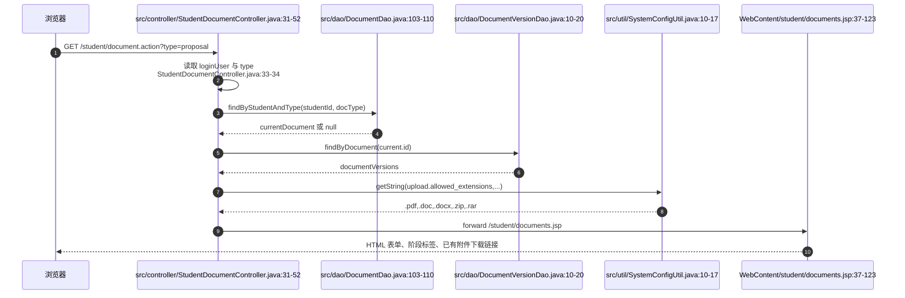
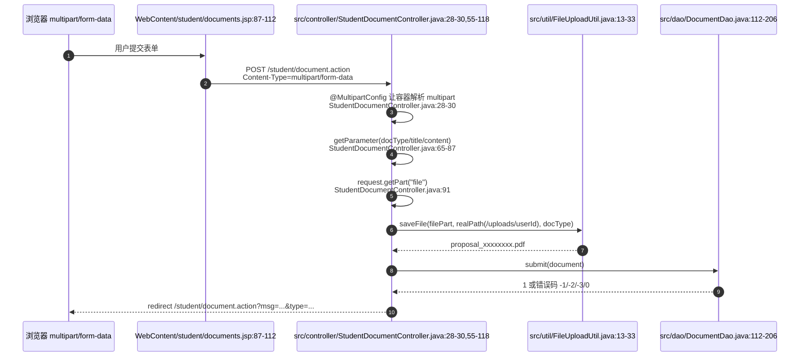
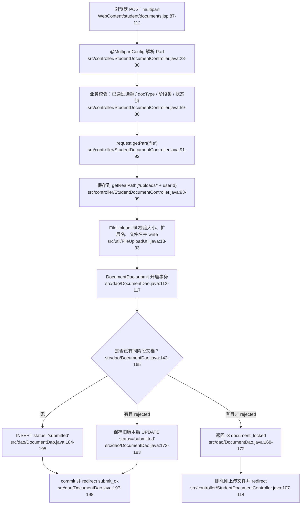
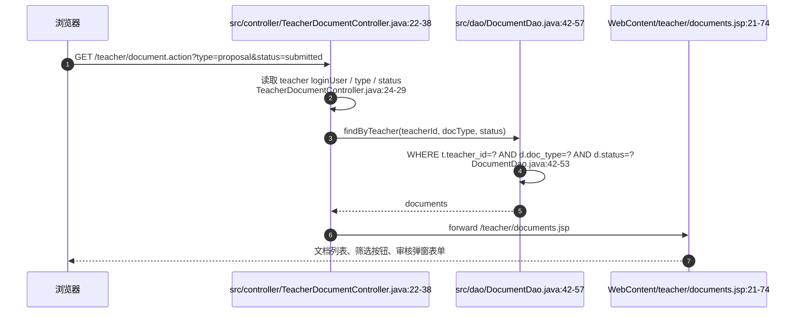
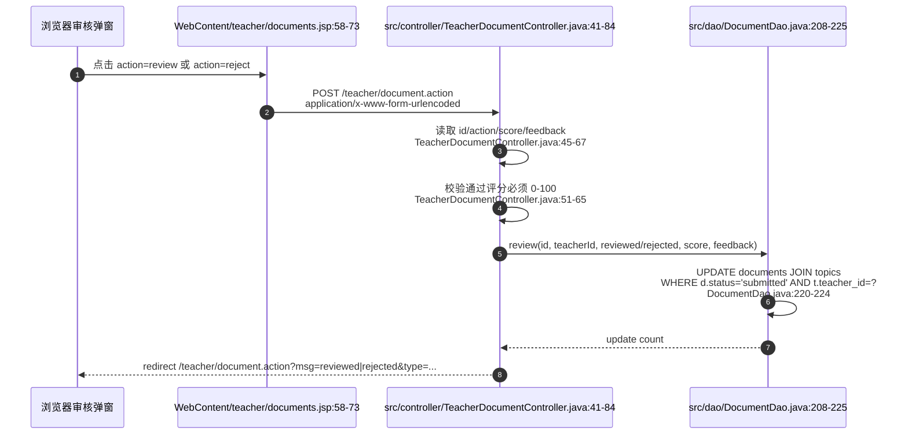
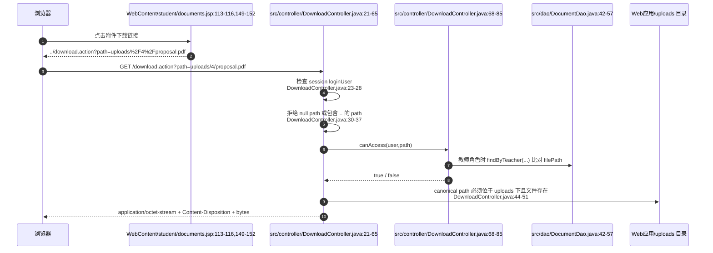
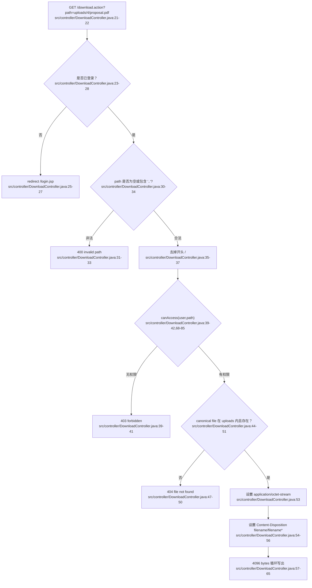
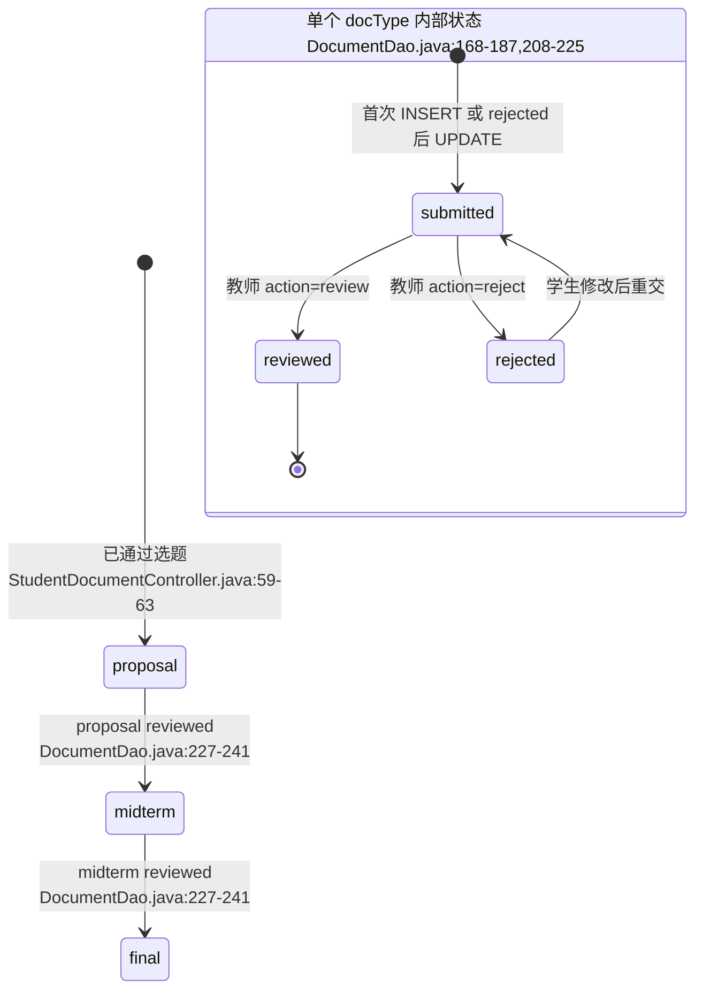

# 03 学生文档提交上传 / 教师文档审核 / 文件下载网络数据流详解

本部分只解释毕业设计文档模块的网络请求与后端处理链路，不包含 AI 模块。涉及的核心入口有三个：

1. 学生文档页：`GET /student/document.action?type=proposal|midterm|final`
2. 学生提交文档：`POST /student/document.action`，`Content-Type: multipart/form-data`
3. 教师审核文档：`GET /teacher/document.action` 与 `POST /teacher/document.action`
4. 文件下载：`GET /download.action?path=uploads/用户ID/文件名`

## 1. 接口总览与字段表

| 流程 | URL | 方法 | 请求 Content-Type | 主要参数 / 字段 | 响应 |
|---|---|---|---|---|---|
| 学生打开文档提交页 | `/student/document.action?type=proposal` | GET | 无请求体 | `type`: 文档阶段，非法或缺省时归一化为 `proposal` | 转发到 `/student/documents.jsp`，响应 HTML |
| 学生提交文档与附件 | `/student/document.action` | POST | `multipart/form-data` | `docType`, `title`, `content`, `file` | 成功或失败后 302 重定向回学生文档页，并带 `msg` 与 `type` |
| 教师打开文档审核页 | `/teacher/document.action?type=proposal&status=submitted` | GET | 无请求体 | `type`, `status`；`status` 缺省为 `submitted`，`all` 表示不过滤状态 | 转发到 `/teacher/documents.jsp`，响应 HTML |
| 教师提交审核结果 | `/teacher/document.action` | POST | `application/x-www-form-urlencoded` | `id`, `docType`, `action=review|reject`, `score`, `feedback` | 成功或失败后 302 重定向回教师文档页 |
| 下载附件 | `/download.action?path=uploads/4/proposal_xxxx.pdf` | GET | 无请求体 | `path`: 数据库中保存的相对路径 | 通过校验后返回 `application/octet-stream` 文件流；失败返回 400/403/404 或跳转登录 |

### 1.1 字段与约定解释

| 名称 | 含义 | 代码约定 |
|---|---|---|
| `proposal` | 开题报告阶段 | 第一阶段，不需要前置文档通过 |
| `midterm` | 中期检查阶段 | 必须已有 `proposal` 且状态为 `reviewed` |
| `final` | 终稿阶段 | 必须已有 `midterm` 且状态为 `reviewed` |
| `submitted` | 学生已提交，等待教师审核 | 首次提交或被退回后重新提交都会进入该状态 |
| `reviewed` | 教师审核通过并可评分 | 通过后不能再被学生覆盖提交 |
| `rejected` | 教师驳回 | 只有该状态允许学生修改后重新提交 |
| `multipart/form-data` | 浏览器将普通字段和文件字段按 multipart 边界分段上传 | 必须配合表单 `enctype="multipart/form-data"` 和 Servlet `@MultipartConfig`，后端才能用 `request.getPart("file")` 读取文件段 |
| `uploads/用户ID/文件名` | 数据库存储的附件相对路径 | 例如 `uploads/4/proposal_ab12cd34.pdf`；不保存绝对磁盘路径，便于迁移和下载权限校验 |
| `path` | 下载接口查询参数 | 来自 `documents.file_path` 或 `document_versions.file_path`，下载时禁止包含 `..` |
| `..` 目录穿越 | 攻击者尝试访问上传目录外文件的路径片段 | `DownloadController` 先拦截包含 `..` 的参数，再用 canonical path 二次确认文件仍在 `uploads` 目录内 |
| `application/octet-stream` | 通用二进制下载响应类型 | 浏览器通常按附件保存，不直接按页面渲染 |
| `Content-Disposition` | 告诉浏览器以附件方式下载，并指定文件名 | 同时设置 `filename` 和 `filename*`，后者按 RFC 5987 风格承载 UTF-8 文件名 |

## 2. 学生 GET 文档页：从浏览器到 JSP 表单

### 2.1 浏览器发出的请求

学生点击“文档提交”或切换开题 / 中期 / 终稿标签时，浏览器发出 GET 请求：

```http
GET /student/document.action?type=proposal HTTP/1.1
Cookie: JSESSIONID=...
```

这里没有请求体，也没有上传文件。`type` 表示当前要查看或提交的文档阶段。后端会用字典校验该值，非法值不会直接进入 SQL 或页面，而是被归一化为 `proposal`。

### 2.2 Controller 如何准备页面数据

`StudentDocumentController` 的 GET 入口读取 session 中的登录用户，再读取并规范化 `type` 参数。随后它做三件事：

1. 查询学生是否已有通过审批的选题。
2. 如果已有通过选题，则查询当前阶段已有文档。
3. 如果已有文档，则查询历史版本，并把所有页面需要的数据放入 request attribute，最后 forward 到 JSP。

关键代码逻辑：

- `src/controller/StudentDocumentController.java:33-34`：从 session 取 `loginUser`，从 URL 取 `type` 并规范化。
- `src/controller/StudentDocumentController.java:35-42`：查已通过选题、当前文档、历史版本。
- `src/controller/StudentDocumentController.java:44-52`：把 `approvedSelection`、`currentDocument`、`documentVersions`、`activeType`、`typeNames`、`uploadAccept` 放入 request，然后 forward。
- `src/util/SystemConfigUtil.java:10-17`：`uploadAccept` 背后的扩展名配置来自 `system_configs` 表，查不到则使用默认值。



### 2.3 JSP 如何渲染“能不能提交”

`WebContent/student/documents.jsp` 并不自己查数据库，它只消费 Controller 放好的 request attribute：

- `WebContent/student/documents.jsp:11-19`：读取 `typeNames`、`approvedSelection`、`activeType`、`currentDocument`、`documentVersions`、`uploadAccept`。
- `WebContent/student/documents.jsp:20-23`：如果这些关键属性没有准备好，说明不是从 Controller 正常 forward 进来，于是重定向到 `/student/document.action`。
- `WebContent/student/documents.jsp:37-49`：如果没有通过选题，页面显示“无法提交文档”，不给上传表单。
- `WebContent/student/documents.jsp:57-63`：按字典中的文档类型生成阶段标签，每个标签都是一次 GET 请求。
- `WebContent/student/documents.jsp:73-83`：如果当前文档不是 `draft`，展示已提交状态、分数和反馈。
- `WebContent/student/documents.jsp:87-123`：真正的上传表单，表单方法是 POST，编码类型是 `multipart/form-data`。
- `WebContent/student/documents.jsp:129-159`：如果有历史版本，则展示版本号、标题、提交时间和下载链接。

页面中的上传表单非常关键：

```jsp
<form action="../student/document.action" method="post" enctype="multipart/form-data">
  <input type="hidden" name="docType" value="...">
  <input name="title" ...>
  <textarea name="content" ...></textarea>
  <input type="file" name="file" ...>
</form>
```

其中 `enctype="multipart/form-data"` 决定浏览器不会把表单编码成普通的 `a=b&c=d`，而是把每个字段拆成 multipart 的一个 part；`name="file"` 决定后端必须用 `request.getPart("file")` 才能取到这个文件字段。

## 3. 学生 POST 上传：multipart/form-data 如何进入 request.getPart("file")

### 3.1 浏览器发出的 multipart 请求

学生填写标题、正文并选择附件后，浏览器发出类似请求：

```http
POST /student/document.action HTTP/1.1
Content-Type: multipart/form-data; boundary=----WebKitFormBoundary...
Cookie: JSESSIONID=...

------WebKitFormBoundary...
Content-Disposition: form-data; name="docType"

proposal
------WebKitFormBoundary...
Content-Disposition: form-data; name="title"

开题报告
------WebKitFormBoundary...
Content-Disposition: form-data; name="content"

正文内容
------WebKitFormBoundary...
Content-Disposition: form-data; name="file"; filename="proposal.pdf"
Content-Type: application/pdf

...二进制文件内容...
------WebKitFormBoundary...--
```

普通字段 `docType/title/content` 仍可用 `request.getParameter(...)` 读取；文件字段不会出现在普通参数里，而是作为 `Part` 存在，所以代码使用 `request.getPart("file")`。

### 3.2 为什么 Servlet 必须写 @MultipartConfig

`StudentDocumentController` 类上有：

- `src/controller/StudentDocumentController.java:28-30`：`@WebServlet("/student/document.action")` 与 `@MultipartConfig`。

`@MultipartConfig` 是 Servlet 容器解析 multipart 请求的开关。没有这个注解或等价 web.xml 配置时，容器不会把上传体解析成 `Part`，`request.getPart("file")` 通常会失败或无法取得文件。也就是说：

- JSP 的 `enctype="multipart/form-data"` 是浏览器端约定。
- Servlet 的 `@MultipartConfig` 是服务器端约定。
- `input type="file" name="file"` 的 `name` 必须和 `request.getPart("file")` 完全一致。



### 3.3 Controller 上传前的业务校验

上传不是一收到文件就直接入库。`StudentDocumentController.doPost` 先做业务校验：

1. `src/controller/StudentDocumentController.java:57-58`：设置请求编码 UTF-8，并取当前登录用户。
2. `src/controller/StudentDocumentController.java:59-63`：必须存在“已通过”的选题，否则返回 `no_topic`。设计原因是文档必须挂在具体课题下，不能让没有课题的学生产生孤儿文档。
3. `src/controller/StudentDocumentController.java:65-69`：`docType` 必须存在于 `document_type` 字典中，非法阶段直接拒绝。
4. `src/controller/StudentDocumentController.java:71-76`：调用 `documentDao.isStageAvailable(...)` 做阶段锁。中期必须等开题 `reviewed`，终稿必须等中期 `reviewed`。
5. `src/controller/StudentDocumentController.java:77-80`：如果已有同阶段文档，且状态不是 `rejected`，拒绝覆盖。设计原因是 `submitted` 正在等教师审，`reviewed` 已通过归档，都不应该被学生随意覆盖。

这两把锁可以概括为：

- 阶段锁：控制 `proposal -> midterm -> final` 的顺序。
- 状态锁：控制同一阶段只有 `rejected` 才能重交。

### 3.4 文件保存目录与相对路径

通过校验后，Controller 构造 `Document` 对象并处理附件：

- `src/controller/StudentDocumentController.java:82-88`：填充 `studentId/topicId/docType/title/content`。
- `src/controller/StudentDocumentController.java:89`：如果是驳回后重交，先沿用旧附件路径。
- `src/controller/StudentDocumentController.java:91-92`：读取 `request.getPart("file")`，只有确实上传了文件才保存。
- `src/controller/StudentDocumentController.java:93`：真实保存目录是 Web 应用部署目录下的 `/uploads/用户ID`。
- `src/controller/StudentDocumentController.java:95-99`：`FileUploadUtil.saveFile(...)` 返回保存后的文件名，数据库路径拼成 `uploads/用户ID/文件名`。
- `src/controller/StudentDocumentController.java:105`：把相对路径放进 `document.filePath`。

这里刻意保存相对路径，而不是 `D:\...\webapps\...\uploads\4\proposal_xxx.pdf` 这种绝对路径。原因是：

1. 数据库记录更短、更稳定。
2. 项目部署目录变化时不用迁移数据库。
3. 下载接口可以统一检查 `path` 是否在 `uploads/` 之下。

### 3.5 FileUploadUtil 对文件的逐段处理

`FileUploadUtil.saveFile` 做的是“文件级安全和落盘”：

- `src/util/FileUploadUtil.java:13-16`：空文件直接返回 `null`。
- `src/util/FileUploadUtil.java:17-20`：从系统配置读取最大上传大小，默认 10MB，超过则抛出 `IOException`。
- `src/util/FileUploadUtil.java:21-24`：从 multipart part 的 `content-disposition` 头里解析原始文件名。
- `src/util/FileUploadUtil.java:25-26`：提取扩展名并校验。
- `src/util/FileUploadUtil.java:27-30`：如果 `/uploads/用户ID` 目录不存在，就创建目录。
- `src/util/FileUploadUtil.java:31-33`：保存名采用 `docType_UUID前8位.ext`，例如 `proposal_ab12cd34.pdf`，然后调用 `filePart.write(...)` 写入磁盘。

文件名解析也做了路径剥离：

- `src/util/FileUploadUtil.java:36-51`：从 `content-disposition` 中找 `filename=...`，并去掉浏览器可能带上的 Windows 反斜杠路径或 Unix 斜杠路径，只保留最终文件名。

扩展名校验来自配置：

- `src/util/FileUploadUtil.java:62-75`：空扩展名拒绝，阻止 `exe/jsp/jspx/bat/cmd/sh` 等危险扩展名，并要求扩展名在允许列表内。
- `src/util/SystemConfigUtil.java:37-47`：CSV 配置会被拆分、trim、转小写后放入集合。

### 3.6 DocumentDao.submit 如何改变状态

文件保存只是磁盘动作，真正的业务状态由 `DocumentDao.submit` 写入数据库。该方法使用事务：

- `src/dao/DocumentDao.java:112-117`：拿连接并关闭自动提交。
- `src/dao/DocumentDao.java:118-129`：用 `FOR UPDATE` 锁住已通过的选题记录，确认学生确实对该课题有 `approved` 选题；没有则回滚并返回 `-1`。
- `src/dao/DocumentDao.java:131-140`：计算前置阶段并查询前置文档是否 `reviewed`；不满足则返回 `-2`，对应阶段锁。
- `src/dao/DocumentDao.java:142-165`：用 `FOR UPDATE` 锁住当前学生当前阶段的文档记录，读取旧状态、旧标题、旧正文、旧附件路径。
- `src/dao/DocumentDao.java:168-172`：如果已有记录但不是 `rejected`，回滚并返回 `-3`，对应文档状态锁。
- `src/dao/DocumentDao.java:173-183`：如果是 `rejected` 重交，先保存旧版本，再把同一条 documents 记录更新为 `submitted`，并清空旧的分数、反馈、审核时间和审核人。
- `src/dao/DocumentDao.java:184-195`：如果没有旧记录，则插入新 documents 记录，初始状态直接是 `submitted`。
- `src/dao/DocumentDao.java:197-205`：提交事务；异常时回滚并返回 0。

为什么上传失败后要删除刚上传文件？因为 Controller 的顺序是“先把文件写到磁盘，再调用 DAO 入库”。如果 DAO 返回 `-2`、`-3` 或 0，数据库不会引用这个新文件。`src/controller/StudentDocumentController.java:107-114` 会调用 `deleteUploadedFile(newFilePath)` 清理刚写入但未被数据库采用的附件，避免产生孤儿文件。



### 3.7 版本历史如何形成

当文档被教师驳回后，学生重新提交同阶段文档，`DocumentDao.submit` 不会新建第二条 documents 主记录，而是：

1. 把旧标题、旧正文、旧附件路径保存到 `document_versions`。
2. 更新原 documents 主记录为新内容，并把状态重新置为 `submitted`。

证据：

- `src/dao/DocumentDao.java:256-270`：在事务内计算下一个 `version_no`，插入 `document_versions`。
- `src/dao/DocumentVersionDao.java:10-20`：学生 GET 页面按 `version_no DESC` 查询历史版本。
- `WebContent/student/documents.jsp:129-159`：JSP 展示历史版本，并给每个历史附件生成下载链接。

这个设计能保证“当前文档”永远在 `documents` 表里只有一条，同时保留每次被退回前的历史快照。

## 4. 教师 GET 审核页：按教师、阶段、状态查询文档

### 4.1 浏览器发出的请求

教师进入文档审核页或点击状态筛选按钮时，浏览器发出 GET 请求：

```http
GET /teacher/document.action?type=proposal&status=submitted HTTP/1.1
Cookie: JSESSIONID=...
```

`type` 是文档阶段；`status` 是筛选状态。`status=all` 表示不过滤状态。

### 4.2 Controller 与 DAO 查询链路

`TeacherDocumentController.doGet` 的处理：

- `src/controller/TeacherDocumentController.java:24-29`：取登录教师、规范化 `type`，`status` 缺省为 `submitted`。
- `src/controller/TeacherDocumentController.java:31-38`：调用 `DocumentDao.findByTeacher`，把列表、阶段、状态筛选和字典项放入 request，forward 到 JSP。

`DocumentDao.findByTeacher` 的 SQL 限制：

- `src/dao/DocumentDao.java:42-45`：基础条件是 `WHERE t.teacher_id=?`，即只查该教师指导课题下的文档。
- `src/dao/DocumentDao.java:46-53`：如果传了 `docType` 和 `status`，继续追加过滤条件。
- `src/dao/DocumentDao.java:54-56`：按提交时间倒序返回。



### 4.3 JSP 如何生成审核操作

教师页面同样只消费 request attribute：

- `WebContent/teacher/documents.jsp:6-14`：读取 `docType`、`statusFilter`、`documents`、`typeNames`；如果不是从 Controller 正常 forward 进入，则重定向回 `/teacher/document.action`。
- `WebContent/teacher/documents.jsp:21-30`：生成阶段标签和 `submitted/reviewed/all` 状态筛选按钮。
- `WebContent/teacher/documents.jsp:37-52`：渲染文档列表，每行有“查看/审核”按钮。
- `WebContent/teacher/documents.jsp:56-74`：页面内有一个审核 modal，提交目标是 `../teacher/document.action`，方法是 POST。
- `WebContent/teacher/documents.jsp:79-87`：点击按钮后把当前行数据填入 modal；只有状态为 `submitted` 时显示“通过并评分 / 驳回”按钮。

注意：当前教师 JSP 的附件区域是 `span id="docFile"`，脚本将文件路径作为纯文本填进去；它没有像学生页面那样直接生成 `<a href="../download.action?...">`。但是下载接口本身支持教师权限校验，只要请求的 `path` 精确等于该教师名下某个文档的 `file_path`，就允许下载。

## 5. 教师 POST 审核：review / reject 如何改变状态

### 5.1 浏览器发出的表单请求

教师在 modal 中点击“通过并评分”或“驳回”时，浏览器提交普通表单：

```http
POST /teacher/document.action HTTP/1.1
Content-Type: application/x-www-form-urlencoded
Cookie: JSESSIONID=...

id=12&docType=proposal&action=review&score=88&feedback=...
```

与学生上传不同，这里没有文件字段，所以不需要 `multipart/form-data`，也不需要 `@MultipartConfig`。字段含义：

| 字段 | 来源 | 含义 |
|---|---|---|
| `id` | hidden input | 要审核的 documents 主键 |
| `docType` | hidden input | 审核完成后重定向回哪个阶段标签 |
| `action` | submit button value | `review` 表示通过并评分，`reject` 表示驳回 |
| `score` | number input | 通过时必须是 0-100；驳回时 DAO 会置空 |
| `feedback` | textarea | 教师反馈意见 |



### 5.2 Controller 的审核校验

`TeacherDocumentController.doPost` 的核心处理：

- `src/controller/TeacherDocumentController.java:43-46`：设置 UTF-8，取登录教师和 `action`。
- `src/controller/TeacherDocumentController.java:48-50`：只有 `action=review` 或 `action=reject` 才进入审核分支；`review` 映射为 `reviewed`，`reject` 映射为 `rejected`。
- `src/controller/TeacherDocumentController.java:51-59`：解析 `score`，格式不对直接返回 `invalid_score`。
- `src/controller/TeacherDocumentController.java:60-65`：通过审核必须给 0-100 分；驳回可以不给分。
- `src/controller/TeacherDocumentController.java:67-73`：读取反馈，先查文档，再调用 DAO 更新；更新失败或文档不存在则返回 `error`。
- `src/controller/TeacherDocumentController.java:75-81`：审核成功后给学生发通知、记录操作日志，并重定向回列表。

### 5.3 DocumentDao.review 的状态锁和教师权限

真正防止越权和重复审核的是 SQL：

- `src/dao/DocumentDao.java:208-216`：只接受 `reviewed/rejected` 两种状态；`reviewed` 必须有 0-100 分。
- `src/dao/DocumentDao.java:217-219`：驳回时强制把分数置空，避免“已驳回但有分数”的歧义。
- `src/dao/DocumentDao.java:220-224`：更新语句 `JOIN topics`，并要求 `d.status='submitted' AND t.teacher_id=?`。

这条 SQL 同时承担两件事：

1. 状态锁：只有 `submitted` 能被审核。已经 `reviewed` 或 `rejected` 的记录再次提交审核请求，`executeUpdate` 会返回 0。
2. 权限锁：教师只能更新自己指导课题下的文档。即使前端篡改了 `id`，只要该文档的 topic 不属于当前教师，`t.teacher_id=?` 条件不成立。

## 6. download.action 文件流：为什么不直接暴露 /uploads

### 6.1 下载链接从哪里来

学生页面会为当前附件和历史版本附件生成下载链接：

- `WebContent/student/documents.jsp:113-116`：当前附件链接指向 `../download.action?path=...`。
- `WebContent/student/documents.jsp:149-152`：历史版本附件也指向 `../download.action?path=...`。

JSP 生成链接时会把数据库中的相对路径 URL 编码，并去掉可能存在的开头 `/`。例如数据库路径为：

```text
uploads/4/proposal_ab12cd34.pdf
```

页面链接会变成：

```text
../download.action?path=uploads%2F4%2Fproposal_ab12cd34.pdf
```

### 6.2 为什么不直接访问 /uploads/4/xxx.pdf

如果页面直接暴露 `/uploads/4/proposal.pdf`，Web 容器可能只按静态文件返回，绕过业务权限。现在统一走 `/download.action`，可以在返回文件前做：

1. 是否登录校验。
2. `path` 参数合法性校验。
3. 学生 / 教师 / 管理员角色权限校验。
4. canonical path 校验，防止目录穿越。
5. 统一设置下载响应头。



### 6.3 path 参数与目录穿越防护

`DownloadController.doGet` 首先处理登录和路径：

- `src/controller/DownloadController.java:23-28`：如果没有 session 或没有 `loginUser`，重定向到登录页。
- `src/controller/DownloadController.java:30-34`：`path` 为空或包含 `..`，直接返回 400。
- `src/controller/DownloadController.java:35-37`：如果 `path` 以 `/` 开头，去掉开头的 `/`，统一变成相对路径。

`..` 是目录穿越攻击中最常见的片段。例如攻击者可能构造：

```text
/download.action?path=../../WEB-INF/web.xml
```

Servlet 容器解码参数后，`path.contains("..")` 会先拦截这类请求。随后代码还做 canonical path 校验：

- `src/controller/DownloadController.java:44-46`：计算 Web 根目录、`uploads` 目录 canonical path、目标文件 canonical path。
- `src/controller/DownloadController.java:47-51`：目标文件必须以 `uploads` canonical path 加分隔符开头，且必须存在并且是普通文件，否则返回 404。

这相当于两层防护：

1. 字符串层：拒绝包含 `..` 的参数。
2. 文件系统层：即使出现符号链接、路径变形，也必须经过 canonical path 后仍在 uploads 目录内。

### 6.4 按角色校验文件权限

权限逻辑在 `canAccess`：

- `src/controller/DownloadController.java:68-71`：管理员可以访问所有 `uploads/` 下文件。
- `src/controller/DownloadController.java:72-83`：教师必须先满足 `path.startsWith("uploads/")`，然后查询自己指导课题下的所有文档，只有 `path.equals(d.getFilePath())` 才允许。
- `src/controller/DownloadController.java:84`：学生只能访问 `uploads/自己的用户ID/` 前缀下的文件。

这说明下载权限不是单纯看文件是否存在，而是结合登录角色和数据库关系判断。教师下载尤其严格：不是“任意教师可以下任意学生文件”，而是必须是该教师指导课题下文档的 `file_path`。

### 6.5 Content-Disposition、filename* 与 bytes 写出

权限和文件存在性都通过后，下载响应这样构造：

- `src/controller/DownloadController.java:53`：`Content-Type` 设置为 `application/octet-stream`，表示通用二进制流。
- `src/controller/DownloadController.java:54-56`：取真实文件名，UTF-8 URL 编码后同时写入 `filename` 和 `filename*`。
- `src/controller/DownloadController.java:57-65`：打开 `FileInputStream` 和 `response.getOutputStream()`，每次读 4096 bytes 写给浏览器，最后 flush。

`Content-Disposition` 的意义是让浏览器下载而不是当页面打开：

```http
Content-Type: application/octet-stream
Content-Disposition: attachment; filename="proposal_ab12cd34.pdf"; filename*=UTF-8''proposal_ab12cd34.pdf
```

其中：

- `attachment`：提示浏览器按附件下载。
- `filename`：传统文件名字段。
- `filename*`：支持 UTF-8 编码文件名，避免中文或空格文件名在不同浏览器中乱码。



## 7. 状态与阶段锁总图

文档阶段顺序和状态变化可以合并理解为：阶段控制“能不能提交下一类文档”，状态控制“当前这类文档能不能再提交或被审核”。



几个答辩时容易被追问的点：

1. **为什么提交时先查是否通过选题？**
   因为文档必须绑定 `topic_id`，且只有通过选题的学生才有合法课题上下文。否则会出现没有课题却能提交文档的脏数据。

2. **为什么有阶段锁？**
   毕业设计流程有先后关系：没有通过开题就不能交中期，没有通过中期就不能交终稿。代码用 `prerequisiteType` 和 `status='reviewed'` 强制保证顺序。

3. **为什么有状态锁？**
   `submitted` 表示教师还没审，学生不能反复覆盖；`reviewed` 表示已归档通过，也不能覆盖；只有 `rejected` 才代表教师要求修改，允许重交。

4. **为什么 DAO 里还要重复校验 Controller 已经校验过的锁？**
   Controller 校验负责用户体验，DAO 事务内 `FOR UPDATE` 和 `WHERE status='submitted'` 负责并发安全。两个浏览器窗口同时提交或审核时，最终以数据库锁和 SQL 条件为准。

5. **为什么失败要删除刚上传文件？**
   文件先落盘、数据库后提交。如果数据库提交失败但不删除文件，就会留下没有任何 documents 记录引用的孤儿附件。

6. **为什么下载走 Controller 而不是静态目录？**
   静态目录只能判断文件存在，不能判断“这个登录用户是否有权下载这个文件”。`download.action` 可以结合 session、角色、数据库关系、canonical path 决定是否输出 bytes。

## 8. 代码证据清单

- `WebContent/student/documents.jsp:11-23`：学生页面读取 Controller 注入的属性，属性缺失时重定向回 Controller。
- `WebContent/student/documents.jsp:37-49`：未通过选题时不给上传表单。
- `WebContent/student/documents.jsp:57-63`：学生文档阶段标签 GET 切换。
- `WebContent/student/documents.jsp:73-83`：显示当前文档状态、分数、反馈。
- `WebContent/student/documents.jsp:87-112`：上传表单使用 `method="post"`、`enctype="multipart/form-data"`，文件字段名为 `file`。
- `WebContent/student/documents.jsp:113-116`：当前附件下载链接使用 `download.action?path=...`。
- `WebContent/student/documents.jsp:129-159`：历史版本列表和历史附件下载链接。
- `WebContent/teacher/documents.jsp:6-14`：教师页面读取文档列表与筛选属性，属性缺失时回到 Controller。
- `WebContent/teacher/documents.jsp:21-30`：教师阶段和状态筛选链接。
- `WebContent/teacher/documents.jsp:37-52`：教师文档列表与“查看/审核”按钮。
- `WebContent/teacher/documents.jsp:56-74`：教师审核 modal 的 POST 表单、隐藏字段、评分、反馈、review/reject 按钮。
- `WebContent/teacher/documents.jsp:79-87`：前端填充 modal，并仅在 `submitted` 状态显示审核动作。
- `src/controller/StudentDocumentController.java:28-30`：学生文档 Controller 映射和 `@MultipartConfig`。
- `src/controller/StudentDocumentController.java:31-52`：学生 GET 文档页的数据准备与 forward。
- `src/controller/StudentDocumentController.java:55-80`：学生 POST 的编码、已通过选题、文档类型、阶段锁、状态锁校验。
- `src/controller/StudentDocumentController.java:82-105`：构造 Document、读取 `request.getPart("file")`、保存到 `/uploads/用户ID`、生成相对路径。
- `src/controller/StudentDocumentController.java:107-118`：调用 `DocumentDao.submit`，失败清理刚上传文件，成功记录日志并重定向。
- `src/controller/StudentDocumentController.java:121-132`：学生重定向 URL 与文档类型归一化。
- `src/controller/StudentDocumentController.java:135-143`：删除刚上传但未成功入库的文件。
- `src/controller/TeacherDocumentController.java:20-21`：教师文档 Controller 映射。
- `src/controller/TeacherDocumentController.java:22-38`：教师 GET 审核列表，默认 `submitted`，调用 DAO 并 forward。
- `src/controller/TeacherDocumentController.java:41-65`：教师 POST 审核入口、action 映射、score 解析和 0-100 校验。
- `src/controller/TeacherDocumentController.java:67-84`：读取反馈、调用 DAO 审核、通知、日志、重定向。
- `src/controller/TeacherDocumentController.java:87-100`：教师审核后的重定向和文档类型归一化。
- `src/controller/DownloadController.java:19-20`：下载 Controller 映射 `/download.action`。
- `src/controller/DownloadController.java:21-28`：下载请求必须有登录用户，否则跳转登录。
- `src/controller/DownloadController.java:30-37`：校验 `path`，拒绝空路径和包含 `..` 的目录穿越路径，并去掉开头 `/`。
- `src/controller/DownloadController.java:39-42`：下载前做角色权限校验。
- `src/controller/DownloadController.java:44-51`：canonical path 限制目标文件必须在 uploads 下且真实存在。
- `src/controller/DownloadController.java:53-65`：设置 `application/octet-stream`、`Content-Disposition`，并循环写出 bytes。
- `src/controller/DownloadController.java:68-85`：管理员、教师、学生三类下载权限判断。
- `src/dao/DocumentDao.java:15-20`：文档基础查询关联 users 和 topics。
- `src/dao/DocumentDao.java:42-57`：教师按指导课题、文档类型、状态查询文档。
- `src/dao/DocumentDao.java:95-110`：按 id 或学生加文档类型查询单个文档。
- `src/dao/DocumentDao.java:112-117`：学生提交文档时开启事务。
- `src/dao/DocumentDao.java:118-140`：事务内锁定已通过选题并检查前置阶段是否 reviewed。
- `src/dao/DocumentDao.java:142-172`：锁定已有文档，非 rejected 时拒绝覆盖。
- `src/dao/DocumentDao.java:173-195`：rejected 重交时保存旧版本并更新为 submitted；首次提交时插入 submitted。
- `src/dao/DocumentDao.java:197-205`：提交、回滚和关闭连接。
- `src/dao/DocumentDao.java:208-225`：教师 review/reject 的状态校验、分数校验、JOIN topics 权限更新。
- `src/dao/DocumentDao.java:227-243`：阶段锁规则：proposal 无前置，midterm 依赖 proposal，final 依赖 midterm。
- `src/dao/DocumentDao.java:256-270`：保存旧文档版本到 `document_versions`。
- `src/dao/DocumentDao.java:296-323`：数据库行映射到 Document 对象，包括 `filePath/status/score/feedback`。
- `src/dao/DocumentVersionDao.java:10-20`：按文档查询历史版本并按版本号倒序。
- `src/dao/DocumentVersionDao.java:22-30`：独立的历史版本保存方法。
- `src/dao/DocumentVersionDao.java:32-42`：数据库行映射到 DocumentVersion。
- `src/util/FileUploadUtil.java:13-20`：空文件和最大上传大小校验。
- `src/util/FileUploadUtil.java:21-33`：解析原文件名、校验扩展名、创建目录、生成随机保存名并写文件。
- `src/util/FileUploadUtil.java:36-51`：从 multipart `content-disposition` 解析 `filename` 并去掉路径。
- `src/util/FileUploadUtil.java:54-60`：提取并小写化扩展名。
- `src/util/FileUploadUtil.java:62-75`：允许扩展名与禁止扩展名校验。
- `src/util/SystemConfigUtil.java:10-17`：从 `system_configs` 读取字符串配置。
- `src/util/SystemConfigUtil.java:28-35`：读取 long 类型配置，例如上传大小。
- `src/util/SystemConfigUtil.java:37-47`：读取 CSV 配置并转成小写集合。
- `src/dbutil/SQLHelper.java:16-28`：Druid 数据源初始化。
- `src/dbutil/SQLHelper.java:30-46`：从 `jdbc.properties` 加载数据库连接配置。
- `src/dbutil/SQLHelper.java:48-50`：获取数据库连接。
- `src/dbutil/SQLHelper.java:52-77`：查询列表并映射为 `Object[]`。
- `src/dbutil/SQLHelper.java:79-94`：执行更新 SQL。
- `src/dbutil/SQLHelper.java:96-115`：执行标量查询。
- `src/dbutil/SQLHelper.java:117-137`：执行插入并返回自增主键。
- `src/dbutil/SQLHelper.java:139-155`：绑定 PreparedStatement 参数并关闭 JDBC 资源。
