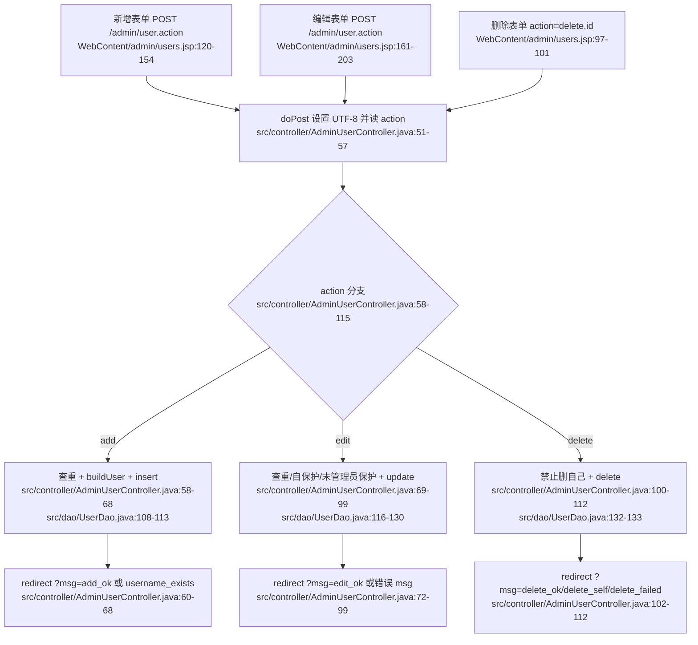
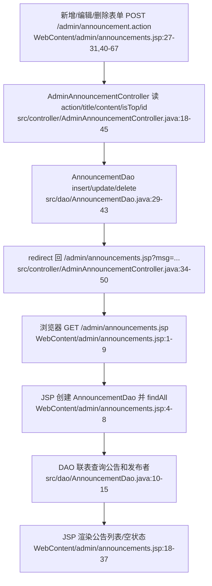
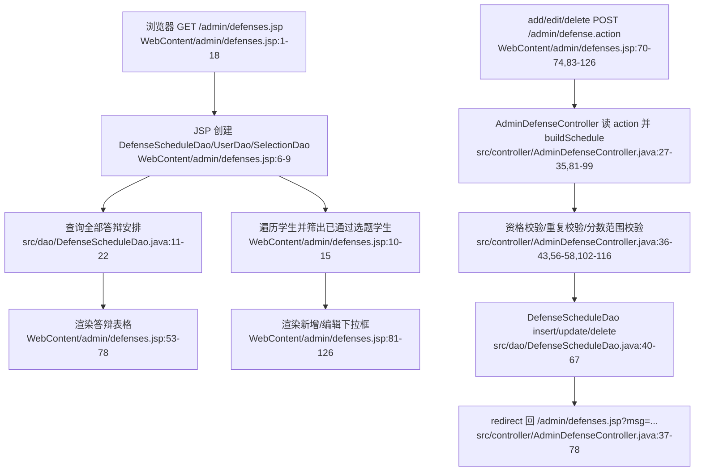
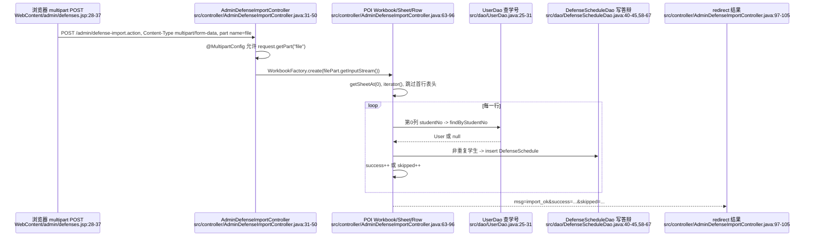
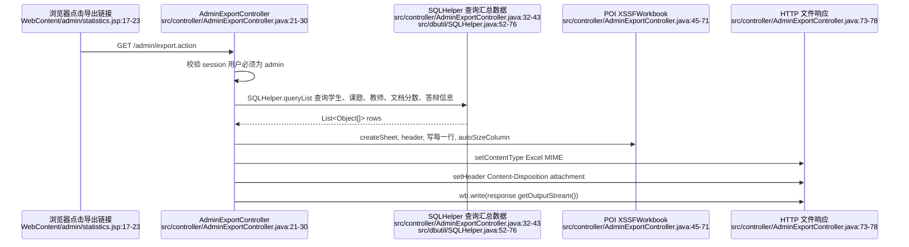
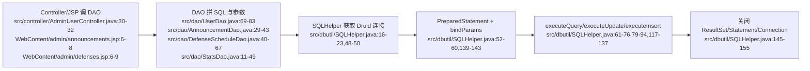

# 04 管理员后台网络数据流详解：用户、公告、答辩、导入、统计与导出

本节只分析管理员后台的传统管理流程：用户管理、公告管理、答辩安排、答辩 Excel 批量导入、统计 JSON、成绩 Excel 导出。不包含 AI 模块。

核心结论先说明：

- **用户管理列表页走 Controller forward**：浏览器访问 `/admin/user.action`，`AdminUserController#doGet` 查询用户、总数、字典和配置后，把数据放到 `request`，再 `forward` 到 `users.jsp`。`users.jsp` 如果直接被访问且没有 `users` 属性，会主动重定向回 `/admin/user.action`。
- **公告/答辩列表页主要是 JSP 直达展示**：`announcements.jsp`、`defenses.jsp` 自己在 JSP 中 new DAO 并查询展示数据；新增、编辑、删除才 POST 到对应 Servlet，然后 redirect 回 JSP。
- **统计页用 JSON fetch**：`statistics.jsp` 先输出 HTML 和 ECharts 容器，再用 `fetch('../admin/stats.action')` 拉 JSON，`AdminStatsController` 设置 `Content-Type: application/json;charset=UTF-8` 并用 `response.getWriter()` 写 JSON 字符串。
- **导入用 multipart + POI**：`defenses.jsp` 的上传表单使用 `multipart/form-data`，`AdminDefenseImportController` 通过 `@MultipartConfig` 和 `request.getPart("file")` 取得 Excel 文件，再用 Apache POI 读第一张表、跳过表头、逐行导入。
- **导出直接写二进制响应**：`AdminExportController` 不返回 JSP，而是设置 Excel MIME 与 `Content-Disposition: attachment`，用 POI 生成 workbook 后写入 `response.getOutputStream()`。

## 1. URL、方法、Content-Type、字段总表

| 流程 | URL | 方法 | 请求 Content-Type | 主要字段/参数 | 发起位置 | 后端入口 | 响应 |
|---|---|---:|---|---|---|---|---|
| 用户列表/过滤/分页 | `/admin/user.action?role=...&college=...&page=...&pageSize=...` | GET | 无请求体 | `role`、`college`、分页参数由 `PageUtil` 从 request 取 | `users.jsp` 的角色链接、学院下拉、分页链接 | `AdminUserController#doGet` | `forward` 到 `/admin/users.jsp`，HTML |
| 用户新增 | `/admin/user.action` | POST | `application/x-www-form-urlencoded`（普通表单默认） | `action=add`、`username`、`password`、`realName`、`role`、`college`、`major`、`className`、`studentNo`、`department`、`email`、`phone` | `users.jsp` 新增用户 modal 表单 | `AdminUserController#doPost` | redirect 到 `/admin/user.action?msg=add_ok` 或 `?msg=username_exists` |
| 用户编辑 | `/admin/user.action` | POST | `application/x-www-form-urlencoded` | `action=edit`、`id`、上述用户字段、`status`，`password` 可为空 | `users.jsp` 编辑用户 modal 表单 | `AdminUserController#doPost` | redirect 到 `/admin/user.action?msg=edit_ok` 或错误 msg |
| 用户删除 | `/admin/user.action` | POST | `application/x-www-form-urlencoded` | `action=delete`、`id` | `users.jsp` 行内删除表单 | `AdminUserController#doPost` | redirect 到 `/admin/user.action?msg=delete_ok/delete_self/delete_failed` |
| 公告列表 | `/admin/announcements.jsp` | GET | 无请求体 | 无 | 浏览器直接访问 JSP | JSP 内部创建 `AnnouncementDao` | JSP 直接输出 HTML |
| 公告新增/编辑/删除 | `/admin/announcement.action` | POST | `application/x-www-form-urlencoded` | `action=add/edit/delete`、`id`、`title`、`content`、`isTop` | `announcements.jsp` 表单 | `AdminAnnouncementController#doPost` | redirect 到 `/admin/announcements.jsp?msg=...` |
| 答辩列表 | `/admin/defenses.jsp` | GET | 无请求体 | `msg`、`success`、`skipped` 仅用于展示导入结果 | 浏览器直接访问 JSP | JSP 内部创建 DAO 查询 | JSP 直接输出 HTML |
| 答辩新增/编辑/删除 | `/admin/defense.action` | POST | `application/x-www-form-urlencoded` | `action=add/edit/delete`、`id`、`studentId`、`defenseTime`、`room`、`groupName`、`score`、`comment` | `defenses.jsp` 表单 | `AdminDefenseController#doPost` | redirect 到 `/admin/defenses.jsp?msg=...` |
| 答辩批量导入 | `/admin/defense-import.action` | POST | `multipart/form-data` | 文件 part：`file`，Excel 列为学号、答辩时间、教室、分组、备注 | `defenses.jsp` 上传表单 | `AdminDefenseImportController#doPost` | redirect 到 `/admin/defenses.jsp?msg=import_ok&success=...&skipped=...` 或失败 msg |
| 统计 JSON | `/admin/stats.action` | GET | 无请求体 | 无 | `statistics.jsp` 中的 `fetch('../admin/stats.action')` | `AdminStatsController#doGet` | `application/json;charset=UTF-8`，响应体为统计 JSON |
| 成绩 Excel 导出 | `/admin/export.action` | GET | 无请求体 | 无 | `statistics.jsp` 导出链接 | `AdminExportController#doGet` | Excel MIME，`Content-Disposition: attachment`，响应体为 `.xlsx` 二进制 |

## 2. URL 与参数约定

### 2.1 `.action` 不是物理文件，而是 Servlet 映射

项目里大量 URL 以 `.action` 结尾，例如 `/admin/user.action`、`/admin/announcement.action`、`/admin/defense.action`、`/admin/stats.action`、`/admin/export.action`。这些不是磁盘上的 `.action` 文件，而是 `@WebServlet` 绑定的逻辑路由：

- `AdminUserController` 映射 `/admin/user.action`。
- `AdminAnnouncementController` 映射 `/admin/announcement.action`。
- `AdminDefenseController` 映射 `/admin/defense.action`。
- `AdminDefenseImportController` 映射 `/admin/defense-import.action`。
- `AdminStatsController` 映射 `/admin/stats.action`。
- `AdminExportController` 映射 `/admin/export.action`。

所以老师如果追问“为什么点的是 `.action`，却执行 Java 类”，答案是：Servlet 容器按 `@WebServlet` 的 URL pattern 分发请求，不按文件系统查找。

### 2.2 query 参数与 redirect msg

GET 请求和 redirect 后的状态提示都放在 URL query 中，例如：

- `?role=teacher&college=cs`：用户列表筛选参数。
- `?msg=add_ok`：POST 成功后 redirect 回列表页时携带的“闪现状态码”。
- `?msg=import_ok&success=3&skipped=2`：导入完成后展示成功数和跳过数。

query 参数的特点是：浏览器地址栏可见、没有请求体、刷新页面不会重新提交 POST。管理后台用它实现了典型 **PRG（Post/Redirect/Get）** 流程：表单 POST 修改数据库，Servlet 处理完 redirect 到 GET 页面，页面通过 `msg` 显示结果。

### 2.3 隐藏字段 `action` 和 `id`

多个操作共用同一个 Servlet，所以表单用隐藏字段区分动作：

- `action=add`：新增。
- `action=edit`：编辑。
- `action=delete`：删除。
- `id`：编辑或删除哪一条记录。

这样一个 URL 可以承载多种后台动作，Controller 先读取 `request.getParameter("action")`，再进入对应分支。

### 2.4 `multipart/form-data` 与 `@MultipartConfig`

普通表单默认是 `application/x-www-form-urlencoded`，适合传文本字段；Excel 上传必须传文件字节，所以表单声明 `enctype="multipart/form-data"`。Servlet 端必须配合 `@MultipartConfig`，容器才会解析 multipart 请求，`request.getPart("file")` 才能拿到文件 part。

### 2.5 JSON 与 Excel 响应头

- JSON 接口设置 `Content-Type: application/json;charset=UTF-8`，表示响应体是 UTF-8 JSON，前端 `r.json()` 按 JSON 解析。
- Excel 导出设置 `application/vnd.openxmlformats-officedocument.spreadsheetml.sheet`，表示响应体是 `.xlsx`。
- `Content-Disposition: attachment; filename=grades_export.xlsx` 告诉浏览器不要当 HTML 展示，而是作为附件下载，并给出文件名。

## 3. 用户管理：GET 列表与 POST 增删改

### 3.1 用户 GET：浏览器请求如何进入 Controller，再 forward 到 JSP

用户列表不是直接访问 `users.jsp` 完成查询，而是先访问 `/admin/user.action`。`AdminUserController#doGet` 做了三件关键事：

1. 从 query 读取筛选条件：`role`、`college`。
2. 调 DAO 查询分页用户和总数。
3. 把 `users`、`total`、`currentPage`、`pageSize`、字典项、学院专业、校验规则放入 request 后 `forward` 到 `users.jsp`。

`forward` 的意义是：服务器内部把同一个 request 转交给 JSP 渲染，浏览器地址栏仍然是 `/admin/user.action`，而且 request attribute 不会丢。`users.jsp` 正是从 request attribute 中拿 `users`、`total` 等数据。如果有人绕过 Controller 直接访问 `/admin/users.jsp`，`users` 为 null，JSP 会立刻 `sendRedirect` 到 `/admin/user.action`，强制回到正确入口。

```mermaid
flowchart LR
  A["浏览器 GET /admin/user.action?role&college&page<br/>src/controller/AdminUserController.java:20-28"] --> B["Servlet 映射与 doGet 读取 query<br/>src/controller/AdminUserController.java:20-28"]
  B --> C["分页查询 users + total<br/>src/controller/AdminUserController.java:30-32<br/>src/dao/UserDao.java:69-105"]
  C --> D["设置 request attributes<br/>src/controller/AdminUserController.java:34-47"]
  D --> E["forward 到 /admin/users.jsp<br/>src/controller/AdminUserController.java:48"]
  E --> F["JSP 从 request 取 users/total/pageSize<br/>WebContent/admin/users.jsp:10-20"]
  F --> G["渲染用户表格和分页<br/>WebContent/admin/users.jsp:80-114"]
  H["若直接访问 users.jsp 且 users=null<br/>WebContent/admin/users.jsp:28-31"] --> A
```

#### 逐段解释

- `src/controller/AdminUserController.java:20-28`：`@WebServlet("/admin/user.action")` 绑定入口；`doGet` 用 `request.getParameter("role")`、`request.getParameter("college")` 读取筛选条件，分页参数由 `PageUtil.getPage/getPageSize` 从 request 中取。
- `src/controller/AdminUserController.java:30-32`：创建 `UserDao`，调用 `findAllPaged(role, college, page, pageSize)` 和 `countAll(role, college)`，把同一组过滤条件分别用于列表和总数。
- `src/dao/UserDao.java:69-83`：SQL 从 `WHERE 1=1` 开始拼可选条件；如果传了 `role` 就加 `AND role=?`，传了 `college` 就加 `AND college=?`，最后加 `ORDER BY id LIMIT ? OFFSET ?`。参数通过 `SQLHelper.queryList(sql, params.toArray())` 绑定，不是字符串直接拼值。
- `src/dao/UserDao.java:91-105`：总数查询同样按 `role`、`college` 拼条件，返回 `COUNT(*)`。
- `src/controller/AdminUserController.java:34-47`：把页面渲染必需的 `users`、总数、当前页、页大小、角色字典、状态字典、学院专业、用户名正则、密码最小长度放进 request。
- `src/controller/AdminUserController.java:48`：`request.getRequestDispatcher("/admin/users.jsp").forward(request, response)` 进入 JSP。这里不是 redirect；redirect 会让浏览器重新发一次请求，request attribute 会丢，JSP 拿不到 `users`。
- `WebContent/admin/users.jsp:28-31`：JSP 的保护逻辑。如果 `users == null`，说明不是 Controller forward 进来的，于是 `response.sendRedirect(request.getContextPath() + "/admin/user.action")`。

### 3.2 用户 POST：新增、编辑、删除如何通过隐藏字段进入同一个 Servlet

用户页面有三类 POST 表单：

- 删除：行内表单，提交 `action=delete` 和 `id`。
- 新增：modal 表单，提交 `action=add` 和完整用户字段。
- 编辑：modal 表单，提交 `action=edit`、`id`、用户字段和 `status`。

这些表单都没有 `enctype`，浏览器默认用 `application/x-www-form-urlencoded` 编码。字段进入 Servlet 后，统一由 `request.getParameter(...)` 读取。

#### 字段进入 Controller 的路径

- `WebContent/admin/users.jsp:120-154`：新增表单的 `<form action="user.action" method="post">` 会把输入框的 `name` 作为参数名提交。隐藏字段 `action=add` 告诉后台这是新增。
- `WebContent/admin/users.jsp:161-203`：编辑表单包含 `action=edit` 和隐藏 `id`，同时提交 `status`。密码字段可以留空。
- `WebContent/admin/users.jsp:97-101`：删除表单只有 `action=delete` 和 `id`，用户点击确认后 POST。
- `src/controller/AdminUserController.java:51-57`：`doPost` 先 `request.setCharacterEncoding("UTF-8")`，再读 session 中的 `loginUser` 和表单里的 `action`。
- `src/controller/AdminUserController.java:118-131`：`buildUser(request)` 把 `username/password/role/realName/studentNo/college/major/className/department/email/phone` 逐个从 request parameter 装进 `User` 对象。

#### 新增分支

- `src/controller/AdminUserController.java:58-63`：如果 `action=add`，先读 `username` 并调用 `dao.existsByUsername(username)` 查重；已存在就 redirect 到 `?msg=username_exists`。
- `src/controller/AdminUserController.java:64-68`：通过 `buildUser` 构造对象，默认 `status=1`，调用 `dao.insert(u)`，记录日志，redirect 到 `?msg=add_ok`。
- `src/dao/UserDao.java:108-113`：插入 SQL 包含用户名、哈希后的密码、角色、姓名、学号、学院、专业、班级、部门、邮箱、电话、状态。密码不是明文直接入库，而是调用 `PasswordUtil.hash(user.getPassword())`。

#### 编辑分支

- `src/controller/AdminUserController.java:70-78`：读取 `id`、`username`、`status`，并排除当前用户 id 做用户名查重。
- `src/controller/AdminUserController.java:79-94`：读取当前数据库用户，防止管理员把自己改成非 admin 或禁用自己，也防止系统最后一个启用管理员被降级/禁用。
- `src/controller/AdminUserController.java:95-99`：密码为空则设置为 null，DAO 更新时会走“不改密码”的 SQL；非空则更新密码。
- `src/dao/UserDao.java:116-130`：根据 `user.getPassword()` 是否为空选择两条 SQL：一条更新密码字段，一条不更新密码字段。

#### 删除分支

- `src/controller/AdminUserController.java:100-105`：删除前读取 `id`，如果要删除的是当前登录用户，redirect `?msg=delete_self`。
- `src/controller/AdminUserController.java:106-112`：调用 `dao.delete(id)`，影响行数小于等于 0 则 `?msg=delete_failed`，否则 `?msg=delete_ok`。
- `src/dao/UserDao.java:132-133`：真正执行 `DELETE FROM users WHERE id=?`。

#### 用户管理 msg 展示

`users.jsp` 自己读取 `request.getParameter("msg")`，识别 `add_ok`、`edit_ok`、`delete_ok`、`delete_failed`、`delete_self`、`username_exists` 并输出 Bootstrap alert。注意 Controller 还会 redirect `msg=error`、`msg=edit_self_role`、`msg=last_admin`，但在当前 `users.jsp` 本地 alert 映射中没有逐项处理。

## 4. 公告管理：JSP 直达列表，POST 到 Servlet 后 redirect

公告管理和用户管理不同：`announcements.jsp` 自己创建 `AnnouncementDao` 并查询全部公告，不经过 GET Controller。

设计原因很直接：公告列表没有复杂分页配置，也不需要 Controller 先塞大量字典/配置到 request；JSP 直接查 DAO 就能展示。修改动作仍然放在 Servlet 中，是为了把数据库写操作集中在 Controller，并通过 redirect 防止刷新重复提交。

### 4.1 公告 GET 展示

- `WebContent/admin/announcements.jsp:4-8`：JSP 设置页面标题，从 session 取登录用户，直接 `new AnnouncementDao()` 并 `dao.findAll()`。
- `src/dao/AnnouncementDao.java:10-15`：查询 `announcements` 表并 join `users` 表拿发布者姓名，排序规则是置顶优先、创建时间倒序。
- `WebContent/admin/announcements.jsp:18-37`：如果列表为空显示空状态；否则逐条输出标题、置顶标记、发布者、时间、内容，以及编辑/删除按钮。

### 4.2 公告 POST 字段与分支

公告表单同样是普通 POST，默认 `application/x-www-form-urlencoded`。

| action | 字段 | JSP 来源 | Controller 处理 | 成功 redirect |
|---|---|---|---|---|
| `add` | `title`、`content`、`isTop` | 新增 modal | 构造 `Announcement`，设置发布人 id 和置顶状态，insert | `/admin/announcements.jsp?msg=add_ok` |
| `edit` | `id`、`title`、`content`、`isTop` | 编辑 modal | 读 id 后更新标题、内容、置顶 | `/admin/announcements.jsp?msg=edit_ok` |
| `delete` | `id` | 行内删除表单 | 删除指定公告 | `/admin/announcements.jsp?msg=delete_ok` |

关键点：

- `WebContent/admin/announcements.jsp:42-51`：新增表单提交到 `../admin/announcement.action`，隐藏字段 `action=add`，文本字段是 `title`、`content`，置顶复选框 `name="isTop" value="1"`。
- `WebContent/admin/announcements.jsp:57-67`：编辑表单提交 `action=edit` 和隐藏 `id`，字段同新增。
- `WebContent/admin/announcements.jsp:27-31`：删除表单提交 `action=delete` 和 `id`。
- `src/controller/AdminAnnouncementController.java:18-24`：`doPost` 设置 UTF-8，读取 `action`，创建 DAO，从 session 取当前用户。
- `src/controller/AdminAnnouncementController.java:26-34`：新增时读取 `title/content/isTop`，其中 `isTop` 是复选框，只有勾选时才会提交 `"1"`，所以代码用 `"1".equals(request.getParameter("isTop")) ? 1 : 0` 转成 1/0。
- `src/controller/AdminAnnouncementController.java:35-43`：编辑时多读 `id`，调用 `dao.update(a)`。
- `src/controller/AdminAnnouncementController.java:44-48`：删除时只读 `id` 并调用 `dao.delete(id)`。
- `src/dao/AnnouncementDao.java:29-43`：三类写操作分别对应 `INSERT`、`UPDATE`、`DELETE`，最终都通过 `SQLHelper` 的 PreparedStatement 执行。

## 5. 答辩安排：JSP 直达展示，POST 负责校验与写库

答辩页面也是 JSP 直达展示：`defenses.jsp` 自己查全部答辩安排，还会查“已通过选题的学生”供新增/编辑下拉框使用。与公告类似，展示逻辑放在 JSP，写操作放在 `AdminDefenseController`。

### 5.1 答辩 GET 展示

- `WebContent/admin/defenses.jsp:6-9`：JSP 创建 `DefenseScheduleDao`、`UserDao`、`SelectionDao`，调用 `dao.findAll()` 查询已有答辩。
- `WebContent/admin/defenses.jsp:10-15`：遍历所有 student，只有 `selDao.findApprovedByStudent(u.getId()) != null` 的学生才加入 `approvedStudents`，用于表单下拉。
- `src/dao/DefenseScheduleDao.java:11-22`：`BASE_SQL` join 学生、选题、课题、指导教师，`findAll()` 按答辩时间和 id 倒序返回列表。
- `WebContent/admin/defenses.jsp:53-78`：JSP 渲染学号、姓名、课题、指导教师、答辩时间、教室、分组、答辩分和操作按钮。

### 5.2 答辩 POST 字段

| action | 字段 | 字段含义 | 处理结果 |
|---|---|---|---|
| `add` | `studentId`、`defenseTime`、`room`、`groupName`、`score`、`comment` | 新增某学生的答辩时间、地点、分组、分数和备注 | 校验资格、查重，通过后 insert，通知学生，redirect `msg=add_ok` |
| `edit` | `id`、`studentId`、`defenseTime`、`room`、`groupName`、`score`、`comment` | 修改已有答辩安排 | 校验资格、排除自身查重，通过后 update，redirect `msg=edit_ok` |
| `delete` | `id` | 删除答辩安排 | delete 成功 redirect `msg=delete_ok` |

关键代码解释：

- `WebContent/admin/defenses.jsp:83-101`：新增表单提交 `action=add`，`studentId` 来自学生下拉，`defenseTime` 是 HTML `datetime-local`，格式形如 `2026-06-22T14:30`。
- `WebContent/admin/defenses.jsp:107-126`：编辑表单提交 `action=edit` 和隐藏 `id`，字段结构与新增一致。
- `WebContent/admin/defenses.jsp:70-74`：删除表单提交 `action=delete` 和 `id`。
- `src/controller/AdminDefenseController.java:27-33`：`doPost` 设置 UTF-8，从 session 取管理员用户，读取 `action`，创建 `DefenseScheduleDao`。
- `src/controller/AdminDefenseController.java:81-99`：`buildSchedule` 是字段解析核心：`studentId` 转 int，`defenseTime` 用 `SimpleDateFormat("yyyy-MM-dd'T'HH:mm")` 解析，`score` 转 `BigDecimal`，其余文本字段直接取 parameter。解析失败会抛 `IOException("invalid defense data")`。
- `src/controller/AdminDefenseController.java:102-116`：`isEligible` 不只是检查学生存在，还要求角色是 `student`、状态为 1、有已批准选题、分数在 0 到 100 之间，并且终稿文档存在且状态为 `reviewed`。
- `src/controller/AdminDefenseController.java:34-52`：新增时先 `buildSchedule`，再资格校验、重复学生校验、insert。insert 成功后发送站内通知并 redirect `msg=add_ok`。
- `src/controller/AdminDefenseController.java:53-66`：编辑时设置 `id`，用 `existsByStudentExceptId` 防止同一学生在另一条答辩安排中重复出现。
- `src/controller/AdminDefenseController.java:67-78`：删除时按 id 删除，失败 redirect `msg=error`，成功 redirect `msg=delete_ok`。
- `src/dao/DefenseScheduleDao.java:40-67`：insert/update/delete/exists 都是针对 `defense_schedules` 表的 PreparedStatement 操作。

### 5.3 答辩 redirect msg

答辩普通增删改由 Controller redirect 到：

- `?msg=add_ok`
- `?msg=edit_ok`
- `?msg=delete_ok`
- `?msg=defense_ineligible`
- `?msg=exists`
- `?msg=error`

批量导入相关 msg 则由 `defenses.jsp` 本页明确读取并展示，见下一节。

## 6. 答辩批量导入：multipart 上传、POI 逐行读取、统计 success/skipped

Excel 导入不是普通表单提交，因为请求体里有文件字节。`defenses.jsp` 的导入表单声明了 `enctype="multipart/form-data"`，文件控件名为 `file`，并提示 Excel 列为：学号、答辩时间、教室、分组、备注，首行为表头。

### 6.1 multipart 如何进入 Controller

- `WebContent/admin/defenses.jsp:28-37`：导入区域表单 `action="../admin/defense-import.action"`、`method="post"`、`enctype="multipart/form-data"`；文件 input 是 `name="file"`，accept `.xls,.xlsx`。
- `src/controller/AdminDefenseImportController.java:31-33`：Servlet 映射 `/admin/defense-import.action`，并声明 `@MultipartConfig(maxFileSize = 10485760, maxRequestSize = 20971520)`，限制单文件最大 10MB、请求最大 20MB。
- `src/controller/AdminDefenseImportController.java:40-48`：POST 开始后设置 UTF-8，校验 session 用户必须是 admin，否则 redirect 到 `/login.jsp`。
- `src/controller/AdminDefenseImportController.java:50-54`：`request.getPart("file")` 读取文件 part；如果 part 不存在或大小为 0，redirect 到 `?msg=import_empty`。

### 6.2 POI 读取行、跳过、成功数

- `src/controller/AdminDefenseImportController.java:56-61`：准备 `UserDao`、`DefenseScheduleDao`、`DataFormatter`，初始化 `success=0`、`skipped=0`、`errors`。
- `src/controller/AdminDefenseImportController.java:63-68`：`WorkbookFactory.create(filePart.getInputStream())` 自动识别 xls/xlsx；取第一张 sheet；创建行迭代器；如果有第一行则 `it.next()` 跳过表头。
- `src/controller/AdminDefenseImportController.java:69-74`：逐行读取第 0 列学号。学号为空时直接 `continue`，这里不会增加 `skipped`。
- `src/controller/AdminDefenseImportController.java:75-80`：用 `userDao.findByStudentNo(studentNo.trim())` 查学生；不存在或角色不是 student，则记录错误并 `skipped++`。
- `src/controller/AdminDefenseImportController.java:81-85`：如果该学生已有答辩安排，则记录错误并 `skipped++`。
- `src/controller/AdminDefenseImportController.java:86-95`：构造 `DefenseSchedule`，从第 1 到第 4 列读取答辩时间、教室、分组、备注，调用 `defenseDao.insert(ds)`，发送通知，`success++`。
- `src/controller/AdminDefenseImportController.java:108-114`：`cellText` 用 POI `DataFormatter` 把不同单元格类型格式化成字符串并 trim。
- `src/controller/AdminDefenseImportController.java:116-127`：`parseDate` 支持 `yyyy-MM-dd HH:mm:ss`、`yyyy-MM-dd HH:mm`、`yyyy/MM/dd HH:mm` 三种格式；都解析失败时返回 null。也就是说日期格式不匹配不会让整行失败，而是导入一条 `defense_time=null` 的安排。
- `src/controller/AdminDefenseImportController.java:97-99`：POI 打开文件或读取过程中出现异常，redirect 到 `?msg=import_error`。
- `src/controller/AdminDefenseImportController.java:102-105`：正常结束后记录导入日志，并 redirect 到 `?msg=import_ok&success=...&skipped=...`。

### 6.3 导入结果如何显示

`defenses.jsp` 在导入表单下面读取 query：

- `msg=import_ok`：继续读取 `success` 和 `skipped`，显示“导入完成：成功 N 条，跳过 M 条”。
- `msg=import_empty`：显示“请选择要导入的 Excel 文件”。
- `msg=import_error`：显示“导入失败，请检查文件格式后重试”。

这也是为什么导入完成后用 redirect 携带 `success/skipped`，而不是 forward：redirect 让浏览器回到普通 GET 页面，刷新不会再次上传同一个 Excel。

## 7. 统计 JSON：JSP 先出页面，fetch 再拉数据

统计页不是后端把所有图表数据直接写进 HTML，而是先让 `statistics.jsp` 输出 ECharts 容器，再由浏览器执行 JavaScript 请求 `/admin/stats.action`。

设计原因：

- 图表数据天然适合结构化 JSON。
- 页面 HTML 与统计 API 解耦，统计接口失败时可以只显示图表错误，不影响页面骨架。
- ECharts 在前端渲染，后端只负责给 `selection`、`docPass`、`scores` 三类数据。

```mermaid
flowchart LR
  A["浏览器 GET /admin/statistics.jsp<br/>WebContent/admin/statistics.jsp:1-23"] --> B["JSP 输出图表容器和导出链接<br/>WebContent/admin/statistics.jsp:17-83"]
  B --> C["前端 fetch('../admin/stats.action')<br/>WebContent/admin/statistics.jsp:87-117"]
  C --> D["AdminStatsController 设置 JSON Content-Type<br/>src/controller/AdminStatsController.java:15-20"]
  D --> E["StatsDao/UserDao 查询统计<br/>src/controller/AdminStatsController.java:20-25<br/>src/dao/StatsDao.java:11-49<br/>src/dao/UserDao.java:144-146"]
  E --> F["response.getWriter 写 JSON<br/>src/controller/AdminStatsController.java:27-33"]
  F --> G["前端 r.json 后渲染 ECharts<br/>WebContent/admin/statistics.jsp:117-169"]
  G --> H["失败则显示错误占位<br/>WebContent/admin/statistics.jsp:171-188"]
```

### 7.1 前端发了什么

- `WebContent/admin/statistics.jsp:17-23`：页面顶部有“导出成绩 Excel”按钮，和统计 JSON 是同一页面上的另一个动作。
- `WebContent/admin/statistics.jsp:27-83`：页面先输出三个图表容器：选题情况、文档通过数、成绩分布。
- `WebContent/admin/statistics.jsp:109-117`：脚本执行 `fetch('../admin/stats.action')`。这是 GET 请求，无请求体；如果 HTTP 状态不是 2xx，则抛错；否则 `return r.json()`。
- `WebContent/admin/statistics.jsp:117-169`：拿到 JSON 后，把 `data.selection` 转成饼图数据，把 `data.docPass` 转成柱状图数据，把 `data.scores.labels/values` 渲染为成绩分布柱状图。

### 7.2 后端为什么必须设置 JSON Content-Type 并用 writer

- `src/controller/AdminStatsController.java:15-19`：`@WebServlet("/admin/stats.action")` 绑定 JSON API；`response.setContentType("application/json;charset=UTF-8")` 明确声明响应类型和字符集。
- `src/controller/AdminStatsController.java:20-25`：查询学生总数、选题统计、文档通过统计、成绩分布。
- `src/dao/StatsDao.java:11-23`：选题统计会查询已批准学生数、待审批学生数，再用总学生数减出未选题数。
- `src/dao/StatsDao.java:25-31`：文档通过统计按 `document_type` 字典逐项统计 `status='reviewed'` 的数量。
- `src/dao/StatsDao.java:33-49`：成绩分布按 `score` 分段聚合。
- `src/controller/AdminStatsController.java:27-33`：通过 `response.getWriter()` 拿字符输出流，手工拼出 JSON：`selection`、`docPass`、`scores.labels`、`scores.values`。
- `src/controller/AdminStatsController.java:36-77`：`mapToJson`、`labelsJson`、`valuesJson` 负责把 Java 集合转 JSON 片段，`escape` 处理反斜杠和双引号，避免破坏 JSON 字符串。

这条响应不能用 redirect，因为前端 fetch 需要拿到 JSON body；也不能 forward 到 JSP，因为 JSP 输出的是 HTML，不是 API 数据。

## 8. 成绩 Excel 导出：GET 直接生成文件响应

导出入口是统计页上的链接 `<a href="../admin/export.action">导出成绩 Excel</a>`。浏览器点击后发 GET 请求，后端不返回 HTML，而是返回 `.xlsx` 文件。

### 8.1 导出 SQL 与 workbook 生成

- `src/controller/AdminExportController.java:21-30`：`@WebServlet("/admin/export.action")` 绑定入口；先从 session 取 `loginUser`，必须是 admin，否则 redirect 到 `/login.jsp`。
- `src/controller/AdminExportController.java:32-43`：用一条 SQL 汇总学生学号、姓名、院系、课题、指导教师、开题/中期/终稿分数、答辩分数、答辩时间、答辩教室。这里直接使用 `SQLHelper.queryList`，没有再包一层 DAO。
- `src/controller/AdminExportController.java:45-52`：创建 `XSSFWorkbook`，建 sheet `成绩汇总`，第一行写表头。
- `src/controller/AdminExportController.java:54-68`：遍历 SQL 返回行，逐列写入 Excel；分数字段通过 `setScoreCell` 写成数字。
- `src/controller/AdminExportController.java:69-71`：自动调整列宽。
- `src/controller/AdminExportController.java:80-86`：`setScoreCell` 对 null 写空字符串，对非 null 转 `BigDecimal` 再写 double。

### 8.2 为什么导出直接写 output stream

Excel 是二进制文件，不是 HTML 页面。Servlet 一旦设置文件响应头并向 `response.getOutputStream()` 写 workbook，浏览器就会把响应当作下载文件处理。这里不能再 forward 到 JSP，否则 HTML 字符会混进 xlsx 二进制，文件会损坏。

关键响应头：

- `src/controller/AdminExportController.java:73`：`response.setContentType("application/vnd.openxmlformats-officedocument.spreadsheetml.sheet")`，告诉浏览器这是 Office Open XML xlsx。
- `src/controller/AdminExportController.java:74`：`response.setHeader("Content-Disposition", "attachment; filename=grades_export.xlsx")`，触发附件下载并指定文件名。
- `src/controller/AdminExportController.java:75-76`：`wb.write(response.getOutputStream())` 写入响应体，随后关闭 workbook。

成功导出时没有 `msg=...`，因为响应本身就是文件；只有未登录或非管理员时才 redirect 到登录页。

## 9. SQLHelper 在这些流程里的共同作用

所有 DAO 和导出查询最终都通过 `SQLHelper` 接触数据库：

逐段看：

- `src/dbutil/SQLHelper.java:16-23`：静态初始化 Druid 连接池，配置来自 classpath 下的 `jdbc.properties`。
- `src/dbutil/SQLHelper.java:48-50`：`getConnection()` 从连接池取连接。
- `src/dbutil/SQLHelper.java:52-76`：`queryList` 创建 `PreparedStatement`，绑定参数，执行查询，把每行转成 `Object[]`。
- `src/dbutil/SQLHelper.java:79-94`：`executeUpdate` 用于 UPDATE/DELETE，返回影响行数；失败返回 0。
- `src/dbutil/SQLHelper.java:96-115`：`queryScalar` 用于 `COUNT(*)`、查重等单值查询。
- `src/dbutil/SQLHelper.java:117-137`：`executeInsert` 用 `Statement.RETURN_GENERATED_KEYS` 返回自增 id。
- `src/dbutil/SQLHelper.java:139-143`：所有参数统一 `ps.setObject(i + 1, params[i])`，这就是为什么上层传入的表单/query 参数不会直接拼成 SQL 字面量。
- `src/dbutil/SQLHelper.java:145-155`：finally 中安静关闭资源，避免连接泄漏。

## 10. Controller forward 与 JSP 直达的区别总结

| 页面 | 展示数据从哪里来 | 是否需要 GET Controller | 原因 |
|---|---|---:|---|
| 用户管理 | Controller 查询后放入 request attribute | 是 | 用户页需要分页、筛选、总数、字典、学院专业、校验规则；`users.jsp` 明确要求 `users` attribute 存在，否则 redirect 到 Controller |
| 公告管理 | JSP 内部 new `AnnouncementDao` 查询 | 否 | 展示逻辑简单，JSP 直接查全部公告即可；写操作仍由 Servlet 处理 |
| 答辩安排 | JSP 内部 new 多个 DAO 查询 | 否 | 页面需要直接组装答辩列表和可选学生；写操作由 Servlet 校验后处理 |
| 数据统计 | JSP 只输出容器，数据由 fetch JSON 获得 | 否，页面本身直达；JSON 有独立 Controller | 图表数据是异步 API，适合 JSON，不适合混在 JSP 中 |
| Excel 导出 | 不展示 JSP，直接文件响应 | 是，文件 Controller | 响应体是 xlsx 二进制，不能 forward 到 HTML |

## 11. 成功/失败 redirect msg 汇总

| 模块 | 成功 msg | 失败/特殊 msg | 页面如何用 |
|---|---|---|---|
| 用户 | `add_ok`、`edit_ok`、`delete_ok` | `username_exists`、`delete_self`、`delete_failed`、`error`、`edit_self_role`、`last_admin` | `users.jsp` 本地 alert 显示其中一部分：`add_ok/edit_ok/delete_ok/delete_failed/delete_self/username_exists` |
| 公告 | `add_ok`、`edit_ok`、`delete_ok` | 未单独判断 DAO 失败，未知 action 回列表 | Controller redirect 到 `announcements.jsp?msg=...` |
| 答辩 | `add_ok`、`edit_ok`、`delete_ok` | `defense_ineligible`、`exists`、`error` | Controller redirect 到 `defenses.jsp?msg=...` |
| 答辩导入 | `import_ok&success=N&skipped=M` | `import_empty`、`import_error` | `defenses.jsp` 明确读取并显示导入结果 |
| 统计 JSON | 无 redirect | fetch 失败时前端显示错误区域 | JSON API 直接返回 JSON，不走 msg |
| Excel 导出 | 无 redirect，直接下载 | 非 admin redirect `/login.jsp` | 文件响应不带 msg |

## 12. 代码证据清单

- `WebContent/admin/users.jsp:7-31`：读取筛选 query、读取 Controller 放入的 request attribute，直接访问 JSP 时 redirect 到 `/admin/user.action`。
- `WebContent/admin/users.jsp:43-60`：读取 `msg` 并渲染用户管理 alert。
- `WebContent/admin/users.jsp:80-114`：渲染用户表格与分页参数。
- `WebContent/admin/users.jsp:97-101`：用户删除表单隐藏 `action=delete`、`id`。
- `WebContent/admin/users.jsp:120-154`：用户新增表单字段。
- `WebContent/admin/users.jsp:161-203`：用户编辑表单字段。
- `WebContent/admin/users.jsp:207-255`：学院专业联动和编辑 modal 回填。
- `WebContent/admin/announcements.jsp:4-8`：公告 JSP 直接创建 DAO 并查询列表。
- `WebContent/admin/announcements.jsp:18-37`：公告列表渲染、编辑/删除入口。
- `WebContent/admin/announcements.jsp:40-51`：公告新增表单。
- `WebContent/admin/announcements.jsp:55-67`：公告编辑表单。
- `WebContent/admin/announcements.jsp:71-78`：公告编辑 modal 回填脚本。
- `WebContent/admin/defenses.jsp:6-17`：答辩 JSP 直接创建 DAO、查询安排和可选学生。
- `WebContent/admin/defenses.jsp:28-50`：Excel 导入表单、`msg/success/skipped` 展示。
- `WebContent/admin/defenses.jsp:53-78`：答辩列表与删除表单。
- `WebContent/admin/defenses.jsp:81-101`：答辩新增表单。
- `WebContent/admin/defenses.jsp:105-126`：答辩编辑表单。
- `WebContent/admin/defenses.jsp:130-140`：答辩编辑 modal 回填脚本。
- `WebContent/admin/statistics.jsp:17-23`：统计页顶部导出链接。
- `WebContent/admin/statistics.jsp:27-83`：三个图表容器。
- `WebContent/admin/statistics.jsp:87-117`：fetch 请求统计 JSON。
- `WebContent/admin/statistics.jsp:117-169`：JSON 数据转换为 ECharts 图表。
- `WebContent/admin/statistics.jsp:171-188`：fetch 或渲染失败时显示错误。
- `src/controller/AdminUserController.java:20-48`：用户 GET Controller 映射、筛选读取、DAO 查询、request attribute、forward。
- `src/controller/AdminUserController.java:51-116`：用户 POST add/edit/delete 分支与 redirect msg。
- `src/controller/AdminUserController.java:118-131`：用户表单字段组装为 `User`。
- `src/controller/AdminAnnouncementController.java:16-52`：公告 POST Controller 映射、字段读取、DAO 写操作、redirect。
- `src/controller/AdminDefenseController.java:23-33`：答辩 POST Controller 映射、UTF-8、session、action。
- `src/controller/AdminDefenseController.java:34-78`：答辩 add/edit/delete 分支与 redirect msg。
- `src/controller/AdminDefenseController.java:81-99`：答辩字段解析、日期和分数转换。
- `src/controller/AdminDefenseController.java:102-116`：答辩资格校验。
- `src/controller/AdminDefenseImportController.java:31-33`：导入 Servlet 映射与 `@MultipartConfig`。
- `src/controller/AdminDefenseImportController.java:40-54`：导入 POST 鉴权、`getPart("file")`、空文件处理。
- `src/controller/AdminDefenseImportController.java:56-61`：导入 DAO、formatter、success/skipped 初始化。
- `src/controller/AdminDefenseImportController.java:63-96`：POI 打开 workbook、跳过表头、逐行导入、success/skipped 计数。
- `src/controller/AdminDefenseImportController.java:97-105`：导入异常和成功 redirect。
- `src/controller/AdminDefenseImportController.java:108-127`：单元格文本格式化和日期解析。
- `src/controller/AdminStatsController.java:15-20`：统计 JSON Servlet 映射与 JSON Content-Type。
- `src/controller/AdminStatsController.java:20-33`：统计 DAO 调用与 `response.getWriter()` 写 JSON。
- `src/controller/AdminStatsController.java:36-77`：JSON 字符串构造与转义。
- `src/controller/AdminExportController.java:21-30`：导出 Servlet 映射与管理员鉴权。
- `src/controller/AdminExportController.java:32-43`：导出 SQL 汇总查询。
- `src/controller/AdminExportController.java:45-71`：POI 创建 workbook、表头、数据行、列宽。
- `src/controller/AdminExportController.java:73-78`：Excel MIME、`Content-Disposition`、输出流写出。
- `src/controller/AdminExportController.java:80-87`：分数字段写入逻辑。
- `src/dao/UserDao.java:16-41`：按用户名、学号、id 查询用户。
- `src/dao/UserDao.java:69-105`：用户分页查询与总数统计。
- `src/dao/UserDao.java:108-133`：用户 insert/update/delete。
- `src/dao/UserDao.java:144-163`：按角色计数、管理员计数、用户名查重。
- `src/dao/UserDao.java:166-191`：用户结果集映射和学院专业名称转换。
- `src/dao/AnnouncementDao.java:10-15`：公告列表查询。
- `src/dao/AnnouncementDao.java:29-43`：公告 insert/update/delete。
- `src/dao/AnnouncementDao.java:58-68`：公告结果集映射。
- `src/dao/DefenseScheduleDao.java:11-22`：答辩安排基础联表 SQL 与列表查询。
- `src/dao/DefenseScheduleDao.java:40-67`：答辩安排 insert/update/delete/重复检测。
- `src/dao/DefenseScheduleDao.java:78-93`：答辩安排结果集映射。
- `src/dao/StatsDao.java:11-23`：选题统计。
- `src/dao/StatsDao.java:25-31`：文档通过统计。
- `src/dao/StatsDao.java:33-49`：成绩分布统计。
- `src/dbutil/SQLHelper.java:16-23`：Druid 连接池初始化。
- `src/dbutil/SQLHelper.java:48-76`：查询列表 `queryList`。
- `src/dbutil/SQLHelper.java:79-94`：更新/删除 `executeUpdate`。
- `src/dbutil/SQLHelper.java:96-115`：单值查询 `queryScalar`。
- `src/dbutil/SQLHelper.java:117-143`：插入并取自增 id、参数绑定。
- `src/dbutil/SQLHelper.java:145-155`：数据库资源关闭。
