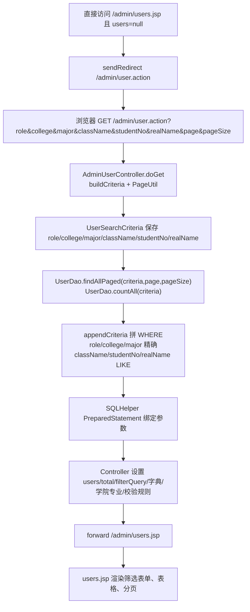
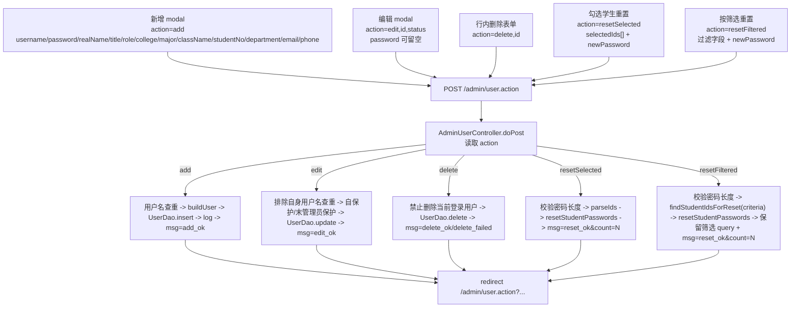
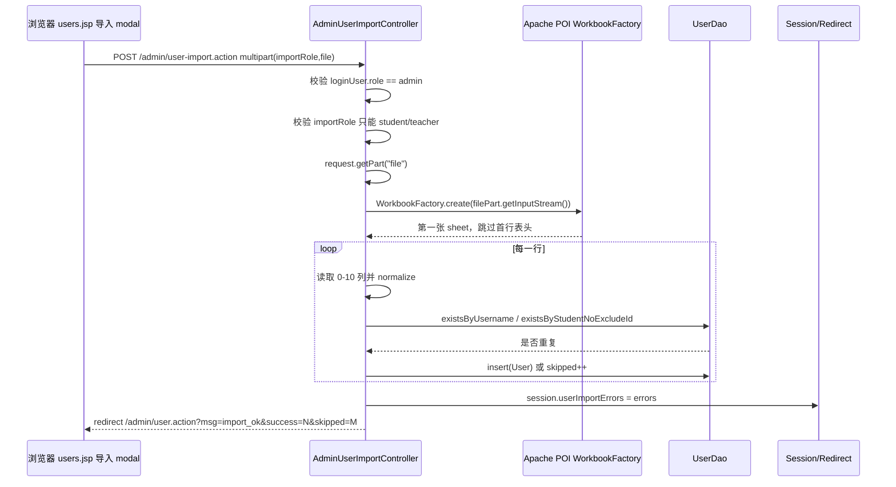
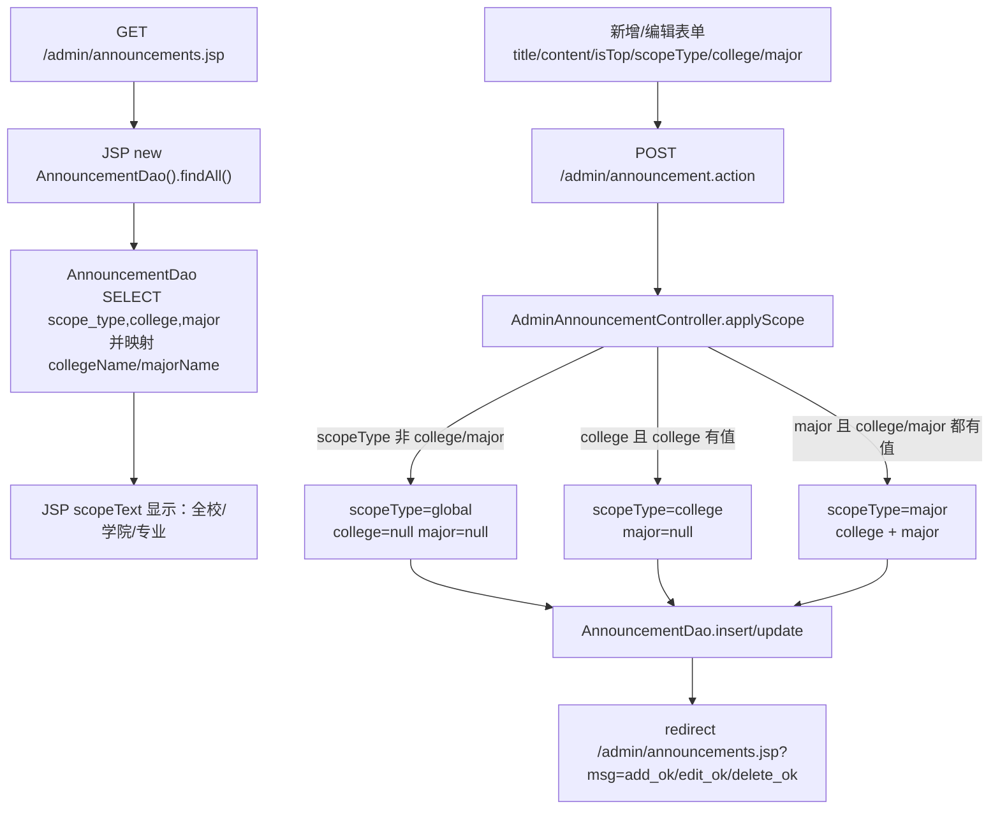
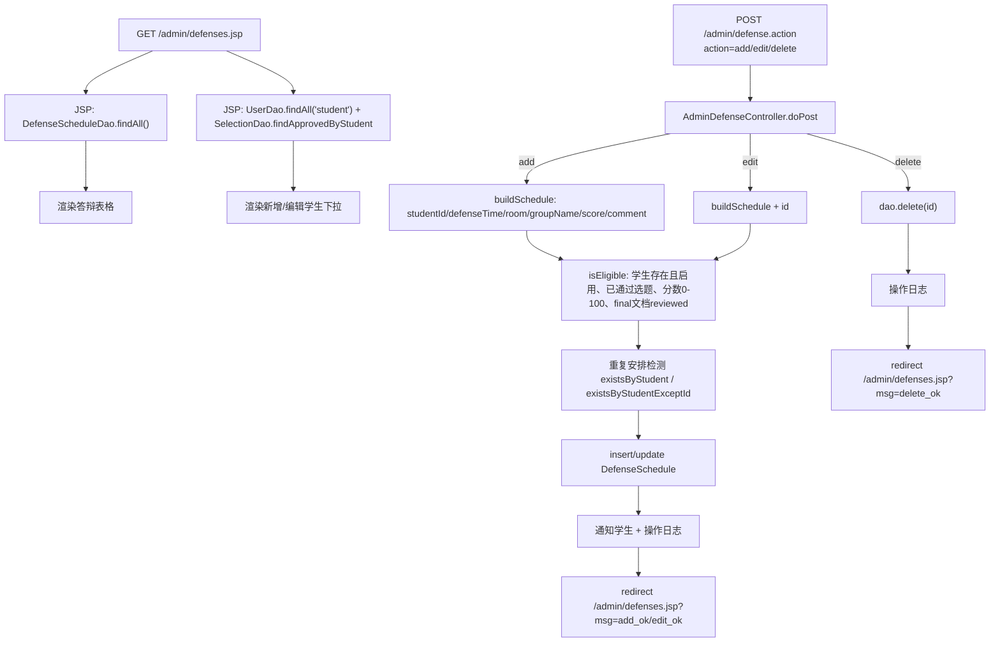
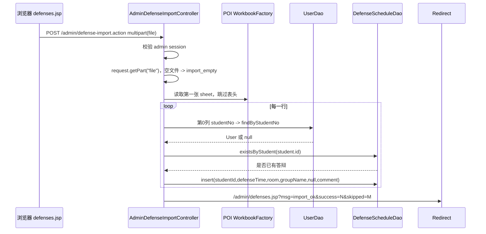
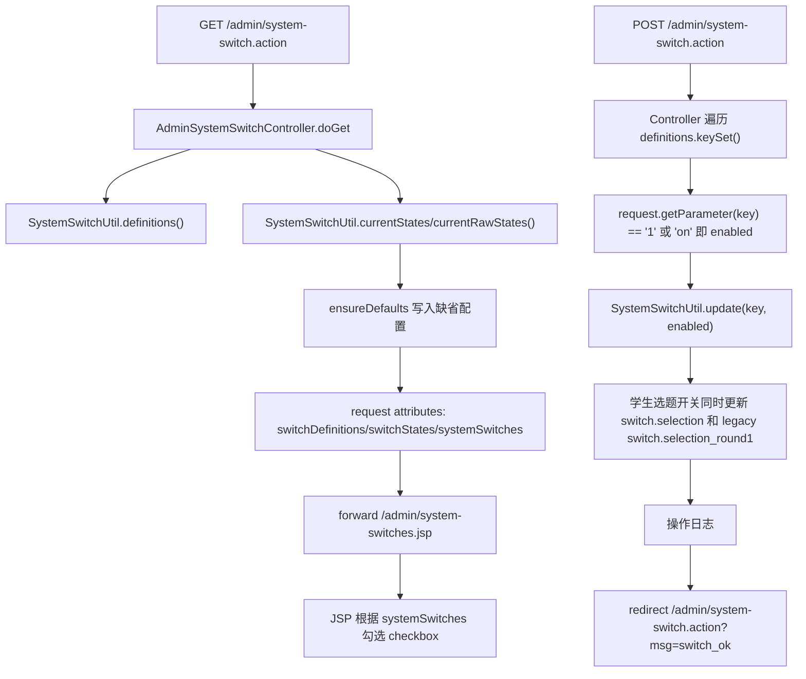
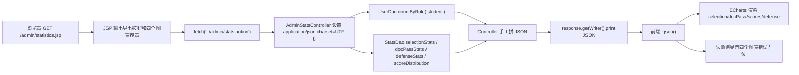
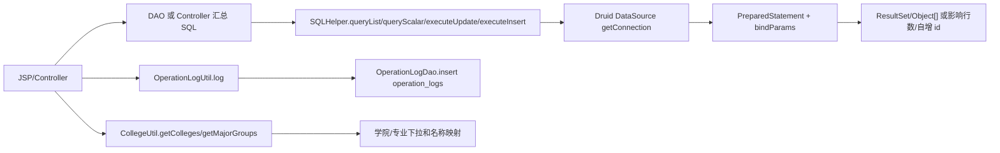

# 04 管理员后台网络数据流详解：用户、公告、答辩、系统开关、统计与导出

本节只写管理员传统管理链路，不写 AI 模块。当前代码里的管理员后台仍然保留原有结构：

- **用户管理**：必须从 `/admin/user.action` 进入 Controller，Controller 查询后 `forward` 到 `users.jsp`；直接访问 `users.jsp` 会被重定向回 Controller。
- **公告、答辩安排**：列表页由 JSP 直接查 DAO 渲染；写操作 POST 到 Servlet，处理后 redirect 回 JSP。
- **统计**：`statistics.jsp` 输出容器，浏览器 `fetch('../admin/stats.action')` 拉 JSON，前端 ECharts 渲染。
- **Excel 导出**：点击链接 GET `/admin/export.action`，Servlet 直接写 `.xlsx` 二进制响应。
- **系统开关**：新增为 Controller forward 到 `system-switches.jsp`，POST 保存后 redirect 回 `/admin/system-switch.action?msg=switch_ok`。

新变化重点：

1. 用户过滤字段从原来的 `role/college` 扩展为 `role/college/major/className/studentNo/realName`，其中 `className/studentNo/realName` 是模糊匹配。
2. 用户页新增教师/学生 Excel 导入：`multipart/form-data`，字段 `importRole` + 文件 part `file`。
3. 用户页新增学生密码批量重置：支持勾选学生 `resetSelected`，也支持按当前筛选条件 `resetFiltered`。
4. 公告新增作用域：`scopeType=global/college/major`，配合 `college/major` 控制可见范围。
5. 答辩统计 JSON 新增 `defense` 数据，统计页也新增“答辩安排”图表。
6. 系统开关新增：教师出题、学生选题、开题/中期/终稿上传开关。

> 注意：用户要求里列了 `src/util/SQLHelper.java`，当前项目真实路径是 `src/dbutil/SQLHelper.java`，所有 DAO 和导出查询都 import `dbutil.SQLHelper`。

## 1. URL、方法、Content-Type、字段总表

| 流程 | URL | 方法 | 请求 Content-Type | 关键 query / body 字段 | 后端入口 | 响应 |
|---|---|---:|---|---|---|---|
| 用户列表/过滤/分页 | `/admin/user.action?role=&college=&major=&className=&studentNo=&realName=&page=&pageSize=` | GET | 无请求体 | `role`、`college`、`major` 精确过滤；`className/studentNo/realName` 模糊过滤；`page/pageSize` 分页 | `AdminUserController#doGet` | forward `/admin/users.jsp`，HTML |
| 用户新增 | `/admin/user.action` | POST | `application/x-www-form-urlencoded` | `action=add`，`username/password/realName/title/role/college/major/className/studentNo/department/email/phone` | `AdminUserController#doPost` | redirect `?msg=add_ok` 或 `?msg=username_exists` |
| 用户编辑 | `/admin/user.action` | POST | `application/x-www-form-urlencoded` | `action=edit`，`id`，用户字段，`status`，`password` 可空 | `AdminUserController#doPost` | redirect `?msg=edit_ok` 或错误 msg |
| 用户删除 | `/admin/user.action` | POST | `application/x-www-form-urlencoded` | `action=delete`，`id` | `AdminUserController#doPost` | redirect `?msg=delete_ok/delete_self/delete_failed` |
| 勾选学生重置密码 | `/admin/user.action` | POST | `application/x-www-form-urlencoded` | `action=resetSelected`，多个 `selectedIds`，`newPassword` | `AdminUserController#doPost` | redirect `?msg=reset_ok&count=N` 或 `?msg=reset_password_invalid` |
| 按筛选结果重置密码 | `/admin/user.action` | POST | `application/x-www-form-urlencoded` | `action=resetFiltered`，当前过滤字段，`newPassword` | `AdminUserController#doPost` | redirect 保留筛选 query + `msg=reset_ok&count=N` |
| 用户 Excel 导入 | `/admin/user-import.action` | POST | `multipart/form-data` | `importRole=student/teacher`，文件 part：`file` | `AdminUserImportController#doPost` | redirect `?msg=import_ok&success=N&skipped=M`；错误明细放 session |
| 公告列表 | `/admin/announcements.jsp` | GET | 无请求体 | 无 | JSP 内部 `AnnouncementDao.findAll()` | HTML |
| 公告新增/编辑/删除 | `/admin/announcement.action` | POST | `application/x-www-form-urlencoded` | `action=add/edit/delete`，`id/title/content/isTop/scopeType/college/major` | `AdminAnnouncementController#doPost` | redirect `/admin/announcements.jsp?msg=...` |
| 答辩列表 | `/admin/defenses.jsp` | GET | 无请求体 | `msg/success/skipped` 只用于导入结果提示 | JSP 内部查 DAO | HTML |
| 答辩新增/编辑/删除 | `/admin/defense.action` | POST | `application/x-www-form-urlencoded` | `action=add/edit/delete`，`id/studentId/defenseTime/room/groupName/score/comment` | `AdminDefenseController#doPost` | redirect `/admin/defenses.jsp?msg=...` |
| 答辩 Excel 导入 | `/admin/defense-import.action` | POST | `multipart/form-data` | 文件 part：`file`；Excel 列：学号、答辩时间、教室、分组、备注 | `AdminDefenseImportController#doPost` | redirect `?msg=import_ok&success=N&skipped=M` |
| 系统开关页 | `/admin/system-switch.action` | GET | 无请求体 | 无 | `AdminSystemSwitchController#doGet` | forward `/admin/system-switches.jsp` |
| 系统开关保存 | `/admin/system-switch.action` | POST | `application/x-www-form-urlencoded` | checkbox 名称就是配置键：`switch.topic_submit` 等；勾选提交 `on` | `AdminSystemSwitchController#doPost` | redirect `?msg=switch_ok` |
| 统计 JSON | `/admin/stats.action` | GET | 无请求体 | 无 | `AdminStatsController#doGet` | `application/json;charset=UTF-8` |
| 成绩 Excel 导出 | `/admin/export.action` | GET | 无请求体 | 无 | `AdminExportController#doGet` | `.xlsx` 二进制下载 |

## 2. 用户 GET：过滤、分页、Controller forward

`users.jsp` 现在只负责渲染，不负责查数据库。它先读 Controller 放入的 `roleFilter/collegeFilter/majorFilter/classNameFilter/studentNoFilter/realNameFilter/filterQuery/users/total/currentPage/pageSize`；如果 `users == null`，说明不是从 Controller forward 进来的，会 `sendRedirect` 回 `/admin/user.action`。



关键字段与代码路径：

- Query 来源：筛选表单 `method="get"`，字段在 `WebContent/admin/users.jsp:93-138`；新增过滤字段是 `major/className/studentNo/realName`。
- Controller 读取：`buildCriteria` 读取 `role/college/major/className/studentNo/realName`，见 `src/controller/AdminUserController.java:190-198`。
- 分页读取：`PageUtil.getPage/getPageSize/offset` 处理 `page/pageSize`，见 `src/util/PageUtil.java:8-23`。
- DAO 过滤：`UserDao.appendCriteria` 先处理 `role`，再处理其余字段；`class_name/student_no/real_name` 使用 `LIKE '%值%'`，见 `src/dao/UserDao.java:244-279`。
- forward 原因：用户页需要 Controller 准备用户列表、总数、字典、学院/专业分组、用户名正则、密码最短长度；这些都在 request attribute 里，见 `src/controller/AdminUserController.java:37-56`。

老师追问点：

- **为什么用户页不用 JSP 直接查 DAO？** 因为用户页包含分页、筛选、批量操作、字典和校验配置，Controller 集中准备数据更清楚；直接访问 JSP 会丢 request attribute，所以 JSP 有保护性 redirect。
- **为什么筛选后重置还能保留筛选条件？** Controller 用 `buildFilterQuery` URL encode 当前过滤字段，分页和 `resetFiltered` redirect 都复用它，见 `src/controller/AdminUserController.java:223-247`。

## 3. 用户 POST：新增、编辑、删除、批量重置

用户页多种操作共用 `/admin/user.action`，靠隐藏字段 `action` 分流。普通表单都是默认 `application/x-www-form-urlencoded`，Servlet 用 `request.getParameter(...)` 取字段。



字段说明：

- 新增表单：`WebContent/admin/users.jsp:242-280`，包含用户名、密码、姓名、身份/职称、角色、学院、专业、班级、学号、部门、邮箱、电话。
- 编辑表单：`WebContent/admin/users.jsp:284-331`，多了隐藏 `id` 和 `status`；`password` 留空表示不改密码。
- 删除表单：`WebContent/admin/users.jsp:173-179`，提交 `action=delete/id`。
- 勾选重置：表格里只有学生行才输出 `selectedIds` 复选框，隐藏表单提交 `action=resetSelected`，见 `WebContent/admin/users.jsp:141-149` 和 `WebContent/admin/users.jsp:156-159`。
- 按筛选重置：modal 把当前 `role/college/major/className/studentNo/realName` 全部做成 hidden input，见 `WebContent/admin/users.jsp:220-239`。

后端规则：

- 新增查重 `existsByUsername` 后插入，默认 `status=1`，见 `src/controller/AdminUserController.java:66-76`。
- 编辑时防止把当前管理员自己改成非 admin 或禁用自己，也防止最后一个启用管理员被降级/禁用，见 `src/controller/AdminUserController.java:87-107`。
- `buildUser` 对学生才保留 `studentNo/className`，非学生置空，见 `src/controller/AdminUserController.java:154-168`。
- 批量重置只作用于 `role='student'`：按筛选先查学生 id，真正 UPDATE 也有 `WHERE role='student' AND id IN (...)`，见 `src/dao/UserDao.java:199-242`。
- 密码长度用系统配置 `validation.password_min_length`，见 `src/controller/AdminUserController.java:218-220`。

Redirect msg：

- 成功：`add_ok`、`edit_ok`、`delete_ok`、`reset_ok&count=N`。
- 失败/特殊：`username_exists`、`delete_self`、`delete_failed`、`edit_self_role`、`last_admin`、`reset_password_invalid`、`error`。
- 当前 `users.jsp` 已显示导入和重置相关 msg：`import_ok/import_empty/import_error/import_role_invalid/reset_ok/reset_password_invalid` 等，见 `WebContent/admin/users.jsp:54-67`。

老师追问点：

- **为什么批量重置不会误伤教师/管理员？** 前端只给学生行输出复选框，后端 `resetStudentPasswords` 仍用 `role='student'` 二次限制。
- **为什么编辑密码可以为空？** Controller 把空密码设为 `null`，DAO 在 `user.getPassword()` 为空时走不更新 password 的 SQL，见 `src/dao/UserDao.java:120-134`。

## 4. 用户 Excel 导入：multipart + POI + session 错误明细

用户导入是单独的 `/admin/user-import.action`，不是 `/admin/user.action`。表单必须是 `multipart/form-data`，否则 Servlet 端无法通过 `request.getPart("file")` 取到文件。



Excel 列顺序由页面提示直接给出：`用户名、姓名、学号、学院代码、专业代码、班级、部门/院系、邮箱、电话、初始密码、身份/职称`，见 `WebContent/admin/users.jsp:197-213`。

导入规则：

- `importRole` 只能是 `student` 或 `teacher`；其他值 redirect `msg=import_role_invalid`。
- 学生用户名可空，空时用学号当用户名；教师用户名不能为空。
- 密码为空默认 `123456`；但最终仍要满足 `validation.password_min_length`。
- 学生必须有学号；教师导入时 `studentNo/className` 不入库。
- 用户名重复跳过；学生学号重复跳过。
- 错误明细最多在页面显示 8 条，其余省略；错误列表先存入 session，再由 `users.jsp` 读出后 remove，见 `WebContent/admin/users.jsp:33-34` 和 `WebContent/admin/users.jsp:79-90`。

设计原因：

- 导入用独立 Controller 可以把文件解析和普通增删改分开，避免 `/admin/user.action` 的表单参数逻辑变复杂。
- 采用 PRG：导入完成 redirect 回用户列表，刷新页面不会重复上传 Excel。

## 5. 公告作用域：global / college / major

公告列表仍然是 JSP 直接查询全部公告；新增变化是公告有作用域字段。管理员页面展示所有公告，并在新增/编辑表单里选择发布范围。



字段说明：

- 新增表单：`scopeType` 下拉值为 `global/college/major`，学院/专业下拉来自 `CollegeUtil`，见 `WebContent/admin/announcements.jsp:42-67`。
- 编辑表单：同样提交 `scopeType/college/major`，见 `WebContent/admin/announcements.jsp:71-97`。
- 前端联动：`majorsData` 由后端 `majorGroups` 输出，`toggleScopeFields` 会在全校范围禁用学院，在非专业范围禁用专业，见 `WebContent/admin/announcements.jsp:101-146`。
- 后端兜底：如果选择 `major` 但缺 `college/major`，或选择 `college` 但缺 `college`，Controller 会降级为 `global`，见 `src/controller/AdminAnnouncementController.java:56-79`。

可见性设计：

- 管理员列表 `findAll()` 不过滤，用于全局维护。
- 前台可见公告由 `findVisible(college, major)` 过滤：全校公告总可见，学院公告要求 `a.college=?`，专业公告要求 `a.college=? AND a.major=?`，见 `src/dao/AnnouncementDao.java:24-32`。

老师追问点：

- **为什么不是按角色筛公告？** 当前作用域是组织范围，不是权限角色范围；公告对某学院/专业下的用户可见。
- **为什么 JSP 里还要显示 scopeText？** 因为管理员需要核对公告投放范围；DAO 映射时把学院/专业代码转换为名称，见 `src/dao/AnnouncementDao.java:77-96`。

## 6. 答辩安排 POST：新增、编辑、删除

答辩页仍是 JSP 直达展示：JSP 查全部答辩安排，同时查所有学生并筛出“已有通过选题”的学生作为下拉候选。真正 POST 写库时，Controller 还会做更严格校验。



字段说明：

- 列表和候选学生：`WebContent/admin/defenses.jsp:6-17`。
- 新增表单：`studentId/defenseTime/room/groupName/score/comment`，见 `WebContent/admin/defenses.jsp:81-101`。
- 编辑表单：隐藏 `id` + 同样字段，见 `WebContent/admin/defenses.jsp:105-127`。
- 删除表单：`action=delete/id`，见 `WebContent/admin/defenses.jsp:68-74`。
- 日期格式：页面 `<input type="datetime-local">` 提交类似 `yyyy-MM-dd'T'HH:mm`，Controller 用相同格式解析，见 `src/controller/AdminDefenseController.java:25` 和 `src/controller/AdminDefenseController.java:88-90`。

后端校验：

- `isEligible` 要求目标用户存在、角色为 student、状态启用、已有 approved 选题、答辩分 0-100、终稿文档 `final` 状态为 `reviewed`，见 `src/controller/AdminDefenseController.java:102-115`。
- 新增不允许同一学生重复安排；编辑不允许改成另一个已有安排的学生，见 `src/controller/AdminDefenseController.java:40-42` 和 `src/controller/AdminDefenseController.java:56-58`。
- DAO 写入 `defense_schedules(student_id,defense_time,room,group_name,score,comment)`，见 `src/dao/DefenseScheduleDao.java:40-55`。

老师追问点：

- **为什么页面下拉只筛已通过选题，后端还校验终稿已评阅？** 前端筛选提升体验，后端校验保证数据一致性；答辩安排不应只依赖浏览器下拉。
- **为什么新增答辩会发通知？** 成功 insert 后调用 `MessageNotifyUtil.send`，学生能收到答辩安排通知，见 `src/controller/AdminDefenseController.java:48-49`。

## 7. 答辩 Excel 批量导入：multipart + POI

答辩批量导入是另一条 multipart 链路，文件列顺序由页面写死：学号、答辩时间、教室、分组、备注。



导入规则：

- 文件 input 名称为 `file`，表单 `enctype="multipart/form-data"`，见 `WebContent/admin/defenses.jsp:28-37`。
- Servlet 有 `@MultipartConfig(maxFileSize = 10485760, maxRequestSize = 20971520)`，单文件 10MB，请求 20MB，见 `src/controller/AdminDefenseImportController.java:31-32`。
- 空文件 redirect `msg=import_empty`；解析异常 redirect `msg=import_error`。
- 逐行用第 0 列学号查 `UserDao.findByStudentNo`；用户不存在或不是 student 则 skipped；已有答辩安排也 skipped。
- 日期支持 `yyyy-MM-dd HH:mm:ss`、`yyyy-MM-dd HH:mm`、`yyyy/MM/dd HH:mm`；解析失败返回 null，不会让整行失败，见 `src/controller/AdminDefenseImportController.java:116-127`。

需要注意的设计差异：

- 手工新增/编辑答辩会走 `isEligible`，要求终稿已评阅；当前 Excel 导入只检查学生存在和是否重复安排，没有检查选题/终稿资格。这是一个老师可能追问的数据质量点。
- 导入 Controller 内部收集了 `errors`，但当前没有像用户导入那样写入 session，因此页面只显示成功数和跳过数，不显示每行错误明细。

## 8. 系统开关：GET forward，POST 保存配置

系统开关页不能直接访问 JSP；直接访问时 `systemSwitches == null` 会重定向到 `/admin/system-switch.action`，由 Controller 读取配置后 forward。



开关键：

- `switch.topic_submit`：教师出题。
- `switch.selection`：学生选题；保存时兼容更新旧键 `switch.selection_round1`。
- `switch.upload_proposal`：开题报告上传。
- `switch.upload_midterm`：中期检查上传。
- `switch.upload_final`：终稿上传。

代码细节：

- JSP checkbox 没写 `value`，HTML 默认提交值是 `on`；Controller 同时接受 `"1"` 和 `"on"`，见 `src/controller/AdminSystemSwitchController.java:31-33`。
- 未勾选 checkbox 不会出现在请求体中，因此后端会判定为 false 并写入 `"0"`。
- `SystemSwitchUtil.ensureDefaults` 会给缺失配置插入默认值，避免页面第一次打开没有开关记录，见 `src/util/SystemSwitchUtil.java:66-74`。

老师追问点：

- **为什么学生选题要同时写两个 key？** 当前 `switch.selection` 是新统一开关；`switch.selection_round1` 是兼容旧配置，保存时一起更新，避免旧代码读到过期值。
- **为什么要 Controller forward？** JSP 需要 `systemSwitches` attribute 才知道每个 checkbox 是否勾选；直接访问 JSP 没有这些数据，会 redirect 回 Controller。

## 9. 统计 JSON：statistics.jsp + fetch + ECharts

统计页先输出四个图表容器：选题情况、文档通过数、文档成绩分布、答辩安排。随后前端发 GET 请求拉 JSON。



JSON 结构：

```json
{
  "selection": {"已选题": 0, "待审批": 0, "未选题": 0},
  "docPass": {"开题报告": 0, "中期检查": 0, "终稿": 0},
  "defense": {"已评分": 0, "待评分": 0, "未安排": 0},
  "scores": {"labels": ["90-100"], "values": [0]}
}
```

当前管理员统计是全校口径：

- `AdminStatsController` 传入的学院/专业都是 `null`，见 `src/controller/AdminStatsController.java:22-27`。
- `StatsDao` 方法支持学院/专业 scoped overload，但 admin 统计未启用；`hasScope` 只有 `college` 和 `major` 同时非空才收窄，见 `src/dao/StatsDao.java:157-160`。
- `ScopeUtil.adminScope` 定义 admin 是全局范围；director 才有学院/专业范围，见 `src/util/ScopeUtil.java:8-24`。

Dashboard 也复用统计 JSON：管理员 dashboard 的迷你图请求 `admin/stats.action`，只取 `data.selection` 渲染饼图，见 `WebContent/dashboard.jsp:140-174`。

老师追问点：

- **为什么统计不用 redirect？** 前端 `fetch` 需要 JSON body；redirect 得到的是 HTML 页面或另一个 URL，不适合图表数据。
- **为什么要设置 JSON Content-Type？** 让浏览器和调试工具明确这是 UTF-8 JSON；前端 `r.json()` 才按 JSON 解析。
- **新变化在哪里？** JSON 现在包含 `defense`，`statistics.jsp` 也增加了答辩安排图表容器和渲染逻辑。

## 10. 成绩 Excel 导出：GET 直接返回二进制文件

导出入口在 `statistics.jsp` 顶部按钮，也在 dashboard 管理员卡片里出现。点击后浏览器发 GET `/admin/export.action`，Servlet 不 forward、不 redirect 成功页，而是直接写 `.xlsx`。

```mermaid
sequenceDiagram
  participant B as 浏览器
  participant C as AdminExportController
  participant S as SQLHelper
  participant P as XSSFWorkbook
  participant R as HTTP Response

  B->>C: GET /admin/export.action
  C->>C: 校验 session loginUser.role == admin
  C->>S: 查询学生、课题、教师、文档分数、答辩分数/时间/教室
  S-->>C: List<Object[]> rows
  C->>P: createSheet("成绩汇总")，写表头和数据行
  C->>R: Content-Type = xlsx MIME
  C->>R: Content-Disposition = attachment; filename=grades_export.xlsx
  C->>R: wb.write(response.getOutputStream())
```

响应说明：

- 成功导出没有 `msg`，响应体就是 Excel 文件。
- 未登录或非管理员 redirect `/login.jsp`。
- `Content-Type` 是 `application/vnd.openxmlformats-officedocument.spreadsheetml.sheet`。
- `Content-Disposition: attachment; filename=grades_export.xlsx` 触发浏览器下载。

老师追问点：

- **为什么不能 forward 到 JSP？** `.xlsx` 是二进制格式；一旦写了 workbook 到 output stream，就不能再混入 HTML，否则文件会损坏。
- **为什么导出查询没有 DAO？** 当前代码直接在 Controller 里用一条汇总 SQL 和 `SQLHelper.queryList`，它跨了 users、topic_selections、topics、documents、defense_schedules，多表报表型查询单独放 Controller 中实现。

## 11. SQLHelper、操作日志、学院专业工具的共同作用



关键设计：

- 表单和 query 参数最终通过 `PreparedStatement` 参数绑定，不直接拼进 SQL 字面量；`SQLHelper.bindParams` 统一 `ps.setObject`，见 `src/dbutil/SQLHelper.java:139-143`。
- 管理员新增、编辑、删除、导入、导出、开关保存都会写操作日志；工具类吞掉日志异常，避免日志失败影响主流程，见 `src/util/OperationLogUtil.java:6-10`。
- 学院/专业下拉不是硬编码在 JSP，而是 `CollegeUtil` 查 `colleges/majors` 表生成，见 `src/util/CollegeUtil.java:16-31` 和 `src/util/CollegeUtil.java:53-66`。

## 12. Redirect msg 汇总

| 模块 | 成功 msg | 失败/特殊 msg | 页面行为 |
|---|---|---|---|
| 用户增删改 | `add_ok`、`edit_ok`、`delete_ok` | `username_exists`、`delete_self`、`delete_failed`、`edit_self_role`、`last_admin`、`error` | redirect 回 `/admin/user.action`；`users.jsp` 显示其中已映射的提示 |
| 用户导入 | `import_ok&success=N&skipped=M` | `import_empty`、`import_error`、`import_role_invalid` | 用户页 alert；错误明细从 session 取出显示最多 8 条 |
| 用户重置密码 | `reset_ok&count=N` | `reset_password_invalid` | 用户页 alert；按筛选重置会保留过滤 query |
| 公告 | `add_ok`、`edit_ok`、`delete_ok` | 未细分 DAO 失败 | redirect `/admin/announcements.jsp?msg=...` |
| 答辩手工 | `add_ok`、`edit_ok`、`delete_ok` | `defense_ineligible`、`exists`、`error` | redirect `/admin/defenses.jsp?msg=...` |
| 答辩导入 | `import_ok&success=N&skipped=M` | `import_empty`、`import_error` | `defenses.jsp` 显示成功/跳过或错误提示 |
| 系统开关 | `switch_ok` | 当前代码未细分失败 msg | redirect `/admin/system-switch.action?msg=switch_ok` |
| 统计 JSON | 无 redirect | fetch catch 后显示错误占位 | 返回 JSON body |
| Excel 导出 | 无 msg，直接下载 | 非 admin redirect `/login.jsp` | 返回 xlsx 二进制 |

## 13. 代码证据清单

- `WebContent/admin/users.jsp:7-20`：读取用户筛选字段 `role/college/major/className/studentNo/realName` 和 `filterQuery`。
- `WebContent/admin/users.jsp:22-45`：读取 Controller request attribute；直接访问 JSP 且 `users == null` 时 redirect 回 `/admin/user.action`。
- `WebContent/admin/users.jsp:54-67`：用户页 msg 映射，包含导入、重置密码相关提示。
- `WebContent/admin/users.jsp:79-90`：用户导入错误明细从 session 取出后显示最多 8 条。
- `WebContent/admin/users.jsp:93-138`：用户筛选表单和导入、按筛选重置、新增按钮。
- `WebContent/admin/users.jsp:141-149`：勾选学生批量重置隐藏表单、`newPassword` 字段和提交按钮。
- `WebContent/admin/users.jsp:152-191`：用户表格、学生复选框、删除表单、分页参数。
- `WebContent/admin/users.jsp:195-218`：用户 Excel 导入 modal，`multipart/form-data`，字段 `importRole/file` 和列顺序说明。
- `WebContent/admin/users.jsp:220-239`：按当前筛选结果重置学生密码 modal，隐藏保留过滤字段。
- `WebContent/admin/users.jsp:242-280`：新增用户表单字段。
- `WebContent/admin/users.jsp:284-331`：编辑用户表单字段。
- `WebContent/admin/users.jsp:334-417`：学院/专业联动、筛选专业联动、学生勾选重置确认、编辑 modal 回填脚本。
- `WebContent/admin/announcements.jsp:4-10`：公告 JSP 直接查公告列表和学院/专业选项。
- `WebContent/admin/announcements.jsp:20-39`：公告列表渲染、编辑/删除入口和作用域文本展示。
- `WebContent/admin/announcements.jsp:42-67`：公告新增表单，包含 `scopeType/college/major/isTop`。
- `WebContent/admin/announcements.jsp:71-97`：公告编辑表单，包含 `id/scopeType/college/major/isTop`。
- `WebContent/admin/announcements.jsp:101-146`：公告作用域专业联动、字段启用/禁用和编辑回填。
- `WebContent/admin/announcements.jsp:150-163`：公告作用域显示文本 `全校/学院/专业`。
- `WebContent/admin/defenses.jsp:6-17`：答辩 JSP 直接查答辩安排和已通过选题学生候选。
- `WebContent/admin/defenses.jsp:28-50`：答辩 Excel 导入表单和 `import_ok/import_empty/import_error` 展示。
- `WebContent/admin/defenses.jsp:53-78`：答辩列表、编辑按钮、删除表单。
- `WebContent/admin/defenses.jsp:81-101`：答辩新增表单字段。
- `WebContent/admin/defenses.jsp:105-127`：答辩编辑表单字段。
- `WebContent/admin/defenses.jsp:130-141`：答辩编辑 modal 回填脚本。
- `WebContent/admin/statistics.jsp:12-15`：统计页导出成绩 Excel 链接。
- `WebContent/admin/statistics.jsp:17-54`：统计页四个图表容器，包含新增答辩安排图表。
- `WebContent/admin/statistics.jsp:56-115`：`fetch('../admin/stats.action')`、JSON 解析、四个 ECharts 图表渲染和错误占位。
- `WebContent/admin/system-switches.jsp:6-10`：系统开关 JSP 依赖 `systemSwitches` attribute，缺失时 redirect 到 Controller。
- `WebContent/admin/system-switches.jsp:18-45`：系统开关表单和五个 checkbox key。
- `WebContent/dashboard.jsp:122-138`：管理员 dashboard 导出入口和后台功能入口。
- `WebContent/dashboard.jsp:140-174`：管理员 dashboard 复用 `admin/stats.action` 渲染选题概况迷你图。
- `src/controller/AdminUserController.java:23-56`：用户 Controller 映射、GET 查询、过滤字段 request attribute、字典/学院专业/配置、forward。
- `src/controller/AdminUserController.java:59-76`：用户 POST add 分支、用户名查重、插入、日志、redirect。
- `src/controller/AdminUserController.java:77-107`：用户 POST edit 分支、用户名查重、自保护、末管理员保护、更新、redirect。
- `src/controller/AdminUserController.java:108-120`：用户 POST delete 分支、禁止删除自己、删除失败判断、redirect。
- `src/controller/AdminUserController.java:121-148`：用户 POST `resetSelected/resetFiltered` 批量重置学生密码。
- `src/controller/AdminUserController.java:154-168`：用户表单字段组装为 `User`，学生字段按角色保留。
- `src/controller/AdminUserController.java:190-198`：构造 `UserSearchCriteria`，读取新增过滤字段。
- `src/controller/AdminUserController.java:201-220`：解析勾选 id 和校验新密码长度。
- `src/controller/AdminUserController.java:223-247`：构造保留筛选条件的 URL query。
- `src/controller/AdminUserImportController.java:29-30`：用户导入 Servlet 映射和 multipart 限制。
- `src/controller/AdminUserImportController.java:34-54`：用户导入鉴权、`importRole` 校验、文件 part 读取和空文件处理。
- `src/controller/AdminUserImportController.java:56-60`：用户导入 DAO、formatter、success/skipped/errors 初始化。
- `src/controller/AdminUserImportController.java:62-139`：POI 读取第一张表、跳过表头、逐行校验和插入用户。
- `src/controller/AdminUserImportController.java:140-154`：用户导入异常处理、操作日志、session 错误明细、redirect。
- `src/controller/AdminUserImportController.java:157-202`：用户导入空行判断、单元格读取、normalize、密码校验、默认职称。
- `src/controller/AdminAnnouncementController.java:16-35`：公告 Controller 映射和新增分支。
- `src/controller/AdminAnnouncementController.java:36-53`：公告编辑、删除和默认 redirect 分支。
- `src/controller/AdminAnnouncementController.java:56-79`：公告作用域 `applyScope` 降级与规范化规则。
- `src/controller/AdminDefenseController.java:23-32`：答辩 Controller 映射、UTF-8、session、action、DAO。
- `src/controller/AdminDefenseController.java:34-78`：答辩 add/edit/delete 分支、资格/重复校验、通知、日志、redirect。
- `src/controller/AdminDefenseController.java:81-99`：答辩字段解析、日期和分数转换。
- `src/controller/AdminDefenseController.java:102-115`：答辩资格校验：学生启用、已通过选题、分数范围、终稿 reviewed。
- `src/controller/AdminDefenseImportController.java:31-32`：答辩导入 Servlet 映射和 multipart 限制。
- `src/controller/AdminDefenseImportController.java:40-54`：答辩导入鉴权、文件 part 和空文件处理。
- `src/controller/AdminDefenseImportController.java:56-61`：答辩导入 DAO、formatter、计数器和 errors 初始化。
- `src/controller/AdminDefenseImportController.java:63-96`：答辩 Excel 读取、跳过表头、按学号查用户、重复检测、插入和通知。
- `src/controller/AdminDefenseImportController.java:97-105`：答辩导入异常和成功 redirect。
- `src/controller/AdminDefenseImportController.java:108-127`：答辩导入单元格文本格式化和日期解析。
- `src/controller/AdminStatsController.java:15-19`：统计 JSON Servlet 映射和 JSON Content-Type。
- `src/controller/AdminStatsController.java:20-36`：统计 DAO 调用、`selection/docPass/defense/scores` JSON 输出。
- `src/controller/AdminStatsController.java:39-79`：JSON 字符串构造、labels/values 和转义。
- `src/controller/AdminExportController.java:21-30`：导出 Servlet 映射和管理员鉴权。
- `src/controller/AdminExportController.java:32-44`：导出成绩汇总 SQL。
- `src/controller/AdminExportController.java:46-72`：POI workbook/sheet/header/data/autoSize 生成。
- `src/controller/AdminExportController.java:74-78`：Excel MIME、`Content-Disposition`、输出流写出和导出日志。
- `src/controller/AdminExportController.java:81-86`：分数字段写入数字或空字符串。
- `src/controller/AdminSystemSwitchController.java:15-22`：系统开关 Controller 映射、GET 设置属性并 forward。
- `src/controller/AdminSystemSwitchController.java:25-38`：系统开关 POST 遍历 key、读取 checkbox、更新配置、日志、redirect。
- `src/dao/UserDao.java:17-45`：用户基础查询列、按用户名/学号/id 查询。
- `src/dao/UserDao.java:47-109`：用户列表和分页查询、总数统计。
- `src/dao/UserDao.java:112-138`：用户 insert/update/delete。
- `src/dao/UserDao.java:168-197`：角色计数、管理员计数、用户名/学号查重。
- `src/dao/UserDao.java:199-242`：按筛选找学生 id、批量重置学生密码。
- `src/dao/UserDao.java:244-279`：用户过滤条件拼接，新增字段和模糊查询逻辑。
- `src/dao/UserDao.java:281-307`：用户结果集映射和学院/专业名称翻译。
- `src/dao/AnnouncementDao.java:11-22`：公告列表查询列、作用域字段和排序。
- `src/dao/AnnouncementDao.java:24-32`：公告可见范围过滤 `global/college/major`。
- `src/dao/AnnouncementDao.java:45-62`：公告 insert/update/delete，包含作用域字段。
- `src/dao/AnnouncementDao.java:77-96`：公告结果集映射、学院/专业名称翻译。
- `src/dao/DefenseScheduleDao.java:10-22`：答辩安排联表查询和列表排序。
- `src/dao/DefenseScheduleDao.java:40-68`：答辩安排 insert/update/delete 和重复检测。
- `src/dao/DefenseScheduleDao.java:78-93`：答辩安排结果集映射。
- `src/dao/StatsDao.java:15-49`：选题统计和 scoped overload。
- `src/dao/StatsDao.java:51-60`：文档通过数统计。
- `src/dao/StatsDao.java:63-106`：答辩统计 `已评分/待评分/未安排`。
- `src/dao/StatsDao.java:108-136`：成绩分布统计。
- `src/dao/StatsDao.java:142-160`：文档 reviewed 计数和 scope 判断。
- `src/dao/OperationLogDao.java:15-18`：操作日志写入 `operation_logs`。
- `src/dbutil/SQLHelper.java:19-28`：Druid 连接池初始化。
- `src/dbutil/SQLHelper.java:48-76`：`queryList` 查询列表。
- `src/dbutil/SQLHelper.java:79-94`：`executeUpdate` 更新/删除。
- `src/dbutil/SQLHelper.java:96-115`：`queryScalar` 单值查询。
- `src/dbutil/SQLHelper.java:117-143`：`executeInsert` 和参数绑定。
- `src/dbutil/SQLHelper.java:145-155`：数据库资源关闭。
- `src/util/SystemSwitchUtil.java:7-12`：系统开关 key 常量。
- `src/util/SystemSwitchUtil.java:14-22`：系统开关定义。
- `src/util/SystemSwitchUtil.java:24-40`：当前开关状态和 raw 状态读取。
- `src/util/SystemSwitchUtil.java:42-47`：开关启用状态读取，学生选题兼容 legacy key。
- `src/util/SystemSwitchUtil.java:56-64`：系统开关更新，学生选题同步写 legacy key。
- `src/util/SystemSwitchUtil.java:66-74`：系统开关默认配置插入。
- `src/util/ScopeUtil.java:8-24`：admin 全局范围、director 学院/专业范围。
- `src/util/ScopeUtil.java:34-47`：范围文字和空值清洗。
- `src/util/CollegeUtil.java:16-31`：学院列表和学院-专业分组读取。
- `src/util/CollegeUtil.java:35-66`：学院/专业名称查询和专业列表读取。
- `src/util/PageUtil.java:8-23`：分页 query 解析和 offset 计算。
- `src/util/PageUtil.java:26-50`：总页数和默认 pageSize。
