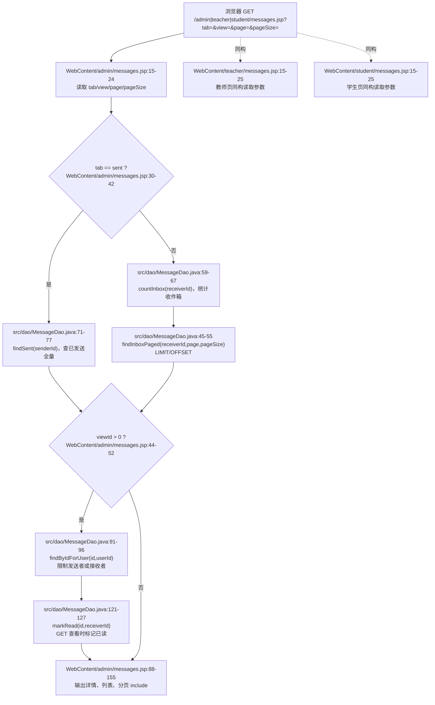
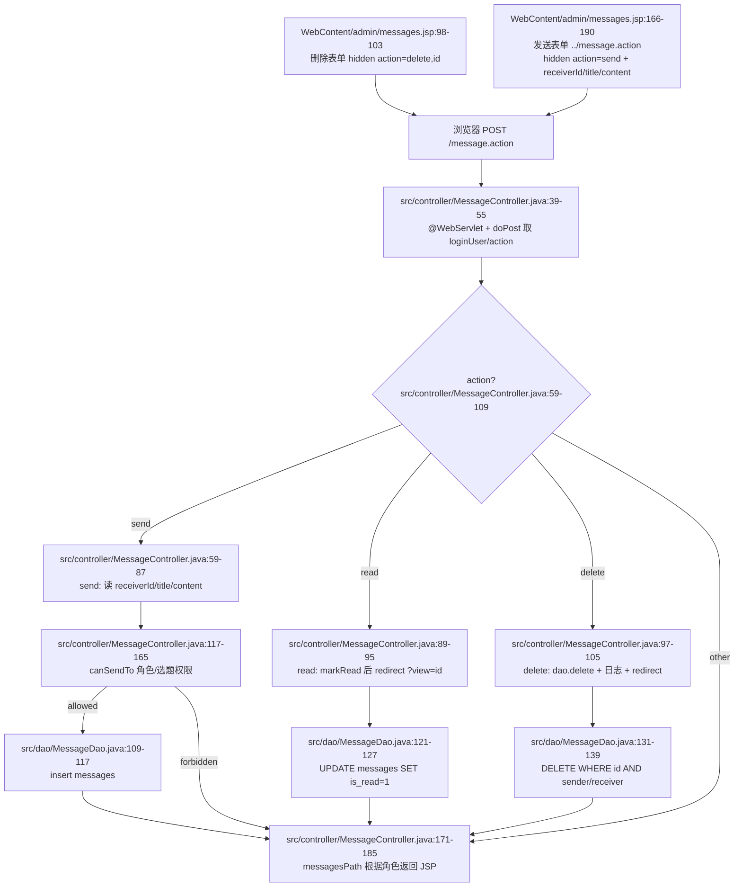
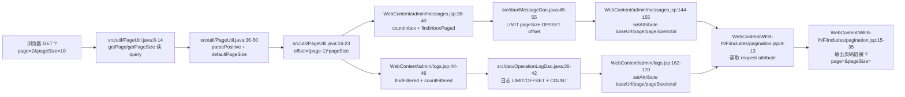
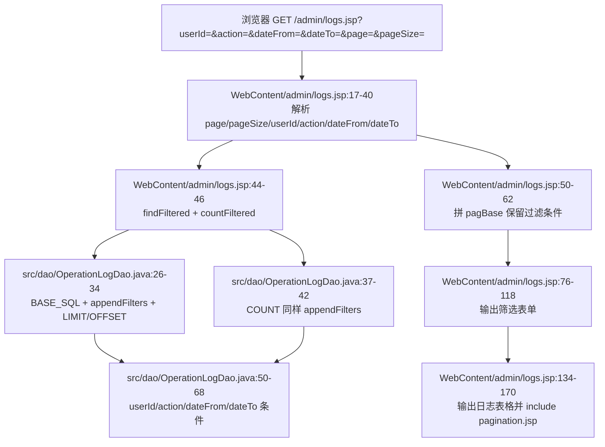
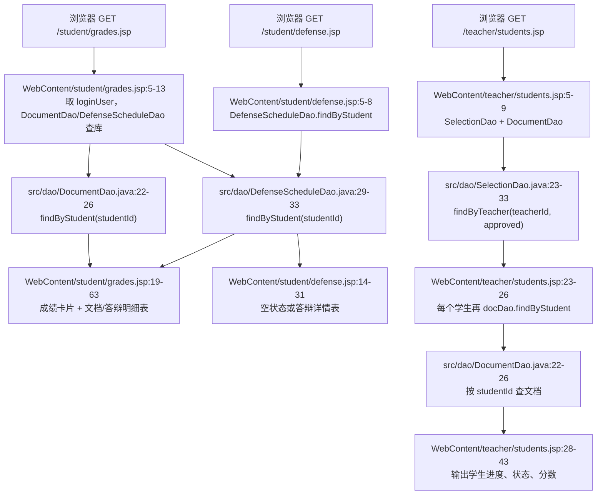
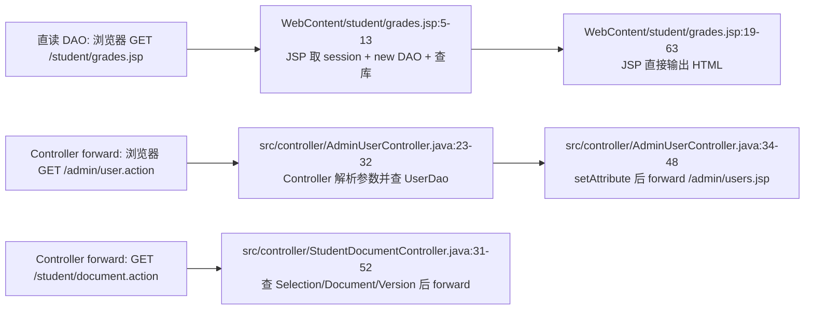

# 05 站内消息与页面渲染 GET：JSP 直读 DAO、分页、日志、成绩、答辩与教师学生进度

本部分只分析非 AI 模块：站内消息、普通 GET 页面渲染、分页组件、操作日志、学生成绩/答辩展示、教师学生进度展示，以及少量用于对照的 Controller forward 型页面。这个项目里同时存在两种页面取数方式：

1. **直接访问 JSP，JSP scriptlet 里 new DAO 并查库**：例如 `/admin/messages.jsp`、`/admin/logs.jsp`、`/student/grades.jsp`、`/student/defense.jsp`、`/teacher/students.jsp`。浏览器请求 JSP 后，JSP 顶部 Java 代码直接读取 `session.loginUser`、解析 query 参数、调用 DAO，然后在同一个 JSP 里输出 HTML。
2. **访问 `.action` Servlet，Controller 查 DAO 后 forward 到 JSP**：例如 `/admin/user.action`、`/student/document.action`、`/teacher/document.action`、`/teacher/selection.action`、`/student/topic.action`。浏览器先到 Servlet，Servlet 把数据放进 `request.setAttribute(...)`，再 `RequestDispatcher.forward(...)` 到 JSP 渲染。

站内消息页面的 GET 属于第一类；`POST /message.action` 属于 Servlet 处理表单提交，但它不 forward，而是根据当前登录用户角色 redirect 回对应的 `messages.jsp`。

---

## 1. URL / 方法 / 字段总表

| 模块 | URL 与方法 | query / form 字段 | 数据来源 | 结果 |
|---|---|---|---|---|
| 管理员消息页 | `GET /admin/messages.jsp` | `tab`、`view`、`page`、`pageSize` | JSP scriptlet 直接调用 `MessageDao`、`UserDao` | 渲染收件箱/已发送、可选消息详情、发送弹窗、分页 |
| 教师消息页 | `GET /teacher/messages.jsp` | `tab`、`view`、`page`、`pageSize` | JSP scriptlet 直接调用 `MessageDao`、`UserDao` | 同上，角色路径不同 |
| 学生消息页 | `GET /student/messages.jsp` | `tab`、`view`、`page`、`pageSize` | JSP scriptlet 直接调用 `MessageDao`、`UserDao` | 同上，角色路径不同 |
| 站内消息动作 | `POST /message.action` | hidden `action=send/read/delete`；`send` 还带 `receiverId,title,content`；`read/delete` 带 `id` | `MessageController` 调 `MessageDao`、`UserDao`、`SelectionDao`、`TopicDao` | 不渲染页面；redirect 到角色对应 `messages.jsp` |
| 管理员日志 | `GET /admin/logs.jsp` | `userId`、`action`、`dateFrom`、`dateTo`、`page`、`pageSize` | JSP scriptlet 直接调用 `OperationLogDao` | 渲染日志表格与分页 |
| 学生成绩 | `GET /student/grades.jsp` | 无业务 query | JSP scriptlet 直接调用 `DocumentDao`、`DefenseScheduleDao` | 渲染文档成绩卡片、答辩成绩和明细表 |
| 学生答辩 | `GET /student/defense.jsp` | 无业务 query | JSP scriptlet 直接调用 `DefenseScheduleDao` | 渲染答辩安排或空状态 |
| 教师学生进度 | `GET /teacher/students.jsp` | 无业务 query | JSP scriptlet 直接调用 `SelectionDao`、`DocumentDao` | 渲染已选题学生及各阶段文档状态 |
| Controller forward 对照 | `GET /admin/user.action`、`GET /student/document.action` 等 | 由对应 Controller 解析 | Controller 调 DAO 后 `setAttribute` | forward 到 JSP，不改变浏览器地址 |

字段约定：

- `?tab=inbox`：`?` 表示 URL query 开始，`tab` 是消息列表视图；`inbox` 是默认收件箱。代码只特殊识别 `sent`，非 `sent` 都按收件箱处理。
- `&view=1`：`&` 连接第二个 query 参数；`view` 是要打开详情的消息 id。JSP 会用 `findByIdForUser(viewId, loginUser.id)` 限制只能看本人发送或接收的消息。
- `page/pageSize`：分页参数。`page` 是第几页，`pageSize` 是每页条数；非法、空值、小于等于 0 都回退到默认值。
- `../message.action`：消息页都在 `/admin/`、`/teacher/`、`/student/` 子目录下，表单用相对路径 `../message.action` 回到应用根下的 `/message.action`。
- hidden `action` / `id`：表单隐藏字段，不展示给用户，但会随 POST body 发给 Servlet。`action` 决定 send/read/delete 分支，`id` 指定消息主键。
- `include pagination.jsp`：分页不是独立请求；主 JSP 先把 `baseUrl/page/pageSize/total` 放到 request attribute，再 include 分页片段拼出上一页/下一页链接。

---

## 2. 消息页面 GET：浏览器直达 JSP，JSP scriptlet 直接查 DAO

### 2.1 网络请求与参数进入点

典型请求：

```text
GET /admin/messages.jsp?tab=inbox&page=2&pageSize=10
GET /teacher/messages.jsp?tab=sent
GET /student/messages.jsp?tab=inbox&view=12
```

浏览器请求的是 JSP 文件本身，不是 `.action`。JSP 顶部 scriptlet 直接执行 Java：

- `session.getAttribute("loginUser")` 取当前登录用户。
- `new MessageDao()` 和 `new UserDao()` 准备查消息和联系人。
- `request.getParameter("tab")` 读取列表类型，空值默认 `inbox`。
- `request.getParameter("view")` 尝试解析详情消息 id，解析失败就是 0。
- `PageUtil.getPage(request)` 与 `PageUtil.getPageSize(request)` 读取分页参数。

管理员、教师、学生三个消息页代码结构一致，路径不同。以 `WebContent/admin/messages.jsp` 为例，关键流程集中在 `15-58` 行：读取 `tab/view/page/pageSize`，根据 `tab` 决定查已发送还是收件箱，按 `view` 查详情，再准备联系人列表和分页 base URL。

### 2.2 `tab` 如何影响 DAO 查询

消息页只把 `tab` 分成两类：

| `tab` 值 | JSP 分支 | DAO 调用 | 分页 |
|---|---|---|---|
| `sent` | 已发送 | `msgDao.findSent(loginUser.getId())` | 不 include 分页；`total = list.size()` |
| 空值、`inbox`、其他值 | 收件箱 | `msgDao.countInbox(...)` + `msgDao.findInboxPaged(...)` | include `pagination.jsp` |

这里有一个容易被问到的点：**已发送列表没有用 `LIMIT/OFFSET`**。`sent` 分支直接 `findSent` 拉全量，并且 `if (!"sent".equals(tab))` 才 include 分页，因此 `page/pageSize` 对已发送页没有实际影响。收件箱分支才会把 `page/pageSize` 传入 `findInboxPaged`，最终变成 SQL 的 `LIMIT ? OFFSET ?`。

### 2.3 `view` 如何影响详情和已读状态

`view` 是详情消息 id，例如 `?tab=inbox&view=12`：

1. JSP 先把 `view` parse 成 `viewId`。
2. 如果 `viewId > 0`，调用 `msgDao.findByIdForUser(viewId, loginUser.getId())`。
3. DAO SQL 条件是 `m.id=? AND (m.sender_id=? OR m.receiver_id=?)`，所以用户只能看自己发出或接收的消息。
4. 如果打开的是自己收到的未读消息，JSP 直接调用 `msgDao.markRead(viewing.getId(), loginUser.getId())`，然后把内存对象 `viewing.setIsRead(1)`，这样当前页面立即显示已读。

这也是直接 JSP 读 DAO 的典型特征：**GET 请求不仅查数据，还可能产生“标记已读”的写操作**。如果老师追问“点击查看消息是不是纯查询”，答案是否定的：带 `view` 的 GET 在未读收件消息场景下会执行 `UPDATE messages SET is_read=1 ...`。

### 2.4 消息页 GET 直读 DAO 流程图



---

## 3. 消息表单 POST：`message.action` 的 send / read / delete

### 3.1 表单从哪里来

消息页里有两类表单：

- 删除表单：详情块中 `<form action="../message.action" method="post">`，隐藏字段 `action=delete` 和 `id=<消息 id>`。
- 发送表单：弹窗中 `<form action="../message.action" method="post">`，隐藏字段 `action=send`，并提交 `receiverId`、`title`、`content`。

`../message.action` 是相对路径。以 `/admin/messages.jsp` 为例，它解析成 `/message.action`；以 `/teacher/messages.jsp` 和 `/student/messages.jsp` 也一样。这样三个角色页面可以复用同一个 `MessageController`。

代码里还存在 `action=read` 分支，但当前三个消息 JSP 的“查看”按钮是普通 GET 链接 `?tab=<tab>&view=<id>`，不是 POST read 表单。因此实际页面点击查看主要走 JSP GET 的 `view` 标记已读；`MessageController` 的 read 分支更像保留接口或可被其他表单调用。

### 3.2 Controller 入口与分支

`MessageController` 映射为 `@WebServlet("/message.action")`，只实现 `doPost`。入口会：

1. `request.setCharacterEncoding("UTF-8")`，避免标题/内容中文乱码。
2. 从 session 取 `loginUser`。
3. 读取 form 字段 `action`。
4. 创建 `MessageDao`。

然后按 `action` 分三支：

| `action` | 必需字段 | Controller 行为 | DAO 行为 | redirect |
|---|---|---|---|---|
| `send` | `receiverId,title,content` | 先 `canSendTo`，通过后组装 `Message` | `insert` 到 `messages` | 成功 `?msg=send_ok`；权限失败 `?msg=forbidden` |
| `read` | `id` | 标记指定消息已读 | `markRead(id, loginUser.id)` | `?view=<id>` |
| `delete` | `id` | 删除本人相关消息并记日志 | `delete(id, loginUser.id)` | `?msg=delete_ok` |
| 其他/空 | 无 | 不处理业务 | 无 | 回角色消息页 |

注意：`markRead` 和 `delete` 都在 DAO 层带了当前用户条件。`markRead` 要求当前用户是 receiver；`delete` 要求当前用户是 sender 或 receiver。Controller 没检查影响行数，所以即使 id 不属于本人，也只是 DAO 更新/删除 0 行，然后按原逻辑 redirect。

### 3.3 `canSendTo` 权限规则

发送消息前必须调用 `canSendTo(sender, receiverId)`，这是防止用户绕过前端下拉框随意改 `receiverId` 的核心。因为 JSP 的联系人下拉框是 `userDao.findAll(null)` 拉全体用户，只在前端排除了自己；真正的角色限制必须放在服务端。

规则如下：

| 发送者角色 | 可发给谁 | 代码依据 |
|---|---|---|
| admin | 任意存在的用户 | 找到 receiver 后直接 `return true` |
| teacher | student 或 admin | 判断 receiver role 是 `student` 或 `admin` |
| student | admin | receiver role 是 `admin` 直接允许 |
| student | 自己已审核通过选题对应的指导教师 | `SelectionDao.findApprovedByStudent(sender.id)` 找到 approved 选题，再 `TopicDao.findById(topicId)`，要求 `receiver.id == topic.teacherId` |
| 其他、receiver 不存在、学生无 approved 选题 | 不允许 | 返回 false |

设计原因：站内消息是跨角色沟通通道。如果只依赖页面下拉框，用户可以手工构造 POST，把 `receiverId` 改成任意用户。`canSendTo` 把业务关系放在服务端校验，保证学生只能联系管理员或自己的指导教师，教师只能联系学生或管理员，管理员拥有全局通知能力。

### 3.4 为什么 POST 后 redirect

`send/read/delete` 执行后都 redirect，而不是 forward 回 JSP，原因有三点：

1. **避免刷新重复提交**：浏览器刷新 redirect 后的 GET 页面，不会重复发送 POST。
2. **回到角色正确的消息页**：`messagesPath(user)` 根据当前用户角色返回 `/admin/messages.jsp`、`/teacher/messages.jsp` 或 `/student/messages.jsp`。
3. **用 query 传递轻量结果**：`?msg=send_ok`、`?msg=forbidden`、`?msg=delete_ok`、`?view=<id>` 都是简单状态或定位信息，不需要 request attribute。

### 3.5 `message.action` 分支流程图



---

## 4. 分页参数流：`page/pageSize`、`baseUrl` 与 `pagination.jsp`

### 4.1 参数解析

分页工具统一在 `PageUtil`：

- `getPage(request)` 读 `request.getParameter("page")`，默认 1。
- `getPageSize(request)` 读 `request.getParameter("pageSize")`，默认来自 `SystemConfigUtil.getInt("page.default_size", 10)`。
- `parsePositive` 只接受正整数；空值、非法数字、0、负数都回退默认值。
- `offset(page, pageSize)` 计算 `(page - 1) * pageSize`，并再次修正小于 1 的输入。
- `totalPages(total, pageSize)` 计算总页数，`total <= 0` 返回 0。

因此 `?page=abc&pageSize=-1` 不会抛异常；会回到 `page=1` 和默认 pageSize。当前代码没有设置 pageSize 上限，如果用户传很大的 `pageSize`，DAO 会把它作为 SQL `LIMIT` 参数。

### 4.2 主 JSP 为什么要设置 request attribute

分页片段 `pagination.jsp` 不知道主页面是消息、日志还是用户列表。它只从 request attribute 拿四个值：

- `baseUrl`：保留当前筛选条件的基础 URL，例如 `messages.jsp?tab=inbox` 或 `logs.jsp?userId=1&action=LOGIN`。
- `page`：当前页。
- `pageSize`：每页条数。
- `total`：总记录数。

主 JSP 负责查 `total` 和当前页数据，再把这四个值塞到 request attribute，然后 include 分页片段。这样分页组件可以复用；它只关心如何拼上一页、下一页、页码链接，不关心业务 DAO。

消息收件箱的设置点是 `WebContent/admin/messages.jsp:144-155`；日志页是 `WebContent/admin/logs.jsp:162-170`。

### 4.3 `baseUrl` 如何保留 tab 和筛选条件

消息页：

- `pagBase = "messages.jsp?tab=" + tab`。
- 分页链接最终变成 `messages.jsp?tab=inbox&page=2&pageSize=10`。
- 因为已发送页不 include 分页，所以 `tab=sent` 时这个 baseUrl 基本不用。

日志页：

- 从 `logs.jsp?` 开始，把非空 `userId/action/dateFrom/dateTo` 追加进去。
- 末尾多余的 `?` 或 `&` 会被裁掉。
- 分页链接会保留筛选条件，例如 `logs.jsp?action=LOGIN&dateFrom=2026-06-01&page=2&pageSize=10`。

`pagination.jsp` 通过 `pgBaseUrl.contains("?") ? "&" : "?"` 判断新参数前用 `&` 还是 `?`。这就是为什么主页面只传 baseUrl，分页片段就能适配带不带 query 的 URL。

### 4.4 分页参数流图



---

## 5. 操作日志页：GET 过滤 + 分页 + JSP 直读 DAO

典型请求：

```text
GET /admin/logs.jsp
GET /admin/logs.jsp?userId=3&action=SEND&dateFrom=2026-06-01&dateTo=2026-06-22&page=1&pageSize=20
```

`admin/logs.jsp` 也是直读 DAO：

1. 顶部 scriptlet 从 session 取登录用户，并 `new OperationLogDao()`。
2. 读取 `page/pageSize`。
3. 读取并清洗筛选参数：
   - `userId` 尝试 parse int，失败忽略；
   - `action` 空串转 null；
   - `dateFrom/dateTo` 空串转 null。
4. 调用 `dao.findFiltered(filterUserId, filterAction, dateFrom, dateTo, currentPageNum, pageSize)` 取当前页日志。
5. 调用 `dao.countFiltered(...)` 取总数。
6. 拼 `pagBase`，保留非空筛选条件。
7. 渲染筛选表单、日志表格，再 include `pagination.jsp`。

DAO 层 `appendFilters` 是精确过滤：`userId` 用 `l.user_id=?`，`action` 用 `l.action=?`，日期用 `l.created_at>=?` 和 `l.created_at<=dateTo 23:59:59`。也就是说，`action=SEND` 只匹配完整的 SEND，不是模糊搜索。



设计上，日志页直接 JSP 读 DAO 简单直观，适合后台列表页快速开发；缺点是过滤解析、DAO 调用、HTML 输出都在一个 JSP 中，后续如果要加接口复用、单元测试或权限审计，会比 Controller forward 更难拆。

---

## 6. 成绩、答辩、教师学生进度：展示页 DAO 读取

### 6.1 学生成绩 `/student/grades.jsp`

学生成绩页没有业务 query 参数，完全依赖当前 session 用户：

1. `loginUser = session.getAttribute("loginUser")`。
2. `new DocumentDao()` 和 `new DefenseScheduleDao()`。
3. `docDao.findByStudent(loginUser.getId())` 查该学生所有文档记录。
4. `defDao.findByStudent(loginUser.getId())` 查该学生答辩安排。
5. `DictionaryUtil.items("document_type")` 得到阶段名称。
6. 把文档列表按 `docType` 放进 `docMap`，先渲染成绩卡片，再渲染明细表。

DAO 层 `DocumentDao.findByStudent` 使用 `BASE_SQL` 连接 `documents/users/topics`，按 `student_id` 过滤；`DefenseScheduleDao.findByStudent` 使用答辩安排表并左连接 approved 选题、课题、教师，拿到课题标题和指导教师。

### 6.2 学生答辩 `/student/defense.jsp`

答辩页也没有业务 query 参数：

1. 从 session 取 `loginUser`。
2. `new DefenseScheduleDao()`。
3. `dao.findByStudent(loginUser.getId())`。
4. 如果返回 null，显示“答辩安排尚未发布”；否则输出课题、指导教师、答辩时间、教室、分组、成绩、备注。

这个页面只展示当前学生自己的答辩安排。能否看到别人的答辩，不由 query 控制，因为页面没有接收 `studentId` 参数，而是固定使用 session 用户 id。

### 6.3 教师学生进度 `/teacher/students.jsp`

教师学生进度页同样是 JSP 直读 DAO：

1. 从 session 取教师 `loginUser`。
2. `SelectionDao.findByTeacher(loginUser.getId(), "approved")` 查当前教师名下已通过选题的学生。
3. 对每个 `TopicSelection`，再调用 `DocumentDao.findByStudent(s.getStudentId())` 查询该学生文档。
4. 用 `docMap` 按文档类型展示“未提交”、状态徽章和分数。

这里有一个性能追问点：这是典型 **N+1 查询**。先查 1 次 approved 学生列表，然后每个学生再查 1 次文档。如果一个教师有 N 个学生，至少 N+1 次查询。优点是 JSP 逻辑直接、容易写；缺点是学生数量大时效率不如一次 join 聚合查询。

### 6.4 学生/教师展示页 DAO 读取图



---

## 7. Controller forward 与 JSP 直读 DAO 的区别

本部分核心页面大多是 **JSP 直读 DAO**，但项目其他页面能看到 **Controller forward** 模式。两者区别如下：

| 对比点 | JSP 直读 DAO | Controller forward |
|---|---|---|
| 浏览器访问 | 直接访问 `.jsp` | 访问 `.action` |
| 参数解析位置 | JSP scriptlet | Servlet `doGet/doPost` |
| DAO 调用位置 | JSP 顶部 Java 代码 | Controller |
| 数据传给页面 | 局部变量直接用于 JSP 输出 | `request.setAttribute(...)` 后 forward |
| 浏览器地址栏 | `.jsp` | 仍显示 `.action`，forward 是服务端内部跳转 |
| 优点 | 写起来短、页面和数据在一个文件里 | 分层清晰、易测试、JSP 更专注展示 |
| 缺点 | JSP 负责参数、业务、DAO、HTML，耦合高 | 文件更多，简单页开发略繁 |

项目中的 forward 例子：

- `/admin/user.action`：Controller 解析 `role/college/page/pageSize`，调用 `UserDao.findAllPaged` 和 `countAll`，把 `users/total/currentPage/pageSize/...` 放进 request，再 forward 到 `/admin/users.jsp`。
- `/student/document.action`：Controller 解析 `type`，查 approved 选题、当前文档、版本列表，setAttribute 后 forward 到 `/student/documents.jsp`。
- `/teacher/document.action`：Controller 解析 `type/status`，查教师待审文档，setAttribute 后 forward 到 `/teacher/documents.jsp`。
- `/teacher/selection.action`：Controller 解析 `status`，查选题申请，setAttribute 后 forward 到 `/teacher/selections.jsp`。
- `/student/topic.action`：Controller 解析 `keyword/college`，查开放课题，setAttribute 后 forward 到 `/student/topics.jsp`。



对消息页而言，当前实现选择 JSP 直读 DAO 的原因大概率是：三个角色消息页结构完全一致，直接复制/复用 JSP 逻辑能快速完成页面；分页 include 也让公共分页不必写 Controller。代价是：`view` 标记已读这种写操作藏在 JSP GET 里，权限和数据访问逻辑分散在 JSP 与 Controller 两处，后续如果要做 REST API 或审计，会需要重构。

---

## 8. 逐段代码解释要点

### 8.1 `messages.jsp` 顶部 scriptlet

- `page import="bean.*,dao.*,java.util.*,java.text.SimpleDateFormat,util.EscapeUtil,util.PageUtil"`：JSP 直接 import DAO 和工具类，说明页面本身承担 Java 逻辑。
- `loginUser = (User) session.getAttribute("loginUser")`：所有消息查询都绑定当前登录用户 id。
- `MessageDao msgDao = new MessageDao(); UserDao userDao = new UserDao();`：页面直接实例化 DAO。
- `tab = request.getParameter("tab"); if (tab == null) tab = "inbox";`：默认收件箱；其他非 sent 字符串也会走收件箱分支。
- `viewId` 的 try/catch：非法 view 不报错，按 0 处理，不展示详情。
- `currentPageNum/pageSize`：只影响收件箱分页 DAO。
- `if ("sent".equals(tab)) ... else ...`：已发送全量查；收件箱分页查。
- `findByIdForUser`：详情权限在 DAO SQL 里做发送者/接收者限制。
- `markRead`：查看未读收件消息会写库。
- `userDao.findAll(null)`：发送弹窗联系人来源，前端只过滤自己，服务端 `canSendTo` 继续做权限校验。
- `pagBase = "messages.jsp?tab=" + tab`：分页链接保留当前 tab。

### 8.2 `MessageController` 核心段

- `@WebServlet("/message.action")`：三个角色消息页的表单都打到同一个 Servlet。
- `doPost` 而不是 `doGet`：发送、删除、标记已读都是状态改变，用 POST 更合理。
- `send` 分支先 parse `receiverId`，再 `canSendTo`：防止绕过前端限制。
- `dao.insert(msg)`：只插入 sender、receiver、title、content，`is_read/created_at` 依赖数据库默认值。
- `OperationLogUtil.log(... "SEND" ...)`：发送消息记操作日志。
- `read` 分支 redirect `?view=id`：标记已读后回到详情视图。
- `delete` 分支 `dao.delete(id, user.id)`：DAO 限制本人发出或收到的消息才能删。
- `messagesPath(user)`：同一 Controller 根据角色回到不同 JSP。

### 8.3 `pagination.jsp` 核心段

- 它不读取 request parameter，而是读取 request attribute，说明分页组件依赖主页面先准备上下文。
- `pgSep = pgBaseUrl.contains("?") ? "&" : "?"`：解决 baseUrl 是否已有 query 的拼接差异。
- 只有 `pgTotalPages > 1` 才输出分页导航。
- 页码窗口只展示首页、尾页、当前页前后 2 页，中间用省略号。
- 上一页/下一页链接统一追加 `page` 和 `pageSize`，所以切页时每页条数会保留。

### 8.4 展示类 JSP

- `student/grades.jsp`：一次取文档列表和答辩安排，然后在内存里按 `docType` 组织展示；适合学生个人页，因为数据量小。
- `student/defense.jsp`：只查当前学生一条答辩安排，没有 query 参数暴露，访问范围天然绑定 session 用户。
- `teacher/students.jsp`：先查 approved 学生，再逐个查文档；业务表达清楚，但存在 N+1 查询。
- `admin/logs.jsp`：参数解析、过滤、分页都在 JSP 顶部完成；DAO 负责 SQL 条件拼接和分页。

---

## 9. 代码证据清单

- `WebContent/admin/messages.jsp:3-58`：管理员消息页 import、取 `loginUser`、读取 `tab/view/page/pageSize`、直调 `MessageDao/UserDao`。
- `WebContent/admin/messages.jsp:78-82`：收件箱/已发送 tab 链接与未读数。
- `WebContent/admin/messages.jsp:88-106`：消息详情和删除表单 `../message.action`、hidden `action=delete/id`。
- `WebContent/admin/messages.jsp:114-155`：消息列表、`view` 链接、分页 request attribute、include `pagination.jsp`。
- `WebContent/admin/messages.jsp:162-196`：发送弹窗表单 `../message.action`、hidden `action=send`、`receiverId/title/content`。
- `WebContent/teacher/messages.jsp:15-59`：教师消息页同构参数读取、DAO 查询和分页 base URL。
- `WebContent/teacher/messages.jsp:99-103`：教师消息详情删除表单 hidden 字段。
- `WebContent/teacher/messages.jsp:145-155`：教师消息页收件箱分页 include。
- `WebContent/teacher/messages.jsp:167-191`：教师消息发送表单字段。
- `WebContent/student/messages.jsp:15-59`：学生消息页同构参数读取、DAO 查询和分页 base URL。
- `WebContent/student/messages.jsp:99-103`：学生消息详情删除表单 hidden 字段。
- `WebContent/student/messages.jsp:145-155`：学生消息页收件箱分页 include。
- `WebContent/student/messages.jsp:167-191`：学生消息发送表单字段。
- `src/controller/MessageController.java:39-55`：`/message.action` Servlet 映射、POST 入口、读取 session 用户和 `action`。
- `src/controller/MessageController.java:59-87`：`send` 分支、`receiverId/title/content`、`canSendTo`、insert、发送成功/禁止 redirect。
- `src/controller/MessageController.java:89-105`：`read/delete` 分支、markRead/delete、redirect。
- `src/controller/MessageController.java:107-109`：未知 action 回消息页。
- `src/controller/MessageController.java:117-165`：`canSendTo` 角色与选题关系权限规则。
- `src/controller/MessageController.java:171-185`：按角色返回 `/admin/messages.jsp`、`/teacher/messages.jsp`、`/student/messages.jsp`。
- `src/dao/MessageDao.java:21-31`：消息查询 `BASE_SQL` 连接 sender/receiver 用户名。
- `src/dao/MessageDao.java:45-55`：收件箱分页 `findInboxPaged` 与 `LIMIT/OFFSET`。
- `src/dao/MessageDao.java:59-67`：收件箱总数 `countInbox`。
- `src/dao/MessageDao.java:71-77`：已发送列表 `findSent`。
- `src/dao/MessageDao.java:91-96`：详情查询 `findByIdForUser` 限制本人发送或接收。
- `src/dao/MessageDao.java:98-105`：未读计数 `countUnread`。
- `src/dao/MessageDao.java:109-117`：发送消息 insert。
- `src/dao/MessageDao.java:121-127`：标记已读 update。
- `src/dao/MessageDao.java:131-139`：删除消息时限制 sender 或 receiver。
- `src/util/PageUtil.java:8-14`：读取 `page/pageSize`。
- `src/util/PageUtil.java:16-23`：计算 offset。
- `src/util/PageUtil.java:26-33`：计算 totalPages。
- `src/util/PageUtil.java:36-50`：正整数解析与默认 pageSize。
- `WebContent/WEB-INF/includes/pagination.jsp:4-13`：从 request attribute 读取分页上下文并判断 `?`/`&`。
- `WebContent/WEB-INF/includes/pagination.jsp:15-35`：输出上一页、页码、下一页和总数。
- `WebContent/admin/logs.jsp:17-46`：日志页读取分页/过滤参数并调用 `OperationLogDao`。
- `WebContent/admin/logs.jsp:50-62`：日志分页 baseUrl 保留筛选条件。
- `WebContent/admin/logs.jsp:76-118`：日志筛选 GET 表单。
- `WebContent/admin/logs.jsp:134-170`：日志表格和分页 include。
- `src/dao/OperationLogDao.java:26-42`：日志过滤查询和总数查询。
- `src/dao/OperationLogDao.java:50-68`：日志 `userId/action/dateFrom/dateTo` SQL 条件。
- `WebContent/student/grades.jsp:5-13`：学生成绩页取 session 用户并直调 `DocumentDao/DefenseScheduleDao`。
- `WebContent/student/grades.jsp:19-63`：成绩卡片、文档成绩、答辩成绩渲染。
- `WebContent/student/defense.jsp:5-8`：学生答辩页直调 `DefenseScheduleDao.findByStudent`。
- `WebContent/student/defense.jsp:14-31`：答辩空状态或详情表渲染。
- `WebContent/teacher/students.jsp:5-9`：教师学生进度页直调 `SelectionDao/DocumentDao`。
- `WebContent/teacher/students.jsp:23-43`：遍历 approved 学生并逐个 `docDao.findByStudent` 渲染进度。
- `src/dao/DocumentDao.java:15-26`：文档 `BASE_SQL` 与 `findByStudent`。
- `src/dao/DocumentDao.java:28-40`：学生文档分页和计数能力。
- `src/dao/DocumentDao.java:42-57`：教师按类型/状态查文档。
- `src/dao/DocumentDao.java:59-77`：教师文档分页查询。
- `src/dao/DocumentDao.java:79-93`：教师文档计数。
- `src/dao/DefenseScheduleDao.java:11-18`：答辩安排 `BASE_SQL` 连接学生、选题、课题、教师。
- `src/dao/DefenseScheduleDao.java:24-33`：按教师/学生查询答辩安排。
- `src/dao/SelectionDao.java:15-21`：选题查询 `SELECT_SQL` 连接学生、课题、教师。
- `src/dao/SelectionDao.java:23-33`：教师按状态查询选题学生。
- `src/dao/SelectionDao.java:50-57`：学生 approved 选题查询，用于消息发送权限。
- `src/dao/SelectionDao.java:260-263`：approved 学生总数能力。
- `src/controller/AdminUserController.java:23-48`：Controller forward 对照：查用户、setAttribute、forward。
- `src/controller/StudentDocumentController.java:31-52`：Controller forward 对照：查学生文档上下文后 forward。
- `src/controller/TeacherDocumentController.java:22-38`：Controller forward 对照：查教师文档后 forward。
- `src/controller/TeacherSelectionController.java:19-31`：Controller forward 对照：查选题审批后 forward。
- `src/controller/StudentTopicController.java:22-35`：Controller forward 对照：查开放课题后 forward。
