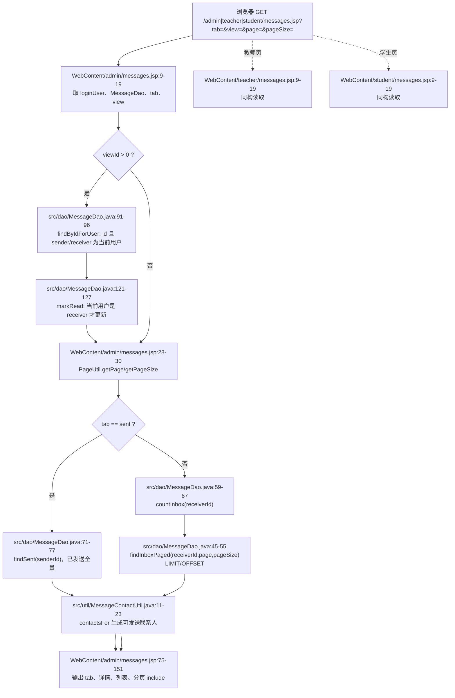
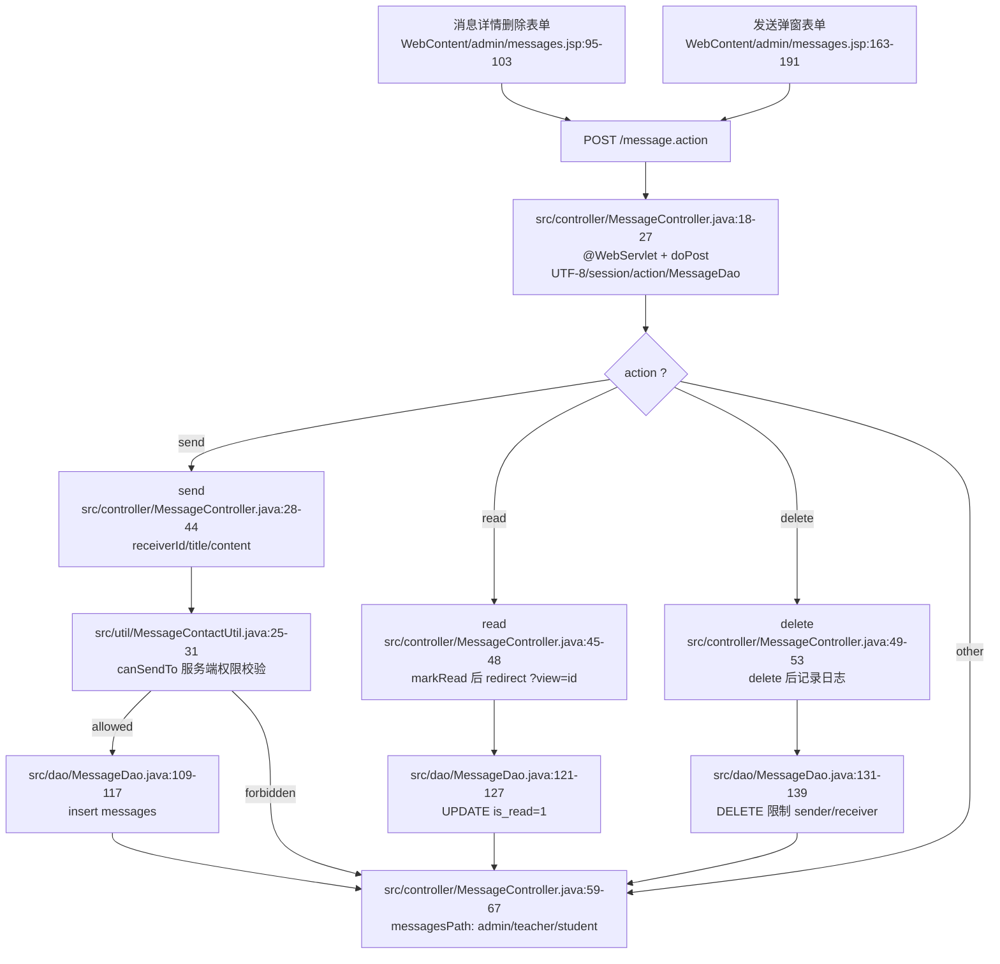
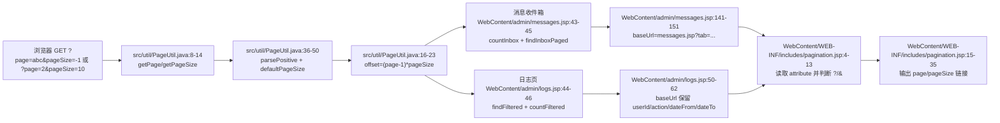
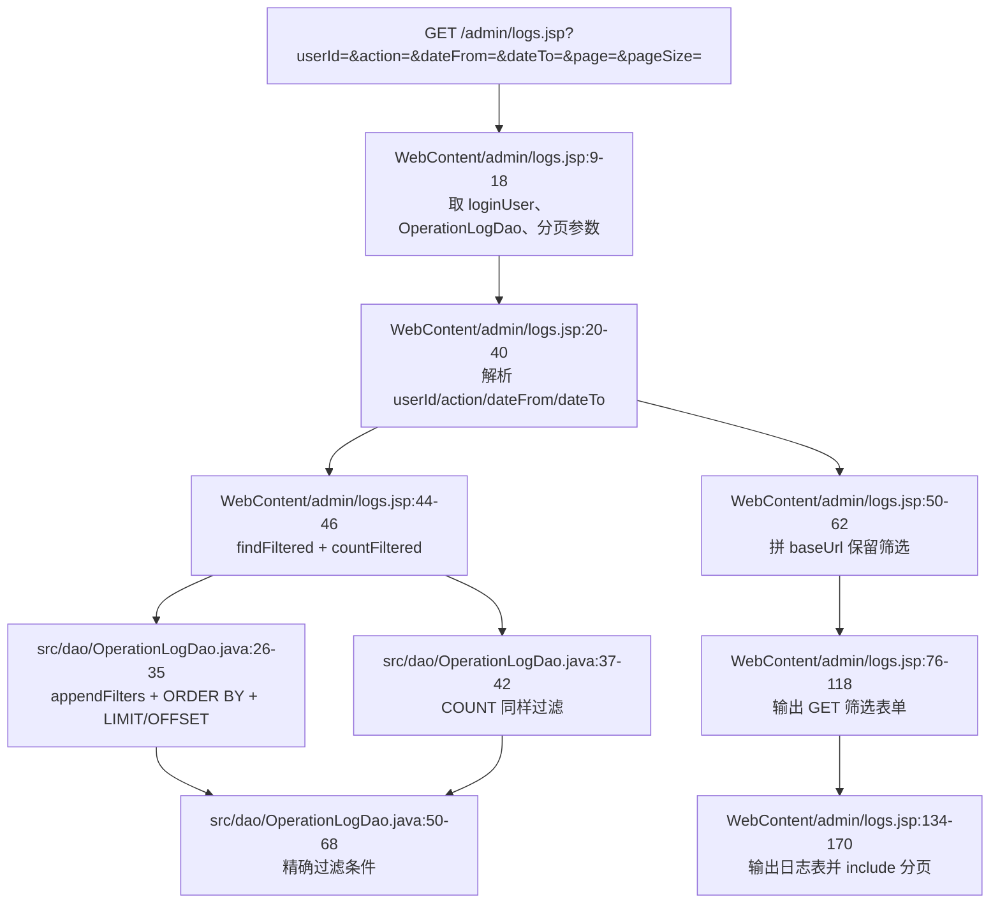
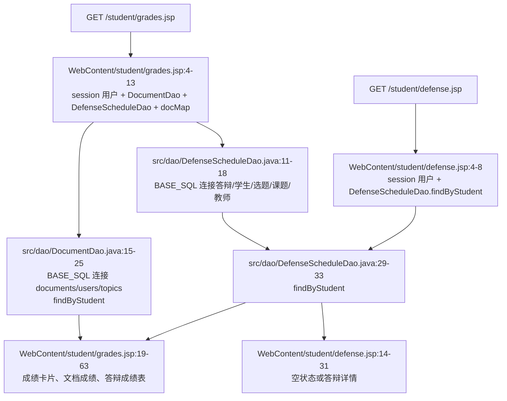
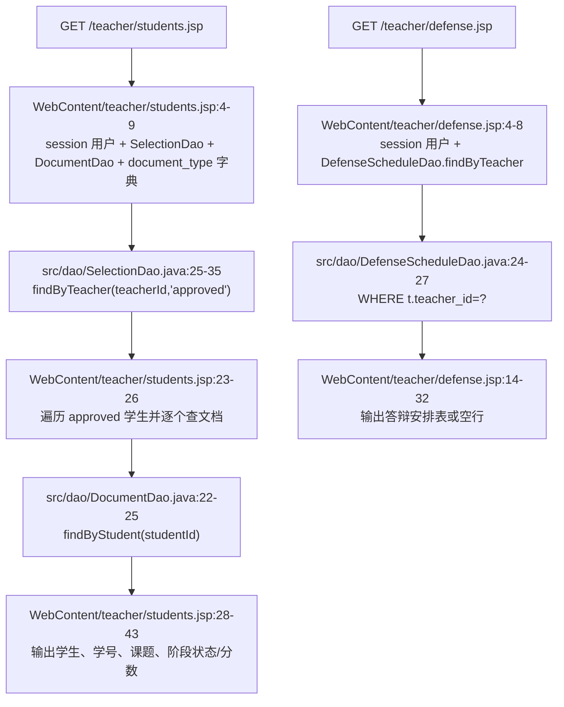
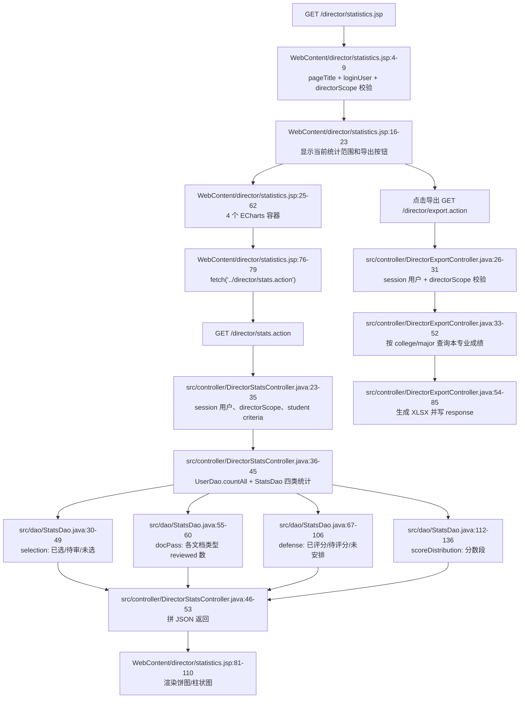

# 05 站内消息与页面渲染 GET：JSP 直读 DAO、分页、日志、成绩、答辩、教师进度与专业负责人统计

本分片覆盖站内消息、普通页面 GET 渲染、分页片段、操作日志、学生成绩/答辩、教师学生进度/答辩、专业负责人统计页和导出入口。这里不写 AI 模块。

项目当前同时存在两类页面取数方式：

1. **JSP 直读 DAO**：浏览器直接 GET `.jsp`，JSP 顶部 scriptlet 从 `session.loginUser` 和 query string 取参数，`new DAO()` 查库，然后在同一个 JSP 输出 HTML。本站内消息页、日志页、学生成绩/答辩、教师学生进度/答辩都属于这种模式。
2. **Controller forward**：浏览器 GET `.action`，Servlet 解析参数并查 DAO，`request.setAttribute(...)` 放入页面模型，再 `forward` 到 JSP。典型例子是用户管理、学生文档提交页、教师文档审核页、教师选题建议页、学生浏览课题页。

当前站内消息 GET 属于第一类；`POST /message.action` 只处理 send/read/delete 表单，处理完后按角色 redirect 回消息 JSP，不 forward。

---

## 1. URL / 方法 / 参数总表

| 模块 | URL 与方法 | query / form 字段 | 当前取数方式 | 结果 |
|---|---|---|---|---|
| 管理员消息页 | `GET /admin/messages.jsp` | `tab`、`view`、`page`、`pageSize` | JSP 直调 `MessageDao`、`MessageContactUtil` | 渲染收件箱/已发送、详情、发送弹窗、分页 |
| 教师/专业负责人消息页 | `GET /teacher/messages.jsp` | `tab`、`view`、`page`、`pageSize` | JSP 直调 `MessageDao`、`MessageContactUtil` | 教师和 director 共用教师消息页 |
| 学生消息页 | `GET /student/messages.jsp` | `tab`、`view`、`page`、`pageSize` | JSP 直调 `MessageDao`、`MessageContactUtil` | 渲染学生消息 |
| 消息动作 | `POST /message.action` | hidden `action=send/read/delete`；`send` 带 `receiverId,title,content`；`read/delete` 带 `id` | `MessageController` 调 `MessageDao`、`MessageContactUtil` | redirect 到角色消息页 |
| 管理员日志 | `GET /admin/logs.jsp` | `userId`、`action`、`dateFrom`、`dateTo`、`page`、`pageSize` | JSP 直调 `OperationLogDao` | 渲染过滤表单、日志表、分页 |
| 学生成绩 | `GET /student/grades.jsp` | 无业务 query | JSP 直调 `DocumentDao`、`DefenseScheduleDao` | 渲染文档成绩卡片、答辩成绩、明细表 |
| 学生答辩 | `GET /student/defense.jsp` | 无业务 query | JSP 直调 `DefenseScheduleDao` | 渲染本人答辩安排或空状态 |
| 教师学生进度 | `GET /teacher/students.jsp` | 无业务 query | JSP 直调 `SelectionDao`、`DocumentDao` | 渲染已选题学生和各阶段文档状态 |
| 教师答辩 | `GET /teacher/defense.jsp` | 无业务 query | JSP 直调 `DefenseScheduleDao` | 渲染所带学生答辩安排 |
| 专业负责人统计页 | `GET /director/statistics.jsp` | 无业务 query | JSP 校验 director scope，前端再 fetch JSON | 渲染 4 个 ECharts 容器和导出按钮 |
| 专业负责人统计 JSON | `GET /director/stats.action` | 无 | Controller 调 `UserDao`、`StatsDao` | 返回 selection/docPass/defense/scores JSON |
| 专业负责人成绩导出 | `GET /director/export.action` | 无 | Controller 查 scoped SQL 并写 XLSX | 下载 `director_grades_export.xlsx` |

关键字段：

- `tab`：消息列表视图；空值默认 `inbox`，只有精确等于 `sent` 才走已发送分支，其他值都按收件箱分支处理。
- `view`：消息详情 id；JSP 用 `findByIdForUser(viewId, loginUser.id)` 限制只能查看本人发送或接收的消息。
- `page/pageSize`：分页参数；`PageUtil` 只接受正整数，非法、空值、0、负数回退默认。
- `../message.action`：三个消息 JSP 都在角色子目录下，表单用 `../message.action` 回到应用根的 `/message.action`。
- `baseUrl`：主 JSP 传给分页 include 的基础 URL，用来保留 `tab` 或日志过滤条件。

---

## 2. 消息页面 GET：直达 JSP，JSP 读取 session/query 并查 DAO

典型请求：

```text
GET /admin/messages.jsp?tab=inbox&page=2&pageSize=10
GET /teacher/messages.jsp?tab=sent
GET /student/messages.jsp?tab=inbox&view=12
```

三个角色消息页结构一致：

1. JSP 从 `session.getAttribute("loginUser")` 取当前用户。
2. 创建 `MessageDao`。
3. 读取 `tab`，空值设为 `inbox`。
4. 读取 `view`，解析失败按 `0`。
5. 如果 `viewId > 0`，先 `findByIdForUser`，若当前用户是接收者且消息未读，立即 `markRead`。
6. 读取 `page/pageSize`。
7. `tab=sent` 时 `findSent(loginUser.id)` 拉全量；否则 `countInbox` + `findInboxPaged`。
8. 再查一次 `viewing = findByIdForUser(...)` 用于详情块。
9. `MessageContactUtil.contactsFor(loginUser)` 生成发送弹窗联系人。
10. 收件箱分支设置 `baseUrl/page/pageSize/total` 后 include `pagination.jsp`。

注意：带 `view` 的 GET 不是纯读。当前 JSP 在展示未读收件详情前会执行 `UPDATE messages SET is_read=1 WHERE id=? AND receiver_id=?`，所以“查看消息”会产生已读状态变更。



### `tab/view/page/pageSize` 的当前行为

| 参数 | 进入点 | 行为 |
|---|---|---|
| `tab` | 三个 `messages.jsp` 顶部 | 空值设为 `inbox`；只有 `sent` 走已发送，其他都走收件箱 |
| `view` | 三个 `messages.jsp` 顶部 | 解析为消息 id；详情查询必须满足 sender 或 receiver 是当前用户 |
| `page` | `PageUtil.getPage(request)` | 默认 1；只影响收件箱 |
| `pageSize` | `PageUtil.getPageSize(request)` | 默认 `SystemConfigUtil page.default_size` 或 10；只影响收件箱 |

已发送页没有分页 include，也没有 `LIMIT/OFFSET`；`page/pageSize` 对 `tab=sent` 当前无效。收件箱才会使用 `countInbox + findInboxPaged` 并渲染分页片段。

---

## 3. `POST /message.action`：send / read / delete 与角色 redirect

消息页里的两个可见表单：

- 详情块删除表单：`action="../message.action"`，hidden `action=delete` 和 `id=<viewing.id>`。
- 发送弹窗表单：`action="../message.action"`，hidden `action=send`，字段 `receiverId/title/content`。

当前 JSP 的“查看”按钮是普通链接 `?tab=<tab>&view=<id>`，实际点击查看主要走消息页 GET 并在 JSP 中标记已读。`MessageController` 仍保留 `action=read` 分支，适合其他 POST 表单或接口调用。



### `canSendTo` 当前权限规则

`canSendTo` 已不在 `MessageController` 内部，而是在 `MessageContactUtil`。JSP 联系人下拉框也不是拉全量用户再只排除自己，而是调用同一个 `contactsFor(loginUser)`，前端展示和服务端 POST 校验使用同一套 `isAllowed` 规则。

当前规则：

| 发送者 | 可发给谁 | 代码行为 |
|---|---|---|
| 任意登录用户 | active 管理员 | `receiver.role=admin` 直接允许；但 receiver 必须存在、状态为 1、不能是自己 |
| admin | 任意 active 非本人用户 | sender.role 为 admin 直接允许 |
| director | 同学院同专业的 teacher 或 student | `sameMajor(sender, receiver)` 且 receiver role 是 teacher/student |
| teacher | 与自己存在选题关系的 student | `topic_selections JOIN topics` 中存在 `t.teacher_id=teacherId AND s.student_id=studentId`；当前 SQL 不额外限定 `s.status` |
| student | 自己最近 approved 选题对应的指导教师 | 查 `s.status='approved'` 的最新选题并比较 teacher id |
| 其他 | 不允许 | 返回 false |

### redirect 到角色页面

`send/read/delete` 都不 forward，而是 redirect：

- admin -> `/admin/messages.jsp`
- teacher -> `/teacher/messages.jsp`
- director -> `/teacher/messages.jsp`，因为 `RoleUtil.hasRole(director, "teacher")` 返回 true，且侧边栏中 director 也使用教师消息页。
- 其他默认 -> `/student/messages.jsp`

这样可以避免刷新重复提交，并让三个角色共用一个 `/message.action`。

---

## 4. 分页参数流：`PageUtil`、主 JSP attribute、`pagination.jsp`

分页不是独立请求；主页面先解析参数、查总数和当前页数据，再把分页上下文放进 request attribute：

- `baseUrl`：业务页面构造，保留当前 tab 或过滤条件。
- `page`：当前页。
- `pageSize`：每页条数。
- `total`：总记录数。

`pagination.jsp` 只读 attribute，不读业务 query。它根据 `baseUrl` 是否包含 `?` 决定追加参数时使用 `?` 还是 `&`，输出上一页、页码、下一页，并把 `pageSize` 继续带到链接里。



日志页的 `baseUrl` 会保留非空筛选条件，例如：

```text
logs.jsp?action=LOGIN&dateFrom=2026-06-01&page=2&pageSize=10
```

消息页的 `baseUrl` 保留 `tab`，例如：

```text
messages.jsp?tab=inbox&page=2&pageSize=10
```

---

## 5. 操作日志页：GET 过滤、精确匹配、分页渲染

典型请求：

```text
GET /admin/logs.jsp
GET /admin/logs.jsp?userId=3&action=SEND&dateFrom=2026-06-01&dateTo=2026-06-22&page=1&pageSize=20
```

日志页也是 JSP 直读 DAO：

1. 从 session 取 `loginUser`，创建 `OperationLogDao`。
2. 用 `PageUtil` 读取 `page/pageSize`。
3. 解析过滤条件：`userId` 尝试转整数，失败忽略；`action/dateFrom/dateTo` 空串转 null。
4. `findFiltered(...)` 查当前页，`countFiltered(...)` 查总数。
5. 手工拼 `logs.jsp?...` 的 `baseUrl`，保留非空过滤条件。
6. 渲染 GET 筛选表单、日志表格，最后 include `pagination.jsp`。

DAO 的过滤是精确条件：`l.user_id=?`、`l.action=?`、`l.created_at>=?`、`l.created_at<=dateTo 23:59:59`，不是模糊搜索。



---

## 6. 学生成绩与学生答辩：按 session 用户绑定展示

`/student/grades.jsp` 和 `/student/defense.jsp` 都没有业务 query，访问范围固定绑定 session 中的学生 id：

- 成绩页：`DocumentDao.findByStudent(loginUser.id)` 查文档成绩，`DefenseScheduleDao.findByStudent(loginUser.id)` 查答辩安排，`DictionaryUtil.items("document_type")` 取阶段名称，随后用 `docMap` 按 `docType` 渲染成绩卡片和明细表。
- 答辩页：只调用 `DefenseScheduleDao.findByStudent(loginUser.id)`；无记录显示“尚未发布”，有记录则展示课题、教师、时间、教室、分组、成绩、备注。



这两页没有 `studentId` 参数，不能通过改 URL 查看别人数据；页面取数入口固定是当前 session 用户 id。

---

## 7. 教师学生进度与教师答辩：教师视角展示

`/teacher/students.jsp` 是 JSP 直读 DAO：

1. 从 session 取教师或 director 用户。
2. `SelectionDao.findByTeacher(loginUser.id, "approved")` 查该教师名下 approved 选题。
3. 遍历每个 `TopicSelection`，对每个学生再 `DocumentDao.findByStudent(studentId)`。
4. 按 `document_type` 字典渲染每个阶段的“未提交”、状态徽章和分数。

这里是典型 N+1 查询：先查 1 次学生列表，再对 N 个学生分别查文档。数据量小时直观；学生数量大时应改为 join 聚合或批量查询。

`/teacher/defense.jsp` 同样直读 DAO：`DefenseScheduleDao.findByTeacher(loginUser.id)` 返回该教师所带学生的答辩安排，然后输出表格。



---

## 8. 专业负责人统计页：JSP 页面容器 + `stats.action` JSON + `export.action` 文件流

专业负责人统计由三个 GET 组成：

1. `GET /director/statistics.jsp`：JSP 只做 scope 校验和页面容器渲染。`ScopeUtil.directorScope(loginUser)` 为空则 403；成功则展示当前学院/专业、导出按钮和 4 个图表容器。
2. 页面 JS `fetch('../director/stats.action')`：异步请求统计 JSON，拿到 `selection/docPass/defense/scores` 后初始化 ECharts。
3. `GET /director/export.action`：点击导出按钮后返回 XLSX 文件流。这个入口也可放到管理员/导出分片交叉引用；本分片按“页面展示 GET 的导出入口”覆盖其网络数据流。



专业负责人统计范围来自 `ScopeUtil.directorScope`：用户必须是 `director`，且 `college`、`major` 都非空。统计 SQL 都同时限定课题范围和学生范围，避免只按课题或只按学生导致跨专业数据混入。

---

## 9. JSP 直读 DAO vs Controller forward

| 对比点 | JSP 直读 DAO | Controller forward |
|---|---|---|
| 浏览器访问 | 直接访问 `.jsp` | 访问 `.action` |
| 参数解析位置 | JSP scriptlet | Servlet `doGet/doPost` |
| DAO 调用位置 | JSP 顶部 Java 代码 | Controller |
| 页面数据传递 | JSP 局部变量直接输出 | `request.setAttribute(...)` 后 forward |
| 地址栏 | `.jsp` | 仍显示 `.action`，forward 是服务端内部跳转 |
| 当前代表页面 | `messages.jsp`、`logs.jsp`、`grades.jsp`、`defense.jsp`、`students.jsp`、`statistics.jsp` | `admin/user.action`、`student/document.action`、`teacher/document.action`、`teacher/selection.action`、`student/topic.action` |

Controller forward 对照：

- `/admin/user.action`：解析筛选与分页，`UserDao.findAllPaged/countAll`，设置 `users/total/currentPage/pageSize/...`，forward 到 `/admin/users.jsp`。
- `/student/document.action`：解析 `type`，查 approved 选题、当前文档、版本列表，forward 到 `/student/documents.jsp`。
- `/teacher/document.action`：解析 `type/status`，查教师待审文档，forward 到 `/teacher/documents.jsp`。
- `/teacher/selection.action`：解析 `status`，查选题建议，forward 到 `/teacher/selections.jsp`。
- `/student/topic.action`：解析 `keyword`，按学生学院专业查开放课题，forward 到 `/student/topics.jsp`。

---

## 10. 代码证据清单

- `WebContent/admin/messages.jsp:3-56`：管理员消息页 import、取 session 用户、读 `tab/view/page/pageSize`、查消息、生成联系人、设置 `pagBase`。
- `WebContent/admin/messages.jsp:75-81`：消息 tab 链接与未读数。
- `WebContent/admin/messages.jsp:85-103`：消息详情和删除表单 `../message.action`、hidden `action=delete/id`。
- `WebContent/admin/messages.jsp:111-151`：消息列表、`view` 链接、收件箱分页 attribute、include `pagination.jsp`。
- `WebContent/admin/messages.jsp:159-191`：发送弹窗表单、hidden `action=send`、`receiverId/title/content`。
- `WebContent/teacher/messages.jsp:9-56`：教师/专业负责人消息页同构参数读取、DAO 查询、联系人和分页 base URL。
- `WebContent/teacher/messages.jsp:86-104`：教师消息详情删除表单 hidden 字段。
- `WebContent/teacher/messages.jsp:112-152`：教师消息列表与分页 include。
- `WebContent/teacher/messages.jsp:160-192`：教师消息发送表单字段。
- `WebContent/student/messages.jsp:9-56`：学生消息页同构参数读取、DAO 查询、联系人和分页 base URL。
- `WebContent/student/messages.jsp:86-104`：学生消息详情删除表单 hidden 字段。
- `WebContent/student/messages.jsp:112-152`：学生消息列表与分页 include。
- `WebContent/student/messages.jsp:160-192`：学生消息发送表单字段。
- `src/controller/MessageController.java:18-27`：`/message.action` 映射、POST 入口、UTF-8、session 用户、`action`、`MessageDao`。
- `src/controller/MessageController.java:28-44`：`send` 分支、`canSendTo`、insert、发送日志、redirect。
- `src/controller/MessageController.java:45-56`：`read/delete/other` 分支、markRead/delete、redirect。
- `src/controller/MessageController.java:59-67`：按角色返回 `/admin/messages.jsp`、`/teacher/messages.jsp`、`/student/messages.jsp`。
- `src/util/MessageContactUtil.java:11-23`：`contactsFor` 用 `UserDao.findAll` 后按 `isAllowed` 过滤联系人。
- `src/util/MessageContactUtil.java:25-31`：`canSendTo` 服务端按 receiverId 查用户并复用 `isAllowed`。
- `src/util/MessageContactUtil.java:33-55`：admin、admin receiver、director、teacher、student 的发送权限规则。
- `src/util/MessageContactUtil.java:58-84`：同专业判断、教师学生关系 SQL、学生 approved 指导教师 SQL。
- `src/dao/MessageDao.java:21-31`：消息查询 `BASE_SQL` 连接 sender/receiver 用户名。
- `src/dao/MessageDao.java:45-55`：收件箱分页 `findInboxPaged` 与 `LIMIT/OFFSET`。
- `src/dao/MessageDao.java:59-67`：收件箱总数 `countInbox`。
- `src/dao/MessageDao.java:71-77`：已发送列表 `findSent`。
- `src/dao/MessageDao.java:91-96`：详情查询 `findByIdForUser` 限制本人发送或接收。
- `src/dao/MessageDao.java:98-105`：未读计数 `countUnread`。
- `src/dao/MessageDao.java:109-117`：发送消息 insert。
- `src/dao/MessageDao.java:121-127`：标记已读 update。
- `src/dao/MessageDao.java:131-139`：删除消息时限制 sender 或 receiver。
- `src/util/PageUtil.java:8-14`：读取 `page/pageSize`。
- `src/util/PageUtil.java:16-23`：计算 `offset`。
- `src/util/PageUtil.java:26-34`：计算 `totalPages`。
- `src/util/PageUtil.java:36-50`：正整数解析与默认 `pageSize`。
- `WebContent/WEB-INF/includes/pagination.jsp:4-13`：从 request attribute 读取分页上下文并判断 `?`/`&`。
- `WebContent/WEB-INF/includes/pagination.jsp:15-35`：输出上一页、页码、下一页和总数。
- `WebContent/admin/logs.jsp:9-18`：日志页取 session 用户、创建 `OperationLogDao`、读取分页参数。
- `WebContent/admin/logs.jsp:20-46`：日志过滤参数解析、`findFiltered/countFiltered`。
- `WebContent/admin/logs.jsp:50-62`：日志分页 `baseUrl` 保留筛选条件。
- `WebContent/admin/logs.jsp:76-118`：日志筛选 GET 表单。
- `WebContent/admin/logs.jsp:134-170`：日志表格和分页 include。
- `src/dao/OperationLogDao.java:26-35`：日志过滤查询、排序、`LIMIT/OFFSET`。
- `src/dao/OperationLogDao.java:37-42`：日志总数查询。
- `src/dao/OperationLogDao.java:50-68`：日志 `userId/action/dateFrom/dateTo` SQL 条件。
- `WebContent/student/grades.jsp:4-13`：学生成绩页取 session 用户并直调 `DocumentDao/DefenseScheduleDao`。
- `WebContent/student/grades.jsp:19-63`：成绩卡片、文档成绩、答辩成绩渲染。
- `WebContent/student/defense.jsp:4-8`：学生答辩页取 session 用户并直调 `DefenseScheduleDao.findByStudent`。
- `WebContent/student/defense.jsp:14-31`：答辩空状态或详情表渲染。
- `WebContent/teacher/students.jsp:4-9`：教师学生进度页取 session 用户并直调 `SelectionDao/DocumentDao`。
- `WebContent/teacher/students.jsp:23-43`：遍历 approved 学生、逐个 `docDao.findByStudent`、渲染阶段进度。
- `WebContent/teacher/defense.jsp:4-8`：教师答辩页取 session 用户并直调 `DefenseScheduleDao.findByTeacher`。
- `WebContent/teacher/defense.jsp:14-32`：教师答辩安排表格渲染。
- `src/dao/DocumentDao.java:15-25`：文档 `BASE_SQL` 与 `findByStudent`。
- `src/dao/DocumentDao.java:28-40`：学生文档分页和计数能力。
- `src/dao/DocumentDao.java:42-57`：教师按类型/状态查文档。
- `src/dao/DocumentDao.java:59-77`：教师文档分页查询。
- `src/dao/DocumentDao.java:79-93`：教师文档计数。
- `src/dao/DefenseScheduleDao.java:11-18`：答辩安排 `BASE_SQL` 连接学生、选题、课题、教师。
- `src/dao/DefenseScheduleDao.java:24-33`：按教师/学生查询答辩安排。
- `src/dao/SelectionDao.java:17-23`：选题查询 `SELECT_SQL` 连接学生、课题、教师。
- `src/dao/SelectionDao.java:25-35`：教师按状态查询选题学生。
- `src/dao/SelectionDao.java:38-50`：专业负责人按学院/专业/状态查询选题。
- `src/dao/SelectionDao.java:66-73`：学生 approved 选题查询。
- `src/dao/SelectionDao.java:240-260`：本专业 approved/pending 学生计数能力。
- `WebContent/director/statistics.jsp:4-9`：专业负责人统计页设置标题、取 session 用户、校验 `directorScope`。
- `WebContent/director/statistics.jsp:16-23`：显示当前统计范围和导出按钮。
- `WebContent/director/statistics.jsp:25-62`：四个统计图表容器。
- `WebContent/director/statistics.jsp:76-110`：fetch `../director/stats.action` 并渲染 ECharts。
- `src/controller/DirectorStatsController.java:19-30`：`/director/stats.action` 映射、scope 校验、JSON content type。
- `src/controller/DirectorStatsController.java:31-45`：构造学生条件、调用 `UserDao.countAll` 和 `StatsDao`。
- `src/controller/DirectorStatsController.java:46-53`：输出 selection/docPass/defense/scores JSON。
- `src/controller/DirectorStatsController.java:56-96`：JSON 拼接、labels/values、字符串 escape。
- `src/controller/DirectorExportController.java:22-31`：`/director/export.action` 映射和 director scope 校验。
- `src/controller/DirectorExportController.java:33-52`：导出 SQL 同时限定 topic 与 student 的 college/major。
- `src/controller/DirectorExportController.java:54-85`：创建 XLSX、写表头/数据、设置响应头、输出文件。
- `src/controller/DirectorExportController.java:86-88`：导出操作日志。
- `src/dao/StatsDao.java:15-28`：本专业 approved 选题人数统计。
- `src/dao/StatsDao.java:30-49`：选题情况统计：已选题、待审批、未选题。
- `src/dao/StatsDao.java:55-60`：各文档类型已评阅通过数。
- `src/dao/StatsDao.java:67-106`：答辩已评分、待评分、未安排统计。
- `src/dao/StatsDao.java:112-136`：文档成绩分布统计。
- `src/dao/StatsDao.java:142-160`：按文档类型和 scope 统计 reviewed 数、scope 判定。
- `src/util/ScopeUtil.java:15-25`：`directorScope` 要求 role 为 director 且学院/专业非空。
- `src/util/RoleUtil.java:5-18`：director 被视为 teacher 角色，用于消息 redirect 到教师消息页。
- `src/controller/AdminUserController.java:26-56`：Controller forward 对照：用户管理 GET 查 DAO、setAttribute、forward。
- `src/controller/StudentDocumentController.java:32-55`：Controller forward 对照：学生文档 GET 查上下文、forward。
- `src/controller/TeacherDocumentController.java:22-38`：Controller forward 对照：教师文档 GET 查 DAO、forward。
- `src/controller/TeacherSelectionController.java:19-31`：Controller forward 对照：教师选题建议 GET 查 DAO、forward。
- `src/controller/StudentTopicController.java:23-39`：Controller forward 对照：学生课题 GET 查开放课题、forward。
