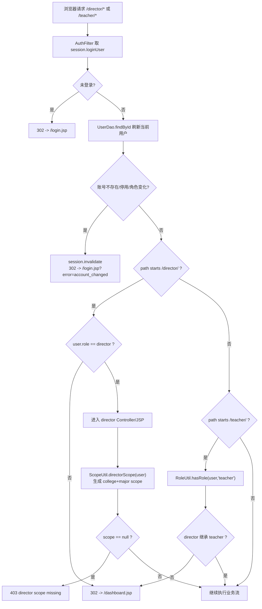
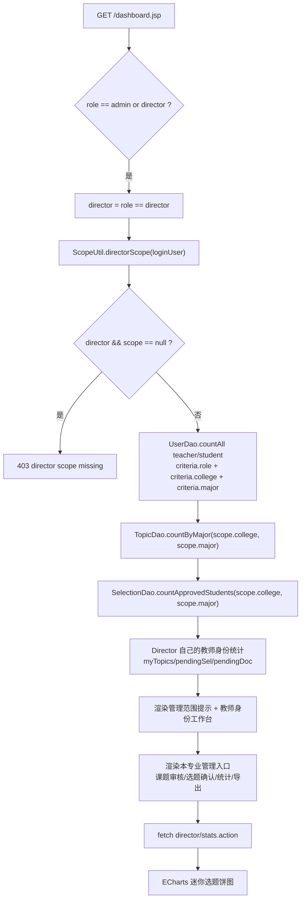
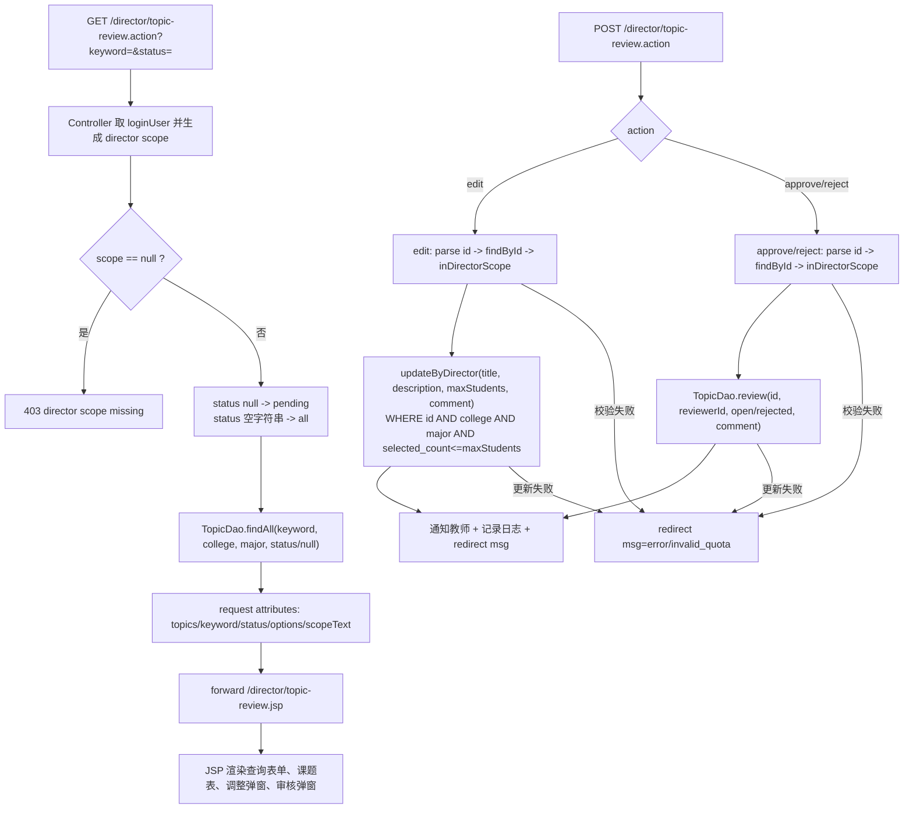
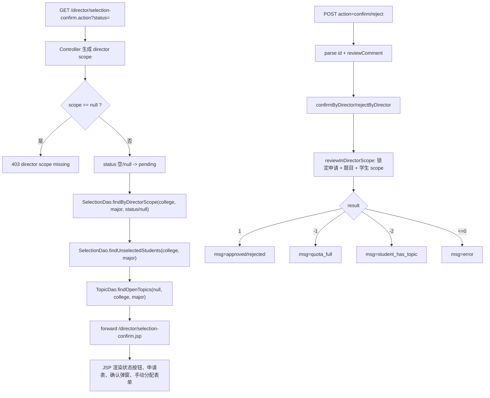
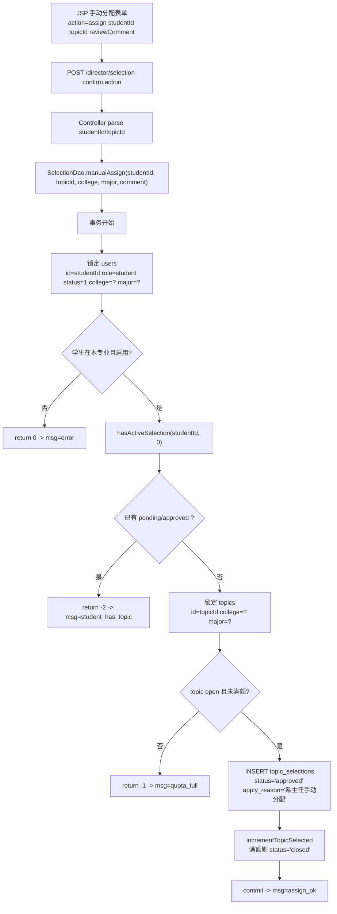
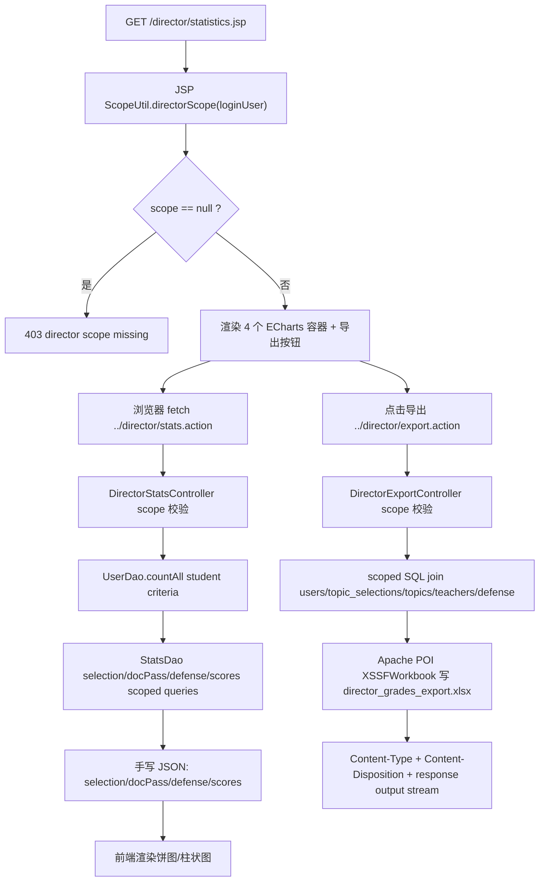

# 06 专业负责人/系主任 director 端到端网络流专题

本分片只整理当前项目新增的 **专业负责人/系主任 director 端到端网络流**，可作为单独答辩材料使用。这里不展开 AI 模块。

director 在当前系统里不是普通教师的简单复制，而是一个“教师身份 + 本专业管理身份”的复合角色：

- 作为教师：可以访问教师端课题、选题建议、文档审核、学生进度、答辩安排等教师工作流。
- 作为专业负责人/系主任：额外拥有本专业课题审核、本专业选题最终确认、本专业统计、本专业成绩 Excel 导出的管理能力。
- 管理范围不是从请求参数传入，而是从登录用户 `User.college` 和 `User.major` 推导，形成 `scope=college+major`，后端每个 director 控制器和 DAO 查询都必须用这个 scope 过滤。

---

## 1. URL / 方法 / 字段总表

| 功能 | URL 与方法 | query / form 字段 | 后端入口 | 主要结果 |
|---|---|---|---|---|
| director 仪表盘 | `GET /dashboard.jsp` | 无业务字段 | JSP 直读 DAO | 渲染本专业统计卡、教师身份工作台、director 管理入口、迷你选题图表 |
| 本专业课题审核页 | `GET /director/topic-review.action` | `keyword`、`status` | `DirectorTopicReviewController.doGet` | 按 `scope=college+major` 查询课题并 forward 到 `topic-review.jsp` |
| 调整本专业课题 | `POST /director/topic-review.action` | `action=edit`、`id`、`title`、`description`、`maxStudents`、`reviewComment` | `DirectorTopicReviewController.doPost` | scope 校验后更新课题标题/描述/名额/审核说明 |
| 审核本专业课题 | `POST /director/topic-review.action` | `action=approve/reject`、`id`、`reviewComment` | `DirectorTopicReviewController.doPost` | 通过时课题变 `open` 或满额变 `closed`；驳回时变 `rejected` |
| 本专业选题确认页 | `GET /director/selection-confirm.action` | `status=pending/approved/rejected/all` | `DirectorSelectionConfirmController.doGet` | 查询本专业申请、未选题学生、可分配题目 |
| 确认/不确认选题 | `POST /director/selection-confirm.action` | `action=confirm/reject`、`id`、`reviewComment` | `DirectorSelectionConfirmController.doPost` | 终审学生与题目的一一对应关系 |
| 手动分配 | `POST /director/selection-confirm.action` | `action=assign`、`studentId`、`topicId`、`reviewComment` | `DirectorSelectionConfirmController.doPost` | 给本专业未选题学生分配未满额开放题目 |
| 本专业统计页 | `GET /director/statistics.jsp` | 无业务字段 | JSP scope 校验 + 前端 fetch | 渲染 4 个 ECharts 容器和导出按钮 |
| 本专业统计 JSON | `GET /director/stats.action` | 无业务字段 | `DirectorStatsController.doGet` | 返回 `selection`、`docPass`、`defense`、`scores` JSON |
| 本专业成绩导出 | `GET /director/export.action` | 无业务字段 | `DirectorExportController.doGet` | 下载 `director_grades_export.xlsx` |
| 继承的教师端入口 | `GET/POST /teacher/...` | 由教师端各流程定义 | `AuthFilter` + `RoleUtil` | director 因角色继承可走教师端流程；本分片只说明继承，不展开教师端业务 |

关键字段解释：

- `scope=college+major`：本文档中的逻辑记号，表示 director 的管理边界。它不是 URL 参数，而是后端从 `loginUser.getCollege()` 和 `loginUser.getMajor()` 清洗后得到。
- `status`：在课题审核页表示课题状态，默认 `pending`，空字符串转成 `all`；在选题确认页表示选题申请状态，默认 `pending`。
- `action`：POST 表单隐藏字段，决定后端分支。课题审核有 `edit/approve/reject`；选题确认有 `confirm/reject/assign`。
- `id`：课题审核时是 `topics.id`；选题确认时是 `topic_selections.id`。
- `studentId/topicId`：手动分配时分别表示学生用户 id 和课题 id。
- `reviewComment`：director 写入审核意见、确认意见或分配说明；选题流程会追加带标签的意见行。
- `msg`：后端 redirect 后追加的结果码，例如 `approved`、`rejected`、`invalid_quota`、`quota_full`、`student_has_topic`、`error`。

---

## 2. director 权限入口：角色校验、教师继承和 scope 生成

### 2.1 文字讲解

浏览器访问任何 director 页面时，都会先进入全局 `AuthFilter`。过滤器完成四件事：

1. 从 session 取 `loginUser`；没有登录则跳转登录页。
2. 用 `UserDao.findById` 重新查当前用户，确保账号仍存在、状态仍启用、角色没有被后台改掉。
3. 对路径做角色门禁：`/director/` 只能由 `role=director` 访问；`/teacher/` 调用 `RoleUtil.hasRole(user,"teacher")`，因此 director 可以继承教师端权限。
4. 对非安全方法的 `.action` 做 CSRF 校验，失败时要么回来源页追加 `msg=csrf_error`，要么直接 403。

director 的本专业管理范围由 `ScopeUtil.directorScope(user)` 生成。这个方法要求用户角色必须是 `director`，并且 `college`、`major` 清洗后都非空；否则返回 `null`。各 director 控制器拿到 `null` 时统一返回 403 `director scope missing`。

### 2.2 关键代码逐段解释

- 登录态与账号实时刷新：`AuthFilter` 先从 session 取 `loginUser`，再用 `UserDao.findById` 重新加载数据库中的当前用户；如果数据库中账号状态或角色已经变化，就销毁 session 并回登录页。这样 director 被后台降级后不能继续靠旧 session 访问管理页（`src/filter/AuthFilter.java:52-67`，`src/dao/UserDao.java:38-45`）。
- 路径级门禁：`/director/` 分支只接受 `role=director`；`/teacher/` 分支不直接比对字符串，而是调用 `RoleUtil.hasRole`（`src/filter/AuthFilter.java:69-80`）。
- 教师继承：`RoleUtil.hasRole` 先判断实际角色与所需角色是否相同；若不同，仅允许 `actualRole=director && requiredRole=teacher` 成立。因此 director 能进教师端，teacher 不能反向进 director 端（`src/util/RoleUtil.java:5-18`）。
- scope 来源：`ScopeUtil.directorScope` 要求角色是 director，清洗 `user.college` 和 `user.major` 后二者都存在，才返回一个非全局 scope（`src/util/ScopeUtil.java:15-25`）。
- scope 校验：`ScopeUtil.inDirectorScope` 用 director scope 的 college/major 与课题自身 college/major 比较，用于 POST 修改或审核具体课题前的二次校验（`src/util/ScopeUtil.java:27-32`）。
- 用户字段来源：`User` bean 保存 `role`、`title`、`college`、`major`、`className`、兼容旧字段 `department` 等字段；`UserDao.mapRow` 把数据库列映射到这些字段，并补齐学院/专业展示名称（`src/bean/User.java:6-22`，`src/dao/UserDao.java:281-307`）。
- 侧边栏入口：director 分支先放教师端常规入口，再增加“本专业课题审核 / 本专业选题确认 / 本专业项目统计”三个 director 专属入口（`WebContent/WEB-INF/includes/sidebar.jsp:29-35`，`WebContent/WEB-INF/includes/sidebar.jsp:37-40`）。
- CSRF 入口：安全方法 GET/HEAD/OPTIONS 会确保 session 内有 token；非安全 `.action` POST 校验失败时，来源可信则追加 `msg=csrf_error`，否则直接 403（`src/filter/AuthFilter.java:86-102`，`src/filter/AuthFilter.java:120-128`）。

### 2.3 特殊符号/字段解释

- `/director/`：管理身份入口，只能 director 访问。
- `/teacher/`：教师身份入口，director 通过 `RoleUtil` 继承。
- `loginUser`：session 中的当前用户对象，但每次请求都会被数据库最新用户覆盖。
- `college/major`：director 管理边界，不由前端传入，避免用户通过改 URL 扩大范围。
- `director scope missing`：director 账号缺少学院或专业时的 403 错误文本。

### 2.4 为什么这么设计

director 既要作为指导教师处理自己的课题和学生，又要作为专业负责人处理本专业管理事项。把教师权限继承放在 `RoleUtil`，把管理边界放在 `ScopeUtil`，可以把“能否访问某类页面”和“能管理哪些数据”拆开：前者由角色决定，后者由 college+major scope 决定，避免在每个业务 Controller 中重复写角色继承逻辑。

---

## 3. dashboard 中的 director 分支

### 3.1 文字讲解

`GET /dashboard.jsp` 对 admin 和 director 走同一个大分支，但 director 会额外设置 `director=true` 并生成 `directorScope`。如果 scope 缺失，dashboard 直接 403。scope 正常时，页面统计只统计本专业：

- 教师人数：`role=teacher` 且 `college/major` 匹配。
- 学生人数：`role=student` 且 `college/major` 匹配。
- 课题总数：`topics.college/topics.major` 匹配。
- 已选题学生：选题、题目、学生三者都在本专业内。
- 教师身份工作台：只统计 director 本人作为指导教师时的课题、选题建议、文档审核。
- 本专业管理功能：显示课题审核、选题确认、项目统计、成绩 Excel 导出入口。
- 迷你图表：前端根据当前角色 fetch `director/stats.action` 或 `admin/stats.action`，director 分支请求本专业 JSON。

### 3.2 关键代码逐段解释

- 角色分支：dashboard 顶部判断 `role` 是否为 admin 或 director；director 分支调用 `ScopeUtil.directorScope(loginUser)`，缺失即 `response.sendError(403, "director scope missing")`（`WebContent/dashboard.jsp:13-19`）。
- 本专业统计卡：director 组装两个 `UserSearchCriteria`，分别统计教师和学生，并设置 `college`、`major`；课题数使用 `TopicDao.countByMajor`；已选题人数使用 `SelectionDao.countApprovedStudents(college, major)`（`WebContent/dashboard.jsp:28-40`，`src/dao/TopicDao.java:154-158`，`src/dao/SelectionDao.java:240-248`）。
- 只看本人教师工作：director 作为教师时，`myTopics`、`pendingSel`、`pendingDoc` 只按 `loginUser.id` 统计，不扩大到全专业；同时另算 `pendingDirectorSel` 表示本专业待确认选题（`WebContent/dashboard.jsp:50-61`，`src/dao/SelectionDao.java:251-259`）。
- 页面展示：director 页面显示当前管理范围提示；“教师身份工作台”明确说明 director 继承教师权限，且这里只统计本人作为指导教师负责的数据（`WebContent/dashboard.jsp:63-67`，`WebContent/dashboard.jsp:86-119`）。
- 管理入口与导出：dashboard 在 director 分支将标题改为“本专业管理功能”，导出按钮指向 `director/export.action`，并渲染三个本专业管理入口（`WebContent/dashboard.jsp:121-139`）。
- 迷你图表：脚本根据 `director ? "director" : "admin"` 选择 `stats.action` 路径，director 因而请求 `director/stats.action`，返回的 `data.selection` 被转成饼图数据（`WebContent/dashboard.jsp:148-174`）。

### 3.3 特殊符号/字段解释

- `director`：JSP 局部布尔变量，不是用户字段，用来切换 dashboard 的 admin/director 渲染。
- `pendingDirectorSel`：本专业待 director 最终确认的选题数量，不等同于 director 本人作为教师待给建议的 `pendingSel`。
- `teacherCriteria/studentCriteria`：两个独立查询条件对象，避免把教师人数和学生人数混在一个 SQL 条件里。
- `director/export.action`：从根 dashboard 相对跳转到 director 导出 Controller。

### 3.4 为什么这么设计

dashboard 是 director 进入系统后的总控台。它同时展示“本人教师任务”和“本专业管理任务”，避免 director 误以为教师端的待处理数量就是全专业待处理数量。统计查询全部绑定 scope，既满足专业负责人查看本专业全局态势的需要，又不会泄露其他专业数据。

---

## 4. 本专业课题审核 GET / POST

### 4.1 文字讲解

课题审核由 `GET /director/topic-review.action` 渲染列表，由 `POST /director/topic-review.action` 处理调整、通过、驳回。GET 默认只看 `pending` 课题；如果 `status` 为空字符串则转成 `all`，表示全部状态。查询时把 `keyword`、`scope.college`、`scope.major`、`status` 传给 `TopicDao.findAll`。

POST 有三种动作：

- `action=edit`：director 调整本专业课题标题、描述、最大人数和调整说明。
- `action=approve`：课题审核通过，目标状态传给 DAO 为 `open`；如果课题已满额，DAO 会用 SQL CASE 置为 `closed`。
- `action=reject`：课题审核驳回，目标状态为 `rejected`。

### 4.2 关键代码逐段解释

- GET scope 与状态默认值：Controller 从 session 取用户，生成 director scope；`status == null` 时设为 `pending`，`status.trim().isEmpty()` 时设为 `all`（`src/controller/DirectorTopicReviewController.java:22-36`）。
- GET 查询：`TopicDao.findAll(keyword, scope.college, scope.major, status)` 在 SQL 中追加 `t.college=?`、`t.major=?`、`t.status=?`，保证列表只出现本专业课题（`src/controller/DirectorTopicReviewController.java:37-48`，`src/dao/TopicDao.java:26-52`）。
- JSP 防空重定向：如果 JSP 没拿到 Controller 设置的 `topics`，说明被直接访问或模型缺失，页面会 redirect 回 `.action` 入口（`WebContent/director/topic-review.jsp:3-18`）。
- 查询表单：GET 表单提交 `keyword` 和 `status`；状态下拉来自 Controller 设置的 `topicStatusOptions`（`WebContent/director/topic-review.jsp:33-47`）。
- 列表与操作按钮：每行显示课题、教师、学院/专业、名额、状态、审核信息，并提供“调整 / 通过 / 驳回”三个动作按钮（`WebContent/director/topic-review.jsp:50-75`）。
- POST `edit`：Controller 解析 `id`，用 `TopicDao.findById` 找当前课题，再调用 `ScopeUtil.inDirectorScope(user,current)` 二次校验；`maxStudents` 解析失败或小于已选人数时 redirect `msg=invalid_quota`（`src/controller/DirectorTopicReviewController.java:50-94`，`src/dao/TopicDao.java:90-98`）。
- DAO 调整 SQL：`updateByDirector` 不允许改 college/major，只允许改 title/description/maxStudents/review 信息；WHERE 中再次限制 `id`、`college`、`major`，并要求 `selected_count<=maxStudents`（`src/dao/TopicDao.java:115-121`）。
- POST 审核：`approve` 映射为 `open`，`reject` 映射为 `rejected`；状态非法、id 非法、scope 不匹配或 DAO 更新失败都 redirect `msg=error`（`src/controller/DirectorTopicReviewController.java:96-116`）。
- DAO 审核 SQL：`review` 只接受 `open/rejected`；通过时用 `CASE WHEN selected_count>=max_students THEN 'closed' ELSE 'open' END`，避免已经满额的课题仍显示可选（`src/dao/TopicDao.java:123-138`）。
- 前端弹窗：调整弹窗提交 `action=edit,id,title,description,maxStudents,reviewComment`；审核弹窗提交 `action=approve/reject,id,reviewComment`，JS 只负责把当前行数据写入 hidden input（`WebContent/director/topic-review.jsp:78-107`，`WebContent/director/topic-review.jsp:110-123`）。

### 4.3 特殊符号/字段解释

- `pending`：课题待专业负责人审核的默认状态。
- `all`：Controller 内部状态值，表示不向 DAO 传 status 过滤。
- `open`：审核通过且未满额，学生端可申请。
- `closed`：审核通过但已满额，或后续选满后关闭。
- `rejected`：审核驳回。
- `selected_count/max_students`：已选人数与最大名额，director 调整名额时不能小于已选人数。
- `reviewer_id/review_time/review_comment`：director 审核或调整留下的审计字段。

### 4.4 为什么这么设计

课题审核是 director 对教师提交课题的专业把关。GET 列表先按 scope 收窄，POST 再按具体课题做 scope 二次校验，并且 DAO 的更新 SQL 也带 college/major 条件，形成“页面不可见、Controller 不可信、SQL 再兜底”的三层保护。通过审核时自动处理满额状态，可以避免审核通过后出现“课题已经满额但仍然开放”的业务矛盾。

---

## 5. 本专业选题确认 GET / POST

### 5.1 文字讲解

选题确认页用于 director 最终确认学生与题目的匹配关系。教师端只提供指导教师意见，最终是否确认由本专业 director 处理。

`GET /director/selection-confirm.action` 默认查看 `pending` 申请，也可以通过按钮切换 `approved/rejected/all`。页面同时准备两类数据：

1. 本专业学生对本专业题目的选题申请列表。
2. 本专业未选题学生与本专业可分配开放题目，用于手动分配。

`POST /director/selection-confirm.action` 的 `confirm/reject` 分支只处理已有申请，确认时会检查题目是否开放、名额是否足够、学生是否已有其他有效选题；驳回时只把该申请标为 `rejected` 并追加 director 意见。

### 5.2 关键代码逐段解释

- GET scope 与状态：Controller 取 session 用户并生成 director scope；scope 缺失 403；`status` 为空时默认 `pending`（`src/controller/DirectorSelectionConfirmController.java:23-35`）。
- GET 三组模型：Controller 设置 `selections`、`unselectedStudents`、`availableTopics`、`directorScopeText` 后 forward 到 JSP（`src/controller/DirectorSelectionConfirmController.java:36-47`）。
- 本专业申请查询：`findByDirectorScope` 要求题目 `t.college/t.major` 与学生 `u.college/u.major` 同时匹配 director scope；如果 `status` 非空再追加 `s.status=?`（`src/dao/SelectionDao.java:38-50`）。
- JSP 模型保护与范围提示：JSP 缺少三组模型时 redirect 回 `.action`；页面顶部提示“当前系主任权限范围”，并说明教师端只提供意见，director 负责确认一一对应关系（`WebContent/director/selection-confirm.jsp:3-17`，`WebContent/director/selection-confirm.jsp:23-25`）。
- 状态按钮与申请表：状态按钮拼出 `status=pending/approved/rejected/all`；申请表只有 `pending` 状态显示“确认对应 / 不确认”按钮（`WebContent/director/selection-confirm.jsp:27-67`）。
- POST confirm/reject：Controller 根据 `action` 调用 `dao.confirmByDirector` 或 `dao.rejectByDirector`；返回 `-1/-2/<=0` 分别映射到 `quota_full/student_has_topic/error`，成功后通知学生、写操作日志并 redirect `msg=approved/rejected`（`src/controller/DirectorSelectionConfirmController.java:49-95`）。
- DAO 终审事务：`reviewInDirectorScope` 开事务，`FOR UPDATE` 锁定选题申请、题目和学生，WHERE 同时限制题目与学生都在同一 college/major；只有当前状态为 `pending` 才能继续（`src/dao/SelectionDao.java:396-443`）。
- 确认分支检查：确认为 `approved` 时，必须题目仍为 `open` 且未满额；还要调用 `hasActiveSelection` 确认学生没有其他 `pending/approved` 选题。通过后更新状态、追加“系主任意见”，并递增题目已选人数（`src/dao/SelectionDao.java:451-479`，`src/dao/SelectionDao.java:489-510`）。
- 意见追加：`appendReviewComment` 会把 director 意见写成 `系主任意见：...`，没有补充意见时写 `无补充意见`，并保留已有教师意见（`src/dao/SelectionDao.java:512-519`）。

### 5.3 特殊符号/字段解释

- `pending`：选题申请等待 director 最终确认。
- `approved`：director 确认学生与题目匹配成功。
- `rejected`：director 不确认该申请。
- `quota_full`：题目不是开放状态或名额已满。
- `student_has_topic`：学生已经有其他待审或已确认选题。
- `all`：GET 列表不传 status 过滤。
- `FOR UPDATE`：数据库行锁，用来防止两个确认请求同时通过导致超额或一人多题。

### 5.4 为什么这么设计

教师端只给建议，director 端负责最终确认，这样能保证专业层面的总体匹配质量。DAO 查询同时限制题目和学生都属于本专业，避免“本专业学生选了外专业题目”或“外专业学生占用本专业名额”。确认动作放进事务并加行锁，是为了在并发点击或多管理员同时操作时仍能维护“一名学生一个有效选题”和“课题不超额”两个核心约束。

---

## 6. 未选题学生手动分配

### 6.1 文字讲解

手动分配是选题确认页的第二个 POST 分支，用于第二轮后仍未选题的学生。GET 页面先准备：

- `unselectedStudents`：本专业启用学生，且不存在 `pending/approved` 选题。
- `availableTopics`：本专业 `open` 且 `selected_count < max_students` 的课题。

JSP 渲染一个 `action=assign` 表单，director 选择学生、题目并填写分配说明。POST 后 Controller 调用 `SelectionDao.manualAssign`，DAO 在事务中锁定学生和题目，确认 scope、状态、名额、学生有效选题都满足后，直接插入一条 `approved` 选题记录，并递增题目已选人数。

### 6.2 关键代码逐段解释

- JSP 表单：当未选题学生和可分配题目都存在时，页面渲染 `POST selection-confirm.action` 表单，隐藏字段 `action=assign`，下拉框字段为 `studentId` 和 `topicId`，说明字段为 `reviewComment`（`WebContent/director/selection-confirm.jsp:69-108`）。
- 未选题学生来源：`findUnselectedStudents` 查询 `role='student' AND status=1 AND college=? AND major=?`，并用 `NOT EXISTS` 排除已有 `pending/approved` 选题的学生（`src/dao/SelectionDao.java:262-286`）。
- 可分配题目来源：`TopicDao.findOpenTopics` 只取 `status='open'` 且 `selected_count < max_students` 的题目，并追加 college/major 过滤（`src/dao/TopicDao.java:65-88`）。
- Controller 分支：`action=assign` 时解析 `studentId/topicId`，调用 `manualAssign`；返回码与 confirm 分支一致，成功后通知学生、记录日志并 redirect `msg=assign_ok`（`src/controller/DirectorSelectionConfirmController.java:97-125`，`src/controller/DirectorSelectionConfirmController.java:127-133`）。
- 事务第一段：DAO 开启事务后锁定学生行，要求学生 id、角色、启用状态、college、major 都匹配；否则 rollback 返回 `0`（`src/dao/SelectionDao.java:296-315`）。
- 事务第二段：调用 `hasActiveSelection` 排除已有有效选题；再锁定题目行，要求题目 id、college、major 匹配，并检查状态为 `open` 且未满额（`src/dao/SelectionDao.java:317-344`，`src/dao/SelectionDao.java:489-500`）。
- 插入与递增：插入 `topic_selections` 时直接写 `status='approved'` 和 `apply_reason='系主任手动分配'`；随后 `incrementTopicSelected` 让 `selected_count+1`，如果达到上限就把课题状态置为 `closed`（`src/dao/SelectionDao.java:346-361`，`src/dao/SelectionDao.java:502-510`）。

### 6.3 特殊符号/字段解释

- `action=assign`：手动分配分支标识。
- `studentId`：必须是本专业启用学生。
- `topicId`：必须是本专业开放且未满额课题。
- `apply_reason='系主任手动分配'`：与学生自主申请区分，方便后续追踪。
- `reviewComment`：被写入 `系主任分配：...`。
- `selected_count+1>=max_students`：插入后如果达到上限，课题自动关闭。

### 6.4 为什么这么设计

手动分配不是普通申请，而是 director 对未匹配学生的兜底处置。它必须比普通确认更严格：学生必须当前未选题，题目必须仍可分配，整个过程必须原子提交。事务和行锁可以避免两个窗口同时给同一个学生分配题目，或同时把最后一个名额分给多名学生。

---

## 7. 本专业统计 JSON 与成绩 Excel 导出

### 7.1 文字讲解

统计页本身是 `GET /director/statistics.jsp`，JSP 只负责 scope 校验、渲染图表容器和导出按钮；真正数据由浏览器 fetch `GET /director/stats.action` 获取 JSON。导出成绩则是独立的 `GET /director/export.action`，Controller 直接写 XLSX 到响应流。

统计 JSON 包含四块：

- `selection`：已选题、待审批、未选题。
- `docPass`：各文档类型的已审核通过/已评阅数量。
- `defense`：已评分、待评分、未安排。
- `scores.labels/values`：文档成绩分布区间与数量。

### 7.2 关键代码逐段解释

- 统计页 scope 校验：JSP 顶部直接调用 `ScopeUtil.directorScope(loginUser)`，为 `null` 则返回 403；通过后显示当前统计范围和导出按钮（`WebContent/director/statistics.jsp:3-23`）。
- 图表容器与 fetch：页面渲染四个图表容器，然后 fetch `../director/stats.action`；如果 HTTP 非 2xx 或 ECharts 缺失，显示每个图表的错误提示（`WebContent/director/statistics.jsp:25-62`，`WebContent/director/statistics.jsp:64-123`）。
- Stats Controller：`DirectorStatsController` 校验 scope，设置 `application/json;charset=UTF-8`，创建 `UserSearchCriteria` 限制 `role=student`、`college`、`major`，再调用 `StatsDao` 各统计方法（`src/controller/DirectorStatsController.java:19-45`）。
- JSON 拼接：Controller 用 `PrintWriter` 手写 JSON，`mapToJson` 输出对象，`labelsJson/valuesJson` 输出成绩分布数组，`escape` 处理反斜杠和双引号（`src/controller/DirectorStatsController.java:46-97`）。
- selection 统计：`StatsDao.selectionStats` 先数本专业 `approved` 和 `pending`，再用 `totalStudents - approved - pending` 得到未选题，且 approved/pending 查询都要求题目和学生同时匹配 college/major（`src/dao/StatsDao.java:15-49`）。
- 文档、答辩、成绩统计：`docPassStats` 按字典中的文档类型循环统计；`defenseStats` 统计已评分/待评分/未安排；`scoreDistribution` 用 CASE 把成绩分成 `90-100`、`80-89`、`70-79`、`60-69`、`60以下`，scope 查询都 join topic 与 student（`src/dao/StatsDao.java:55-160`）。
- 导出 Controller：`DirectorExportController` 先校验 scope，再构造 SQL，只导出 `t.college/t.major` 与 `u.college/u.major` 都匹配的已确认选题学生（`src/controller/DirectorExportController.java:22-52`）。
- Excel 写出：Controller 创建 `XSSFWorkbook`，sheet 名为“本专业成绩汇总”，写入学号、姓名、院系、课题、指导教师、开题/中期/终稿/答辩分数、答辩时间、答辩教室，并设置 XLSX content type 与 `filename=director_grades_export.xlsx`（`src/controller/DirectorExportController.java:54-88`）。
- 分数单元格：`setScoreCell` 对空值写空字符串，对非空值转 `BigDecimal` 后写 numeric cell，避免分数在 Excel 中全部变文本（`src/controller/DirectorExportController.java:90-96`）。

### 7.3 特殊符号/字段解释

- `selection`：JSON 对象，键为中文状态名，值为人数。
- `docPass`：JSON 对象，键为文档类型中文名，值为已评阅数量。
- `defense`：JSON 对象，键为答辩状态，值为人数。
- `scores.labels` / `scores.values`：两个等长数组，前者是分数区间，后者是对应数量。
- `Content-Disposition: attachment`：让浏览器下载文件而不是直接展示。
- `director_grades_export.xlsx`：director 端固定导出的文件名。

### 7.4 为什么这么设计

统计页采用“JSP 渲染容器 + JSON 接口供 ECharts 使用”的结构，可以让页面结构和统计数据解耦。导出不复用 JSON，是因为 Excel 需要明细行和多表关联字段，直接由 Controller 查询并用 POI 写出更适合。统计和导出都重复校验 scope，并在 SQL 层同时检查学生与题目的 college/major，保证图表和导出不会跨专业。

---

## 8. 失败分支：403 与 msg

### 8.1 403 分支

| 场景 | 触发条件 | 行为 | 代码依据 |
|---|---|---|---|
| 未登录 | session 中没有 `loginUser` | 302 到 `/login.jsp` | `src/filter/AuthFilter.java:52-57` |
| 账号变更 | 数据库用户不存在、停用或角色与 session 不一致 | session 失效，302 到 `/login.jsp?error=account_changed` | `src/filter/AuthFilter.java:59-67` |
| 非 director 访问 `/director/` | `path.startsWith("/director/") && role != director` | 302 到 `/dashboard.jsp` | `src/filter/AuthFilter.java:73-76` |
| director scope 缺失 | director 用户没有有效 college 或 major | 403 `director scope missing` | `WebContent/dashboard.jsp:13-19`，`src/controller/DirectorTopicReviewController.java:24-29`，`src/controller/DirectorSelectionConfirmController.java:25-30`，`WebContent/director/statistics.jsp:3-9`，`src/controller/DirectorStatsController.java:23-28`，`src/controller/DirectorExportController.java:26-31` |
| CSRF 失败且来源不可确认 | 非安全 `.action` POST 且 token 校验失败 | 403 `CSRF token invalid` | `src/filter/AuthFilter.java:90-102` |

### 8.2 msg 分支

| 流程 | msg | 含义 | 代码依据 |
|---|---|---|---|
| CSRF | `csrf_error` | 非安全 `.action` POST token 错误，且 Referer 可回跳 | `src/filter/AuthFilter.java:90-102`，`src/filter/AuthFilter.java:125-128` |
| 课题调整 | `edit_ok` | director 调整本专业课题成功 | `src/controller/DirectorTopicReviewController.java:84-93` |
| 课题调整 | `invalid_quota` | 最大人数解析失败、低于已选人数或 DAO 更新失败 | `src/controller/DirectorTopicReviewController.java:78-88` |
| 课题审核 | `approved` | 课题通过审核 | `src/controller/DirectorTopicReviewController.java:118-126` |
| 课题审核 | `rejected` | 课题被驳回 | `src/controller/DirectorTopicReviewController.java:118-126` |
| 课题审核 | `error` | action/id/scope/DAO 更新失败 | `src/controller/DirectorTopicReviewController.java:60-72`，`src/controller/DirectorTopicReviewController.java:96-116` |
| 选题确认 | `approved` | director 确认学生选题 | `src/controller/DirectorSelectionConfirmController.java:61-95` |
| 选题确认 | `rejected` | director 不确认学生选题 | `src/controller/DirectorSelectionConfirmController.java:61-95` |
| 选题确认/分配 | `quota_full` | 题目不可开放或名额已满 | `src/controller/DirectorSelectionConfirmController.java:67-71`，`src/controller/DirectorSelectionConfirmController.java:102-106` |
| 选题确认/分配 | `student_has_topic` | 学生已经存在其他有效选题 | `src/controller/DirectorSelectionConfirmController.java:72-76`，`src/controller/DirectorSelectionConfirmController.java:107-111` |
| 选题确认/分配 | `error` | id 解析为 0、scope 不匹配、状态不允许、数据库更新失败等 | `src/controller/DirectorSelectionConfirmController.java:77-80`，`src/controller/DirectorSelectionConfirmController.java:112-115` |
| 手动分配 | `assign_ok` | director 手动分配成功 | `src/controller/DirectorSelectionConfirmController.java:117-121` |

### 8.3 失败分支设计理由

403 用于“当前身份或账号配置不具备执行资格”的硬失败，例如 scope 缺失、CSRF 不可信。`msg` 用于“请求已到达业务 Controller，但业务条件不满足”的软失败，例如名额不足、学生已有选题、参数错误。这样用户可以回到原业务页看到结果提示，而真正越权或配置错误不会继续渲染业务页面。

---

## 9. 代码证据清单

- `src/filter/AuthFilter.java:52-67`：session 登录态读取、数据库用户刷新、账号变化失效。
- `src/filter/AuthFilter.java:69-80`：admin/director/teacher/student 路径级角色门禁。
- `src/filter/AuthFilter.java:86-102`：安全方法 token 初始化与非安全 `.action` CSRF 校验。
- `src/filter/AuthFilter.java:120-128`：安全方法判断与 `msg` 追加工具。
- `src/util/RoleUtil.java:5-18`：director 继承 teacher 权限。
- `src/util/ScopeUtil.java:15-25`：director scope 从 `User.college/User.major` 生成。
- `src/util/ScopeUtil.java:27-32`：课题是否属于 director scope 的二次校验。
- `src/util/ScopeUtil.java:34-46`：scope 展示文本与字段清洗。
- `src/bean/User.java:6-22`：用户身份、学院、专业、班级、联系方式等字段。
- `src/bean/User.java:30-57`：role、title、studentNo、college、major 等 getter/setter。
- `src/bean/User.java:59-85`：director 显示身份与完整归属信息。
- `WebContent/WEB-INF/includes/sidebar.jsp:29-35`：director 分支复用教师端入口。
- `WebContent/WEB-INF/includes/sidebar.jsp:37-40`：director 分支的消息与本专业管理入口。
- `WebContent/dashboard.jsp:13-19`：dashboard admin/director 分支与 director scope 403。
- `WebContent/dashboard.jsp:28-40`：director 本专业教师、学生、课题、已选题统计。
- `WebContent/dashboard.jsp:47-61`：director 可见公告与本人教师身份待办统计。
- `WebContent/dashboard.jsp:63-67`：dashboard 显示 director 管理范围。
- `WebContent/dashboard.jsp:86-119`：director 教师身份工作台。
- `WebContent/dashboard.jsp:121-139`：director 本专业管理入口与导出按钮。
- `WebContent/dashboard.jsp:148-174`：dashboard 迷你图表 fetch `director/stats.action`。
- `WebContent/director/topic-review.jsp:3-18`：课题审核 JSP 获取 Controller 模型并防直接访问。
- `WebContent/director/topic-review.jsp:33-47`：课题审核范围提示与 GET 查询表单。
- `WebContent/director/topic-review.jsp:50-75`：课题列表、状态、审核信息、操作按钮。
- `WebContent/director/topic-review.jsp:78-107`：课题调整与审核 POST 表单字段。
- `WebContent/director/topic-review.jsp:110-123`：课题审核页面 JS 写 hidden 字段并打开弹窗。
- `src/controller/DirectorTopicReviewController.java:20-48`：课题审核 GET servlet、scope 校验、状态默认值、列表查询和 forward。
- `src/controller/DirectorTopicReviewController.java:50-94`：课题调整 POST 分支、scope 二次校验和 `invalid_quota/edit_ok`。
- `src/controller/DirectorTopicReviewController.java:96-126`：课题通过/驳回 POST 分支、通知、日志和 `approved/rejected/error`。
- `WebContent/director/selection-confirm.jsp:3-17`：选题确认 JSP 模型读取与防直接访问。
- `WebContent/director/selection-confirm.jsp:23-32`：选题确认范围提示与状态筛选按钮。
- `WebContent/director/selection-confirm.jsp:34-67`：选题申请表和 pending 状态操作按钮。
- `WebContent/director/selection-confirm.jsp:69-108`：未选题学生手动分配表单字段。
- `WebContent/director/selection-confirm.jsp:110-131`：选题确认弹窗和 JS hidden 字段写入。
- `src/controller/DirectorSelectionConfirmController.java:21-47`：选题确认 GET servlet、scope 校验、三组页面模型。
- `src/controller/DirectorSelectionConfirmController.java:49-95`：confirm/reject POST 分支和 `quota_full/student_has_topic/error`。
- `src/controller/DirectorSelectionConfirmController.java:97-125`：assign POST 分支、通知、日志和 `assign_ok`。
- `src/controller/DirectorSelectionConfirmController.java:127-133`：POST id 解析失败回退为 0。
- `WebContent/director/statistics.jsp:3-23`：统计页 scope 403、范围提示、导出按钮。
- `WebContent/director/statistics.jsp:25-62`：四个 ECharts 容器。
- `WebContent/director/statistics.jsp:64-123`：fetch `../director/stats.action` 并渲染统计图。
- `src/controller/DirectorStatsController.java:19-45`：统计 JSON servlet、scope 校验、学生数和统计 DAO 调用。
- `src/controller/DirectorStatsController.java:46-97`：JSON 输出、map/labels/values 序列化与转义。
- `src/controller/DirectorExportController.java:22-52`：成绩导出 servlet、scope 校验、scoped SQL 与参数。
- `src/controller/DirectorExportController.java:54-88`：XSSFWorkbook、表头、数据行、响应头和导出日志。
- `src/controller/DirectorExportController.java:90-96`：分数单元格空值和数值处理。
- `src/dao/TopicDao.java:26-52`：课题列表按 keyword/college/major/status 查询。
- `src/dao/TopicDao.java:65-88`：可选开放课题按 college/major 与名额查询。
- `src/dao/TopicDao.java:90-98`：按 id 查询课题。
- `src/dao/TopicDao.java:115-121`：director 调整课题 SQL，限制 scope 与名额。
- `src/dao/TopicDao.java:123-138`：课题审核 SQL，通过/驳回与满额关闭。
- `src/dao/TopicDao.java:154-158`：按 college+major 统计课题数。
- `src/dao/TopicDao.java:168-194`：课题行映射和学院/专业名称转换。
- `src/dao/SelectionDao.java:38-50`：director scope 下查询选题申请，题目和学生双重匹配。
- `src/dao/SelectionDao.java:240-259`：本专业已确认选题人数和待确认选题人数统计。
- `src/dao/SelectionDao.java:262-286`：本专业未选题学生查询。
- `src/dao/SelectionDao.java:288-294`：confirm/reject 包装到 director scope 终审。
- `src/dao/SelectionDao.java:296-369`：手动分配事务、锁学生、锁题目、插入 approved 选题。
- `src/dao/SelectionDao.java:396-487`：director 终审事务、scope 校验、名额和一人一题检查。
- `src/dao/SelectionDao.java:489-500`：检查学生是否已有 pending/approved 选题。
- `src/dao/SelectionDao.java:502-510`：递增题目已选人数并满额关闭。
- `src/dao/SelectionDao.java:512-519`：追加教师/系主任意见文本。
- `src/dao/StatsDao.java:15-49`：本专业选题 approved/pending/unselected 统计。
- `src/dao/StatsDao.java:55-60`：本专业文档类型通过数统计入口。
- `src/dao/StatsDao.java:67-105`：本专业答辩已评分/待评分/未安排统计。
- `src/dao/StatsDao.java:112-160`：本专业成绩分布、文档已评阅计数和 scope 判断。
- `src/dao/UserDao.java:17-18`：用户查询列包含 role、college、major 等 scope 字段。
- `src/dao/UserDao.java:38-45`：按 id 查询当前用户。
- `src/dao/UserDao.java:54-67`：按 `UserSearchCriteria` 查询用户列表。
- `src/dao/UserDao.java:102-109`：按 `UserSearchCriteria` 统计用户数量。
- `src/dao/UserDao.java:244-279`：criteria 追加 role、college、major、班级、学号、姓名过滤。
- `src/dao/UserDao.java:281-307`：用户行映射并补学院/专业显示名。
- `src/dbutil/SQLHelper.java:19-28`：Druid 数据库连接池初始化。
- `src/dbutil/SQLHelper.java:48-76`：`queryList` 获取连接、PreparedStatement、绑定参数并返回行数组。
- `src/dbutil/SQLHelper.java:79-94`：`executeUpdate` 执行更新并失败返回 0。
- `src/dbutil/SQLHelper.java:96-115`：`queryScalar` 执行标量查询。
- `src/dbutil/SQLHelper.java:139-155`：SQL 参数绑定与资源关闭。
