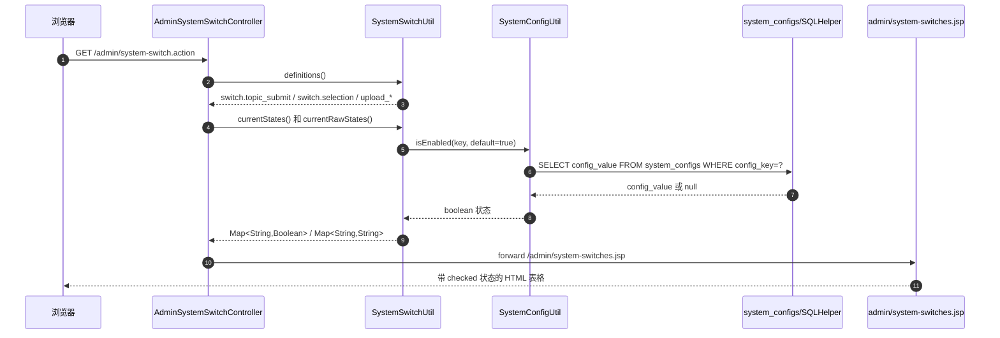
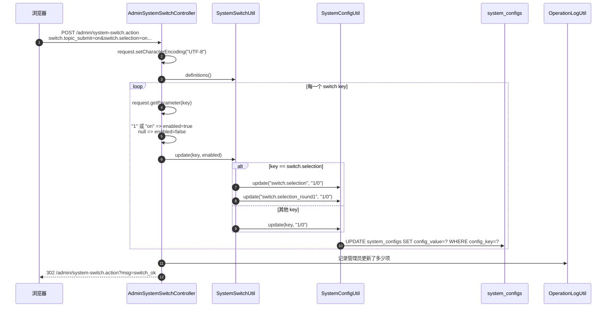
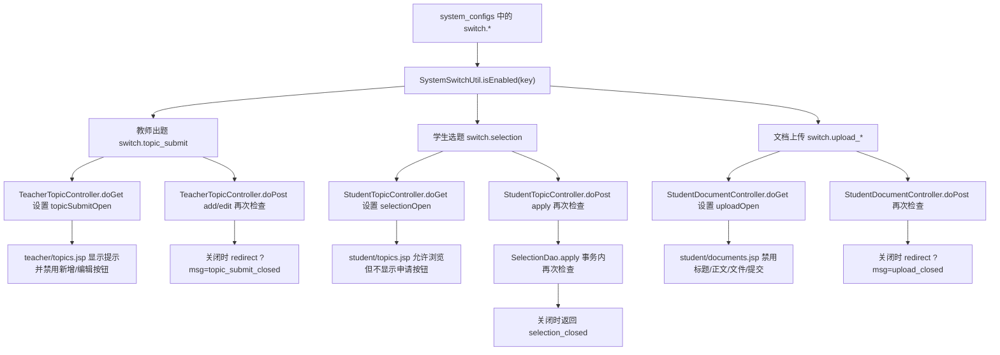
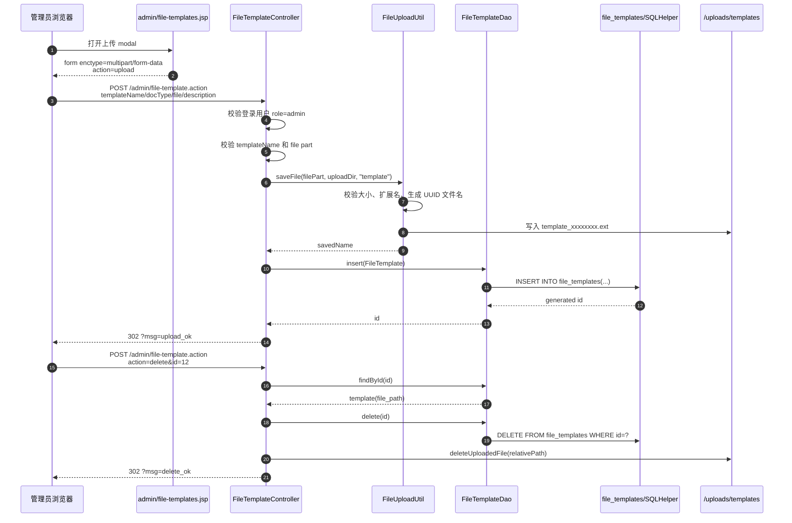
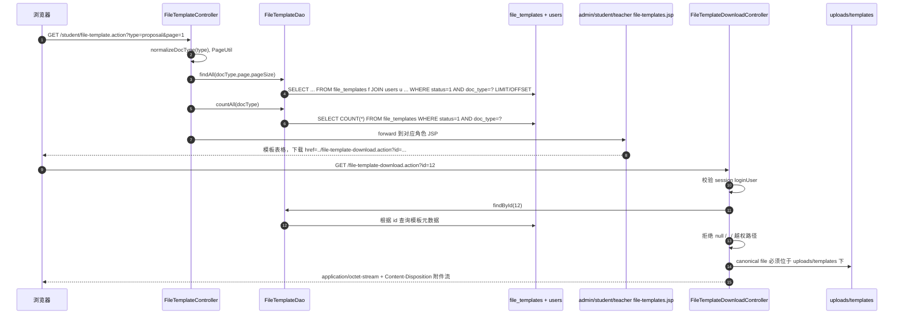
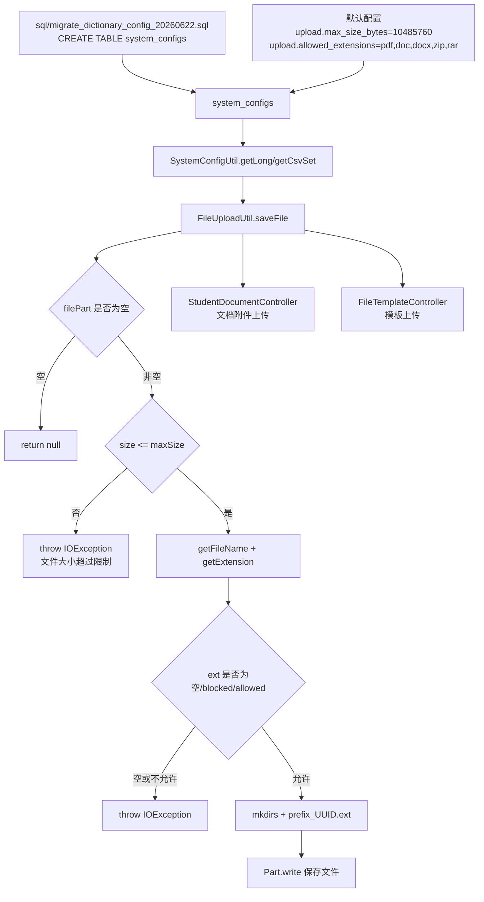

# 07 配置与模板支撑流专题：系统开关 / 文件模板 / 上传限制

本 part 单独解释当前项目新增和增强的支撑型网络数据流：**系统开关、文件模板、上传大小与扩展名配置**。它不替换第 03、04 部分，而是把这些“控制其他业务是否开放、模板文件如何分发、上传规则如何统一生效”的横向能力抽出来，作为答辩时可独立说明的专题。

本 part 不包含 AI 模块。

## 1. 支撑流总览

| 支撑能力 | URL / 入口 | 方法 | 请求体类型 | 核心字段 | 后端核心类 | 结果 |
|---|---:|---:|---|---|---|---|
| 管理员打开系统开关页 | `/admin/system-switch.action`，兼容 `/admin/switch.action` | GET | 无 | 无 | `AdminSystemSwitchController#doGet` | 读取 `system_configs` 后 forward 到 `system-switches.jsp` |
| 管理员保存系统开关 | `/admin/system-switch.action` | POST | `application/x-www-form-urlencoded` | checkbox 的 `name` 就是 `switch.*` 配置键；勾选值通常是 `on` | `AdminSystemSwitchController#doPost`、`SystemSwitchUtil.update` | 更新配置表并重定向 `?msg=switch_ok` |
| 教师出题入口受控 | `/teacher/topic.action` | GET / POST | GET 无；POST 表单 | `switch.topic_submit` | `TeacherTopicController` + `teacher/topics.jsp` | 关闭时页面禁用新增/编辑，后端拒绝 add/edit |
| 学生选题入口受控 | `/student/topic.action` | GET / POST | GET 无；POST 表单 | `switch.selection`，兼容 `switch.selection_round1` | `StudentTopicController` + `SelectionDao` + `student/topics.jsp` | 关闭时仍可浏览题目，但不能提交选题申请 |
| 学生文档上传入口受控 | `/student/document.action` | GET / POST | GET 无；POST `multipart/form-data` | `switch.upload_proposal/midterm/final`、`docType` | `StudentDocumentController` + `student/documents.jsp` | 关闭时页面禁用上传，POST 再次拒绝 |
| 管理员上传模板 | `/admin/file-template.action` | POST | `multipart/form-data` | `action=upload`、`templateName`、`docType`、`file`、`description` | `FileTemplateController#upload`、`FileUploadUtil`、`FileTemplateDao` | 保存到 `/uploads/templates`，插入 `file_templates` |
| 管理员删除模板 | `/admin/file-template.action` | POST | `application/x-www-form-urlencoded` | `action=delete`、`id` | `FileTemplateController#delete`、`FileTemplateDao` | 删除数据库记录，再删除物理文件 |
| 三类角色查看模板列表 | `/admin/file-template.action`、`/teacher/file-template.action`、`/student/file-template.action` | GET | 无 | `type`、`page`、`pageSize` | `FileTemplateController#doGet`、`FileTemplateDao` | 按角色 forward 到不同 JSP |
| 模板下载 | `/file-template-download.action?id=12` | GET | 无 | `id=file_templates.id` | `FileTemplateDownloadController` | 登录校验、路径校验后输出二进制附件 |
| 上传配置校验 | 由文档上传和模板上传间接触发 | POST | `multipart/form-data` | `upload.max_size_bytes`、`upload.allowed_extensions`、`upload.blocked_extensions` | `FileUploadUtil`、`SystemConfigUtil`、`SQLHelper` | 统一限制大小、允许扩展名、禁止危险扩展名 |

几个关键设计点：

- **配置键就是网络字段名**：系统开关 JSP 的 checkbox `name` 直接使用 `switch.topic_submit` 这类配置键，Controller 保存时按定义表循环读取，不需要逐个写死参数解析。
- **页面禁用不是安全边界**：教师出题、学生选题、学生上传文档都先在 GET 阶段把开关状态传给 JSP 用于禁用按钮；POST 阶段仍再次读取配置，防止手工构造请求绕过前端。
- **模板下载只传主键，不传路径**：模板列表中的下载链接只暴露 `id`，后端根据数据库查出 `file_path`，再做 `..` 和 canonical path 校验。
- **上传限制是后端统一规则**：学生文档附件和管理员模板文件都调用 `FileUploadUtil.saveFile`，大小和扩展名从 `system_configs` 读取；页面的 `accept` 只是用户体验提示。

## 2. 系统开关 GET：打开管理员配置页

管理员访问系统开关页时，浏览器没有请求体，只是 GET `/admin/system-switch.action`。Servlet 读取当前所有开关定义和状态，然后 forward 到 JSP 渲染表格。

### 2.1 关键代码逐段解释

**第一段：Servlet URL 和 forward。**  
`AdminSystemSwitchController` 同时映射 `/admin/system-switch.action` 和旧入口 `/admin/switch.action`，GET 中设置三个 request attribute：`switchDefinitions`、`switchStates`、`systemSwitches`，最后 forward 到 `/admin/system-switches.jsp`。其中当前 JSP 实际使用的是 `systemSwitches` 这个原始字符串状态 Map，用 `"1"` 判断 checkbox 是否 checked。证据：`src/controller/AdminSystemSwitchController.java:15-22`、`WebContent/admin/system-switches.jsp:5-10`。

**第二段：开关定义与默认值。**  
`SystemSwitchUtil.definitions()` 使用 `LinkedHashMap` 固定页面和保存顺序：教师出题、学生选题、开题上传、中期上传、终稿上传。`currentRawStates()` 会先 `ensureDefaults()`，保证数据库缺少某个配置键时也能插入默认记录并返回 `"1"` 或 `"0"`。证据：`src/util/SystemSwitchUtil.java:14-21`、`src/util/SystemSwitchUtil.java:33-40`、`src/util/SystemSwitchUtil.java:66-74`。

**第三段：从配置表读取。**  
`SystemConfigUtil.getString` 通过 `SQLHelper.queryScalar` 执行 `SELECT config_value FROM system_configs WHERE config_key=?`；`isEnabled(key, defaultValue)` 会把默认值转成 `"1"` 或 `"0"`，再交给 `isTruthy` 判断。证据：`src/util/SystemConfigUtil.java:10-17`、`src/util/SystemConfigUtil.java:54-61`、`src/dbutil/SQLHelper.java:96-115`。

**第四段：JSP 渲染。**  
`system-switches.jsp` 如果不是从 Controller forward 进来，`systemSwitches` 为 null，就重定向回 `/admin/system-switch.action`，避免直接访问 JSP 时缺少 request 数据。真正的表单是 `method="post"`，每一行 checkbox 的 `name` 就是配置键。证据：`WebContent/admin/system-switches.jsp:6-10`、`WebContent/admin/system-switches.jsp:18-40`。

### 2.2 字段和特殊符号解释

- `switch.topic_submit`：教师出题入口开关。`.` 没有层级语义，只是配置键字符串的一部分，可以作为 HTML 表单字段名被 `request.getParameter(key)` 读取。
- `switch.selection`：学生选题总开关。当前代码把第一轮和第二轮复用同一个开关，同时保留 `switch.selection_round1` 兼容旧配置。
- `switch.upload_proposal` / `switch.upload_midterm` / `switch.upload_final`：分别控制开题报告、中期检查、终稿上传。
- `"1"`：数据库中表示开启；`"0"` 表示关闭。
- `checked`：JSP 输出到 checkbox 上的 HTML 属性，只影响页面显示，不代表最终安全判断。

### 2.3 为什么这样设计

系统开关属于“运行期策略”，不应该写死在 Controller 或 JSP 里。用配置表保存后，管理员可以不改代码直接调整业务窗口；用 `SystemSwitchUtil` 统一封装后，各业务模块只依赖开关名，不需要知道数据库表结构。`ensureDefaults()` 的意义是降低部署迁移风险：即使某个环境缺少新增配置，页面第一次打开也能补齐默认值。

## 3. 系统开关 POST：checkbox key 到配置表的流转

管理员保存系统开关时，浏览器提交的是普通表单。HTML checkbox 的一个重要规则是：**未勾选的 checkbox 不会出现在请求体中**。所以后端不能只更新提交过来的参数，而是必须遍历全部开关定义；每个 key 如果取不到参数，就视为关闭。

### 3.1 关键代码逐段解释

**第一段：遍历定义而不是遍历请求参数。**  
`doPost` 先取得 `SystemSwitchUtil.definitions()`，然后 `for (String key : definitions.keySet())`。这样做可以正确处理未勾选 checkbox，因为未勾选字段不会出现在 HTTP body 中。`enabled` 的判断同时接受 `"1"` 和 `"on"`：`"on"` 是浏览器对未设置 value 的 checkbox 默认提交值。证据：`src/controller/AdminSystemSwitchController.java:25-34`。

**第二段：`switch.selection` 的兼容写入。**  
`SystemSwitchUtil.update` 对普通 key 只更新当前配置；但对 `switch.selection`，会同时更新 `switch.selection` 和 `switch.selection_round1`。这说明当前页面只展示一个学生选题开关，但仍兼容旧的第一轮配置键。证据：`src/util/SystemSwitchUtil.java:56-64`。

**第三段：数据库写入。**  
`SystemConfigUtil.update` 使用 SQL `UPDATE system_configs SET config_value=? WHERE config_key=?`，最终通过 `SQLHelper.executeUpdate` 绑定参数执行。证据：`src/util/SystemConfigUtil.java:64-67`、`src/dbutil/SQLHelper.java:79-94`、`src/dbutil/SQLHelper.java:139-143`。

**第四段：日志和重定向。**  
保存完成后，Controller 记录一次 `UPDATE system_switch` 操作日志，然后通过 `WebUtil.redirect` 回到 GET 页面并带上 `msg=switch_ok`。证据：`src/controller/AdminSystemSwitchController.java:35-37`。

### 3.2 为什么要用 checkbox 的 name 直接做配置键

这样可以减少映射层：JSP 不需要把“教师出题”翻译成 `topicSubmitOpen`，Controller 也不需要写一堆 `request.getParameter("topicSubmitOpen")`。新增开关时，理论上只要加入 `definitions()` 和 JSP 的对应 checkbox，就能沿用同一个保存循环。缺点是前端字段名暴露了配置键；但这个接口只在管理员后台使用，并且真正的权限由登录角色和后台路由控制。

## 4. 开关如何影响业务入口

系统开关不是只影响管理页面。它会进入教师课题、学生选题、学生文档上传三个业务入口，并且都采用“双层控制”：GET 阶段给页面显示和禁用，POST 阶段再次做服务端拒绝。

### 4.1 教师出题：`switch.topic_submit`

GET 阶段，`TeacherTopicController` 查询教师自己的课题列表，同时把 `topicSubmitOpen` 放进 request。JSP 读取后，如果开关关闭，会显示“教师出题入口当前关闭，只能查看已提交课题”，并禁用“提交课题审核”和“编辑并重提”按钮。证据：`src/controller/TeacherTopicController.java:24-39`、`WebContent/teacher/topics.jsp:16-17`、`WebContent/teacher/topics.jsp:45-50`、`WebContent/teacher/topics.jsp:72-73`。

POST 阶段，新增 `action=add` 和编辑 `action=edit` 都会先检查 `SystemSwitchUtil.TOPIC_SUBMIT`。关闭时直接 redirect 到 `?msg=topic_submit_closed`，不会进入插入或更新课题逻辑。证据：`src/controller/TeacherTopicController.java:50-68`、`src/controller/TeacherTopicController.java:69-94`。

**为什么删除不受这个开关控制？**  
当前代码只在 add/edit 分支检查开关，delete 分支仍允许删除。这个设计含义是：管理员关闭“出题入口”后，教师不能新增或修改课题进入审核，但可以清理自己已有课题。证据：`src/controller/TeacherTopicController.java:95-103`。

### 4.2 学生选题：`switch.selection`

GET 阶段，`StudentTopicController` 读取学生学院、专业后查询开放课题，并把 `selectionOpen` 放到 request。JSP 关闭时仍展示题目，但提示“可以浏览，不能提交选题申请”；卡片内不显示申请按钮，只显示“当前只能浏览”。证据：`src/controller/StudentTopicController.java:23-39`、`WebContent/student/topics.jsp:13-22`、`WebContent/student/topics.jsp:60-62`、`WebContent/student/topics.jsp:79-83`。

POST 阶段，`StudentTopicController` 在 `action=apply` 的最前面先检查 `switch.selection`；如果关闭，直接返回 `selection_closed`。即使 Controller 这层通过，`SelectionDao.apply` 在数据库事务中还会再次检查同一个开关，关闭则 rollback 并返回 `-3`。证据：`src/controller/StudentTopicController.java:50-68`、`src/dao/SelectionDao.java:90-115`。

**为什么 DAO 里还要再查一次？**  
选题申请同时涉及“学生是否已有申请、课题名额是否满、专业是否匹配、插入申请记录”等事务性判断。把开关检查放进事务内部，可以避免管理员刚关闭开关但旧请求仍在执行时继续插入申请。证据：`src/dao/SelectionDao.java:93-115`、`src/dao/SelectionDao.java:117-160`。

### 4.3 学生文档上传：`switch.upload_proposal/midterm/final`

GET 阶段，`StudentDocumentController` 根据 URL 的 `type` 归一化为文档类型，再通过 `SystemSwitchUtil.uploadKey(docType)` 映射到具体上传开关；同时从 `SystemConfigUtil` 读取允许扩展名并转换成 HTML `accept` 格式。证据：`src/controller/StudentDocumentController.java:32-55`、`src/util/SystemSwitchUtil.java:49-54`。

JSP 读取 `uploadOpen` 和 `uploadAccept`。如果上传入口关闭，页面显示黄色提示，并把标题输入、正文、文件选择、提交按钮全部加上 `disabled`。文件选择框的 `accept` 来自后端配置，例如配置 `pdf,doc,docx,zip,rar` 会变成 `.pdf,.doc,.docx,.zip,.rar`。证据：`WebContent/student/documents.jsp:18-24`、`WebContent/student/documents.jsp:75-79`、`WebContent/student/documents.jsp:95-130`。

POST 阶段，`StudentDocumentController` 先确认学生已经有通过审批的选题，再校验 `docType` 是否存在于 `document_type` 字典，随后再次检查当前阶段上传开关。关闭时返回 `upload_closed`，不会进入 `FileUploadUtil.saveFile` 和文档提交。证据：`src/controller/StudentDocumentController.java:58-76`。

**为什么上传开关按文档阶段拆成三个？**  
毕业设计流程通常按开题、中期、终稿分阶段开放。拆成三个 key 后，管理员可以只关闭终稿或只开放开题，不影响其他阶段。`uploadKey(docType)` 是这层阶段到配置键的唯一映射点。

## 5. 文件模板上传 / 删除：管理员维护模板仓库

文件模板是给学生、教师下载的支撑资料。管理员在后台上传模板后，文件保存到 Web 应用的 `/uploads/templates` 目录，元数据写入 `file_templates` 表；删除时先删数据库记录，再删除物理文件。

### 5.1 关键代码逐段解释

**第一段：管理员 JSP 提供列表、下载和删除入口。**  
`admin/file-templates.jsp` 从 request 读取 `templates`、`typeNames`、分页参数和 `typeFilter`；如果这些数据不存在，说明不是从 Controller 进来的，直接重定向到 `/admin/file-template.action`。列表中每一行展示模板名称、文档类型、原文件名、大小、上传人、上传时间、说明，并提供下载链接和删除表单。证据：`WebContent/admin/file-templates.jsp:13-22`、`WebContent/admin/file-templates.jsp:63-84`。

**第二段：上传表单。**  
上传 modal 的 form 指向 `../admin/file-template.action`，`method="post"`，`enctype="multipart/form-data"`，隐藏字段 `action=upload`，业务字段包括 `templateName`、`docType`、`file`、`description`。页面提示“大小限制沿用系统上传配置”。证据：`WebContent/admin/file-templates.jsp:93-113`。

**第三段：Servlet 分流和权限。**  
`FileTemplateController` 同时映射 admin、teacher、student 三个列表入口，但 POST 只允许管理员执行。`doPost` 先检查 `user.getRole()` 是否为 `admin`，不是管理员则返回 403；然后根据 `action` 分到 `upload` 或 `delete`。证据：`src/controller/FileTemplateController.java:23-25`、`src/controller/FileTemplateController.java:54-71`。

**第四段：上传处理。**  
上传逻辑先 trim `templateName`，为空返回 `template_name_empty`；再取 `request.getPart("file")`，没有文件返回 `template_file_empty`。真正保存文件时调用 `FileUploadUtil.saveFile(filePart, uploadDir, "template")`，目录是 `/uploads/templates`，保存失败统一返回 `upload_invalid`。保存成功后组装 `FileTemplate`：`docType` 经过字典归一化，`filePath` 保存为相对路径 `uploads/templates/<saved>`，同时记录原文件名、大小和上传人 id，最后插入数据库。证据：`src/controller/FileTemplateController.java:73-119`。

**第五段：删除处理。**  
删除逻辑先解析 `id`，再用 DAO 查出模板记录；记录不存在或删除失败会返回错误。数据库删除成功后，调用 `deleteUploadedFile(template.getFilePath())` 删除物理文件。这个 helper 会拒绝包含 `..` 的路径，再把相对路径转成真实路径删除。证据：`src/controller/FileTemplateController.java:121-145`、`src/controller/FileTemplateController.java:155-163`。

**第六段：DAO 写入和删除。**  
`FileTemplateDao.insert` 使用 `SQLHelper.executeInsert` 插入模板元数据，拿数据库自增 id；`delete` 是按主键物理删除记录。证据：`src/dao/FileTemplateDao.java:70-81`、`src/dbutil/SQLHelper.java:117-137`。

### 5.2 字段和特殊符号解释

- `action=upload/delete`：同一个 URL 上区分上传和删除操作的分流字段。
- `templateName`：展示给用户看的模板名称，不等于文件名。
- `docType`：模板适用的文档阶段；为空表示“通用模板”；非空必须存在于 `document_type` 字典，否则后端归一化为 null。
- `file`：multipart 表单中的文件 part 名称。
- `description`：模板说明，列表中为空显示 `—`。
- `filePath`：数据库保存的相对路径，例如 `uploads/templates/template_ab12cd34.docx`。
- `originalFilename`：用户上传时的原文件名，用于列表展示和下载时的 `Content-Disposition`。

### 5.3 为什么模板文件和文档上传共用 FileUploadUtil

模板本质上也是用户上传文件，风险与学生文档附件相同：大小可能超限，扩展名可能不安全，原文件名可能带路径片段。共用 `FileUploadUtil` 可以保证管理员模板上传和学生文档上传走同一套大小、允许扩展名、禁止扩展名逻辑，避免两个入口规则不一致。

## 6. 文件模板列表 / 下载：三类角色共享读入口

模板列表的 GET 入口由同一个 Controller 处理，但根据请求路径 forward 到不同 JSP。模板下载是全角色共享的独立 Servlet，只要求已经登录。

### 6.1 列表 GET 的代码解释

**第一段：一个 Controller 服务三类路径。**  
`FileTemplateController` 的 `@WebServlet` 同时包含 `/admin/file-template.action`、`/teacher/file-template.action`、`/student/file-template.action`。GET 中读取 `type`、`page`、`pageSize`，调用 DAO 查询列表和总数，再把 `templates/total/currentPage/pageSize/typeFilter/typeNames` 放进 request。最后根据 `request.getServletPath()` 选择管理员、教师或学生 JSP。证据：`src/controller/FileTemplateController.java:23-52`。

**第二段：类型过滤。**  
`normalizeDocType` 使用 `DictionaryUtil.contains("document_type", docType)` 判断是否为合法文档类型；非法值返回 null。对于模板列表来说，null 表示不过滤类型，即展示全部模板。证据：`src/controller/FileTemplateController.java:147-149`。

**第三段：DAO 查询。**  
`FileTemplateDao` 的基础 SQL 关联 `file_templates` 和 `users`，这样列表能显示上传人姓名。`findAllInternal` 默认只取 `status=1` 的模板，并按 `created_at DESC,id DESC` 排序；分页时拼 `LIMIT ? OFFSET ?`。`countAll` 同样按 `status=1` 和可选 `doc_type` 统计总数。证据：`src/dao/FileTemplateDao.java:11-22`、`src/dao/FileTemplateDao.java:24-35`、`src/dao/FileTemplateDao.java:37-58`。

**第四段：三类 JSP 的差异。**  
管理员 JSP 有上传按钮和删除表单；学生、教师 JSP 只有筛选、列表、下载。三者都在缺少 Controller 数据时重定向回各自 Controller，避免直接访问 JSP 导致空指针。证据：`WebContent/admin/file-templates.jsp:49-57`、`WebContent/admin/file-templates.jsp:74-80`、`WebContent/student/file-templates.jsp:19-27`、`WebContent/student/file-templates.jsp:33-64`、`WebContent/teacher/file-templates.jsp:19-27`、`WebContent/teacher/file-templates.jsp:33-64`。

### 6.2 下载 GET 的代码解释

**第一段：登录校验。**  
`FileTemplateDownloadController` 先用 `request.getSession(false)` 获取已有 session；没有登录用户就重定向到 `/login.jsp`。它不区分 admin、teacher、student，因为模板是公共支撑资料。证据：`src/controller/FileTemplateDownloadController.java:21-28`。

**第二段：只接收模板 id。**  
下载参数是 `id`，解析失败返回 400；解析成功后用 `FileTemplateDao.findById(id)` 查数据库。模板不存在、路径为空、路径包含 `..` 都返回 404。证据：`src/controller/FileTemplateDownloadController.java:30-43`、`src/dao/FileTemplateDao.java:60-68`。

**第三段：canonical path 防穿越。**  
后端把 Web 根目录和 `uploads/templates` 目录转成 canonical file，再把数据库中的 `file_path` 转成目标文件 canonical file。只有目标文件路径以模板目录路径开头，并且文件真实存在时才允许下载。证据：`src/controller/FileTemplateDownloadController.java:45-53`。

**第四段：附件响应。**  
下载响应使用 `application/octet-stream`，文件名优先使用数据库里的 `originalFilename`；然后做 UTF-8 URL encode，写入 `Content-Disposition`，最后用 4096 字节缓冲循环输出。证据：`src/controller/FileTemplateDownloadController.java:55-71`。

### 6.3 为什么下载只传 id，不传 path

如果下载接口直接接收路径，浏览器可以构造 `path=../../WEB-INF/...` 之类的输入，后端必须承担更复杂的路径安全判断。当前模板下载只接收主键 `id`，路径来自数据库；再加上 `..` 字符串检查和 canonical 目录限制，安全边界更清晰。

## 7. 上传大小 / 扩展名配置校验链

上传限制的数据库来源是 `system_configs`。迁移脚本创建配置表，并写入默认上传大小和允许扩展名。运行时，`FileUploadUtil` 每次保存文件都会动态读取这些配置。

### 7.1 配置从哪里来

`migrate_dictionary_config_20260622.sql` 创建 `system_configs` 表，字段包括 `config_key`、`config_value`、`description`、`updated_at`；同一脚本默认写入 `upload.max_size_bytes=10485760` 和 `upload.allowed_extensions=pdf,doc,docx,zip,rar`。证据：`sql/migrate_dictionary_config_20260622.sql:31-36`、`sql/migrate_dictionary_config_20260622.sql:108-120`。

当前完整初始化脚本还包含 `upload.blocked_extensions` 和各类 `switch.*` 默认值；而 `SystemSwitchUtil.ensureDefaults()` 也会在运行时补齐开关默认配置。证据：`src/util/SystemSwitchUtil.java:66-74`、`src/util/FileUploadUtil.java:62-76`。

### 7.2 SystemConfigUtil 如何读取配置

- `getString(key, defaultValue)`：按 `config_key` 查配置表，没有值就返回默认值。
- `getLong(key, defaultValue)`：先读字符串，再转 long，转失败用默认值。
- `getCsvSet(key, defaultCsv)`：把逗号分隔字符串拆成小写集合，去掉空项，适合扩展名配置。
- `isEnabled(key, defaultValue)`：开关类配置使用，把 `"1"`、`"true"`、`"on"`、`"yes"` 视为开启。

证据：`src/util/SystemConfigUtil.java:10-17`、`src/util/SystemConfigUtil.java:28-47`、`src/util/SystemConfigUtil.java:49-61`。

### 7.3 FileUploadUtil 如何使用配置

`saveFile` 的顺序是：

1. 文件 part 为空或 size 为 0，返回 null。
2. 从 `upload.max_size_bytes` 读取最大字节数，默认 10MB；超过则抛出 IOException。
3. 从 `content-disposition` 头里解析原文件名，并去掉浏览器可能携带的路径片段。
4. 提取最后一个 `.` 后的扩展名并转小写。
5. 读取 `upload.allowed_extensions` 和 `upload.blocked_extensions` 两个 CSV 集合。
6. 扩展名为空、命中 blocked、或不在 allowed 中，全部抛出 IOException。
7. 创建上传目录，生成 `prefix_8位UUID.ext`，调用 `Part.write` 保存。

证据：`src/util/FileUploadUtil.java:13-34`、`src/util/FileUploadUtil.java:36-60`、`src/util/FileUploadUtil.java:62-76`。

### 7.4 uploadAccept 与后端校验的关系

学生文档页的 `accept` 不是写死的。`StudentDocumentController#doGet` 从 `upload.allowed_extensions` 读取 CSV 后，把逗号替换成 `,.`，并在前面补第一个点，形成 `.pdf,.doc,.docx,.zip,.rar` 这种浏览器可识别格式。JSP 再把它输出到 `<input type="file" accept="...">`。证据：`src/controller/StudentDocumentController.java:50-54`、`WebContent/student/documents.jsp:18-21`、`WebContent/student/documents.jsp:115-120`。

需要注意：管理员模板上传页当前 HTML 的 `accept` 属性写的是 `.pdf,.doc,.docx,.zip,.rar`，但服务端仍以 `FileUploadUtil` 读取到的实时配置为准。也就是说，前端 `accept` 只是减少用户选错文件的概率；真正决定能不能上传的是后端大小和扩展名校验。证据：`WebContent/admin/file-templates.jsp:108-110`、`src/controller/FileTemplateController.java:87-95`、`src/util/FileUploadUtil.java:17-26`、`src/util/FileUploadUtil.java:62-76`。

### 7.5 为什么要同时有 allowed 和 blocked

`allowed_extensions` 是白名单，控制业务上接受哪些文件；`blocked_extensions` 是危险类型黑名单，作为额外保险。即使管理员误把 `jsp` 加进 allowed，只要 blocked 里还有 `jsp`，`FileUploadUtil` 仍会先拒绝。当前校验顺序是：空扩展名 -> blocked -> allowed。证据：`src/util/FileUploadUtil.java:62-76`。

## 8. SQLHelper 在这些流里的位置

本专题涉及的配置和模板最终都走 `SQLHelper`：

- `SystemConfigUtil.getString` 用 `SQLHelper.queryScalar` 查单个配置值。
- `SystemConfigUtil.update/insertDefault` 用 `SQLHelper.executeUpdate` 更新或补齐配置。
- `FileTemplateDao.findAll/countAll/findById` 用 `SQLHelper.queryList/queryScalar` 读模板列表、总数和详情。
- `FileTemplateDao.insert` 用 `SQLHelper.executeInsert` 写入模板元数据并拿自增 id。
- `FileTemplateDao.delete` 用 `SQLHelper.executeUpdate` 删除模板记录。

`SQLHelper` 静态初始化 Druid 连接池；查询、更新、插入都统一创建 `PreparedStatement`，通过 `bindParams` 绑定参数，最后在 finally 中关闭结果集、语句和连接。证据：`src/dbutil/SQLHelper.java:16-28`、`src/dbutil/SQLHelper.java:52-77`、`src/dbutil/SQLHelper.java:79-94`、`src/dbutil/SQLHelper.java:96-137`、`src/dbutil/SQLHelper.java:139-155`。

## 9. 答辩可用的端到端讲法

可以按下面这条主线说明：

1. 管理员打开系统开关页，Controller 从 `system_configs` 读取当前开关，JSP 用 checkbox 展示。
2. 管理员保存时，checkbox 的 `name` 就是配置键；后端遍历所有定义，把勾选写成 `"1"`，未勾选写成 `"0"`。
3. 这些开关被业务入口实时读取：教师出题控制 add/edit，学生选题控制 apply，文档上传按 proposal/midterm/final 分阶段控制。
4. 文件模板由管理员上传维护，上传文件经过统一大小和扩展名校验，元数据进入 `file_templates`。
5. 学生、教师、管理员都通过统一列表 Controller 查看模板，通过 `id` 下载模板；下载 Servlet 负责登录校验和路径安全校验。
6. 上传大小和扩展名配置由 `system_configs` 提供，`FileUploadUtil` 是服务端唯一可信校验点。

## 10. 代码证据清单

- `WebContent/admin/system-switches.jsp:5-10`
- `WebContent/admin/system-switches.jsp:18-40`
- `src/controller/AdminSystemSwitchController.java:15-22`
- `src/controller/AdminSystemSwitchController.java:25-37`
- `src/util/SystemSwitchUtil.java:7-21`
- `src/util/SystemSwitchUtil.java:24-47`
- `src/util/SystemSwitchUtil.java:49-64`
- `src/util/SystemSwitchUtil.java:66-74`
- `src/util/SystemConfigUtil.java:10-17`
- `src/util/SystemConfigUtil.java:28-47`
- `src/util/SystemConfigUtil.java:49-67`
- `src/util/SystemConfigUtil.java:76-81`
- `sql/migrate_dictionary_config_20260622.sql:31-36`
- `sql/migrate_dictionary_config_20260622.sql:108-120`
- `WebContent/admin/file-templates.jsp:13-22`
- `WebContent/admin/file-templates.jsp:49-57`
- `WebContent/admin/file-templates.jsp:63-90`
- `WebContent/admin/file-templates.jsp:93-113`
- `WebContent/student/file-templates.jsp:13-27`
- `WebContent/student/file-templates.jsp:33-64`
- `WebContent/teacher/file-templates.jsp:13-27`
- `WebContent/teacher/file-templates.jsp:33-64`
- `src/controller/FileTemplateController.java:23-52`
- `src/controller/FileTemplateController.java:54-71`
- `src/controller/FileTemplateController.java:73-119`
- `src/controller/FileTemplateController.java:121-149`
- `src/controller/FileTemplateController.java:155-163`
- `src/controller/FileTemplateDownloadController.java:21-43`
- `src/controller/FileTemplateDownloadController.java:45-53`
- `src/controller/FileTemplateDownloadController.java:55-71`
- `src/dao/FileTemplateDao.java:11-22`
- `src/dao/FileTemplateDao.java:24-35`
- `src/dao/FileTemplateDao.java:37-58`
- `src/dao/FileTemplateDao.java:60-81`
- `src/dao/FileTemplateDao.java:88-111`
- `src/util/FileUploadUtil.java:13-34`
- `src/util/FileUploadUtil.java:36-60`
- `src/util/FileUploadUtil.java:62-76`
- `src/controller/StudentDocumentController.java:32-55`
- `src/controller/StudentDocumentController.java:58-76`
- `src/controller/StudentDocumentController.java:96-125`
- `src/controller/StudentDocumentController.java:128-139`
- `WebContent/student/documents.jsp:18-24`
- `WebContent/student/documents.jsp:75-79`
- `WebContent/student/documents.jsp:95-130`
- `src/dbutil/SQLHelper.java:16-28`
- `src/dbutil/SQLHelper.java:52-77`
- `src/dbutil/SQLHelper.java:79-94`
- `src/dbutil/SQLHelper.java:96-137`
- `src/dbutil/SQLHelper.java:139-155`
- `src/controller/TeacherTopicController.java:24-39`
- `src/controller/TeacherTopicController.java:50-94`
- `src/controller/TeacherTopicController.java:95-103`
- `WebContent/teacher/topics.jsp:16-17`
- `WebContent/teacher/topics.jsp:45-50`
- `WebContent/teacher/topics.jsp:72-73`
- `src/controller/StudentTopicController.java:23-39`
- `src/controller/StudentTopicController.java:50-68`
- `WebContent/student/topics.jsp:13-22`
- `WebContent/student/topics.jsp:60-62`
- `WebContent/student/topics.jsp:79-83`
- `src/dao/SelectionDao.java:90-115`
- `src/dao/SelectionDao.java:117-160`
