# 毕业设计管理系统 - 网络数据流详解

> 范围说明：本文按当前项目最新代码更新，只解释现有非 AI 网络数据流，包括登录鉴权、CSRF、角色权限、个人中心、选题/专业负责人审核、文档上传下载、文件模板、管理员后台、系统开关、站内消息、页面渲染、统计 JSON 与 Excel 导出。AI 助手相关页面、`ai.action`、SSE/外部模型服务调用不纳入本文。

## 阅读方式

本文由 7 个代码级分片合并而成。前 5 个分片按传统功能域组织；第 6、7 个分片是本次审计后新增的专题分片，用来把横跨多个旧分片的新模块单独讲清楚。

每个分片都包含：

- 请求入口：URL、HTTP 方法、Content-Type、query/form/multipart 字段。
- 前端来源：JSP 表单、隐藏字段、按钮、fetch 或链接。
- 后端入口：Filter、Servlet Controller、JSP scriptlet、DAO、SQLHelper。
- 数据传递：`request.getParameter`、`request.getParameterValues`、`request.getPart`、`session`、`request.setAttribute`、响应 header/body。
- Mermaid 图：按网络数据流、时序、状态变化拆分，图中标注真实文件和行号。
- 代码解释：关键代码逐段解释，包含特殊符号、设计原因、失败分支和老师追问点。
- 证据清单：每节结尾列出 `path:line-line` 精确代码引用。

## 全局目录

1. [登录 / 退出 / 全局鉴权 / CSRF / 公共资源 / 角色权限 / 个人中心](#01-登录--退出--全局鉴权--csrf--公共资源--角色权限--个人中心入口网络数据流详解)
2. [选题浏览、申请、课题管理、教师建议与专业负责人确认](#02-选题浏览申请课题管理与审批的数据流)
3. [学生文档提交上传 / 教师文档审核 / 文件下载 / 模板下载](#03-学生文档提交上传--教师文档审核--文件下载--模板下载网络数据流详解)
4. [管理员后台：用户、导入、公告、答辩、系统开关、统计与导出](#04-管理员后台网络数据流详解用户公告答辩系统开关统计与导出)
5. [站内消息与页面渲染 GET：分页、日志、成绩、答辩、负责人统计](#05-站内消息与页面渲染-getjsp-直读-dao分页日志成绩答辩教师进度与专业负责人统计)
6. [专业负责人 / 系主任 director 端到端网络流专题](#06-专业负责人系主任-director-端到端网络流专题)
7. [配置与模板支撑流专题：系统开关 / 文件模板 / 上传限制](#07-配置与模板支撑流专题系统开关--文件模板--上传限制)

## 为什么新增第 06、07 两个 part

这次项目更新后，有两个模块已经横跨多个旧分片：

- **director 专业负责人角色**：权限入口在登录鉴权层，课题审核和选题确认在选题层，统计与导出在页面展示/导出层。为了答辩时按“一个角色的完整工作台”讲清楚，新增 `06-director-workflows.md`。
- **配置与模板支撑能力**：系统开关控制出题、选题和文档上传；文件模板同时涉及管理员上传、学生/教师下载和上传规则。为了避免散落在管理员和文档两个分片里，新增 `07-config-template-flows.md`。

## 当前代码版本的一句话总览

本项目是 JSP + Servlet + DAO + JDBC 直连 MySQL 架构：浏览器先访问 JSP 或 `.action`，所有请求先经过 `AuthFilter`；普通页面 GET 负责查询和渲染，写操作 POST 通过 Controller 读取表单字段、调用 DAO/事务更新数据库，再用 redirect 回列表页；文件上传走 `multipart/form-data` 和 `request.getPart(...)`；文件下载统一经过下载 Controller 做权限校验后输出二进制流；director 专业负责人链路把课题审核和学生选题确认从教师端拆出来，系统开关控制选题/课题提交/文档上传等关键入口是否开放。

---

# 01. 登录 / 退出 / 全局鉴权 / CSRF / 公共资源 / 角色权限 / 个人中心入口网络数据流详解

本节只说明基础访问控制链路：登录、退出、`AuthFilter` 全局鉴权、CSRF token 生成与校验、公共静态资源放行、角色路径权限、个人中心入口与个人资料修改。AI 模块不纳入本节。

## 1. 涉及 URL、方法与参数

| 场景 | URL / 匹配规则 | HTTP 方法 | 典型 Content-Type | 请求参数 / Cookie | 后端入口 | 结果 |
|---|---|---:|---|---|---|---|
| 访问系统根入口 | `/`、`/index.jsp` | GET | 无请求体 | `JSESSIONID` 可选 | `AuthFilter` -> `index.jsp` | 已登录跳 `dashboard.jsp`；未登录跳 `login.jsp` |
| 打开登录页 | `/login.jsp` | GET | 无请求体 | `error` 查询参数可选：`1`、`locked`、`empty` | `AuthFilter.isPublic` -> `login.jsp` | 渲染登录表单和错误提示 |
| 提交登录表单 | `/login.action` | POST | `application/x-www-form-urlencoded` | 表单体：`username=...&password=...` | `AuthFilter.isPublic` -> `LoginController.doPost` | 成功建立 session 并 302 到 `dashboard.jsp`；失败 302 回 `login.jsp?...` |
| GET 访问登录动作 | `/login.action` | GET | 无请求体 | 可带任意 query | `AuthFilter.isPublic` -> `LoginController.doGet` | 302 到 `login.jsp` |
| 访问仪表盘 | `/dashboard.jsp` | GET | 无请求体 | `JSESSIONID`；无显式业务参数 | `AuthFilter` -> `dashboard.jsp` | 按 `session.loginUser.role` 渲染 admin / director / teacher / student 视图 |
| 管理员目录 | `/admin/*` | 任意 | 由页面或控制器决定 | `JSESSIONID`；非安全 `.action` 还要 `_csrf` | `AuthFilter` 角色判断 | 只有 `admin` 可进入；其他角色 302 到 `dashboard.jsp` |
| 系主任目录 | `/director/*` | 任意 | 由页面或控制器决定 | `JSESSIONID`；非安全 `.action` 还要 `_csrf` | `AuthFilter` 角色判断 | 只有 `director` 可进入；其他角色 302 到 `dashboard.jsp` |
| 教师目录 | `/teacher/*` | 任意 | 由页面或控制器决定 | `JSESSIONID`；非安全 `.action` 还要 `_csrf` | `AuthFilter` + `RoleUtil.hasRole(user,"teacher")` | `teacher` 可进入；`director` 也继承教师目录；其他角色 302 到 `dashboard.jsp` |
| 学生目录 | `/student/*` | 任意 | 由页面或控制器决定 | `JSESSIONID`；非安全 `.action` 还要 `_csrf` | `AuthFilter` 角色判断 | 只有 `student` 可进入；其他角色 302 到 `dashboard.jsp` |
| 个人中心入口 | `/profile.action` | GET | 无请求体 | `JSESSIONID` | `AuthFilter` -> `ProfileController.doGet` -> forward `/profile.jsp` | 登录用户重新查库后渲染个人中心 |
| 直接访问个人中心 JSP | `/profile.jsp` | GET | 无请求体 | `JSESSIONID` | `AuthFilter` -> `profile.jsp` | 如果没有 `profileUser` request 属性，JSP 302 到 `ctx + /profile.action` |
| 修改个人资料 | `/profile.action` | POST | `application/x-www-form-urlencoded` | `_csrf`、`action=profile`、`email`、`phone` | `AuthFilter` CSRF -> `ProfileController.doPost` | 校验邮箱 / 电话，更新 DB，刷新 session，302 回 `profile.action?msg=profile_ok` |
| 修改密码 | `/profile.action` | POST | `application/x-www-form-urlencoded` | `_csrf`、`action=password`、`oldPassword`、`newPassword`、`confirmPassword` | `AuthFilter` CSRF -> `ProfileController.doPost` | 校验旧密码和新密码，更新 DB，302 回 `profile.action?msg=password_ok` 或错误码 |
| 退出登录 | `/logout.action` | GET | 无请求体 | `JSESSIONID` | `AuthFilter` -> `LogoutController.doGet` | 记录退出日志、`session.invalidate()`、302 到 `login.jsp` |
| 受保护业务提交 | 任意受保护 `*.action`，排除 `/login.action` | POST / PUT / DELETE 等非安全方法 | 常见为 `application/x-www-form-urlencoded` 或 `multipart/form-data` | `_csrf` 表单参数 / 查询参数，或 `X-CSRF-Token` 请求头 | `AuthFilter` 先校验，再进入具体 Controller | token 正确才放行；错误则回来源页带 `msg=csrf_error` 或返回 403 |
| 公共静态资源 | `/css/*`、`/js/*`、`/error/*` | 任意 | 由资源决定 | 无需登录 | `AuthFilter.isPublic` 放行 | 登录前也能加载样式和公共 JS |
| 上传文件直链 | `/uploads/*` | 任意 | 任意 | 任意 | `AuthFilter` | 直接返回 404，不进入资源或业务处理 |

### 关键 URL 与特殊符号约定

- `.action`：本项目用它表示“Servlet 控制器动作”地址，例如 `login.action` 映射到 `LoginController`，`profile.action` 映射到 `ProfileController`。`AuthFilter` 只对非安全方法且 `path.endsWith(".action")` 的受保护提交做 CSRF 校验。
- `?`：URL 中查询字符串的开始，例如 `login.jsp?error=empty`。`error=empty` 不在请求体里，而是 query parameter。
- `&`：多个查询参数的分隔符。`AuthFilter.appendMsg` 会根据 URL 中是否已有 `?` 自动选择 `?msg=csrf_error` 或 `&msg=csrf_error`。
- `_csrf`：服务端约定的 CSRF 参数名。普通 POST 表单由前端自动追加隐藏字段 `<input name="_csrf" ...>`；multipart 表单还会把 `_csrf` 追加到 action URL 的查询参数中。
- `_csrf_token`：服务端 session 内部保存名，不直接等同于浏览器字段名。`CsrfUtil.TOKEN_ATTR` 用它保存随机 token。
- `X-CSRF-Token`：服务端支持的另一种提交方式，适合脚本请求把 token 放在请求头里。
- `ctx`：`request.getContextPath()`，即应用部署上下文。例如部署在 `/gdms` 时，`ctx=/gdms`。
- `path`：`AuthFilter` 用 `uri.substring(ctx.length())` 去掉部署上下文后的应用内路径。例如请求 URI `/gdms/director/topic-review.action` 会变成 `/director/topic-review.action`，这样权限判断不受部署名影响。
- `/`：应用内根路径，是 public path，会进入 `index.jsp` 再按 session 状态跳转。
- `/admin/`、`/director/`、`/teacher/`、`/student/`：角色目录前缀。注意它们只按路径前缀判断，不等同于页面侧菜单是否显示。
- `/profile.action`：没有角色目录前缀，因此不是 admin / teacher / student 的专属路径；任意已登录角色都能访问。
- `../`：浏览器解析相对 URL 时的“上一级目录”符号。后端权限判断最终看 Servlet 容器解析后的请求 URI / path，而不是页面源码里的相对写法；因此权限边界应以 `AuthFilter` 计算出的 `path` 为准。
- `302 redirect`：`response.sendRedirect(...)` 产生的客户端重定向。浏览器会收到 302，再发起第二次 GET 到新地址。
- `forward`：服务端内部转发。`ProfileController.doGet` 用 `request.getRequestDispatcher("/profile.jsp").forward(...)` 把同一个 request 交给 JSP，因此 `profile.jsp` 能读取 `request.getAttribute("profileUser")`。
- `403`：CSRF token 无效且不能安全回来源页时，服务端返回 Forbidden；系主任缺少管理范围时部分页面 / 控制器也会返回 403。
- `404`：`/uploads/*` 被过滤器主动隐藏为 Not Found，避免通过静态直链绕过业务下载控制。
- GET / HEAD / OPTIONS 安全方法：在本项目中被 `isSafeMethod` 视为“不直接改变业务状态”的方法，不做 CSRF 校验，但会生成 session token 供后续 POST 使用。

## 2. 总链路 flowchart

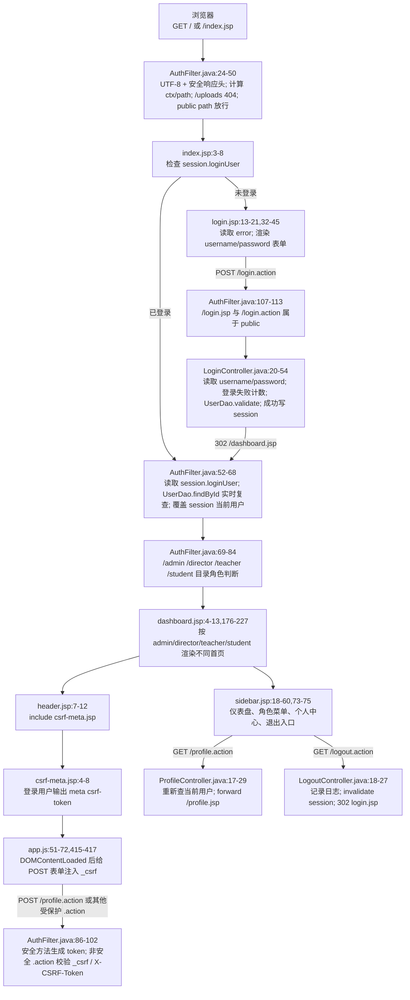

这条总链路里有三个核心状态：

1. **登录态**：服务端 session 中是否存在 `loginUser`。没有它，受保护 URL 会被 `AuthFilter` 302 到登录页。
2. **实时账号态**：即使 session 里有 `loginUser`，过滤器仍会用 `UserDao.findById` 重新查库，确认账号仍存在、启用且角色没有变化。
3. **CSRF 态**：session 中是否存在 `_csrf_token`，且本次非安全 `.action` 请求是否提交了相同值。没有或不一致，业务 Controller 不会执行。

## 3. 登录请求生命周期：从浏览器表单到 `request.getParameter`

### 3.1 登录页如何产生请求

`login.jsp` 中登录表单的关键点是：

- `request.getParameter("error")` 只读取 query 参数，目前显式映射 `1`、`locked`、`empty` 三种提示。
- `<form action="login.action" method="post">`：提交到当前应用上下文下的 `/login.action`。
- `<input type="text" name="username">`：用户名字段名是 `username`。
- `<input type="password" name="password">`：密码字段名是 `password`，`id="password"` 只给前端显示 / 隐藏密码按钮使用。
- 登录页没有 include `csrf-meta.jsp`，因为 `/login.action` 是 public path，并且 CSRF 规则也明确排除 `/login.action`。

用户点击“登录”后，浏览器默认编码为 `application/x-www-form-urlencoded`，请求体类似：

```text
username=admin&password=admin123
```

这里的 `&` 只是参数分隔符，不是密码的一部分；如果用户名或密码含特殊字符，浏览器会 URL encode 后再发送。后端调用 `request.getParameter("username")` 和 `request.getParameter("password")` 时，Servlet 容器会从 POST 表单体解析出对应参数。

### 3.2 登录 sequence

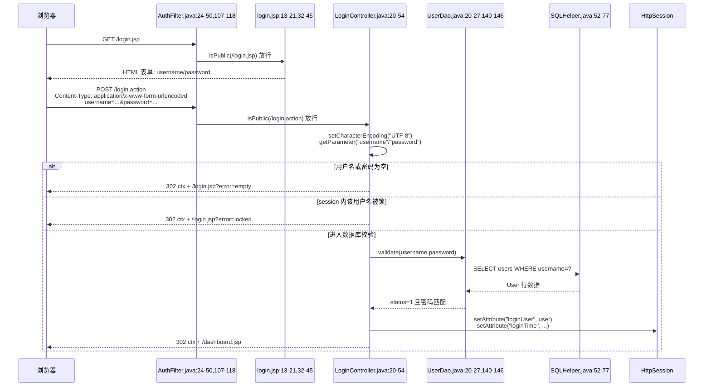

### 3.3 后端逐段解释

1. `LoginController` 的 Servlet 映射是 `/login.action`，所以登录页表单 POST 命中这个控制器。
2. 控制器先 `request.setCharacterEncoding("UTF-8")`，保证表单体中的中文用户名等内容按 UTF-8 解析。
3. `request.getParameter("username")` 和 `request.getParameter("password")` 读取的是登录页两个 input 的 `name` 字段，不是 label 文本，也不是 `id`。
4. 用户名或密码为空时，不进入数据库验证，直接 `WebUtil.redirect(request,response,"/login.jsp?error=empty")`。`WebUtil` 会给以 `/` 开头的 path 自动拼接 `ctx`。
5. 控制器在登录阶段调用 `request.getSession(true)`。这是合理的，因为失败次数、锁定状态、成功后的登录态都需要 session 承载。
6. `LoginAttemptUtil.isLocked(session, username)` 使用当前 session 判断该用户名是否被锁；锁定时 302 到 `login.jsp?error=locked`。
7. `UserDao.validate` 先按 username 查数据库用户，再要求 `status=1`，最后用密码工具匹配提交密码和库内密码摘要。
8. 认证成功后，控制器再次取完整 `User`，把 `password` 置空，然后放入 `session.setAttribute("loginUser", user)`。这样后续请求不必每次重新输入密码，只要浏览器带同一个 `JSESSIONID` Cookie，服务端就能从 session 找到登录用户。
9. 登录成功还写入 `loginTime`，清理失败计数，记录登录日志，然后 302 到 `/dashboard.jsp`。
10. 认证失败时记录失败次数，302 到 `/login.jsp?error=1`；登录页根据 query 参数显示“用户名或密码错误”。

### 3.4 为什么登录成功要放 session

HTTP 请求本身是无状态的。登录 POST 只发生一次；如果不把认证结果保存到 session，下一次访问 `dashboard.jsp` 时服务端无法知道这是刚登录过的浏览器。把去密码后的 `User` 放进 session 有三个作用：

- 后续鉴权统一读取 `session.loginUser`，不用每个 JSP / Controller 自己重新校验用户名密码。
- 页面可以从 `loginUser.role` 判断展示 admin、director、teacher、student 哪一套功能。
- 配合服务端 session 生命周期，退出时一次 `invalidate()` 就能清理登录态和 CSRF token。

## 4. 访问控制生命周期：`AuthFilter` 如何根据 path / role 放行或重定向

`AuthFilter` 标注 `@WebFilter("/*")`，说明它拦截应用内所有请求。它的处理顺序非常重要：

1. **统一编码和安全响应头**：先设置请求 / 响应 UTF-8，再给所有响应加安全头。
2. **计算路径**：取 `request.getRequestURI()` 和 `request.getContextPath()`，再截出应用内 `path`。
3. **隐藏上传直链**：如果 `path.startsWith("/uploads/")`，立即 404。
4. **公共路径放行**：根入口、登录页、登录动作、CSS、JS、错误页无需 session。
5. **登录态检查**：非 public path 必须有 `session.loginUser`；没有则 302 到 `ctx + "/login.jsp"`。
6. **账号实时复查**：根据 session 用户 id 重新查数据库。账号被删除、停用或角色变化时，清空 session 并 302 到 `login.jsp?error=account_changed`。当前 `login.jsp` 没有专门映射 `account_changed` 文案，所以跳转会发生，但页面不会像 `empty` / `locked` 那样显示定制提示。
7. **角色路径控制**：
   - `/admin/*` 只能 `admin` 访问。
   - `/director/*` 只能 `director` 访问。
   - `/teacher/*` 由 `RoleUtil.hasRole(user,"teacher")` 判断；`teacher` 本身可访问，`director` 也被视为拥有教师权限。
   - `/student/*` 只能 `student` 访问。
   - 角色不匹配不返回 403，而是 302 到 `dashboard.jsp`，让用户回到自己角色可访问的首页。
8. **公共登录后页面**：`/dashboard.jsp`、`/profile.action`、`/profile.jsp`、`/logout.action` 不属于 public，但也没有角色目录前缀；只要已登录且账号复查通过，各角色都能进入。
9. **安全方法生成 token**：GET / HEAD / OPTIONS 请求会确保 session 中已有 CSRF token。
10. **非安全 `.action` 校验 CSRF**：受保护 POST 等动作必须提交 token，验证通过才 `chain.doFilter` 进入后续 Servlet / JSP。

### 4.1 鉴权 / 角色 flowchart

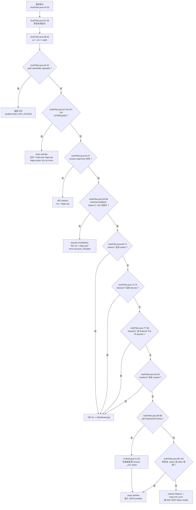

### 4.2 为什么要用统一 `AuthFilter`

如果每个 JSP 或 Controller 自己写登录检查，容易漏掉某个 URL，形成未授权访问。统一过滤器的好处是：

- 所有请求先过同一个入口，鉴权策略集中。
- 公共资源、登录页、角色路径、CSRF 校验顺序固定，减少重复代码。
- 安全响应头可在所有响应上一致生效，包括登录页和静态资源。
- 账号状态变化能在下一次请求立即生效：管理员停用某个用户或修改角色后，该用户 session 会被过滤器复查并失效。
- `/profile.action` 这类跨角色公共登录功能不用在多个角色目录下复制一份。

### 4.3 public path 为什么要放行

登录页和登录动作必须允许未登录访问，否则用户永远无法提交登录。CSS / JS 也必须放行，否则登录页虽然能打开，但样式、密码显示按钮、全局消息等前端功能加载失败。当前 public path 包括：

```text
/
/index.jsp
/login.jsp
/login.action
/css/*
/js/*
/error/*
```

注意：`/uploads/*` 虽然可能是静态文件路径，但过滤器在 public 判断之前先返回 404，因此它不是公共资源。

### 4.4 `index.jsp`、`dashboard.jsp` 与角色首页分工

`index.jsp` 不是业务主页，它只做入口跳转：

- session 中已有 `loginUser`：302 到 `dashboard.jsp`。
- 没有 `loginUser`：302 到 `login.jsp`。

`dashboard.jsp` 是登录后的角色首页。它直接从 `session.getAttribute("loginUser")` 取用户并读取 `role`。这依赖 `AuthFilter` 已经保证未登录请求不能进入该 JSP；否则 `loginUser.getRole()` 会空指针。

当前首页分支是：

- `admin` 与 `director` 进入同一个大分支。`director` 会先计算 `ScopeUtil.directorScope(loginUser)`；如果没有学院 / 专业管理范围，直接 `sendError(403,"director scope missing")`。
- `director` 首页统计教师、学生、课题、已选题人数时会限定在本学院 / 本专业，并显示“教师身份工作台”和“本专业管理功能”。
- `admin` 首页显示全局统计和完整管理入口。
- `teacher` 首页显示本人课题、待给建议选题、待审文档和可见公告。
- 其余分支按学生逻辑渲染选题、文档、公告、答辩安排。数据库角色应由用户管理保证在系统角色集合内。

### 4.5 当前角色路径设计原因

`director` 同时出现在 `/director/*` 和 `/teacher/*` 两类路径中，这是当前代码的关键变化：

- `/director/*` 表示“系主任本专业管理”能力，只允许 `director`。
- `/teacher/*` 表示“指导教师工作”能力，`RoleUtil` 明确允许 `director` 在需要 `teacher` 时通过。这样系主任既能审核本专业课题 / 选题，也能保留自己作为指导教师的课题、选题建议、文档审核等功能。
- `/admin/*` 仍然只给 `admin`，没有让 `director` 继承全局管理员权限。
- `/profile.action` 和 `/dashboard.jsp` 不绑定具体角色，因为它们是所有登录用户的共同入口。

## 5. 个人中心入口与资料修改流程

个人中心入口由公共布局提供，不在某个角色目录里：

- 左侧菜单固定输出 `<a href="ctx/profile.action">个人中心</a>`。
- 顶部用户信息区域也输出 `<a href="ctx/profile.action">个人中心</a>`。
- `profile.jsp` 本身要求 request 中已经有 `profileUser`；如果用户直接 GET `/profile.jsp`，JSP 会 302 到 `/profile.action`，让控制器重新查库并 forward。

### 5.1 profile 流程图

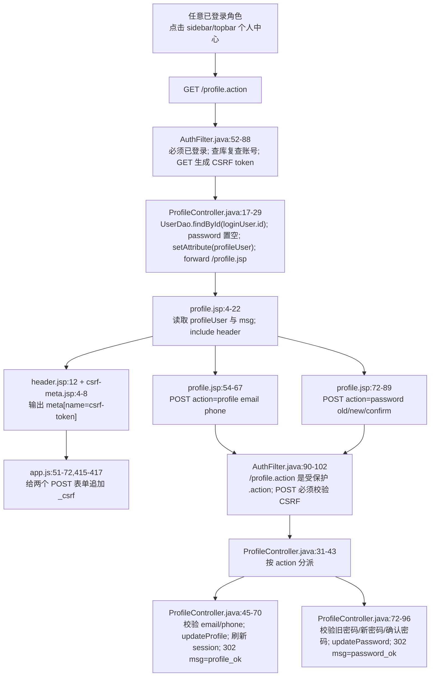

### 5.2 `ProfileController` 逐段解释

1. `@WebServlet("/profile.action")` 把个人中心控制器挂在应用根路径下，各角色共享。
2. GET 请求读取 `session.loginUser`，再用 `UserDao.findById(loginUser.getId())` 重新查当前账号。这样页面展示的是数据库最新资料，而不是旧 session 快照。
3. 如果查不到用户，说明账号状态异常，控制器主动 `session.invalidate()` 并跳到 `login.jsp?error=account_changed`。
4. 查到用户后，`profileUser.setPassword(null)`，再通过 request attribute 传给 JSP。这里使用 forward，不是 redirect，因此 JSP 能直接读取 `profileUser`。
5. POST 请求先设置 UTF-8，再读取隐藏字段 `action`。`action=profile` 走资料修改；`action=password` 走密码修改；其他值返回 `/profile.action`。
6. 资料修改只允许改 `email` 和 `phone`，并用 `ValidationUtil` 做格式校验；成功后重新 `findById`，置空密码并刷新 `session.loginUser`。
7. 密码修改先用 `UserDao.validatePassword` 校验旧密码，再检查新密码规则和两次输入是否一致，最后 `UserDao.updatePassword` 写入密码摘要。
8. 成功和失败都用 redirect 回 `/profile.action?...`，避免刷新页面重复提交表单。

### 5.3 为什么 `profile.jsp` 不直接查库

`profile.jsp` 当前只负责展示和提交表单；真正的数据读取、账号异常处理、密码字段清理由 `ProfileController` 完成。这样设计有三个原因：

- 控制器能集中处理“账号被删除或异常”的分支。
- JSP 只消费 `profileUser`，减少页面内数据库访问逻辑。
- 使用 forward 时，`profile.jsp` 可以区分“来自控制器的正常渲染”和“用户直接访问 JSP”。直接访问时没有 `profileUser`，页面会重定向回 `/profile.action` 补齐控制器流程。

## 6. CSRF 生命周期：GET 生成 token，POST 校验 token

### 6.1 token 在哪里生成

CSRF token 保存在 session 属性 `_csrf_token` 中。`CsrfUtil.getToken(session)` 的逻辑是：

1. session 为空则返回 `null`。
2. session 中已有 `_csrf_token` 就复用。
3. 没有则用 `UUID.randomUUID().toString().replace("-", "")` 生成一个无横杠随机字符串。
4. 写回 session。

`AuthFilter` 在 GET / HEAD / OPTIONS 这类安全方法上调用 `CsrfUtil.getToken(session)`，目的是让用户打开页面时就准备好后续 POST 需要的 token。之后公共 header include 的 `csrf-meta.jsp` 也会在登录用户存在时输出：

```html
<meta name="csrf-token" content="...">
```

前端 `app.js` 在 `DOMContentLoaded` 后读取这个 meta，并给所有 POST 表单补一个隐藏字段：

```html
<input type="hidden" name="_csrf" value="...">
```

对于 `multipart/form-data` 文件上传表单，脚本还会把 `_csrf` 同步追加到 action URL 的查询参数里。这是为了让过滤器阶段的 `request.getParameter("_csrf")` 更稳定地拿到 token；某些 multipart 请求在进入业务上传解析前，不适合依赖普通表单字段完成安全校验。

### 6.2 token 在哪里校验

`AuthFilter` 的 CSRF 条件是：

```text
非 GET/HEAD/OPTIONS
并且 path 以 .action 结尾
并且 path 不是 /login.action
```

满足这些条件时，过滤器调用 `CsrfUtil.validate(request)`。校验顺序：

1. 取现有 session；没有 session，失败。
2. 从 session 取 `_csrf_token`；没有或为空，失败。
3. 先读请求参数 `_csrf`。
4. 参数没有时，再读请求头 `X-CSRF-Token`。
5. 提交值与 session 中的 expected 完全相等才通过。

### 6.3 CSRF flowchart

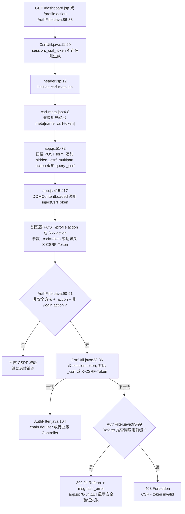

### 6.4 为什么 POST 要校验 CSRF

浏览器会自动携带同站点 session Cookie。如果用户已登录，攻击页面可能诱导浏览器向本系统发起 POST；没有 CSRF token 时，服务端只看到合法 Cookie，无法区分这是用户主动提交还是跨站伪造。把随机 token 存在 session，并要求页面表单或请求头提交同一个 token，可以证明请求来自本系统页面渲染出的上下文。

### 6.5 为什么 GET 生成 token 而不是 POST 时才生成

POST 到达过滤器时，业务操作已经准备执行，必须“校验已有 token”，不能临时生成一个再通过。GET 页面是用户正常进入表单的阶段，此时生成 token 并渲染到 meta，后续 POST 才有可提交的凭证。

### 6.6 当前退出接口的特殊点

`/logout.action` 使用 GET。按当前过滤器规则，GET 属于安全方法，不触发 CSRF 校验；但 `/logout.action` 不是 public path，所以仍要求已登录。请求到达 `LogoutController` 后：

1. `request.getSession(false)` 获取现有 session，不创建新 session。
2. 如果 session 里有 `loginUser`，记录退出日志。
3. `session.invalidate()` 清除登录态和 CSRF token。
4. 302 到 `/login.jsp`。

这解释了为什么退出后再访问 `dashboard.jsp` 会被过滤器重定向回登录页：原 session 已失效，新的请求找不到 `loginUser`。

## 7. 安全响应头、公共资源与数据库连接

`AuthFilter` 在判断 public path 之前就写安全响应头，因此登录页、CSS、JS、业务页、Controller 响应都会带这些头：

| Header | 当前值 / 作用 |
|---|---|
| `X-Content-Type-Options` | `nosniff`，要求浏览器不要把响应猜成其他 MIME 类型 |
| `X-Frame-Options` | `SAMEORIGIN`，限制页面只能被同源页面嵌入 frame |
| `X-XSS-Protection` | `1; mode=block`，兼容旧浏览器的 XSS 过滤开关 |
| `Strict-Transport-Security` | `max-age=31536000; includeSubDomains`，声明 HTTPS 访问策略；只有 HTTPS 下浏览器才会实际采纳 |
| `Content-Security-Policy` | 限制默认资源同源，允许 jsdelivr CDN、内联脚本 / 样式、`unsafe-eval`、data 图片等项目当前需要的资源 |

登录页自己引用 `css/app.css` 和 `js/app.js`。这两个路径在 `/css/`、`/js/` public 规则内，所以未登录时也能加载。页面还引用 jsdelivr 的 Bootstrap CSS / JS，这类请求直接发往 CDN 域名，不经过本应用的 `AuthFilter`。

数据库访问链路集中在 `UserDao` 与 `SQLHelper`：

- `UserDao.findByUsername`、`findById`、`validate`、`validatePassword`、`updateProfile`、`updatePassword` 都通过 `SQLHelper` 执行参数化 SQL。
- `SQLHelper` 静态初始化时从 classpath 读取 `jdbc.properties`，用 Druid 创建连接池。
- `queryList`、`queryScalar`、`executeUpdate`、`executeInsert` 都先 `prepareStatement`，再 `bindParams`，最后关闭 `ResultSet` / `PreparedStatement` / `Connection`。
- `jdbc.properties` 当前连接本机 MySQL `graduation_design` 库，设置 UTF-8、Asia/Shanghai、Druid 初始连接数、最大连接数、校验 SQL 和 stat filter。

## 8. redirect / forward 目的地汇总

| 触发条件 | 代码行为 | 浏览器下一跳 / 服务端结果 |
|---|---|---|
| `index.jsp` 发现已登录 | `response.sendRedirect("dashboard.jsp")` | GET `/dashboard.jsp` |
| `index.jsp` 发现未登录 | `response.sendRedirect("login.jsp")` | GET `/login.jsp` |
| GET `/login.action` | `WebUtil.redirect(..., "/login.jsp")` | GET `ctx + /login.jsp` |
| 登录参数为空 | `WebUtil.redirect(..., "/login.jsp?error=empty")` | GET `ctx + /login.jsp?error=empty` |
| 登录账号被锁 | `WebUtil.redirect(..., "/login.jsp?error=locked")` | GET `ctx + /login.jsp?error=locked` |
| 登录成功 | `WebUtil.redirect(..., "/dashboard.jsp")` | GET `ctx + /dashboard.jsp` |
| 登录失败 | `WebUtil.redirect(..., "/login.jsp?error=1")` | GET `ctx + /login.jsp?error=1` |
| 未登录访问受保护路径 | `response.sendRedirect(ctx + "/login.jsp")` | GET `ctx + /login.jsp` |
| session 用户被删除 / 停用 / 角色变化 | `session.invalidate(); response.sendRedirect(ctx + "/login.jsp?error=account_changed")` | GET 登录页并带错误码；当前登录页无专门文案 |
| 角色访问错目录 | `response.sendRedirect(ctx + "/dashboard.jsp")` | 回自己的仪表盘 |
| 直接 GET `/profile.jsp` 且无 `profileUser` | `response.sendRedirect(request.getContextPath() + "/profile.action")` | GET `ctx + /profile.action` |
| GET `/profile.action` 查不到当前用户 | `session.invalidate(); WebUtil.redirect(..., "/login.jsp?error=account_changed")` | GET 登录页并带错误码 |
| GET `/profile.action` 查到当前用户 | `request.getRequestDispatcher("/profile.jsp").forward(...)` | 服务端内部 forward 到 `/profile.jsp` |
| 修改资料成功 | `WebUtil.redirect(..., "/profile.action?msg=profile_ok")` | GET `ctx + /profile.action?msg=profile_ok` |
| 修改密码成功 | `WebUtil.redirect(..., "/profile.action?msg=password_ok")` | GET `ctx + /profile.action?msg=password_ok` |
| 个人中心 POST 校验失败 | 多个 `WebUtil.redirect(..., "/profile.action?msg=...")` | GET `ctx + /profile.action?msg=email_invalid` 等 |
| CSRF 失败且 Referer 是本应用 | `response.sendRedirect(appendMsg(referer,"csrf_error"))` | 回来源页，query 增加 `msg=csrf_error` |
| CSRF 失败且 Referer 不可信 | `sendError(403,"CSRF token invalid")` | 停止请求，显示 403 |
| 访问 `/uploads/*` | `sendError(404)` | 停止请求，显示 404 |
| 退出登录 | `session.invalidate(); WebUtil.redirect(..., "/login.jsp")` | GET `ctx + /login.jsp` |

## 9. 关键代码逐段解释

### 9.1 `login.jsp`

- `request.getParameter("error")` 读取 URL query 中的错误码，决定显示哪条登录失败提示；当前只处理 `1`、`locked`、`empty`。
- `<form action="login.action" method="post">` 决定浏览器向 `/login.action` 发 POST。
- `name="username"` / `name="password"` 决定后端 `getParameter` 的参数名。`id="password"` 只服务于前端“显示 / 隐藏密码”按钮，不参与后端取值。
- 登录页没有 include `csrf-meta.jsp`；这是符合当前后端规则的，因为 `/login.action` 是 public 并被 CSRF 校验排除。
- 登录页仍加载 `js/app.js`，用于 `togglePassword`、toast 等公共交互；由于没有 `meta[name="csrf-token"]`，`injectCsrfToken()` 会直接 return。

### 9.2 `LoginController`

- `@WebServlet("/login.action")` 把 `.action` URL 绑定到这个 Servlet。
- `setCharacterEncoding` 必须在 `getParameter` 之前调用，否则 POST 体里的非 ASCII 字符可能已经按错误编码解析。
- 空值检查在数据库访问前完成，避免无效请求消耗数据库连接。
- `request.getSession(true)` 在登录流程中合理：即使之前没有 session，登录成功也需要创建一个来保存状态；失败次数 / 锁定状态也依赖 session。
- `LoginAttemptUtil.isLocked` 在数据库校验前执行；锁定时直接返回 `error=locked`。
- `user.setPassword(null)` 是重要的安全处理，避免把密码摘要或密码字段放进登录成功时的 session。
- `session.setAttribute("loginUser", user)` 是整个后续鉴权链路的依据。
- 所有结果都用 redirect，不用 forward。这样登录成功或失败后的地址栏会变成目标页，刷新页面不会重复提交登录表单。

### 9.3 `AuthFilter`

- 安全响应头放在最前面，保证即使后面 public 放行、redirect 或错误响应也尽量带上统一安全策略。
- `path` 是去掉 `ctx` 的路径，用它做权限判断可以兼容不同部署上下文。
- `/uploads/` 先于 public 判断返回 404，说明上传文件不允许被当成普通静态目录直接访问。
- `isPublic` 只放行登录必需资源和错误页，不包含 dashboard、profile、logout、admin、director、teacher、student。
- session 中有 `loginUser` 还不够，过滤器会再查一次数据库确认账号仍存在、启用且角色未变化。
- 角色目录判断使用路径前缀：`/admin/`、`/director/`、`/teacher/`、`/student/`。不匹配时重定向到 dashboard，而不是让用户留在无权限 URL。
- `/teacher/` 路径使用 `RoleUtil.hasRole(user,"teacher")`，因此 `director` 继承教师功能；这与 dashboard / sidebar 中给 director 同时显示 teacher 工作台和 director 管理入口一致。
- CSRF 校验只发生在受保护的非安全 `.action` 请求上；普通 GET 页面不会被拦截，但会生成 token。

### 9.4 `CsrfUtil`、`csrf-meta.jsp`、`app.js`

- `CsrfUtil.TOKEN_ATTR="_csrf_token"` 是 session 内部保存名；`PARAM_NAME="_csrf"` 是浏览器提交名。
- `getToken` 是懒生成：第一次 GET 页面时创建，之后同一 session 复用。
- `validate` 同时支持参数 `_csrf` 和请求头 `X-CSRF-Token`。参数适合普通表单；请求头适合脚本请求。
- `csrf-meta.jsp` 只在 `loginUser != null` 时输出 token，避免未登录页面暴露无意义 token。
- `header.jsp` 在业务页 `<body>` 开始处 include `csrf-meta.jsp`，所以 dashboard、profile 以及角色业务页都能拿到 meta。
- `app.js` 不要求每个表单手写隐藏字段，而是在 DOM 加载后统一扫描 POST 表单并注入 `_csrf`。
- 对 `multipart/form-data`，`app.js` 额外把 `_csrf` 放入 action URL 的 searchParams，提升过滤器读取 token 的稳定性。
- `initPageMessages` 将 `msg=csrf_error` 显示为“安全验证失败，请刷新页面后重试”。

### 9.5 `ProfileController` 与 `profile.jsp`

- `profile.action` 是所有登录角色共享的个人中心控制器，不在角色目录中。
- GET 流程重新从数据库查当前用户，避免直接展示旧 session 数据。
- `profile.jsp` 对 `profileUser == null` 做兜底 redirect，避免用户绕开控制器直接访问 JSP 时出现空对象展示。
- 资料表单和密码表单都是 `method="post"`，都会被 `app.js` 自动注入 `_csrf`，并被 `AuthFilter` 按受保护 `.action` 校验。
- 修改资料成功后会刷新 `session.loginUser`，所以顶部显示的邮箱 / 电话等用户对象相关信息能跟数据库保持一致。
- 修改密码不会立即退出当前 session；它更新数据库密码后返回 `password_ok`，下一次登录使用新密码。

### 9.6 `UserDao`、`SQLHelper`、`jdbc.properties`

- `UserDao.findByUsername` 使用 `WHERE username=?`，参数通过 `SQLHelper` 绑定进 `PreparedStatement`，不是字符串拼接。
- `UserDao.validate` 要求用户存在且 `status=1`，再做密码匹配。
- `UserDao.validatePassword` 用于个人中心修改密码时校验旧密码。
- `UserDao.updateProfile` 只更新 `email` 和 `phone`；`updatePassword` 只更新密码摘要。
- `AuthFilter` 的账号复查使用 `UserDao.findById`，不是完全信任 session 中旧对象。
- `SQLHelper` 启动时从 classpath 读取 `jdbc.properties`，创建 Druid 数据源；查询时获取连接、prepare SQL、绑定参数、执行查询、最后关闭资源。
- `jdbc.properties` 当前指定 MySQL 驱动、本机 `graduation_design` 库、UTF-8 编码、Asia/Shanghai 时区和 Druid 连接池参数。

## 10. 代码证据清单

- `WebContent/login.jsp:13-21`
- `WebContent/login.jsp:32-45`
- `WebContent/login.jsp:46-56`
- `WebContent/index.jsp:3-8`
- `WebContent/dashboard.jsp:4-13`
- `WebContent/dashboard.jsp:14-19`
- `WebContent/dashboard.jsp:28-40`
- `WebContent/dashboard.jsp:47-60`
- `WebContent/dashboard.jsp:86-130`
- `WebContent/dashboard.jsp:153-156`
- `WebContent/dashboard.jsp:176-185`
- `WebContent/dashboard.jsp:227-236`
- `WebContent/dashboard.jsp:308-308`
- `WebContent/profile.jsp:4-10`
- `WebContent/profile.jsp:11-20`
- `WebContent/profile.jsp:22-24`
- `WebContent/profile.jsp:54-67`
- `WebContent/profile.jsp:72-89`
- `WebContent/profile.jsp:94-94`
- `WebContent/WEB-INF/includes/header.jsp:7-12`
- `WebContent/WEB-INF/includes/sidebar.jsp:18-29`
- `WebContent/WEB-INF/includes/sidebar.jsp:30-40`
- `WebContent/WEB-INF/includes/sidebar.jsp:41-60`
- `WebContent/WEB-INF/includes/sidebar.jsp:69-75`
- `WebContent/WEB-INF/includes/footer.jsp:17-18`
- `WebContent/WEB-INF/includes/csrf-meta.jsp:4-8`
- `WebContent/js/app.js:51-72`
- `WebContent/js/app.js:74-84`
- `WebContent/js/app.js:114-115`
- `WebContent/js/app.js:415-417`
- `src/controller/LoginController.java:16-18`
- `src/controller/LoginController.java:20-29`
- `src/controller/LoginController.java:31-38`
- `src/controller/LoginController.java:40-54`
- `src/controller/LoginController.java:57-60`
- `src/controller/LogoutController.java:14-18`
- `src/controller/LogoutController.java:19-27`
- `src/controller/ProfileController.java:15-20`
- `src/controller/ProfileController.java:21-29`
- `src/controller/ProfileController.java:31-43`
- `src/controller/ProfileController.java:45-70`
- `src/controller/ProfileController.java:72-96`
- `src/filter/AuthFilter.java:19-29`
- `src/filter/AuthFilter.java:31-40`
- `src/filter/AuthFilter.java:42-50`
- `src/filter/AuthFilter.java:52-68`
- `src/filter/AuthFilter.java:69-84`
- `src/filter/AuthFilter.java:86-104`
- `src/filter/AuthFilter.java:107-118`
- `src/filter/AuthFilter.java:120-128`
- `src/util/RoleUtil.java:5-18`
- `src/util/CsrfUtil.java:8-20`
- `src/util/CsrfUtil.java:23-36`
- `src/util/WebUtil.java:8-27`
- `src/dao/UserDao.java:16-27`
- `src/dao/UserDao.java:38-45`
- `src/dao/UserDao.java:140-154`
- `src/dao/UserDao.java:156-166`
- `src/dao/UserDao.java:281-307`
- `src/dbutil/SQLHelper.java:19-27`
- `src/dbutil/SQLHelper.java:30-49`
- `src/dbutil/SQLHelper.java:52-77`
- `src/dbutil/SQLHelper.java:79-94`
- `src/dbutil/SQLHelper.java:96-115`
- `src/dbutil/SQLHelper.java:117-143`
- `src/dbutil/SQLHelper.java:145-155`
- `src/jdbc.properties:2-18`


---

# 02. 选题浏览、申请、课题管理与审批的数据流

本部分只覆盖普通选题业务：学生浏览/申请选题、学生查看自己的申请记录、教师课题提交/编辑/删除、教师填写选题建议、专业负责人（director，页面文案为“系主任”）审核课题和确认/分配学生选题。不包含任何 AI 模块。

核心结论：当前代码已经把“教师建议”和“专业负责人终审”拆开。教师提交课题后默认进入 `topics.status='pending'`，只有 director 审核通过后才变成 `open`，学生端才可见；学生申请后进入 `topic_selections.status='pending'`，教师端只追加“建议通过/建议不通过”的 `review_comment`，不改终态、不占名额，最终由 director 确认为 `approved` 或 `rejected`。所有修改动作基本走 POST 后 redirect，再用 `msg` 查询参数表达结果，属于 PRG（Post/Redirect/Get）写法。

---

## 1. URL、方法、参数、开关与页面入口总览

| 使用者 | 业务动作 | URL | 方法 | 请求参数/表单字段 | 后端入口 | 最终视图/跳转 |
|---|---|---:|---:|---|---|---|
| 学生 | 浏览/搜索本专业开放课题 | `/student/topic.action` | GET | query：`keyword`；学院/专业不是请求参数，而是 session 中 `loginUser.college/major` | `StudentTopicController.doGet` | forward 到 `/student/topics.jsp` |
| 学生 | 提交选题申请 | `/student/topic.action` | POST | form：`action=apply`、`topicId`、`applyReason` | `StudentTopicController.doPost` | 成功 redirect `/student/my-selection.jsp?msg=apply_ok`；失败 redirect `/student/topic.action?msg=...` |
| 学生 | 查看我的选题 | `/student/my-selection.jsp` | GET | 无必需参数；`msg=apply_ok` 当前 JSP 不显示 | JSP 直接调用 `SelectionDao.findByStudent` | 直接渲染 JSP |
| 教师 | 查看自己提交的课题 | `/teacher/topic.action` | GET | 无 query；学院/专业来自 session | `TeacherTopicController.doGet` | forward 到 `/teacher/topics.jsp` |
| 教师 | 提交课题审核 | `/teacher/topic.action` | POST | form：`action=add`、`title`、`description`、`college`、`major`、`maxStudents` | `TeacherTopicController.doPost` | redirect `/teacher/topic.action?msg=add_ok/error/topic_submit_closed` |
| 教师 | 编辑并重提交课题 | `/teacher/topic.action` | POST | form：`action=edit`、`id`、`title`、`description`、`college`、`major`、`maxStudents` | `TeacherTopicController.doPost` | redirect `/teacher/topic.action?msg=edit_ok/error/invalid_quota/topic_submit_closed` |
| 教师 | 删除课题 | `/teacher/topic.action` | POST | form：`action=delete`、`id` | `TeacherTopicController.doPost` | redirect `/teacher/topic.action?msg=delete_ok/delete_failed` |
| 教师 | 查看学生选题申请并筛选 | `/teacher/selection.action` | GET | query：`status=pending/approved/rejected/all` | `TeacherSelectionController.doGet` | forward 到 `/teacher/selections.jsp` |
| 教师 | 填写选题建议 | `/teacher/selection.action` | POST | form：`action=approve/reject`、`id`、`reviewComment` | `TeacherSelectionController.doPost` | redirect `/teacher/selection.action?msg=suggest_ok` 或错误 msg |
| director | 本专业课题审核列表 | `/director/topic-review.action` | GET | query：`keyword`、`status`；学院/专业来自 director scope | `DirectorTopicReviewController.doGet` | forward 到 `/director/topic-review.jsp` |
| director | 调整本专业课题 | `/director/topic-review.action` | POST | form：`action=edit`、`id`、`title`、`description`、`maxStudents`、`reviewComment` | `DirectorTopicReviewController.doPost` | redirect `/director/topic-review.action?msg=edit_ok/invalid_quota/error` |
| director | 通过/驳回课题 | `/director/topic-review.action` | POST | form：`action=approve/reject`、`id`、`reviewComment` | `DirectorTopicReviewController.doPost` | redirect `/director/topic-review.action?msg=approved/rejected/error` |
| director | 本专业选题确认列表 | `/director/selection-confirm.action` | GET | query：`status=pending/approved/rejected/all`；学院/专业来自 director scope | `DirectorSelectionConfirmController.doGet` | forward 到 `/director/selection-confirm.jsp` |
| director | 确认/不确认学生选题 | `/director/selection-confirm.action` | POST | form：`action=confirm/reject`、`id`、`reviewComment` | `DirectorSelectionConfirmController.doPost` | redirect `/director/selection-confirm.action?msg=approved/rejected/quota_full/student_has_topic/error` |
| director | 手动分配未选题学生 | `/director/selection-confirm.action` | POST | form：`action=assign`、`studentId`、`topicId`、`reviewComment` | `DirectorSelectionConfirmController.doPost` | redirect `/director/selection-confirm.action?msg=assign_ok/quota_full/student_has_topic/error` |

### 1.1 当前状态值和含义

- 课题 `topics.status`：
  - `pending`：教师已提交，等待 director 审核。
  - `open`：director 审核通过，学生端可见且可申请。
  - `closed`：课题关闭或名额已满。`TopicDao.review` 和 `SelectionDao.incrementTopicSelected` 都会在满员边界把课题置为 `closed`。
  - `rejected`：director 驳回课题。
- 选题申请 `topic_selections.status`：
  - `pending`：学生已申请，等待 teacher 建议和 director 最终确认。
  - `approved`：director 已确认，正式占用课题名额。
  - `rejected`：director 未确认，学生后续可重新申请或被手动分配。
  - `cancelled`：数据库枚举保留值，当前本流程没有页面入口写入。
- `selected_count`：只在 director 确认通过或手动分配时递增。教师“建议通过”不递增。
- `major`：当前所有关键查询都按学院+专业限制。学生只能看/申请本人学院本人专业的开放课题；director 只能管理本人 `UserScope(college, major)` 范围内的课题和选题。

### 1.2 当前开关和范围限制

- `switch.selection`（兼容旧 `switch.selection_round1`）：控制学生是否可以提交选题申请。关闭时学生仍可浏览已开放课题，但按钮禁用，POST 也会被 Controller 和 DAO 双重拒绝。
- `switch.topic_submit`：控制教师是否可新增/编辑课题。关闭时教师页面禁用“提交课题审核/编辑并重提”，Controller 也会拒绝 add/edit。删除课题当前不受该开关阻断。
- `directorScopeText`：由 `ScopeUtil.scopeText` 按 director 的学院/专业生成，JSP 用它提示“当前系主任权限范围”。真正的安全边界不依赖提示文本，而是 Controller 和 DAO 中的 `college=? AND major=?` 条件。

---

## 2. 学生 GET 浏览/搜索课题

### 2.1 JSP 表单 name 与 Controller getParameter 对应

学生课题页当前只有 `keyword` 搜索输入，没有学院/专业下拉框。学院、专业由后端从 session 中的 `loginUser` 取出并清洗，页面只显示“仅显示本人专业：学院 / 专业”。

| JSP 表单/展示位置 | HTML 字段或展示 | 浏览器请求示例 | Controller 读取 | 实际含义 |
|---|---|---|---|---|
| `WebContent/student/topics.jsp:43-58` | `<input name="keyword">` | `/student/topic.action?keyword=网络` | `request.getParameter("keyword")` | 按标题/描述模糊搜索 |
| `WebContent/student/topics.jsp:48-51` | 无可提交字段，只显示学院/专业 | 无 | `ScopeUtil.clean(user.getCollege())`、`ScopeUtil.clean(user.getMajor())` | 强制限定为当前学生自己的学院和专业 |
| `WebContent/student/topics.jsp:60-62` | `selectionOpen` 警告 | 无 | `SystemSwitchUtil.isEnabled(SELECTION)` | 关闭时只浏览、不能申请 |

### 2.2 Mermaid：学生 GET 浏览课题数据流

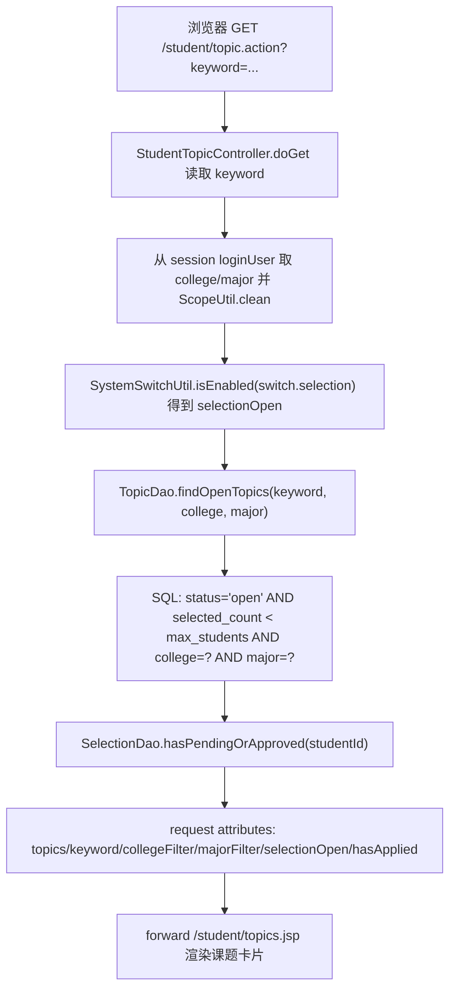

### 2.3 Controller 与 DAO 逻辑

`StudentTopicController.doGet` 的流程是：

1. 读取 query string 中的 `keyword`。
2. 从 session 取 `loginUser`，用 `ScopeUtil.clean` 清洗 `college` 和 `major`。这意味着学生不能通过 URL 改学院/专业过滤范围。
3. 调用 `SystemSwitchUtil.isEnabled(SystemSwitchUtil.SELECTION)`，结果写入 `selectionOpen`。
4. 调用 `TopicDao.findOpenTopics(keyword, college, major)`。这个 DAO 只返回 `status='open'` 且 `selected_count < max_students` 的课题，并继续追加 `t.college=?`、`t.major=?`。
5. 调用 `SelectionDao.hasPendingOrApproved(user.getId())` 判断学生是否已经有 `pending` 或 `approved` 选题。如果有，页面不再显示申请按钮。
6. forward 到 `/student/topics.jsp`。这里是服务端转发，不改变浏览器地址。

`TopicDao.findOpenTopics` 是普通查询，不开启事务。它使用 `SQLHelper.queryList` 创建 `PreparedStatement` 并绑定 `%keyword%`、`college`、`major`，避免把用户输入直接拼进 SQL 值位置。

---

## 3. 学生 POST 申请选题

### 3.1 JSP 表单 name 与 Controller getParameter 对应

学生点击课题卡片中的“申请选题”按钮后，前端 JS 把课题 id 写入 hidden input，再打开 modal。提交时浏览器发送 `application/x-www-form-urlencoded` POST 到 `/student/topic.action`。

| JSP 位置 | HTML/JS | POST 字段 | Controller 读取 | 含义 |
|---|---|---|---|---|
| `WebContent/student/topics.jsp:79-87` | 只有 `selectionOpen && !hasApplied && selected_count < maxStudents` 才显示按钮 | 无直接提交 | 无 | 前端层面减少无效提交 |
| `WebContent/student/topics.jsp:92-103` | `<form action="topic.action" method="post">` | `action=apply` | `request.getParameter("action")` | 进入学生申请分支 |
| `WebContent/student/topics.jsp:92-103` | `<input type="hidden" name="topicId" id="applyTopicId">` | `topicId` | `Integer.parseInt(request.getParameter("topicId"))` | 被申请课题 id |
| `WebContent/student/topics.jsp:92-103` | `<textarea name="applyReason">` | `applyReason` | `request.getParameter("applyReason")` | 申请理由 |
| `WebContent/student/topics.jsp:107-112` | `applyTopic(id,title)` | 写入 `applyTopicId` | POST 后读取 | 把按钮所在课题绑定到 modal |

hidden input 不能作为安全边界。后端仍然重新校验：开关、用户角色、学生是否已有活跃申请、课题是否开放/有名额、学生和课题是否同学院同专业。

### 3.2 Mermaid：学生 POST apply 数据流

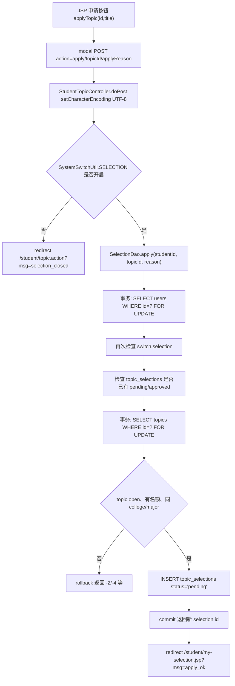

### 3.3 redirect msg 和业务返回值

`SelectionDao.apply` 的返回值在 Controller 中映射为：

| DAO 返回值 | 业务含义 | redirect |
|---:|---|---|
| `-1` | 学生已有 `pending` 或 `approved` 申请 | `/student/topic.action?msg=already_applied` |
| `-2` | 课题不存在、非 `open` 或名额已满 | `/student/topic.action?msg=quota_full` |
| `-3` | 学生选题开关已关闭 | `/student/topic.action?msg=selection_closed` |
| `-4` | 学生学院/专业与课题学院/专业不一致 | `/student/topic.action?msg=major_mismatch` |
| `<=0` | 其他失败 | `/student/topic.action?msg=error` |
| `>0` | 插入 `topic_selections` 成功 | `/student/my-selection.jsp?msg=apply_ok` |

`student/topics.jsp` 当前会显示 `already_applied`、`quota_full`、`selection_closed`、`major_mismatch` 四类提示；`error` 没有专门映射。`my-selection.jsp` 不解析 `apply_ok`，只展示申请记录。

### 3.4 事务、并发和 SQL

申请选题涉及“一个学生只能有一个活跃选题”和“课题容量不能超额”，所以 `SelectionDao.apply` 手工管理事务：

1. `SQLHelper.getConnection()` 取同一个连接，`conn.setAutoCommit(false)` 开启事务。
2. `SELECT role,status,college,major FROM users WHERE id=? FOR UPDATE` 锁住学生行，并确认用户是启用状态的学生。
3. 再次检查 `SystemSwitchUtil.SELECTION`。即使 Controller 通过后管理员瞬间关停，DAO 也会 rollback。
4. `SELECT 1 FROM topic_selections WHERE student_id=? AND status IN ('pending','approved') LIMIT 1` 检查活跃申请。
5. `SELECT status,max_students,selected_count,college,major FROM topics WHERE id=? FOR UPDATE` 锁住课题行，检查 `open`、名额和专业范围。
6. `INSERT INTO topic_selections(student_id,topic_id,status,apply_reason) VALUES(?,?,'pending',?)` 创建待确认申请。
7. `commit`；异常时 rollback，finally 中恢复 `autoCommit` 并关闭连接。

数据库表还定义了 `active_guard` 生成列和 `UNIQUE KEY uk_student_active_selection(student_id, active_guard)`，对 `pending/approved` 活跃申请做第二道唯一性约束。即使应用层并发校验失效，数据库也能阻断同一学生同时拥有多个活跃选题。

---

## 4. 学生查看“我的选题”

学生申请成功后跳转到 `/student/my-selection.jsp?msg=apply_ok`。这个 JSP 不经过 Controller：

1. 从 session 取 `loginUser`。
2. `new SelectionDao().findByStudent(loginUser.getId())`。
3. DAO 使用 `SELECT_SQL + "WHERE s.student_id=? ORDER BY s.apply_time DESC"` 查询该学生所有申请。
4. 页面展示课题、指导教师、申请理由、申请时间、状态、审批意见。

这里的状态含义要按当前两级流程理解：`pending` 可能已经有教师建议，但仍等待 director 终审；`approved` 才是 director 最终确认；`rejected` 是未确认或被驳回。

---

## 5. 教师 GET 查看自己提交的课题

教师进入 `/teacher/topic.action` 时，Controller 从 session 取教师用户并准备以下 request attributes：

- `topics`：`TopicDao.findByTeacher(user.getId())`，只查当前教师自己的课题。
- `teacherCollege` / `teacherCollegeName`：教师所属学院代码和展示名。
- `teacherMajor`：教师自己的专业代码，用于专业下拉默认值。
- `majorOptions`：`CollegeUtil.getMajorsByCollege(teacherCollege)`，教师提交课题时只能选择本学院专业列表中的专业。
- `topicSubmitOpen`：`SystemSwitchUtil.isEnabled(SystemSwitchUtil.TOPIC_SUBMIT)`，控制新增/编辑入口。

JSP 如果直接访问导致 `topics == null`，会 redirect 回 `/teacher/topic.action`，保证页面数据由 Controller 统一准备。

---

## 6. 教师 POST 提交、编辑、删除课题

### 6.1 JSP 表单 name 与 Controller getParameter 对应

| 操作 | JSP 位置 | POST 字段 | Controller 读取/设置 | 当前业务含义 |
|---|---|---|---|---|
| 提交 | `WebContent/teacher/topics.jsp:84-110` | `action=add` | `request.getParameter("action")` | 进入 add 分支 |
| 提交 | `WebContent/teacher/topics.jsp:90-91` | `title`、`description` | `request.getParameter("title/description")` | 课题名称与描述 |
| 提交 | `WebContent/teacher/topics.jsp:93-96` | `college` hidden | `resolveCollege(user, request)` | 优先用教师 session 中的学院，不信任表单覆盖 |
| 提交 | `WebContent/teacher/topics.jsp:97-105` | `maxStudents`、`major` | `Integer.parseInt(...)`、`resolveMajor(...)` | 最大人数和所属专业 |
| 编辑 | `WebContent/teacher/topics.jsp:114-141` | `action=edit`、`id`、`title`、`description`、`college`、`maxStudents`、`major` | 同名 `getParameter` | 编辑后重新进入 `pending` |
| 删除 | `WebContent/teacher/topics.jsp:73-78` | `action=delete`、`id` | `request.getParameter("id")` | 按当前教师 id 删除自己的课题 |

当前教师表单不再提交 `status`。新增和编辑都由 Controller 强制 `t.setStatus("pending")`，等待 director 审核。

### 6.2 Mermaid：教师 topic add/edit/delete 数据流

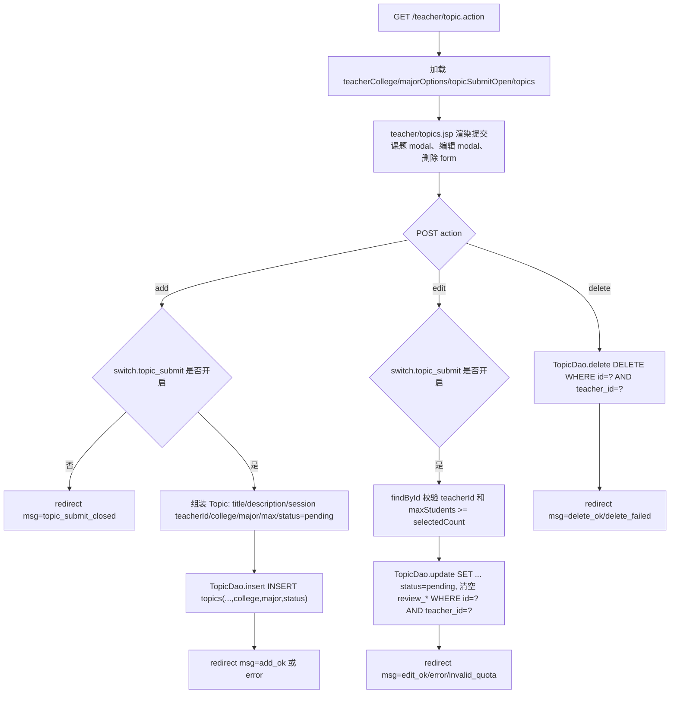

### 6.3 新增课题逻辑

新增分支的关键点：

- `switch.topic_submit` 关闭时，直接 redirect `topic_submit_closed`。
- `teacherId` 来自 session 的 `loginUser.getId()`，不是表单字段。
- `college` 优先来自 session 中的教师学院；只有教师没有学院时才退回表单 `college`。
- `major` 必须存在于 `CollegeUtil.getMajorsByCollege(college)`。如果表单传了非法专业，Controller 会退回教师自己的专业；再不行才取本学院第一个专业。
- `status` 固定为 `pending`，说明教师只是提交审核，不是直接开放给学生。
- DAO SQL：

```sql
INSERT INTO topics(title,description,teacher_id,college,major,max_students,status)
VALUES(?,?,?,?,?,?,?)
```

### 6.4 编辑课题逻辑

编辑分支的关键点：

1. `switch.topic_submit` 关闭时拒绝编辑。
2. `id` 来自 hidden input，但 Controller 先 `TopicDao.findById(id)` 查真实课题。
3. 如果课题不存在、不是当前教师所有，或新 `maxStudents` 小于当前 `selected_count`，redirect `invalid_quota`。
4. 保存时强制 `status='pending'`，并通过 `TopicDao.update` 清空 `review_comment/reviewer_id/review_time`，表示“重新提交审核”。
5. DAO SQL 带 `WHERE id=? AND teacher_id=?`，即使浏览器篡改 hidden `id`，也不能改别的教师的课题。

核心 SQL：

```sql
UPDATE topics
SET title=?,description=?,college=?,major=?,max_students=?,status=?,
    review_comment=NULL,reviewer_id=NULL,review_time=NULL
WHERE id=? AND teacher_id=?
```

### 6.5 删除课题逻辑

删除分支只提交 `action=delete` 和 `id`。Controller 使用 session 中的教师 id 调用：

```sql
DELETE FROM topics WHERE id=? AND teacher_id=?
```

所以教师只能删除自己的课题。当前删除不受 `switch.topic_submit` 限制；如果该课题已有选题申请，是否删除成功取决于数据库外键约束。`SQLHelper.executeUpdate` 捕获异常后返回 0，Controller 映射为 `delete_failed`。

### 6.6 教师课题管理 redirect msg

`teacher/topics.jsp` 当前显示：

- `add_ok`：课题已提交审核。
- `edit_ok`：课题已修改并重新进入待审核。
- `delete_ok`：课题删除成功。
- `delete_failed`：删除课题失败。
- `topic_submit_closed`：管理员已关闭教师出题入口。

Controller 还可能 redirect `error`、`invalid_quota`，当前 JSP 未给这两个结果码单独渲染 alert。

---

## 7. 教师 GET 查看选题申请和 POST 填写建议

### 7.1 GET 筛选

教师审批页文案已经调整为“选题建议”。GET 请求参数是 `status`：

| JSP 链接 | URL | Controller 读取 | DAO 查询 |
|---|---|---|---|
| 待给建议 | `selection.action?status=pending` | `request.getParameter("status")` | `WHERE t.teacher_id=? AND s.status='pending'` |
| 已由系主任确认 | `selection.action?status=approved` | 同上 | `WHERE t.teacher_id=? AND s.status='approved'` |
| 已驳回 | `selection.action?status=rejected` | 同上 | `WHERE t.teacher_id=? AND s.status='rejected'` |
| 全部 | `selection.action?status=all` | 同上，Controller 转成 `null` | 只保留 `WHERE t.teacher_id=?` |

如果没有 `status`，Controller 默认 `pending`。

### 7.2 POST 表单 name 与 getParameter 对应

| JSP 位置 | HTML/JS | POST 字段 | Controller 读取 | 含义 |
|---|---|---|---|---|
| `WebContent/teacher/selections.jsp:39-45` | 只有 `pending` 行显示按钮 | 无直接提交 | 无 | 非 pending 只显示已有意见 |
| `WebContent/teacher/selections.jsp:53-64` | hidden `reviewAction/reviewId` | `action`、`id` | `request.getParameter("action/id")` | `approve` 或 `reject`，申请 id |
| `WebContent/teacher/selections.jsp:60-61` | `<textarea name="reviewComment">` | `reviewComment` | `request.getParameter("reviewComment")` | 教师建议 |
| `WebContent/teacher/selections.jsp:68-74` | `reviewSel(id, action, name)` | 写入 hidden | POST 后读取 | 把按钮动作和申请 id 放入 modal |

### 7.3 Mermaid：教师 selection review 数据流

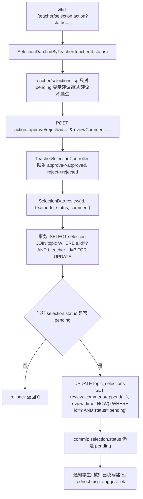

### 7.4 当前教师建议不是终审

旧文档里把教师 `approve/reject` 解释为直接批准/驳回并占用名额；当前代码不是这样。

- Controller 仍把按钮动作映射成字符串 `approved/rejected`，但 DAO 只用这个字符串选择“指导教师建议通过/指导教师建议退回”的评论标签。
- `SelectionDao.review` 不更新 `s.status`，只更新 `review_comment` 和 `review_time`。
- 不读取或更新 `topics.selected_count`。
- redirect 成功结果统一是 `msg=suggest_ok`。
- 因为状态仍是 `pending`，该申请仍会留在 director 的“待确认”列表中。

并发上，教师建议也使用事务和 `FOR UPDATE` 锁住对应申请行，避免多个教师页面同时覆盖同一条 `review_comment`。但它不处理名额竞争；名额竞争留到 director 确认阶段处理。

---

## 8. director GET/POST 本专业课题审核

### 8.1 GET 筛选和 scope

director 进入 `/director/topic-review.action` 时，Controller 调用 `ScopeUtil.directorScope(user)`。只有 `role='director'` 且用户配置了非空 `college`、`major`，才会得到有效 scope；否则返回 403。

GET 参数：

| JSP 位置 | HTML 字段 | Controller 读取 | DAO 限制 |
|---|---|---|---|
| `WebContent/director/topic-review.jsp:37-47` | `keyword` | `request.getParameter("keyword")` | `title/description LIKE ?` |
| `WebContent/director/topic-review.jsp:37-47` | `status` | `request.getParameter("status")` | 非 `all` 时追加 `t.status=?` |
| `WebContent/director/topic-review.jsp:33-35` | 无字段，展示 `directorScopeText` | `ScopeUtil.scopeText(scope)` | DAO 固定 `t.college=? AND t.major=?` |

`status` 缺省为 `pending`；如果传空字符串，则 Controller 转成 `all`。

### 8.2 POST 表单 name 与 getParameter 对应

| 操作 | JSP 位置 | POST 字段 | Controller 读取 | DAO 动作 |
|---|---|---|---|---|
| 调整课题 | `WebContent/director/topic-review.jsp:78-91` | `action=edit`、`id`、`title`、`description`、`maxStudents`、`reviewComment` | 同名 `getParameter` | `TopicDao.updateByDirector` |
| 通过课题 | `WebContent/director/topic-review.jsp:95-106` | `action=approve`、`id`、`reviewComment` | `action` 映射为 `status='open'` | `TopicDao.review` |
| 驳回课题 | `WebContent/director/topic-review.jsp:95-106` | `action=reject`、`id`、`reviewComment` | `action` 映射为 `status='rejected'` | `TopicDao.review` |
| JS 写值 | `WebContent/director/topic-review.jsp:110-123` | hidden `reviewAction/reviewId` 或 `editId` | POST 后读取 | 打开 modal 前绑定具体课题 |

### 8.3 Mermaid：director topic review 数据流

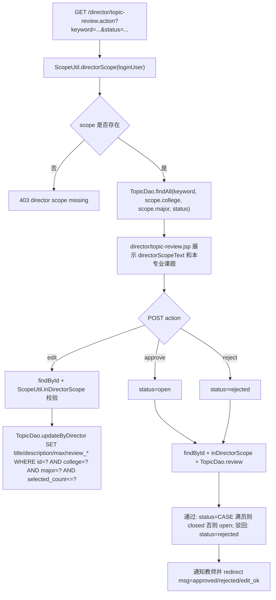

### 8.4 director 调整课题

director 的“调整”不是教师编辑，不改变 `college/major/teacher_id/status`。它只允许在本人 scope 内修改：

- `title`
- `description`
- `max_students`
- `review_comment`
- `reviewer_id`
- `review_time`

Controller 先 `TopicDao.findById(id)`，再 `ScopeUtil.inDirectorScope(user, current)`。DAO SQL 还带 `WHERE id=? AND college=? AND major=? AND selected_count<=?`，防止越权和把最大人数调到已选人数以下。

### 8.5 director 通过/驳回课题

director 点击“通过”时，Controller 把 `action=approve` 映射为 `status='open'`；点击“驳回”映射为 `status='rejected'`。

`TopicDao.review` 的行为：

- 通过：`UPDATE topics SET status=CASE WHEN selected_count>=max_students THEN 'closed' ELSE 'open' END, review_comment=?, reviewer_id=?, review_time=NOW() WHERE id=? AND status IN (...)`。即使 director 点击通过，如果课题已经满员，也会落成 `closed`。
- 驳回：`UPDATE topics SET status='rejected', review_comment=?, reviewer_id=?, review_time=NOW() WHERE id=? AND status IN (...)`。

成功后给教师发送站内通知，并记录操作日志。当前 `director/topic-review.jsp` 没有像教师/学生页那样解析 `msg` 渲染 alert；结果主要体现在列表状态变化。

---

## 9. director GET/POST 本专业选题确认与手动分配

### 9.1 GET 列表数据

director 进入 `/director/selection-confirm.action` 时，同样先取 `ScopeUtil.directorScope(user)`。有效 scope 后一次准备三组数据：

- `selections`：`SelectionDao.findByDirectorScope(scope.college, scope.major, status)`，要求课题和学生都在同一学院/专业范围内。
- `unselectedStudents`：`SelectionDao.findUnselectedStudents(scope.college, scope.major)`，查询本专业启用学生中没有 `pending/approved` 活跃选题的人。
- `availableTopics`：`TopicDao.findOpenTopics(null, scope.college, scope.major)`，只取本专业 `open` 且未满员课题。
- `directorScopeText`：页面提示当前专业负责人范围。

状态筛选链接和教师页类似：`pending` 待确认、`approved` 已确认、`rejected` 未确认、`all` 全部；缺省为 `pending`。

### 9.2 POST 表单 name 与 getParameter 对应

| 操作 | JSP 位置 | POST 字段 | Controller 读取 | DAO 动作 |
|---|---|---|---|---|
| 确认对应 | `WebContent/director/selection-confirm.jsp:110-121` | `action=confirm`、`id`、`reviewComment` | `request.getParameter("action/id/reviewComment")` | `SelectionDao.confirmByDirector` |
| 不确认 | `WebContent/director/selection-confirm.jsp:110-121` | `action=reject`、`id`、`reviewComment` | 同上 | `SelectionDao.rejectByDirector` |
| JS 写值 | `WebContent/director/selection-confirm.jsp:125-131` | hidden `reviewAction/reviewId` | POST 后读取 | 按按钮绑定 selection id |
| 手动分配 | `WebContent/director/selection-confirm.jsp:79-106` | `action=assign`、`studentId`、`topicId`、`reviewComment` | `request.getParameter("studentId/topicId/reviewComment")` | `SelectionDao.manualAssign` |

### 9.3 Mermaid：director selection confirm/assign 数据流

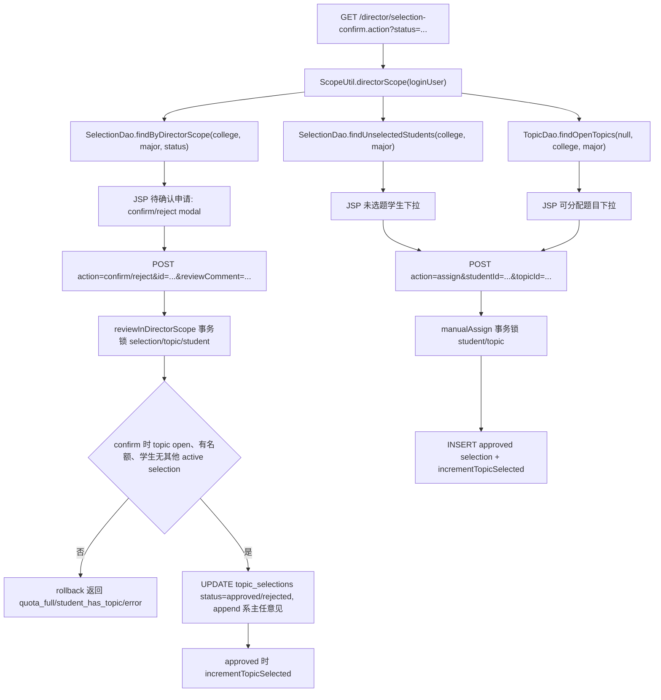

### 9.4 director 确认/不确认的事务

`confirmByDirector` 和 `rejectByDirector` 都调用 `reviewInDirectorScope`，区别只是目标状态：

- `confirm` -> `approved`
- `reject` -> `rejected`

事务步骤：

1. `SELECT ... FROM topic_selections s JOIN topics t JOIN users u WHERE s.id=? AND t.college=? AND t.major=? AND u.college=? AND u.major=? FOR UPDATE`。这一步同时锁住申请相关行，并验证学生和课题都在 director 本专业范围内。
2. 当前 `s.status` 必须是 `pending`；否则 rollback。
3. `SELECT id FROM users WHERE id=? FOR UPDATE` 锁学生行，使同一学生相关确认串行化。
4. 如果目标是 `approved`，检查：
   - 课题状态必须是 `open`。
   - `selected_count < max_students`。
   - 学生没有除当前申请外的其他 `pending/approved` 活跃选题。
5. `UPDATE topic_selections SET status=?, review_comment=?, review_time=NOW() WHERE id=? AND status='pending'`。`review_comment` 会在原教师建议后追加“系主任意见”。
6. 如果目标是 `approved`，调用 `incrementTopicSelected`：`selected_count=selected_count+1`，并在达到 `max_students` 时把课题状态置为 `closed`。
7. commit；异常或任何校验失败 rollback。

这才是真正决定学生选题终态和课题人数的位置。

### 9.5 director 手动分配的事务

手动分配用于第二轮后仍未选题的学生。它不依赖学生先提交申请，而是直接插入一条 `approved` 记录：

1. `SELECT id FROM users WHERE id=? AND role='student' AND status=1 AND college=? AND major=? FOR UPDATE`，确认学生在 director 本专业 scope 内。
2. `hasActiveSelection(conn, studentId, 0)` 检查学生没有 `pending/approved` 活跃选题。
3. `SELECT status,max_students,selected_count FROM topics WHERE id=? AND college=? AND major=? FOR UPDATE`，确认课题在本专业、`open` 且未满员。
4. `INSERT INTO topic_selections(student_id,topic_id,status,apply_reason,review_comment,review_time) VALUES(?,?,'approved','系主任手动分配',?,NOW())`。
5. 调用 `incrementTopicSelected` 增加课题已选人数，满员时自动关闭课题。
6. commit；失败 rollback。

成功后 Controller 给学生发送“选题分配结果”通知，记录操作日志，redirect `msg=assign_ok`。

---

## 10. 普通 SQL、事务 SQL 与 SQLHelper 边界

### 10.1 普通 SQL：TopicDao

`TopicDao.findAll/findByTeacher/findOpenTopics/findById` 使用 `SQLHelper.queryList`，`insert` 使用 `SQLHelper.executeInsert`，`update/updateByDirector/review/delete` 使用 `SQLHelper.executeUpdate`。这些都是单条 SQL，依赖 JDBC 默认自动提交。

普通 SQL 的特点：

- 每次调用都从 Druid 连接池取一个连接。
- 用 `PreparedStatement` 绑定参数。
- finally 中关闭 ResultSet/PreparedStatement/Connection。
- 出错时打印 SQL 错误并返回空列表、0 或 null。

### 10.2 事务 SQL：SelectionDao

`SelectionDao.apply`、`review`、`reviewInDirectorScope`、`manualAssign` 都必须共享同一个 `Connection`，所以不能用 `SQLHelper.queryList/executeUpdate` 分散执行，而是：

- `SQLHelper.getConnection()`
- `conn.setAutoCommit(false)`
- 多条 `PreparedStatement`
- 关键行 `FOR UPDATE`
- 成功 `commit`
- 失败 `rollback`
- finally 中 `conn.setAutoCommit(true)` 并关闭连接

### 10.3 WebUtil.redirect

Controller 中大多数 redirect 传入以 `/` 开头的应用内路径。`WebUtil.redirect` 会自动拼接 `request.getContextPath()`，再 `response.sendRedirect(...)`。因此项目部署在非根路径时，`/student/topic.action`、`/teacher/topic.action`、`/director/...` 仍能跳回同一个 Web 应用。

---

## 11. 设计原因总结

1. **GET 只读，POST 改状态**：浏览、筛选、列表页都用 GET；申请、提交课题、编辑、删除、建议、确认、分配都用 POST。
2. **POST 后 redirect**：避免刷新浏览器重复提交表单。
3. **学生范围由 session 决定**：学生不能通过 URL 或 hidden 字段选择别的学院/专业。
4. **教师只能直接管理自己的课题**：`teacherId` 从 session 取，update/delete SQL 都带 `teacher_id=?`。
5. **教师建议不是终审**：教师只写 `review_comment`，不改变 `topic_selections.status`，不递增 `selected_count`。
6. **director 是专业范围终审**：director scope 必须同时匹配课题和学生的 `college/major`。
7. **名额竞争只在最终确认/分配时处理**：director 确认和手动分配都会锁学生、锁课题、检查 active selection、递增 `selected_count`。
8. **开关前后端双重控制**：JSP 负责禁用按钮和提示，Controller/DAO 负责真实拒绝。
9. **数据库约束兜底**：`active_guard` 唯一索引让同一学生不能同时拥有多个 `pending/approved` 活跃选题。

---

## 12. 代码证据清单

- `WebContent/student/topics.jsp:8-23`：学生课题页读取 `topics/keyword/collegeFilter/majorFilter/hasApplied/selectionOpen`，缺少 Controller 数据时 redirect。
- `WebContent/student/topics.jsp:25-31`：学生端 `already_applied/quota_full/selection_closed/major_mismatch` 提示映射。
- `WebContent/student/topics.jsp:43-58`：学生 GET 搜索表单当前只有 `keyword`，学院/专业以只读文本展示。
- `WebContent/student/topics.jsp:60-62`：`selectionOpen=false` 时显示“只能浏览不能申请”提示。
- `WebContent/student/topics.jsp:64-89`：课题卡片展示学院/专业/教师/名额，并根据开关、已有申请和名额决定按钮。
- `WebContent/student/topics.jsp:92-103`：学生申请 modal POST 表单，字段 `action=apply`、`topicId`、`applyReason`。
- `WebContent/student/topics.jsp:107-112`：`applyTopic` JS 写入 hidden `topicId` 并打开 modal。
- `WebContent/student/my-selection.jsp:5-8`：学生“我的选题”直接从 session 取用户并调用 `SelectionDao.findByStudent`。
- `WebContent/student/my-selection.jsp:22-34`：学生选题记录表格展示课题、教师、理由、时间、状态、审批意见。
- `WebContent/teacher/topics.jsp:7-23`：教师课题页依赖 Controller 注入 `topics/majorOptions/teacherCollege/topicSubmitOpen`。
- `WebContent/teacher/topics.jsp:25-33`：教师课题页 `add_ok/edit_ok/delete_ok/delete_failed/topic_submit_closed` 提示映射。
- `WebContent/teacher/topics.jsp:45-50`：教师出题开关关闭时提示，并禁用提交课题按钮。
- `WebContent/teacher/topics.jsp:53-80`：教师课题卡片展示状态、审核意见、编辑按钮、删除 POST 表单。
- `WebContent/teacher/topics.jsp:84-110`：教师新增课题 POST 表单，字段 `action/title/description/college/maxStudents/major`。
- `WebContent/teacher/topics.jsp:114-141`：教师编辑并重提 POST 表单，字段 `action/id/title/description/college/maxStudents/major`。
- `WebContent/teacher/topics.jsp:145-153`：`editTopic` JS 把课题当前值写入编辑 modal。
- `WebContent/teacher/selections.jsp:6-12`：教师选题建议页读取 `statusFilter/selections`，缺少数据时 redirect。
- `WebContent/teacher/selections.jsp:18-23`：教师 GET 状态筛选链接 `pending/approved/rejected/all`。
- `WebContent/teacher/selections.jsp:39-45`：只有 `pending` 申请显示“建议通过/建议不通过”，非 pending 显示意见。
- `WebContent/teacher/selections.jsp:53-64`：教师建议 POST 表单，字段 `action/id/reviewComment`。
- `WebContent/teacher/selections.jsp:68-74`：`reviewSel` JS 写入 hidden `reviewId/reviewAction`。
- `WebContent/director/topic-review.jsp:6-18`：director 课题审核页读取 `topics/keyword/statusFilter/topicStatusOptions/directorScopeText`。
- `WebContent/director/topic-review.jsp:33-47`：director scope 提示和 GET 查询表单 `keyword/status`。
- `WebContent/director/topic-review.jsp:50-75`：director 本专业课题表格及“调整/通过/驳回”操作按钮。
- `WebContent/director/topic-review.jsp:78-91`：director 调整课题 POST 表单，字段 `action=edit/id/title/description/maxStudents/reviewComment`。
- `WebContent/director/topic-review.jsp:95-106`：director 课题审核 POST 表单，字段 `action/id/reviewComment`。
- `WebContent/director/topic-review.jsp:110-123`：director 审核/调整 JS 写入 hidden 字段并打开 modal。
- `WebContent/director/selection-confirm.jsp:6-17`：director 选题确认页读取 `selections/unselectedStudents/availableTopics/statusFilter/directorScopeText`。
- `WebContent/director/selection-confirm.jsp:23-31`：director scope 提示和选题确认状态筛选链接。
- `WebContent/director/selection-confirm.jsp:39-67`：director 选题申请表格，`pending` 行显示确认/不确认按钮。
- `WebContent/director/selection-confirm.jsp:69-107`：未选题学生手动分配表单，字段 `action=assign/studentId/topicId/reviewComment`。
- `WebContent/director/selection-confirm.jsp:110-121`：director 确认/不确认 POST 表单，字段 `action/id/reviewComment`。
- `WebContent/director/selection-confirm.jsp:125-131`：`reviewSelection` JS 写入 hidden `reviewId/reviewAction`。
- `src/controller/StudentTopicController.java:23-39`：学生 GET 读取 `keyword`，用 session 学院/专业查开放课题，设置 `selectionOpen/hasApplied` 并 forward。
- `src/controller/StudentTopicController.java:42-83`：学生 POST `apply` 分支检查选题开关，读取 `topicId/applyReason`，按 DAO 返回值 redirect。
- `src/controller/TeacherTopicController.java:24-39`：教师 GET 查询本人课题，设置学院、专业选项、题目提交开关并 forward。
- `src/controller/TeacherTopicController.java:50-68`：教师 add 分支检查 `TOPIC_SUBMIT`，组装 `Topic` 并固定 `status='pending'`。
- `src/controller/TeacherTopicController.java:69-95`：教师 edit 分支检查开关、归属、名额，并重新提交为 `pending`。
- `src/controller/TeacherTopicController.java:95-106`：教师 delete 分支按当前教师 id 删除课题并 redirect。
- `src/controller/TeacherTopicController.java:109-132`：教师学院/专业解析逻辑，优先 session 学院并校验专业属于本学院。
- `src/controller/TeacherSelectionController.java:19-31`：教师选题建议 GET 默认 `pending`，调用 `SelectionDao.findByTeacher`。
- `src/controller/TeacherSelectionController.java:34-77`：教师建议 POST 读取 `action/id/reviewComment`，调用 `SelectionDao.review`，成功通知学生并 redirect `suggest_ok`。
- `src/controller/DirectorTopicReviewController.java:22-48`：director 课题审核 GET 获取 scope，按 `keyword/status/college/major` 查询并设置 `directorScopeText`。
- `src/controller/DirectorTopicReviewController.java:50-94`：director 调整课题 POST 校验 scope、最大人数并调用 `TopicDao.updateByDirector`。
- `src/controller/DirectorTopicReviewController.java:96-126`：director 通过/驳回课题，将 `approve/reject` 映射为 `open/rejected` 并通知教师。
- `src/controller/DirectorSelectionConfirmController.java:23-47`：director 选题确认 GET 加载本专业申请、未选题学生、可分配课题和 scope 文本。
- `src/controller/DirectorSelectionConfirmController.java:49-95`：director 确认/不确认 POST 调用 `confirmByDirector/rejectByDirector` 并按返回值 redirect。
- `src/controller/DirectorSelectionConfirmController.java:97-124`：director 手动分配 POST 读取 `studentId/topicId/reviewComment`，调用 `manualAssign`。
- `src/controller/DirectorSelectionConfirmController.java:127-133`：director Controller 的 `parseInt` 无效输入返回 0。
- `src/dao/TopicDao.java:11-16`：课题查询统一列集合包含 `major/review_comment/reviewer_id/reviewer_name/review_time`。
- `src/dao/TopicDao.java:26-52`：`findAll` 支持 `keyword/college/major/status` 过滤。
- `src/dao/TopicDao.java:54-59`：`findByTeacher` 只按 `teacher_id` 查询教师自己的课题。
- `src/dao/TopicDao.java:65-88`：`findOpenTopics` 固定 `status='open'`、未满员，并可追加学院/专业限制。
- `src/dao/TopicDao.java:90-98`：`findById` 用于编辑/审核前读取真实课题。
- `src/dao/TopicDao.java:100-113`：教师 insert/update SQL，包含 `college/major`，update 清空审核信息并带 `teacher_id` 条件。
- `src/dao/TopicDao.java:115-121`：director 调整课题 SQL 带 `college/major/selected_count<=maxStudents` 条件。
- `src/dao/TopicDao.java:123-138`：director 课题审核 SQL，`open` 时满员自动转 `closed`，驳回转 `rejected`。
- `src/dao/TopicDao.java:140-142`：教师删除课题 SQL 带 `teacher_id` 条件。
- `src/dao/TopicDao.java:168-194`：课题行映射到 `Topic`，并通过 `CollegeUtil` 翻译学院/专业名称。
- `src/dao/SelectionDao.java:17-23`：选题申请统一查询 SQL 连接学生、课题、教师。
- `src/dao/SelectionDao.java:25-35`：教师按自己课题和可选状态查询选题申请。
- `src/dao/SelectionDao.java:38-50`：director scope 查询同时限制课题和学生的学院/专业。
- `src/dao/SelectionDao.java:52-56`：学生按本人 id 查询自己的选题申请。
- `src/dao/SelectionDao.java:75-88`：`findById` 和 `hasPendingOrApproved` 判断学生是否已有活跃申请。
- `src/dao/SelectionDao.java:90-168`：学生申请事务，包含学生锁、开关复查、活跃申请检查、课题锁、专业匹配和插入 `pending`。
- `src/dao/SelectionDao.java:170-224`：教师建议事务，只追加 `review_comment/review_time`，不改变申请状态。
- `src/dao/SelectionDao.java:262-286`：director 查询本专业未选题学生，排除 `pending/approved` 活跃选题。
- `src/dao/SelectionDao.java:288-294`：director 确认/不确认包装方法映射到 `approved/rejected`。
- `src/dao/SelectionDao.java:296-369`：director 手动分配事务，锁学生、锁课题、插入 `approved` 并递增课题人数。
- `src/dao/SelectionDao.java:396-487`：director 确认/不确认事务，锁申请/课题/学生、校验 scope、名额和活跃选题，更新终态。
- `src/dao/SelectionDao.java:489-510`：`hasActiveSelection` 和 `incrementTopicSelected`，用于防重复选题和满员自动关闭。
- `src/dao/SelectionDao.java:512-519`：`appendReviewComment` 保留原意见并追加教师/系主任意见。
- `src/dao/SelectionDao.java:521-538`：事务 rollback 和关闭连接时恢复 `autoCommit`。
- `src/dao/SelectionDao.java:540-545`：学生申请时比较学院/专业是否一致。
- `src/util/SystemSwitchUtil.java:6-18`：系统开关键定义，包括 `TOPIC_SUBMIT`、`SELECTION` 和兼容旧 `SELECTION_ROUND1`。
- `src/util/SystemSwitchUtil.java:42-47`：`SELECTION` 开关读取时兼容旧 `selection_round1`。
- `src/util/SystemSwitchUtil.java:56-74`：开关更新和默认值初始化，`SELECTION` 同步写新旧配置。
- `src/util/ScopeUtil.java:15-25`：director scope 要求角色为 `director` 且学院/专业非空。
- `src/util/ScopeUtil.java:27-40`：`inDirectorScope` 和 `scopeText` 用于专业范围校验和页面提示。
- `src/util/ScopeUtil.java:42-47`：scope 字符串清洗逻辑。
- `src/util/CollegeUtil.java:16-24`：学院列表来自 `colleges` 表。
- `src/util/CollegeUtil.java:34-67`：学院/专业名称和本学院专业列表来自数据库。
- `src/util/WebUtil.java:12-27`：redirect 统一处理 contextPath、外部 URL 和相对路径。
- `src/dbutil/SQLHelper.java:16-23`：Druid 数据源初始化。
- `src/dbutil/SQLHelper.java:48-50`：对外提供数据库连接，供事务代码复用同一 Connection。
- `src/dbutil/SQLHelper.java:52-76`：普通列表查询执行流程。
- `src/dbutil/SQLHelper.java:79-94`：普通更新 SQL 执行流程。
- `src/dbutil/SQLHelper.java:96-115`：普通标量查询执行流程。
- `src/dbutil/SQLHelper.java:117-136`：普通插入 SQL 执行和生成主键获取。
- `src/dbutil/SQLHelper.java:139-155`：PreparedStatement 参数绑定和资源关闭。
- `sql/init.sql:73-105`：`topics` 和 `topic_selections` 表结构，包含 `major`、课题/选题状态枚举、`active_guard` 唯一约束。


---

# 03 学生文档提交上传 / 教师文档审核 / 文件下载 / 模板下载网络数据流详解

本部分只解释毕业设计管理系统中的文档与文件模板网络数据流，不包含 AI 模块。当前代码把“毕业设计文档”和“文件模板”分成两组入口：

- 毕业设计文档：学生提交开题 / 中期 / 终稿，教师审核，附件通过 `download.action?path=...` 下载。
- 文件模板：管理员上传和删除模板，学生 / 教师 / 管理员查看模板列表，模板通过 `file-template-download.action?id=...` 下载。

## 1. 接口总览

| 流程 | URL | 方法 | 请求体类型 | 关键参数 / 字段 | 响应 |
|---|---|---|---|---|---|
| 学生打开文档提交页 | `/student/document.action?type=proposal|midterm|final` | GET | 无 | `type`：文档阶段，非法值归一化为 `proposal` | forward 到 `/student/documents.jsp` |
| 学生提交文档 | `/student/document.action` | POST | `multipart/form-data` | `docType`, `title`, `content`, `file` | 302 回学生文档页，带 `msg` 和 `type` |
| 教师打开文档审核页 | `/teacher/document.action?type=proposal&status=submitted` | GET | 无 | `type`, `status`；`status=all` 表示不过滤 | forward 到 `/teacher/documents.jsp` |
| 教师提交审核 | `/teacher/document.action` | POST | `application/x-www-form-urlencoded` | `id`, `docType`, `action=review|reject`, `score`, `feedback` | 302 回教师文档页 |
| 下载学生文档附件 | `/download.action?path=uploads/4/proposal_xxxx.pdf` | GET | 无 | `path`：数据库保存的相对文件路径 | 通过权限和路径校验后输出文件流 |
| 学生模板列表 | `/student/file-template.action?type=proposal&page=1&pageSize=10` | GET | 无 | `type`, `page`, `pageSize` | forward 到 `/student/file-templates.jsp` |
| 教师模板列表 | `/teacher/file-template.action?type=proposal&page=1&pageSize=10` | GET | 无 | `type`, `page`, `pageSize` | forward 到 `/teacher/file-templates.jsp` |
| 管理员模板管理页 | `/admin/file-template.action?type=proposal&page=1&pageSize=10` | GET | 无 | `type`, `page`, `pageSize`, `msg` | forward 到 `/admin/file-templates.jsp` |
| 管理员上传模板 | `/admin/file-template.action` | POST | `multipart/form-data` | `action=upload`, `templateName`, `docType`, `file`, `description` | 302 回管理员模板页 |
| 管理员删除模板 | `/admin/file-template.action` | POST | `application/x-www-form-urlencoded` | `action=delete`, `id` | 删除数据库记录和物理文件后 302 |
| 下载模板文件 | `/file-template-download.action?id=12` | GET | 无 | `id`：`file_templates.id` | 通过登录和路径校验后输出文件流 |

几个参数约定：

- `docType` / `type`：必须存在于 `document_type` 字典；学生文档 Controller 对非法值默认使用 `proposal`，模板 Controller 对非法值按 `null` 处理，表示全部 / 通用。
- `path`：只用于学生文档附件下载，浏览器传的是相对路径，后端会拒绝 `..` 并做 canonical path 校验。
- `id`：模板下载不让浏览器传文件路径，只传模板主键；后端先查数据库拿 `file_path`，再校验文件系统路径。
- `uploadOpen`：当前文档阶段上传开关。它不是只控制页面按钮，后端 POST 也会再次校验，防止手工构造请求绕过页面禁用。

## 2. 学生 GET 文档页：打开页面时的数据准备

学生点击“文档提交”或切换开题 / 中期 / 终稿标签时，浏览器发出无请求体 GET：

```http
GET /student/document.action?type=proposal HTTP/1.1
Cookie: JSESSIONID=...
```

后端处理顺序：

1. `StudentDocumentController` 从 session 取当前学生，读取 URL 中的 `type` 并归一化。
2. 查询该学生是否有已通过审批的选题；没有通过选题时，页面只显示“无法提交文档”。
3. 如果有通过选题，再查询当前阶段文档和历史版本。
4. 读取系统上传开关 `uploadOpen` 和允许扩展名 `uploadAccept`，放入 request attribute。
5. forward 到 `/student/documents.jsp`，由 JSP 渲染阶段标签、当前状态、上传表单、历史版本和下载链接。

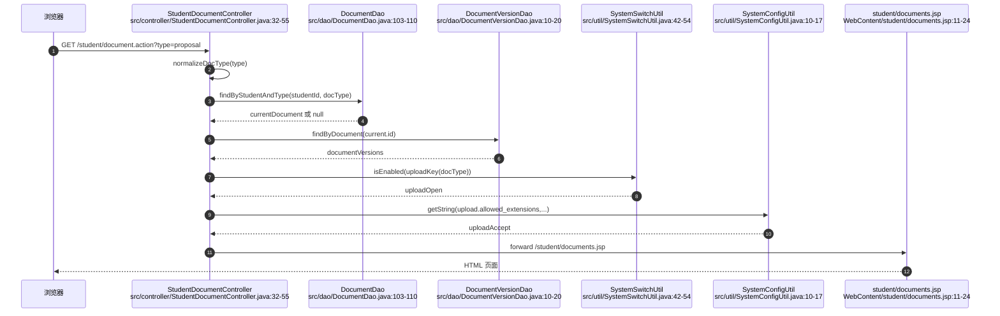

### 2.1 uploadOpen 在页面和后端分别做什么

`uploadOpen` 是“当前阶段是否允许上传”的运行期开关：

- Controller 的 GET 阶段用 `SystemSwitchUtil.uploadKey(docType)` 把 `proposal/midterm/final` 映射到 `switch.upload_proposal/switch.upload_midterm/switch.upload_final`，再读取开关值。
- JSP 如果发现 `uploadOpen=false`，显示黄色提示，并把标题输入框、正文、文件选择框、提交按钮都置为 `disabled`。
- Controller 的 POST 阶段仍然再次检查同一个开关；即使攻击者绕过前端禁用手工提交 multipart 请求，也会得到 `upload_closed`。

设计原因是：文档提交通常受毕业设计时间节点控制。页面禁用负责用户体验，后端开关负责真实安全边界。开关默认值由 `SystemConfigUtil.isEnabled(key, true)` 支持，配置缺失时按开启处理；`SystemSwitchUtil.ensureDefaults()` 会补齐默认开关项。

## 3. 学生 multipart POST 文档上传

学生提交文档表单时，JSP 表单使用：

```jsp
<form action="../student/document.action" method="post" enctype="multipart/form-data">
  <input type="hidden" name="docType" value="proposal">
  <input name="title" ...>
  <textarea name="content" ...></textarea>
  <input type="file" name="file" ...>
</form>
```

`multipart/form-data` 的意义是：浏览器不会把所有字段拼成普通 `a=b&c=d`，而是按 boundary 把每个字段拆成一个 part。普通字段仍可用 `request.getParameter("docType")`、`request.getParameter("title")`、`request.getParameter("content")` 读取；文件字段必须用 `request.getPart("file")` 读取。`StudentDocumentController` 标注了 `@MultipartConfig`，Servlet 容器才会解析 multipart 请求并提供 `Part` 对象。

典型请求形态：

```http
POST /student/document.action HTTP/1.1
Content-Type: multipart/form-data; boundary=----WebKitFormBoundary...
Cookie: JSESSIONID=...

------WebKitFormBoundary...
Content-Disposition: form-data; name="docType"

proposal
------WebKitFormBoundary...
Content-Disposition: form-data; name="title"

开题报告
------WebKitFormBoundary...
Content-Disposition: form-data; name="file"; filename="proposal.pdf"
Content-Type: application/pdf

...二进制文件...
------WebKitFormBoundary...--
```

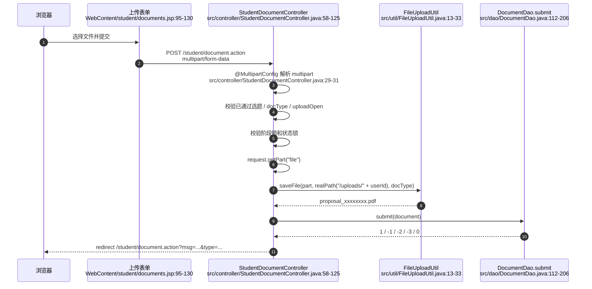

### 3.1 上传前的业务校验

学生 POST 不是“先落库再说”，而是先做业务校验：

1. 必须存在已通过选题，否则文档没有合法 `topic_id`，返回 `no_topic`。
2. `docType` 必须在 `document_type` 字典中，否则返回 `error`。
3. 当前阶段上传开关必须开启，否则返回 `upload_closed`。
4. 阶段锁必须满足：`proposal` 无前置；`midterm` 需要 `proposal` 已 `reviewed`；`final` 需要 `midterm` 已 `reviewed`。
5. 状态锁必须满足：同阶段已有文档时，只有 `rejected` 允许重交；`submitted` 正在等待审核，`reviewed` 已通过归档，都不允许被学生覆盖。

Controller 先做一次校验是为了及时给出重定向消息；DAO 在事务里再做一次锁定校验，才是并发场景下的最终约束。

### 3.2 文件保存路径、文件名和数据库路径

文档附件保存路径分两层：

- 物理目录：`getServletContext().getRealPath("/uploads/" + user.getId())`，即 Web 应用部署目录下的 `uploads/学生ID`。
- 数据库路径：`uploads/学生ID/保存后文件名`，例如 `uploads/4/proposal_ab12cd34.pdf`。

代码不保存绝对磁盘路径，原因是部署目录变化时数据库不用改，同时下载接口可以统一按相对路径做权限和目录边界校验。

`FileUploadUtil.saveFile(...)` 对文件做这些处理：

1. 空文件返回 `null`。
2. 读取 `upload.max_size_bytes`，默认最大 10MB，超限抛出 `IOException`。
3. 从 multipart part 的 `content-disposition` 中解析原始 `filename`。
4. 去掉浏览器可能带上的 Windows 反斜杠路径或 Unix 斜杠路径，只保留文件名本体。
5. 提取并小写化扩展名，要求在 `upload.allowed_extensions` 内，同时不能在 `upload.blocked_extensions` 内。
6. 创建上传目录。
7. 用 `docType_UUID前8位.ext` 生成保存名，再调用 `Part.write(...)` 写入磁盘。

这意味着用户上传的原始文件名不能决定最终目录，也不能构造 `../../xxx.jsp` 这类路径写入；目录由 Controller 固定，文件名由后端随机生成。

### 3.3 DocumentDao.submit 的事务与版本历史

`DocumentDao.submit` 是文档状态变化的核心：

- 事务开始后，先用 `FOR UPDATE` 锁定该学生对该课题的 approved 选题，保证文档确实挂在合法课题下。
- 中期 / 终稿会检查前置阶段是否已有 `reviewed` 文档；不满足时返回 `-2`。
- 对当前学生当前阶段已有文档记录加 `FOR UPDATE`，读取旧状态、旧标题、旧正文和旧附件。
- 如果已有记录但状态不是 `rejected`，返回 `-3`，阻止覆盖。
- 如果是 `rejected` 后重交，先把旧内容写入 `document_versions`，再更新同一条 `documents` 主记录为 `submitted`，并清空旧分数、反馈、审核时间和审核人。
- 如果没有旧记录，插入一条新 `documents`，初始状态为 `submitted`。

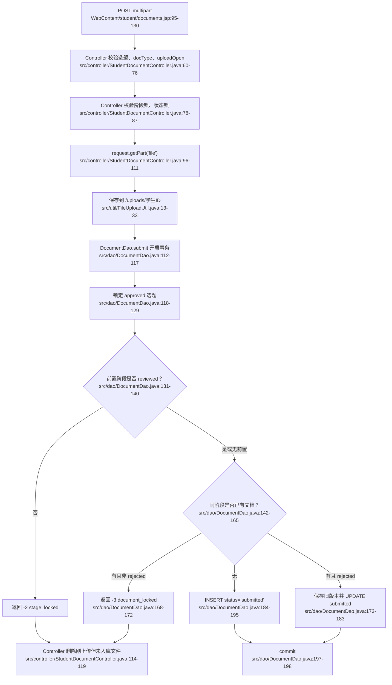

失败时删除刚上传文件的原因：文件先写磁盘，数据库后提交。如果 DAO 返回失败码或异常，数据库不会引用这个新文件，Controller 必须清理 `newFilePath`，避免产生孤儿附件。

## 4. 教师审核文档：列表、弹窗、状态更新

教师打开审核列表时：

```http
GET /teacher/document.action?type=proposal&status=submitted HTTP/1.1
Cookie: JSESSIONID=...
```

处理链路：

- Controller 读取教师、规范化文档阶段，`status` 缺省为 `submitted`。
- `DocumentDao.findByTeacher` 基础条件是 `topics.teacher_id = 当前教师ID`，再按 `doc_type` 和 `status` 追加过滤；`status=all` 时 Controller 传 `null`，表示不过滤状态。
- JSP 渲染阶段标签、状态筛选按钮、文档表格和审核 modal。
- 审核 modal 的 POST 表单提交 `id/docType/action/score/feedback`。

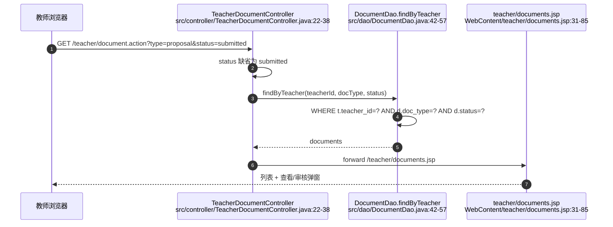

教师点击“通过并评分”或“驳回”时，浏览器发出普通表单 POST：

```http
POST /teacher/document.action HTTP/1.1
Content-Type: application/x-www-form-urlencoded
Cookie: JSESSIONID=...

id=12&docType=proposal&action=review&score=88&feedback=...
```

这里没有文件字段，所以不需要 `multipart/form-data`。审核规则：

- `action=review` 映射为 `status=reviewed`，必须提供 0-100 分。
- `action=reject` 映射为 `status=rejected`，DAO 会强制把分数置空。
- DAO 的更新 SQL 要求 `d.status='submitted'`，所以已审核通过或已驳回的记录不能被重复审核。
- DAO 的更新 SQL `JOIN topics` 并要求 `t.teacher_id=?`，所以教师只能审核自己指导课题下的文档。

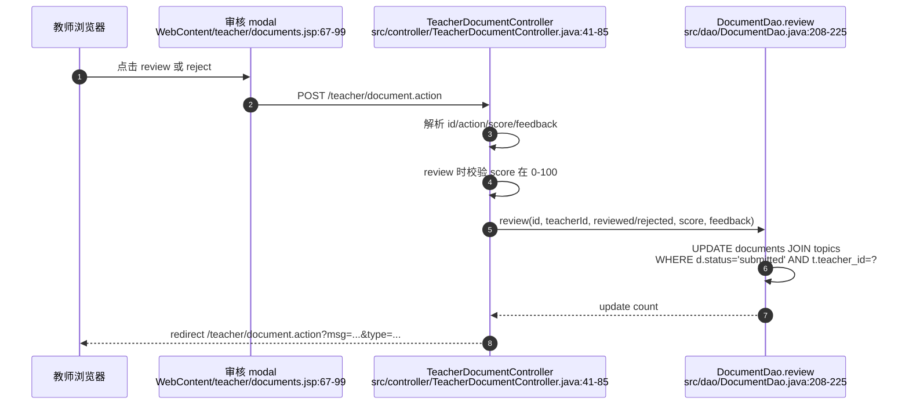

当前教师 JSP 的附件区域只是把 `filePath` 填成文本，没有直接渲染下载链接；但 `download.action` 支持教师权限校验：只要请求路径等于该教师名下某个文档的 `file_path`，即可下载。

## 5. download.action 文件流：path 参数、权限和防目录穿越

学生文档页会为当前附件和历史版本附件生成链接：

```text
../download.action?path=uploads%2F4%2Fproposal_ab12cd34.pdf
```

`path` 来自数据库中保存的相对路径。下载不直接暴露 `/uploads/4/xxx.pdf`，而是统一走 Controller，原因是静态文件服务无法判断“当前登录用户是否有权下载这个文件”。

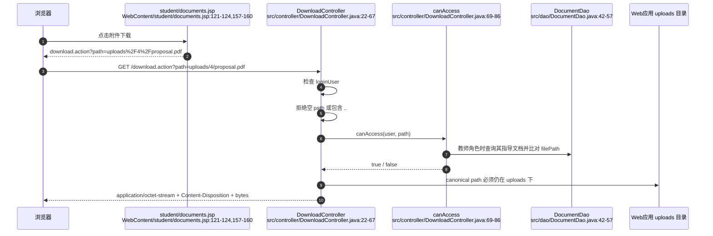

下载校验分四层：

1. 登录校验：没有 session 或没有 `loginUser` 时跳转登录页。
2. 字符串路径校验：`path == null` 或包含 `..` 立即返回 400；开头 `/` 会被去掉，统一成相对路径。
3. 角色权限校验：
   - 管理员：允许访问 `uploads/` 下文件。
   - 教师：必须是 `uploads/` 下路径，并且路径等于该教师指导文档中的某个 `file_path`。
   - 学生：只能访问 `uploads/自己的用户ID/` 前缀下文件。
4. canonical path 校验：目标文件 canonical path 必须位于 Web 根目录下的 `uploads` canonical path 内，并且真实存在且是普通文件。

防目录穿越的关键是两道门：

- 第一门：拒绝 `../../WEB-INF/web.xml` 这类包含 `..` 的参数。
- 第二门：即使路径经过分隔符、符号链接或编码变形，`getCanonicalFile()` 后仍必须以 `uploads` 目录 canonical path 加分隔符开头。

文件流响应：

- `Content-Type: application/octet-stream`：按通用二进制流返回。
- `Content-Disposition: attachment; filename="..."; filename*=UTF-8''...`：提示浏览器下载而不是渲染，并兼容 UTF-8 文件名。
- 通过 `FileInputStream` 每次读取 4096 bytes 写入 `response.getOutputStream()`。

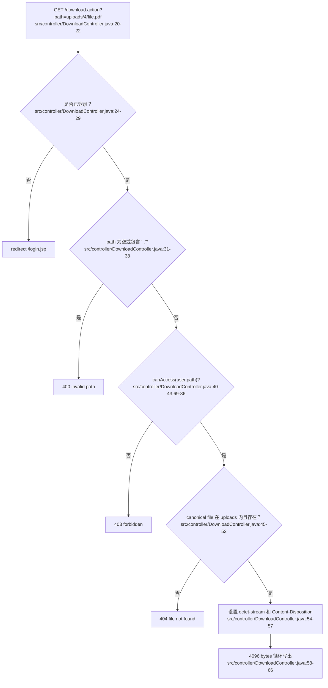

## 6. 文件模板列表：学生、教师、管理员共用 Controller

模板列表由同一个 `FileTemplateController` 处理三个 URL：

- `/student/file-template.action`
- `/teacher/file-template.action`
- `/admin/file-template.action`

GET 请求读取 `type/page/pageSize`，调用 `FileTemplateDao.findAll(type, page, pageSize)` 和 `countAll(type)`，再根据 servlet path 选择不同 JSP：

- `/admin/`：`/admin/file-templates.jsp`
- `/student/`：`/student/file-templates.jsp`
- 其他：`/teacher/file-templates.jsp`

DAO 查询只返回 `status=1` 的模板，并按 `created_at DESC, id DESC` 排序；带分页时拼接 `LIMIT ? OFFSET ?`。因此学生、教师看到的是可用模板列表，管理员当前管理页也展示可用模板，删除操作是物理删除数据库记录。

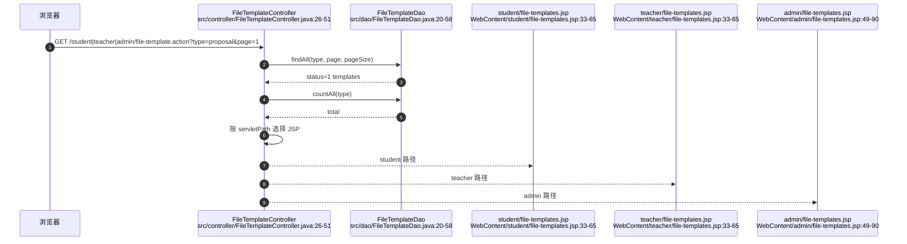

学生和教师模板 JSP 的结构基本一致：顶部按文档类型过滤，表格展示模板名称、类型、原文件名、大小、上传人、上传时间、说明，并通过 `../file-template-download.action?id=模板ID` 下载。管理员 JSP 多了消息提示、上传按钮、删除表单和上传 modal。

## 7. 管理员模板上传 / 删除管理

管理员上传模板的表单也使用 `multipart/form-data`，因为它同样包含文件字段：

```jsp
<form action="../admin/file-template.action" method="post" enctype="multipart/form-data">
  <input type="hidden" name="action" value="upload">
  <input name="templateName" ...>
  <select name="docType">...</select>
  <input type="file" name="file" ...>
  <textarea name="description"></textarea>
</form>
```

后端处理：

1. `FileTemplateController` 映射了管理员 / 教师 / 学生三个模板 URL，并标注 `@MultipartConfig`。
2. POST 入口首先检查当前用户角色必须是 `admin`，非管理员直接 403。
3. `action=upload` 时：
   - `templateName` 不能为空。
   - `request.getPart("file")` 必须存在且大小大于 0。
   - 上传目录固定为 `/uploads/templates`。
   - 使用 `FileUploadUtil.getFileName(part)` 记录原始文件名。
   - 使用 `FileUploadUtil.saveFile(part, uploadDir, "template")` 生成随机保存名，例如 `template_ab12cd34.docx`。
   - 数据库保存 `file_path=uploads/templates/保存名`、`original_filename=原文件名`、`file_size`、`uploader_id` 等字段。
4. `action=delete` 时：
   - 从请求中解析 `id`。
   - 先按 id 查询模板记录。
   - 删除数据库记录。
   - 再按记录中的 `file_path` 删除物理文件；删除物理文件前会拒绝包含 `..` 的路径。

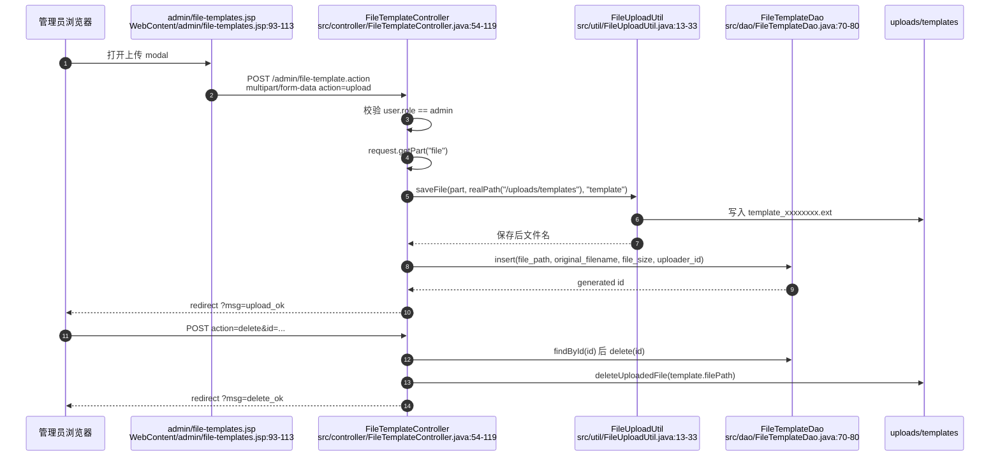

模板上传和学生文档上传复用同一套 `FileUploadUtil`，所以大小限制、允许扩展名、禁止扩展名、文件名路径剥离、随机保存名逻辑一致。管理员 JSP 文件选择框写死了 `accept=".pdf,.doc,.docx,.zip,.rar"`，但真正的安全边界仍在后端 `FileUploadUtil.validateExtension(...)` 和系统配置。

## 8. 模板下载流：id 参数到文件流

模板下载链接不把 `file_path` 暴露给浏览器，而是只传主键：

```text
../file-template-download.action?id=12
```

后端流程：

1. 必须已登录，否则跳转登录页。
2. 将 `id` 解析为整数，失败返回 400。
3. 通过 `FileTemplateDao.findById(id)` 查询模板记录。
4. 记录不存在、`file_path` 为空或包含 `..` 时返回 404。
5. 计算 Web 根目录、`uploads/templates` canonical path、模板文件 canonical path。
6. 文件 canonical path 必须位于 `uploads/templates` 下，且真实存在并为普通文件。
7. `Content-Type` 设为 `application/octet-stream`。
8. 下载文件名优先使用数据库中的 `original_filename`，为空时才使用磁盘保存名。
9. 设置 `Content-Disposition` 的 `filename` 和 `filename*`，再循环写出文件 bytes。

```mermaid
flowchart TD
    A["点击模板下载<br/>WebContent/student/file-templates.jsp:44-55<br/>WebContent/teacher/file-templates.jsp:44-55<br/>WebContent/admin/file-templates.jsp:63-80"] --> B["GET /file-template-download.action?id=12<br/>src/controller/FileTemplateDownloadController.java:19-22"]
    B --> C{"是否登录？<br/>src/controller/FileTemplateDownloadController.java:23-28"}
    C -- "否" --> D["redirect /login.jsp"]
    C -- "是" --> E{"id 是否为整数？<br/>src/controller/FileTemplateDownloadController.java:30-36"}
    E -- "否" --> F["400 invalid template id"]
    E -- "是" --> G["FileTemplateDao.findById(id)<br/>src/dao/FileTemplateDao.java:60-62"]
    G --> H{"记录存在且 file_path 不含 '..'?<br/>src/controller/FileTemplateDownloadController.java:38-43"}
    H -- "否" --> I["404 template not found"]
    H -- "是" --> J{"canonical file 在 uploads/templates 内？<br/>src/controller/FileTemplateDownloadController.java:45-53"}
    J -- "否" --> K["404 file not found"]
    J -- "是" --> L["使用 original_filename 设置 Content-Disposition<br/>src/controller/FileTemplateDownloadController.java:55-62"]
    L --> M["4096 bytes 循环写出<br/>src/controller/FileTemplateDownloadController.java:63-71"]
```

模板下载用 `id` 而不是 `path` 的设计理由：模板文件是公共资源，不需要像学生文档那样按学生 / 指导教师关系逐个比对；但仍然不能让浏览器任意指定文件路径。因此让客户端只提供数据库主键，由服务端根据记录反查 `file_path`，再限定在 `uploads/templates` 目录内。

## 9. 状态锁、阶段锁、系统开关和路径安全的整体关系

```mermaid
stateDiagram-v2
    [*] --> proposal: 已通过选题
    proposal --> midterm: proposal reviewed
    midterm --> final: midterm reviewed

    state "单个 docType 内部状态" as S {
        [*] --> submitted: 首次提交
        submitted --> reviewed: 教师 review
        submitted --> rejected: 教师 reject
        rejected --> submitted: 学生重交
        reviewed --> [*]
    }
```

- 阶段锁解决“毕业设计流程顺序”问题：没有通过开题不能交中期，没有通过中期不能交终稿。
- 状态锁解决“同一阶段能不能覆盖”问题：等待审核和已通过不能被学生覆盖，只有退回后才能重交。
- 教师审核锁解决“谁能审、能不能重复审”问题：只有指导教师能审，且只有 `submitted` 能变成 `reviewed/rejected`。
- 系统开关解决“当前时间段是否允许上传”问题：页面禁用只是提示，POST 校验才是硬限制。
- 上传路径安全解决“客户端文件名不能控制服务器路径”问题：目录由 Controller 固定，保存名由后端随机生成，原文件名只用于展示或模板下载名。
- 下载路径安全解决“不能越权读文件”问题：学生文档下载用 `path` 但有角色权限和 canonical path 双重校验；模板下载用 `id` 间接定位文件，并限定在 `uploads/templates` 内。

## 10. 代码证据清单

- `WebContent/student/documents.jsp:11-24`：学生文档页读取 Controller 注入的属性，缺少关键属性时重定向回 `/student/document.action`。
- `WebContent/student/documents.jsp:18-21`：读取 `uploadAccept` 和 `uploadOpen`，并设置默认允许扩展名和默认开启上传。
- `WebContent/student/documents.jsp:39-55`：没有通过选题时显示空状态，不渲染上传表单。
- `WebContent/student/documents.jsp:59-64`：按文档类型生成学生阶段切换 GET 链接。
- `WebContent/student/documents.jsp:75-79`：`uploadOpen=false` 时显示上传关闭提示。
- `WebContent/student/documents.jsp:81-91`：显示当前文档提交状态、分数和反馈。
- `WebContent/student/documents.jsp:95-130`：学生文档上传表单使用 POST、`multipart/form-data`、隐藏 `docType`、文件字段 `file`，并按 `uploadOpen` 禁用输入和提交按钮。
- `WebContent/student/documents.jsp:121-124`：当前附件下载链接使用 `download.action?path=...` 并对相对路径做 URL 编码。
- `WebContent/student/documents.jsp:137-167`：历史版本列表和历史版本附件下载链接。
- `WebContent/teacher/documents.jsp:6-14`：教师文档页读取 `docType/statusFilter/documents/typeNames`，缺失时重定向回 Controller。
- `WebContent/teacher/documents.jsp:31-42`：教师阶段标签和 `submitted/reviewed/rejected/all` 状态筛选链接。
- `WebContent/teacher/documents.jsp:48-63`：教师文档表格和“查看/审核”按钮。
- `WebContent/teacher/documents.jsp:67-85`：教师审核 modal 表单，提交 `id/docType/action/score/feedback`。
- `WebContent/teacher/documents.jsp:89-99`：前端脚本填充 modal，并且只有 `submitted` 状态显示审核按钮。
- `WebContent/student/file-templates.jsp:13-20`：学生模板页读取模板列表、类型字典、分页和过滤条件，缺失时重定向回 Controller。
- `WebContent/student/file-templates.jsp:33-37`：学生模板页按文档类型生成过滤链接。
- `WebContent/student/file-templates.jsp:44-55`：学生模板列表展示模板信息并用 `file-template-download.action?id=...` 下载。
- `WebContent/student/file-templates.jsp:60-64`：学生模板页复用分页组件。
- `WebContent/teacher/file-templates.jsp:13-20`：教师模板页读取模板列表、类型字典、分页和过滤条件，缺失时重定向回 Controller。
- `WebContent/teacher/file-templates.jsp:33-37`：教师模板页按文档类型生成过滤链接。
- `WebContent/teacher/file-templates.jsp:44-55`：教师模板列表展示模板信息并用 `file-template-download.action?id=...` 下载。
- `WebContent/teacher/file-templates.jsp:60-64`：教师模板页复用分页组件。
- `WebContent/admin/file-templates.jsp:28-36`：管理员模板页根据 `msg` 参数生成上传、删除、校验失败等提示。
- `WebContent/admin/file-templates.jsp:49-57`：管理员模板页生成类型过滤链接和“上传模板”按钮。
- `WebContent/admin/file-templates.jsp:63-80`：管理员模板表格展示下载按钮和删除表单，删除提交 `action=delete&id=...`。
- `WebContent/admin/file-templates.jsp:93-113`：管理员上传模板 modal，表单使用 POST、`multipart/form-data`、`action=upload` 和文件字段 `file`。
- `src/controller/StudentDocumentController.java:29-31`：学生文档 Controller 映射 `/student/document.action` 并启用 `@MultipartConfig`。
- `src/controller/StudentDocumentController.java:32-55`：学生 GET 文档页准备通过选题、当前文档、版本历史、`uploadOpen`、`uploadAccept` 并 forward 到 JSP。
- `src/controller/StudentDocumentController.java:50-54`：按文档阶段读取上传开关和允许扩展名。
- `src/controller/StudentDocumentController.java:58-76`：学生 POST 设置编码、校验已通过选题、校验 `docType`、校验上传开关。
- `src/controller/StudentDocumentController.java:78-87`：学生 POST 校验阶段锁和状态锁。
- `src/controller/StudentDocumentController.java:89-112`：构造 Document，读取 `request.getPart("file")`，保存到 `/uploads/用户ID` 并生成相对路径。
- `src/controller/StudentDocumentController.java:114-125`：调用 `DocumentDao.submit`，失败清理刚上传文件，成功记录日志并重定向。
- `src/controller/StudentDocumentController.java:128-140`：学生文档重定向、文档类型归一化和字典项读取。
- `src/controller/StudentDocumentController.java:142-149`：删除刚上传但未成功入库的物理文件。
- `src/controller/TeacherDocumentController.java:20-21`：教师文档 Controller 映射 `/teacher/document.action`。
- `src/controller/TeacherDocumentController.java:22-38`：教师 GET 审核页读取阶段和状态，查询文档列表并 forward。
- `src/controller/TeacherDocumentController.java:41-65`：教师 POST 审核入口，解析 action 和 score，并校验通过评分为 0-100。
- `src/controller/TeacherDocumentController.java:67-84`：教师 POST 调用 DAO 审核，发送通知，记录日志并重定向。
- `src/controller/TeacherDocumentController.java:87-100`：教师审核后的重定向和文档类型归一化。
- `src/controller/DownloadController.java:20-22`：学生文档附件下载 Controller 映射 `/download.action`。
- `src/controller/DownloadController.java:24-29`：下载前必须存在登录用户，否则跳转登录。
- `src/controller/DownloadController.java:31-38`：校验 `path`，拒绝空路径和包含 `..` 的路径，并去掉开头 `/`。
- `src/controller/DownloadController.java:40-43`：下载前调用角色权限校验。
- `src/controller/DownloadController.java:45-52`：canonical path 限定目标文件必须位于 `uploads` 目录下且真实存在。
- `src/controller/DownloadController.java:54-66`：设置 `application/octet-stream`、`Content-Disposition`，并循环写出文件 bytes。
- `src/controller/DownloadController.java:69-86`：管理员、教师、学生三类附件下载权限规则。
- `src/controller/FileTemplateController.java:23-25`：模板 Controller 同时映射管理员、教师、学生模板 URL，并启用 `@MultipartConfig`。
- `src/controller/FileTemplateController.java:26-51`：模板 GET 列表读取过滤和分页，查询模板和总数，并按 servlet path 选择 JSP。
- `src/controller/FileTemplateController.java:54-71`：模板 POST 只允许管理员，并按 `action=upload|delete` 分发。
- `src/controller/FileTemplateController.java:73-119`：管理员模板上传校验名称和文件，保存到 `/uploads/templates`，插入 `file_templates` 并记录日志。
- `src/controller/FileTemplateController.java:121-145`：管理员模板删除按 id 查询记录、删除数据库记录、删除物理文件并记录日志。
- `src/controller/FileTemplateController.java:147-163`：模板文档类型归一化、字符串 trim、删除物理文件时拒绝包含 `..` 的路径。
- `src/controller/FileTemplateDownloadController.java:19-22`：模板下载 Controller 映射 `/file-template-download.action`。
- `src/controller/FileTemplateDownloadController.java:23-28`：模板下载必须已登录，否则跳转登录。
- `src/controller/FileTemplateDownloadController.java:30-36`：模板下载解析 `id`，非法 id 返回 400。
- `src/controller/FileTemplateDownloadController.java:38-43`：按 id 查询模板，拒绝不存在、空路径或包含 `..` 的模板路径。
- `src/controller/FileTemplateDownloadController.java:45-53`：canonical path 限定模板文件必须在 `uploads/templates` 下且真实存在。
- `src/controller/FileTemplateDownloadController.java:55-62`：模板下载使用原始文件名设置 `Content-Disposition`。
- `src/controller/FileTemplateDownloadController.java:63-71`：模板下载循环读取 4096 bytes 写入响应流。
- `src/dao/DocumentDao.java:15-20`：文档基础查询关联 documents、users、topics。
- `src/dao/DocumentDao.java:42-57`：教师按指导课题、文档类型和状态查询文档。
- `src/dao/DocumentDao.java:95-110`：按 id 或学生加文档类型查询单个文档。
- `src/dao/DocumentDao.java:112-117`：学生提交文档时开启数据库事务。
- `src/dao/DocumentDao.java:118-140`：事务内锁定 approved 选题并检查前置阶段是否 reviewed。
- `src/dao/DocumentDao.java:142-172`：锁定同阶段已有文档，非 `rejected` 时拒绝覆盖。
- `src/dao/DocumentDao.java:173-195`：`rejected` 重交时保存旧版本并更新为 `submitted`，首次提交时插入 `submitted`。
- `src/dao/DocumentDao.java:197-205`：提交事务，异常时回滚并关闭连接。
- `src/dao/DocumentDao.java:208-225`：教师 review/reject 的状态校验、分数校验和 `JOIN topics` 权限更新。
- `src/dao/DocumentDao.java:227-243`：阶段锁规则：`proposal` 无前置，`midterm` 依赖 `proposal`，`final` 依赖 `midterm`。
- `src/dao/DocumentDao.java:256-270`：把旧文档内容保存到 `document_versions`。
- `src/dao/DocumentDao.java:296-323`：数据库行映射到 Document 对象，包括 `filePath/status/score/feedback`。
- `src/dao/DocumentVersionDao.java:10-20`：按文档查询历史版本并按版本号倒序。
- `src/dao/DocumentVersionDao.java:22-30`：独立保存历史版本的方法。
- `src/dao/DocumentVersionDao.java:32-42`：数据库行映射到 DocumentVersion。
- `src/dao/FileTemplateDao.java:11-14`：模板基础查询关联 file_templates 和 users。
- `src/dao/FileTemplateDao.java:20-35`：模板分页查询入口和总数统计入口。
- `src/dao/FileTemplateDao.java:37-58`：模板查询按类型过滤、只取 `status=1`、排序并分页。
- `src/dao/FileTemplateDao.java:60-68`：按 id 或 path 查询模板记录。
- `src/dao/FileTemplateDao.java:70-77`：插入模板记录并写入文件路径、原始文件名、大小和上传人。
- `src/dao/FileTemplateDao.java:79-86`：删除模板记录或更新模板状态。
- `src/dao/FileTemplateDao.java:96-110`：数据库行映射到 FileTemplate 对象。
- `src/util/FileUploadUtil.java:13-20`：上传文件为空或超过最大大小时拒绝。
- `src/util/FileUploadUtil.java:21-33`：解析原文件名、校验扩展名、创建目录、生成随机保存名并写入磁盘。
- `src/util/FileUploadUtil.java:36-51`：从 multipart `content-disposition` 中解析 `filename` 并剥离客户端路径。
- `src/util/FileUploadUtil.java:54-60`：提取并小写化扩展名。
- `src/util/FileUploadUtil.java:62-75`：按允许扩展名和禁止扩展名配置校验文件类型。
- `src/util/SystemConfigUtil.java:10-17`：从 `system_configs` 读取字符串配置。
- `src/util/SystemConfigUtil.java:28-35`：读取 long 类型配置，例如上传大小。
- `src/util/SystemConfigUtil.java:37-47`：读取 CSV 配置并转成小写集合。
- `src/util/SystemConfigUtil.java:49-57`：读取布尔开关配置并支持默认值。
- `src/util/SystemConfigUtil.java:64-80`：更新、插入或补齐系统配置。
- `src/util/SystemSwitchUtil.java:6-13`：定义选题和三类文档上传开关 key。
- `src/util/SystemSwitchUtil.java:14-21`：系统开关展示名称定义。
- `src/util/SystemSwitchUtil.java:42-54`：读取开关状态并把 `docType` 映射到上传开关 key。
- `src/util/SystemSwitchUtil.java:56-74`：更新开关并补齐默认开关配置。
- `src/dbutil/SQLHelper.java:16-28`：初始化 Druid 数据源。
- `src/dbutil/SQLHelper.java:30-46`：从 `jdbc.properties` 加载数据库连接配置。
- `src/dbutil/SQLHelper.java:48-50`：获取数据库连接。
- `src/dbutil/SQLHelper.java:52-77`：执行列表查询并映射为 `Object[]`。
- `src/dbutil/SQLHelper.java:79-94`：执行更新 SQL。
- `src/dbutil/SQLHelper.java:96-115`：执行标量查询。
- `src/dbutil/SQLHelper.java:117-137`：执行插入并返回自增主键。
- `src/dbutil/SQLHelper.java:139-155`：绑定 PreparedStatement 参数并关闭 JDBC 资源。


---

# 04 管理员后台网络数据流详解：用户、公告、答辩、系统开关、统计与导出

本节只写管理员传统管理链路，不写 AI 模块。当前代码里的管理员后台仍然保留原有结构：

- **用户管理**：必须从 `/admin/user.action` 进入 Controller，Controller 查询后 `forward` 到 `users.jsp`；直接访问 `users.jsp` 会被重定向回 Controller。
- **公告、答辩安排**：列表页由 JSP 直接查 DAO 渲染；写操作 POST 到 Servlet，处理后 redirect 回 JSP。
- **统计**：`statistics.jsp` 输出容器，浏览器 `fetch('../admin/stats.action')` 拉 JSON，前端 ECharts 渲染。
- **Excel 导出**：点击链接 GET `/admin/export.action`，Servlet 直接写 `.xlsx` 二进制响应。
- **系统开关**：新增为 Controller forward 到 `system-switches.jsp`，POST 保存后 redirect 回 `/admin/system-switch.action?msg=switch_ok`。

新变化重点：

1. 用户过滤字段从原来的 `role/college` 扩展为 `role/college/major/className/studentNo/realName`，其中 `className/studentNo/realName` 是模糊匹配。
2. 用户页新增教师/学生 Excel 导入：`multipart/form-data`，字段 `importRole` + 文件 part `file`。
3. 用户页新增学生密码批量重置：支持勾选学生 `resetSelected`，也支持按当前筛选条件 `resetFiltered`。
4. 公告新增作用域：`scopeType=global/college/major`，配合 `college/major` 控制可见范围。
5. 答辩统计 JSON 新增 `defense` 数据，统计页也新增“答辩安排”图表。
6. 系统开关新增：教师出题、学生选题、开题/中期/终稿上传开关。

> 注意：用户要求里列了 `src/util/SQLHelper.java`，当前项目真实路径是 `src/dbutil/SQLHelper.java`，所有 DAO 和导出查询都 import `dbutil.SQLHelper`。

## 1. URL、方法、Content-Type、字段总表

| 流程 | URL | 方法 | 请求 Content-Type | 关键 query / body 字段 | 后端入口 | 响应 |
|---|---|---:|---|---|---|---|
| 用户列表/过滤/分页 | `/admin/user.action?role=&college=&major=&className=&studentNo=&realName=&page=&pageSize=` | GET | 无请求体 | `role`、`college`、`major` 精确过滤；`className/studentNo/realName` 模糊过滤；`page/pageSize` 分页 | `AdminUserController#doGet` | forward `/admin/users.jsp`，HTML |
| 用户新增 | `/admin/user.action` | POST | `application/x-www-form-urlencoded` | `action=add`，`username/password/realName/title/role/college/major/className/studentNo/department/email/phone` | `AdminUserController#doPost` | redirect `?msg=add_ok` 或 `?msg=username_exists` |
| 用户编辑 | `/admin/user.action` | POST | `application/x-www-form-urlencoded` | `action=edit`，`id`，用户字段，`status`，`password` 可空 | `AdminUserController#doPost` | redirect `?msg=edit_ok` 或错误 msg |
| 用户删除 | `/admin/user.action` | POST | `application/x-www-form-urlencoded` | `action=delete`，`id` | `AdminUserController#doPost` | redirect `?msg=delete_ok/delete_self/delete_failed` |
| 勾选学生重置密码 | `/admin/user.action` | POST | `application/x-www-form-urlencoded` | `action=resetSelected`，多个 `selectedIds`，`newPassword` | `AdminUserController#doPost` | redirect `?msg=reset_ok&count=N` 或 `?msg=reset_password_invalid` |
| 按筛选结果重置密码 | `/admin/user.action` | POST | `application/x-www-form-urlencoded` | `action=resetFiltered`，当前过滤字段，`newPassword` | `AdminUserController#doPost` | redirect 保留筛选 query + `msg=reset_ok&count=N` |
| 用户 Excel 导入 | `/admin/user-import.action` | POST | `multipart/form-data` | `importRole=student/teacher`，文件 part：`file` | `AdminUserImportController#doPost` | redirect `?msg=import_ok&success=N&skipped=M`；错误明细放 session |
| 公告列表 | `/admin/announcements.jsp` | GET | 无请求体 | 无 | JSP 内部 `AnnouncementDao.findAll()` | HTML |
| 公告新增/编辑/删除 | `/admin/announcement.action` | POST | `application/x-www-form-urlencoded` | `action=add/edit/delete`，`id/title/content/isTop/scopeType/college/major` | `AdminAnnouncementController#doPost` | redirect `/admin/announcements.jsp?msg=...` |
| 答辩列表 | `/admin/defenses.jsp` | GET | 无请求体 | `msg/success/skipped` 只用于导入结果提示 | JSP 内部查 DAO | HTML |
| 答辩新增/编辑/删除 | `/admin/defense.action` | POST | `application/x-www-form-urlencoded` | `action=add/edit/delete`，`id/studentId/defenseTime/room/groupName/score/comment` | `AdminDefenseController#doPost` | redirect `/admin/defenses.jsp?msg=...` |
| 答辩 Excel 导入 | `/admin/defense-import.action` | POST | `multipart/form-data` | 文件 part：`file`；Excel 列：学号、答辩时间、教室、分组、备注 | `AdminDefenseImportController#doPost` | redirect `?msg=import_ok&success=N&skipped=M` |
| 系统开关页 | `/admin/system-switch.action` | GET | 无请求体 | 无 | `AdminSystemSwitchController#doGet` | forward `/admin/system-switches.jsp` |
| 系统开关保存 | `/admin/system-switch.action` | POST | `application/x-www-form-urlencoded` | checkbox 名称就是配置键：`switch.topic_submit` 等；勾选提交 `on` | `AdminSystemSwitchController#doPost` | redirect `?msg=switch_ok` |
| 统计 JSON | `/admin/stats.action` | GET | 无请求体 | 无 | `AdminStatsController#doGet` | `application/json;charset=UTF-8` |
| 成绩 Excel 导出 | `/admin/export.action` | GET | 无请求体 | 无 | `AdminExportController#doGet` | `.xlsx` 二进制下载 |

## 2. 用户 GET：过滤、分页、Controller forward

`users.jsp` 现在只负责渲染，不负责查数据库。它先读 Controller 放入的 `roleFilter/collegeFilter/majorFilter/classNameFilter/studentNoFilter/realNameFilter/filterQuery/users/total/currentPage/pageSize`；如果 `users == null`，说明不是从 Controller forward 进来的，会 `sendRedirect` 回 `/admin/user.action`。

```mermaid
flowchart TD
  A["浏览器 GET /admin/user.action?role&college&major&className&studentNo&realName&page&pageSize"] --> B["AdminUserController.doGet<br/>buildCriteria + PageUtil"]
  B --> C["UserSearchCriteria 保存 role/college/major/className/studentNo/realName"]
  C --> D["UserDao.findAllPaged(criteria,page,pageSize)<br/>UserDao.countAll(criteria)"]
  D --> E["appendCriteria 拼 WHERE<br/>role/college/major 精确<br/>className/studentNo/realName LIKE"]
  E --> F["SQLHelper PreparedStatement 绑定参数"]
  F --> G["Controller 设置 users/total/filterQuery/字典/学院专业/校验规则"]
  G --> H["forward /admin/users.jsp"]
  H --> I["users.jsp 渲染筛选表单、表格、分页"]
  J["直接访问 /admin/users.jsp 且 users=null"] --> K["sendRedirect /admin/user.action"] --> A
```

关键字段与代码路径：

- Query 来源：筛选表单 `method="get"`，字段在 `WebContent/admin/users.jsp:93-138`；新增过滤字段是 `major/className/studentNo/realName`。
- Controller 读取：`buildCriteria` 读取 `role/college/major/className/studentNo/realName`，见 `src/controller/AdminUserController.java:190-198`。
- 分页读取：`PageUtil.getPage/getPageSize/offset` 处理 `page/pageSize`，见 `src/util/PageUtil.java:8-23`。
- DAO 过滤：`UserDao.appendCriteria` 先处理 `role`，再处理其余字段；`class_name/student_no/real_name` 使用 `LIKE '%值%'`，见 `src/dao/UserDao.java:244-279`。
- forward 原因：用户页需要 Controller 准备用户列表、总数、字典、学院/专业分组、用户名正则、密码最短长度；这些都在 request attribute 里，见 `src/controller/AdminUserController.java:37-56`。

老师追问点：

- **为什么用户页不用 JSP 直接查 DAO？** 因为用户页包含分页、筛选、批量操作、字典和校验配置，Controller 集中准备数据更清楚；直接访问 JSP 会丢 request attribute，所以 JSP 有保护性 redirect。
- **为什么筛选后重置还能保留筛选条件？** Controller 用 `buildFilterQuery` URL encode 当前过滤字段，分页和 `resetFiltered` redirect 都复用它，见 `src/controller/AdminUserController.java:223-247`。

## 3. 用户 POST：新增、编辑、删除、批量重置

用户页多种操作共用 `/admin/user.action`，靠隐藏字段 `action` 分流。普通表单都是默认 `application/x-www-form-urlencoded`，Servlet 用 `request.getParameter(...)` 取字段。

```mermaid
flowchart TD
  A["新增 modal<br/>action=add<br/>username/password/realName/title/role/college/major/className/studentNo/department/email/phone"] --> P["POST /admin/user.action"]
  B["编辑 modal<br/>action=edit,id,status<br/>password 可留空"] --> P
  C["行内删除表单<br/>action=delete,id"] --> P
  D["勾选学生重置<br/>action=resetSelected<br/>selectedIds[] + newPassword"] --> P
  E["按筛选重置<br/>action=resetFiltered<br/>过滤字段 + newPassword"] --> P
  P --> F["AdminUserController.doPost<br/>读取 action"]
  F -->|add| G["用户名查重 -> buildUser -> UserDao.insert -> log -> msg=add_ok"]
  F -->|edit| H["排除自身用户名查重 -> 自保护/末管理员保护 -> UserDao.update -> msg=edit_ok"]
  F -->|delete| I["禁止删除当前登录用户 -> UserDao.delete -> msg=delete_ok/delete_failed"]
  F -->|resetSelected| J["校验密码长度 -> parseIds -> resetStudentPasswords -> msg=reset_ok&count=N"]
  F -->|resetFiltered| K["校验密码长度 -> findStudentIdsForReset(criteria) -> resetStudentPasswords -> 保留筛选 query + msg=reset_ok&count=N"]
  G --> R["redirect /admin/user.action?..."]
  H --> R
  I --> R
  J --> R
  K --> R
```

字段说明：

- 新增表单：`WebContent/admin/users.jsp:242-280`，包含用户名、密码、姓名、身份/职称、角色、学院、专业、班级、学号、部门、邮箱、电话。
- 编辑表单：`WebContent/admin/users.jsp:284-331`，多了隐藏 `id` 和 `status`；`password` 留空表示不改密码。
- 删除表单：`WebContent/admin/users.jsp:173-179`，提交 `action=delete/id`。
- 勾选重置：表格里只有学生行才输出 `selectedIds` 复选框，隐藏表单提交 `action=resetSelected`，见 `WebContent/admin/users.jsp:141-149` 和 `WebContent/admin/users.jsp:156-159`。
- 按筛选重置：modal 把当前 `role/college/major/className/studentNo/realName` 全部做成 hidden input，见 `WebContent/admin/users.jsp:220-239`。

后端规则：

- 新增查重 `existsByUsername` 后插入，默认 `status=1`，见 `src/controller/AdminUserController.java:66-76`。
- 编辑时防止把当前管理员自己改成非 admin 或禁用自己，也防止最后一个启用管理员被降级/禁用，见 `src/controller/AdminUserController.java:87-107`。
- `buildUser` 对学生才保留 `studentNo/className`，非学生置空，见 `src/controller/AdminUserController.java:154-168`。
- 批量重置只作用于 `role='student'`：按筛选先查学生 id，真正 UPDATE 也有 `WHERE role='student' AND id IN (...)`，见 `src/dao/UserDao.java:199-242`。
- 密码长度用系统配置 `validation.password_min_length`，见 `src/controller/AdminUserController.java:218-220`。

Redirect msg：

- 成功：`add_ok`、`edit_ok`、`delete_ok`、`reset_ok&count=N`。
- 失败/特殊：`username_exists`、`delete_self`、`delete_failed`、`edit_self_role`、`last_admin`、`reset_password_invalid`、`error`。
- 当前 `users.jsp` 已显示导入和重置相关 msg：`import_ok/import_empty/import_error/import_role_invalid/reset_ok/reset_password_invalid` 等，见 `WebContent/admin/users.jsp:54-67`。

老师追问点：

- **为什么批量重置不会误伤教师/管理员？** 前端只给学生行输出复选框，后端 `resetStudentPasswords` 仍用 `role='student'` 二次限制。
- **为什么编辑密码可以为空？** Controller 把空密码设为 `null`，DAO 在 `user.getPassword()` 为空时走不更新 password 的 SQL，见 `src/dao/UserDao.java:120-134`。

## 4. 用户 Excel 导入：multipart + POI + session 错误明细

用户导入是单独的 `/admin/user-import.action`，不是 `/admin/user.action`。表单必须是 `multipart/form-data`，否则 Servlet 端无法通过 `request.getPart("file")` 取到文件。

```mermaid
sequenceDiagram
  participant B as 浏览器 users.jsp 导入 modal
  participant C as AdminUserImportController
  participant P as Apache POI WorkbookFactory
  participant U as UserDao
  participant S as Session/Redirect

  B->>C: POST /admin/user-import.action multipart(importRole,file)
  C->>C: 校验 loginUser.role == admin
  C->>C: 校验 importRole 只能 student/teacher
  C->>C: request.getPart("file")
  C->>P: WorkbookFactory.create(filePart.getInputStream())
  P-->>C: 第一张 sheet，跳过首行表头
  loop 每一行
    C->>C: 读取 0-10 列并 normalize
    C->>U: existsByUsername / existsByStudentNoExcludeId
    U-->>C: 是否重复
    C->>U: insert(User) 或 skipped++
  end
  C->>S: session.userImportErrors = errors
  C-->>B: redirect /admin/user.action?msg=import_ok&success=N&skipped=M
```

Excel 列顺序由页面提示直接给出：`用户名、姓名、学号、学院代码、专业代码、班级、部门/院系、邮箱、电话、初始密码、身份/职称`，见 `WebContent/admin/users.jsp:197-213`。

导入规则：

- `importRole` 只能是 `student` 或 `teacher`；其他值 redirect `msg=import_role_invalid`。
- 学生用户名可空，空时用学号当用户名；教师用户名不能为空。
- 密码为空默认 `123456`；但最终仍要满足 `validation.password_min_length`。
- 学生必须有学号；教师导入时 `studentNo/className` 不入库。
- 用户名重复跳过；学生学号重复跳过。
- 错误明细最多在页面显示 8 条，其余省略；错误列表先存入 session，再由 `users.jsp` 读出后 remove，见 `WebContent/admin/users.jsp:33-34` 和 `WebContent/admin/users.jsp:79-90`。

设计原因：

- 导入用独立 Controller 可以把文件解析和普通增删改分开，避免 `/admin/user.action` 的表单参数逻辑变复杂。
- 采用 PRG：导入完成 redirect 回用户列表，刷新页面不会重复上传 Excel。

## 5. 公告作用域：global / college / major

公告列表仍然是 JSP 直接查询全部公告；新增变化是公告有作用域字段。管理员页面展示所有公告，并在新增/编辑表单里选择发布范围。

```mermaid
flowchart TD
  A["GET /admin/announcements.jsp"] --> B["JSP new AnnouncementDao().findAll()"]
  B --> C["AnnouncementDao SELECT scope_type,college,major<br/>并映射 collegeName/majorName"]
  C --> D["JSP scopeText 显示：全校/学院/专业"]
  E["新增/编辑表单<br/>title/content/isTop/scopeType/college/major"] --> F["POST /admin/announcement.action"]
  F --> G["AdminAnnouncementController.applyScope"]
  G -->|scopeType 非 college/major| H["scopeType=global<br/>college=null major=null"]
  G -->|college 且 college 有值| I["scopeType=college<br/>major=null"]
  G -->|major 且 college/major 都有值| J["scopeType=major<br/>college + major"]
  H --> K["AnnouncementDao.insert/update"]
  I --> K
  J --> K
  K --> L["redirect /admin/announcements.jsp?msg=add_ok/edit_ok/delete_ok"]
```

字段说明：

- 新增表单：`scopeType` 下拉值为 `global/college/major`，学院/专业下拉来自 `CollegeUtil`，见 `WebContent/admin/announcements.jsp:42-67`。
- 编辑表单：同样提交 `scopeType/college/major`，见 `WebContent/admin/announcements.jsp:71-97`。
- 前端联动：`majorsData` 由后端 `majorGroups` 输出，`toggleScopeFields` 会在全校范围禁用学院，在非专业范围禁用专业，见 `WebContent/admin/announcements.jsp:101-146`。
- 后端兜底：如果选择 `major` 但缺 `college/major`，或选择 `college` 但缺 `college`，Controller 会降级为 `global`，见 `src/controller/AdminAnnouncementController.java:56-79`。

可见性设计：

- 管理员列表 `findAll()` 不过滤，用于全局维护。
- 前台可见公告由 `findVisible(college, major)` 过滤：全校公告总可见，学院公告要求 `a.college=?`，专业公告要求 `a.college=? AND a.major=?`，见 `src/dao/AnnouncementDao.java:24-32`。

老师追问点：

- **为什么不是按角色筛公告？** 当前作用域是组织范围，不是权限角色范围；公告对某学院/专业下的用户可见。
- **为什么 JSP 里还要显示 scopeText？** 因为管理员需要核对公告投放范围；DAO 映射时把学院/专业代码转换为名称，见 `src/dao/AnnouncementDao.java:77-96`。

## 6. 答辩安排 POST：新增、编辑、删除

答辩页仍是 JSP 直达展示：JSP 查全部答辩安排，同时查所有学生并筛出“已有通过选题”的学生作为下拉候选。真正 POST 写库时，Controller 还会做更严格校验。

```mermaid
flowchart TD
  A["GET /admin/defenses.jsp"] --> B["JSP: DefenseScheduleDao.findAll()"]
  A --> C["JSP: UserDao.findAll('student') + SelectionDao.findApprovedByStudent"]
  B --> D["渲染答辩表格"]
  C --> E["渲染新增/编辑学生下拉"]
  F["POST /admin/defense.action<br/>action=add/edit/delete"] --> G["AdminDefenseController.doPost"]
  G -->|add| H["buildSchedule: studentId/defenseTime/room/groupName/score/comment"]
  G -->|edit| I["buildSchedule + id"]
  G -->|delete| J["dao.delete(id)"]
  H --> K["isEligible: 学生存在且启用、已通过选题、分数0-100、final文档reviewed"]
  I --> K
  K --> L["重复安排检测 existsByStudent / existsByStudentExceptId"]
  L --> M["insert/update DefenseSchedule"]
  M --> N["通知学生 + 操作日志"]
  J --> O["操作日志"]
  N --> P["redirect /admin/defenses.jsp?msg=add_ok/edit_ok"]
  O --> Q["redirect /admin/defenses.jsp?msg=delete_ok"]
```

字段说明：

- 列表和候选学生：`WebContent/admin/defenses.jsp:6-17`。
- 新增表单：`studentId/defenseTime/room/groupName/score/comment`，见 `WebContent/admin/defenses.jsp:81-101`。
- 编辑表单：隐藏 `id` + 同样字段，见 `WebContent/admin/defenses.jsp:105-127`。
- 删除表单：`action=delete/id`，见 `WebContent/admin/defenses.jsp:68-74`。
- 日期格式：页面 `<input type="datetime-local">` 提交类似 `yyyy-MM-dd'T'HH:mm`，Controller 用相同格式解析，见 `src/controller/AdminDefenseController.java:25` 和 `src/controller/AdminDefenseController.java:88-90`。

后端校验：

- `isEligible` 要求目标用户存在、角色为 student、状态启用、已有 approved 选题、答辩分 0-100、终稿文档 `final` 状态为 `reviewed`，见 `src/controller/AdminDefenseController.java:102-115`。
- 新增不允许同一学生重复安排；编辑不允许改成另一个已有安排的学生，见 `src/controller/AdminDefenseController.java:40-42` 和 `src/controller/AdminDefenseController.java:56-58`。
- DAO 写入 `defense_schedules(student_id,defense_time,room,group_name,score,comment)`，见 `src/dao/DefenseScheduleDao.java:40-55`。

老师追问点：

- **为什么页面下拉只筛已通过选题，后端还校验终稿已评阅？** 前端筛选提升体验，后端校验保证数据一致性；答辩安排不应只依赖浏览器下拉。
- **为什么新增答辩会发通知？** 成功 insert 后调用 `MessageNotifyUtil.send`，学生能收到答辩安排通知，见 `src/controller/AdminDefenseController.java:48-49`。

## 7. 答辩 Excel 批量导入：multipart + POI

答辩批量导入是另一条 multipart 链路，文件列顺序由页面写死：学号、答辩时间、教室、分组、备注。

```mermaid
sequenceDiagram
  participant B as 浏览器 defenses.jsp
  participant C as AdminDefenseImportController
  participant P as POI WorkbookFactory
  participant U as UserDao
  participant D as DefenseScheduleDao
  participant R as Redirect

  B->>C: POST /admin/defense-import.action multipart(file)
  C->>C: 校验 admin session
  C->>C: request.getPart("file")，空文件 -> import_empty
  C->>P: 读取第一张 sheet，跳过表头
  loop 每一行
    C->>U: 第0列 studentNo -> findByStudentNo
    U-->>C: User 或 null
    C->>D: existsByStudent(student.id)
    D-->>C: 是否已有答辩
    C->>D: insert(studentId,defenseTime,room,groupName,null,comment)
  end
  C->>R: /admin/defenses.jsp?msg=import_ok&success=N&skipped=M
```

导入规则：

- 文件 input 名称为 `file`，表单 `enctype="multipart/form-data"`，见 `WebContent/admin/defenses.jsp:28-37`。
- Servlet 有 `@MultipartConfig(maxFileSize = 10485760, maxRequestSize = 20971520)`，单文件 10MB，请求 20MB，见 `src/controller/AdminDefenseImportController.java:31-32`。
- 空文件 redirect `msg=import_empty`；解析异常 redirect `msg=import_error`。
- 逐行用第 0 列学号查 `UserDao.findByStudentNo`；用户不存在或不是 student 则 skipped；已有答辩安排也 skipped。
- 日期支持 `yyyy-MM-dd HH:mm:ss`、`yyyy-MM-dd HH:mm`、`yyyy/MM/dd HH:mm`；解析失败返回 null，不会让整行失败，见 `src/controller/AdminDefenseImportController.java:116-127`。

需要注意的设计差异：

- 手工新增/编辑答辩会走 `isEligible`，要求终稿已评阅；当前 Excel 导入只检查学生存在和是否重复安排，没有检查选题/终稿资格。这是一个老师可能追问的数据质量点。
- 导入 Controller 内部收集了 `errors`，但当前没有像用户导入那样写入 session，因此页面只显示成功数和跳过数，不显示每行错误明细。

## 8. 系统开关：GET forward，POST 保存配置

系统开关页不能直接访问 JSP；直接访问时 `systemSwitches == null` 会重定向到 `/admin/system-switch.action`，由 Controller 读取配置后 forward。

```mermaid
flowchart TD
  A["GET /admin/system-switch.action"] --> B["AdminSystemSwitchController.doGet"]
  B --> C["SystemSwitchUtil.definitions()"]
  B --> D["SystemSwitchUtil.currentStates/currentRawStates()"]
  D --> E["ensureDefaults 写入缺省配置"]
  E --> F["request attributes: switchDefinitions/switchStates/systemSwitches"]
  F --> G["forward /admin/system-switches.jsp"]
  G --> H["JSP 根据 systemSwitches 勾选 checkbox"]
  I["POST /admin/system-switch.action"] --> J["Controller 遍历 definitions.keySet()"]
  J --> K["request.getParameter(key) == '1' 或 'on' 即 enabled"]
  K --> L["SystemSwitchUtil.update(key, enabled)"]
  L --> M["学生选题开关同时更新 switch.selection 和 legacy switch.selection_round1"]
  M --> N["操作日志"]
  N --> O["redirect /admin/system-switch.action?msg=switch_ok"]
```

开关键：

- `switch.topic_submit`：教师出题。
- `switch.selection`：学生选题；保存时兼容更新旧键 `switch.selection_round1`。
- `switch.upload_proposal`：开题报告上传。
- `switch.upload_midterm`：中期检查上传。
- `switch.upload_final`：终稿上传。

代码细节：

- JSP checkbox 没写 `value`，HTML 默认提交值是 `on`；Controller 同时接受 `"1"` 和 `"on"`，见 `src/controller/AdminSystemSwitchController.java:31-33`。
- 未勾选 checkbox 不会出现在请求体中，因此后端会判定为 false 并写入 `"0"`。
- `SystemSwitchUtil.ensureDefaults` 会给缺失配置插入默认值，避免页面第一次打开没有开关记录，见 `src/util/SystemSwitchUtil.java:66-74`。

老师追问点：

- **为什么学生选题要同时写两个 key？** 当前 `switch.selection` 是新统一开关；`switch.selection_round1` 是兼容旧配置，保存时一起更新，避免旧代码读到过期值。
- **为什么要 Controller forward？** JSP 需要 `systemSwitches` attribute 才知道每个 checkbox 是否勾选；直接访问 JSP 没有这些数据，会 redirect 回 Controller。

## 9. 统计 JSON：statistics.jsp + fetch + ECharts

统计页先输出四个图表容器：选题情况、文档通过数、文档成绩分布、答辩安排。随后前端发 GET 请求拉 JSON。

```mermaid
flowchart LR
  A["浏览器 GET /admin/statistics.jsp"] --> B["JSP 输出导出按钮和四个图表容器"]
  B --> C["fetch('../admin/stats.action')"]
  C --> D["AdminStatsController 设置 application/json;charset=UTF-8"]
  D --> E["UserDao.countByRole('student')"]
  D --> F["StatsDao.selectionStats / docPassStats / defenseStats / scoreDistribution"]
  E --> G["Controller 手工拼 JSON"]
  F --> G
  G --> H["response.getWriter().print JSON"]
  H --> I["前端 r.json()"]
  I --> J["ECharts 渲染 selection/docPass/scores/defense"]
  I --> K["失败则显示四个图表错误占位"]
```

JSON 结构：

```json
{
  "selection": {"已选题": 0, "待审批": 0, "未选题": 0},
  "docPass": {"开题报告": 0, "中期检查": 0, "终稿": 0},
  "defense": {"已评分": 0, "待评分": 0, "未安排": 0},
  "scores": {"labels": ["90-100"], "values": [0]}
}
```

当前管理员统计是全校口径：

- `AdminStatsController` 传入的学院/专业都是 `null`，见 `src/controller/AdminStatsController.java:22-27`。
- `StatsDao` 方法支持学院/专业 scoped overload，但 admin 统计未启用；`hasScope` 只有 `college` 和 `major` 同时非空才收窄，见 `src/dao/StatsDao.java:157-160`。
- `ScopeUtil.adminScope` 定义 admin 是全局范围；director 才有学院/专业范围，见 `src/util/ScopeUtil.java:8-24`。

Dashboard 也复用统计 JSON：管理员 dashboard 的迷你图请求 `admin/stats.action`，只取 `data.selection` 渲染饼图，见 `WebContent/dashboard.jsp:140-174`。

老师追问点：

- **为什么统计不用 redirect？** 前端 `fetch` 需要 JSON body；redirect 得到的是 HTML 页面或另一个 URL，不适合图表数据。
- **为什么要设置 JSON Content-Type？** 让浏览器和调试工具明确这是 UTF-8 JSON；前端 `r.json()` 才按 JSON 解析。
- **新变化在哪里？** JSON 现在包含 `defense`，`statistics.jsp` 也增加了答辩安排图表容器和渲染逻辑。

## 10. 成绩 Excel 导出：GET 直接返回二进制文件

导出入口在 `statistics.jsp` 顶部按钮，也在 dashboard 管理员卡片里出现。点击后浏览器发 GET `/admin/export.action`，Servlet 不 forward、不 redirect 成功页，而是直接写 `.xlsx`。

```mermaid
sequenceDiagram
  participant B as 浏览器
  participant C as AdminExportController
  participant S as SQLHelper
  participant P as XSSFWorkbook
  participant R as HTTP Response

  B->>C: GET /admin/export.action
  C->>C: 校验 session loginUser.role == admin
  C->>S: 查询学生、课题、教师、文档分数、答辩分数/时间/教室
  S-->>C: List<Object[]> rows
  C->>P: createSheet("成绩汇总")，写表头和数据行
  C->>R: Content-Type = xlsx MIME
  C->>R: Content-Disposition = attachment; filename=grades_export.xlsx
  C->>R: wb.write(response.getOutputStream())
```

响应说明：

- 成功导出没有 `msg`，响应体就是 Excel 文件。
- 未登录或非管理员 redirect `/login.jsp`。
- `Content-Type` 是 `application/vnd.openxmlformats-officedocument.spreadsheetml.sheet`。
- `Content-Disposition: attachment; filename=grades_export.xlsx` 触发浏览器下载。

老师追问点：

- **为什么不能 forward 到 JSP？** `.xlsx` 是二进制格式；一旦写了 workbook 到 output stream，就不能再混入 HTML，否则文件会损坏。
- **为什么导出查询没有 DAO？** 当前代码直接在 Controller 里用一条汇总 SQL 和 `SQLHelper.queryList`，它跨了 users、topic_selections、topics、documents、defense_schedules，多表报表型查询单独放 Controller 中实现。

## 11. SQLHelper、操作日志、学院专业工具的共同作用

```mermaid
flowchart LR
  A["JSP/Controller"] --> B["DAO 或 Controller 汇总 SQL"]
  B --> C["SQLHelper.queryList/queryScalar/executeUpdate/executeInsert"]
  C --> D["Druid DataSource getConnection"]
  D --> E["PreparedStatement + bindParams"]
  E --> F["ResultSet/Object[] 或影响行数/自增 id"]
  A --> G["OperationLogUtil.log"]
  G --> H["OperationLogDao.insert operation_logs"]
  A --> I["CollegeUtil.getColleges/getMajorGroups"]
  I --> J["学院/专业下拉和名称映射"]
```

关键设计：

- 表单和 query 参数最终通过 `PreparedStatement` 参数绑定，不直接拼进 SQL 字面量；`SQLHelper.bindParams` 统一 `ps.setObject`，见 `src/dbutil/SQLHelper.java:139-143`。
- 管理员新增、编辑、删除、导入、导出、开关保存都会写操作日志；工具类吞掉日志异常，避免日志失败影响主流程，见 `src/util/OperationLogUtil.java:6-10`。
- 学院/专业下拉不是硬编码在 JSP，而是 `CollegeUtil` 查 `colleges/majors` 表生成，见 `src/util/CollegeUtil.java:16-31` 和 `src/util/CollegeUtil.java:53-66`。

## 12. Redirect msg 汇总

| 模块 | 成功 msg | 失败/特殊 msg | 页面行为 |
|---|---|---|---|
| 用户增删改 | `add_ok`、`edit_ok`、`delete_ok` | `username_exists`、`delete_self`、`delete_failed`、`edit_self_role`、`last_admin`、`error` | redirect 回 `/admin/user.action`；`users.jsp` 显示其中已映射的提示 |
| 用户导入 | `import_ok&success=N&skipped=M` | `import_empty`、`import_error`、`import_role_invalid` | 用户页 alert；错误明细从 session 取出显示最多 8 条 |
| 用户重置密码 | `reset_ok&count=N` | `reset_password_invalid` | 用户页 alert；按筛选重置会保留过滤 query |
| 公告 | `add_ok`、`edit_ok`、`delete_ok` | 未细分 DAO 失败 | redirect `/admin/announcements.jsp?msg=...` |
| 答辩手工 | `add_ok`、`edit_ok`、`delete_ok` | `defense_ineligible`、`exists`、`error` | redirect `/admin/defenses.jsp?msg=...` |
| 答辩导入 | `import_ok&success=N&skipped=M` | `import_empty`、`import_error` | `defenses.jsp` 显示成功/跳过或错误提示 |
| 系统开关 | `switch_ok` | 当前代码未细分失败 msg | redirect `/admin/system-switch.action?msg=switch_ok` |
| 统计 JSON | 无 redirect | fetch catch 后显示错误占位 | 返回 JSON body |
| Excel 导出 | 无 msg，直接下载 | 非 admin redirect `/login.jsp` | 返回 xlsx 二进制 |

## 13. 代码证据清单

- `WebContent/admin/users.jsp:7-20`：读取用户筛选字段 `role/college/major/className/studentNo/realName` 和 `filterQuery`。
- `WebContent/admin/users.jsp:22-45`：读取 Controller request attribute；直接访问 JSP 且 `users == null` 时 redirect 回 `/admin/user.action`。
- `WebContent/admin/users.jsp:54-67`：用户页 msg 映射，包含导入、重置密码相关提示。
- `WebContent/admin/users.jsp:79-90`：用户导入错误明细从 session 取出后显示最多 8 条。
- `WebContent/admin/users.jsp:93-138`：用户筛选表单和导入、按筛选重置、新增按钮。
- `WebContent/admin/users.jsp:141-149`：勾选学生批量重置隐藏表单、`newPassword` 字段和提交按钮。
- `WebContent/admin/users.jsp:152-191`：用户表格、学生复选框、删除表单、分页参数。
- `WebContent/admin/users.jsp:195-218`：用户 Excel 导入 modal，`multipart/form-data`，字段 `importRole/file` 和列顺序说明。
- `WebContent/admin/users.jsp:220-239`：按当前筛选结果重置学生密码 modal，隐藏保留过滤字段。
- `WebContent/admin/users.jsp:242-280`：新增用户表单字段。
- `WebContent/admin/users.jsp:284-331`：编辑用户表单字段。
- `WebContent/admin/users.jsp:334-417`：学院/专业联动、筛选专业联动、学生勾选重置确认、编辑 modal 回填脚本。
- `WebContent/admin/announcements.jsp:4-10`：公告 JSP 直接查公告列表和学院/专业选项。
- `WebContent/admin/announcements.jsp:20-39`：公告列表渲染、编辑/删除入口和作用域文本展示。
- `WebContent/admin/announcements.jsp:42-67`：公告新增表单，包含 `scopeType/college/major/isTop`。
- `WebContent/admin/announcements.jsp:71-97`：公告编辑表单，包含 `id/scopeType/college/major/isTop`。
- `WebContent/admin/announcements.jsp:101-146`：公告作用域专业联动、字段启用/禁用和编辑回填。
- `WebContent/admin/announcements.jsp:150-163`：公告作用域显示文本 `全校/学院/专业`。
- `WebContent/admin/defenses.jsp:6-17`：答辩 JSP 直接查答辩安排和已通过选题学生候选。
- `WebContent/admin/defenses.jsp:28-50`：答辩 Excel 导入表单和 `import_ok/import_empty/import_error` 展示。
- `WebContent/admin/defenses.jsp:53-78`：答辩列表、编辑按钮、删除表单。
- `WebContent/admin/defenses.jsp:81-101`：答辩新增表单字段。
- `WebContent/admin/defenses.jsp:105-127`：答辩编辑表单字段。
- `WebContent/admin/defenses.jsp:130-141`：答辩编辑 modal 回填脚本。
- `WebContent/admin/statistics.jsp:12-15`：统计页导出成绩 Excel 链接。
- `WebContent/admin/statistics.jsp:17-54`：统计页四个图表容器，包含新增答辩安排图表。
- `WebContent/admin/statistics.jsp:56-115`：`fetch('../admin/stats.action')`、JSON 解析、四个 ECharts 图表渲染和错误占位。
- `WebContent/admin/system-switches.jsp:6-10`：系统开关 JSP 依赖 `systemSwitches` attribute，缺失时 redirect 到 Controller。
- `WebContent/admin/system-switches.jsp:18-45`：系统开关表单和五个 checkbox key。
- `WebContent/dashboard.jsp:122-138`：管理员 dashboard 导出入口和后台功能入口。
- `WebContent/dashboard.jsp:140-174`：管理员 dashboard 复用 `admin/stats.action` 渲染选题概况迷你图。
- `src/controller/AdminUserController.java:23-56`：用户 Controller 映射、GET 查询、过滤字段 request attribute、字典/学院专业/配置、forward。
- `src/controller/AdminUserController.java:59-76`：用户 POST add 分支、用户名查重、插入、日志、redirect。
- `src/controller/AdminUserController.java:77-107`：用户 POST edit 分支、用户名查重、自保护、末管理员保护、更新、redirect。
- `src/controller/AdminUserController.java:108-120`：用户 POST delete 分支、禁止删除自己、删除失败判断、redirect。
- `src/controller/AdminUserController.java:121-148`：用户 POST `resetSelected/resetFiltered` 批量重置学生密码。
- `src/controller/AdminUserController.java:154-168`：用户表单字段组装为 `User`，学生字段按角色保留。
- `src/controller/AdminUserController.java:190-198`：构造 `UserSearchCriteria`，读取新增过滤字段。
- `src/controller/AdminUserController.java:201-220`：解析勾选 id 和校验新密码长度。
- `src/controller/AdminUserController.java:223-247`：构造保留筛选条件的 URL query。
- `src/controller/AdminUserImportController.java:29-30`：用户导入 Servlet 映射和 multipart 限制。
- `src/controller/AdminUserImportController.java:34-54`：用户导入鉴权、`importRole` 校验、文件 part 读取和空文件处理。
- `src/controller/AdminUserImportController.java:56-60`：用户导入 DAO、formatter、success/skipped/errors 初始化。
- `src/controller/AdminUserImportController.java:62-139`：POI 读取第一张表、跳过表头、逐行校验和插入用户。
- `src/controller/AdminUserImportController.java:140-154`：用户导入异常处理、操作日志、session 错误明细、redirect。
- `src/controller/AdminUserImportController.java:157-202`：用户导入空行判断、单元格读取、normalize、密码校验、默认职称。
- `src/controller/AdminAnnouncementController.java:16-35`：公告 Controller 映射和新增分支。
- `src/controller/AdminAnnouncementController.java:36-53`：公告编辑、删除和默认 redirect 分支。
- `src/controller/AdminAnnouncementController.java:56-79`：公告作用域 `applyScope` 降级与规范化规则。
- `src/controller/AdminDefenseController.java:23-32`：答辩 Controller 映射、UTF-8、session、action、DAO。
- `src/controller/AdminDefenseController.java:34-78`：答辩 add/edit/delete 分支、资格/重复校验、通知、日志、redirect。
- `src/controller/AdminDefenseController.java:81-99`：答辩字段解析、日期和分数转换。
- `src/controller/AdminDefenseController.java:102-115`：答辩资格校验：学生启用、已通过选题、分数范围、终稿 reviewed。
- `src/controller/AdminDefenseImportController.java:31-32`：答辩导入 Servlet 映射和 multipart 限制。
- `src/controller/AdminDefenseImportController.java:40-54`：答辩导入鉴权、文件 part 和空文件处理。
- `src/controller/AdminDefenseImportController.java:56-61`：答辩导入 DAO、formatter、计数器和 errors 初始化。
- `src/controller/AdminDefenseImportController.java:63-96`：答辩 Excel 读取、跳过表头、按学号查用户、重复检测、插入和通知。
- `src/controller/AdminDefenseImportController.java:97-105`：答辩导入异常和成功 redirect。
- `src/controller/AdminDefenseImportController.java:108-127`：答辩导入单元格文本格式化和日期解析。
- `src/controller/AdminStatsController.java:15-19`：统计 JSON Servlet 映射和 JSON Content-Type。
- `src/controller/AdminStatsController.java:20-36`：统计 DAO 调用、`selection/docPass/defense/scores` JSON 输出。
- `src/controller/AdminStatsController.java:39-79`：JSON 字符串构造、labels/values 和转义。
- `src/controller/AdminExportController.java:21-30`：导出 Servlet 映射和管理员鉴权。
- `src/controller/AdminExportController.java:32-44`：导出成绩汇总 SQL。
- `src/controller/AdminExportController.java:46-72`：POI workbook/sheet/header/data/autoSize 生成。
- `src/controller/AdminExportController.java:74-78`：Excel MIME、`Content-Disposition`、输出流写出和导出日志。
- `src/controller/AdminExportController.java:81-86`：分数字段写入数字或空字符串。
- `src/controller/AdminSystemSwitchController.java:15-22`：系统开关 Controller 映射、GET 设置属性并 forward。
- `src/controller/AdminSystemSwitchController.java:25-38`：系统开关 POST 遍历 key、读取 checkbox、更新配置、日志、redirect。
- `src/dao/UserDao.java:17-45`：用户基础查询列、按用户名/学号/id 查询。
- `src/dao/UserDao.java:47-109`：用户列表和分页查询、总数统计。
- `src/dao/UserDao.java:112-138`：用户 insert/update/delete。
- `src/dao/UserDao.java:168-197`：角色计数、管理员计数、用户名/学号查重。
- `src/dao/UserDao.java:199-242`：按筛选找学生 id、批量重置学生密码。
- `src/dao/UserDao.java:244-279`：用户过滤条件拼接，新增字段和模糊查询逻辑。
- `src/dao/UserDao.java:281-307`：用户结果集映射和学院/专业名称翻译。
- `src/dao/AnnouncementDao.java:11-22`：公告列表查询列、作用域字段和排序。
- `src/dao/AnnouncementDao.java:24-32`：公告可见范围过滤 `global/college/major`。
- `src/dao/AnnouncementDao.java:45-62`：公告 insert/update/delete，包含作用域字段。
- `src/dao/AnnouncementDao.java:77-96`：公告结果集映射、学院/专业名称翻译。
- `src/dao/DefenseScheduleDao.java:10-22`：答辩安排联表查询和列表排序。
- `src/dao/DefenseScheduleDao.java:40-68`：答辩安排 insert/update/delete 和重复检测。
- `src/dao/DefenseScheduleDao.java:78-93`：答辩安排结果集映射。
- `src/dao/StatsDao.java:15-49`：选题统计和 scoped overload。
- `src/dao/StatsDao.java:51-60`：文档通过数统计。
- `src/dao/StatsDao.java:63-106`：答辩统计 `已评分/待评分/未安排`。
- `src/dao/StatsDao.java:108-136`：成绩分布统计。
- `src/dao/StatsDao.java:142-160`：文档 reviewed 计数和 scope 判断。
- `src/dao/OperationLogDao.java:15-18`：操作日志写入 `operation_logs`。
- `src/dbutil/SQLHelper.java:19-28`：Druid 连接池初始化。
- `src/dbutil/SQLHelper.java:48-76`：`queryList` 查询列表。
- `src/dbutil/SQLHelper.java:79-94`：`executeUpdate` 更新/删除。
- `src/dbutil/SQLHelper.java:96-115`：`queryScalar` 单值查询。
- `src/dbutil/SQLHelper.java:117-143`：`executeInsert` 和参数绑定。
- `src/dbutil/SQLHelper.java:145-155`：数据库资源关闭。
- `src/util/SystemSwitchUtil.java:7-12`：系统开关 key 常量。
- `src/util/SystemSwitchUtil.java:14-22`：系统开关定义。
- `src/util/SystemSwitchUtil.java:24-40`：当前开关状态和 raw 状态读取。
- `src/util/SystemSwitchUtil.java:42-47`：开关启用状态读取，学生选题兼容 legacy key。
- `src/util/SystemSwitchUtil.java:56-64`：系统开关更新，学生选题同步写 legacy key。
- `src/util/SystemSwitchUtil.java:66-74`：系统开关默认配置插入。
- `src/util/ScopeUtil.java:8-24`：admin 全局范围、director 学院/专业范围。
- `src/util/ScopeUtil.java:34-47`：范围文字和空值清洗。
- `src/util/CollegeUtil.java:16-31`：学院列表和学院-专业分组读取。
- `src/util/CollegeUtil.java:35-66`：学院/专业名称查询和专业列表读取。
- `src/util/PageUtil.java:8-23`：分页 query 解析和 offset 计算。
- `src/util/PageUtil.java:26-50`：总页数和默认 pageSize。


---

# 05 站内消息与页面渲染 GET：JSP 直读 DAO、分页、日志、成绩、答辩、教师进度与专业负责人统计

本分片覆盖站内消息、普通页面 GET 渲染、分页片段、操作日志、学生成绩/答辩、教师学生进度/答辩、专业负责人统计页和导出入口。这里不写 AI 模块。

项目当前同时存在两类页面取数方式：

1. **JSP 直读 DAO**：浏览器直接 GET `.jsp`，JSP 顶部 scriptlet 从 `session.loginUser` 和 query string 取参数，`new DAO()` 查库，然后在同一个 JSP 输出 HTML。本站内消息页、日志页、学生成绩/答辩、教师学生进度/答辩都属于这种模式。
2. **Controller forward**：浏览器 GET `.action`，Servlet 解析参数并查 DAO，`request.setAttribute(...)` 放入页面模型，再 `forward` 到 JSP。典型例子是用户管理、学生文档提交页、教师文档审核页、教师选题建议页、学生浏览课题页。

当前站内消息 GET 属于第一类；`POST /message.action` 只处理 send/read/delete 表单，处理完后按角色 redirect 回消息 JSP，不 forward。

---

## 1. URL / 方法 / 参数总表

| 模块 | URL 与方法 | query / form 字段 | 当前取数方式 | 结果 |
|---|---|---|---|---|
| 管理员消息页 | `GET /admin/messages.jsp` | `tab`、`view`、`page`、`pageSize` | JSP 直调 `MessageDao`、`MessageContactUtil` | 渲染收件箱/已发送、详情、发送弹窗、分页 |
| 教师/专业负责人消息页 | `GET /teacher/messages.jsp` | `tab`、`view`、`page`、`pageSize` | JSP 直调 `MessageDao`、`MessageContactUtil` | 教师和 director 共用教师消息页 |
| 学生消息页 | `GET /student/messages.jsp` | `tab`、`view`、`page`、`pageSize` | JSP 直调 `MessageDao`、`MessageContactUtil` | 渲染学生消息 |
| 消息动作 | `POST /message.action` | hidden `action=send/read/delete`；`send` 带 `receiverId,title,content`；`read/delete` 带 `id` | `MessageController` 调 `MessageDao`、`MessageContactUtil` | redirect 到角色消息页 |
| 管理员日志 | `GET /admin/logs.jsp` | `userId`、`action`、`dateFrom`、`dateTo`、`page`、`pageSize` | JSP 直调 `OperationLogDao` | 渲染过滤表单、日志表、分页 |
| 学生成绩 | `GET /student/grades.jsp` | 无业务 query | JSP 直调 `DocumentDao`、`DefenseScheduleDao` | 渲染文档成绩卡片、答辩成绩、明细表 |
| 学生答辩 | `GET /student/defense.jsp` | 无业务 query | JSP 直调 `DefenseScheduleDao` | 渲染本人答辩安排或空状态 |
| 教师学生进度 | `GET /teacher/students.jsp` | 无业务 query | JSP 直调 `SelectionDao`、`DocumentDao` | 渲染已选题学生和各阶段文档状态 |
| 教师答辩 | `GET /teacher/defense.jsp` | 无业务 query | JSP 直调 `DefenseScheduleDao` | 渲染所带学生答辩安排 |
| 专业负责人统计页 | `GET /director/statistics.jsp` | 无业务 query | JSP 校验 director scope，前端再 fetch JSON | 渲染 4 个 ECharts 容器和导出按钮 |
| 专业负责人统计 JSON | `GET /director/stats.action` | 无 | Controller 调 `UserDao`、`StatsDao` | 返回 selection/docPass/defense/scores JSON |
| 专业负责人成绩导出 | `GET /director/export.action` | 无 | Controller 查 scoped SQL 并写 XLSX | 下载 `director_grades_export.xlsx` |

关键字段：

- `tab`：消息列表视图；空值默认 `inbox`，只有精确等于 `sent` 才走已发送分支，其他值都按收件箱分支处理。
- `view`：消息详情 id；JSP 用 `findByIdForUser(viewId, loginUser.id)` 限制只能查看本人发送或接收的消息。
- `page/pageSize`：分页参数；`PageUtil` 只接受正整数，非法、空值、0、负数回退默认。
- `../message.action`：三个消息 JSP 都在角色子目录下，表单用 `../message.action` 回到应用根的 `/message.action`。
- `baseUrl`：主 JSP 传给分页 include 的基础 URL，用来保留 `tab` 或日志过滤条件。

---

## 2. 消息页面 GET：直达 JSP，JSP 读取 session/query 并查 DAO

典型请求：

```text
GET /admin/messages.jsp?tab=inbox&page=2&pageSize=10
GET /teacher/messages.jsp?tab=sent
GET /student/messages.jsp?tab=inbox&view=12
```

三个角色消息页结构一致：

1. JSP 从 `session.getAttribute("loginUser")` 取当前用户。
2. 创建 `MessageDao`。
3. 读取 `tab`，空值设为 `inbox`。
4. 读取 `view`，解析失败按 `0`。
5. 如果 `viewId > 0`，先 `findByIdForUser`，若当前用户是接收者且消息未读，立即 `markRead`。
6. 读取 `page/pageSize`。
7. `tab=sent` 时 `findSent(loginUser.id)` 拉全量；否则 `countInbox` + `findInboxPaged`。
8. 再查一次 `viewing = findByIdForUser(...)` 用于详情块。
9. `MessageContactUtil.contactsFor(loginUser)` 生成发送弹窗联系人。
10. 收件箱分支设置 `baseUrl/page/pageSize/total` 后 include `pagination.jsp`。

注意：带 `view` 的 GET 不是纯读。当前 JSP 在展示未读收件详情前会执行 `UPDATE messages SET is_read=1 WHERE id=? AND receiver_id=?`，所以“查看消息”会产生已读状态变更。

```mermaid
flowchart TD
    A["浏览器 GET /admin|teacher|student/messages.jsp?tab=&view=&page=&pageSize="]
    B["WebContent/admin/messages.jsp:9-19\n取 loginUser、MessageDao、tab、view"]
    B2["WebContent/teacher/messages.jsp:9-19\n同构读取"]
    B3["WebContent/student/messages.jsp:9-19\n同构读取"]
    C{"viewId > 0 ?"}
    D["src/dao/MessageDao.java:91-96\nfindByIdForUser: id 且 sender/receiver 为当前用户"]
    E["src/dao/MessageDao.java:121-127\nmarkRead: 当前用户是 receiver 才更新"]
    F["WebContent/admin/messages.jsp:28-30\nPageUtil.getPage/getPageSize"]
    G{"tab == sent ?"}
    H["src/dao/MessageDao.java:71-77\nfindSent(senderId)，已发送全量"]
    I["src/dao/MessageDao.java:59-67\ncountInbox(receiverId)"]
    J["src/dao/MessageDao.java:45-55\nfindInboxPaged(receiverId,page,pageSize)\nLIMIT/OFFSET"]
    K["src/util/MessageContactUtil.java:11-23\ncontactsFor 生成可发送联系人"]
    L["WebContent/admin/messages.jsp:75-151\n输出 tab、详情、列表、分页 include"]

    A --> B
    A -.教师页.-> B2
    A -.学生页.-> B3
    B --> C
    C -- 是 --> D --> E --> F
    C -- 否 --> F
    F --> G
    G -- 是 --> H --> K --> L
    G -- 否 --> I --> J --> K --> L
```

### `tab/view/page/pageSize` 的当前行为

| 参数 | 进入点 | 行为 |
|---|---|---|
| `tab` | 三个 `messages.jsp` 顶部 | 空值设为 `inbox`；只有 `sent` 走已发送，其他都走收件箱 |
| `view` | 三个 `messages.jsp` 顶部 | 解析为消息 id；详情查询必须满足 sender 或 receiver 是当前用户 |
| `page` | `PageUtil.getPage(request)` | 默认 1；只影响收件箱 |
| `pageSize` | `PageUtil.getPageSize(request)` | 默认 `SystemConfigUtil page.default_size` 或 10；只影响收件箱 |

已发送页没有分页 include，也没有 `LIMIT/OFFSET`；`page/pageSize` 对 `tab=sent` 当前无效。收件箱才会使用 `countInbox + findInboxPaged` 并渲染分页片段。

---

## 3. `POST /message.action`：send / read / delete 与角色 redirect

消息页里的两个可见表单：

- 详情块删除表单：`action="../message.action"`，hidden `action=delete` 和 `id=<viewing.id>`。
- 发送弹窗表单：`action="../message.action"`，hidden `action=send`，字段 `receiverId/title/content`。

当前 JSP 的“查看”按钮是普通链接 `?tab=<tab>&view=<id>`，实际点击查看主要走消息页 GET 并在 JSP 中标记已读。`MessageController` 仍保留 `action=read` 分支，适合其他 POST 表单或接口调用。

```mermaid
flowchart TD
    A["消息详情删除表单\nWebContent/admin/messages.jsp:95-103"]
    B["发送弹窗表单\nWebContent/admin/messages.jsp:163-191"]
    C["POST /message.action"]
    D["src/controller/MessageController.java:18-27\n@WebServlet + doPost\nUTF-8/session/action/MessageDao"]
    E{"action ?"}
    F["send\nsrc/controller/MessageController.java:28-44\nreceiverId/title/content"]
    G["src/util/MessageContactUtil.java:25-31\ncanSendTo 服务端权限校验"]
    H["src/dao/MessageDao.java:109-117\ninsert messages"]
    I["read\nsrc/controller/MessageController.java:45-48\nmarkRead 后 redirect ?view=id"]
    J["src/dao/MessageDao.java:121-127\nUPDATE is_read=1"]
    K["delete\nsrc/controller/MessageController.java:49-53\ndelete 后记录日志"]
    L["src/dao/MessageDao.java:131-139\nDELETE 限制 sender/receiver"]
    M["src/controller/MessageController.java:59-67\nmessagesPath: admin/teacher/student"]

    A --> C
    B --> C
    C --> D --> E
    E -- send --> F --> G
    G -- allowed --> H --> M
    G -- forbidden --> M
    E -- read --> I --> J --> M
    E -- delete --> K --> L --> M
    E -- other --> M
```

### `canSendTo` 当前权限规则

`canSendTo` 已不在 `MessageController` 内部，而是在 `MessageContactUtil`。JSP 联系人下拉框也不是拉全量用户再只排除自己，而是调用同一个 `contactsFor(loginUser)`，前端展示和服务端 POST 校验使用同一套 `isAllowed` 规则。

当前规则：

| 发送者 | 可发给谁 | 代码行为 |
|---|---|---|
| 任意登录用户 | active 管理员 | `receiver.role=admin` 直接允许；但 receiver 必须存在、状态为 1、不能是自己 |
| admin | 任意 active 非本人用户 | sender.role 为 admin 直接允许 |
| director | 同学院同专业的 teacher 或 student | `sameMajor(sender, receiver)` 且 receiver role 是 teacher/student |
| teacher | 与自己存在选题关系的 student | `topic_selections JOIN topics` 中存在 `t.teacher_id=teacherId AND s.student_id=studentId`；当前 SQL 不额外限定 `s.status` |
| student | 自己最近 approved 选题对应的指导教师 | 查 `s.status='approved'` 的最新选题并比较 teacher id |
| 其他 | 不允许 | 返回 false |

### redirect 到角色页面

`send/read/delete` 都不 forward，而是 redirect：

- admin -> `/admin/messages.jsp`
- teacher -> `/teacher/messages.jsp`
- director -> `/teacher/messages.jsp`，因为 `RoleUtil.hasRole(director, "teacher")` 返回 true，且侧边栏中 director 也使用教师消息页。
- 其他默认 -> `/student/messages.jsp`

这样可以避免刷新重复提交，并让三个角色共用一个 `/message.action`。

---

## 4. 分页参数流：`PageUtil`、主 JSP attribute、`pagination.jsp`

分页不是独立请求；主页面先解析参数、查总数和当前页数据，再把分页上下文放进 request attribute：

- `baseUrl`：业务页面构造，保留当前 tab 或过滤条件。
- `page`：当前页。
- `pageSize`：每页条数。
- `total`：总记录数。

`pagination.jsp` 只读 attribute，不读业务 query。它根据 `baseUrl` 是否包含 `?` 决定追加参数时使用 `?` 还是 `&`，输出上一页、页码、下一页，并把 `pageSize` 继续带到链接里。

```mermaid
flowchart LR
    A["浏览器 GET ?page=abc&pageSize=-1 或 ?page=2&pageSize=10"]
    B["src/util/PageUtil.java:8-14\ngetPage/getPageSize"]
    C["src/util/PageUtil.java:36-50\nparsePositive + defaultPageSize"]
    D["src/util/PageUtil.java:16-23\noffset=(page-1)*pageSize"]
    E["消息收件箱\nWebContent/admin/messages.jsp:43-45\ncountInbox + findInboxPaged"]
    F["日志页\nWebContent/admin/logs.jsp:44-46\nfindFiltered + countFiltered"]
    G["WebContent/admin/messages.jsp:141-151\nbaseUrl=messages.jsp?tab=..."]
    H["WebContent/admin/logs.jsp:50-62\nbaseUrl 保留 userId/action/dateFrom/dateTo"]
    I["WebContent/WEB-INF/includes/pagination.jsp:4-13\n读取 attribute 并判断 ?/&"]
    J["WebContent/WEB-INF/includes/pagination.jsp:15-35\n输出 page/pageSize 链接"]

    A --> B --> C --> D
    D --> E --> G
    D --> F --> H
    G --> I
    H --> I
    I --> J
```

日志页的 `baseUrl` 会保留非空筛选条件，例如：

```text
logs.jsp?action=LOGIN&dateFrom=2026-06-01&page=2&pageSize=10
```

消息页的 `baseUrl` 保留 `tab`，例如：

```text
messages.jsp?tab=inbox&page=2&pageSize=10
```

---

## 5. 操作日志页：GET 过滤、精确匹配、分页渲染

典型请求：

```text
GET /admin/logs.jsp
GET /admin/logs.jsp?userId=3&action=SEND&dateFrom=2026-06-01&dateTo=2026-06-22&page=1&pageSize=20
```

日志页也是 JSP 直读 DAO：

1. 从 session 取 `loginUser`，创建 `OperationLogDao`。
2. 用 `PageUtil` 读取 `page/pageSize`。
3. 解析过滤条件：`userId` 尝试转整数，失败忽略；`action/dateFrom/dateTo` 空串转 null。
4. `findFiltered(...)` 查当前页，`countFiltered(...)` 查总数。
5. 手工拼 `logs.jsp?...` 的 `baseUrl`，保留非空过滤条件。
6. 渲染 GET 筛选表单、日志表格，最后 include `pagination.jsp`。

DAO 的过滤是精确条件：`l.user_id=?`、`l.action=?`、`l.created_at>=?`、`l.created_at<=dateTo 23:59:59`，不是模糊搜索。

```mermaid
flowchart TD
    A["GET /admin/logs.jsp?userId=&action=&dateFrom=&dateTo=&page=&pageSize="]
    B["WebContent/admin/logs.jsp:9-18\n取 loginUser、OperationLogDao、分页参数"]
    C["WebContent/admin/logs.jsp:20-40\n解析 userId/action/dateFrom/dateTo"]
    D["WebContent/admin/logs.jsp:44-46\nfindFiltered + countFiltered"]
    E["src/dao/OperationLogDao.java:26-35\nappendFilters + ORDER BY + LIMIT/OFFSET"]
    F["src/dao/OperationLogDao.java:37-42\nCOUNT 同样过滤"]
    G["src/dao/OperationLogDao.java:50-68\n精确过滤条件"]
    H["WebContent/admin/logs.jsp:50-62\n拼 baseUrl 保留筛选"]
    I["WebContent/admin/logs.jsp:76-118\n输出 GET 筛选表单"]
    J["WebContent/admin/logs.jsp:134-170\n输出日志表并 include 分页"]

    A --> B --> C --> D
    D --> E --> G
    D --> F --> G
    C --> H --> I --> J
```

---

## 6. 学生成绩与学生答辩：按 session 用户绑定展示

`/student/grades.jsp` 和 `/student/defense.jsp` 都没有业务 query，访问范围固定绑定 session 中的学生 id：

- 成绩页：`DocumentDao.findByStudent(loginUser.id)` 查文档成绩，`DefenseScheduleDao.findByStudent(loginUser.id)` 查答辩安排，`DictionaryUtil.items("document_type")` 取阶段名称，随后用 `docMap` 按 `docType` 渲染成绩卡片和明细表。
- 答辩页：只调用 `DefenseScheduleDao.findByStudent(loginUser.id)`；无记录显示“尚未发布”，有记录则展示课题、教师、时间、教室、分组、成绩、备注。

```mermaid
flowchart TD
    A["GET /student/grades.jsp"]
    B["WebContent/student/grades.jsp:4-13\nsession 用户 + DocumentDao + DefenseScheduleDao + docMap"]
    C["src/dao/DocumentDao.java:15-25\nBASE_SQL 连接 documents/users/topics\nfindByStudent"]
    D["src/dao/DefenseScheduleDao.java:11-18\nBASE_SQL 连接答辩/学生/选题/课题/教师"]
    E["src/dao/DefenseScheduleDao.java:29-33\nfindByStudent"]
    F["WebContent/student/grades.jsp:19-63\n成绩卡片、文档成绩、答辩成绩表"]

    G["GET /student/defense.jsp"]
    H["WebContent/student/defense.jsp:4-8\nsession 用户 + DefenseScheduleDao.findByStudent"]
    I["WebContent/student/defense.jsp:14-31\n空状态或答辩详情"]

    A --> B --> C --> F
    B --> D --> E --> F
    G --> H --> E --> I
```

这两页没有 `studentId` 参数，不能通过改 URL 查看别人数据；页面取数入口固定是当前 session 用户 id。

---

## 7. 教师学生进度与教师答辩：教师视角展示

`/teacher/students.jsp` 是 JSP 直读 DAO：

1. 从 session 取教师或 director 用户。
2. `SelectionDao.findByTeacher(loginUser.id, "approved")` 查该教师名下 approved 选题。
3. 遍历每个 `TopicSelection`，对每个学生再 `DocumentDao.findByStudent(studentId)`。
4. 按 `document_type` 字典渲染每个阶段的“未提交”、状态徽章和分数。

这里是典型 N+1 查询：先查 1 次学生列表，再对 N 个学生分别查文档。数据量小时直观；学生数量大时应改为 join 聚合或批量查询。

`/teacher/defense.jsp` 同样直读 DAO：`DefenseScheduleDao.findByTeacher(loginUser.id)` 返回该教师所带学生的答辩安排，然后输出表格。

```mermaid
flowchart TD
    A["GET /teacher/students.jsp"]
    B["WebContent/teacher/students.jsp:4-9\nsession 用户 + SelectionDao + DocumentDao + document_type 字典"]
    C["src/dao/SelectionDao.java:25-35\nfindByTeacher(teacherId,'approved')"]
    D["WebContent/teacher/students.jsp:23-26\n遍历 approved 学生并逐个查文档"]
    E["src/dao/DocumentDao.java:22-25\nfindByStudent(studentId)"]
    F["WebContent/teacher/students.jsp:28-43\n输出学生、学号、课题、阶段状态/分数"]

    G["GET /teacher/defense.jsp"]
    H["WebContent/teacher/defense.jsp:4-8\nsession 用户 + DefenseScheduleDao.findByTeacher"]
    I["src/dao/DefenseScheduleDao.java:24-27\nWHERE t.teacher_id=?"]
    J["WebContent/teacher/defense.jsp:14-32\n输出答辩安排表或空行"]

    A --> B --> C --> D --> E --> F
    G --> H --> I --> J
```

---

## 8. 专业负责人统计页：JSP 页面容器 + `stats.action` JSON + `export.action` 文件流

专业负责人统计由三个 GET 组成：

1. `GET /director/statistics.jsp`：JSP 只做 scope 校验和页面容器渲染。`ScopeUtil.directorScope(loginUser)` 为空则 403；成功则展示当前学院/专业、导出按钮和 4 个图表容器。
2. 页面 JS `fetch('../director/stats.action')`：异步请求统计 JSON，拿到 `selection/docPass/defense/scores` 后初始化 ECharts。
3. `GET /director/export.action`：点击导出按钮后返回 XLSX 文件流。这个入口也可放到管理员/导出分片交叉引用；本分片按“页面展示 GET 的导出入口”覆盖其网络数据流。

```mermaid
flowchart TD
    A["GET /director/statistics.jsp"]
    B["WebContent/director/statistics.jsp:4-9\npageTitle + loginUser + directorScope 校验"]
    C["WebContent/director/statistics.jsp:16-23\n显示当前统计范围和导出按钮"]
    D["WebContent/director/statistics.jsp:25-62\n4 个 ECharts 容器"]
    E["WebContent/director/statistics.jsp:76-79\nfetch('../director/stats.action')"]
    F["GET /director/stats.action"]
    G["src/controller/DirectorStatsController.java:23-35\nsession 用户、directorScope、student criteria"]
    H["src/controller/DirectorStatsController.java:36-45\nUserDao.countAll + StatsDao 四类统计"]
    I["src/dao/StatsDao.java:30-49\nselection: 已选/待审/未选"]
    J["src/dao/StatsDao.java:55-60\ndocPass: 各文档类型 reviewed 数"]
    K["src/dao/StatsDao.java:67-106\ndefense: 已评分/待评分/未安排"]
    L["src/dao/StatsDao.java:112-136\nscoreDistribution: 分数段"]
    M["src/controller/DirectorStatsController.java:46-53\n拼 JSON 返回"]
    N["WebContent/director/statistics.jsp:81-110\n渲染饼图/柱状图"]

    O["点击导出 GET /director/export.action"]
    P["src/controller/DirectorExportController.java:26-31\nsession 用户 + directorScope 校验"]
    Q["src/controller/DirectorExportController.java:33-52\n按 college/major 查询本专业成绩"]
    R["src/controller/DirectorExportController.java:54-85\n生成 XLSX 并写 response"]

    A --> B --> C --> D --> E --> F
    F --> G --> H
    H --> I --> M
    H --> J --> M
    H --> K --> M
    H --> L --> M
    M --> N
    C --> O --> P --> Q --> R
```

专业负责人统计范围来自 `ScopeUtil.directorScope`：用户必须是 `director`，且 `college`、`major` 都非空。统计 SQL 都同时限定课题范围和学生范围，避免只按课题或只按学生导致跨专业数据混入。

---

## 9. JSP 直读 DAO vs Controller forward

| 对比点 | JSP 直读 DAO | Controller forward |
|---|---|---|
| 浏览器访问 | 直接访问 `.jsp` | 访问 `.action` |
| 参数解析位置 | JSP scriptlet | Servlet `doGet/doPost` |
| DAO 调用位置 | JSP 顶部 Java 代码 | Controller |
| 页面数据传递 | JSP 局部变量直接输出 | `request.setAttribute(...)` 后 forward |
| 地址栏 | `.jsp` | 仍显示 `.action`，forward 是服务端内部跳转 |
| 当前代表页面 | `messages.jsp`、`logs.jsp`、`grades.jsp`、`defense.jsp`、`students.jsp`、`statistics.jsp` | `admin/user.action`、`student/document.action`、`teacher/document.action`、`teacher/selection.action`、`student/topic.action` |

Controller forward 对照：

- `/admin/user.action`：解析筛选与分页，`UserDao.findAllPaged/countAll`，设置 `users/total/currentPage/pageSize/...`，forward 到 `/admin/users.jsp`。
- `/student/document.action`：解析 `type`，查 approved 选题、当前文档、版本列表，forward 到 `/student/documents.jsp`。
- `/teacher/document.action`：解析 `type/status`，查教师待审文档，forward 到 `/teacher/documents.jsp`。
- `/teacher/selection.action`：解析 `status`，查选题建议，forward 到 `/teacher/selections.jsp`。
- `/student/topic.action`：解析 `keyword`，按学生学院专业查开放课题，forward 到 `/student/topics.jsp`。

---

## 10. 代码证据清单

- `WebContent/admin/messages.jsp:3-56`：管理员消息页 import、取 session 用户、读 `tab/view/page/pageSize`、查消息、生成联系人、设置 `pagBase`。
- `WebContent/admin/messages.jsp:75-81`：消息 tab 链接与未读数。
- `WebContent/admin/messages.jsp:85-103`：消息详情和删除表单 `../message.action`、hidden `action=delete/id`。
- `WebContent/admin/messages.jsp:111-151`：消息列表、`view` 链接、收件箱分页 attribute、include `pagination.jsp`。
- `WebContent/admin/messages.jsp:159-191`：发送弹窗表单、hidden `action=send`、`receiverId/title/content`。
- `WebContent/teacher/messages.jsp:9-56`：教师/专业负责人消息页同构参数读取、DAO 查询、联系人和分页 base URL。
- `WebContent/teacher/messages.jsp:86-104`：教师消息详情删除表单 hidden 字段。
- `WebContent/teacher/messages.jsp:112-152`：教师消息列表与分页 include。
- `WebContent/teacher/messages.jsp:160-192`：教师消息发送表单字段。
- `WebContent/student/messages.jsp:9-56`：学生消息页同构参数读取、DAO 查询、联系人和分页 base URL。
- `WebContent/student/messages.jsp:86-104`：学生消息详情删除表单 hidden 字段。
- `WebContent/student/messages.jsp:112-152`：学生消息列表与分页 include。
- `WebContent/student/messages.jsp:160-192`：学生消息发送表单字段。
- `src/controller/MessageController.java:18-27`：`/message.action` 映射、POST 入口、UTF-8、session 用户、`action`、`MessageDao`。
- `src/controller/MessageController.java:28-44`：`send` 分支、`canSendTo`、insert、发送日志、redirect。
- `src/controller/MessageController.java:45-56`：`read/delete/other` 分支、markRead/delete、redirect。
- `src/controller/MessageController.java:59-67`：按角色返回 `/admin/messages.jsp`、`/teacher/messages.jsp`、`/student/messages.jsp`。
- `src/util/MessageContactUtil.java:11-23`：`contactsFor` 用 `UserDao.findAll` 后按 `isAllowed` 过滤联系人。
- `src/util/MessageContactUtil.java:25-31`：`canSendTo` 服务端按 receiverId 查用户并复用 `isAllowed`。
- `src/util/MessageContactUtil.java:33-55`：admin、admin receiver、director、teacher、student 的发送权限规则。
- `src/util/MessageContactUtil.java:58-84`：同专业判断、教师学生关系 SQL、学生 approved 指导教师 SQL。
- `src/dao/MessageDao.java:21-31`：消息查询 `BASE_SQL` 连接 sender/receiver 用户名。
- `src/dao/MessageDao.java:45-55`：收件箱分页 `findInboxPaged` 与 `LIMIT/OFFSET`。
- `src/dao/MessageDao.java:59-67`：收件箱总数 `countInbox`。
- `src/dao/MessageDao.java:71-77`：已发送列表 `findSent`。
- `src/dao/MessageDao.java:91-96`：详情查询 `findByIdForUser` 限制本人发送或接收。
- `src/dao/MessageDao.java:98-105`：未读计数 `countUnread`。
- `src/dao/MessageDao.java:109-117`：发送消息 insert。
- `src/dao/MessageDao.java:121-127`：标记已读 update。
- `src/dao/MessageDao.java:131-139`：删除消息时限制 sender 或 receiver。
- `src/util/PageUtil.java:8-14`：读取 `page/pageSize`。
- `src/util/PageUtil.java:16-23`：计算 `offset`。
- `src/util/PageUtil.java:26-34`：计算 `totalPages`。
- `src/util/PageUtil.java:36-50`：正整数解析与默认 `pageSize`。
- `WebContent/WEB-INF/includes/pagination.jsp:4-13`：从 request attribute 读取分页上下文并判断 `?`/`&`。
- `WebContent/WEB-INF/includes/pagination.jsp:15-35`：输出上一页、页码、下一页和总数。
- `WebContent/admin/logs.jsp:9-18`：日志页取 session 用户、创建 `OperationLogDao`、读取分页参数。
- `WebContent/admin/logs.jsp:20-46`：日志过滤参数解析、`findFiltered/countFiltered`。
- `WebContent/admin/logs.jsp:50-62`：日志分页 `baseUrl` 保留筛选条件。
- `WebContent/admin/logs.jsp:76-118`：日志筛选 GET 表单。
- `WebContent/admin/logs.jsp:134-170`：日志表格和分页 include。
- `src/dao/OperationLogDao.java:26-35`：日志过滤查询、排序、`LIMIT/OFFSET`。
- `src/dao/OperationLogDao.java:37-42`：日志总数查询。
- `src/dao/OperationLogDao.java:50-68`：日志 `userId/action/dateFrom/dateTo` SQL 条件。
- `WebContent/student/grades.jsp:4-13`：学生成绩页取 session 用户并直调 `DocumentDao/DefenseScheduleDao`。
- `WebContent/student/grades.jsp:19-63`：成绩卡片、文档成绩、答辩成绩渲染。
- `WebContent/student/defense.jsp:4-8`：学生答辩页取 session 用户并直调 `DefenseScheduleDao.findByStudent`。
- `WebContent/student/defense.jsp:14-31`：答辩空状态或详情表渲染。
- `WebContent/teacher/students.jsp:4-9`：教师学生进度页取 session 用户并直调 `SelectionDao/DocumentDao`。
- `WebContent/teacher/students.jsp:23-43`：遍历 approved 学生、逐个 `docDao.findByStudent`、渲染阶段进度。
- `WebContent/teacher/defense.jsp:4-8`：教师答辩页取 session 用户并直调 `DefenseScheduleDao.findByTeacher`。
- `WebContent/teacher/defense.jsp:14-32`：教师答辩安排表格渲染。
- `src/dao/DocumentDao.java:15-25`：文档 `BASE_SQL` 与 `findByStudent`。
- `src/dao/DocumentDao.java:28-40`：学生文档分页和计数能力。
- `src/dao/DocumentDao.java:42-57`：教师按类型/状态查文档。
- `src/dao/DocumentDao.java:59-77`：教师文档分页查询。
- `src/dao/DocumentDao.java:79-93`：教师文档计数。
- `src/dao/DefenseScheduleDao.java:11-18`：答辩安排 `BASE_SQL` 连接学生、选题、课题、教师。
- `src/dao/DefenseScheduleDao.java:24-33`：按教师/学生查询答辩安排。
- `src/dao/SelectionDao.java:17-23`：选题查询 `SELECT_SQL` 连接学生、课题、教师。
- `src/dao/SelectionDao.java:25-35`：教师按状态查询选题学生。
- `src/dao/SelectionDao.java:38-50`：专业负责人按学院/专业/状态查询选题。
- `src/dao/SelectionDao.java:66-73`：学生 approved 选题查询。
- `src/dao/SelectionDao.java:240-260`：本专业 approved/pending 学生计数能力。
- `WebContent/director/statistics.jsp:4-9`：专业负责人统计页设置标题、取 session 用户、校验 `directorScope`。
- `WebContent/director/statistics.jsp:16-23`：显示当前统计范围和导出按钮。
- `WebContent/director/statistics.jsp:25-62`：四个统计图表容器。
- `WebContent/director/statistics.jsp:76-110`：fetch `../director/stats.action` 并渲染 ECharts。
- `src/controller/DirectorStatsController.java:19-30`：`/director/stats.action` 映射、scope 校验、JSON content type。
- `src/controller/DirectorStatsController.java:31-45`：构造学生条件、调用 `UserDao.countAll` 和 `StatsDao`。
- `src/controller/DirectorStatsController.java:46-53`：输出 selection/docPass/defense/scores JSON。
- `src/controller/DirectorStatsController.java:56-96`：JSON 拼接、labels/values、字符串 escape。
- `src/controller/DirectorExportController.java:22-31`：`/director/export.action` 映射和 director scope 校验。
- `src/controller/DirectorExportController.java:33-52`：导出 SQL 同时限定 topic 与 student 的 college/major。
- `src/controller/DirectorExportController.java:54-85`：创建 XLSX、写表头/数据、设置响应头、输出文件。
- `src/controller/DirectorExportController.java:86-88`：导出操作日志。
- `src/dao/StatsDao.java:15-28`：本专业 approved 选题人数统计。
- `src/dao/StatsDao.java:30-49`：选题情况统计：已选题、待审批、未选题。
- `src/dao/StatsDao.java:55-60`：各文档类型已评阅通过数。
- `src/dao/StatsDao.java:67-106`：答辩已评分、待评分、未安排统计。
- `src/dao/StatsDao.java:112-136`：文档成绩分布统计。
- `src/dao/StatsDao.java:142-160`：按文档类型和 scope 统计 reviewed 数、scope 判定。
- `src/util/ScopeUtil.java:15-25`：`directorScope` 要求 role 为 director 且学院/专业非空。
- `src/util/RoleUtil.java:5-18`：director 被视为 teacher 角色，用于消息 redirect 到教师消息页。
- `src/controller/AdminUserController.java:26-56`：Controller forward 对照：用户管理 GET 查 DAO、setAttribute、forward。
- `src/controller/StudentDocumentController.java:32-55`：Controller forward 对照：学生文档 GET 查上下文、forward。
- `src/controller/TeacherDocumentController.java:22-38`：Controller forward 对照：教师文档 GET 查 DAO、forward。
- `src/controller/TeacherSelectionController.java:19-31`：Controller forward 对照：教师选题建议 GET 查 DAO、forward。
- `src/controller/StudentTopicController.java:23-39`：Controller forward 对照：学生课题 GET 查开放课题、forward。


---

# 06 专业负责人/系主任 director 端到端网络流专题

本分片只整理当前项目新增的 **专业负责人/系主任 director 端到端网络流**，可作为单独答辩材料使用。这里不展开 AI 模块。

director 在当前系统里不是普通教师的简单复制，而是一个“教师身份 + 本专业管理身份”的复合角色：

- 作为教师：可以访问教师端课题、选题建议、文档审核、学生进度、答辩安排等教师工作流。
- 作为专业负责人/系主任：额外拥有本专业课题审核、本专业选题最终确认、本专业统计、本专业成绩 Excel 导出的管理能力。
- 管理范围不是从请求参数传入，而是从登录用户 `User.college` 和 `User.major` 推导，形成 `scope=college+major`，后端每个 director 控制器和 DAO 查询都必须用这个 scope 过滤。

---

## 1. URL / 方法 / 字段总表

| 功能 | URL 与方法 | query / form 字段 | 后端入口 | 主要结果 |
|---|---|---|---|---|
| director 仪表盘 | `GET /dashboard.jsp` | 无业务字段 | JSP 直读 DAO | 渲染本专业统计卡、教师身份工作台、director 管理入口、迷你选题图表 |
| 本专业课题审核页 | `GET /director/topic-review.action` | `keyword`、`status` | `DirectorTopicReviewController.doGet` | 按 `scope=college+major` 查询课题并 forward 到 `topic-review.jsp` |
| 调整本专业课题 | `POST /director/topic-review.action` | `action=edit`、`id`、`title`、`description`、`maxStudents`、`reviewComment` | `DirectorTopicReviewController.doPost` | scope 校验后更新课题标题/描述/名额/审核说明 |
| 审核本专业课题 | `POST /director/topic-review.action` | `action=approve/reject`、`id`、`reviewComment` | `DirectorTopicReviewController.doPost` | 通过时课题变 `open` 或满额变 `closed`；驳回时变 `rejected` |
| 本专业选题确认页 | `GET /director/selection-confirm.action` | `status=pending/approved/rejected/all` | `DirectorSelectionConfirmController.doGet` | 查询本专业申请、未选题学生、可分配题目 |
| 确认/不确认选题 | `POST /director/selection-confirm.action` | `action=confirm/reject`、`id`、`reviewComment` | `DirectorSelectionConfirmController.doPost` | 终审学生与题目的一一对应关系 |
| 手动分配 | `POST /director/selection-confirm.action` | `action=assign`、`studentId`、`topicId`、`reviewComment` | `DirectorSelectionConfirmController.doPost` | 给本专业未选题学生分配未满额开放题目 |
| 本专业统计页 | `GET /director/statistics.jsp` | 无业务字段 | JSP scope 校验 + 前端 fetch | 渲染 4 个 ECharts 容器和导出按钮 |
| 本专业统计 JSON | `GET /director/stats.action` | 无业务字段 | `DirectorStatsController.doGet` | 返回 `selection`、`docPass`、`defense`、`scores` JSON |
| 本专业成绩导出 | `GET /director/export.action` | 无业务字段 | `DirectorExportController.doGet` | 下载 `director_grades_export.xlsx` |
| 继承的教师端入口 | `GET/POST /teacher/...` | 由教师端各流程定义 | `AuthFilter` + `RoleUtil` | director 因角色继承可走教师端流程；本分片只说明继承，不展开教师端业务 |

关键字段解释：

- `scope=college+major`：本文档中的逻辑记号，表示 director 的管理边界。它不是 URL 参数，而是后端从 `loginUser.getCollege()` 和 `loginUser.getMajor()` 清洗后得到。
- `status`：在课题审核页表示课题状态，默认 `pending`，空字符串转成 `all`；在选题确认页表示选题申请状态，默认 `pending`。
- `action`：POST 表单隐藏字段，决定后端分支。课题审核有 `edit/approve/reject`；选题确认有 `confirm/reject/assign`。
- `id`：课题审核时是 `topics.id`；选题确认时是 `topic_selections.id`。
- `studentId/topicId`：手动分配时分别表示学生用户 id 和课题 id。
- `reviewComment`：director 写入审核意见、确认意见或分配说明；选题流程会追加带标签的意见行。
- `msg`：后端 redirect 后追加的结果码，例如 `approved`、`rejected`、`invalid_quota`、`quota_full`、`student_has_topic`、`error`。

---

## 2. director 权限入口：角色校验、教师继承和 scope 生成

### 2.1 文字讲解

浏览器访问任何 director 页面时，都会先进入全局 `AuthFilter`。过滤器完成四件事：

1. 从 session 取 `loginUser`；没有登录则跳转登录页。
2. 用 `UserDao.findById` 重新查当前用户，确保账号仍存在、状态仍启用、角色没有被后台改掉。
3. 对路径做角色门禁：`/director/` 只能由 `role=director` 访问；`/teacher/` 调用 `RoleUtil.hasRole(user,"teacher")`，因此 director 可以继承教师端权限。
4. 对非安全方法的 `.action` 做 CSRF 校验，失败时要么回来源页追加 `msg=csrf_error`，要么直接 403。

director 的本专业管理范围由 `ScopeUtil.directorScope(user)` 生成。这个方法要求用户角色必须是 `director`，并且 `college`、`major` 清洗后都非空；否则返回 `null`。各 director 控制器拿到 `null` 时统一返回 403 `director scope missing`。

```mermaid
flowchart TD
    A["浏览器请求 /director/* 或 /teacher/*"]
    B["AuthFilter 取 session.loginUser"]
    C{"未登录?"}
    D["302 -> /login.jsp"]
    E["UserDao.findById 刷新当前用户"]
    F{"账号不存在/停用/角色变化?"}
    G["session.invalidate\n302 -> /login.jsp?error=account_changed"]
    H{"path starts /director/ ?"}
    I{"user.role == director ?"}
    J["302 -> /dashboard.jsp"]
    K{"path starts /teacher/ ?"}
    L["RoleUtil.hasRole(user,'teacher')"]
    M{"director 继承 teacher ?"}
    N["进入 director Controller/JSP"]
    O["ScopeUtil.directorScope(user)\n生成 college+major scope"]
    P{"scope == null ?"}
    Q["403 director scope missing"]
    R["继续执行业务流"]

    A --> B --> C
    C -- 是 --> D
    C -- 否 --> E --> F
    F -- 是 --> G
    F -- 否 --> H
    H -- 是 --> I
    I -- 否 --> J
    I -- 是 --> N
    H -- 否 --> K
    K -- 是 --> L --> M
    M -- 否 --> J
    M -- 是 --> R
    K -- 否 --> R
    N --> O --> P
    P -- 是 --> Q
    P -- 否 --> R
```

### 2.2 关键代码逐段解释

- 登录态与账号实时刷新：`AuthFilter` 先从 session 取 `loginUser`，再用 `UserDao.findById` 重新加载数据库中的当前用户；如果数据库中账号状态或角色已经变化，就销毁 session 并回登录页。这样 director 被后台降级后不能继续靠旧 session 访问管理页（`src/filter/AuthFilter.java:52-67`，`src/dao/UserDao.java:38-45`）。
- 路径级门禁：`/director/` 分支只接受 `role=director`；`/teacher/` 分支不直接比对字符串，而是调用 `RoleUtil.hasRole`（`src/filter/AuthFilter.java:69-80`）。
- 教师继承：`RoleUtil.hasRole` 先判断实际角色与所需角色是否相同；若不同，仅允许 `actualRole=director && requiredRole=teacher` 成立。因此 director 能进教师端，teacher 不能反向进 director 端（`src/util/RoleUtil.java:5-18`）。
- scope 来源：`ScopeUtil.directorScope` 要求角色是 director，清洗 `user.college` 和 `user.major` 后二者都存在，才返回一个非全局 scope（`src/util/ScopeUtil.java:15-25`）。
- scope 校验：`ScopeUtil.inDirectorScope` 用 director scope 的 college/major 与课题自身 college/major 比较，用于 POST 修改或审核具体课题前的二次校验（`src/util/ScopeUtil.java:27-32`）。
- 用户字段来源：`User` bean 保存 `role`、`title`、`college`、`major`、`className`、兼容旧字段 `department` 等字段；`UserDao.mapRow` 把数据库列映射到这些字段，并补齐学院/专业展示名称（`src/bean/User.java:6-22`，`src/dao/UserDao.java:281-307`）。
- 侧边栏入口：director 分支先放教师端常规入口，再增加“本专业课题审核 / 本专业选题确认 / 本专业项目统计”三个 director 专属入口（`WebContent/WEB-INF/includes/sidebar.jsp:29-35`，`WebContent/WEB-INF/includes/sidebar.jsp:37-40`）。
- CSRF 入口：安全方法 GET/HEAD/OPTIONS 会确保 session 内有 token；非安全 `.action` POST 校验失败时，来源可信则追加 `msg=csrf_error`，否则直接 403（`src/filter/AuthFilter.java:86-102`，`src/filter/AuthFilter.java:120-128`）。

### 2.3 特殊符号/字段解释

- `/director/`：管理身份入口，只能 director 访问。
- `/teacher/`：教师身份入口，director 通过 `RoleUtil` 继承。
- `loginUser`：session 中的当前用户对象，但每次请求都会被数据库最新用户覆盖。
- `college/major`：director 管理边界，不由前端传入，避免用户通过改 URL 扩大范围。
- `director scope missing`：director 账号缺少学院或专业时的 403 错误文本。

### 2.4 为什么这么设计

director 既要作为指导教师处理自己的课题和学生，又要作为专业负责人处理本专业管理事项。把教师权限继承放在 `RoleUtil`，把管理边界放在 `ScopeUtil`，可以把“能否访问某类页面”和“能管理哪些数据”拆开：前者由角色决定，后者由 college+major scope 决定，避免在每个业务 Controller 中重复写角色继承逻辑。

---

## 3. dashboard 中的 director 分支

### 3.1 文字讲解

`GET /dashboard.jsp` 对 admin 和 director 走同一个大分支，但 director 会额外设置 `director=true` 并生成 `directorScope`。如果 scope 缺失，dashboard 直接 403。scope 正常时，页面统计只统计本专业：

- 教师人数：`role=teacher` 且 `college/major` 匹配。
- 学生人数：`role=student` 且 `college/major` 匹配。
- 课题总数：`topics.college/topics.major` 匹配。
- 已选题学生：选题、题目、学生三者都在本专业内。
- 教师身份工作台：只统计 director 本人作为指导教师时的课题、选题建议、文档审核。
- 本专业管理功能：显示课题审核、选题确认、项目统计、成绩 Excel 导出入口。
- 迷你图表：前端根据当前角色 fetch `director/stats.action` 或 `admin/stats.action`，director 分支请求本专业 JSON。

```mermaid
flowchart TD
    A["GET /dashboard.jsp"]
    B{"role == admin or director ?"}
    C["director = role == director"]
    D["ScopeUtil.directorScope(loginUser)"]
    E{"director && scope == null ?"}
    F["403 director scope missing"]
    G["UserDao.countAll teacher/student\ncriteria.role + criteria.college + criteria.major"]
    H["TopicDao.countByMajor(scope.college, scope.major)"]
    I["SelectionDao.countApprovedStudents(scope.college, scope.major)"]
    J["Director 自己的教师身份统计\nmyTopics/pendingSel/pendingDoc"]
    K["渲染管理范围提示 + 教师身份工作台"]
    L["渲染本专业管理入口\n课题审核/选题确认/统计/导出"]
    M["fetch director/stats.action"]
    N["ECharts 迷你选题饼图"]

    A --> B
    B -- 是 --> C --> D --> E
    E -- 是 --> F
    E -- 否 --> G --> H --> I --> J --> K --> L --> M --> N
```

### 3.2 关键代码逐段解释

- 角色分支：dashboard 顶部判断 `role` 是否为 admin 或 director；director 分支调用 `ScopeUtil.directorScope(loginUser)`，缺失即 `response.sendError(403, "director scope missing")`（`WebContent/dashboard.jsp:13-19`）。
- 本专业统计卡：director 组装两个 `UserSearchCriteria`，分别统计教师和学生，并设置 `college`、`major`；课题数使用 `TopicDao.countByMajor`；已选题人数使用 `SelectionDao.countApprovedStudents(college, major)`（`WebContent/dashboard.jsp:28-40`，`src/dao/TopicDao.java:154-158`，`src/dao/SelectionDao.java:240-248`）。
- 只看本人教师工作：director 作为教师时，`myTopics`、`pendingSel`、`pendingDoc` 只按 `loginUser.id` 统计，不扩大到全专业；同时另算 `pendingDirectorSel` 表示本专业待确认选题（`WebContent/dashboard.jsp:50-61`，`src/dao/SelectionDao.java:251-259`）。
- 页面展示：director 页面显示当前管理范围提示；“教师身份工作台”明确说明 director 继承教师权限，且这里只统计本人作为指导教师负责的数据（`WebContent/dashboard.jsp:63-67`，`WebContent/dashboard.jsp:86-119`）。
- 管理入口与导出：dashboard 在 director 分支将标题改为“本专业管理功能”，导出按钮指向 `director/export.action`，并渲染三个本专业管理入口（`WebContent/dashboard.jsp:121-139`）。
- 迷你图表：脚本根据 `director ? "director" : "admin"` 选择 `stats.action` 路径，director 因而请求 `director/stats.action`，返回的 `data.selection` 被转成饼图数据（`WebContent/dashboard.jsp:148-174`）。

### 3.3 特殊符号/字段解释

- `director`：JSP 局部布尔变量，不是用户字段，用来切换 dashboard 的 admin/director 渲染。
- `pendingDirectorSel`：本专业待 director 最终确认的选题数量，不等同于 director 本人作为教师待给建议的 `pendingSel`。
- `teacherCriteria/studentCriteria`：两个独立查询条件对象，避免把教师人数和学生人数混在一个 SQL 条件里。
- `director/export.action`：从根 dashboard 相对跳转到 director 导出 Controller。

### 3.4 为什么这么设计

dashboard 是 director 进入系统后的总控台。它同时展示“本人教师任务”和“本专业管理任务”，避免 director 误以为教师端的待处理数量就是全专业待处理数量。统计查询全部绑定 scope，既满足专业负责人查看本专业全局态势的需要，又不会泄露其他专业数据。

---

## 4. 本专业课题审核 GET / POST

### 4.1 文字讲解

课题审核由 `GET /director/topic-review.action` 渲染列表，由 `POST /director/topic-review.action` 处理调整、通过、驳回。GET 默认只看 `pending` 课题；如果 `status` 为空字符串则转成 `all`，表示全部状态。查询时把 `keyword`、`scope.college`、`scope.major`、`status` 传给 `TopicDao.findAll`。

POST 有三种动作：

- `action=edit`：director 调整本专业课题标题、描述、最大人数和调整说明。
- `action=approve`：课题审核通过，目标状态传给 DAO 为 `open`；如果课题已满额，DAO 会用 SQL CASE 置为 `closed`。
- `action=reject`：课题审核驳回，目标状态为 `rejected`。

```mermaid
flowchart TD
    A["GET /director/topic-review.action?keyword=&status="]
    B["Controller 取 loginUser 并生成 director scope"]
    C{"scope == null ?"}
    D["403 director scope missing"]
    E["status null -> pending\nstatus 空字符串 -> all"]
    F["TopicDao.findAll(keyword, college, major, status/null)"]
    G["request attributes: topics/keyword/status/options/scopeText"]
    H["forward /director/topic-review.jsp"]
    I["JSP 渲染查询表单、课题表、调整弹窗、审核弹窗"]

    P["POST /director/topic-review.action"]
    Q{"action"}
    R["edit: parse id -> findById -> inDirectorScope"]
    S["updateByDirector(title, description, maxStudents, comment)\nWHERE id AND college AND major AND selected_count<=maxStudents"]
    T["approve/reject: parse id -> findById -> inDirectorScope"]
    U["TopicDao.review(id, reviewerId, open/rejected, comment)"]
    V["通知教师 + 记录日志 + redirect msg"]
    W["redirect msg=error/invalid_quota"]

    A --> B --> C
    C -- 是 --> D
    C -- 否 --> E --> F --> G --> H --> I
    P --> Q
    Q -- edit --> R --> S --> V
    Q -- approve/reject --> T --> U --> V
    R -- 校验失败 --> W
    S -- 更新失败 --> W
    T -- 校验失败 --> W
    U -- 更新失败 --> W
```

### 4.2 关键代码逐段解释

- GET scope 与状态默认值：Controller 从 session 取用户，生成 director scope；`status == null` 时设为 `pending`，`status.trim().isEmpty()` 时设为 `all`（`src/controller/DirectorTopicReviewController.java:22-36`）。
- GET 查询：`TopicDao.findAll(keyword, scope.college, scope.major, status)` 在 SQL 中追加 `t.college=?`、`t.major=?`、`t.status=?`，保证列表只出现本专业课题（`src/controller/DirectorTopicReviewController.java:37-48`，`src/dao/TopicDao.java:26-52`）。
- JSP 防空重定向：如果 JSP 没拿到 Controller 设置的 `topics`，说明被直接访问或模型缺失，页面会 redirect 回 `.action` 入口（`WebContent/director/topic-review.jsp:3-18`）。
- 查询表单：GET 表单提交 `keyword` 和 `status`；状态下拉来自 Controller 设置的 `topicStatusOptions`（`WebContent/director/topic-review.jsp:33-47`）。
- 列表与操作按钮：每行显示课题、教师、学院/专业、名额、状态、审核信息，并提供“调整 / 通过 / 驳回”三个动作按钮（`WebContent/director/topic-review.jsp:50-75`）。
- POST `edit`：Controller 解析 `id`，用 `TopicDao.findById` 找当前课题，再调用 `ScopeUtil.inDirectorScope(user,current)` 二次校验；`maxStudents` 解析失败或小于已选人数时 redirect `msg=invalid_quota`（`src/controller/DirectorTopicReviewController.java:50-94`，`src/dao/TopicDao.java:90-98`）。
- DAO 调整 SQL：`updateByDirector` 不允许改 college/major，只允许改 title/description/maxStudents/review 信息；WHERE 中再次限制 `id`、`college`、`major`，并要求 `selected_count<=maxStudents`（`src/dao/TopicDao.java:115-121`）。
- POST 审核：`approve` 映射为 `open`，`reject` 映射为 `rejected`；状态非法、id 非法、scope 不匹配或 DAO 更新失败都 redirect `msg=error`（`src/controller/DirectorTopicReviewController.java:96-116`）。
- DAO 审核 SQL：`review` 只接受 `open/rejected`；通过时用 `CASE WHEN selected_count>=max_students THEN 'closed' ELSE 'open' END`，避免已经满额的课题仍显示可选（`src/dao/TopicDao.java:123-138`）。
- 前端弹窗：调整弹窗提交 `action=edit,id,title,description,maxStudents,reviewComment`；审核弹窗提交 `action=approve/reject,id,reviewComment`，JS 只负责把当前行数据写入 hidden input（`WebContent/director/topic-review.jsp:78-107`，`WebContent/director/topic-review.jsp:110-123`）。

### 4.3 特殊符号/字段解释

- `pending`：课题待专业负责人审核的默认状态。
- `all`：Controller 内部状态值，表示不向 DAO 传 status 过滤。
- `open`：审核通过且未满额，学生端可申请。
- `closed`：审核通过但已满额，或后续选满后关闭。
- `rejected`：审核驳回。
- `selected_count/max_students`：已选人数与最大名额，director 调整名额时不能小于已选人数。
- `reviewer_id/review_time/review_comment`：director 审核或调整留下的审计字段。

### 4.4 为什么这么设计

课题审核是 director 对教师提交课题的专业把关。GET 列表先按 scope 收窄，POST 再按具体课题做 scope 二次校验，并且 DAO 的更新 SQL 也带 college/major 条件，形成“页面不可见、Controller 不可信、SQL 再兜底”的三层保护。通过审核时自动处理满额状态，可以避免审核通过后出现“课题已经满额但仍然开放”的业务矛盾。

---

## 5. 本专业选题确认 GET / POST

### 5.1 文字讲解

选题确认页用于 director 最终确认学生与题目的匹配关系。教师端只提供指导教师意见，最终是否确认由本专业 director 处理。

`GET /director/selection-confirm.action` 默认查看 `pending` 申请，也可以通过按钮切换 `approved/rejected/all`。页面同时准备两类数据：

1. 本专业学生对本专业题目的选题申请列表。
2. 本专业未选题学生与本专业可分配开放题目，用于手动分配。

`POST /director/selection-confirm.action` 的 `confirm/reject` 分支只处理已有申请，确认时会检查题目是否开放、名额是否足够、学生是否已有其他有效选题；驳回时只把该申请标为 `rejected` 并追加 director 意见。

```mermaid
flowchart TD
    A["GET /director/selection-confirm.action?status="]
    B["Controller 生成 director scope"]
    C{"scope == null ?"}
    D["403 director scope missing"]
    E["status 空/null -> pending"]
    F["SelectionDao.findByDirectorScope(college, major, status/null)"]
    G["SelectionDao.findUnselectedStudents(college, major)"]
    H["TopicDao.findOpenTopics(null, college, major)"]
    I["forward /director/selection-confirm.jsp"]
    J["JSP 渲染状态按钮、申请表、确认弹窗、手动分配表单"]

    P["POST action=confirm/reject"]
    Q["parse id + reviewComment"]
    R["confirmByDirector/rejectByDirector"]
    S["reviewInDirectorScope: 锁定申请 + 题目 + 学生 scope"]
    T{"result"}
    U["msg=approved/rejected"]
    V["msg=quota_full"]
    W["msg=student_has_topic"]
    X["msg=error"]

    A --> B --> C
    C -- 是 --> D
    C -- 否 --> E --> F --> G --> H --> I --> J
    P --> Q --> R --> S --> T
    T -- 1 --> U
    T -- -1 --> V
    T -- -2 --> W
    T -- <=0 --> X
```

### 5.2 关键代码逐段解释

- GET scope 与状态：Controller 取 session 用户并生成 director scope；scope 缺失 403；`status` 为空时默认 `pending`（`src/controller/DirectorSelectionConfirmController.java:23-35`）。
- GET 三组模型：Controller 设置 `selections`、`unselectedStudents`、`availableTopics`、`directorScopeText` 后 forward 到 JSP（`src/controller/DirectorSelectionConfirmController.java:36-47`）。
- 本专业申请查询：`findByDirectorScope` 要求题目 `t.college/t.major` 与学生 `u.college/u.major` 同时匹配 director scope；如果 `status` 非空再追加 `s.status=?`（`src/dao/SelectionDao.java:38-50`）。
- JSP 模型保护与范围提示：JSP 缺少三组模型时 redirect 回 `.action`；页面顶部提示“当前系主任权限范围”，并说明教师端只提供意见，director 负责确认一一对应关系（`WebContent/director/selection-confirm.jsp:3-17`，`WebContent/director/selection-confirm.jsp:23-25`）。
- 状态按钮与申请表：状态按钮拼出 `status=pending/approved/rejected/all`；申请表只有 `pending` 状态显示“确认对应 / 不确认”按钮（`WebContent/director/selection-confirm.jsp:27-67`）。
- POST confirm/reject：Controller 根据 `action` 调用 `dao.confirmByDirector` 或 `dao.rejectByDirector`；返回 `-1/-2/<=0` 分别映射到 `quota_full/student_has_topic/error`，成功后通知学生、写操作日志并 redirect `msg=approved/rejected`（`src/controller/DirectorSelectionConfirmController.java:49-95`）。
- DAO 终审事务：`reviewInDirectorScope` 开事务，`FOR UPDATE` 锁定选题申请、题目和学生，WHERE 同时限制题目与学生都在同一 college/major；只有当前状态为 `pending` 才能继续（`src/dao/SelectionDao.java:396-443`）。
- 确认分支检查：确认为 `approved` 时，必须题目仍为 `open` 且未满额；还要调用 `hasActiveSelection` 确认学生没有其他 `pending/approved` 选题。通过后更新状态、追加“系主任意见”，并递增题目已选人数（`src/dao/SelectionDao.java:451-479`，`src/dao/SelectionDao.java:489-510`）。
- 意见追加：`appendReviewComment` 会把 director 意见写成 `系主任意见：...`，没有补充意见时写 `无补充意见`，并保留已有教师意见（`src/dao/SelectionDao.java:512-519`）。

### 5.3 特殊符号/字段解释

- `pending`：选题申请等待 director 最终确认。
- `approved`：director 确认学生与题目匹配成功。
- `rejected`：director 不确认该申请。
- `quota_full`：题目不是开放状态或名额已满。
- `student_has_topic`：学生已经有其他待审或已确认选题。
- `all`：GET 列表不传 status 过滤。
- `FOR UPDATE`：数据库行锁，用来防止两个确认请求同时通过导致超额或一人多题。

### 5.4 为什么这么设计

教师端只给建议，director 端负责最终确认，这样能保证专业层面的总体匹配质量。DAO 查询同时限制题目和学生都属于本专业，避免“本专业学生选了外专业题目”或“外专业学生占用本专业名额”。确认动作放进事务并加行锁，是为了在并发点击或多管理员同时操作时仍能维护“一名学生一个有效选题”和“课题不超额”两个核心约束。

---

## 6. 未选题学生手动分配

### 6.1 文字讲解

手动分配是选题确认页的第二个 POST 分支，用于第二轮后仍未选题的学生。GET 页面先准备：

- `unselectedStudents`：本专业启用学生，且不存在 `pending/approved` 选题。
- `availableTopics`：本专业 `open` 且 `selected_count < max_students` 的课题。

JSP 渲染一个 `action=assign` 表单，director 选择学生、题目并填写分配说明。POST 后 Controller 调用 `SelectionDao.manualAssign`，DAO 在事务中锁定学生和题目，确认 scope、状态、名额、学生有效选题都满足后，直接插入一条 `approved` 选题记录，并递增题目已选人数。

```mermaid
flowchart TD
    A["JSP 手动分配表单\naction=assign studentId topicId reviewComment"]
    B["POST /director/selection-confirm.action"]
    C["Controller parse studentId/topicId"]
    D["SelectionDao.manualAssign(studentId, topicId, college, major, comment)"]
    E["事务开始"]
    F["锁定 users\nid=studentId role=student status=1 college=? major=?"]
    G{"学生在本专业且启用?"}
    H["return 0 -> msg=error"]
    I["hasActiveSelection(studentId, 0)"]
    J{"已有 pending/approved ?"}
    K["return -2 -> msg=student_has_topic"]
    L["锁定 topics\nid=topicId college=? major=?"]
    M{"topic open 且未满额?"}
    N["return -1 -> msg=quota_full"]
    O["INSERT topic_selections\nstatus='approved' apply_reason='系主任手动分配'"]
    P["incrementTopicSelected\n满额则 status='closed'"]
    Q["commit -> msg=assign_ok"]

    A --> B --> C --> D --> E --> F --> G
    G -- 否 --> H
    G -- 是 --> I --> J
    J -- 是 --> K
    J -- 否 --> L --> M
    M -- 否 --> N
    M -- 是 --> O --> P --> Q
```

### 6.2 关键代码逐段解释

- JSP 表单：当未选题学生和可分配题目都存在时，页面渲染 `POST selection-confirm.action` 表单，隐藏字段 `action=assign`，下拉框字段为 `studentId` 和 `topicId`，说明字段为 `reviewComment`（`WebContent/director/selection-confirm.jsp:69-108`）。
- 未选题学生来源：`findUnselectedStudents` 查询 `role='student' AND status=1 AND college=? AND major=?`，并用 `NOT EXISTS` 排除已有 `pending/approved` 选题的学生（`src/dao/SelectionDao.java:262-286`）。
- 可分配题目来源：`TopicDao.findOpenTopics` 只取 `status='open'` 且 `selected_count < max_students` 的题目，并追加 college/major 过滤（`src/dao/TopicDao.java:65-88`）。
- Controller 分支：`action=assign` 时解析 `studentId/topicId`，调用 `manualAssign`；返回码与 confirm 分支一致，成功后通知学生、记录日志并 redirect `msg=assign_ok`（`src/controller/DirectorSelectionConfirmController.java:97-125`，`src/controller/DirectorSelectionConfirmController.java:127-133`）。
- 事务第一段：DAO 开启事务后锁定学生行，要求学生 id、角色、启用状态、college、major 都匹配；否则 rollback 返回 `0`（`src/dao/SelectionDao.java:296-315`）。
- 事务第二段：调用 `hasActiveSelection` 排除已有有效选题；再锁定题目行，要求题目 id、college、major 匹配，并检查状态为 `open` 且未满额（`src/dao/SelectionDao.java:317-344`，`src/dao/SelectionDao.java:489-500`）。
- 插入与递增：插入 `topic_selections` 时直接写 `status='approved'` 和 `apply_reason='系主任手动分配'`；随后 `incrementTopicSelected` 让 `selected_count+1`，如果达到上限就把课题状态置为 `closed`（`src/dao/SelectionDao.java:346-361`，`src/dao/SelectionDao.java:502-510`）。

### 6.3 特殊符号/字段解释

- `action=assign`：手动分配分支标识。
- `studentId`：必须是本专业启用学生。
- `topicId`：必须是本专业开放且未满额课题。
- `apply_reason='系主任手动分配'`：与学生自主申请区分，方便后续追踪。
- `reviewComment`：被写入 `系主任分配：...`。
- `selected_count+1>=max_students`：插入后如果达到上限，课题自动关闭。

### 6.4 为什么这么设计

手动分配不是普通申请，而是 director 对未匹配学生的兜底处置。它必须比普通确认更严格：学生必须当前未选题，题目必须仍可分配，整个过程必须原子提交。事务和行锁可以避免两个窗口同时给同一个学生分配题目，或同时把最后一个名额分给多名学生。

---

## 7. 本专业统计 JSON 与成绩 Excel 导出

### 7.1 文字讲解

统计页本身是 `GET /director/statistics.jsp`，JSP 只负责 scope 校验、渲染图表容器和导出按钮；真正数据由浏览器 fetch `GET /director/stats.action` 获取 JSON。导出成绩则是独立的 `GET /director/export.action`，Controller 直接写 XLSX 到响应流。

统计 JSON 包含四块：

- `selection`：已选题、待审批、未选题。
- `docPass`：各文档类型的已审核通过/已评阅数量。
- `defense`：已评分、待评分、未安排。
- `scores.labels/values`：文档成绩分布区间与数量。

```mermaid
flowchart TD
    A["GET /director/statistics.jsp"]
    B["JSP ScopeUtil.directorScope(loginUser)"]
    C{"scope == null ?"}
    D["403 director scope missing"]
    E["渲染 4 个 ECharts 容器 + 导出按钮"]
    F["浏览器 fetch ../director/stats.action"]
    G["DirectorStatsController scope 校验"]
    H["UserDao.countAll student criteria"]
    I["StatsDao selection/docPass/defense/scores scoped queries"]
    J["手写 JSON: selection/docPass/defense/scores"]
    K["前端渲染饼图/柱状图"]
    L["点击导出 ../director/export.action"]
    M["DirectorExportController scope 校验"]
    N["scoped SQL join users/topic_selections/topics/teachers/defense"]
    O["Apache POI XSSFWorkbook 写 director_grades_export.xlsx"]
    P["Content-Type + Content-Disposition + response output stream"]

    A --> B --> C
    C -- 是 --> D
    C -- 否 --> E --> F --> G --> H --> I --> J --> K
    E --> L --> M --> N --> O --> P
```

### 7.2 关键代码逐段解释

- 统计页 scope 校验：JSP 顶部直接调用 `ScopeUtil.directorScope(loginUser)`，为 `null` 则返回 403；通过后显示当前统计范围和导出按钮（`WebContent/director/statistics.jsp:3-23`）。
- 图表容器与 fetch：页面渲染四个图表容器，然后 fetch `../director/stats.action`；如果 HTTP 非 2xx 或 ECharts 缺失，显示每个图表的错误提示（`WebContent/director/statistics.jsp:25-62`，`WebContent/director/statistics.jsp:64-123`）。
- Stats Controller：`DirectorStatsController` 校验 scope，设置 `application/json;charset=UTF-8`，创建 `UserSearchCriteria` 限制 `role=student`、`college`、`major`，再调用 `StatsDao` 各统计方法（`src/controller/DirectorStatsController.java:19-45`）。
- JSON 拼接：Controller 用 `PrintWriter` 手写 JSON，`mapToJson` 输出对象，`labelsJson/valuesJson` 输出成绩分布数组，`escape` 处理反斜杠和双引号（`src/controller/DirectorStatsController.java:46-97`）。
- selection 统计：`StatsDao.selectionStats` 先数本专业 `approved` 和 `pending`，再用 `totalStudents - approved - pending` 得到未选题，且 approved/pending 查询都要求题目和学生同时匹配 college/major（`src/dao/StatsDao.java:15-49`）。
- 文档、答辩、成绩统计：`docPassStats` 按字典中的文档类型循环统计；`defenseStats` 统计已评分/待评分/未安排；`scoreDistribution` 用 CASE 把成绩分成 `90-100`、`80-89`、`70-79`、`60-69`、`60以下`，scope 查询都 join topic 与 student（`src/dao/StatsDao.java:55-160`）。
- 导出 Controller：`DirectorExportController` 先校验 scope，再构造 SQL，只导出 `t.college/t.major` 与 `u.college/u.major` 都匹配的已确认选题学生（`src/controller/DirectorExportController.java:22-52`）。
- Excel 写出：Controller 创建 `XSSFWorkbook`，sheet 名为“本专业成绩汇总”，写入学号、姓名、院系、课题、指导教师、开题/中期/终稿/答辩分数、答辩时间、答辩教室，并设置 XLSX content type 与 `filename=director_grades_export.xlsx`（`src/controller/DirectorExportController.java:54-88`）。
- 分数单元格：`setScoreCell` 对空值写空字符串，对非空值转 `BigDecimal` 后写 numeric cell，避免分数在 Excel 中全部变文本（`src/controller/DirectorExportController.java:90-96`）。

### 7.3 特殊符号/字段解释

- `selection`：JSON 对象，键为中文状态名，值为人数。
- `docPass`：JSON 对象，键为文档类型中文名，值为已评阅数量。
- `defense`：JSON 对象，键为答辩状态，值为人数。
- `scores.labels` / `scores.values`：两个等长数组，前者是分数区间，后者是对应数量。
- `Content-Disposition: attachment`：让浏览器下载文件而不是直接展示。
- `director_grades_export.xlsx`：director 端固定导出的文件名。

### 7.4 为什么这么设计

统计页采用“JSP 渲染容器 + JSON 接口供 ECharts 使用”的结构，可以让页面结构和统计数据解耦。导出不复用 JSON，是因为 Excel 需要明细行和多表关联字段，直接由 Controller 查询并用 POI 写出更适合。统计和导出都重复校验 scope，并在 SQL 层同时检查学生与题目的 college/major，保证图表和导出不会跨专业。

---

## 8. 失败分支：403 与 msg

### 8.1 403 分支

| 场景 | 触发条件 | 行为 | 代码依据 |
|---|---|---|---|
| 未登录 | session 中没有 `loginUser` | 302 到 `/login.jsp` | `src/filter/AuthFilter.java:52-57` |
| 账号变更 | 数据库用户不存在、停用或角色与 session 不一致 | session 失效，302 到 `/login.jsp?error=account_changed` | `src/filter/AuthFilter.java:59-67` |
| 非 director 访问 `/director/` | `path.startsWith("/director/") && role != director` | 302 到 `/dashboard.jsp` | `src/filter/AuthFilter.java:73-76` |
| director scope 缺失 | director 用户没有有效 college 或 major | 403 `director scope missing` | `WebContent/dashboard.jsp:13-19`，`src/controller/DirectorTopicReviewController.java:24-29`，`src/controller/DirectorSelectionConfirmController.java:25-30`，`WebContent/director/statistics.jsp:3-9`，`src/controller/DirectorStatsController.java:23-28`，`src/controller/DirectorExportController.java:26-31` |
| CSRF 失败且来源不可确认 | 非安全 `.action` POST 且 token 校验失败 | 403 `CSRF token invalid` | `src/filter/AuthFilter.java:90-102` |

### 8.2 msg 分支

| 流程 | msg | 含义 | 代码依据 |
|---|---|---|---|
| CSRF | `csrf_error` | 非安全 `.action` POST token 错误，且 Referer 可回跳 | `src/filter/AuthFilter.java:90-102`，`src/filter/AuthFilter.java:125-128` |
| 课题调整 | `edit_ok` | director 调整本专业课题成功 | `src/controller/DirectorTopicReviewController.java:84-93` |
| 课题调整 | `invalid_quota` | 最大人数解析失败、低于已选人数或 DAO 更新失败 | `src/controller/DirectorTopicReviewController.java:78-88` |
| 课题审核 | `approved` | 课题通过审核 | `src/controller/DirectorTopicReviewController.java:118-126` |
| 课题审核 | `rejected` | 课题被驳回 | `src/controller/DirectorTopicReviewController.java:118-126` |
| 课题审核 | `error` | action/id/scope/DAO 更新失败 | `src/controller/DirectorTopicReviewController.java:60-72`，`src/controller/DirectorTopicReviewController.java:96-116` |
| 选题确认 | `approved` | director 确认学生选题 | `src/controller/DirectorSelectionConfirmController.java:61-95` |
| 选题确认 | `rejected` | director 不确认学生选题 | `src/controller/DirectorSelectionConfirmController.java:61-95` |
| 选题确认/分配 | `quota_full` | 题目不可开放或名额已满 | `src/controller/DirectorSelectionConfirmController.java:67-71`，`src/controller/DirectorSelectionConfirmController.java:102-106` |
| 选题确认/分配 | `student_has_topic` | 学生已经存在其他有效选题 | `src/controller/DirectorSelectionConfirmController.java:72-76`，`src/controller/DirectorSelectionConfirmController.java:107-111` |
| 选题确认/分配 | `error` | id 解析为 0、scope 不匹配、状态不允许、数据库更新失败等 | `src/controller/DirectorSelectionConfirmController.java:77-80`，`src/controller/DirectorSelectionConfirmController.java:112-115` |
| 手动分配 | `assign_ok` | director 手动分配成功 | `src/controller/DirectorSelectionConfirmController.java:117-121` |

### 8.3 失败分支设计理由

403 用于“当前身份或账号配置不具备执行资格”的硬失败，例如 scope 缺失、CSRF 不可信。`msg` 用于“请求已到达业务 Controller，但业务条件不满足”的软失败，例如名额不足、学生已有选题、参数错误。这样用户可以回到原业务页看到结果提示，而真正越权或配置错误不会继续渲染业务页面。

---

## 9. 代码证据清单

- `src/filter/AuthFilter.java:52-67`：session 登录态读取、数据库用户刷新、账号变化失效。
- `src/filter/AuthFilter.java:69-80`：admin/director/teacher/student 路径级角色门禁。
- `src/filter/AuthFilter.java:86-102`：安全方法 token 初始化与非安全 `.action` CSRF 校验。
- `src/filter/AuthFilter.java:120-128`：安全方法判断与 `msg` 追加工具。
- `src/util/RoleUtil.java:5-18`：director 继承 teacher 权限。
- `src/util/ScopeUtil.java:15-25`：director scope 从 `User.college/User.major` 生成。
- `src/util/ScopeUtil.java:27-32`：课题是否属于 director scope 的二次校验。
- `src/util/ScopeUtil.java:34-46`：scope 展示文本与字段清洗。
- `src/bean/User.java:6-22`：用户身份、学院、专业、班级、联系方式等字段。
- `src/bean/User.java:30-57`：role、title、studentNo、college、major 等 getter/setter。
- `src/bean/User.java:59-85`：director 显示身份与完整归属信息。
- `WebContent/WEB-INF/includes/sidebar.jsp:29-35`：director 分支复用教师端入口。
- `WebContent/WEB-INF/includes/sidebar.jsp:37-40`：director 分支的消息与本专业管理入口。
- `WebContent/dashboard.jsp:13-19`：dashboard admin/director 分支与 director scope 403。
- `WebContent/dashboard.jsp:28-40`：director 本专业教师、学生、课题、已选题统计。
- `WebContent/dashboard.jsp:47-61`：director 可见公告与本人教师身份待办统计。
- `WebContent/dashboard.jsp:63-67`：dashboard 显示 director 管理范围。
- `WebContent/dashboard.jsp:86-119`：director 教师身份工作台。
- `WebContent/dashboard.jsp:121-139`：director 本专业管理入口与导出按钮。
- `WebContent/dashboard.jsp:148-174`：dashboard 迷你图表 fetch `director/stats.action`。
- `WebContent/director/topic-review.jsp:3-18`：课题审核 JSP 获取 Controller 模型并防直接访问。
- `WebContent/director/topic-review.jsp:33-47`：课题审核范围提示与 GET 查询表单。
- `WebContent/director/topic-review.jsp:50-75`：课题列表、状态、审核信息、操作按钮。
- `WebContent/director/topic-review.jsp:78-107`：课题调整与审核 POST 表单字段。
- `WebContent/director/topic-review.jsp:110-123`：课题审核页面 JS 写 hidden 字段并打开弹窗。
- `src/controller/DirectorTopicReviewController.java:20-48`：课题审核 GET servlet、scope 校验、状态默认值、列表查询和 forward。
- `src/controller/DirectorTopicReviewController.java:50-94`：课题调整 POST 分支、scope 二次校验和 `invalid_quota/edit_ok`。
- `src/controller/DirectorTopicReviewController.java:96-126`：课题通过/驳回 POST 分支、通知、日志和 `approved/rejected/error`。
- `WebContent/director/selection-confirm.jsp:3-17`：选题确认 JSP 模型读取与防直接访问。
- `WebContent/director/selection-confirm.jsp:23-32`：选题确认范围提示与状态筛选按钮。
- `WebContent/director/selection-confirm.jsp:34-67`：选题申请表和 pending 状态操作按钮。
- `WebContent/director/selection-confirm.jsp:69-108`：未选题学生手动分配表单字段。
- `WebContent/director/selection-confirm.jsp:110-131`：选题确认弹窗和 JS hidden 字段写入。
- `src/controller/DirectorSelectionConfirmController.java:21-47`：选题确认 GET servlet、scope 校验、三组页面模型。
- `src/controller/DirectorSelectionConfirmController.java:49-95`：confirm/reject POST 分支和 `quota_full/student_has_topic/error`。
- `src/controller/DirectorSelectionConfirmController.java:97-125`：assign POST 分支、通知、日志和 `assign_ok`。
- `src/controller/DirectorSelectionConfirmController.java:127-133`：POST id 解析失败回退为 0。
- `WebContent/director/statistics.jsp:3-23`：统计页 scope 403、范围提示、导出按钮。
- `WebContent/director/statistics.jsp:25-62`：四个 ECharts 容器。
- `WebContent/director/statistics.jsp:64-123`：fetch `../director/stats.action` 并渲染统计图。
- `src/controller/DirectorStatsController.java:19-45`：统计 JSON servlet、scope 校验、学生数和统计 DAO 调用。
- `src/controller/DirectorStatsController.java:46-97`：JSON 输出、map/labels/values 序列化与转义。
- `src/controller/DirectorExportController.java:22-52`：成绩导出 servlet、scope 校验、scoped SQL 与参数。
- `src/controller/DirectorExportController.java:54-88`：XSSFWorkbook、表头、数据行、响应头和导出日志。
- `src/controller/DirectorExportController.java:90-96`：分数单元格空值和数值处理。
- `src/dao/TopicDao.java:26-52`：课题列表按 keyword/college/major/status 查询。
- `src/dao/TopicDao.java:65-88`：可选开放课题按 college/major 与名额查询。
- `src/dao/TopicDao.java:90-98`：按 id 查询课题。
- `src/dao/TopicDao.java:115-121`：director 调整课题 SQL，限制 scope 与名额。
- `src/dao/TopicDao.java:123-138`：课题审核 SQL，通过/驳回与满额关闭。
- `src/dao/TopicDao.java:154-158`：按 college+major 统计课题数。
- `src/dao/TopicDao.java:168-194`：课题行映射和学院/专业名称转换。
- `src/dao/SelectionDao.java:38-50`：director scope 下查询选题申请，题目和学生双重匹配。
- `src/dao/SelectionDao.java:240-259`：本专业已确认选题人数和待确认选题人数统计。
- `src/dao/SelectionDao.java:262-286`：本专业未选题学生查询。
- `src/dao/SelectionDao.java:288-294`：confirm/reject 包装到 director scope 终审。
- `src/dao/SelectionDao.java:296-369`：手动分配事务、锁学生、锁题目、插入 approved 选题。
- `src/dao/SelectionDao.java:396-487`：director 终审事务、scope 校验、名额和一人一题检查。
- `src/dao/SelectionDao.java:489-500`：检查学生是否已有 pending/approved 选题。
- `src/dao/SelectionDao.java:502-510`：递增题目已选人数并满额关闭。
- `src/dao/SelectionDao.java:512-519`：追加教师/系主任意见文本。
- `src/dao/StatsDao.java:15-49`：本专业选题 approved/pending/unselected 统计。
- `src/dao/StatsDao.java:55-60`：本专业文档类型通过数统计入口。
- `src/dao/StatsDao.java:67-105`：本专业答辩已评分/待评分/未安排统计。
- `src/dao/StatsDao.java:112-160`：本专业成绩分布、文档已评阅计数和 scope 判断。
- `src/dao/UserDao.java:17-18`：用户查询列包含 role、college、major 等 scope 字段。
- `src/dao/UserDao.java:38-45`：按 id 查询当前用户。
- `src/dao/UserDao.java:54-67`：按 `UserSearchCriteria` 查询用户列表。
- `src/dao/UserDao.java:102-109`：按 `UserSearchCriteria` 统计用户数量。
- `src/dao/UserDao.java:244-279`：criteria 追加 role、college、major、班级、学号、姓名过滤。
- `src/dao/UserDao.java:281-307`：用户行映射并补学院/专业显示名。
- `src/dbutil/SQLHelper.java:19-28`：Druid 数据库连接池初始化。
- `src/dbutil/SQLHelper.java:48-76`：`queryList` 获取连接、PreparedStatement、绑定参数并返回行数组。
- `src/dbutil/SQLHelper.java:79-94`：`executeUpdate` 执行更新并失败返回 0。
- `src/dbutil/SQLHelper.java:96-115`：`queryScalar` 执行标量查询。
- `src/dbutil/SQLHelper.java:139-155`：SQL 参数绑定与资源关闭。


---

# 07 配置与模板支撑流专题：系统开关 / 文件模板 / 上传限制

本 part 单独解释当前项目新增和增强的支撑型网络数据流：**系统开关、文件模板、上传大小与扩展名配置**。它不替换第 03、04 部分，而是把这些“控制其他业务是否开放、模板文件如何分发、上传规则如何统一生效”的横向能力抽出来，作为答辩时可独立说明的专题。

本 part 不包含 AI 模块。

## 1. 支撑流总览

| 支撑能力 | URL / 入口 | 方法 | 请求体类型 | 核心字段 | 后端核心类 | 结果 |
|---|---:|---:|---|---|---|---|
| 管理员打开系统开关页 | `/admin/system-switch.action`，兼容 `/admin/switch.action` | GET | 无 | 无 | `AdminSystemSwitchController#doGet` | 读取 `system_configs` 后 forward 到 `system-switches.jsp` |
| 管理员保存系统开关 | `/admin/system-switch.action` | POST | `application/x-www-form-urlencoded` | checkbox 的 `name` 就是 `switch.*` 配置键；勾选值通常是 `on` | `AdminSystemSwitchController#doPost`、`SystemSwitchUtil.update` | 更新配置表并重定向 `?msg=switch_ok` |
| 教师出题入口受控 | `/teacher/topic.action` | GET / POST | GET 无；POST 表单 | `switch.topic_submit` | `TeacherTopicController` + `teacher/topics.jsp` | 关闭时页面禁用新增/编辑，后端拒绝 add/edit |
| 学生选题入口受控 | `/student/topic.action` | GET / POST | GET 无；POST 表单 | `switch.selection`，兼容 `switch.selection_round1` | `StudentTopicController` + `SelectionDao` + `student/topics.jsp` | 关闭时仍可浏览题目，但不能提交选题申请 |
| 学生文档上传入口受控 | `/student/document.action` | GET / POST | GET 无；POST `multipart/form-data` | `switch.upload_proposal/midterm/final`、`docType` | `StudentDocumentController` + `student/documents.jsp` | 关闭时页面禁用上传，POST 再次拒绝 |
| 管理员上传模板 | `/admin/file-template.action` | POST | `multipart/form-data` | `action=upload`、`templateName`、`docType`、`file`、`description` | `FileTemplateController#upload`、`FileUploadUtil`、`FileTemplateDao` | 保存到 `/uploads/templates`，插入 `file_templates` |
| 管理员删除模板 | `/admin/file-template.action` | POST | `application/x-www-form-urlencoded` | `action=delete`、`id` | `FileTemplateController#delete`、`FileTemplateDao` | 删除数据库记录，再删除物理文件 |
| 三类角色查看模板列表 | `/admin/file-template.action`、`/teacher/file-template.action`、`/student/file-template.action` | GET | 无 | `type`、`page`、`pageSize` | `FileTemplateController#doGet`、`FileTemplateDao` | 按角色 forward 到不同 JSP |
| 模板下载 | `/file-template-download.action?id=12` | GET | 无 | `id=file_templates.id` | `FileTemplateDownloadController` | 登录校验、路径校验后输出二进制附件 |
| 上传配置校验 | 由文档上传和模板上传间接触发 | POST | `multipart/form-data` | `upload.max_size_bytes`、`upload.allowed_extensions`、`upload.blocked_extensions` | `FileUploadUtil`、`SystemConfigUtil`、`SQLHelper` | 统一限制大小、允许扩展名、禁止危险扩展名 |

几个关键设计点：

- **配置键就是网络字段名**：系统开关 JSP 的 checkbox `name` 直接使用 `switch.topic_submit` 这类配置键，Controller 保存时按定义表循环读取，不需要逐个写死参数解析。
- **页面禁用不是安全边界**：教师出题、学生选题、学生上传文档都先在 GET 阶段把开关状态传给 JSP 用于禁用按钮；POST 阶段仍再次读取配置，防止手工构造请求绕过前端。
- **模板下载只传主键，不传路径**：模板列表中的下载链接只暴露 `id`，后端根据数据库查出 `file_path`，再做 `..` 和 canonical path 校验。
- **上传限制是后端统一规则**：学生文档附件和管理员模板文件都调用 `FileUploadUtil.saveFile`，大小和扩展名从 `system_configs` 读取；页面的 `accept` 只是用户体验提示。

## 2. 系统开关 GET：打开管理员配置页

管理员访问系统开关页时，浏览器没有请求体，只是 GET `/admin/system-switch.action`。Servlet 读取当前所有开关定义和状态，然后 forward 到 JSP 渲染表格。

```mermaid
sequenceDiagram
    autonumber
    participant B as 浏览器
    participant C as AdminSystemSwitchController
    participant SW as SystemSwitchUtil
    participant CFG as SystemConfigUtil
    participant DB as system_configs/SQLHelper
    participant JSP as admin/system-switches.jsp

    B->>C: GET /admin/system-switch.action
    C->>SW: definitions()
    SW-->>C: switch.topic_submit / switch.selection / upload_*
    C->>SW: currentStates() 和 currentRawStates()
    SW->>CFG: isEnabled(key, default=true)
    CFG->>DB: SELECT config_value FROM system_configs WHERE config_key=?
    DB-->>CFG: config_value 或 null
    CFG-->>SW: boolean 状态
    SW-->>C: Map<String,Boolean> / Map<String,String>
    C->>JSP: forward /admin/system-switches.jsp
    JSP-->>B: 带 checked 状态的 HTML 表格
```

### 2.1 关键代码逐段解释

**第一段：Servlet URL 和 forward。**  
`AdminSystemSwitchController` 同时映射 `/admin/system-switch.action` 和旧入口 `/admin/switch.action`，GET 中设置三个 request attribute：`switchDefinitions`、`switchStates`、`systemSwitches`，最后 forward 到 `/admin/system-switches.jsp`。其中当前 JSP 实际使用的是 `systemSwitches` 这个原始字符串状态 Map，用 `"1"` 判断 checkbox 是否 checked。证据：`src/controller/AdminSystemSwitchController.java:15-22`、`WebContent/admin/system-switches.jsp:5-10`。

**第二段：开关定义与默认值。**  
`SystemSwitchUtil.definitions()` 使用 `LinkedHashMap` 固定页面和保存顺序：教师出题、学生选题、开题上传、中期上传、终稿上传。`currentRawStates()` 会先 `ensureDefaults()`，保证数据库缺少某个配置键时也能插入默认记录并返回 `"1"` 或 `"0"`。证据：`src/util/SystemSwitchUtil.java:14-21`、`src/util/SystemSwitchUtil.java:33-40`、`src/util/SystemSwitchUtil.java:66-74`。

**第三段：从配置表读取。**  
`SystemConfigUtil.getString` 通过 `SQLHelper.queryScalar` 执行 `SELECT config_value FROM system_configs WHERE config_key=?`；`isEnabled(key, defaultValue)` 会把默认值转成 `"1"` 或 `"0"`，再交给 `isTruthy` 判断。证据：`src/util/SystemConfigUtil.java:10-17`、`src/util/SystemConfigUtil.java:54-61`、`src/dbutil/SQLHelper.java:96-115`。

**第四段：JSP 渲染。**  
`system-switches.jsp` 如果不是从 Controller forward 进来，`systemSwitches` 为 null，就重定向回 `/admin/system-switch.action`，避免直接访问 JSP 时缺少 request 数据。真正的表单是 `method="post"`，每一行 checkbox 的 `name` 就是配置键。证据：`WebContent/admin/system-switches.jsp:6-10`、`WebContent/admin/system-switches.jsp:18-40`。

### 2.2 字段和特殊符号解释

- `switch.topic_submit`：教师出题入口开关。`.` 没有层级语义，只是配置键字符串的一部分，可以作为 HTML 表单字段名被 `request.getParameter(key)` 读取。
- `switch.selection`：学生选题总开关。当前代码把第一轮和第二轮复用同一个开关，同时保留 `switch.selection_round1` 兼容旧配置。
- `switch.upload_proposal` / `switch.upload_midterm` / `switch.upload_final`：分别控制开题报告、中期检查、终稿上传。
- `"1"`：数据库中表示开启；`"0"` 表示关闭。
- `checked`：JSP 输出到 checkbox 上的 HTML 属性，只影响页面显示，不代表最终安全判断。

### 2.3 为什么这样设计

系统开关属于“运行期策略”，不应该写死在 Controller 或 JSP 里。用配置表保存后，管理员可以不改代码直接调整业务窗口；用 `SystemSwitchUtil` 统一封装后，各业务模块只依赖开关名，不需要知道数据库表结构。`ensureDefaults()` 的意义是降低部署迁移风险：即使某个环境缺少新增配置，页面第一次打开也能补齐默认值。

## 3. 系统开关 POST：checkbox key 到配置表的流转

管理员保存系统开关时，浏览器提交的是普通表单。HTML checkbox 的一个重要规则是：**未勾选的 checkbox 不会出现在请求体中**。所以后端不能只更新提交过来的参数，而是必须遍历全部开关定义；每个 key 如果取不到参数，就视为关闭。

```mermaid
sequenceDiagram
    autonumber
    participant B as 浏览器
    participant C as AdminSystemSwitchController
    participant SW as SystemSwitchUtil
    participant CFG as SystemConfigUtil
    participant DB as system_configs
    participant LOG as OperationLogUtil

    B->>C: POST /admin/system-switch.action<br/>switch.topic_submit=on&switch.selection=on...
    C->>C: request.setCharacterEncoding("UTF-8")
    C->>SW: definitions()
    loop 每一个 switch key
        C->>C: request.getParameter(key)
        C->>C: "1" 或 "on" => enabled=true<br/>null => enabled=false
        C->>SW: update(key, enabled)
        alt key == switch.selection
            SW->>CFG: update("switch.selection", "1/0")
            SW->>CFG: update("switch.selection_round1", "1/0")
        else 其他 key
            SW->>CFG: update(key, "1/0")
        end
        CFG->>DB: UPDATE system_configs SET config_value=? WHERE config_key=?
    end
    C->>LOG: 记录管理员更新了多少项
    C-->>B: 302 /admin/system-switch.action?msg=switch_ok
```

### 3.1 关键代码逐段解释

**第一段：遍历定义而不是遍历请求参数。**  
`doPost` 先取得 `SystemSwitchUtil.definitions()`，然后 `for (String key : definitions.keySet())`。这样做可以正确处理未勾选 checkbox，因为未勾选字段不会出现在 HTTP body 中。`enabled` 的判断同时接受 `"1"` 和 `"on"`：`"on"` 是浏览器对未设置 value 的 checkbox 默认提交值。证据：`src/controller/AdminSystemSwitchController.java:25-34`。

**第二段：`switch.selection` 的兼容写入。**  
`SystemSwitchUtil.update` 对普通 key 只更新当前配置；但对 `switch.selection`，会同时更新 `switch.selection` 和 `switch.selection_round1`。这说明当前页面只展示一个学生选题开关，但仍兼容旧的第一轮配置键。证据：`src/util/SystemSwitchUtil.java:56-64`。

**第三段：数据库写入。**  
`SystemConfigUtil.update` 使用 SQL `UPDATE system_configs SET config_value=? WHERE config_key=?`，最终通过 `SQLHelper.executeUpdate` 绑定参数执行。证据：`src/util/SystemConfigUtil.java:64-67`、`src/dbutil/SQLHelper.java:79-94`、`src/dbutil/SQLHelper.java:139-143`。

**第四段：日志和重定向。**  
保存完成后，Controller 记录一次 `UPDATE system_switch` 操作日志，然后通过 `WebUtil.redirect` 回到 GET 页面并带上 `msg=switch_ok`。证据：`src/controller/AdminSystemSwitchController.java:35-37`。

### 3.2 为什么要用 checkbox 的 name 直接做配置键

这样可以减少映射层：JSP 不需要把“教师出题”翻译成 `topicSubmitOpen`，Controller 也不需要写一堆 `request.getParameter("topicSubmitOpen")`。新增开关时，理论上只要加入 `definitions()` 和 JSP 的对应 checkbox，就能沿用同一个保存循环。缺点是前端字段名暴露了配置键；但这个接口只在管理员后台使用，并且真正的权限由登录角色和后台路由控制。

## 4. 开关如何影响业务入口

系统开关不是只影响管理页面。它会进入教师课题、学生选题、学生文档上传三个业务入口，并且都采用“双层控制”：GET 阶段给页面显示和禁用，POST 阶段再次做服务端拒绝。

```mermaid
flowchart TD
    A["system_configs 中的 switch.*"] --> B["SystemSwitchUtil.isEnabled(key)"]

    B --> C["教师出题 switch.topic_submit"]
    C --> C1["TeacherTopicController.doGet 设置 topicSubmitOpen"]
    C1 --> C2["teacher/topics.jsp 显示提示并禁用新增/编辑按钮"]
    C --> C3["TeacherTopicController.doPost add/edit 再次检查"]
    C3 --> C4["关闭时 redirect ?msg=topic_submit_closed"]

    B --> D["学生选题 switch.selection"]
    D --> D1["StudentTopicController.doGet 设置 selectionOpen"]
    D1 --> D2["student/topics.jsp 允许浏览但不显示申请按钮"]
    D --> D3["StudentTopicController.doPost apply 再次检查"]
    D3 --> D4["SelectionDao.apply 事务内再次检查"]
    D4 --> D5["关闭时返回 selection_closed"]

    B --> E["文档上传 switch.upload_*"]
    E --> E1["StudentDocumentController.doGet 设置 uploadOpen"]
    E1 --> E2["student/documents.jsp 禁用标题/正文/文件/提交"]
    E --> E3["StudentDocumentController.doPost 再次检查"]
    E3 --> E4["关闭时 redirect ?msg=upload_closed"]
```

### 4.1 教师出题：`switch.topic_submit`

GET 阶段，`TeacherTopicController` 查询教师自己的课题列表，同时把 `topicSubmitOpen` 放进 request。JSP 读取后，如果开关关闭，会显示“教师出题入口当前关闭，只能查看已提交课题”，并禁用“提交课题审核”和“编辑并重提”按钮。证据：`src/controller/TeacherTopicController.java:24-39`、`WebContent/teacher/topics.jsp:16-17`、`WebContent/teacher/topics.jsp:45-50`、`WebContent/teacher/topics.jsp:72-73`。

POST 阶段，新增 `action=add` 和编辑 `action=edit` 都会先检查 `SystemSwitchUtil.TOPIC_SUBMIT`。关闭时直接 redirect 到 `?msg=topic_submit_closed`，不会进入插入或更新课题逻辑。证据：`src/controller/TeacherTopicController.java:50-68`、`src/controller/TeacherTopicController.java:69-94`。

**为什么删除不受这个开关控制？**  
当前代码只在 add/edit 分支检查开关，delete 分支仍允许删除。这个设计含义是：管理员关闭“出题入口”后，教师不能新增或修改课题进入审核，但可以清理自己已有课题。证据：`src/controller/TeacherTopicController.java:95-103`。

### 4.2 学生选题：`switch.selection`

GET 阶段，`StudentTopicController` 读取学生学院、专业后查询开放课题，并把 `selectionOpen` 放到 request。JSP 关闭时仍展示题目，但提示“可以浏览，不能提交选题申请”；卡片内不显示申请按钮，只显示“当前只能浏览”。证据：`src/controller/StudentTopicController.java:23-39`、`WebContent/student/topics.jsp:13-22`、`WebContent/student/topics.jsp:60-62`、`WebContent/student/topics.jsp:79-83`。

POST 阶段，`StudentTopicController` 在 `action=apply` 的最前面先检查 `switch.selection`；如果关闭，直接返回 `selection_closed`。即使 Controller 这层通过，`SelectionDao.apply` 在数据库事务中还会再次检查同一个开关，关闭则 rollback 并返回 `-3`。证据：`src/controller/StudentTopicController.java:50-68`、`src/dao/SelectionDao.java:90-115`。

**为什么 DAO 里还要再查一次？**  
选题申请同时涉及“学生是否已有申请、课题名额是否满、专业是否匹配、插入申请记录”等事务性判断。把开关检查放进事务内部，可以避免管理员刚关闭开关但旧请求仍在执行时继续插入申请。证据：`src/dao/SelectionDao.java:93-115`、`src/dao/SelectionDao.java:117-160`。

### 4.3 学生文档上传：`switch.upload_proposal/midterm/final`

GET 阶段，`StudentDocumentController` 根据 URL 的 `type` 归一化为文档类型，再通过 `SystemSwitchUtil.uploadKey(docType)` 映射到具体上传开关；同时从 `SystemConfigUtil` 读取允许扩展名并转换成 HTML `accept` 格式。证据：`src/controller/StudentDocumentController.java:32-55`、`src/util/SystemSwitchUtil.java:49-54`。

JSP 读取 `uploadOpen` 和 `uploadAccept`。如果上传入口关闭，页面显示黄色提示，并把标题输入、正文、文件选择、提交按钮全部加上 `disabled`。文件选择框的 `accept` 来自后端配置，例如配置 `pdf,doc,docx,zip,rar` 会变成 `.pdf,.doc,.docx,.zip,.rar`。证据：`WebContent/student/documents.jsp:18-24`、`WebContent/student/documents.jsp:75-79`、`WebContent/student/documents.jsp:95-130`。

POST 阶段，`StudentDocumentController` 先确认学生已经有通过审批的选题，再校验 `docType` 是否存在于 `document_type` 字典，随后再次检查当前阶段上传开关。关闭时返回 `upload_closed`，不会进入 `FileUploadUtil.saveFile` 和文档提交。证据：`src/controller/StudentDocumentController.java:58-76`。

**为什么上传开关按文档阶段拆成三个？**  
毕业设计流程通常按开题、中期、终稿分阶段开放。拆成三个 key 后，管理员可以只关闭终稿或只开放开题，不影响其他阶段。`uploadKey(docType)` 是这层阶段到配置键的唯一映射点。

## 5. 文件模板上传 / 删除：管理员维护模板仓库

文件模板是给学生、教师下载的支撑资料。管理员在后台上传模板后，文件保存到 Web 应用的 `/uploads/templates` 目录，元数据写入 `file_templates` 表；删除时先删数据库记录，再删除物理文件。

```mermaid
sequenceDiagram
    autonumber
    participant A as 管理员浏览器
    participant JSP as admin/file-templates.jsp
    participant C as FileTemplateController
    participant FU as FileUploadUtil
    participant DAO as FileTemplateDao
    participant DB as file_templates/SQLHelper
    participant FS as /uploads/templates

    A->>JSP: 打开上传 modal
    JSP-->>A: form enctype=multipart/form-data<br/>action=upload
    A->>C: POST /admin/file-template.action<br/>templateName/docType/file/description
    C->>C: 校验登录用户 role=admin
    C->>C: 校验 templateName 和 file part
    C->>FU: saveFile(filePart, uploadDir, "template")
    FU->>FU: 校验大小、扩展名、生成 UUID 文件名
    FU->>FS: 写入 template_xxxxxxxx.ext
    FU-->>C: savedName
    C->>DAO: insert(FileTemplate)
    DAO->>DB: INSERT INTO file_templates(...)
    DB-->>DAO: generated id
    DAO-->>C: id
    C-->>A: 302 ?msg=upload_ok

    A->>C: POST /admin/file-template.action<br/>action=delete&id=12
    C->>DAO: findById(id)
    DAO-->>C: template(file_path)
    C->>DAO: delete(id)
    DAO->>DB: DELETE FROM file_templates WHERE id=?
    C->>FS: deleteUploadedFile(relativePath)
    C-->>A: 302 ?msg=delete_ok
```

### 5.1 关键代码逐段解释

**第一段：管理员 JSP 提供列表、下载和删除入口。**  
`admin/file-templates.jsp` 从 request 读取 `templates`、`typeNames`、分页参数和 `typeFilter`；如果这些数据不存在，说明不是从 Controller 进来的，直接重定向到 `/admin/file-template.action`。列表中每一行展示模板名称、文档类型、原文件名、大小、上传人、上传时间、说明，并提供下载链接和删除表单。证据：`WebContent/admin/file-templates.jsp:13-22`、`WebContent/admin/file-templates.jsp:63-84`。

**第二段：上传表单。**  
上传 modal 的 form 指向 `../admin/file-template.action`，`method="post"`，`enctype="multipart/form-data"`，隐藏字段 `action=upload`，业务字段包括 `templateName`、`docType`、`file`、`description`。页面提示“大小限制沿用系统上传配置”。证据：`WebContent/admin/file-templates.jsp:93-113`。

**第三段：Servlet 分流和权限。**  
`FileTemplateController` 同时映射 admin、teacher、student 三个列表入口，但 POST 只允许管理员执行。`doPost` 先检查 `user.getRole()` 是否为 `admin`，不是管理员则返回 403；然后根据 `action` 分到 `upload` 或 `delete`。证据：`src/controller/FileTemplateController.java:23-25`、`src/controller/FileTemplateController.java:54-71`。

**第四段：上传处理。**  
上传逻辑先 trim `templateName`，为空返回 `template_name_empty`；再取 `request.getPart("file")`，没有文件返回 `template_file_empty`。真正保存文件时调用 `FileUploadUtil.saveFile(filePart, uploadDir, "template")`，目录是 `/uploads/templates`，保存失败统一返回 `upload_invalid`。保存成功后组装 `FileTemplate`：`docType` 经过字典归一化，`filePath` 保存为相对路径 `uploads/templates/<saved>`，同时记录原文件名、大小和上传人 id，最后插入数据库。证据：`src/controller/FileTemplateController.java:73-119`。

**第五段：删除处理。**  
删除逻辑先解析 `id`，再用 DAO 查出模板记录；记录不存在或删除失败会返回错误。数据库删除成功后，调用 `deleteUploadedFile(template.getFilePath())` 删除物理文件。这个 helper 会拒绝包含 `..` 的路径，再把相对路径转成真实路径删除。证据：`src/controller/FileTemplateController.java:121-145`、`src/controller/FileTemplateController.java:155-163`。

**第六段：DAO 写入和删除。**  
`FileTemplateDao.insert` 使用 `SQLHelper.executeInsert` 插入模板元数据，拿数据库自增 id；`delete` 是按主键物理删除记录。证据：`src/dao/FileTemplateDao.java:70-81`、`src/dbutil/SQLHelper.java:117-137`。

### 5.2 字段和特殊符号解释

- `action=upload/delete`：同一个 URL 上区分上传和删除操作的分流字段。
- `templateName`：展示给用户看的模板名称，不等于文件名。
- `docType`：模板适用的文档阶段；为空表示“通用模板”；非空必须存在于 `document_type` 字典，否则后端归一化为 null。
- `file`：multipart 表单中的文件 part 名称。
- `description`：模板说明，列表中为空显示 `—`。
- `filePath`：数据库保存的相对路径，例如 `uploads/templates/template_ab12cd34.docx`。
- `originalFilename`：用户上传时的原文件名，用于列表展示和下载时的 `Content-Disposition`。

### 5.3 为什么模板文件和文档上传共用 FileUploadUtil

模板本质上也是用户上传文件，风险与学生文档附件相同：大小可能超限，扩展名可能不安全，原文件名可能带路径片段。共用 `FileUploadUtil` 可以保证管理员模板上传和学生文档上传走同一套大小、允许扩展名、禁止扩展名逻辑，避免两个入口规则不一致。

## 6. 文件模板列表 / 下载：三类角色共享读入口

模板列表的 GET 入口由同一个 Controller 处理，但根据请求路径 forward 到不同 JSP。模板下载是全角色共享的独立 Servlet，只要求已经登录。

```mermaid
sequenceDiagram
    autonumber
    participant B as 浏览器
    participant C as FileTemplateController
    participant DAO as FileTemplateDao
    participant DB as file_templates + users
    participant JSP as admin/student/teacher file-templates.jsp
    participant DL as FileTemplateDownloadController
    participant FS as uploads/templates

    B->>C: GET /student/file-template.action?type=proposal&page=1
    C->>C: normalizeDocType(type), PageUtil
    C->>DAO: findAll(docType,page,pageSize)
    DAO->>DB: SELECT ... FROM file_templates f JOIN users u ... WHERE status=1 AND doc_type=? LIMIT/OFFSET
    C->>DAO: countAll(docType)
    DAO->>DB: SELECT COUNT(*) FROM file_templates WHERE status=1 AND doc_type=?
    C->>JSP: forward 到对应角色 JSP
    JSP-->>B: 模板表格，下载 href=../file-template-download.action?id=...

    B->>DL: GET /file-template-download.action?id=12
    DL->>DL: 校验 session loginUser
    DL->>DAO: findById(12)
    DAO->>DB: 根据 id 查询模板元数据
    DL->>DL: 拒绝 null / ../ 越权路径
    DL->>FS: canonical file 必须位于 uploads/templates 下
    DL-->>B: application/octet-stream + Content-Disposition 附件流
```

### 6.1 列表 GET 的代码解释

**第一段：一个 Controller 服务三类路径。**  
`FileTemplateController` 的 `@WebServlet` 同时包含 `/admin/file-template.action`、`/teacher/file-template.action`、`/student/file-template.action`。GET 中读取 `type`、`page`、`pageSize`，调用 DAO 查询列表和总数，再把 `templates/total/currentPage/pageSize/typeFilter/typeNames` 放进 request。最后根据 `request.getServletPath()` 选择管理员、教师或学生 JSP。证据：`src/controller/FileTemplateController.java:23-52`。

**第二段：类型过滤。**  
`normalizeDocType` 使用 `DictionaryUtil.contains("document_type", docType)` 判断是否为合法文档类型；非法值返回 null。对于模板列表来说，null 表示不过滤类型，即展示全部模板。证据：`src/controller/FileTemplateController.java:147-149`。

**第三段：DAO 查询。**  
`FileTemplateDao` 的基础 SQL 关联 `file_templates` 和 `users`，这样列表能显示上传人姓名。`findAllInternal` 默认只取 `status=1` 的模板，并按 `created_at DESC,id DESC` 排序；分页时拼 `LIMIT ? OFFSET ?`。`countAll` 同样按 `status=1` 和可选 `doc_type` 统计总数。证据：`src/dao/FileTemplateDao.java:11-22`、`src/dao/FileTemplateDao.java:24-35`、`src/dao/FileTemplateDao.java:37-58`。

**第四段：三类 JSP 的差异。**  
管理员 JSP 有上传按钮和删除表单；学生、教师 JSP 只有筛选、列表、下载。三者都在缺少 Controller 数据时重定向回各自 Controller，避免直接访问 JSP 导致空指针。证据：`WebContent/admin/file-templates.jsp:49-57`、`WebContent/admin/file-templates.jsp:74-80`、`WebContent/student/file-templates.jsp:19-27`、`WebContent/student/file-templates.jsp:33-64`、`WebContent/teacher/file-templates.jsp:19-27`、`WebContent/teacher/file-templates.jsp:33-64`。

### 6.2 下载 GET 的代码解释

**第一段：登录校验。**  
`FileTemplateDownloadController` 先用 `request.getSession(false)` 获取已有 session；没有登录用户就重定向到 `/login.jsp`。它不区分 admin、teacher、student，因为模板是公共支撑资料。证据：`src/controller/FileTemplateDownloadController.java:21-28`。

**第二段：只接收模板 id。**  
下载参数是 `id`，解析失败返回 400；解析成功后用 `FileTemplateDao.findById(id)` 查数据库。模板不存在、路径为空、路径包含 `..` 都返回 404。证据：`src/controller/FileTemplateDownloadController.java:30-43`、`src/dao/FileTemplateDao.java:60-68`。

**第三段：canonical path 防穿越。**  
后端把 Web 根目录和 `uploads/templates` 目录转成 canonical file，再把数据库中的 `file_path` 转成目标文件 canonical file。只有目标文件路径以模板目录路径开头，并且文件真实存在时才允许下载。证据：`src/controller/FileTemplateDownloadController.java:45-53`。

**第四段：附件响应。**  
下载响应使用 `application/octet-stream`，文件名优先使用数据库里的 `originalFilename`；然后做 UTF-8 URL encode，写入 `Content-Disposition`，最后用 4096 字节缓冲循环输出。证据：`src/controller/FileTemplateDownloadController.java:55-71`。

### 6.3 为什么下载只传 id，不传 path

如果下载接口直接接收路径，浏览器可以构造 `path=../../WEB-INF/...` 之类的输入，后端必须承担更复杂的路径安全判断。当前模板下载只接收主键 `id`，路径来自数据库；再加上 `..` 字符串检查和 canonical 目录限制，安全边界更清晰。

## 7. 上传大小 / 扩展名配置校验链

上传限制的数据库来源是 `system_configs`。迁移脚本创建配置表，并写入默认上传大小和允许扩展名。运行时，`FileUploadUtil` 每次保存文件都会动态读取这些配置。

```mermaid
flowchart TD
    A["sql/migrate_dictionary_config_20260622.sql<br/>CREATE TABLE system_configs"] --> B["system_configs"]
    A2["默认配置<br/>upload.max_size_bytes=10485760<br/>upload.allowed_extensions=pdf,doc,docx,zip,rar"] --> B
    B --> C["SystemConfigUtil.getLong/getCsvSet"]
    C --> D["FileUploadUtil.saveFile"]
    D --> E{"filePart 是否为空"}
    E -- 空 --> E1["return null"]
    E -- 非空 --> F{"size <= maxSize"}
    F -- 否 --> F1["throw IOException<br/>文件大小超过限制"]
    F -- 是 --> G["getFileName + getExtension"]
    G --> H{"ext 是否为空/blocked/allowed"}
    H -- 空或不允许 --> H1["throw IOException"]
    H -- 允许 --> I["mkdirs + prefix_UUID.ext"]
    I --> J["Part.write 保存文件"]

    D --> K["StudentDocumentController<br/>文档附件上传"]
    D --> L["FileTemplateController<br/>模板上传"]
```

### 7.1 配置从哪里来

`migrate_dictionary_config_20260622.sql` 创建 `system_configs` 表，字段包括 `config_key`、`config_value`、`description`、`updated_at`；同一脚本默认写入 `upload.max_size_bytes=10485760` 和 `upload.allowed_extensions=pdf,doc,docx,zip,rar`。证据：`sql/migrate_dictionary_config_20260622.sql:31-36`、`sql/migrate_dictionary_config_20260622.sql:108-120`。

当前完整初始化脚本还包含 `upload.blocked_extensions` 和各类 `switch.*` 默认值；而 `SystemSwitchUtil.ensureDefaults()` 也会在运行时补齐开关默认配置。证据：`src/util/SystemSwitchUtil.java:66-74`、`src/util/FileUploadUtil.java:62-76`。

### 7.2 SystemConfigUtil 如何读取配置

- `getString(key, defaultValue)`：按 `config_key` 查配置表，没有值就返回默认值。
- `getLong(key, defaultValue)`：先读字符串，再转 long，转失败用默认值。
- `getCsvSet(key, defaultCsv)`：把逗号分隔字符串拆成小写集合，去掉空项，适合扩展名配置。
- `isEnabled(key, defaultValue)`：开关类配置使用，把 `"1"`、`"true"`、`"on"`、`"yes"` 视为开启。

证据：`src/util/SystemConfigUtil.java:10-17`、`src/util/SystemConfigUtil.java:28-47`、`src/util/SystemConfigUtil.java:49-61`。

### 7.3 FileUploadUtil 如何使用配置

`saveFile` 的顺序是：

1. 文件 part 为空或 size 为 0，返回 null。
2. 从 `upload.max_size_bytes` 读取最大字节数，默认 10MB；超过则抛出 IOException。
3. 从 `content-disposition` 头里解析原文件名，并去掉浏览器可能携带的路径片段。
4. 提取最后一个 `.` 后的扩展名并转小写。
5. 读取 `upload.allowed_extensions` 和 `upload.blocked_extensions` 两个 CSV 集合。
6. 扩展名为空、命中 blocked、或不在 allowed 中，全部抛出 IOException。
7. 创建上传目录，生成 `prefix_8位UUID.ext`，调用 `Part.write` 保存。

证据：`src/util/FileUploadUtil.java:13-34`、`src/util/FileUploadUtil.java:36-60`、`src/util/FileUploadUtil.java:62-76`。

### 7.4 uploadAccept 与后端校验的关系

学生文档页的 `accept` 不是写死的。`StudentDocumentController#doGet` 从 `upload.allowed_extensions` 读取 CSV 后，把逗号替换成 `,.`，并在前面补第一个点，形成 `.pdf,.doc,.docx,.zip,.rar` 这种浏览器可识别格式。JSP 再把它输出到 `<input type="file" accept="...">`。证据：`src/controller/StudentDocumentController.java:50-54`、`WebContent/student/documents.jsp:18-21`、`WebContent/student/documents.jsp:115-120`。

需要注意：管理员模板上传页当前 HTML 的 `accept` 属性写的是 `.pdf,.doc,.docx,.zip,.rar`，但服务端仍以 `FileUploadUtil` 读取到的实时配置为准。也就是说，前端 `accept` 只是减少用户选错文件的概率；真正决定能不能上传的是后端大小和扩展名校验。证据：`WebContent/admin/file-templates.jsp:108-110`、`src/controller/FileTemplateController.java:87-95`、`src/util/FileUploadUtil.java:17-26`、`src/util/FileUploadUtil.java:62-76`。

### 7.5 为什么要同时有 allowed 和 blocked

`allowed_extensions` 是白名单，控制业务上接受哪些文件；`blocked_extensions` 是危险类型黑名单，作为额外保险。即使管理员误把 `jsp` 加进 allowed，只要 blocked 里还有 `jsp`，`FileUploadUtil` 仍会先拒绝。当前校验顺序是：空扩展名 -> blocked -> allowed。证据：`src/util/FileUploadUtil.java:62-76`。

## 8. SQLHelper 在这些流里的位置

本专题涉及的配置和模板最终都走 `SQLHelper`：

- `SystemConfigUtil.getString` 用 `SQLHelper.queryScalar` 查单个配置值。
- `SystemConfigUtil.update/insertDefault` 用 `SQLHelper.executeUpdate` 更新或补齐配置。
- `FileTemplateDao.findAll/countAll/findById` 用 `SQLHelper.queryList/queryScalar` 读模板列表、总数和详情。
- `FileTemplateDao.insert` 用 `SQLHelper.executeInsert` 写入模板元数据并拿自增 id。
- `FileTemplateDao.delete` 用 `SQLHelper.executeUpdate` 删除模板记录。

`SQLHelper` 静态初始化 Druid 连接池；查询、更新、插入都统一创建 `PreparedStatement`，通过 `bindParams` 绑定参数，最后在 finally 中关闭结果集、语句和连接。证据：`src/dbutil/SQLHelper.java:16-28`、`src/dbutil/SQLHelper.java:52-77`、`src/dbutil/SQLHelper.java:79-94`、`src/dbutil/SQLHelper.java:96-137`、`src/dbutil/SQLHelper.java:139-155`。

## 9. 答辩可用的端到端讲法

可以按下面这条主线说明：

1. 管理员打开系统开关页，Controller 从 `system_configs` 读取当前开关，JSP 用 checkbox 展示。
2. 管理员保存时，checkbox 的 `name` 就是配置键；后端遍历所有定义，把勾选写成 `"1"`，未勾选写成 `"0"`。
3. 这些开关被业务入口实时读取：教师出题控制 add/edit，学生选题控制 apply，文档上传按 proposal/midterm/final 分阶段控制。
4. 文件模板由管理员上传维护，上传文件经过统一大小和扩展名校验，元数据进入 `file_templates`。
5. 学生、教师、管理员都通过统一列表 Controller 查看模板，通过 `id` 下载模板；下载 Servlet 负责登录校验和路径安全校验。
6. 上传大小和扩展名配置由 `system_configs` 提供，`FileUploadUtil` 是服务端唯一可信校验点。

## 10. 代码证据清单

- `WebContent/admin/system-switches.jsp:5-10`
- `WebContent/admin/system-switches.jsp:18-40`
- `src/controller/AdminSystemSwitchController.java:15-22`
- `src/controller/AdminSystemSwitchController.java:25-37`
- `src/util/SystemSwitchUtil.java:7-21`
- `src/util/SystemSwitchUtil.java:24-47`
- `src/util/SystemSwitchUtil.java:49-64`
- `src/util/SystemSwitchUtil.java:66-74`
- `src/util/SystemConfigUtil.java:10-17`
- `src/util/SystemConfigUtil.java:28-47`
- `src/util/SystemConfigUtil.java:49-67`
- `src/util/SystemConfigUtil.java:76-81`
- `sql/migrate_dictionary_config_20260622.sql:31-36`
- `sql/migrate_dictionary_config_20260622.sql:108-120`
- `WebContent/admin/file-templates.jsp:13-22`
- `WebContent/admin/file-templates.jsp:49-57`
- `WebContent/admin/file-templates.jsp:63-90`
- `WebContent/admin/file-templates.jsp:93-113`
- `WebContent/student/file-templates.jsp:13-27`
- `WebContent/student/file-templates.jsp:33-64`
- `WebContent/teacher/file-templates.jsp:13-27`
- `WebContent/teacher/file-templates.jsp:33-64`
- `src/controller/FileTemplateController.java:23-52`
- `src/controller/FileTemplateController.java:54-71`
- `src/controller/FileTemplateController.java:73-119`
- `src/controller/FileTemplateController.java:121-149`
- `src/controller/FileTemplateController.java:155-163`
- `src/controller/FileTemplateDownloadController.java:21-43`
- `src/controller/FileTemplateDownloadController.java:45-53`
- `src/controller/FileTemplateDownloadController.java:55-71`
- `src/dao/FileTemplateDao.java:11-22`
- `src/dao/FileTemplateDao.java:24-35`
- `src/dao/FileTemplateDao.java:37-58`
- `src/dao/FileTemplateDao.java:60-81`
- `src/dao/FileTemplateDao.java:88-111`
- `src/util/FileUploadUtil.java:13-34`
- `src/util/FileUploadUtil.java:36-60`
- `src/util/FileUploadUtil.java:62-76`
- `src/controller/StudentDocumentController.java:32-55`
- `src/controller/StudentDocumentController.java:58-76`
- `src/controller/StudentDocumentController.java:96-125`
- `src/controller/StudentDocumentController.java:128-139`
- `WebContent/student/documents.jsp:18-24`
- `WebContent/student/documents.jsp:75-79`
- `WebContent/student/documents.jsp:95-130`
- `src/dbutil/SQLHelper.java:16-28`
- `src/dbutil/SQLHelper.java:52-77`
- `src/dbutil/SQLHelper.java:79-94`
- `src/dbutil/SQLHelper.java:96-137`
- `src/dbutil/SQLHelper.java:139-155`
- `src/controller/TeacherTopicController.java:24-39`
- `src/controller/TeacherTopicController.java:50-94`
- `src/controller/TeacherTopicController.java:95-103`
- `WebContent/teacher/topics.jsp:16-17`
- `WebContent/teacher/topics.jsp:45-50`
- `WebContent/teacher/topics.jsp:72-73`
- `src/controller/StudentTopicController.java:23-39`
- `src/controller/StudentTopicController.java:50-68`
- `WebContent/student/topics.jsp:13-22`
- `WebContent/student/topics.jsp:60-62`
- `WebContent/student/topics.jsp:79-83`
- `src/dao/SelectionDao.java:90-115`
- `src/dao/SelectionDao.java:117-160`


---
