# 毕业设计管理系统 - 网络数据流详解

> 范围说明：本文只解释项目中现有的非 AI 网络数据流，包括登录鉴权、CSRF、选题、文档上传下载、管理员后台、站内消息和页面渲染。AI 助手相关页面、`ai.action`、外部模型服务调用不纳入本文。

## 阅读方式

本文由 5 个代码级分片合并而成。每个分片都包含：

- 请求入口：URL、HTTP 方法、Content-Type、query/form/multipart 字段。
- 前端来源：JSP 表单、隐藏字段、按钮、fetch 或链接。
- 后端入口：Filter、Servlet Controller、JSP scriptlet、DAO、SQLHelper。
- 数据传递：`request.getParameter`、`request.getPart`、`session`、`request.setAttribute`、响应 header/body。
- Mermaid 图：按网络数据流、时序、状态变化拆分，图中标注真实文件和行号。
- 代码解释：关键代码逐段解释，包含特殊符号、设计原因、失败分支和老师追问点。
- 证据清单：每节结尾列出 `path:line-line` 精确代码引用。

## 全局目录

1. [登录 / 退出 / 全局鉴权 / CSRF / 公共资源](#01-登录--退出--全局鉴权--csrf--公共资源网络数据流详解)
2. [选题浏览、申请、课题管理与审批](#02-选题浏览申请课题管理与审批的数据流)
3. [学生文档提交上传 / 教师文档审核 / 文件下载](#03-学生文档提交上传--教师文档审核--文件下载网络数据流详解)
4. [管理员后台：用户、公告、答辩、导入、统计与导出](#04-管理员后台网络数据流详解用户公告答辩导入统计与导出)
5. [站内消息与页面渲染 GET](#05-站内消息与页面渲染-getjsp-直读-dao分页日志成绩答辩与教师学生进度)

## 一句话总览

本项目是典型 JSP + Servlet + DAO + JDBC 直连 MySQL 架构：浏览器先访问 JSP 或 `.action`，所有请求先经过 `AuthFilter`；普通页面 GET 负责查询和渲染，写操作 POST 通过 Controller 读取表单字段、调用 DAO/事务更新数据库，再用 redirect 回列表页；文件上传走 `multipart/form-data` 和 `request.getPart("file")`，文件下载不暴露 `/uploads` 静态直链，而是统一走 `download.action` 做权限校验后输出二进制流。

---

# 01. 登录 / 退出 / 全局鉴权 / CSRF / 公共资源网络数据流详解

本节只说明基础访问控制链路：登录、退出、`AuthFilter` 全局鉴权、CSRF token 生成与校验、公共静态资源放行；其他业务模块不纳入本节。

## 1. 涉及 URL、方法与参数

| 场景 | URL / 匹配规则 | HTTP 方法 | 典型 Content-Type | 请求参数 / Cookie | 后端入口 | 结果 |
|---|---|---:|---|---|---|---|
| 访问系统根入口 | `/`、`/index.jsp` | GET | 无请求体 | `JSESSIONID` 可选 | `AuthFilter` -> `index.jsp` | 已登录跳 `dashboard.jsp`；未登录跳 `login.jsp` |
| 打开登录页 | `/login.jsp` | GET | 无请求体 | `error` 查询参数可选，如 `?error=empty` | `AuthFilter` -> `login.jsp` | 渲染登录表单和错误提示 |
| 提交登录表单 | `/login.action` | POST | `application/x-www-form-urlencoded` | 表单体：`username=...&password=...` | `AuthFilter` -> `LoginController.doPost` | 成功建立 session 并 302 到 `dashboard.jsp`；失败 302 回 `login.jsp?...` |
| 访问仪表盘 | `/dashboard.jsp` | GET | 无请求体 | `JSESSIONID`；无显式业务参数 | `AuthFilter` -> `dashboard.jsp` | 按 `session.loginUser.role` 渲染 admin / teacher / student 视图 |
| 退出登录 | `/logout.action` | GET | 无请求体 | `JSESSIONID` | `AuthFilter` -> `LogoutController.doGet` | 记录退出日志、`session.invalidate()`、302 到 `login.jsp` |
| 受保护业务提交 | 任意受保护 `*.action`，排除 `/login.action` | POST / 非 GET | 常见为 `application/x-www-form-urlencoded` 或 `multipart/form-data` | `_csrf` 表单参数 / 查询参数，或 `X-CSRF-Token` 请求头 | `AuthFilter` 先校验，再进入具体 Controller | token 正确才放行；错误则回来源页带 `msg=csrf_error` 或返回 403 |
| 公共静态资源 | `/css/*`、`/js/*`、`/error/*` | GET | 由资源决定 | 无需登录 | `AuthFilter.isPublic` 放行 | 登录前也能加载样式和公共 JS |
| 上传文件直链 | `/uploads/*` | 任意 | 任意 | 任意 | `AuthFilter` | 直接返回 404，不进入资源或业务处理 |

### 关键 URL 约定

- `.action`：本项目用它表示“Servlet 控制器动作”地址，例如 `login.action` 映射到 `LoginController`。`AuthFilter` 只对非安全方法且 `path.endsWith(".action")` 的受保护提交做 CSRF 校验。
- `?`：URL 中查询字符串的开始，例如 `login.jsp?error=empty`。`error=empty` 不在请求体里，而是 query parameter。
- `&`：多个查询参数的分隔符。`AuthFilter.appendMsg` 会根据 URL 中是否已有 `?` 自动选择 `?msg=csrf_error` 或 `&msg=csrf_error`。
- `_csrf`：服务端约定的 CSRF 参数名。普通 POST 表单由前端自动追加隐藏字段 `<input name="_csrf" ...>`。
- `X-CSRF-Token`：服务端支持的另一种提交方式，适合脚本或 AJAX 把 token 放在请求头里。
- `ctx`：`request.getContextPath()`，即应用部署上下文。例如部署在 `/gdms` 时，`ctx=/gdms`。
- `path`：`AuthFilter` 用 `uri.substring(ctx.length())` 去掉部署上下文后的应用内路径。例如请求 URI `/gdms/admin/users.jsp` 会变成 `/admin/users.jsp`，这样权限判断不受部署名影响。
- `/`：应用内根路径，是 public path，会进入 `index.jsp` 再按 session 状态跳转。
- `../`：浏览器解析相对 URL 时的“上一级目录”符号。后端权限判断最终看 Servlet 容器解析后的请求 URI / path，而不是页面源码里原始的相对写法；因此权限边界应以 `AuthFilter` 计算出的 `path` 为准。
- `302 redirect`：`response.sendRedirect(...)` 产生的客户端重定向。浏览器会收到 302，再发起第二次 GET 到新地址；本模块没有使用 server-side forward。
- `403`：CSRF token 无效且不能安全回来源页时，服务端返回 Forbidden。
- `404`：`/uploads/*` 被过滤器主动隐藏为 Not Found，避免通过静态直链绕过业务下载控制。
- GET / HEAD / OPTIONS 安全方法：在本项目中被 `isSafeMethod` 视为“不直接改变业务状态”的方法，不做 CSRF 校验，但会生成 session token 供后续 POST 使用。

## 2. 总链路 flowchart

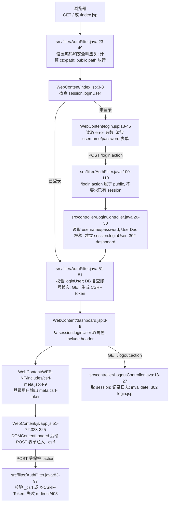

这条总链路里有两个核心状态：

1. **登录态**：服务端 session 中是否存在 `loginUser`。没有它，受保护 URL 会被 `AuthFilter` 302 到登录页。
2. **CSRF 态**：session 中是否存在 `_csrf_token`，且本次非安全 `.action` 请求是否提交了相同值。没有或不一致，业务 Controller 不会执行。

## 3. 登录请求生命周期：从浏览器表单到 `request.getParameter`

### 3.1 登录页如何产生请求

`login.jsp` 中登录表单是：

- `action="login.action"`：提交到当前应用上下文下的 `/login.action`。
- `method="post"`：浏览器用 POST 发送请求体。
- `<input name="username">`：用户名字段名是 `username`。
- `<input type="password" name="password">`：密码字段名是 `password`。

用户点击“登录”后，浏览器默认编码为 `application/x-www-form-urlencoded`，请求体类似：

```text
username=admin&password=admin123
```

这里的 `&` 只是参数分隔符，不是密码的一部分；如果用户名或密码含特殊字符，浏览器会 URL encode 后再发送。后端调用 `request.getParameter("username")` 和 `request.getParameter("password")` 时，Servlet 容器会从 POST 表单体解析出对应参数。

### 3.2 登录 sequence

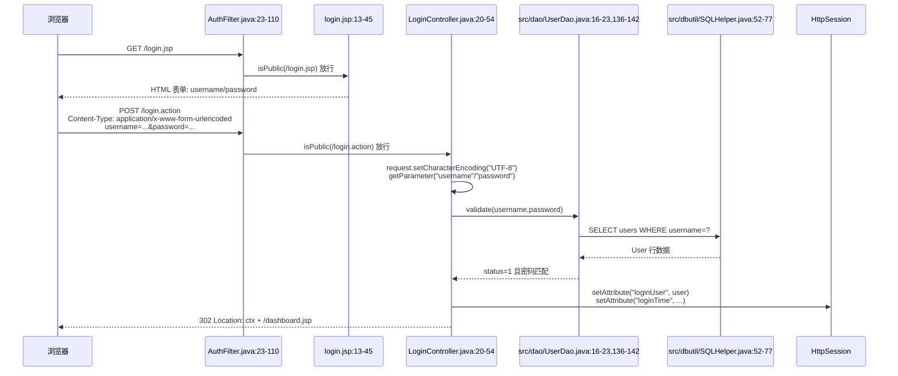

### 3.3 后端逐段解释

1. `LoginController` 的 Servlet 映射是 `/login.action`，所以表单 POST 命中这个控制器。
2. 控制器先 `request.setCharacterEncoding("UTF-8")`，保证表单体中的中文用户名等内容按 UTF-8 解析。
3. `request.getParameter("username")` 和 `request.getParameter("password")` 读取的就是登录页两个 input 的 `name` 字段，不是 label 文本，也不是 `id`。
4. 用户名或密码为空时，不进入数据库验证，直接 `WebUtil.redirect(request,response,"/login.jsp?error=empty")`。这会生成带上下文路径的 302，浏览器再 GET 登录页；登录页读取 `error=empty` 后显示“请输入用户名和密码”。
5. 控制器创建或获取 session：`request.getSession(true)`。这是登录成功后保存用户对象的容器。
6. `UserDao.validate` 先按 username 查数据库用户，再要求 `status=1`，最后用密码工具匹配提交密码和库内密码摘要。
7. 认证成功后，控制器再次取完整 `User`，把 `password` 置空，然后放入 `session.setAttribute("loginUser", user)`。这样后续请求不必每次重新输入密码，只要浏览器带同一个 `JSESSIONID` Cookie，服务端就能从 session 找到登录用户。
8. 登录成功还写入 `loginTime`，清理失败计数，记录登录日志，然后 302 到 `/dashboard.jsp`。
9. 认证失败时记录失败次数，302 到 `/login.jsp?error=1`；登录页根据 query 参数显示“用户名或密码错误”。

### 3.4 为什么登录成功要放 session

HTTP 请求本身是无状态的。登录 POST 只发生一次；如果不把认证结果保存到 session，下一次访问 `dashboard.jsp` 时服务端无法知道这是刚登录过的浏览器。把去密码后的 `User` 放进 session 有三个作用：

- 后续鉴权统一读取 `session.loginUser`，不用每个 JSP / Controller 自己重新校验用户名密码。
- 页面可以从 `loginUser.role` 判断展示 admin、teacher、student 哪一套功能。
- 配合服务端 session 生命周期，退出时一次 `invalidate()` 就能清理登录态。

## 4. 访问控制生命周期：`AuthFilter` 如何根据 path / role 放行或重定向

`AuthFilter` 标注 `@WebFilter("/*")`，说明它拦截应用内所有请求。它的处理顺序非常重要：

1. **统一编码和安全响应头**：先设置请求 / 响应 UTF-8，再给所有响应加安全头。
2. **计算路径**：取 `request.getRequestURI()` 和 `request.getContextPath()`，再截出应用内 `path`。
3. **隐藏上传直链**：如果 `path.startsWith("/uploads/")`，立即 404。
4. **公共路径放行**：登录页、登录动作、CSS、JS、错误页等无需 session。
5. **登录态检查**：非 public path 必须有 `session.loginUser`；没有则 302 到 `ctx + "/login.jsp"`。
6. **账号实时复查**：根据 session 用户 id 重新查数据库。账号被删除、停用或角色变化时，清空 session 并 302 到 `login.jsp?error=account_changed`。
7. **角色路径控制**：
   - `/admin/*` 只能 admin 访问。
   - `/teacher/*` 只能 teacher 访问。
   - `/student/*` 只能 student 访问。
   - 角色不匹配不返回 403，而是 302 到 `dashboard.jsp`，让用户回到自己角色可访问的首页。
8. **安全方法生成 token**：GET / HEAD / OPTIONS 请求会确保 session 中已有 CSRF token。
9. **非安全 `.action` 校验 CSRF**：受保护 POST 等动作必须提交 token，验证通过才 `chain.doFilter` 进入后续 Servlet / JSP。

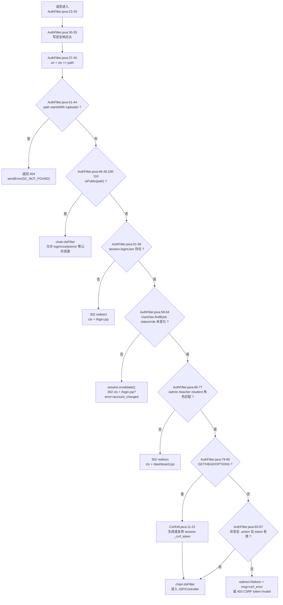

### 4.1 为什么要用统一 `AuthFilter`

如果每个 JSP 或 Controller 自己写登录检查，容易漏掉某个 URL，形成未授权访问。统一过滤器的好处是：

- 所有请求先过同一个入口，鉴权策略集中。
- 公共资源、登录页、角色路径、CSRF 校验顺序固定，减少重复代码。
- 安全响应头可在所有响应上一致生效，包括登录页和静态资源。
- 账号状态变化能在下一次请求立即生效：管理员停用某个用户后，该用户 session 会被过滤器复查并失效。

### 4.2 public path 为什么要放行

登录页和登录动作必须允许未登录访问，否则用户永远无法提交登录。CSS / JS 也必须放行，否则登录页虽然能打开，但样式、密码显示按钮、全局消息等前端功能加载失败。当前 public path 包括：

```text
/
/index.jsp
/login.jsp
/login.action
/css/*
/js/*
/error/*
```

注意：`/uploads/*` 虽然可能是静态文件路径，但过滤器在 public 判断之前先返回 404，因此它不是公共资源。

### 4.3 `index.jsp` 与 `dashboard.jsp` 的分工

`index.jsp` 不是业务主页，它只做入口跳转：

- session 中已有 `loginUser`：302 到 `dashboard.jsp`。
- 没有 `loginUser`：302 到 `login.jsp`。

`dashboard.jsp` 是登录后的角色首页。它直接从 `session.getAttribute("loginUser")` 取用户并读取 `role`。这依赖 `AuthFilter` 已经保证未登录请求不能进入该 JSP；否则 `loginUser.getRole()` 会空指针。

## 5. CSRF 生命周期：GET 生成 token，POST 校验 token

### 5.1 token 在哪里生成

CSRF token 保存在 session 属性 `_csrf_token` 中。`CsrfUtil.getToken(session)` 的逻辑是：

1. session 为空则返回 `null`。
2. session 中已有 `_csrf_token` 就复用。
3. 没有则用 `UUID.randomUUID().toString().replace("-", "")` 生成一个无横杠随机字符串。
4. 写回 session。

`AuthFilter` 在 GET / HEAD / OPTIONS 这类安全方法上调用 `CsrfUtil.getToken(session)`，目的是让用户打开页面时就准备好后续 POST 需要的 token。之后 JSP include 的 `csrf-meta.jsp` 也会在登录用户存在时输出：

```html
<meta name="csrf-token" content="...">
```

前端 `app.js` 在 `DOMContentLoaded` 后读取这个 meta，并给所有 POST 表单补一个隐藏字段：

```html
<input type="hidden" name="_csrf" value="...">
```

对于 `multipart/form-data` 文件上传表单，脚本还会把 `_csrf` 同步追加到 action URL 的查询参数里。这是为了让过滤器阶段的 `request.getParameter("_csrf")` 更稳定地拿到 token；某些 multipart 请求在进入业务上传解析前，不一定适合依赖普通表单字段完成安全校验。

### 5.2 token 在哪里校验

`AuthFilter` 的 CSRF 条件是：

```text
非 GET/HEAD/OPTIONS
并且 path 以 .action 结尾
并且 path 不是 /login.action
```

满足这些条件时，过滤器调用 `CsrfUtil.validate(request)`。校验顺序：

1. 取现有 session；没有 session，失败。
2. 从 session 取 `_csrf_token`；没有或为空，失败。
3. 先读请求参数 `_csrf`。
4. 参数没有时，再读请求头 `X-CSRF-Token`。
5. 提交值与 session 中的 expected 完全相等才通过。

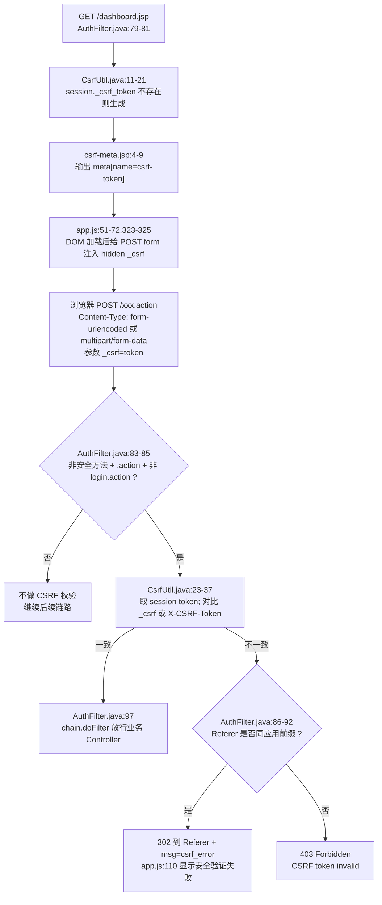

### 5.3 为什么 POST 要校验 CSRF

浏览器会自动携带同站点 session Cookie。如果用户已登录，攻击页面可能诱导浏览器向本系统发起 POST；没有 CSRF token 时，服务端只看到合法 Cookie，无法区分这是用户主动提交还是跨站伪造。把随机 token 存在 session，并要求页面表单或请求头提交同一个 token，可以证明请求来自本系统页面渲染出的上下文。

### 5.4 为什么 GET 生成 token 而不是 POST 时才生成

POST 到达过滤器时，业务操作已经准备执行，必须“校验已有 token”，不能临时生成一个再通过。GET 页面是用户正常进入表单的阶段，此时生成 token 并渲染到 meta，后续 POST 才有可提交的凭证。

### 5.5 当前退出接口的特殊点

`/logout.action` 使用 GET。按当前过滤器规则，GET 属于安全方法，不触发 CSRF 校验；但 `/logout.action` 不是 public path，所以仍要求已登录。请求到达 `LogoutController` 后：

1. `request.getSession(false)` 获取现有 session，不创建新 session。
2. 如果 session 里有 `loginUser`，记录退出日志。
3. `session.invalidate()` 清除登录态和 CSRF token。
4. 302 到 `/login.jsp`。

这解释了为什么退出后再访问 `dashboard.jsp` 会被过滤器重定向回登录页：原 session 已失效，新的请求找不到 `loginUser`。

## 6. 安全响应头与公共资源

`AuthFilter` 在判断 public path 之前就写安全响应头，因此登录页、CSS、JS、业务页、Controller 响应都会带这些头：

| Header | 当前值 / 作用 |
|---|---|
| `X-Content-Type-Options` | `nosniff`，要求浏览器不要把响应猜成其他 MIME 类型 |
| `X-Frame-Options` | `SAMEORIGIN`，限制页面只能被同源页面嵌入 frame |
| `X-XSS-Protection` | `1; mode=block`，兼容旧浏览器的 XSS 过滤开关 |
| `Strict-Transport-Security` | `max-age=31536000; includeSubDomains`，声明 HTTPS 访问策略；只有 HTTPS 下浏览器才会实际采纳 |
| `Content-Security-Policy` | 限制默认资源同源，允许 jsdelivr CDN、内联脚本 / 样式等项目当前需要的资源 |

登录页自己引用 `css/app.css` 和 `js/app.js`。这两个路径在 `/css/`、`/js/` public 规则内，所以未登录时也能加载。页面还引用 jsdelivr 的 Bootstrap CSS / JS，这类请求直接发往 CDN 域名，不经过本应用的 `AuthFilter`。

## 7. redirect 目的地汇总

| 触发条件 | 代码行为 | 浏览器下一跳 |
|---|---|---|
| `index.jsp` 发现已登录 | `response.sendRedirect("dashboard.jsp")` | GET `/dashboard.jsp` |
| `index.jsp` 发现未登录 | `response.sendRedirect("login.jsp")` | GET `/login.jsp` |
| 登录参数为空 | `WebUtil.redirect(..., "/login.jsp?error=empty")` | GET `ctx + /login.jsp?error=empty` |
| 登录账号被锁 | `WebUtil.redirect(..., "/login.jsp?error=locked")` | GET `ctx + /login.jsp?error=locked` |
| 登录成功 | `WebUtil.redirect(..., "/dashboard.jsp")` | GET `ctx + /dashboard.jsp` |
| 登录失败 | `WebUtil.redirect(..., "/login.jsp?error=1")` | GET `ctx + /login.jsp?error=1` |
| 未登录访问受保护路径 | `response.sendRedirect(ctx + "/login.jsp")` | GET `ctx + /login.jsp` |
| session 用户被删除 / 停用 / 角色变化 | `session.invalidate(); response.sendRedirect(ctx + "/login.jsp?error=account_changed")` | GET 登录页并带错误码 |
| 角色访问错目录 | `response.sendRedirect(ctx + "/dashboard.jsp")` | 回自己的仪表盘 |
| CSRF 失败且 Referer 是本应用 | `response.sendRedirect(appendMsg(referer,"csrf_error"))` | 回来源页，query 增加 `msg=csrf_error` |
| CSRF 失败且 Referer 不可信 | `sendError(403,"CSRF token invalid")` | 停止请求，显示 403 |
| 访问 `/uploads/*` | `sendError(404)` | 停止请求，显示 404 |
| 退出登录 | `session.invalidate(); WebUtil.redirect(..., "/login.jsp")` | GET `ctx + /login.jsp` |

## 8. 关键代码逐段解释

### 8.1 `login.jsp`

- `request.getParameter("error")` 读取 URL query 中的错误码，决定显示哪条登录失败提示。
- `<form action="login.action" method="post">` 决定浏览器向 `/login.action` 发 POST。
- `name="username"` / `name="password"` 决定后端 `getParameter` 的参数名。`id="password"` 只服务于前端“显示 / 隐藏密码”按钮，不参与后端取值。
- 登录页没有 include `csrf-meta.jsp`；这是符合当前后端规则的，因为 `/login.action` 是 public 并被 CSRF 校验排除。

### 8.2 `LoginController`

- `@WebServlet("/login.action")` 把 `.action` URL 绑定到这个 Servlet。
- `setCharacterEncoding` 必须在 `getParameter` 之前调用，否则 POST 体里的非 ASCII 字符可能已经按错误编码解析。
- 空值检查在数据库访问前完成，避免无效请求消耗数据库连接。
- `request.getSession(true)` 在登录流程中合理：即使之前没有 session，登录成功也需要创建一个来保存状态。
- `user.setPassword(null)` 是重要的安全处理，避免把密码摘要或密码字段放进 session。
- `session.setAttribute("loginUser", user)` 是整个后续鉴权链路的依据。
- 所有结果都用 redirect，不用 forward。这样登录成功或失败后的地址栏会变成目标页，刷新页面不会重复提交登录表单。

### 8.3 `AuthFilter`

- 安全响应头放在最前面，保证即使后面 public 放行、redirect 或错误响应也尽量带上统一安全策略。
- `path` 是去掉 `ctx` 的路径，用它做权限判断可以兼容不同部署上下文。
- `/uploads/` 先于 public 判断返回 404，说明上传文件不允许被当成普通静态目录直接访问。
- `isPublic` 只放行登录必需资源和错误页，不包含 dashboard、admin、teacher、student。
- session 中有 `loginUser` 还不够，过滤器会再查一次数据库确认账号仍存在、启用且角色未变化。
- 角色目录判断使用路径前缀：`/admin/`、`/teacher/`、`/student/`。不匹配时重定向到 dashboard，而不是让用户留在无权限 URL。
- CSRF 校验只发生在受保护的非安全 `.action` 请求上；普通 GET 页面不会被拦截，但会生成 token。

### 8.4 `CsrfUtil`、`csrf-meta.jsp`、`app.js`

- `CsrfUtil.TOKEN_ATTR="_csrf_token"` 是 session 内部保存名；`PARAM_NAME="_csrf"` 是浏览器提交名。
- `getToken` 是懒生成：第一次 GET 页面时创建，之后同一 session 复用。
- `validate` 同时支持参数 `_csrf` 和请求头 `X-CSRF-Token`。参数适合普通表单；请求头适合脚本请求。
- `csrf-meta.jsp` 只在 `loginUser != null` 时输出 token，避免未登录页面暴露无意义 token。
- `app.js` 不要求每个表单手写隐藏字段，而是在 DOM 加载后统一扫描 POST 表单并注入 `_csrf`。

### 8.5 `UserDao`、`SQLHelper`、`jdbc.properties`

- `UserDao.findByUsername` 使用 `WHERE username=?`，参数通过 `SQLHelper` 绑定进 `PreparedStatement`，不是字符串拼接。
- `UserDao.validate` 要求用户存在且 `status=1`，再做密码匹配。
- `AuthFilter` 的账号复查使用 `UserDao.findById`，不是完全信任 session 中旧对象。
- `SQLHelper` 启动时从 classpath 读取 `jdbc.properties`，创建 Druid 数据源；查询时获取连接、prepare SQL、绑定参数、执行查询、最后关闭资源。

## 9. 代码证据清单

- `WebContent/login.jsp:13-21`
- `WebContent/login.jsp:32-45`
- `WebContent/login.jsp:55-56`
- `WebContent/index.jsp:3-8`
- `WebContent/dashboard.jsp:3-9`
- `WebContent/dashboard.jsp:211-211`
- `WebContent/WEB-INF/includes/header.jsp:7-12`
- `WebContent/WEB-INF/includes/footer.jsp:17-18`
- `WebContent/WEB-INF/includes/csrf-meta.jsp:4-9`
- `WebContent/js/app.js:51-72`
- `WebContent/js/app.js:74-83`
- `WebContent/js/app.js:100-113`
- `WebContent/js/app.js:323-324`
- `src/controller/LoginController.java:16-22`
- `src/controller/LoginController.java:24-29`
- `src/controller/LoginController.java:31-38`
- `src/controller/LoginController.java:40-54`
- `src/controller/LoginController.java:57-61`
- `src/controller/LogoutController.java:14-27`
- `src/filter/AuthFilter.java:18-35`
- `src/filter/AuthFilter.java:37-49`
- `src/filter/AuthFilter.java:51-64`
- `src/filter/AuthFilter.java:66-77`
- `src/filter/AuthFilter.java:79-97`
- `src/filter/AuthFilter.java:100-121`
- `src/util/CsrfUtil.java:8-21`
- `src/util/CsrfUtil.java:23-37`
- `src/util/WebUtil.java:8-27`
- `src/dao/UserDao.java:16-23`
- `src/dao/UserDao.java:34-41`
- `src/dao/UserDao.java:136-142`
- `src/dbutil/SQLHelper.java:19-27`
- `src/dbutil/SQLHelper.java:30-46`
- `src/dbutil/SQLHelper.java:52-77`
- `src/dbutil/SQLHelper.java:96-115`
- `src/dbutil/SQLHelper.java:139-155`
- `src/jdbc.properties:2-18`


---

# 02. 选题浏览、申请、课题管理与审批的数据流

本部分只覆盖普通选题业务：学生浏览/申请选题、学生查看自己的申请记录、教师管理课题、教师审批学生申请。不包含任何 AI 模块。

核心结论：这个模块把“查询页面”和“修改状态”分得比较清楚。GET 负责读取条件并渲染页面；POST 负责新增申请、增删改课题、审批申请。POST 成功或失败后基本都用 `WebUtil.redirect(...)` 跳转回列表页，通过 `msg` 查询参数携带结果，属于典型 PRG（Post/Redirect/Get）写法，可以避免浏览器刷新时重复提交表单。

---

## 1. URL、方法、参数与页面入口总览

| 使用者 | 业务动作 | URL | 方法 | 请求体 Content-Type | 参数来源 | 后端入口 | 最终视图/跳转 |
|---|---|---:|---:|---|---|---|---|
| 学生 | 浏览/搜索开放课题 | `/student/topic.action` | GET | 无请求体，参数在 query string | `keyword`、`college` | `StudentTopicController.doGet` | forward 到 `/student/topics.jsp` |
| 学生 | 提交选题申请 | `/student/topic.action` | POST | 默认 `application/x-www-form-urlencoded` | hidden/input/textarea：`action`、`topicId`、`applyReason` | `StudentTopicController.doPost` | redirect 到 `/student/my-selection.jsp?msg=apply_ok` 或 `/student/topic.action?msg=...` |
| 学生 | 查看我的选题 | `/student/my-selection.jsp` | GET | 无请求体 | 无必需参数；`msg=apply_ok` 当前 JSP 未显示 | JSP 直接调用 `SelectionDao.findByStudent` | 直接渲染 JSP |
| 教师 | 查看自己发布的课题 | `/teacher/topic.action` | GET | 无请求体 | 无 | `TeacherTopicController.doGet` | forward 到 `/teacher/topics.jsp` |
| 教师 | 发布课题 | `/teacher/topic.action` | POST | 默认 `application/x-www-form-urlencoded` | `action=add`、`title`、`description`、`college`、`maxStudents`、`status` | `TeacherTopicController.doPost` | redirect 到 `/teacher/topic.action?msg=add_ok` 或错误 msg |
| 教师 | 编辑课题 | `/teacher/topic.action` | POST | 默认 `application/x-www-form-urlencoded` | `action=edit`、`id`、`title`、`description`、`college`、`maxStudents`、`status` | `TeacherTopicController.doPost` | redirect 到 `/teacher/topic.action?msg=edit_ok` 或错误 msg |
| 教师 | 删除课题 | `/teacher/topic.action` | POST | 默认 `application/x-www-form-urlencoded` | `action=delete`、`id` | `TeacherTopicController.doPost` | redirect 到 `/teacher/topic.action?msg=delete_ok` 或 `delete_failed` |
| 教师 | 查看申请审批列表 | `/teacher/selection.action` | GET | 无请求体，参数在 query string | `status=pending/approved/rejected/all` | `TeacherSelectionController.doGet` | forward 到 `/teacher/selections.jsp` |
| 教师 | 批准/驳回申请 | `/teacher/selection.action` | POST | 默认 `application/x-www-form-urlencoded` | `action=approve/reject`、`id`、`reviewComment` | `TeacherSelectionController.doPost` | redirect 到 `/teacher/selection.action?msg=approved/rejected/...` |

### 1.1 特殊 URL 和表单约定

- `.action` 不是磁盘上的 JSP 文件，而是 Servlet 映射名。例如 `@WebServlet("/student/topic.action")` 把 `/student/topic.action` 交给 `StudentTopicController`，`@WebServlet("/teacher/topic.action")` 把 `/teacher/topic.action` 交给 `TeacherTopicController`。
- `?keyword=xx&college=yy`、`?status=pending` 这种写法叫查询字符串。`?` 后面是参数，多个参数用 `&` 连接。Controller 用 `request.getParameter("keyword")`、`request.getParameter("college")`、`request.getParameter("status")` 读取。
- `?action=apply` 从语法上也可以表示查询参数，但当前学生申请表单不是把 `action=apply` 放在 URL 里，而是通过 `<input type="hidden" name="action" value="apply">` 放在 POST 请求体里。Controller 读取方式仍然是 `request.getParameter("action")`。
- `&msg=...` 中的 `msg` 是 redirect 后给 JSP 或下一次 Controller 使用的结果码。比如 `/student/topic.action?msg=quota_full` 表示返回课题列表时显示“名额已满”提示。
- `method="post"` 表示浏览器把表单字段编码进请求体，而不是拼在 URL 后面；未设置 `enctype` 时，浏览器默认使用 `application/x-www-form-urlencoded`。
- hidden input 是页面上不可见、但会随表单一起提交的字段。本模块用 hidden input 传 `action`、`topicId`、`id`，让同一个 URL 根据 `action` 分支执行不同业务。
- `../teacher/selection.action` 是相对路径。教师审批 JSP 里表单写这个路径，浏览器会把它解析到同一个 Web 应用下的 `/teacher/selection.action`，用于把 modal 里的审批表单提交到教师审批 Controller。
- 状态值约定：
  - 课题状态：`open` 表示可申请；`closed` 表示关闭或名额已满。
  - 选题申请状态：`pending` 表示待审批；`approved` 表示通过；`rejected` 表示驳回。
  - `selected_count` 是 `topics` 表中已批准人数计数，用来和 `max_students` 比较，决定名额是否已满。

---

## 2. 学生 GET 浏览/搜索课题

### 2.1 浏览器发送了什么

学生在浏览课题页看到一个 GET 搜索表单。表单的 `action="topic.action"` 是相对 URL，在 `/student/topic.action` 对应页面中会解析为当前目录下的 `/student/topic.action`；`method="get"` 表示字段拼进 URL 查询字符串。

表单字段和 Controller 参数一一对应：

| JSP 位置 | HTML 字段 | 浏览器请求示例 | Controller 读取 | 含义 |
|---|---|---|---|---|
| `WebContent/student/topics.jsp:39-43` | `<input name="keyword">` | `/student/topic.action?keyword=算法` | `request.getParameter("keyword")` | 按课题标题或描述模糊搜索 |
| `WebContent/student/topics.jsp:44-50` | `<select name="college">` | `/student/topic.action?college=computer` | `request.getParameter("college")` | 按学院筛选 |

如果两个字段都为空，请求就是 `/student/topic.action`，DAO 会查询所有仍开放且未满员的课题。

### 2.2 Mermaid：学生 GET 浏览课题数据流

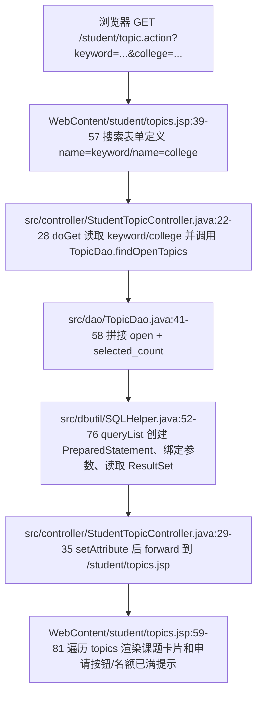

### 2.3 Controller 逐段解释

`StudentTopicController.doGet` 的关键逻辑是：

1. `request.getParameter("keyword")` 和 `request.getParameter("college")` 读取 GET 查询参数。这里不修改数据库，只把筛选条件传给 DAO。
2. 从 session 取 `loginUser`，用于后续判断这个学生是否已经有待审批或已通过的选题申请。
3. `TopicDao.findOpenTopics(keyword, college)` 只返回 `status='open'` 且 `selected_count < max_students` 的课题，所以学生端默认看不到已关闭或已满员课题。
4. `new SelectionDao().hasPendingOrApproved(user.getId())` 判断当前学生是否已有 `pending` 或 `approved` 申请。如果有，JSP 不再显示“申请选题”按钮，而显示“您已有选题申请”。
5. 最后用 `request.getRequestDispatcher("/student/topics.jsp").forward(...)` 服务端转发到 JSP。forward 不是浏览器重定向，浏览器地址栏仍是 `/student/topic.action`，JSP 直接使用 request attribute 渲染页面。

### 2.4 DAO 与 SQL 执行

`TopicDao.findOpenTopics` 是普通查询，不开启事务：

- 初始 SQL 固定包含 `WHERE t.status='open' AND t.selected_count < t.max_students`，这保证学生浏览页只展示可申请且未满员的课题。
- 如果 `keyword` 非空，追加 `AND (t.title LIKE ? OR t.description LIKE ?)`，并把 `%keyword%` 放进参数列表。这里使用 `?` 占位符，不是字符串拼接用户输入，可以避免常见 SQL 注入。
- 如果 `college` 非空，追加 `AND t.college=?`。
- 最后按 `t.created_at DESC` 倒序展示。
- 进入 `SQLHelper.queryList` 后，每次查询从 Druid 连接池取连接，创建 `PreparedStatement`，调用 `bindParams` 逐个绑定参数，再执行 `executeQuery` 并把每行转换成 `Object[]`。

这个 GET 流程的设计原因是：浏览/搜索是幂等读操作，不应该改变数据库，所以不需要 POST，也不需要事务锁。真正涉及名额占用的动作在“申请”和“审批”阶段完成。

---

## 3. 学生 POST 申请选题

### 3.1 浏览器发送了什么

学生点击“申请选题”按钮时，先执行前端 JS，把具体课题 id 填入 hidden input，再弹出 modal。提交 modal 后浏览器发送 POST 请求到 `/student/topic.action`。

字段对应关系：

| JSP 位置 | HTML 字段 | 提交值来源 | Controller 读取 | 含义 |
|---|---|---|---|---|
| `WebContent/student/topics.jsp:86-87` | `name="action"` hidden | 固定值 `apply` | `request.getParameter("action")` | 告诉 `doPost` 走申请分支 |
| `WebContent/student/topics.jsp:88` | `name="topicId"` hidden | JS `applyTopic(id,title)` 填入 | `Integer.parseInt(request.getParameter("topicId"))` | 被申请的课题 id |
| `WebContent/student/topics.jsp:91-92` | `name="applyReason"` textarea | 学生填写 | `request.getParameter("applyReason")` | 申请理由 |

这里的 `topicId` 不是用户直接输入的文本框，而是 hidden input。hidden 只能减少界面干扰，不能当安全机制；后端仍必须校验课题是否存在、是否开放、是否满员。

### 3.2 Mermaid：学生 POST apply 数据流

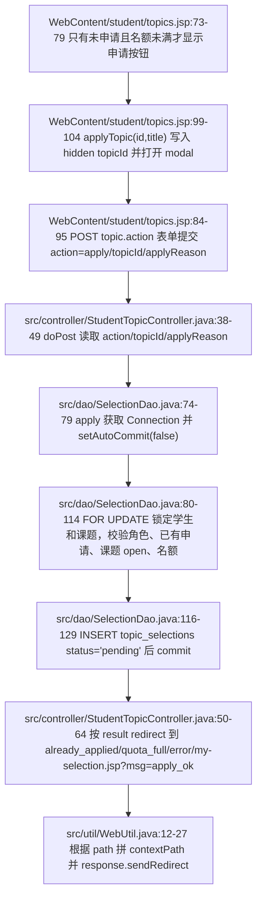

### 3.3 Controller 逐段解释

`StudentTopicController.doPost` 的关键分支：

1. `request.setCharacterEncoding("UTF-8")` 放在读取参数前，保证中文申请理由按 UTF-8 解码。
2. `String action = request.getParameter("action")` 读取 hidden input。只有 `"apply".equals(action)` 才执行申请逻辑；其他 action 直接 redirect 回 `/student/topic.action`。
3. `topicId` 用 `Integer.parseInt(...)` 转为整数，`applyReason` 作为字符串传给 DAO。
4. `dao.apply(user.getId(), topicId, reason)` 返回业务结果：
   - `-1`：学生已有 `pending` 或 `approved` 申请，redirect 到 `/student/topic.action?msg=already_applied`。
   - `-2`：课题不可申请或名额已满，redirect 到 `/student/topic.action?msg=quota_full`。
   - `<=0`：其他失败，redirect 到 `/student/topic.action?msg=error`。
   - `>0`：插入成功，记录操作日志，然后 redirect 到 `/student/my-selection.jsp?msg=apply_ok`。

学生课题列表 JSP 只对 `already_applied` 和 `quota_full` 做了提示映射；`error` 会出现在 URL 中，但当前 JSP 没有显示对应文案。`my-selection.jsp` 也会收到 `msg=apply_ok`，但当前文件没有解析这个参数，只负责展示申请列表。

### 3.4 DAO 事务与并发控制

申请选题不是单条普通 SQL，而是一个事务，因为它同时依赖“学生是否已有申请”和“课题是否还有名额”两个条件。没有事务时，两个并发请求可能同时看到名额未满，导致超额申请或重复申请。

`SelectionDao.apply` 的事务步骤：

1. `SQLHelper.getConnection()` 从连接池取连接，`conn.setAutoCommit(false)` 关闭自动提交，开始手工事务。
2. `SELECT role,status FROM users WHERE id=? FOR UPDATE` 锁定当前学生行，并确认用户确实是启用状态的学生。这个锁把同一学生的并发申请串行化。
3. 查询 `topic_selections` 中是否已经存在同一学生的 `pending` 或 `approved` 申请。如果有，rollback 并返回 `-1`。
4. `SELECT status,max_students,selected_count FROM topics WHERE id=? FOR UPDATE` 锁定课题行，并确认课题 `status='open'` 且 `selected_count < max_students`。这个锁防止多个学生同时申请同一满员边界课题时读到旧名额。
5. 插入 `topic_selections(student_id,topic_id,status,apply_reason)`，状态固定为 `pending`。注意：申请阶段不增加 `selected_count`，因为只有教师批准后才真正占用名额。
6. `conn.commit()` 提交事务；任何异常都会 rollback，finally 中恢复自动提交并关闭连接。

这个设计的关键是：学生申请只创建“待审批”记录，不直接改变课题人数；真正修改 `selected_count` 的位置在教师批准审批时。

---

## 4. 学生查看“我的选题”

学生申请成功后 redirect 到 `/student/my-selection.jsp?msg=apply_ok`。这个 JSP 没有经过 Controller，而是在页面脚本中直接创建 `SelectionDao` 查询。

关键数据流：

- JSP 从 session 中取 `loginUser`。
- 调用 `new SelectionDao().findByStudent(loginUser.getId())`。
- DAO 使用 `SELECT_SQL + "WHERE s.student_id=? ORDER BY s.apply_time DESC"` 查询该学生所有申请。
- 页面展示课题、指导教师、申请理由、申请时间、状态、审批意见。

这里的 `msg=apply_ok` 只是 URL 上的结果码，当前 `my-selection.jsp` 没有读取它。因此用户看到的是申请记录本身，而不是额外的“申请成功”alert。

---

## 5. 教师 GET 查看自己发布的课题

教师进入 `/teacher/topic.action` 时，`TeacherTopicController.doGet` 从 session 取教师用户，调用 `TopicDao.findByTeacher(user.getId())`，只查询 `t.teacher_id=?` 的课题，然后设置：

- `topics`：教师自己的课题列表；
- `collegeOptions`：学院下拉框选项；
- `topicStatusOptions`：课题状态下拉框选项。

随后 forward 到 `/teacher/topics.jsp`。JSP 如果直接访问时没有 `topics` request attribute，会 redirect 回 `/teacher/topic.action`，保证页面数据由 Controller 准备。

这个设计保证教师课题列表不是全站课题列表，而是当前登录教师自己的课题。

---

## 6. 教师 POST 发布、编辑、删除课题

### 6.1 表单字段与 getParameter 对应

教师课题管理页有三类 POST 表单，共用 `/teacher/topic.action`，通过 hidden `action` 分支。

| 操作 | JSP 位置 | 表单字段 name | Controller 读取 | 说明 |
|---|---|---|---|---|
| 发布 | `WebContent/teacher/topics.jsp:71-72` | `action=add` | `request.getParameter("action")` | 进入 add 分支 |
| 发布 | `WebContent/teacher/topics.jsp:75` | `title` | `request.getParameter("title")` | 课题名称 |
| 发布 | `WebContent/teacher/topics.jsp:76` | `description` | `request.getParameter("description")` | 课题描述 |
| 发布 | `WebContent/teacher/topics.jsp:79-84` | `college` | `request.getParameter("college")` | 所属学院 |
| 发布 | `WebContent/teacher/topics.jsp:86` | `maxStudents` | `Integer.parseInt(request.getParameter("maxStudents"))` | 最大人数 |
| 发布 | `WebContent/teacher/topics.jsp:88-92` | `status` | `request.getParameter("status")` | 初始状态，一般为 open/closed |
| 编辑 | `WebContent/teacher/topics.jsp:101-103` | `action=edit`、`id` | `action`、`id` | 指定编辑哪条课题 |
| 编辑 | `WebContent/teacher/topics.jsp:106-120` | `title`、`description`、`college`、`maxStudents`、`status` | 同名 `getParameter` | 保存编辑后的字段 |
| 删除 | `WebContent/teacher/topics.jsp:59-62` | `action=delete`、`id` | `action`、`id` | 删除指定课题 |

### 6.2 Mermaid：教师 POST add/edit/delete topic 数据流

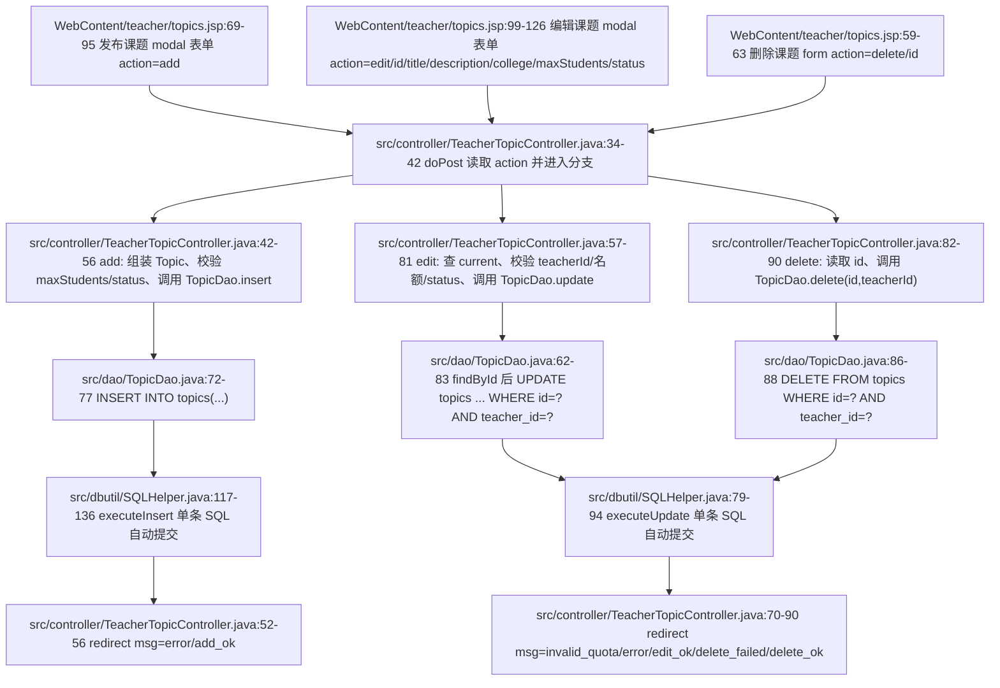

### 6.3 发布课题逻辑解释

发布课题时，Controller 创建一个新的 `Topic` 对象：

- `title`、`description`、`college`、`maxStudents`、`status` 都来自表单同名字段；
- `teacherId` 不来自表单，而是来自 session 中的 `loginUser.getId()`。这是安全设计：浏览器不能自己声明“我是哪个教师”；
- `maxStudents < 1` 或 `status` 不在字典中时，直接 redirect 到 `/teacher/topic.action?msg=error`；
- DAO 插入成功后 redirect 到 `/teacher/topic.action?msg=add_ok`。

`TopicDao.insert` 是普通单条插入 SQL：

```sql
INSERT INTO topics(title,description,teacher_id,college,max_students,status)
VALUES(?,?,?,?,?,?)
```

它通过 `SQLHelper.executeInsert` 执行，使用 `PreparedStatement.RETURN_GENERATED_KEYS` 获取自增 id。这里不需要显式事务，因为只写一张表的一行，不涉及跨表一致性判断。

### 6.4 编辑课题逻辑解释

编辑课题比发布多了几个后端校验：

1. 从表单读 `id`，先 `dao.findById(id)` 查当前课题。
2. 如果 `current == null`，说明课题不存在，拒绝。
3. 如果 `current.getTeacherId() != user.getId()`，说明当前教师不是课题所有者，拒绝。这是 Controller 层的归属校验。
4. 如果新 `maxStudents` 小于当前 `selectedCount`，拒绝，避免已批准人数大于最大人数。
5. 如果新状态不在字典中，拒绝。
6. 如果当前已选人数已经达到或超过新最大人数，强制把课题状态改为 `closed`。
7. 最后调用 `TopicDao.update`。

`TopicDao.update` 的 SQL 还带了第二层归属校验：

```sql
UPDATE topics
SET title=?,description=?,college=?,max_students=?,status=?
WHERE id=? AND teacher_id=?
```

即使有人篡改 hidden `id`，只要这个课题不是当前教师的，`WHERE id=? AND teacher_id=?` 就不会更新任何行。

### 6.5 删除课题逻辑解释

删除表单只提交 `action=delete` 和课题 `id`。Controller 仍然用 session 中的教师 id 调用 `dao.delete(id, user.getId())`。DAO SQL 是：

```sql
DELETE FROM topics WHERE id=? AND teacher_id=?
```

所以教师只能删除自己的课题。删除成功 redirect `msg=delete_ok`；影响行数为 0 时 redirect `msg=delete_failed`。

需要注意：当前 `TopicDao.delete` 本身只执行删除 SQL，没有在 DAO 中显式检查该课题是否已有选题申请；是否能删除取决于数据库外键约束或执行结果。如果数据库因为外键拒绝删除，`SQLHelper.executeUpdate` 捕获异常并返回 0，Controller 会走 `delete_failed`。

### 6.6 教师课题管理的 msg 显示

教师课题 JSP 当前显示这些结果码：

- `add_ok`：课题发布成功；
- `edit_ok`：课题更新成功；
- `delete_ok`：课题删除成功；
- `delete_failed`：删除课题失败。

Controller 还可能 redirect `msg=error`、`msg=invalid_quota`，但当前 JSP 没有为这两个值设置 `msgTitle/msgContent`，所以 URL 会带结果码，页面不显示对应 alert。

---

## 7. 教师 GET 查看审批列表

教师审批列表使用 `/teacher/selection.action` 的 GET 请求，查询参数是 `status`。

| JSP 链接位置 | URL | Controller 读取 | DAO 查询含义 |
|---|---|---|---|
| `WebContent/teacher/selections.jsp:19` | `selection.action?status=pending` | `request.getParameter("status")` | 只查待审批 |
| `WebContent/teacher/selections.jsp:20` | `selection.action?status=approved` | 同上 | 只查已通过 |
| `WebContent/teacher/selections.jsp:21` | `selection.action?status=rejected` | 同上 | 只查已驳回 |
| `WebContent/teacher/selections.jsp:22` | `selection.action?status=all` | 同上 | Controller 把 all 转成 null，DAO 不加状态条件 |

Controller 如果没有收到 `status`，默认设为 `pending`。DAO 查询时固定带教师归属条件 `WHERE t.teacher_id=?`，所以教师审批列表只出现自己课题下的申请。

---

## 8. 教师 POST 批准/驳回申请

### 8.1 表单字段与 getParameter 对应

审批按钮不是直接提交表单，而是先调用 `reviewSel(id, action, name)`，由 JS 把当前申请 id 和操作类型写入 modal 的 hidden input。

| JSP 位置 | HTML/JS | 提交字段 | Controller 读取 | 含义 |
|---|---|---|---|---|
| `WebContent/teacher/selections.jsp:40-42` | 待审批行显示“批准/驳回”按钮 | 无直接提交 | 无 | 只有 `pending` 申请才显示审批按钮 |
| `WebContent/teacher/selections.jsp:55-57` | hidden inputs | `action`、`id` | `request.getParameter("action")`、`request.getParameter("id")` | 操作类型和申请 id |
| `WebContent/teacher/selections.jsp:60-61` | textarea | `reviewComment` | `request.getParameter("reviewComment")` | 审批意见 |
| `WebContent/teacher/selections.jsp:68-74` | `reviewSel` JS | 写入 `reviewAction`、`reviewId` | 通过 POST 提交后读取 | 把按钮对应的 approve/reject 和申请 id 带到后端 |

`action` 在页面按钮中是 `approve` 或 `reject`，Controller 会把它转换成数据库状态 `approved` 或 `rejected`。

### 8.2 Mermaid：教师 POST approve/reject 数据流

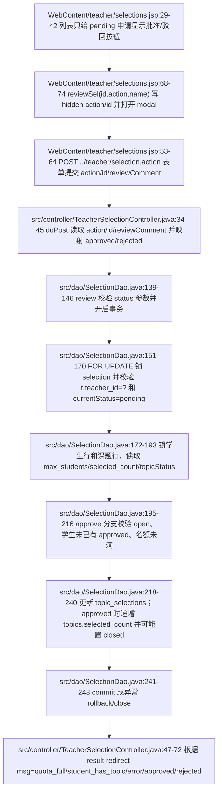

### 8.3 Controller 逐段解释

`TeacherSelectionController.doPost` 只接受两种 action：

- `approve`：转换为数据库状态 `approved`；
- `reject`：转换为数据库状态 `rejected`。

之后读取：

- `id`：申请记录 id；
- `reviewComment`：审批意见；
- `user.getId()`：当前教师 id，来自 session，不相信表单传来的教师身份。

DAO 返回值含义：

- `-1`：课题非 open 或名额已满，redirect `/teacher/selection.action?msg=quota_full`；
- `-2`：学生已有其他已通过课题，redirect `/teacher/selection.action?msg=student_has_topic`；
- `<=0`：无权限、状态不是 pending、更新失败等，redirect `/teacher/selection.action?msg=error`；
- `>0`：审批成功，发送站内通知，记录操作日志，redirect `/teacher/selection.action?msg=approved` 或 `?msg=rejected`。

当前 `teacher/selections.jsp` 没有解析 `msg` 参数显示 alert；并且 redirect 没有保留原来的 `status` 筛选参数，所以审批后再次 GET 时 `status` 缺省为 `pending`，通常会回到待审批列表。

### 8.4 DAO 事务与并发控制

审批通过会真正占用名额并更新 `selected_count`，所以它必须比普通查询更严格。`SelectionDao.review` 采用手工事务和多处 `FOR UPDATE` 锁。

事务步骤：

1. 先校验传入状态只能是 `approved` 或 `rejected`。Controller 已经映射过一次，DAO 再校验一次，防止错误调用。
2. `conn.setAutoCommit(false)` 开启事务。
3. 用 `SELECT s.student_id,s.topic_id,s.status FROM topic_selections s JOIN topics t ... WHERE s.id=? AND t.teacher_id=? FOR UPDATE` 锁定申请行，并同时校验这个申请属于当前教师的课题。这里是教师只能审批自己课题申请的核心。
4. 如果当前申请状态不是 `pending`，rollback 返回 0，防止重复批准或重复驳回。
5. `SELECT id FROM users WHERE id=? FOR UPDATE` 锁定学生行，使同一学生相关审批串行化。
6. `SELECT max_students,selected_count,status FROM topics WHERE id=? FOR UPDATE` 锁定课题行，读取名额和状态。
7. 如果目标状态是 `approved`，还要检查：
   - 课题必须是 `open`；
   - 该学生不能已经有其他 `approved` 申请；
   - `selected_count < max_students`。
8. 更新 `topic_selections`：`status=?`、`review_comment=?`、`review_time=NOW()`，并且 SQL 带 `WHERE id=? AND status='pending'`，再次防止并发下重复审批。
9. 如果是批准，再更新 `topics`：`selected_count=selected_count+1`；如果加 1 后达到 `max_students`，用 `CASE WHEN selected_count+1>=max_students THEN 'closed' ELSE status END` 自动关闭课题。
10. 全部成功才 `commit`；中途任意失败或异常都 rollback。

这个设计解决两个并发问题：

- 多个教师端窗口同时审批同一条申请时，只有第一个能把 `pending` 改成终态；
- 多个学生/多个申请竞争同一个课题最后一个名额时，课题行锁和 `selected_count` 检查保证不会批准超过最大人数。

---

## 9. 普通 SQL、事务 SQL 与 SQLHelper 的边界

### 9.1 普通 SQL：TopicDao

课题列表、发布、编辑、删除大多是单条 SQL：

- `findByTeacher`、`findOpenTopics`：调用 `SQLHelper.queryList`；
- `insert`：调用 `SQLHelper.executeInsert`；
- `update`、`delete`：调用 `SQLHelper.executeUpdate`。

这些方法没有显式 `conn.setAutoCommit(false)`，依赖 JDBC 默认自动提交。单条 SQL 成功即提交，失败时 `SQLHelper` 打印错误并返回空列表、0 或 null。

### 9.2 事务 SQL：SelectionDao.apply/review

申请和审批不是单条 SQL，而是多次读取、校验、写入的组合，必须共享同一个 `Connection`：

- 通过 `SQLHelper.getConnection()` 只取连接，不交给 `SQLHelper.queryList/executeUpdate`，因为后者每次都会自己开关连接，无法组成事务。
- 手动 `conn.setAutoCommit(false)`；
- 使用 `PreparedStatement` 和 `FOR UPDATE` 锁定关键行；
- 成功 `commit`，失败 `rollback`；
- finally 中 `conn.setAutoCommit(true)` 并关闭连接。

这就是为什么 `TopicDao` 看起来短，而 `SelectionDao.apply/review` 明显更长：后者在处理跨表状态一致性和并发边界。

### 9.3 WebUtil.redirect 的作用

Controller 中传入的路径多数以 `/` 开头，例如 `/teacher/topic.action?msg=add_ok`。`WebUtil.redirect` 遇到这种路径会自动拼上 `request.getContextPath()`，再调用 `response.sendRedirect(...)`。这样项目部署在非根路径时，redirect 仍能跳回正确 Web 应用。

---

## 10. 设计原因总结

1. **GET 只渲染页面**：浏览课题和筛选审批列表都只是读数据，使用 GET 可以让 URL 表达筛选条件，也方便刷新、收藏和返回。
2. **POST 修改状态**：申请、发布、编辑、删除、审批都会改变数据库，使用 POST 避免把修改动作暴露为普通链接点击。
3. **POST 后 redirect**：修改完成后不直接 forward 到 JSP，而是 redirect 回列表页，避免浏览器刷新时重复提交表单。这就是 PRG。
4. **申请/审批需要事务**：选题人数和学生唯一选题是竞争资源。必须在同一事务里锁住学生和课题，再检查、插入或更新。
5. **教师只能操作自己的数据**：教师 id 从 session 取，不从表单取；编辑先检查 `current.teacherId`；update/delete SQL 带 `teacher_id=?`；审批查询通过 `JOIN topics` 并加 `t.teacher_id=?`。
6. **hidden input 只传业务分支，不承担信任**：`action`、`topicId`、`id` 都可以被浏览器篡改，所以后端用数据库条件和事务重新校验归属、状态、名额。

---

## 11. 代码证据清单

- `WebContent/student/topics.jsp:8-20`：读取 Controller 放入的 `topics`、`keyword`、`collegeFilter`、`hasApplied`、`collegeOptions`。
- `WebContent/student/topics.jsp:22-27`：学生课题列表页对 `msg=already_applied`、`msg=quota_full` 的提示映射。
- `WebContent/student/topics.jsp:39-57`：学生 GET 搜索表单，字段 `keyword`、`college`。
- `WebContent/student/topics.jsp:73-79`：根据 `hasApplied` 和 `selected_count/maxStudents` 决定显示申请按钮、已有申请或名额已满。
- `WebContent/student/topics.jsp:84-95`：学生申请 modal POST 表单，hidden `action=apply`、hidden `topicId`、textarea `applyReason`。
- `WebContent/student/topics.jsp:99-104`：`applyTopic` JS 写入 `applyTopicId` 并打开 modal。
- `WebContent/student/my-selection.jsp:5-8`：学生“我的选题”直接从 session 取用户并调用 `SelectionDao.findByStudent`。
- `WebContent/student/my-selection.jsp:22-34`：学生选题记录表格渲染课题、教师、申请理由、状态、审批意见。
- `WebContent/teacher/topics.jsp:7-15`：教师课题页依赖 Controller 注入 `topics`、学院选项、状态选项，缺失时 redirect 回 action。
- `WebContent/teacher/topics.jsp:19-25`：教师课题页对 `add_ok`、`edit_ok`、`delete_ok`、`delete_failed` 的提示映射。
- `WebContent/teacher/topics.jsp:59-63`：教师删除课题 POST 表单，hidden `action=delete`、`id`。
- `WebContent/teacher/topics.jsp:69-95`：教师发布课题 POST 表单，字段 `action`、`title`、`description`、`college`、`maxStudents`、`status`。
- `WebContent/teacher/topics.jsp:99-126`：教师编辑课题 POST 表单，字段 `action`、`id`、`title`、`description`、`college`、`maxStudents`、`status`。
- `WebContent/teacher/topics.jsp:130-139`：`editTopic` JS 把课题当前值写入编辑 modal。
- `WebContent/teacher/selections.jsp:6-12`：教师审批页读取 `statusFilter` 和 `selections`，缺失时 redirect 回 action。
- `WebContent/teacher/selections.jsp:18-23`：教师审批 GET 筛选链接，`status=pending/approved/rejected/all`。
- `WebContent/teacher/selections.jsp:39-45`：只有 `pending` 申请显示批准/驳回按钮，非 pending 显示审批意见。
- `WebContent/teacher/selections.jsp:53-64`：教师审批 POST 表单，action 为 `../teacher/selection.action`，字段 `action`、`id`、`reviewComment`。
- `WebContent/teacher/selections.jsp:68-74`：`reviewSel` JS 写入 hidden `reviewId`、`reviewAction`。
- `src/controller/StudentTopicController.java:19-35`：学生课题 Servlet 映射、GET 读取 `keyword/college`、查询开放课题、设置 request attribute 并 forward。
- `src/controller/StudentTopicController.java:38-67`：学生 POST 读取 `action/topicId/applyReason`，调用 `SelectionDao.apply`，按返回值 redirect。
- `src/controller/TeacherTopicController.java:19-31`：教师课题 Servlet 映射、GET 查询当前教师课题并 forward。
- `src/controller/TeacherTopicController.java:34-56`：教师 POST add 分支读取表单字段、校验并 insert，redirect `add_ok/error`。
- `src/controller/TeacherTopicController.java:57-81`：教师 POST edit 分支校验课题归属、名额和状态，更新后 redirect。
- `src/controller/TeacherTopicController.java:82-93`：教师 POST delete 分支按 `id` 和当前教师 id 删除，redirect `delete_ok/delete_failed`。
- `src/controller/TeacherTopicController.java:96-98`：课题状态合法性由 `DictionaryUtil.contains("topic_status", status)` 判断。
- `src/controller/TeacherSelectionController.java:17-31`：教师审批 Servlet 映射、GET 读取 `status`，默认 pending，查询后 forward。
- `src/controller/TeacherSelectionController.java:34-45`：教师审批 POST 读取 `action/id/reviewComment`，把 approve/reject 映射为 approved/rejected。
- `src/controller/TeacherSelectionController.java:47-72`：教师审批按 DAO 返回值 redirect，并在成功后通知学生、记录日志。
- `src/dao/TopicDao.java:11-12`：课题查询统一列集合，包括 `selected_count`、`status`。
- `src/dao/TopicDao.java:34-38`：按教师 id 查询课题。
- `src/dao/TopicDao.java:41-59`：学生浏览开放课题 SQL，包含 `status='open'`、`selected_count < max_students`、可选 `keyword/college`。
- `src/dao/TopicDao.java:62-69`：按课题 id 查询，用于编辑前归属和名额校验。
- `src/dao/TopicDao.java:72-87`：课题 insert/update/delete 普通 SQL，其中 update/delete 都带 `teacher_id` 条件。
- `src/dao/SelectionDao.java:23-33`：教师按状态查询自己课题下的申请。
- `src/dao/SelectionDao.java:36-39`：学生按 student id 查询自己的申请记录。
- `src/dao/SelectionDao.java:67-71`：判断学生是否已有 pending 或 approved 申请。
- `src/dao/SelectionDao.java:74-129`：学生申请选题事务，包含学生锁、已有申请检查、课题锁、插入 pending 申请、commit。
- `src/dao/SelectionDao.java:139-249`：教师审批事务，包含状态校验、申请归属锁、pending 校验、学生锁、课题锁、名额校验、更新申请、批准时递增 `selected_count` 并可能关闭课题。
- `src/dao/SelectionDao.java:291-308`：事务失败 rollback 和关闭连接时恢复 autoCommit。
- `src/dbutil/SQLHelper.java:17-23`：Druid 数据源初始化。
- `src/dbutil/SQLHelper.java:48-50`：对外提供数据库连接，供事务代码复用同一 Connection。
- `src/dbutil/SQLHelper.java:52-76`：普通列表查询执行流程。
- `src/dbutil/SQLHelper.java:79-94`：普通更新 SQL 执行流程。
- `src/dbutil/SQLHelper.java:117-136`：普通插入 SQL 执行流程和生成主键获取。
- `src/dbutil/SQLHelper.java:139-155`：PreparedStatement 参数绑定和资源关闭。
- `src/util/WebUtil.java:12-27`：redirect 统一处理 contextPath、绝对 URL 和相对路径。


---

# 03 学生文档提交上传 / 教师文档审核 / 文件下载网络数据流详解

本部分只解释毕业设计文档模块的网络请求与后端处理链路，不包含 AI 模块。涉及的核心入口有三个：

1. 学生文档页：`GET /student/document.action?type=proposal|midterm|final`
2. 学生提交文档：`POST /student/document.action`，`Content-Type: multipart/form-data`
3. 教师审核文档：`GET /teacher/document.action` 与 `POST /teacher/document.action`
4. 文件下载：`GET /download.action?path=uploads/用户ID/文件名`

## 1. 接口总览与字段表

| 流程 | URL | 方法 | 请求 Content-Type | 主要参数 / 字段 | 响应 |
|---|---|---|---|---|---|
| 学生打开文档提交页 | `/student/document.action?type=proposal` | GET | 无请求体 | `type`: 文档阶段，非法或缺省时归一化为 `proposal` | 转发到 `/student/documents.jsp`，响应 HTML |
| 学生提交文档与附件 | `/student/document.action` | POST | `multipart/form-data` | `docType`, `title`, `content`, `file` | 成功或失败后 302 重定向回学生文档页，并带 `msg` 与 `type` |
| 教师打开文档审核页 | `/teacher/document.action?type=proposal&status=submitted` | GET | 无请求体 | `type`, `status`；`status` 缺省为 `submitted`，`all` 表示不过滤状态 | 转发到 `/teacher/documents.jsp`，响应 HTML |
| 教师提交审核结果 | `/teacher/document.action` | POST | `application/x-www-form-urlencoded` | `id`, `docType`, `action=review|reject`, `score`, `feedback` | 成功或失败后 302 重定向回教师文档页 |
| 下载附件 | `/download.action?path=uploads/4/proposal_xxxx.pdf` | GET | 无请求体 | `path`: 数据库中保存的相对路径 | 通过校验后返回 `application/octet-stream` 文件流；失败返回 400/403/404 或跳转登录 |

### 1.1 字段与约定解释

| 名称 | 含义 | 代码约定 |
|---|---|---|
| `proposal` | 开题报告阶段 | 第一阶段，不需要前置文档通过 |
| `midterm` | 中期检查阶段 | 必须已有 `proposal` 且状态为 `reviewed` |
| `final` | 终稿阶段 | 必须已有 `midterm` 且状态为 `reviewed` |
| `submitted` | 学生已提交，等待教师审核 | 首次提交或被退回后重新提交都会进入该状态 |
| `reviewed` | 教师审核通过并可评分 | 通过后不能再被学生覆盖提交 |
| `rejected` | 教师驳回 | 只有该状态允许学生修改后重新提交 |
| `multipart/form-data` | 浏览器将普通字段和文件字段按 multipart 边界分段上传 | 必须配合表单 `enctype="multipart/form-data"` 和 Servlet `@MultipartConfig`，后端才能用 `request.getPart("file")` 读取文件段 |
| `uploads/用户ID/文件名` | 数据库存储的附件相对路径 | 例如 `uploads/4/proposal_ab12cd34.pdf`；不保存绝对磁盘路径，便于迁移和下载权限校验 |
| `path` | 下载接口查询参数 | 来自 `documents.file_path` 或 `document_versions.file_path`，下载时禁止包含 `..` |
| `..` 目录穿越 | 攻击者尝试访问上传目录外文件的路径片段 | `DownloadController` 先拦截包含 `..` 的参数，再用 canonical path 二次确认文件仍在 `uploads` 目录内 |
| `application/octet-stream` | 通用二进制下载响应类型 | 浏览器通常按附件保存，不直接按页面渲染 |
| `Content-Disposition` | 告诉浏览器以附件方式下载，并指定文件名 | 同时设置 `filename` 和 `filename*`，后者按 RFC 5987 风格承载 UTF-8 文件名 |

## 2. 学生 GET 文档页：从浏览器到 JSP 表单

### 2.1 浏览器发出的请求

学生点击“文档提交”或切换开题 / 中期 / 终稿标签时，浏览器发出 GET 请求：

```http
GET /student/document.action?type=proposal HTTP/1.1
Cookie: JSESSIONID=...
```

这里没有请求体，也没有上传文件。`type` 表示当前要查看或提交的文档阶段。后端会用字典校验该值，非法值不会直接进入 SQL 或页面，而是被归一化为 `proposal`。

### 2.2 Controller 如何准备页面数据

`StudentDocumentController` 的 GET 入口读取 session 中的登录用户，再读取并规范化 `type` 参数。随后它做三件事：

1. 查询学生是否已有通过审批的选题。
2. 如果已有通过选题，则查询当前阶段已有文档。
3. 如果已有文档，则查询历史版本，并把所有页面需要的数据放入 request attribute，最后 forward 到 JSP。

关键代码逻辑：

- `src/controller/StudentDocumentController.java:33-34`：从 session 取 `loginUser`，从 URL 取 `type` 并规范化。
- `src/controller/StudentDocumentController.java:35-42`：查已通过选题、当前文档、历史版本。
- `src/controller/StudentDocumentController.java:44-52`：把 `approvedSelection`、`currentDocument`、`documentVersions`、`activeType`、`typeNames`、`uploadAccept` 放入 request，然后 forward。
- `src/util/SystemConfigUtil.java:10-17`：`uploadAccept` 背后的扩展名配置来自 `system_configs` 表，查不到则使用默认值。

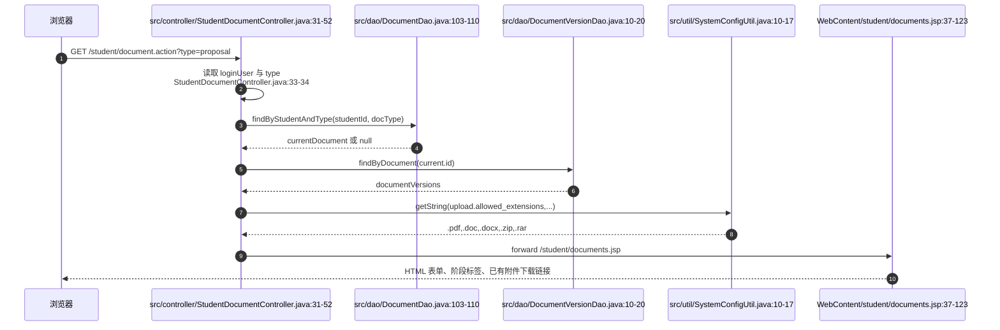

### 2.3 JSP 如何渲染“能不能提交”

`WebContent/student/documents.jsp` 并不自己查数据库，它只消费 Controller 放好的 request attribute：

- `WebContent/student/documents.jsp:11-19`：读取 `typeNames`、`approvedSelection`、`activeType`、`currentDocument`、`documentVersions`、`uploadAccept`。
- `WebContent/student/documents.jsp:20-23`：如果这些关键属性没有准备好，说明不是从 Controller 正常 forward 进来，于是重定向到 `/student/document.action`。
- `WebContent/student/documents.jsp:37-49`：如果没有通过选题，页面显示“无法提交文档”，不给上传表单。
- `WebContent/student/documents.jsp:57-63`：按字典中的文档类型生成阶段标签，每个标签都是一次 GET 请求。
- `WebContent/student/documents.jsp:73-83`：如果当前文档不是 `draft`，展示已提交状态、分数和反馈。
- `WebContent/student/documents.jsp:87-123`：真正的上传表单，表单方法是 POST，编码类型是 `multipart/form-data`。
- `WebContent/student/documents.jsp:129-159`：如果有历史版本，则展示版本号、标题、提交时间和下载链接。

页面中的上传表单非常关键：

```jsp
<form action="../student/document.action" method="post" enctype="multipart/form-data">
  <input type="hidden" name="docType" value="...">
  <input name="title" ...>
  <textarea name="content" ...></textarea>
  <input type="file" name="file" ...>
</form>
```

其中 `enctype="multipart/form-data"` 决定浏览器不会把表单编码成普通的 `a=b&c=d`，而是把每个字段拆成 multipart 的一个 part；`name="file"` 决定后端必须用 `request.getPart("file")` 才能取到这个文件字段。

## 3. 学生 POST 上传：multipart/form-data 如何进入 request.getPart("file")

### 3.1 浏览器发出的 multipart 请求

学生填写标题、正文并选择附件后，浏览器发出类似请求：

```http
POST /student/document.action HTTP/1.1
Content-Type: multipart/form-data; boundary=----WebKitFormBoundary...
Cookie: JSESSIONID=...

------WebKitFormBoundary...
Content-Disposition: form-data; name="docType"

proposal
------WebKitFormBoundary...
Content-Disposition: form-data; name="title"

开题报告
------WebKitFormBoundary...
Content-Disposition: form-data; name="content"

正文内容
------WebKitFormBoundary...
Content-Disposition: form-data; name="file"; filename="proposal.pdf"
Content-Type: application/pdf

...二进制文件内容...
------WebKitFormBoundary...--
```

普通字段 `docType/title/content` 仍可用 `request.getParameter(...)` 读取；文件字段不会出现在普通参数里，而是作为 `Part` 存在，所以代码使用 `request.getPart("file")`。

### 3.2 为什么 Servlet 必须写 @MultipartConfig

`StudentDocumentController` 类上有：

- `src/controller/StudentDocumentController.java:28-30`：`@WebServlet("/student/document.action")` 与 `@MultipartConfig`。

`@MultipartConfig` 是 Servlet 容器解析 multipart 请求的开关。没有这个注解或等价 web.xml 配置时，容器不会把上传体解析成 `Part`，`request.getPart("file")` 通常会失败或无法取得文件。也就是说：

- JSP 的 `enctype="multipart/form-data"` 是浏览器端约定。
- Servlet 的 `@MultipartConfig` 是服务器端约定。
- `input type="file" name="file"` 的 `name` 必须和 `request.getPart("file")` 完全一致。

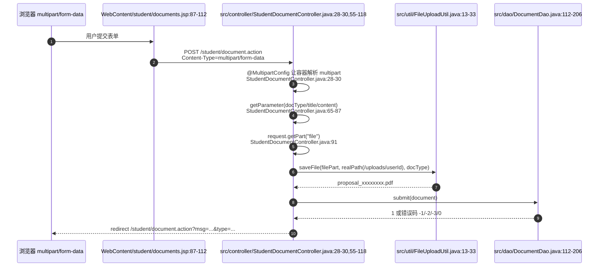

### 3.3 Controller 上传前的业务校验

上传不是一收到文件就直接入库。`StudentDocumentController.doPost` 先做业务校验：

1. `src/controller/StudentDocumentController.java:57-58`：设置请求编码 UTF-8，并取当前登录用户。
2. `src/controller/StudentDocumentController.java:59-63`：必须存在“已通过”的选题，否则返回 `no_topic`。设计原因是文档必须挂在具体课题下，不能让没有课题的学生产生孤儿文档。
3. `src/controller/StudentDocumentController.java:65-69`：`docType` 必须存在于 `document_type` 字典中，非法阶段直接拒绝。
4. `src/controller/StudentDocumentController.java:71-76`：调用 `documentDao.isStageAvailable(...)` 做阶段锁。中期必须等开题 `reviewed`，终稿必须等中期 `reviewed`。
5. `src/controller/StudentDocumentController.java:77-80`：如果已有同阶段文档，且状态不是 `rejected`，拒绝覆盖。设计原因是 `submitted` 正在等教师审，`reviewed` 已通过归档，都不应该被学生随意覆盖。

这两把锁可以概括为：

- 阶段锁：控制 `proposal -> midterm -> final` 的顺序。
- 状态锁：控制同一阶段只有 `rejected` 才能重交。

### 3.4 文件保存目录与相对路径

通过校验后，Controller 构造 `Document` 对象并处理附件：

- `src/controller/StudentDocumentController.java:82-88`：填充 `studentId/topicId/docType/title/content`。
- `src/controller/StudentDocumentController.java:89`：如果是驳回后重交，先沿用旧附件路径。
- `src/controller/StudentDocumentController.java:91-92`：读取 `request.getPart("file")`，只有确实上传了文件才保存。
- `src/controller/StudentDocumentController.java:93`：真实保存目录是 Web 应用部署目录下的 `/uploads/用户ID`。
- `src/controller/StudentDocumentController.java:95-99`：`FileUploadUtil.saveFile(...)` 返回保存后的文件名，数据库路径拼成 `uploads/用户ID/文件名`。
- `src/controller/StudentDocumentController.java:105`：把相对路径放进 `document.filePath`。

这里刻意保存相对路径，而不是 `D:\...\webapps\...\uploads\4\proposal_xxx.pdf` 这种绝对路径。原因是：

1. 数据库记录更短、更稳定。
2. 项目部署目录变化时不用迁移数据库。
3. 下载接口可以统一检查 `path` 是否在 `uploads/` 之下。

### 3.5 FileUploadUtil 对文件的逐段处理

`FileUploadUtil.saveFile` 做的是“文件级安全和落盘”：

- `src/util/FileUploadUtil.java:13-16`：空文件直接返回 `null`。
- `src/util/FileUploadUtil.java:17-20`：从系统配置读取最大上传大小，默认 10MB，超过则抛出 `IOException`。
- `src/util/FileUploadUtil.java:21-24`：从 multipart part 的 `content-disposition` 头里解析原始文件名。
- `src/util/FileUploadUtil.java:25-26`：提取扩展名并校验。
- `src/util/FileUploadUtil.java:27-30`：如果 `/uploads/用户ID` 目录不存在，就创建目录。
- `src/util/FileUploadUtil.java:31-33`：保存名采用 `docType_UUID前8位.ext`，例如 `proposal_ab12cd34.pdf`，然后调用 `filePart.write(...)` 写入磁盘。

文件名解析也做了路径剥离：

- `src/util/FileUploadUtil.java:36-51`：从 `content-disposition` 中找 `filename=...`，并去掉浏览器可能带上的 Windows 反斜杠路径或 Unix 斜杠路径，只保留最终文件名。

扩展名校验来自配置：

- `src/util/FileUploadUtil.java:62-75`：空扩展名拒绝，阻止 `exe/jsp/jspx/bat/cmd/sh` 等危险扩展名，并要求扩展名在允许列表内。
- `src/util/SystemConfigUtil.java:37-47`：CSV 配置会被拆分、trim、转小写后放入集合。

### 3.6 DocumentDao.submit 如何改变状态

文件保存只是磁盘动作，真正的业务状态由 `DocumentDao.submit` 写入数据库。该方法使用事务：

- `src/dao/DocumentDao.java:112-117`：拿连接并关闭自动提交。
- `src/dao/DocumentDao.java:118-129`：用 `FOR UPDATE` 锁住已通过的选题记录，确认学生确实对该课题有 `approved` 选题；没有则回滚并返回 `-1`。
- `src/dao/DocumentDao.java:131-140`：计算前置阶段并查询前置文档是否 `reviewed`；不满足则返回 `-2`，对应阶段锁。
- `src/dao/DocumentDao.java:142-165`：用 `FOR UPDATE` 锁住当前学生当前阶段的文档记录，读取旧状态、旧标题、旧正文、旧附件路径。
- `src/dao/DocumentDao.java:168-172`：如果已有记录但不是 `rejected`，回滚并返回 `-3`，对应文档状态锁。
- `src/dao/DocumentDao.java:173-183`：如果是 `rejected` 重交，先保存旧版本，再把同一条 documents 记录更新为 `submitted`，并清空旧的分数、反馈、审核时间和审核人。
- `src/dao/DocumentDao.java:184-195`：如果没有旧记录，则插入新 documents 记录，初始状态直接是 `submitted`。
- `src/dao/DocumentDao.java:197-205`：提交事务；异常时回滚并返回 0。

为什么上传失败后要删除刚上传文件？因为 Controller 的顺序是“先把文件写到磁盘，再调用 DAO 入库”。如果 DAO 返回 `-2`、`-3` 或 0，数据库不会引用这个新文件。`src/controller/StudentDocumentController.java:107-114` 会调用 `deleteUploadedFile(newFilePath)` 清理刚写入但未被数据库采用的附件，避免产生孤儿文件。

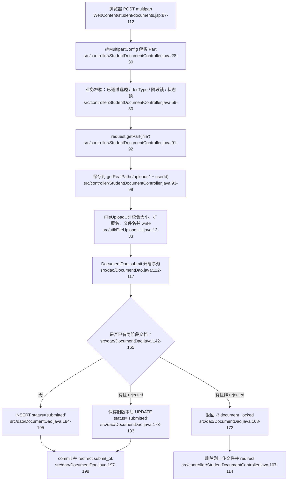

### 3.7 版本历史如何形成

当文档被教师驳回后，学生重新提交同阶段文档，`DocumentDao.submit` 不会新建第二条 documents 主记录，而是：

1. 把旧标题、旧正文、旧附件路径保存到 `document_versions`。
2. 更新原 documents 主记录为新内容，并把状态重新置为 `submitted`。

证据：

- `src/dao/DocumentDao.java:256-270`：在事务内计算下一个 `version_no`，插入 `document_versions`。
- `src/dao/DocumentVersionDao.java:10-20`：学生 GET 页面按 `version_no DESC` 查询历史版本。
- `WebContent/student/documents.jsp:129-159`：JSP 展示历史版本，并给每个历史附件生成下载链接。

这个设计能保证“当前文档”永远在 `documents` 表里只有一条，同时保留每次被退回前的历史快照。

## 4. 教师 GET 审核页：按教师、阶段、状态查询文档

### 4.1 浏览器发出的请求

教师进入文档审核页或点击状态筛选按钮时，浏览器发出 GET 请求：

```http
GET /teacher/document.action?type=proposal&status=submitted HTTP/1.1
Cookie: JSESSIONID=...
```

`type` 是文档阶段；`status` 是筛选状态。`status=all` 表示不过滤状态。

### 4.2 Controller 与 DAO 查询链路

`TeacherDocumentController.doGet` 的处理：

- `src/controller/TeacherDocumentController.java:24-29`：取登录教师、规范化 `type`，`status` 缺省为 `submitted`。
- `src/controller/TeacherDocumentController.java:31-38`：调用 `DocumentDao.findByTeacher`，把列表、阶段、状态筛选和字典项放入 request，forward 到 JSP。

`DocumentDao.findByTeacher` 的 SQL 限制：

- `src/dao/DocumentDao.java:42-45`：基础条件是 `WHERE t.teacher_id=?`，即只查该教师指导课题下的文档。
- `src/dao/DocumentDao.java:46-53`：如果传了 `docType` 和 `status`，继续追加过滤条件。
- `src/dao/DocumentDao.java:54-56`：按提交时间倒序返回。

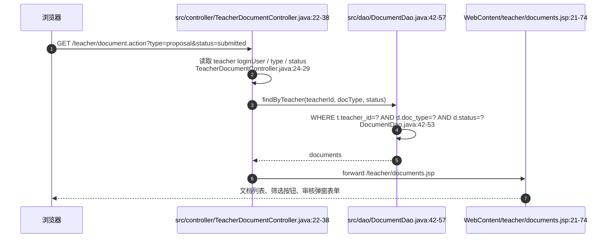

### 4.3 JSP 如何生成审核操作

教师页面同样只消费 request attribute：

- `WebContent/teacher/documents.jsp:6-14`：读取 `docType`、`statusFilter`、`documents`、`typeNames`；如果不是从 Controller 正常 forward 进入，则重定向回 `/teacher/document.action`。
- `WebContent/teacher/documents.jsp:21-30`：生成阶段标签和 `submitted/reviewed/all` 状态筛选按钮。
- `WebContent/teacher/documents.jsp:37-52`：渲染文档列表，每行有“查看/审核”按钮。
- `WebContent/teacher/documents.jsp:56-74`：页面内有一个审核 modal，提交目标是 `../teacher/document.action`，方法是 POST。
- `WebContent/teacher/documents.jsp:79-87`：点击按钮后把当前行数据填入 modal；只有状态为 `submitted` 时显示“通过并评分 / 驳回”按钮。

注意：当前教师 JSP 的附件区域是 `span id="docFile"`，脚本将文件路径作为纯文本填进去；它没有像学生页面那样直接生成 `<a href="../download.action?...">`。但是下载接口本身支持教师权限校验，只要请求的 `path` 精确等于该教师名下某个文档的 `file_path`，就允许下载。

## 5. 教师 POST 审核：review / reject 如何改变状态

### 5.1 浏览器发出的表单请求

教师在 modal 中点击“通过并评分”或“驳回”时，浏览器提交普通表单：

```http
POST /teacher/document.action HTTP/1.1
Content-Type: application/x-www-form-urlencoded
Cookie: JSESSIONID=...

id=12&docType=proposal&action=review&score=88&feedback=...
```

与学生上传不同，这里没有文件字段，所以不需要 `multipart/form-data`，也不需要 `@MultipartConfig`。字段含义：

| 字段 | 来源 | 含义 |
|---|---|---|
| `id` | hidden input | 要审核的 documents 主键 |
| `docType` | hidden input | 审核完成后重定向回哪个阶段标签 |
| `action` | submit button value | `review` 表示通过并评分，`reject` 表示驳回 |
| `score` | number input | 通过时必须是 0-100；驳回时 DAO 会置空 |
| `feedback` | textarea | 教师反馈意见 |

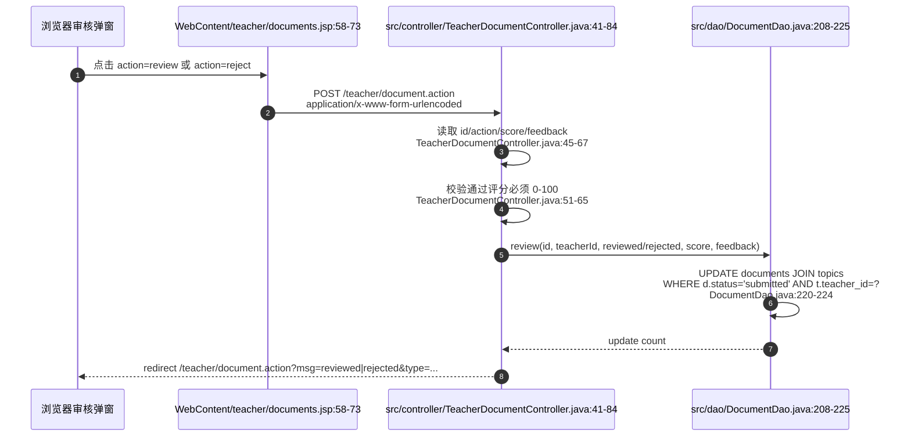

### 5.2 Controller 的审核校验

`TeacherDocumentController.doPost` 的核心处理：

- `src/controller/TeacherDocumentController.java:43-46`：设置 UTF-8，取登录教师和 `action`。
- `src/controller/TeacherDocumentController.java:48-50`：只有 `action=review` 或 `action=reject` 才进入审核分支；`review` 映射为 `reviewed`，`reject` 映射为 `rejected`。
- `src/controller/TeacherDocumentController.java:51-59`：解析 `score`，格式不对直接返回 `invalid_score`。
- `src/controller/TeacherDocumentController.java:60-65`：通过审核必须给 0-100 分；驳回可以不给分。
- `src/controller/TeacherDocumentController.java:67-73`：读取反馈，先查文档，再调用 DAO 更新；更新失败或文档不存在则返回 `error`。
- `src/controller/TeacherDocumentController.java:75-81`：审核成功后给学生发通知、记录操作日志，并重定向回列表。

### 5.3 DocumentDao.review 的状态锁和教师权限

真正防止越权和重复审核的是 SQL：

- `src/dao/DocumentDao.java:208-216`：只接受 `reviewed/rejected` 两种状态；`reviewed` 必须有 0-100 分。
- `src/dao/DocumentDao.java:217-219`：驳回时强制把分数置空，避免“已驳回但有分数”的歧义。
- `src/dao/DocumentDao.java:220-224`：更新语句 `JOIN topics`，并要求 `d.status='submitted' AND t.teacher_id=?`。

这条 SQL 同时承担两件事：

1. 状态锁：只有 `submitted` 能被审核。已经 `reviewed` 或 `rejected` 的记录再次提交审核请求，`executeUpdate` 会返回 0。
2. 权限锁：教师只能更新自己指导课题下的文档。即使前端篡改了 `id`，只要该文档的 topic 不属于当前教师，`t.teacher_id=?` 条件不成立。

## 6. download.action 文件流：为什么不直接暴露 /uploads

### 6.1 下载链接从哪里来

学生页面会为当前附件和历史版本附件生成下载链接：

- `WebContent/student/documents.jsp:113-116`：当前附件链接指向 `../download.action?path=...`。
- `WebContent/student/documents.jsp:149-152`：历史版本附件也指向 `../download.action?path=...`。

JSP 生成链接时会把数据库中的相对路径 URL 编码，并去掉可能存在的开头 `/`。例如数据库路径为：

```text
uploads/4/proposal_ab12cd34.pdf
```

页面链接会变成：

```text
../download.action?path=uploads%2F4%2Fproposal_ab12cd34.pdf
```

### 6.2 为什么不直接访问 /uploads/4/xxx.pdf

如果页面直接暴露 `/uploads/4/proposal.pdf`，Web 容器可能只按静态文件返回，绕过业务权限。现在统一走 `/download.action`，可以在返回文件前做：

1. 是否登录校验。
2. `path` 参数合法性校验。
3. 学生 / 教师 / 管理员角色权限校验。
4. canonical path 校验，防止目录穿越。
5. 统一设置下载响应头。

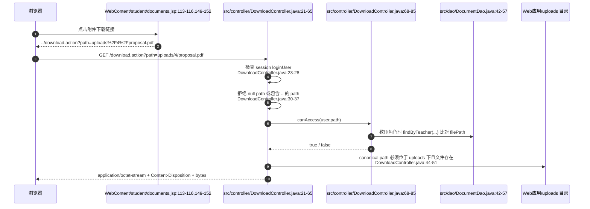

### 6.3 path 参数与目录穿越防护

`DownloadController.doGet` 首先处理登录和路径：

- `src/controller/DownloadController.java:23-28`：如果没有 session 或没有 `loginUser`，重定向到登录页。
- `src/controller/DownloadController.java:30-34`：`path` 为空或包含 `..`，直接返回 400。
- `src/controller/DownloadController.java:35-37`：如果 `path` 以 `/` 开头，去掉开头的 `/`，统一变成相对路径。

`..` 是目录穿越攻击中最常见的片段。例如攻击者可能构造：

```text
/download.action?path=../../WEB-INF/web.xml
```

Servlet 容器解码参数后，`path.contains("..")` 会先拦截这类请求。随后代码还做 canonical path 校验：

- `src/controller/DownloadController.java:44-46`：计算 Web 根目录、`uploads` 目录 canonical path、目标文件 canonical path。
- `src/controller/DownloadController.java:47-51`：目标文件必须以 `uploads` canonical path 加分隔符开头，且必须存在并且是普通文件，否则返回 404。

这相当于两层防护：

1. 字符串层：拒绝包含 `..` 的参数。
2. 文件系统层：即使出现符号链接、路径变形，也必须经过 canonical path 后仍在 uploads 目录内。

### 6.4 按角色校验文件权限

权限逻辑在 `canAccess`：

- `src/controller/DownloadController.java:68-71`：管理员可以访问所有 `uploads/` 下文件。
- `src/controller/DownloadController.java:72-83`：教师必须先满足 `path.startsWith("uploads/")`，然后查询自己指导课题下的所有文档，只有 `path.equals(d.getFilePath())` 才允许。
- `src/controller/DownloadController.java:84`：学生只能访问 `uploads/自己的用户ID/` 前缀下的文件。

这说明下载权限不是单纯看文件是否存在，而是结合登录角色和数据库关系判断。教师下载尤其严格：不是“任意教师可以下任意学生文件”，而是必须是该教师指导课题下文档的 `file_path`。

### 6.5 Content-Disposition、filename* 与 bytes 写出

权限和文件存在性都通过后，下载响应这样构造：

- `src/controller/DownloadController.java:53`：`Content-Type` 设置为 `application/octet-stream`，表示通用二进制流。
- `src/controller/DownloadController.java:54-56`：取真实文件名，UTF-8 URL 编码后同时写入 `filename` 和 `filename*`。
- `src/controller/DownloadController.java:57-65`：打开 `FileInputStream` 和 `response.getOutputStream()`，每次读 4096 bytes 写给浏览器，最后 flush。

`Content-Disposition` 的意义是让浏览器下载而不是当页面打开：

```http
Content-Type: application/octet-stream
Content-Disposition: attachment; filename="proposal_ab12cd34.pdf"; filename*=UTF-8''proposal_ab12cd34.pdf
```

其中：

- `attachment`：提示浏览器按附件下载。
- `filename`：传统文件名字段。
- `filename*`：支持 UTF-8 编码文件名，避免中文或空格文件名在不同浏览器中乱码。

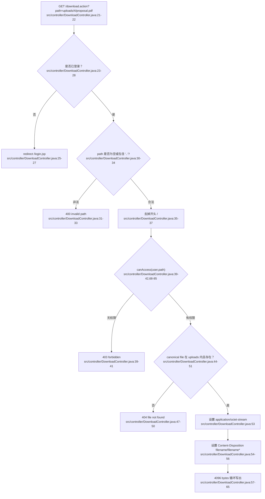

## 7. 状态与阶段锁总图

文档阶段顺序和状态变化可以合并理解为：阶段控制“能不能提交下一类文档”，状态控制“当前这类文档能不能再提交或被审核”。

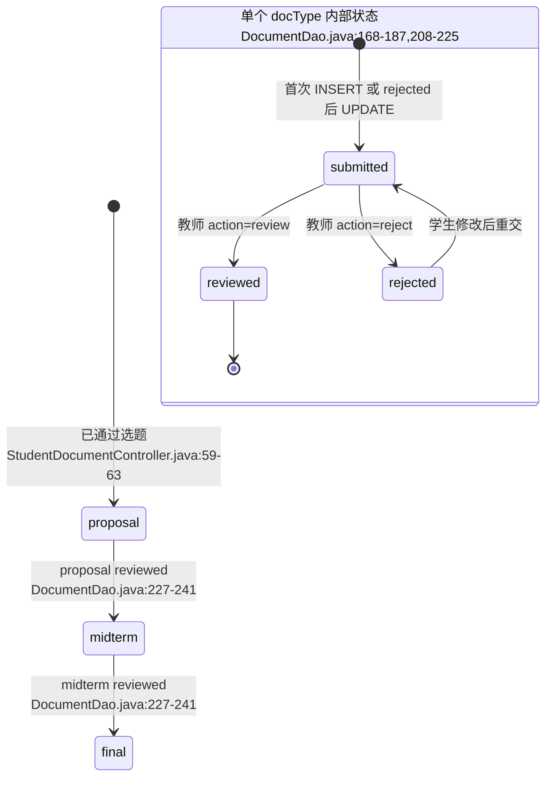

几个答辩时容易被追问的点：

1. **为什么提交时先查是否通过选题？**
   因为文档必须绑定 `topic_id`，且只有通过选题的学生才有合法课题上下文。否则会出现没有课题却能提交文档的脏数据。

2. **为什么有阶段锁？**
   毕业设计流程有先后关系：没有通过开题就不能交中期，没有通过中期就不能交终稿。代码用 `prerequisiteType` 和 `status='reviewed'` 强制保证顺序。

3. **为什么有状态锁？**
   `submitted` 表示教师还没审，学生不能反复覆盖；`reviewed` 表示已归档通过，也不能覆盖；只有 `rejected` 才代表教师要求修改，允许重交。

4. **为什么 DAO 里还要重复校验 Controller 已经校验过的锁？**
   Controller 校验负责用户体验，DAO 事务内 `FOR UPDATE` 和 `WHERE status='submitted'` 负责并发安全。两个浏览器窗口同时提交或审核时，最终以数据库锁和 SQL 条件为准。

5. **为什么失败要删除刚上传文件？**
   文件先落盘、数据库后提交。如果数据库提交失败但不删除文件，就会留下没有任何 documents 记录引用的孤儿附件。

6. **为什么下载走 Controller 而不是静态目录？**
   静态目录只能判断文件存在，不能判断“这个登录用户是否有权下载这个文件”。`download.action` 可以结合 session、角色、数据库关系、canonical path 决定是否输出 bytes。

## 8. 代码证据清单

- `WebContent/student/documents.jsp:11-23`：学生页面读取 Controller 注入的属性，属性缺失时重定向回 Controller。
- `WebContent/student/documents.jsp:37-49`：未通过选题时不给上传表单。
- `WebContent/student/documents.jsp:57-63`：学生文档阶段标签 GET 切换。
- `WebContent/student/documents.jsp:73-83`：显示当前文档状态、分数、反馈。
- `WebContent/student/documents.jsp:87-112`：上传表单使用 `method="post"`、`enctype="multipart/form-data"`，文件字段名为 `file`。
- `WebContent/student/documents.jsp:113-116`：当前附件下载链接使用 `download.action?path=...`。
- `WebContent/student/documents.jsp:129-159`：历史版本列表和历史附件下载链接。
- `WebContent/teacher/documents.jsp:6-14`：教师页面读取文档列表与筛选属性，属性缺失时回到 Controller。
- `WebContent/teacher/documents.jsp:21-30`：教师阶段和状态筛选链接。
- `WebContent/teacher/documents.jsp:37-52`：教师文档列表与“查看/审核”按钮。
- `WebContent/teacher/documents.jsp:56-74`：教师审核 modal 的 POST 表单、隐藏字段、评分、反馈、review/reject 按钮。
- `WebContent/teacher/documents.jsp:79-87`：前端填充 modal，并仅在 `submitted` 状态显示审核动作。
- `src/controller/StudentDocumentController.java:28-30`：学生文档 Controller 映射和 `@MultipartConfig`。
- `src/controller/StudentDocumentController.java:31-52`：学生 GET 文档页的数据准备与 forward。
- `src/controller/StudentDocumentController.java:55-80`：学生 POST 的编码、已通过选题、文档类型、阶段锁、状态锁校验。
- `src/controller/StudentDocumentController.java:82-105`：构造 Document、读取 `request.getPart("file")`、保存到 `/uploads/用户ID`、生成相对路径。
- `src/controller/StudentDocumentController.java:107-118`：调用 `DocumentDao.submit`，失败清理刚上传文件，成功记录日志并重定向。
- `src/controller/StudentDocumentController.java:121-132`：学生重定向 URL 与文档类型归一化。
- `src/controller/StudentDocumentController.java:135-143`：删除刚上传但未成功入库的文件。
- `src/controller/TeacherDocumentController.java:20-21`：教师文档 Controller 映射。
- `src/controller/TeacherDocumentController.java:22-38`：教师 GET 审核列表，默认 `submitted`，调用 DAO 并 forward。
- `src/controller/TeacherDocumentController.java:41-65`：教师 POST 审核入口、action 映射、score 解析和 0-100 校验。
- `src/controller/TeacherDocumentController.java:67-84`：读取反馈、调用 DAO 审核、通知、日志、重定向。
- `src/controller/TeacherDocumentController.java:87-100`：教师审核后的重定向和文档类型归一化。
- `src/controller/DownloadController.java:19-20`：下载 Controller 映射 `/download.action`。
- `src/controller/DownloadController.java:21-28`：下载请求必须有登录用户，否则跳转登录。
- `src/controller/DownloadController.java:30-37`：校验 `path`，拒绝空路径和包含 `..` 的目录穿越路径，并去掉开头 `/`。
- `src/controller/DownloadController.java:39-42`：下载前做角色权限校验。
- `src/controller/DownloadController.java:44-51`：canonical path 限制目标文件必须在 uploads 下且真实存在。
- `src/controller/DownloadController.java:53-65`：设置 `application/octet-stream`、`Content-Disposition`，并循环写出 bytes。
- `src/controller/DownloadController.java:68-85`：管理员、教师、学生三类下载权限判断。
- `src/dao/DocumentDao.java:15-20`：文档基础查询关联 users 和 topics。
- `src/dao/DocumentDao.java:42-57`：教师按指导课题、文档类型、状态查询文档。
- `src/dao/DocumentDao.java:95-110`：按 id 或学生加文档类型查询单个文档。
- `src/dao/DocumentDao.java:112-117`：学生提交文档时开启事务。
- `src/dao/DocumentDao.java:118-140`：事务内锁定已通过选题并检查前置阶段是否 reviewed。
- `src/dao/DocumentDao.java:142-172`：锁定已有文档，非 rejected 时拒绝覆盖。
- `src/dao/DocumentDao.java:173-195`：rejected 重交时保存旧版本并更新为 submitted；首次提交时插入 submitted。
- `src/dao/DocumentDao.java:197-205`：提交、回滚和关闭连接。
- `src/dao/DocumentDao.java:208-225`：教师 review/reject 的状态校验、分数校验、JOIN topics 权限更新。
- `src/dao/DocumentDao.java:227-243`：阶段锁规则：proposal 无前置，midterm 依赖 proposal，final 依赖 midterm。
- `src/dao/DocumentDao.java:256-270`：保存旧文档版本到 `document_versions`。
- `src/dao/DocumentDao.java:296-323`：数据库行映射到 Document 对象，包括 `filePath/status/score/feedback`。
- `src/dao/DocumentVersionDao.java:10-20`：按文档查询历史版本并按版本号倒序。
- `src/dao/DocumentVersionDao.java:22-30`：独立的历史版本保存方法。
- `src/dao/DocumentVersionDao.java:32-42`：数据库行映射到 DocumentVersion。
- `src/util/FileUploadUtil.java:13-20`：空文件和最大上传大小校验。
- `src/util/FileUploadUtil.java:21-33`：解析原文件名、校验扩展名、创建目录、生成随机保存名并写文件。
- `src/util/FileUploadUtil.java:36-51`：从 multipart `content-disposition` 解析 `filename` 并去掉路径。
- `src/util/FileUploadUtil.java:54-60`：提取并小写化扩展名。
- `src/util/FileUploadUtil.java:62-75`：允许扩展名与禁止扩展名校验。
- `src/util/SystemConfigUtil.java:10-17`：从 `system_configs` 读取字符串配置。
- `src/util/SystemConfigUtil.java:28-35`：读取 long 类型配置，例如上传大小。
- `src/util/SystemConfigUtil.java:37-47`：读取 CSV 配置并转成小写集合。
- `src/dbutil/SQLHelper.java:16-28`：Druid 数据源初始化。
- `src/dbutil/SQLHelper.java:30-46`：从 `jdbc.properties` 加载数据库连接配置。
- `src/dbutil/SQLHelper.java:48-50`：获取数据库连接。
- `src/dbutil/SQLHelper.java:52-77`：查询列表并映射为 `Object[]`。
- `src/dbutil/SQLHelper.java:79-94`：执行更新 SQL。
- `src/dbutil/SQLHelper.java:96-115`：执行标量查询。
- `src/dbutil/SQLHelper.java:117-137`：执行插入并返回自增主键。
- `src/dbutil/SQLHelper.java:139-155`：绑定 PreparedStatement 参数并关闭 JDBC 资源。


---

# 04 管理员后台网络数据流详解：用户、公告、答辩、导入、统计与导出

本节只分析管理员后台的传统管理流程：用户管理、公告管理、答辩安排、答辩 Excel 批量导入、统计 JSON、成绩 Excel 导出。不包含 AI 模块。

核心结论先说明：

- **用户管理列表页走 Controller forward**：浏览器访问 `/admin/user.action`，`AdminUserController#doGet` 查询用户、总数、字典和配置后，把数据放到 `request`，再 `forward` 到 `users.jsp`。`users.jsp` 如果直接被访问且没有 `users` 属性，会主动重定向回 `/admin/user.action`。
- **公告/答辩列表页主要是 JSP 直达展示**：`announcements.jsp`、`defenses.jsp` 自己在 JSP 中 new DAO 并查询展示数据；新增、编辑、删除才 POST 到对应 Servlet，然后 redirect 回 JSP。
- **统计页用 JSON fetch**：`statistics.jsp` 先输出 HTML 和 ECharts 容器，再用 `fetch('../admin/stats.action')` 拉 JSON，`AdminStatsController` 设置 `Content-Type: application/json;charset=UTF-8` 并用 `response.getWriter()` 写 JSON 字符串。
- **导入用 multipart + POI**：`defenses.jsp` 的上传表单使用 `multipart/form-data`，`AdminDefenseImportController` 通过 `@MultipartConfig` 和 `request.getPart("file")` 取得 Excel 文件，再用 Apache POI 读第一张表、跳过表头、逐行导入。
- **导出直接写二进制响应**：`AdminExportController` 不返回 JSP，而是设置 Excel MIME 与 `Content-Disposition: attachment`，用 POI 生成 workbook 后写入 `response.getOutputStream()`。

## 1. URL、方法、Content-Type、字段总表

| 流程 | URL | 方法 | 请求 Content-Type | 主要字段/参数 | 发起位置 | 后端入口 | 响应 |
|---|---|---:|---|---|---|---|---|
| 用户列表/过滤/分页 | `/admin/user.action?role=...&college=...&page=...&pageSize=...` | GET | 无请求体 | `role`、`college`、分页参数由 `PageUtil` 从 request 取 | `users.jsp` 的角色链接、学院下拉、分页链接 | `AdminUserController#doGet` | `forward` 到 `/admin/users.jsp`，HTML |
| 用户新增 | `/admin/user.action` | POST | `application/x-www-form-urlencoded`（普通表单默认） | `action=add`、`username`、`password`、`realName`、`role`、`college`、`major`、`className`、`studentNo`、`department`、`email`、`phone` | `users.jsp` 新增用户 modal 表单 | `AdminUserController#doPost` | redirect 到 `/admin/user.action?msg=add_ok` 或 `?msg=username_exists` |
| 用户编辑 | `/admin/user.action` | POST | `application/x-www-form-urlencoded` | `action=edit`、`id`、上述用户字段、`status`，`password` 可为空 | `users.jsp` 编辑用户 modal 表单 | `AdminUserController#doPost` | redirect 到 `/admin/user.action?msg=edit_ok` 或错误 msg |
| 用户删除 | `/admin/user.action` | POST | `application/x-www-form-urlencoded` | `action=delete`、`id` | `users.jsp` 行内删除表单 | `AdminUserController#doPost` | redirect 到 `/admin/user.action?msg=delete_ok/delete_self/delete_failed` |
| 公告列表 | `/admin/announcements.jsp` | GET | 无请求体 | 无 | 浏览器直接访问 JSP | JSP 内部创建 `AnnouncementDao` | JSP 直接输出 HTML |
| 公告新增/编辑/删除 | `/admin/announcement.action` | POST | `application/x-www-form-urlencoded` | `action=add/edit/delete`、`id`、`title`、`content`、`isTop` | `announcements.jsp` 表单 | `AdminAnnouncementController#doPost` | redirect 到 `/admin/announcements.jsp?msg=...` |
| 答辩列表 | `/admin/defenses.jsp` | GET | 无请求体 | `msg`、`success`、`skipped` 仅用于展示导入结果 | 浏览器直接访问 JSP | JSP 内部创建 DAO 查询 | JSP 直接输出 HTML |
| 答辩新增/编辑/删除 | `/admin/defense.action` | POST | `application/x-www-form-urlencoded` | `action=add/edit/delete`、`id`、`studentId`、`defenseTime`、`room`、`groupName`、`score`、`comment` | `defenses.jsp` 表单 | `AdminDefenseController#doPost` | redirect 到 `/admin/defenses.jsp?msg=...` |
| 答辩批量导入 | `/admin/defense-import.action` | POST | `multipart/form-data` | 文件 part：`file`，Excel 列为学号、答辩时间、教室、分组、备注 | `defenses.jsp` 上传表单 | `AdminDefenseImportController#doPost` | redirect 到 `/admin/defenses.jsp?msg=import_ok&success=...&skipped=...` 或失败 msg |
| 统计 JSON | `/admin/stats.action` | GET | 无请求体 | 无 | `statistics.jsp` 中的 `fetch('../admin/stats.action')` | `AdminStatsController#doGet` | `application/json;charset=UTF-8`，响应体为统计 JSON |
| 成绩 Excel 导出 | `/admin/export.action` | GET | 无请求体 | 无 | `statistics.jsp` 导出链接 | `AdminExportController#doGet` | Excel MIME，`Content-Disposition: attachment`，响应体为 `.xlsx` 二进制 |

## 2. URL 与参数约定

### 2.1 `.action` 不是物理文件，而是 Servlet 映射

项目里大量 URL 以 `.action` 结尾，例如 `/admin/user.action`、`/admin/announcement.action`、`/admin/defense.action`、`/admin/stats.action`、`/admin/export.action`。这些不是磁盘上的 `.action` 文件，而是 `@WebServlet` 绑定的逻辑路由：

- `AdminUserController` 映射 `/admin/user.action`。
- `AdminAnnouncementController` 映射 `/admin/announcement.action`。
- `AdminDefenseController` 映射 `/admin/defense.action`。
- `AdminDefenseImportController` 映射 `/admin/defense-import.action`。
- `AdminStatsController` 映射 `/admin/stats.action`。
- `AdminExportController` 映射 `/admin/export.action`。

所以老师如果追问“为什么点的是 `.action`，却执行 Java 类”，答案是：Servlet 容器按 `@WebServlet` 的 URL pattern 分发请求，不按文件系统查找。

### 2.2 query 参数与 redirect msg

GET 请求和 redirect 后的状态提示都放在 URL query 中，例如：

- `?role=teacher&college=cs`：用户列表筛选参数。
- `?msg=add_ok`：POST 成功后 redirect 回列表页时携带的“闪现状态码”。
- `?msg=import_ok&success=3&skipped=2`：导入完成后展示成功数和跳过数。

query 参数的特点是：浏览器地址栏可见、没有请求体、刷新页面不会重新提交 POST。管理后台用它实现了典型 **PRG（Post/Redirect/Get）** 流程：表单 POST 修改数据库，Servlet 处理完 redirect 到 GET 页面，页面通过 `msg` 显示结果。

### 2.3 隐藏字段 `action` 和 `id`

多个操作共用同一个 Servlet，所以表单用隐藏字段区分动作：

- `action=add`：新增。
- `action=edit`：编辑。
- `action=delete`：删除。
- `id`：编辑或删除哪一条记录。

这样一个 URL 可以承载多种后台动作，Controller 先读取 `request.getParameter("action")`，再进入对应分支。

### 2.4 `multipart/form-data` 与 `@MultipartConfig`

普通表单默认是 `application/x-www-form-urlencoded`，适合传文本字段；Excel 上传必须传文件字节，所以表单声明 `enctype="multipart/form-data"`。Servlet 端必须配合 `@MultipartConfig`，容器才会解析 multipart 请求，`request.getPart("file")` 才能拿到文件 part。

### 2.5 JSON 与 Excel 响应头

- JSON 接口设置 `Content-Type: application/json;charset=UTF-8`，表示响应体是 UTF-8 JSON，前端 `r.json()` 按 JSON 解析。
- Excel 导出设置 `application/vnd.openxmlformats-officedocument.spreadsheetml.sheet`，表示响应体是 `.xlsx`。
- `Content-Disposition: attachment; filename=grades_export.xlsx` 告诉浏览器不要当 HTML 展示，而是作为附件下载，并给出文件名。

## 3. 用户管理：GET 列表与 POST 增删改

### 3.1 用户 GET：浏览器请求如何进入 Controller，再 forward 到 JSP

用户列表不是直接访问 `users.jsp` 完成查询，而是先访问 `/admin/user.action`。`AdminUserController#doGet` 做了三件关键事：

1. 从 query 读取筛选条件：`role`、`college`。
2. 调 DAO 查询分页用户和总数。
3. 把 `users`、`total`、`currentPage`、`pageSize`、字典项、学院专业、校验规则放入 request 后 `forward` 到 `users.jsp`。

`forward` 的意义是：服务器内部把同一个 request 转交给 JSP 渲染，浏览器地址栏仍然是 `/admin/user.action`，而且 request attribute 不会丢。`users.jsp` 正是从 request attribute 中拿 `users`、`total` 等数据。如果有人绕过 Controller 直接访问 `/admin/users.jsp`，`users` 为 null，JSP 会立刻 `sendRedirect` 到 `/admin/user.action`，强制回到正确入口。

```mermaid
flowchart LR
  A["浏览器 GET /admin/user.action?role&college&page<br/>src/controller/AdminUserController.java:20-28"] --> B["Servlet 映射与 doGet 读取 query<br/>src/controller/AdminUserController.java:20-28"]
  B --> C["分页查询 users + total<br/>src/controller/AdminUserController.java:30-32<br/>src/dao/UserDao.java:69-105"]
  C --> D["设置 request attributes<br/>src/controller/AdminUserController.java:34-47"]
  D --> E["forward 到 /admin/users.jsp<br/>src/controller/AdminUserController.java:48"]
  E --> F["JSP 从 request 取 users/total/pageSize<br/>WebContent/admin/users.jsp:10-20"]
  F --> G["渲染用户表格和分页<br/>WebContent/admin/users.jsp:80-114"]
  H["若直接访问 users.jsp 且 users=null<br/>WebContent/admin/users.jsp:28-31"] --> A
```

#### 逐段解释

- `src/controller/AdminUserController.java:20-28`：`@WebServlet("/admin/user.action")` 绑定入口；`doGet` 用 `request.getParameter("role")`、`request.getParameter("college")` 读取筛选条件，分页参数由 `PageUtil.getPage/getPageSize` 从 request 中取。
- `src/controller/AdminUserController.java:30-32`：创建 `UserDao`，调用 `findAllPaged(role, college, page, pageSize)` 和 `countAll(role, college)`，把同一组过滤条件分别用于列表和总数。
- `src/dao/UserDao.java:69-83`：SQL 从 `WHERE 1=1` 开始拼可选条件；如果传了 `role` 就加 `AND role=?`，传了 `college` 就加 `AND college=?`，最后加 `ORDER BY id LIMIT ? OFFSET ?`。参数通过 `SQLHelper.queryList(sql, params.toArray())` 绑定，不是字符串直接拼值。
- `src/dao/UserDao.java:91-105`：总数查询同样按 `role`、`college` 拼条件，返回 `COUNT(*)`。
- `src/controller/AdminUserController.java:34-47`：把页面渲染必需的 `users`、总数、当前页、页大小、角色字典、状态字典、学院专业、用户名正则、密码最小长度放进 request。
- `src/controller/AdminUserController.java:48`：`request.getRequestDispatcher("/admin/users.jsp").forward(request, response)` 进入 JSP。这里不是 redirect；redirect 会让浏览器重新发一次请求，request attribute 会丢，JSP 拿不到 `users`。
- `WebContent/admin/users.jsp:28-31`：JSP 的保护逻辑。如果 `users == null`，说明不是 Controller forward 进来的，于是 `response.sendRedirect(request.getContextPath() + "/admin/user.action")`。

### 3.2 用户 POST：新增、编辑、删除如何通过隐藏字段进入同一个 Servlet

用户页面有三类 POST 表单：

- 删除：行内表单，提交 `action=delete` 和 `id`。
- 新增：modal 表单，提交 `action=add` 和完整用户字段。
- 编辑：modal 表单，提交 `action=edit`、`id`、用户字段和 `status`。

这些表单都没有 `enctype`，浏览器默认用 `application/x-www-form-urlencoded` 编码。字段进入 Servlet 后，统一由 `request.getParameter(...)` 读取。

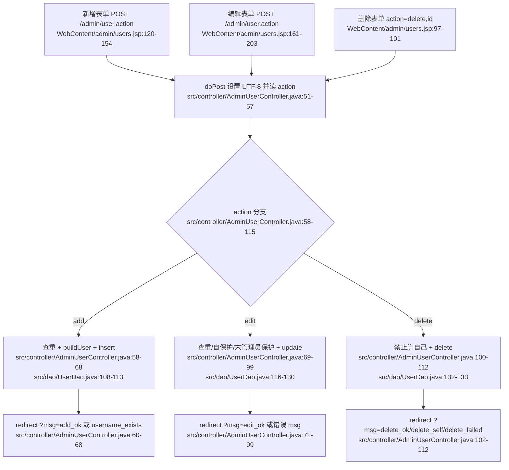

#### 字段进入 Controller 的路径

- `WebContent/admin/users.jsp:120-154`：新增表单的 `<form action="user.action" method="post">` 会把输入框的 `name` 作为参数名提交。隐藏字段 `action=add` 告诉后台这是新增。
- `WebContent/admin/users.jsp:161-203`：编辑表单包含 `action=edit` 和隐藏 `id`，同时提交 `status`。密码字段可以留空。
- `WebContent/admin/users.jsp:97-101`：删除表单只有 `action=delete` 和 `id`，用户点击确认后 POST。
- `src/controller/AdminUserController.java:51-57`：`doPost` 先 `request.setCharacterEncoding("UTF-8")`，再读 session 中的 `loginUser` 和表单里的 `action`。
- `src/controller/AdminUserController.java:118-131`：`buildUser(request)` 把 `username/password/role/realName/studentNo/college/major/className/department/email/phone` 逐个从 request parameter 装进 `User` 对象。

#### 新增分支

- `src/controller/AdminUserController.java:58-63`：如果 `action=add`，先读 `username` 并调用 `dao.existsByUsername(username)` 查重；已存在就 redirect 到 `?msg=username_exists`。
- `src/controller/AdminUserController.java:64-68`：通过 `buildUser` 构造对象，默认 `status=1`，调用 `dao.insert(u)`，记录日志，redirect 到 `?msg=add_ok`。
- `src/dao/UserDao.java:108-113`：插入 SQL 包含用户名、哈希后的密码、角色、姓名、学号、学院、专业、班级、部门、邮箱、电话、状态。密码不是明文直接入库，而是调用 `PasswordUtil.hash(user.getPassword())`。

#### 编辑分支

- `src/controller/AdminUserController.java:70-78`：读取 `id`、`username`、`status`，并排除当前用户 id 做用户名查重。
- `src/controller/AdminUserController.java:79-94`：读取当前数据库用户，防止管理员把自己改成非 admin 或禁用自己，也防止系统最后一个启用管理员被降级/禁用。
- `src/controller/AdminUserController.java:95-99`：密码为空则设置为 null，DAO 更新时会走“不改密码”的 SQL；非空则更新密码。
- `src/dao/UserDao.java:116-130`：根据 `user.getPassword()` 是否为空选择两条 SQL：一条更新密码字段，一条不更新密码字段。

#### 删除分支

- `src/controller/AdminUserController.java:100-105`：删除前读取 `id`，如果要删除的是当前登录用户，redirect `?msg=delete_self`。
- `src/controller/AdminUserController.java:106-112`：调用 `dao.delete(id)`，影响行数小于等于 0 则 `?msg=delete_failed`，否则 `?msg=delete_ok`。
- `src/dao/UserDao.java:132-133`：真正执行 `DELETE FROM users WHERE id=?`。

#### 用户管理 msg 展示

`users.jsp` 自己读取 `request.getParameter("msg")`，识别 `add_ok`、`edit_ok`、`delete_ok`、`delete_failed`、`delete_self`、`username_exists` 并输出 Bootstrap alert。注意 Controller 还会 redirect `msg=error`、`msg=edit_self_role`、`msg=last_admin`，但在当前 `users.jsp` 本地 alert 映射中没有逐项处理。

## 4. 公告管理：JSP 直达列表，POST 到 Servlet 后 redirect

公告管理和用户管理不同：`announcements.jsp` 自己创建 `AnnouncementDao` 并查询全部公告，不经过 GET Controller。

设计原因很直接：公告列表没有复杂分页配置，也不需要 Controller 先塞大量字典/配置到 request；JSP 直接查 DAO 就能展示。修改动作仍然放在 Servlet 中，是为了把数据库写操作集中在 Controller，并通过 redirect 防止刷新重复提交。

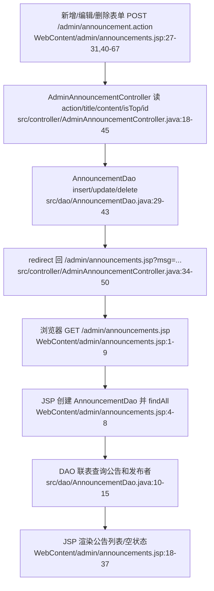

### 4.1 公告 GET 展示

- `WebContent/admin/announcements.jsp:4-8`：JSP 设置页面标题，从 session 取登录用户，直接 `new AnnouncementDao()` 并 `dao.findAll()`。
- `src/dao/AnnouncementDao.java:10-15`：查询 `announcements` 表并 join `users` 表拿发布者姓名，排序规则是置顶优先、创建时间倒序。
- `WebContent/admin/announcements.jsp:18-37`：如果列表为空显示空状态；否则逐条输出标题、置顶标记、发布者、时间、内容，以及编辑/删除按钮。

### 4.2 公告 POST 字段与分支

公告表单同样是普通 POST，默认 `application/x-www-form-urlencoded`。

| action | 字段 | JSP 来源 | Controller 处理 | 成功 redirect |
|---|---|---|---|---|
| `add` | `title`、`content`、`isTop` | 新增 modal | 构造 `Announcement`，设置发布人 id 和置顶状态，insert | `/admin/announcements.jsp?msg=add_ok` |
| `edit` | `id`、`title`、`content`、`isTop` | 编辑 modal | 读 id 后更新标题、内容、置顶 | `/admin/announcements.jsp?msg=edit_ok` |
| `delete` | `id` | 行内删除表单 | 删除指定公告 | `/admin/announcements.jsp?msg=delete_ok` |

关键点：

- `WebContent/admin/announcements.jsp:42-51`：新增表单提交到 `../admin/announcement.action`，隐藏字段 `action=add`，文本字段是 `title`、`content`，置顶复选框 `name="isTop" value="1"`。
- `WebContent/admin/announcements.jsp:57-67`：编辑表单提交 `action=edit` 和隐藏 `id`，字段同新增。
- `WebContent/admin/announcements.jsp:27-31`：删除表单提交 `action=delete` 和 `id`。
- `src/controller/AdminAnnouncementController.java:18-24`：`doPost` 设置 UTF-8，读取 `action`，创建 DAO，从 session 取当前用户。
- `src/controller/AdminAnnouncementController.java:26-34`：新增时读取 `title/content/isTop`，其中 `isTop` 是复选框，只有勾选时才会提交 `"1"`，所以代码用 `"1".equals(request.getParameter("isTop")) ? 1 : 0` 转成 1/0。
- `src/controller/AdminAnnouncementController.java:35-43`：编辑时多读 `id`，调用 `dao.update(a)`。
- `src/controller/AdminAnnouncementController.java:44-48`：删除时只读 `id` 并调用 `dao.delete(id)`。
- `src/dao/AnnouncementDao.java:29-43`：三类写操作分别对应 `INSERT`、`UPDATE`、`DELETE`，最终都通过 `SQLHelper` 的 PreparedStatement 执行。

## 5. 答辩安排：JSP 直达展示，POST 负责校验与写库

答辩页面也是 JSP 直达展示：`defenses.jsp` 自己查全部答辩安排，还会查“已通过选题的学生”供新增/编辑下拉框使用。与公告类似，展示逻辑放在 JSP，写操作放在 `AdminDefenseController`。

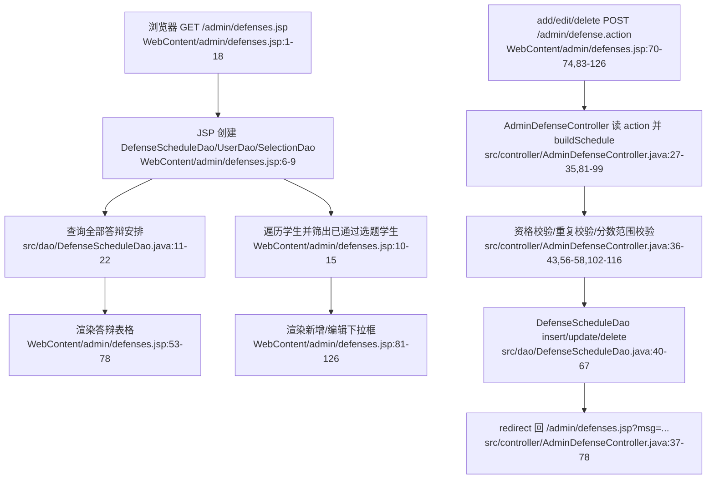

### 5.1 答辩 GET 展示

- `WebContent/admin/defenses.jsp:6-9`：JSP 创建 `DefenseScheduleDao`、`UserDao`、`SelectionDao`，调用 `dao.findAll()` 查询已有答辩。
- `WebContent/admin/defenses.jsp:10-15`：遍历所有 student，只有 `selDao.findApprovedByStudent(u.getId()) != null` 的学生才加入 `approvedStudents`，用于表单下拉。
- `src/dao/DefenseScheduleDao.java:11-22`：`BASE_SQL` join 学生、选题、课题、指导教师，`findAll()` 按答辩时间和 id 倒序返回列表。
- `WebContent/admin/defenses.jsp:53-78`：JSP 渲染学号、姓名、课题、指导教师、答辩时间、教室、分组、答辩分和操作按钮。

### 5.2 答辩 POST 字段

| action | 字段 | 字段含义 | 处理结果 |
|---|---|---|---|
| `add` | `studentId`、`defenseTime`、`room`、`groupName`、`score`、`comment` | 新增某学生的答辩时间、地点、分组、分数和备注 | 校验资格、查重，通过后 insert，通知学生，redirect `msg=add_ok` |
| `edit` | `id`、`studentId`、`defenseTime`、`room`、`groupName`、`score`、`comment` | 修改已有答辩安排 | 校验资格、排除自身查重，通过后 update，redirect `msg=edit_ok` |
| `delete` | `id` | 删除答辩安排 | delete 成功 redirect `msg=delete_ok` |

关键代码解释：

- `WebContent/admin/defenses.jsp:83-101`：新增表单提交 `action=add`，`studentId` 来自学生下拉，`defenseTime` 是 HTML `datetime-local`，格式形如 `2026-06-22T14:30`。
- `WebContent/admin/defenses.jsp:107-126`：编辑表单提交 `action=edit` 和隐藏 `id`，字段结构与新增一致。
- `WebContent/admin/defenses.jsp:70-74`：删除表单提交 `action=delete` 和 `id`。
- `src/controller/AdminDefenseController.java:27-33`：`doPost` 设置 UTF-8，从 session 取管理员用户，读取 `action`，创建 `DefenseScheduleDao`。
- `src/controller/AdminDefenseController.java:81-99`：`buildSchedule` 是字段解析核心：`studentId` 转 int，`defenseTime` 用 `SimpleDateFormat("yyyy-MM-dd'T'HH:mm")` 解析，`score` 转 `BigDecimal`，其余文本字段直接取 parameter。解析失败会抛 `IOException("invalid defense data")`。
- `src/controller/AdminDefenseController.java:102-116`：`isEligible` 不只是检查学生存在，还要求角色是 `student`、状态为 1、有已批准选题、分数在 0 到 100 之间，并且终稿文档存在且状态为 `reviewed`。
- `src/controller/AdminDefenseController.java:34-52`：新增时先 `buildSchedule`，再资格校验、重复学生校验、insert。insert 成功后发送站内通知并 redirect `msg=add_ok`。
- `src/controller/AdminDefenseController.java:53-66`：编辑时设置 `id`，用 `existsByStudentExceptId` 防止同一学生在另一条答辩安排中重复出现。
- `src/controller/AdminDefenseController.java:67-78`：删除时按 id 删除，失败 redirect `msg=error`，成功 redirect `msg=delete_ok`。
- `src/dao/DefenseScheduleDao.java:40-67`：insert/update/delete/exists 都是针对 `defense_schedules` 表的 PreparedStatement 操作。

### 5.3 答辩 redirect msg

答辩普通增删改由 Controller redirect 到：

- `?msg=add_ok`
- `?msg=edit_ok`
- `?msg=delete_ok`
- `?msg=defense_ineligible`
- `?msg=exists`
- `?msg=error`

批量导入相关 msg 则由 `defenses.jsp` 本页明确读取并展示，见下一节。

## 6. 答辩批量导入：multipart 上传、POI 逐行读取、统计 success/skipped

Excel 导入不是普通表单提交，因为请求体里有文件字节。`defenses.jsp` 的导入表单声明了 `enctype="multipart/form-data"`，文件控件名为 `file`，并提示 Excel 列为：学号、答辩时间、教室、分组、备注，首行为表头。

```mermaid
sequenceDiagram
  participant B as 浏览器 multipart POST<br/>WebContent/admin/defenses.jsp:28-37
  participant C as AdminDefenseImportController<br/>src/controller/AdminDefenseImportController.java:31-50
  participant P as POI Workbook/Sheet/Row<br/>src/controller/AdminDefenseImportController.java:63-96
  participant U as UserDao 查学号<br/>src/dao/UserDao.java:25-31
  participant D as DefenseScheduleDao 写答辩<br/>src/dao/DefenseScheduleDao.java:40-45,58-67
  participant R as redirect 结果<br/>src/controller/AdminDefenseImportController.java:97-105

  B->>C: POST /admin/defense-import.action, Content-Type multipart/form-data, part name=file
  C->>C: @MultipartConfig 允许 request.getPart("file")
  C->>P: WorkbookFactory.create(filePart.getInputStream())
  P->>P: getSheetAt(0), iterator(), 跳过首行表头
  loop 每一行
    P->>U: 第0列 studentNo -> findByStudentNo
    U-->>P: User 或 null
    P->>D: 非重复学生 -> insert DefenseSchedule
    P->>P: success++ 或 skipped++
  end
  P-->>R: msg=import_ok&success=...&skipped=...
```

### 6.1 multipart 如何进入 Controller

- `WebContent/admin/defenses.jsp:28-37`：导入区域表单 `action="../admin/defense-import.action"`、`method="post"`、`enctype="multipart/form-data"`；文件 input 是 `name="file"`，accept `.xls,.xlsx`。
- `src/controller/AdminDefenseImportController.java:31-33`：Servlet 映射 `/admin/defense-import.action`，并声明 `@MultipartConfig(maxFileSize = 10485760, maxRequestSize = 20971520)`，限制单文件最大 10MB、请求最大 20MB。
- `src/controller/AdminDefenseImportController.java:40-48`：POST 开始后设置 UTF-8，校验 session 用户必须是 admin，否则 redirect 到 `/login.jsp`。
- `src/controller/AdminDefenseImportController.java:50-54`：`request.getPart("file")` 读取文件 part；如果 part 不存在或大小为 0，redirect 到 `?msg=import_empty`。

### 6.2 POI 读取行、跳过、成功数

- `src/controller/AdminDefenseImportController.java:56-61`：准备 `UserDao`、`DefenseScheduleDao`、`DataFormatter`，初始化 `success=0`、`skipped=0`、`errors`。
- `src/controller/AdminDefenseImportController.java:63-68`：`WorkbookFactory.create(filePart.getInputStream())` 自动识别 xls/xlsx；取第一张 sheet；创建行迭代器；如果有第一行则 `it.next()` 跳过表头。
- `src/controller/AdminDefenseImportController.java:69-74`：逐行读取第 0 列学号。学号为空时直接 `continue`，这里不会增加 `skipped`。
- `src/controller/AdminDefenseImportController.java:75-80`：用 `userDao.findByStudentNo(studentNo.trim())` 查学生；不存在或角色不是 student，则记录错误并 `skipped++`。
- `src/controller/AdminDefenseImportController.java:81-85`：如果该学生已有答辩安排，则记录错误并 `skipped++`。
- `src/controller/AdminDefenseImportController.java:86-95`：构造 `DefenseSchedule`，从第 1 到第 4 列读取答辩时间、教室、分组、备注，调用 `defenseDao.insert(ds)`，发送通知，`success++`。
- `src/controller/AdminDefenseImportController.java:108-114`：`cellText` 用 POI `DataFormatter` 把不同单元格类型格式化成字符串并 trim。
- `src/controller/AdminDefenseImportController.java:116-127`：`parseDate` 支持 `yyyy-MM-dd HH:mm:ss`、`yyyy-MM-dd HH:mm`、`yyyy/MM/dd HH:mm` 三种格式；都解析失败时返回 null。也就是说日期格式不匹配不会让整行失败，而是导入一条 `defense_time=null` 的安排。
- `src/controller/AdminDefenseImportController.java:97-99`：POI 打开文件或读取过程中出现异常，redirect 到 `?msg=import_error`。
- `src/controller/AdminDefenseImportController.java:102-105`：正常结束后记录导入日志，并 redirect 到 `?msg=import_ok&success=...&skipped=...`。

### 6.3 导入结果如何显示

`defenses.jsp` 在导入表单下面读取 query：

- `msg=import_ok`：继续读取 `success` 和 `skipped`，显示“导入完成：成功 N 条，跳过 M 条”。
- `msg=import_empty`：显示“请选择要导入的 Excel 文件”。
- `msg=import_error`：显示“导入失败，请检查文件格式后重试”。

这也是为什么导入完成后用 redirect 携带 `success/skipped`，而不是 forward：redirect 让浏览器回到普通 GET 页面，刷新不会再次上传同一个 Excel。

## 7. 统计 JSON：JSP 先出页面，fetch 再拉数据

统计页不是后端把所有图表数据直接写进 HTML，而是先让 `statistics.jsp` 输出 ECharts 容器，再由浏览器执行 JavaScript 请求 `/admin/stats.action`。

设计原因：

- 图表数据天然适合结构化 JSON。
- 页面 HTML 与统计 API 解耦，统计接口失败时可以只显示图表错误，不影响页面骨架。
- ECharts 在前端渲染，后端只负责给 `selection`、`docPass`、`scores` 三类数据。

```mermaid
flowchart LR
  A["浏览器 GET /admin/statistics.jsp<br/>WebContent/admin/statistics.jsp:1-23"] --> B["JSP 输出图表容器和导出链接<br/>WebContent/admin/statistics.jsp:17-83"]
  B --> C["前端 fetch('../admin/stats.action')<br/>WebContent/admin/statistics.jsp:87-117"]
  C --> D["AdminStatsController 设置 JSON Content-Type<br/>src/controller/AdminStatsController.java:15-20"]
  D --> E["StatsDao/UserDao 查询统计<br/>src/controller/AdminStatsController.java:20-25<br/>src/dao/StatsDao.java:11-49<br/>src/dao/UserDao.java:144-146"]
  E --> F["response.getWriter 写 JSON<br/>src/controller/AdminStatsController.java:27-33"]
  F --> G["前端 r.json 后渲染 ECharts<br/>WebContent/admin/statistics.jsp:117-169"]
  G --> H["失败则显示错误占位<br/>WebContent/admin/statistics.jsp:171-188"]
```

### 7.1 前端发了什么

- `WebContent/admin/statistics.jsp:17-23`：页面顶部有“导出成绩 Excel”按钮，和统计 JSON 是同一页面上的另一个动作。
- `WebContent/admin/statistics.jsp:27-83`：页面先输出三个图表容器：选题情况、文档通过数、成绩分布。
- `WebContent/admin/statistics.jsp:109-117`：脚本执行 `fetch('../admin/stats.action')`。这是 GET 请求，无请求体；如果 HTTP 状态不是 2xx，则抛错；否则 `return r.json()`。
- `WebContent/admin/statistics.jsp:117-169`：拿到 JSON 后，把 `data.selection` 转成饼图数据，把 `data.docPass` 转成柱状图数据，把 `data.scores.labels/values` 渲染为成绩分布柱状图。

### 7.2 后端为什么必须设置 JSON Content-Type 并用 writer

- `src/controller/AdminStatsController.java:15-19`：`@WebServlet("/admin/stats.action")` 绑定 JSON API；`response.setContentType("application/json;charset=UTF-8")` 明确声明响应类型和字符集。
- `src/controller/AdminStatsController.java:20-25`：查询学生总数、选题统计、文档通过统计、成绩分布。
- `src/dao/StatsDao.java:11-23`：选题统计会查询已批准学生数、待审批学生数，再用总学生数减出未选题数。
- `src/dao/StatsDao.java:25-31`：文档通过统计按 `document_type` 字典逐项统计 `status='reviewed'` 的数量。
- `src/dao/StatsDao.java:33-49`：成绩分布按 `score` 分段聚合。
- `src/controller/AdminStatsController.java:27-33`：通过 `response.getWriter()` 拿字符输出流，手工拼出 JSON：`selection`、`docPass`、`scores.labels`、`scores.values`。
- `src/controller/AdminStatsController.java:36-77`：`mapToJson`、`labelsJson`、`valuesJson` 负责把 Java 集合转 JSON 片段，`escape` 处理反斜杠和双引号，避免破坏 JSON 字符串。

这条响应不能用 redirect，因为前端 fetch 需要拿到 JSON body；也不能 forward 到 JSP，因为 JSP 输出的是 HTML，不是 API 数据。

## 8. 成绩 Excel 导出：GET 直接生成文件响应

导出入口是统计页上的链接 `<a href="../admin/export.action">导出成绩 Excel</a>`。浏览器点击后发 GET 请求，后端不返回 HTML，而是返回 `.xlsx` 文件。

```mermaid
sequenceDiagram
  participant B as 浏览器点击导出链接<br/>WebContent/admin/statistics.jsp:17-23
  participant C as AdminExportController<br/>src/controller/AdminExportController.java:21-30
  participant S as SQLHelper 查询汇总数据<br/>src/controller/AdminExportController.java:32-43<br/>src/dbutil/SQLHelper.java:52-76
  participant P as POI XSSFWorkbook<br/>src/controller/AdminExportController.java:45-71
  participant R as HTTP 文件响应<br/>src/controller/AdminExportController.java:73-78

  B->>C: GET /admin/export.action
  C->>C: 校验 session 用户必须为 admin
  C->>S: SQLHelper.queryList 查询学生、课题、教师、文档分数、答辩信息
  S-->>C: List<Object[]> rows
  C->>P: createSheet, header, 写每一行, autoSizeColumn
  C->>R: setContentType Excel MIME
  C->>R: setHeader Content-Disposition attachment
  C->>R: wb.write(response.getOutputStream())
```

### 8.1 导出 SQL 与 workbook 生成

- `src/controller/AdminExportController.java:21-30`：`@WebServlet("/admin/export.action")` 绑定入口；先从 session 取 `loginUser`，必须是 admin，否则 redirect 到 `/login.jsp`。
- `src/controller/AdminExportController.java:32-43`：用一条 SQL 汇总学生学号、姓名、院系、课题、指导教师、开题/中期/终稿分数、答辩分数、答辩时间、答辩教室。这里直接使用 `SQLHelper.queryList`，没有再包一层 DAO。
- `src/controller/AdminExportController.java:45-52`：创建 `XSSFWorkbook`，建 sheet `成绩汇总`，第一行写表头。
- `src/controller/AdminExportController.java:54-68`：遍历 SQL 返回行，逐列写入 Excel；分数字段通过 `setScoreCell` 写成数字。
- `src/controller/AdminExportController.java:69-71`：自动调整列宽。
- `src/controller/AdminExportController.java:80-86`：`setScoreCell` 对 null 写空字符串，对非 null 转 `BigDecimal` 再写 double。

### 8.2 为什么导出直接写 output stream

Excel 是二进制文件，不是 HTML 页面。Servlet 一旦设置文件响应头并向 `response.getOutputStream()` 写 workbook，浏览器就会把响应当作下载文件处理。这里不能再 forward 到 JSP，否则 HTML 字符会混进 xlsx 二进制，文件会损坏。

关键响应头：

- `src/controller/AdminExportController.java:73`：`response.setContentType("application/vnd.openxmlformats-officedocument.spreadsheetml.sheet")`，告诉浏览器这是 Office Open XML xlsx。
- `src/controller/AdminExportController.java:74`：`response.setHeader("Content-Disposition", "attachment; filename=grades_export.xlsx")`，触发附件下载并指定文件名。
- `src/controller/AdminExportController.java:75-76`：`wb.write(response.getOutputStream())` 写入响应体，随后关闭 workbook。

成功导出时没有 `msg=...`，因为响应本身就是文件；只有未登录或非管理员时才 redirect 到登录页。

## 9. SQLHelper 在这些流程里的共同作用

所有 DAO 和导出查询最终都通过 `SQLHelper` 接触数据库：

```mermaid
flowchart LR
  A["Controller/JSP 调 DAO<br/>src/controller/AdminUserController.java:30-32<br/>WebContent/admin/announcements.jsp:6-8<br/>WebContent/admin/defenses.jsp:6-9"] --> B["DAO 拼 SQL 与参数<br/>src/dao/UserDao.java:69-83<br/>src/dao/AnnouncementDao.java:29-43<br/>src/dao/DefenseScheduleDao.java:40-67<br/>src/dao/StatsDao.java:11-49"]
  B --> C["SQLHelper 获取 Druid 连接<br/>src/dbutil/SQLHelper.java:16-23,48-50"]
  C --> D["PreparedStatement + bindParams<br/>src/dbutil/SQLHelper.java:52-60,139-143"]
  D --> E["executeQuery/executeUpdate/executeInsert<br/>src/dbutil/SQLHelper.java:61-76,79-94,117-137"]
  E --> F["关闭 ResultSet/Statement/Connection<br/>src/dbutil/SQLHelper.java:145-155"]
```

逐段看：

- `src/dbutil/SQLHelper.java:16-23`：静态初始化 Druid 连接池，配置来自 classpath 下的 `jdbc.properties`。
- `src/dbutil/SQLHelper.java:48-50`：`getConnection()` 从连接池取连接。
- `src/dbutil/SQLHelper.java:52-76`：`queryList` 创建 `PreparedStatement`，绑定参数，执行查询，把每行转成 `Object[]`。
- `src/dbutil/SQLHelper.java:79-94`：`executeUpdate` 用于 UPDATE/DELETE，返回影响行数；失败返回 0。
- `src/dbutil/SQLHelper.java:96-115`：`queryScalar` 用于 `COUNT(*)`、查重等单值查询。
- `src/dbutil/SQLHelper.java:117-137`：`executeInsert` 用 `Statement.RETURN_GENERATED_KEYS` 返回自增 id。
- `src/dbutil/SQLHelper.java:139-143`：所有参数统一 `ps.setObject(i + 1, params[i])`，这就是为什么上层传入的表单/query 参数不会直接拼成 SQL 字面量。
- `src/dbutil/SQLHelper.java:145-155`：finally 中安静关闭资源，避免连接泄漏。

## 10. Controller forward 与 JSP 直达的区别总结

| 页面 | 展示数据从哪里来 | 是否需要 GET Controller | 原因 |
|---|---|---:|---|
| 用户管理 | Controller 查询后放入 request attribute | 是 | 用户页需要分页、筛选、总数、字典、学院专业、校验规则；`users.jsp` 明确要求 `users` attribute 存在，否则 redirect 到 Controller |
| 公告管理 | JSP 内部 new `AnnouncementDao` 查询 | 否 | 展示逻辑简单，JSP 直接查全部公告即可；写操作仍由 Servlet 处理 |
| 答辩安排 | JSP 内部 new 多个 DAO 查询 | 否 | 页面需要直接组装答辩列表和可选学生；写操作由 Servlet 校验后处理 |
| 数据统计 | JSP 只输出容器，数据由 fetch JSON 获得 | 否，页面本身直达；JSON 有独立 Controller | 图表数据是异步 API，适合 JSON，不适合混在 JSP 中 |
| Excel 导出 | 不展示 JSP，直接文件响应 | 是，文件 Controller | 响应体是 xlsx 二进制，不能 forward 到 HTML |

## 11. 成功/失败 redirect msg 汇总

| 模块 | 成功 msg | 失败/特殊 msg | 页面如何用 |
|---|---|---|---|
| 用户 | `add_ok`、`edit_ok`、`delete_ok` | `username_exists`、`delete_self`、`delete_failed`、`error`、`edit_self_role`、`last_admin` | `users.jsp` 本地 alert 显示其中一部分：`add_ok/edit_ok/delete_ok/delete_failed/delete_self/username_exists` |
| 公告 | `add_ok`、`edit_ok`、`delete_ok` | 未单独判断 DAO 失败，未知 action 回列表 | Controller redirect 到 `announcements.jsp?msg=...` |
| 答辩 | `add_ok`、`edit_ok`、`delete_ok` | `defense_ineligible`、`exists`、`error` | Controller redirect 到 `defenses.jsp?msg=...` |
| 答辩导入 | `import_ok&success=N&skipped=M` | `import_empty`、`import_error` | `defenses.jsp` 明确读取并显示导入结果 |
| 统计 JSON | 无 redirect | fetch 失败时前端显示错误区域 | JSON API 直接返回 JSON，不走 msg |
| Excel 导出 | 无 redirect，直接下载 | 非 admin redirect `/login.jsp` | 文件响应不带 msg |

## 12. 代码证据清单

- `WebContent/admin/users.jsp:7-31`：读取筛选 query、读取 Controller 放入的 request attribute，直接访问 JSP 时 redirect 到 `/admin/user.action`。
- `WebContent/admin/users.jsp:43-60`：读取 `msg` 并渲染用户管理 alert。
- `WebContent/admin/users.jsp:80-114`：渲染用户表格与分页参数。
- `WebContent/admin/users.jsp:97-101`：用户删除表单隐藏 `action=delete`、`id`。
- `WebContent/admin/users.jsp:120-154`：用户新增表单字段。
- `WebContent/admin/users.jsp:161-203`：用户编辑表单字段。
- `WebContent/admin/users.jsp:207-255`：学院专业联动和编辑 modal 回填。
- `WebContent/admin/announcements.jsp:4-8`：公告 JSP 直接创建 DAO 并查询列表。
- `WebContent/admin/announcements.jsp:18-37`：公告列表渲染、编辑/删除入口。
- `WebContent/admin/announcements.jsp:40-51`：公告新增表单。
- `WebContent/admin/announcements.jsp:55-67`：公告编辑表单。
- `WebContent/admin/announcements.jsp:71-78`：公告编辑 modal 回填脚本。
- `WebContent/admin/defenses.jsp:6-17`：答辩 JSP 直接创建 DAO、查询安排和可选学生。
- `WebContent/admin/defenses.jsp:28-50`：Excel 导入表单、`msg/success/skipped` 展示。
- `WebContent/admin/defenses.jsp:53-78`：答辩列表与删除表单。
- `WebContent/admin/defenses.jsp:81-101`：答辩新增表单。
- `WebContent/admin/defenses.jsp:105-126`：答辩编辑表单。
- `WebContent/admin/defenses.jsp:130-140`：答辩编辑 modal 回填脚本。
- `WebContent/admin/statistics.jsp:17-23`：统计页顶部导出链接。
- `WebContent/admin/statistics.jsp:27-83`：三个图表容器。
- `WebContent/admin/statistics.jsp:87-117`：fetch 请求统计 JSON。
- `WebContent/admin/statistics.jsp:117-169`：JSON 数据转换为 ECharts 图表。
- `WebContent/admin/statistics.jsp:171-188`：fetch 或渲染失败时显示错误。
- `src/controller/AdminUserController.java:20-48`：用户 GET Controller 映射、筛选读取、DAO 查询、request attribute、forward。
- `src/controller/AdminUserController.java:51-116`：用户 POST add/edit/delete 分支与 redirect msg。
- `src/controller/AdminUserController.java:118-131`：用户表单字段组装为 `User`。
- `src/controller/AdminAnnouncementController.java:16-52`：公告 POST Controller 映射、字段读取、DAO 写操作、redirect。
- `src/controller/AdminDefenseController.java:23-33`：答辩 POST Controller 映射、UTF-8、session、action。
- `src/controller/AdminDefenseController.java:34-78`：答辩 add/edit/delete 分支与 redirect msg。
- `src/controller/AdminDefenseController.java:81-99`：答辩字段解析、日期和分数转换。
- `src/controller/AdminDefenseController.java:102-116`：答辩资格校验。
- `src/controller/AdminDefenseImportController.java:31-33`：导入 Servlet 映射与 `@MultipartConfig`。
- `src/controller/AdminDefenseImportController.java:40-54`：导入 POST 鉴权、`getPart("file")`、空文件处理。
- `src/controller/AdminDefenseImportController.java:56-61`：导入 DAO、formatter、success/skipped 初始化。
- `src/controller/AdminDefenseImportController.java:63-96`：POI 打开 workbook、跳过表头、逐行导入、success/skipped 计数。
- `src/controller/AdminDefenseImportController.java:97-105`：导入异常和成功 redirect。
- `src/controller/AdminDefenseImportController.java:108-127`：单元格文本格式化和日期解析。
- `src/controller/AdminStatsController.java:15-20`：统计 JSON Servlet 映射与 JSON Content-Type。
- `src/controller/AdminStatsController.java:20-33`：统计 DAO 调用与 `response.getWriter()` 写 JSON。
- `src/controller/AdminStatsController.java:36-77`：JSON 字符串构造与转义。
- `src/controller/AdminExportController.java:21-30`：导出 Servlet 映射与管理员鉴权。
- `src/controller/AdminExportController.java:32-43`：导出 SQL 汇总查询。
- `src/controller/AdminExportController.java:45-71`：POI 创建 workbook、表头、数据行、列宽。
- `src/controller/AdminExportController.java:73-78`：Excel MIME、`Content-Disposition`、输出流写出。
- `src/controller/AdminExportController.java:80-87`：分数字段写入逻辑。
- `src/dao/UserDao.java:16-41`：按用户名、学号、id 查询用户。
- `src/dao/UserDao.java:69-105`：用户分页查询与总数统计。
- `src/dao/UserDao.java:108-133`：用户 insert/update/delete。
- `src/dao/UserDao.java:144-163`：按角色计数、管理员计数、用户名查重。
- `src/dao/UserDao.java:166-191`：用户结果集映射和学院专业名称转换。
- `src/dao/AnnouncementDao.java:10-15`：公告列表查询。
- `src/dao/AnnouncementDao.java:29-43`：公告 insert/update/delete。
- `src/dao/AnnouncementDao.java:58-68`：公告结果集映射。
- `src/dao/DefenseScheduleDao.java:11-22`：答辩安排基础联表 SQL 与列表查询。
- `src/dao/DefenseScheduleDao.java:40-67`：答辩安排 insert/update/delete/重复检测。
- `src/dao/DefenseScheduleDao.java:78-93`：答辩安排结果集映射。
- `src/dao/StatsDao.java:11-23`：选题统计。
- `src/dao/StatsDao.java:25-31`：文档通过统计。
- `src/dao/StatsDao.java:33-49`：成绩分布统计。
- `src/dbutil/SQLHelper.java:16-23`：Druid 连接池初始化。
- `src/dbutil/SQLHelper.java:48-76`：查询列表 `queryList`。
- `src/dbutil/SQLHelper.java:79-94`：更新/删除 `executeUpdate`。
- `src/dbutil/SQLHelper.java:96-115`：单值查询 `queryScalar`。
- `src/dbutil/SQLHelper.java:117-143`：插入并取自增 id、参数绑定。
- `src/dbutil/SQLHelper.java:145-155`：数据库资源关闭。


---

# 05 站内消息与页面渲染 GET：JSP 直读 DAO、分页、日志、成绩、答辩与教师学生进度

本部分只分析非 AI 模块：站内消息、普通 GET 页面渲染、分页组件、操作日志、学生成绩/答辩展示、教师学生进度展示，以及少量用于对照的 Controller forward 型页面。这个项目里同时存在两种页面取数方式：

1. **直接访问 JSP，JSP scriptlet 里 new DAO 并查库**：例如 `/admin/messages.jsp`、`/admin/logs.jsp`、`/student/grades.jsp`、`/student/defense.jsp`、`/teacher/students.jsp`。浏览器请求 JSP 后，JSP 顶部 Java 代码直接读取 `session.loginUser`、解析 query 参数、调用 DAO，然后在同一个 JSP 里输出 HTML。
2. **访问 `.action` Servlet，Controller 查 DAO 后 forward 到 JSP**：例如 `/admin/user.action`、`/student/document.action`、`/teacher/document.action`、`/teacher/selection.action`、`/student/topic.action`。浏览器先到 Servlet，Servlet 把数据放进 `request.setAttribute(...)`，再 `RequestDispatcher.forward(...)` 到 JSP 渲染。

站内消息页面的 GET 属于第一类；`POST /message.action` 属于 Servlet 处理表单提交，但它不 forward，而是根据当前登录用户角色 redirect 回对应的 `messages.jsp`。

---

## 1. URL / 方法 / 字段总表

| 模块 | URL 与方法 | query / form 字段 | 数据来源 | 结果 |
|---|---|---|---|---|
| 管理员消息页 | `GET /admin/messages.jsp` | `tab`、`view`、`page`、`pageSize` | JSP scriptlet 直接调用 `MessageDao`、`UserDao` | 渲染收件箱/已发送、可选消息详情、发送弹窗、分页 |
| 教师消息页 | `GET /teacher/messages.jsp` | `tab`、`view`、`page`、`pageSize` | JSP scriptlet 直接调用 `MessageDao`、`UserDao` | 同上，角色路径不同 |
| 学生消息页 | `GET /student/messages.jsp` | `tab`、`view`、`page`、`pageSize` | JSP scriptlet 直接调用 `MessageDao`、`UserDao` | 同上，角色路径不同 |
| 站内消息动作 | `POST /message.action` | hidden `action=send/read/delete`；`send` 还带 `receiverId,title,content`；`read/delete` 带 `id` | `MessageController` 调 `MessageDao`、`UserDao`、`SelectionDao`、`TopicDao` | 不渲染页面；redirect 到角色对应 `messages.jsp` |
| 管理员日志 | `GET /admin/logs.jsp` | `userId`、`action`、`dateFrom`、`dateTo`、`page`、`pageSize` | JSP scriptlet 直接调用 `OperationLogDao` | 渲染日志表格与分页 |
| 学生成绩 | `GET /student/grades.jsp` | 无业务 query | JSP scriptlet 直接调用 `DocumentDao`、`DefenseScheduleDao` | 渲染文档成绩卡片、答辩成绩和明细表 |
| 学生答辩 | `GET /student/defense.jsp` | 无业务 query | JSP scriptlet 直接调用 `DefenseScheduleDao` | 渲染答辩安排或空状态 |
| 教师学生进度 | `GET /teacher/students.jsp` | 无业务 query | JSP scriptlet 直接调用 `SelectionDao`、`DocumentDao` | 渲染已选题学生及各阶段文档状态 |
| Controller forward 对照 | `GET /admin/user.action`、`GET /student/document.action` 等 | 由对应 Controller 解析 | Controller 调 DAO 后 `setAttribute` | forward 到 JSP，不改变浏览器地址 |

字段约定：

- `?tab=inbox`：`?` 表示 URL query 开始，`tab` 是消息列表视图；`inbox` 是默认收件箱。代码只特殊识别 `sent`，非 `sent` 都按收件箱处理。
- `&view=1`：`&` 连接第二个 query 参数；`view` 是要打开详情的消息 id。JSP 会用 `findByIdForUser(viewId, loginUser.id)` 限制只能看本人发送或接收的消息。
- `page/pageSize`：分页参数。`page` 是第几页，`pageSize` 是每页条数；非法、空值、小于等于 0 都回退到默认值。
- `../message.action`：消息页都在 `/admin/`、`/teacher/`、`/student/` 子目录下，表单用相对路径 `../message.action` 回到应用根下的 `/message.action`。
- hidden `action` / `id`：表单隐藏字段，不展示给用户，但会随 POST body 发给 Servlet。`action` 决定 send/read/delete 分支，`id` 指定消息主键。
- `include pagination.jsp`：分页不是独立请求；主 JSP 先把 `baseUrl/page/pageSize/total` 放到 request attribute，再 include 分页片段拼出上一页/下一页链接。

---

## 2. 消息页面 GET：浏览器直达 JSP，JSP scriptlet 直接查 DAO

### 2.1 网络请求与参数进入点

典型请求：

```text
GET /admin/messages.jsp?tab=inbox&page=2&pageSize=10
GET /teacher/messages.jsp?tab=sent
GET /student/messages.jsp?tab=inbox&view=12
```

浏览器请求的是 JSP 文件本身，不是 `.action`。JSP 顶部 scriptlet 直接执行 Java：

- `session.getAttribute("loginUser")` 取当前登录用户。
- `new MessageDao()` 和 `new UserDao()` 准备查消息和联系人。
- `request.getParameter("tab")` 读取列表类型，空值默认 `inbox`。
- `request.getParameter("view")` 尝试解析详情消息 id，解析失败就是 0。
- `PageUtil.getPage(request)` 与 `PageUtil.getPageSize(request)` 读取分页参数。

管理员、教师、学生三个消息页代码结构一致，路径不同。以 `WebContent/admin/messages.jsp` 为例，关键流程集中在 `15-58` 行：读取 `tab/view/page/pageSize`，根据 `tab` 决定查已发送还是收件箱，按 `view` 查详情，再准备联系人列表和分页 base URL。

### 2.2 `tab` 如何影响 DAO 查询

消息页只把 `tab` 分成两类：

| `tab` 值 | JSP 分支 | DAO 调用 | 分页 |
|---|---|---|---|
| `sent` | 已发送 | `msgDao.findSent(loginUser.getId())` | 不 include 分页；`total = list.size()` |
| 空值、`inbox`、其他值 | 收件箱 | `msgDao.countInbox(...)` + `msgDao.findInboxPaged(...)` | include `pagination.jsp` |

这里有一个容易被问到的点：**已发送列表没有用 `LIMIT/OFFSET`**。`sent` 分支直接 `findSent` 拉全量，并且 `if (!"sent".equals(tab))` 才 include 分页，因此 `page/pageSize` 对已发送页没有实际影响。收件箱分支才会把 `page/pageSize` 传入 `findInboxPaged`，最终变成 SQL 的 `LIMIT ? OFFSET ?`。

### 2.3 `view` 如何影响详情和已读状态

`view` 是详情消息 id，例如 `?tab=inbox&view=12`：

1. JSP 先把 `view` parse 成 `viewId`。
2. 如果 `viewId > 0`，调用 `msgDao.findByIdForUser(viewId, loginUser.getId())`。
3. DAO SQL 条件是 `m.id=? AND (m.sender_id=? OR m.receiver_id=?)`，所以用户只能看自己发出或接收的消息。
4. 如果打开的是自己收到的未读消息，JSP 直接调用 `msgDao.markRead(viewing.getId(), loginUser.getId())`，然后把内存对象 `viewing.setIsRead(1)`，这样当前页面立即显示已读。

这也是直接 JSP 读 DAO 的典型特征：**GET 请求不仅查数据，还可能产生“标记已读”的写操作**。如果老师追问“点击查看消息是不是纯查询”，答案是否定的：带 `view` 的 GET 在未读收件消息场景下会执行 `UPDATE messages SET is_read=1 ...`。

### 2.4 消息页 GET 直读 DAO 流程图

```mermaid
flowchart TD
    A["浏览器 GET /admin|teacher|student/messages.jsp?tab=&view=&page=&pageSize="]
    B["WebContent/admin/messages.jsp:15-24\n读取 tab/view/page/pageSize"]
    B2["WebContent/teacher/messages.jsp:15-25\n教师页同构读取参数"]
    B3["WebContent/student/messages.jsp:15-25\n学生页同构读取参数"]
    C{"tab == sent ?\nWebContent/admin/messages.jsp:30-42"}
    D["src/dao/MessageDao.java:71-77\nfindSent(senderId)，查已发送全量"]
    E["src/dao/MessageDao.java:59-67\ncountInbox(receiverId)，统计收件箱"]
    F["src/dao/MessageDao.java:45-55\nfindInboxPaged(receiverId,page,pageSize)\nLIMIT/OFFSET"]
    G{"viewId > 0 ?\nWebContent/admin/messages.jsp:44-52"}
    H["src/dao/MessageDao.java:91-96\nfindByIdForUser(id,userId)\n限制发送者或接收者"]
    I["src/dao/MessageDao.java:121-127\nmarkRead(id,receiverId)\nGET 查看时标记已读"]
    J["WebContent/admin/messages.jsp:88-155\n输出详情、列表、分页 include"]

    A --> B
    A -.同构.-> B2
    A -.同构.-> B3
    B --> C
    C -- 是 --> D --> G
    C -- 否 --> E --> F --> G
    G -- 是 --> H --> I --> J
    G -- 否 --> J
```

---

## 3. 消息表单 POST：`message.action` 的 send / read / delete

### 3.1 表单从哪里来

消息页里有两类表单：

- 删除表单：详情块中 `<form action="../message.action" method="post">`，隐藏字段 `action=delete` 和 `id=<消息 id>`。
- 发送表单：弹窗中 `<form action="../message.action" method="post">`，隐藏字段 `action=send`，并提交 `receiverId`、`title`、`content`。

`../message.action` 是相对路径。以 `/admin/messages.jsp` 为例，它解析成 `/message.action`；以 `/teacher/messages.jsp` 和 `/student/messages.jsp` 也一样。这样三个角色页面可以复用同一个 `MessageController`。

代码里还存在 `action=read` 分支，但当前三个消息 JSP 的“查看”按钮是普通 GET 链接 `?tab=<tab>&view=<id>`，不是 POST read 表单。因此实际页面点击查看主要走 JSP GET 的 `view` 标记已读；`MessageController` 的 read 分支更像保留接口或可被其他表单调用。

### 3.2 Controller 入口与分支

`MessageController` 映射为 `@WebServlet("/message.action")`，只实现 `doPost`。入口会：

1. `request.setCharacterEncoding("UTF-8")`，避免标题/内容中文乱码。
2. 从 session 取 `loginUser`。
3. 读取 form 字段 `action`。
4. 创建 `MessageDao`。

然后按 `action` 分三支：

| `action` | 必需字段 | Controller 行为 | DAO 行为 | redirect |
|---|---|---|---|---|
| `send` | `receiverId,title,content` | 先 `canSendTo`，通过后组装 `Message` | `insert` 到 `messages` | 成功 `?msg=send_ok`；权限失败 `?msg=forbidden` |
| `read` | `id` | 标记指定消息已读 | `markRead(id, loginUser.id)` | `?view=<id>` |
| `delete` | `id` | 删除本人相关消息并记日志 | `delete(id, loginUser.id)` | `?msg=delete_ok` |
| 其他/空 | 无 | 不处理业务 | 无 | 回角色消息页 |

注意：`markRead` 和 `delete` 都在 DAO 层带了当前用户条件。`markRead` 要求当前用户是 receiver；`delete` 要求当前用户是 sender 或 receiver。Controller 没检查影响行数，所以即使 id 不属于本人，也只是 DAO 更新/删除 0 行，然后按原逻辑 redirect。

### 3.3 `canSendTo` 权限规则

发送消息前必须调用 `canSendTo(sender, receiverId)`，这是防止用户绕过前端下拉框随意改 `receiverId` 的核心。因为 JSP 的联系人下拉框是 `userDao.findAll(null)` 拉全体用户，只在前端排除了自己；真正的角色限制必须放在服务端。

规则如下：

| 发送者角色 | 可发给谁 | 代码依据 |
|---|---|---|
| admin | 任意存在的用户 | 找到 receiver 后直接 `return true` |
| teacher | student 或 admin | 判断 receiver role 是 `student` 或 `admin` |
| student | admin | receiver role 是 `admin` 直接允许 |
| student | 自己已审核通过选题对应的指导教师 | `SelectionDao.findApprovedByStudent(sender.id)` 找到 approved 选题，再 `TopicDao.findById(topicId)`，要求 `receiver.id == topic.teacherId` |
| 其他、receiver 不存在、学生无 approved 选题 | 不允许 | 返回 false |

设计原因：站内消息是跨角色沟通通道。如果只依赖页面下拉框，用户可以手工构造 POST，把 `receiverId` 改成任意用户。`canSendTo` 把业务关系放在服务端校验，保证学生只能联系管理员或自己的指导教师，教师只能联系学生或管理员，管理员拥有全局通知能力。

### 3.4 为什么 POST 后 redirect

`send/read/delete` 执行后都 redirect，而不是 forward 回 JSP，原因有三点：

1. **避免刷新重复提交**：浏览器刷新 redirect 后的 GET 页面，不会重复发送 POST。
2. **回到角色正确的消息页**：`messagesPath(user)` 根据当前用户角色返回 `/admin/messages.jsp`、`/teacher/messages.jsp` 或 `/student/messages.jsp`。
3. **用 query 传递轻量结果**：`?msg=send_ok`、`?msg=forbidden`、`?msg=delete_ok`、`?view=<id>` 都是简单状态或定位信息，不需要 request attribute。

### 3.5 `message.action` 分支流程图

```mermaid
flowchart TD
    A["WebContent/admin/messages.jsp:98-103\n删除表单 hidden action=delete,id"]
    B["WebContent/admin/messages.jsp:166-190\n发送表单 ../message.action\nhidden action=send + receiverId/title/content"]
    C["浏览器 POST /message.action"]
    D["src/controller/MessageController.java:39-55\n@WebServlet + doPost 取 loginUser/action"]
    E{"action?\nsrc/controller/MessageController.java:59-109"}
    F["src/controller/MessageController.java:59-87\nsend: 读 receiverId/title/content"]
    G["src/controller/MessageController.java:117-165\ncanSendTo 角色/选题权限"]
    H["src/dao/MessageDao.java:109-117\ninsert messages"]
    I["src/controller/MessageController.java:89-95\nread: markRead 后 redirect ?view=id"]
    J["src/dao/MessageDao.java:121-127\nUPDATE messages SET is_read=1"]
    K["src/controller/MessageController.java:97-105\ndelete: dao.delete + 日志 + redirect"]
    L["src/dao/MessageDao.java:131-139\nDELETE WHERE id AND sender/receiver"]
    M["src/controller/MessageController.java:171-185\nmessagesPath 根据角色返回 JSP"]

    A --> C
    B --> C
    C --> D --> E
    E -- send --> F --> G
    G -- allowed --> H --> M
    G -- forbidden --> M
    E -- read --> I --> J --> M
    E -- delete --> K --> L --> M
    E -- other --> M
```

---

## 4. 分页参数流：`page/pageSize`、`baseUrl` 与 `pagination.jsp`

### 4.1 参数解析

分页工具统一在 `PageUtil`：

- `getPage(request)` 读 `request.getParameter("page")`，默认 1。
- `getPageSize(request)` 读 `request.getParameter("pageSize")`，默认来自 `SystemConfigUtil.getInt("page.default_size", 10)`。
- `parsePositive` 只接受正整数；空值、非法数字、0、负数都回退默认值。
- `offset(page, pageSize)` 计算 `(page - 1) * pageSize`，并再次修正小于 1 的输入。
- `totalPages(total, pageSize)` 计算总页数，`total <= 0` 返回 0。

因此 `?page=abc&pageSize=-1` 不会抛异常；会回到 `page=1` 和默认 pageSize。当前代码没有设置 pageSize 上限，如果用户传很大的 `pageSize`，DAO 会把它作为 SQL `LIMIT` 参数。

### 4.2 主 JSP 为什么要设置 request attribute

分页片段 `pagination.jsp` 不知道主页面是消息、日志还是用户列表。它只从 request attribute 拿四个值：

- `baseUrl`：保留当前筛选条件的基础 URL，例如 `messages.jsp?tab=inbox` 或 `logs.jsp?userId=1&action=LOGIN`。
- `page`：当前页。
- `pageSize`：每页条数。
- `total`：总记录数。

主 JSP 负责查 `total` 和当前页数据，再把这四个值塞到 request attribute，然后 include 分页片段。这样分页组件可以复用；它只关心如何拼上一页、下一页、页码链接，不关心业务 DAO。

消息收件箱的设置点是 `WebContent/admin/messages.jsp:144-155`；日志页是 `WebContent/admin/logs.jsp:162-170`。

### 4.3 `baseUrl` 如何保留 tab 和筛选条件

消息页：

- `pagBase = "messages.jsp?tab=" + tab`。
- 分页链接最终变成 `messages.jsp?tab=inbox&page=2&pageSize=10`。
- 因为已发送页不 include 分页，所以 `tab=sent` 时这个 baseUrl 基本不用。

日志页：

- 从 `logs.jsp?` 开始，把非空 `userId/action/dateFrom/dateTo` 追加进去。
- 末尾多余的 `?` 或 `&` 会被裁掉。
- 分页链接会保留筛选条件，例如 `logs.jsp?action=LOGIN&dateFrom=2026-06-01&page=2&pageSize=10`。

`pagination.jsp` 通过 `pgBaseUrl.contains("?") ? "&" : "?"` 判断新参数前用 `&` 还是 `?`。这就是为什么主页面只传 baseUrl，分页片段就能适配带不带 query 的 URL。

### 4.4 分页参数流图

```mermaid
flowchart LR
    A["浏览器 GET ?page=2&pageSize=10"]
    B["src/util/PageUtil.java:8-14\ngetPage/getPageSize 读 query"]
    C["src/util/PageUtil.java:36-50\nparsePositive + defaultPageSize"]
    D["src/util/PageUtil.java:16-23\noffset=(page-1)*pageSize"]
    E["WebContent/admin/messages.jsp:38-40\ncountInbox + findInboxPaged"]
    F["src/dao/MessageDao.java:45-55\nLIMIT pageSize OFFSET offset"]
    G["WebContent/admin/logs.jsp:44-46\nfindFiltered + countFiltered"]
    H["src/dao/OperationLogDao.java:26-42\n日志 LIMIT/OFFSET + COUNT"]
    I["WebContent/admin/messages.jsp:144-155\nsetAttribute baseUrl/page/pageSize/total"]
    J["WebContent/admin/logs.jsp:162-170\nsetAttribute baseUrl/page/pageSize/total"]
    K["WebContent/WEB-INF/includes/pagination.jsp:4-13\n读取 request attribute"]
    L["WebContent/WEB-INF/includes/pagination.jsp:15-35\n输出页码链接 ?page=&pageSize="]

    A --> B --> C --> D
    D --> E --> F --> I
    D --> G --> H --> J
    I --> K
    J --> K
    K --> L
```

---

## 5. 操作日志页：GET 过滤 + 分页 + JSP 直读 DAO

典型请求：

```text
GET /admin/logs.jsp
GET /admin/logs.jsp?userId=3&action=SEND&dateFrom=2026-06-01&dateTo=2026-06-22&page=1&pageSize=20
```

`admin/logs.jsp` 也是直读 DAO：

1. 顶部 scriptlet 从 session 取登录用户，并 `new OperationLogDao()`。
2. 读取 `page/pageSize`。
3. 读取并清洗筛选参数：
   - `userId` 尝试 parse int，失败忽略；
   - `action` 空串转 null；
   - `dateFrom/dateTo` 空串转 null。
4. 调用 `dao.findFiltered(filterUserId, filterAction, dateFrom, dateTo, currentPageNum, pageSize)` 取当前页日志。
5. 调用 `dao.countFiltered(...)` 取总数。
6. 拼 `pagBase`，保留非空筛选条件。
7. 渲染筛选表单、日志表格，再 include `pagination.jsp`。

DAO 层 `appendFilters` 是精确过滤：`userId` 用 `l.user_id=?`，`action` 用 `l.action=?`，日期用 `l.created_at>=?` 和 `l.created_at<=dateTo 23:59:59`。也就是说，`action=SEND` 只匹配完整的 SEND，不是模糊搜索。

```mermaid
flowchart TD
    A["浏览器 GET /admin/logs.jsp?userId=&action=&dateFrom=&dateTo=&page=&pageSize="]
    B["WebContent/admin/logs.jsp:17-40\n解析 page/pageSize/userId/action/dateFrom/dateTo"]
    C["WebContent/admin/logs.jsp:44-46\nfindFiltered + countFiltered"]
    D["src/dao/OperationLogDao.java:26-34\nBASE_SQL + appendFilters + LIMIT/OFFSET"]
    E["src/dao/OperationLogDao.java:37-42\nCOUNT 同样 appendFilters"]
    F["src/dao/OperationLogDao.java:50-68\nuserId/action/dateFrom/dateTo 条件"]
    G["WebContent/admin/logs.jsp:50-62\n拼 pagBase 保留过滤条件"]
    H["WebContent/admin/logs.jsp:76-118\n输出筛选表单"]
    I["WebContent/admin/logs.jsp:134-170\n输出日志表格并 include pagination.jsp"]

    A --> B --> C
    C --> D --> F
    C --> E --> F
    B --> G --> H --> I
```

设计上，日志页直接 JSP 读 DAO 简单直观，适合后台列表页快速开发；缺点是过滤解析、DAO 调用、HTML 输出都在一个 JSP 中，后续如果要加接口复用、单元测试或权限审计，会比 Controller forward 更难拆。

---

## 6. 成绩、答辩、教师学生进度：展示页 DAO 读取

### 6.1 学生成绩 `/student/grades.jsp`

学生成绩页没有业务 query 参数，完全依赖当前 session 用户：

1. `loginUser = session.getAttribute("loginUser")`。
2. `new DocumentDao()` 和 `new DefenseScheduleDao()`。
3. `docDao.findByStudent(loginUser.getId())` 查该学生所有文档记录。
4. `defDao.findByStudent(loginUser.getId())` 查该学生答辩安排。
5. `DictionaryUtil.items("document_type")` 得到阶段名称。
6. 把文档列表按 `docType` 放进 `docMap`，先渲染成绩卡片，再渲染明细表。

DAO 层 `DocumentDao.findByStudent` 使用 `BASE_SQL` 连接 `documents/users/topics`，按 `student_id` 过滤；`DefenseScheduleDao.findByStudent` 使用答辩安排表并左连接 approved 选题、课题、教师，拿到课题标题和指导教师。

### 6.2 学生答辩 `/student/defense.jsp`

答辩页也没有业务 query 参数：

1. 从 session 取 `loginUser`。
2. `new DefenseScheduleDao()`。
3. `dao.findByStudent(loginUser.getId())`。
4. 如果返回 null，显示“答辩安排尚未发布”；否则输出课题、指导教师、答辩时间、教室、分组、成绩、备注。

这个页面只展示当前学生自己的答辩安排。能否看到别人的答辩，不由 query 控制，因为页面没有接收 `studentId` 参数，而是固定使用 session 用户 id。

### 6.3 教师学生进度 `/teacher/students.jsp`

教师学生进度页同样是 JSP 直读 DAO：

1. 从 session 取教师 `loginUser`。
2. `SelectionDao.findByTeacher(loginUser.getId(), "approved")` 查当前教师名下已通过选题的学生。
3. 对每个 `TopicSelection`，再调用 `DocumentDao.findByStudent(s.getStudentId())` 查询该学生文档。
4. 用 `docMap` 按文档类型展示“未提交”、状态徽章和分数。

这里有一个性能追问点：这是典型 **N+1 查询**。先查 1 次 approved 学生列表，然后每个学生再查 1 次文档。如果一个教师有 N 个学生，至少 N+1 次查询。优点是 JSP 逻辑直接、容易写；缺点是学生数量大时效率不如一次 join 聚合查询。

### 6.4 学生/教师展示页 DAO 读取图

```mermaid
flowchart TD
    A["浏览器 GET /student/grades.jsp"]
    B["WebContent/student/grades.jsp:5-13\n取 loginUser，DocumentDao/DefenseScheduleDao 查库"]
    C["src/dao/DocumentDao.java:22-26\nfindByStudent(studentId)"]
    D["src/dao/DefenseScheduleDao.java:29-33\nfindByStudent(studentId)"]
    E["WebContent/student/grades.jsp:19-63\n成绩卡片 + 文档/答辩明细表"]

    F["浏览器 GET /student/defense.jsp"]
    G["WebContent/student/defense.jsp:5-8\nDefenseScheduleDao.findByStudent"]
    H["WebContent/student/defense.jsp:14-31\n空状态或答辩详情表"]

    I["浏览器 GET /teacher/students.jsp"]
    J["WebContent/teacher/students.jsp:5-9\nSelectionDao + DocumentDao"]
    K["src/dao/SelectionDao.java:23-33\nfindByTeacher(teacherId, approved)"]
    L["WebContent/teacher/students.jsp:23-26\n每个学生再 docDao.findByStudent"]
    M["src/dao/DocumentDao.java:22-26\n按 studentId 查文档"]
    N["WebContent/teacher/students.jsp:28-43\n输出学生进度、状态、分数"]

    A --> B --> C --> E
    B --> D --> E
    F --> G --> D --> H
    I --> J --> K --> L --> M --> N
```

---

## 7. Controller forward 与 JSP 直读 DAO 的区别

本部分核心页面大多是 **JSP 直读 DAO**，但项目其他页面能看到 **Controller forward** 模式。两者区别如下：

| 对比点 | JSP 直读 DAO | Controller forward |
|---|---|---|
| 浏览器访问 | 直接访问 `.jsp` | 访问 `.action` |
| 参数解析位置 | JSP scriptlet | Servlet `doGet/doPost` |
| DAO 调用位置 | JSP 顶部 Java 代码 | Controller |
| 数据传给页面 | 局部变量直接用于 JSP 输出 | `request.setAttribute(...)` 后 forward |
| 浏览器地址栏 | `.jsp` | 仍显示 `.action`，forward 是服务端内部跳转 |
| 优点 | 写起来短、页面和数据在一个文件里 | 分层清晰、易测试、JSP 更专注展示 |
| 缺点 | JSP 负责参数、业务、DAO、HTML，耦合高 | 文件更多，简单页开发略繁 |

项目中的 forward 例子：

- `/admin/user.action`：Controller 解析 `role/college/page/pageSize`，调用 `UserDao.findAllPaged` 和 `countAll`，把 `users/total/currentPage/pageSize/...` 放进 request，再 forward 到 `/admin/users.jsp`。
- `/student/document.action`：Controller 解析 `type`，查 approved 选题、当前文档、版本列表，setAttribute 后 forward 到 `/student/documents.jsp`。
- `/teacher/document.action`：Controller 解析 `type/status`，查教师待审文档，setAttribute 后 forward 到 `/teacher/documents.jsp`。
- `/teacher/selection.action`：Controller 解析 `status`，查选题申请，setAttribute 后 forward 到 `/teacher/selections.jsp`。
- `/student/topic.action`：Controller 解析 `keyword/college`，查开放课题，setAttribute 后 forward 到 `/student/topics.jsp`。

```mermaid
flowchart LR
    A["直读 DAO: 浏览器 GET /student/grades.jsp"]
    B["WebContent/student/grades.jsp:5-13\nJSP 取 session + new DAO + 查库"]
    C["WebContent/student/grades.jsp:19-63\nJSP 直接输出 HTML"]

    D["Controller forward: 浏览器 GET /admin/user.action"]
    E["src/controller/AdminUserController.java:23-32\nController 解析参数并查 UserDao"]
    F["src/controller/AdminUserController.java:34-48\nsetAttribute 后 forward /admin/users.jsp"]

    G["Controller forward: GET /student/document.action"]
    H["src/controller/StudentDocumentController.java:31-52\n查 Selection/Document/Version 后 forward"]

    A --> B --> C
    D --> E --> F
    G --> H
```

对消息页而言，当前实现选择 JSP 直读 DAO 的原因大概率是：三个角色消息页结构完全一致，直接复制/复用 JSP 逻辑能快速完成页面；分页 include 也让公共分页不必写 Controller。代价是：`view` 标记已读这种写操作藏在 JSP GET 里，权限和数据访问逻辑分散在 JSP 与 Controller 两处，后续如果要做 REST API 或审计，会需要重构。

---

## 8. 逐段代码解释要点

### 8.1 `messages.jsp` 顶部 scriptlet

- `page import="bean.*,dao.*,java.util.*,java.text.SimpleDateFormat,util.EscapeUtil,util.PageUtil"`：JSP 直接 import DAO 和工具类，说明页面本身承担 Java 逻辑。
- `loginUser = (User) session.getAttribute("loginUser")`：所有消息查询都绑定当前登录用户 id。
- `MessageDao msgDao = new MessageDao(); UserDao userDao = new UserDao();`：页面直接实例化 DAO。
- `tab = request.getParameter("tab"); if (tab == null) tab = "inbox";`：默认收件箱；其他非 sent 字符串也会走收件箱分支。
- `viewId` 的 try/catch：非法 view 不报错，按 0 处理，不展示详情。
- `currentPageNum/pageSize`：只影响收件箱分页 DAO。
- `if ("sent".equals(tab)) ... else ...`：已发送全量查；收件箱分页查。
- `findByIdForUser`：详情权限在 DAO SQL 里做发送者/接收者限制。
- `markRead`：查看未读收件消息会写库。
- `userDao.findAll(null)`：发送弹窗联系人来源，前端只过滤自己，服务端 `canSendTo` 继续做权限校验。
- `pagBase = "messages.jsp?tab=" + tab`：分页链接保留当前 tab。

### 8.2 `MessageController` 核心段

- `@WebServlet("/message.action")`：三个角色消息页的表单都打到同一个 Servlet。
- `doPost` 而不是 `doGet`：发送、删除、标记已读都是状态改变，用 POST 更合理。
- `send` 分支先 parse `receiverId`，再 `canSendTo`：防止绕过前端限制。
- `dao.insert(msg)`：只插入 sender、receiver、title、content，`is_read/created_at` 依赖数据库默认值。
- `OperationLogUtil.log(... "SEND" ...)`：发送消息记操作日志。
- `read` 分支 redirect `?view=id`：标记已读后回到详情视图。
- `delete` 分支 `dao.delete(id, user.id)`：DAO 限制本人发出或收到的消息才能删。
- `messagesPath(user)`：同一 Controller 根据角色回到不同 JSP。

### 8.3 `pagination.jsp` 核心段

- 它不读取 request parameter，而是读取 request attribute，说明分页组件依赖主页面先准备上下文。
- `pgSep = pgBaseUrl.contains("?") ? "&" : "?"`：解决 baseUrl 是否已有 query 的拼接差异。
- 只有 `pgTotalPages > 1` 才输出分页导航。
- 页码窗口只展示首页、尾页、当前页前后 2 页，中间用省略号。
- 上一页/下一页链接统一追加 `page` 和 `pageSize`，所以切页时每页条数会保留。

### 8.4 展示类 JSP

- `student/grades.jsp`：一次取文档列表和答辩安排，然后在内存里按 `docType` 组织展示；适合学生个人页，因为数据量小。
- `student/defense.jsp`：只查当前学生一条答辩安排，没有 query 参数暴露，访问范围天然绑定 session 用户。
- `teacher/students.jsp`：先查 approved 学生，再逐个查文档；业务表达清楚，但存在 N+1 查询。
- `admin/logs.jsp`：参数解析、过滤、分页都在 JSP 顶部完成；DAO 负责 SQL 条件拼接和分页。

---

## 9. 代码证据清单

- `WebContent/admin/messages.jsp:3-58`：管理员消息页 import、取 `loginUser`、读取 `tab/view/page/pageSize`、直调 `MessageDao/UserDao`。
- `WebContent/admin/messages.jsp:78-82`：收件箱/已发送 tab 链接与未读数。
- `WebContent/admin/messages.jsp:88-106`：消息详情和删除表单 `../message.action`、hidden `action=delete/id`。
- `WebContent/admin/messages.jsp:114-155`：消息列表、`view` 链接、分页 request attribute、include `pagination.jsp`。
- `WebContent/admin/messages.jsp:162-196`：发送弹窗表单 `../message.action`、hidden `action=send`、`receiverId/title/content`。
- `WebContent/teacher/messages.jsp:15-59`：教师消息页同构参数读取、DAO 查询和分页 base URL。
- `WebContent/teacher/messages.jsp:99-103`：教师消息详情删除表单 hidden 字段。
- `WebContent/teacher/messages.jsp:145-155`：教师消息页收件箱分页 include。
- `WebContent/teacher/messages.jsp:167-191`：教师消息发送表单字段。
- `WebContent/student/messages.jsp:15-59`：学生消息页同构参数读取、DAO 查询和分页 base URL。
- `WebContent/student/messages.jsp:99-103`：学生消息详情删除表单 hidden 字段。
- `WebContent/student/messages.jsp:145-155`：学生消息页收件箱分页 include。
- `WebContent/student/messages.jsp:167-191`：学生消息发送表单字段。
- `src/controller/MessageController.java:39-55`：`/message.action` Servlet 映射、POST 入口、读取 session 用户和 `action`。
- `src/controller/MessageController.java:59-87`：`send` 分支、`receiverId/title/content`、`canSendTo`、insert、发送成功/禁止 redirect。
- `src/controller/MessageController.java:89-105`：`read/delete` 分支、markRead/delete、redirect。
- `src/controller/MessageController.java:107-109`：未知 action 回消息页。
- `src/controller/MessageController.java:117-165`：`canSendTo` 角色与选题关系权限规则。
- `src/controller/MessageController.java:171-185`：按角色返回 `/admin/messages.jsp`、`/teacher/messages.jsp`、`/student/messages.jsp`。
- `src/dao/MessageDao.java:21-31`：消息查询 `BASE_SQL` 连接 sender/receiver 用户名。
- `src/dao/MessageDao.java:45-55`：收件箱分页 `findInboxPaged` 与 `LIMIT/OFFSET`。
- `src/dao/MessageDao.java:59-67`：收件箱总数 `countInbox`。
- `src/dao/MessageDao.java:71-77`：已发送列表 `findSent`。
- `src/dao/MessageDao.java:91-96`：详情查询 `findByIdForUser` 限制本人发送或接收。
- `src/dao/MessageDao.java:98-105`：未读计数 `countUnread`。
- `src/dao/MessageDao.java:109-117`：发送消息 insert。
- `src/dao/MessageDao.java:121-127`：标记已读 update。
- `src/dao/MessageDao.java:131-139`：删除消息时限制 sender 或 receiver。
- `src/util/PageUtil.java:8-14`：读取 `page/pageSize`。
- `src/util/PageUtil.java:16-23`：计算 offset。
- `src/util/PageUtil.java:26-33`：计算 totalPages。
- `src/util/PageUtil.java:36-50`：正整数解析与默认 pageSize。
- `WebContent/WEB-INF/includes/pagination.jsp:4-13`：从 request attribute 读取分页上下文并判断 `?`/`&`。
- `WebContent/WEB-INF/includes/pagination.jsp:15-35`：输出上一页、页码、下一页和总数。
- `WebContent/admin/logs.jsp:17-46`：日志页读取分页/过滤参数并调用 `OperationLogDao`。
- `WebContent/admin/logs.jsp:50-62`：日志分页 baseUrl 保留筛选条件。
- `WebContent/admin/logs.jsp:76-118`：日志筛选 GET 表单。
- `WebContent/admin/logs.jsp:134-170`：日志表格和分页 include。
- `src/dao/OperationLogDao.java:26-42`：日志过滤查询和总数查询。
- `src/dao/OperationLogDao.java:50-68`：日志 `userId/action/dateFrom/dateTo` SQL 条件。
- `WebContent/student/grades.jsp:5-13`：学生成绩页取 session 用户并直调 `DocumentDao/DefenseScheduleDao`。
- `WebContent/student/grades.jsp:19-63`：成绩卡片、文档成绩、答辩成绩渲染。
- `WebContent/student/defense.jsp:5-8`：学生答辩页直调 `DefenseScheduleDao.findByStudent`。
- `WebContent/student/defense.jsp:14-31`：答辩空状态或详情表渲染。
- `WebContent/teacher/students.jsp:5-9`：教师学生进度页直调 `SelectionDao/DocumentDao`。
- `WebContent/teacher/students.jsp:23-43`：遍历 approved 学生并逐个 `docDao.findByStudent` 渲染进度。
- `src/dao/DocumentDao.java:15-26`：文档 `BASE_SQL` 与 `findByStudent`。
- `src/dao/DocumentDao.java:28-40`：学生文档分页和计数能力。
- `src/dao/DocumentDao.java:42-57`：教师按类型/状态查文档。
- `src/dao/DocumentDao.java:59-77`：教师文档分页查询。
- `src/dao/DocumentDao.java:79-93`：教师文档计数。
- `src/dao/DefenseScheduleDao.java:11-18`：答辩安排 `BASE_SQL` 连接学生、选题、课题、教师。
- `src/dao/DefenseScheduleDao.java:24-33`：按教师/学生查询答辩安排。
- `src/dao/SelectionDao.java:15-21`：选题查询 `SELECT_SQL` 连接学生、课题、教师。
- `src/dao/SelectionDao.java:23-33`：教师按状态查询选题学生。
- `src/dao/SelectionDao.java:50-57`：学生 approved 选题查询，用于消息发送权限。
- `src/dao/SelectionDao.java:260-263`：approved 学生总数能力。
- `src/controller/AdminUserController.java:23-48`：Controller forward 对照：查用户、setAttribute、forward。
- `src/controller/StudentDocumentController.java:31-52`：Controller forward 对照：查学生文档上下文后 forward。
- `src/controller/TeacherDocumentController.java:22-38`：Controller forward 对照：查教师文档后 forward。
- `src/controller/TeacherSelectionController.java:19-31`：Controller forward 对照：查选题审批后 forward。
- `src/controller/StudentTopicController.java:22-35`：Controller forward 对照：查开放课题后 forward。


---
