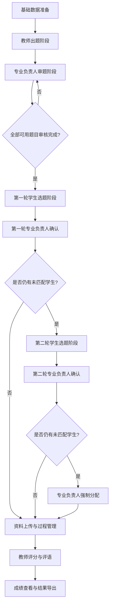
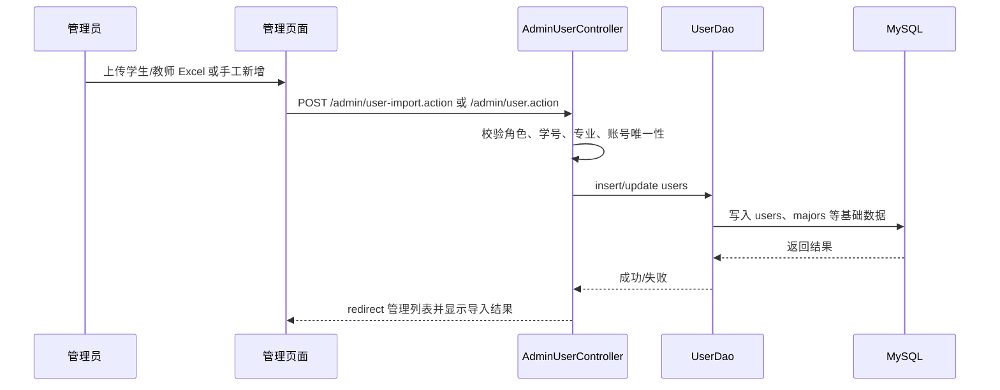
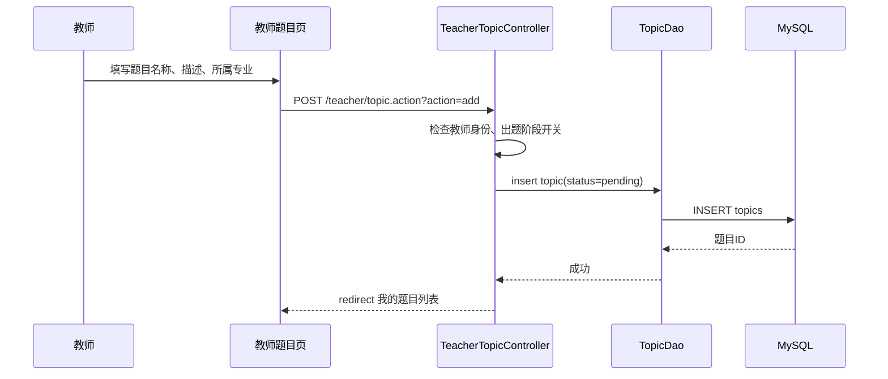
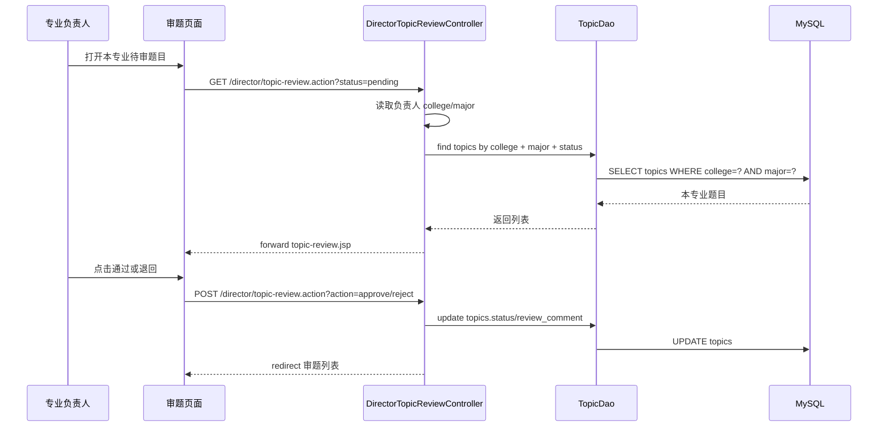
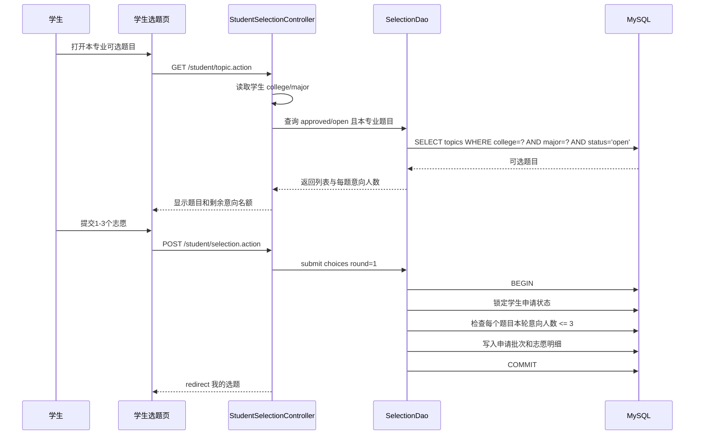
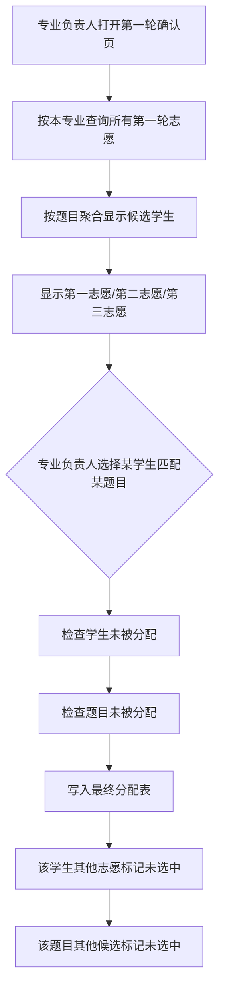
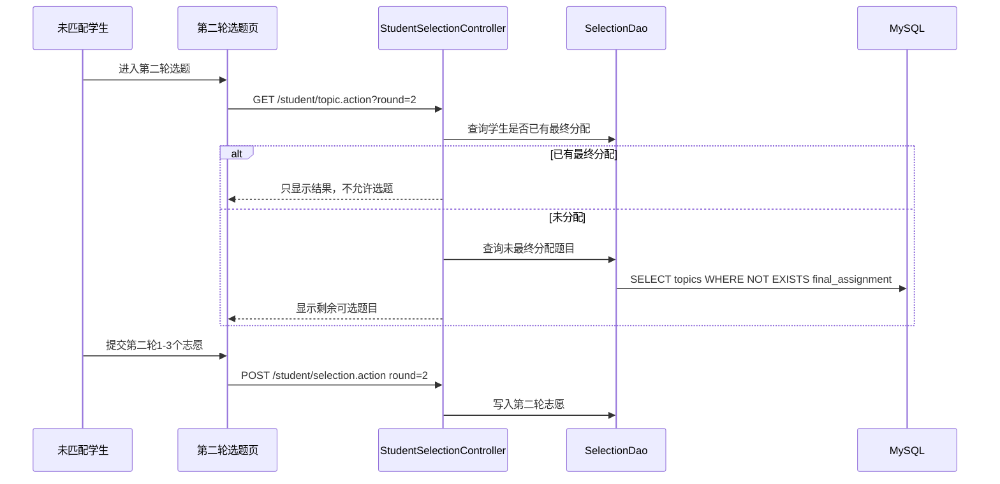
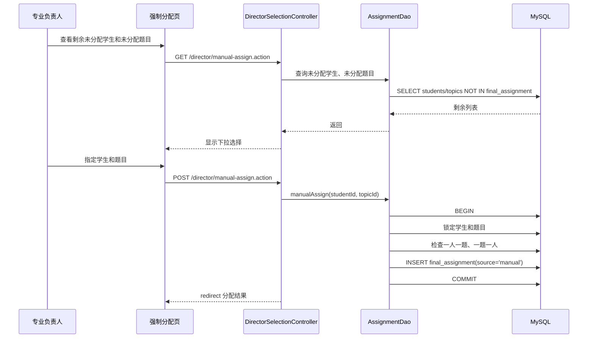
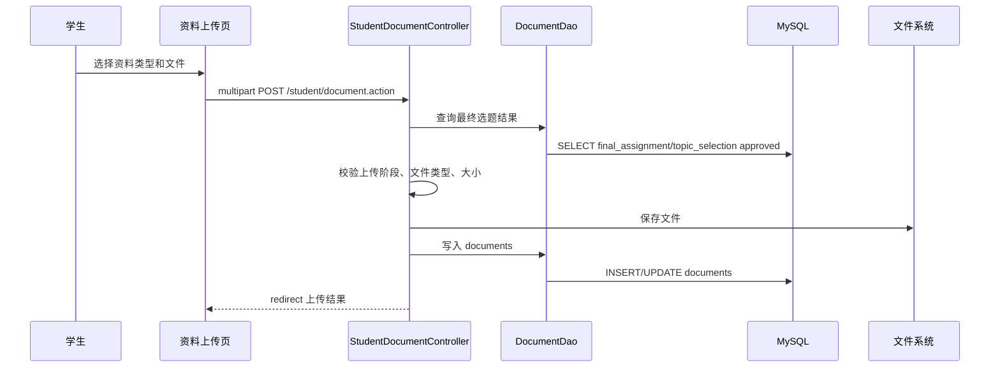
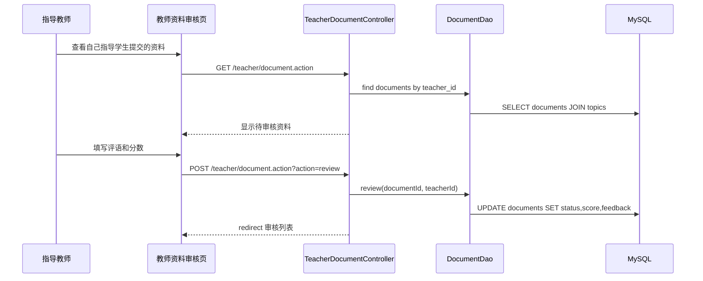

# 毕业设计管理系统实际数据流与业务逻辑需求报告

> 本报告根据老师口述需求整理，目标是说明系统应该怎样流转、各角色应该做什么、数据应该怎样从页面进入数据库并形成最终结果。报告重点放在毕业设计核心业务，不展开 AI 助手、站内消息、公告模板、统计图表等锦上添花模块。

---

## 1. 需求理解总览

毕业设计管理系统不是普通“学生选课系统”，也不是简单的增删改查。它的核心业务是：

```text
教务管理员准备基础数据
  -> 教师提交毕业设计题目
  -> 专业负责人审核题目
  -> 学生按专业填报题目志愿
  -> 专业负责人确认最终一一对应关系
  -> 未匹配学生进入第二轮
  -> 第二轮后仍未匹配则强制分配
  -> 学生上传毕业设计资料
  -> 教师给评语和成绩
```

其中最重要的业务点是：

1. **管理员和专业负责人不能混淆。**管理员负责基础数据和后台管理；专业负责人负责本专业题目审核、选题确认和强制分配。
2. **学生选题不是选课。**学生提交的是意向志愿，不是选中后立即确定。
3. **最终必须一题一人、一人一题。**一个毕业设计题目最终只能分配给一个学生，每个学生最终也只能得到一个题目。
4. **学生最多填 3 个志愿。**至少填 1 个，最多填 3 个，同一学生不能重复选择同一题目。
5. **一个题目在选题阶段最多被 3 个学生填为志愿。**不管是第一志愿、第二志愿还是第三志愿，都计入该题目的意向人数限制。
6. **专业负责人要确认，不是学生点了就定。**题目最终归属必须由专业负责人确认。
7. **必须有轮次。**第一轮结束后，只允许未分配到题目的学生和未最终分配的题目进入第二轮；第二轮后仍未匹配则由专业负责人强制分配。
8. **题目审核通过后应锁定。**题目一旦通过审核并进入学生选题阶段，教师不应再随意修改，否则审核失去意义。

---

## 2. 角色与职责边界

### 2.1 教务管理员 / 管理员

管理员是后台基础数据和系统运行状态的维护者，不是专业负责人。

主要职责：

- 维护学院、专业、班级等基础信息。
- 新增、导入、修改学生信息。
- 新增、导入、修改教师信息。
- 配置专业负责人账号及其负责专业范围。
- 重置学生或教师密码。
- 控制系统阶段开关，例如教师出题是否开放、学生选题是否开放、资料上传是否开放。
- 查看全校范围内的选题、资料上传、成绩、评定书等结果。
- 导出结果表、成绩表、上传情况表等。

不应该由管理员承担的职责：

- 不直接审核某个专业教师出的题。
- 不直接替专业负责人确认第一轮、第二轮选题结果。
- 不代替导师给学生论文评语。

### 2.2 专业负责人

专业负责人对应某一个专业，是本专业毕业设计流程的业务负责人。

主要职责：

- 查看本专业教师提交的题目。
- 审核题目：通过或退回修改。
- 查看本专业学生、教师、题目、选题结果、成绩。
- 第一轮选题结束后，根据学生志愿确认最终匹配结果。
- 第二轮选题结束后，再次确认匹配结果。
- 第二轮后仍未匹配时，手动强制分配剩余学生和剩余题目。
- 可选增强：分配评阅教师。

专业负责人查看数据的范围必须限定为：

```text
专业负责人.college + 专业负责人.major
```

即只能处理自己负责专业的数据。

### 2.3 教师 / 指导教师

教师的核心职责比较单一：出题、看自己指导的学生、给评语和成绩。

主要职责：

- 在教师出题阶段提交毕业设计题目。
- 查看自己提交的题目及审核状态。
- 对被退回的题目进行修改并重新提交。
- 题目审核通过后，原则上不能再修改题目内容。
- 查看最终分配到自己题目下的学生。
- 查看学生提交的资料。
- 对学生资料、论文或最终成果给出评语和成绩。

教师不应该做的事：

- 不作为最终选题确认人。
- 不决定某个热门题目最终分给哪个学生。
- 不跨专业查看或处理其他教师题目。

### 2.4 学生

学生是选题和资料提交的主体。

主要职责：

- 查看本专业已审核通过的题目。
- 在选题开放阶段填报 1 至 3 个志愿。
- 查看选题申请状态和最终分配结果。
- 未分配成功时参加第二轮选题。
- 最终确定题目后上传开题、中期、终稿等资料。
- 查看教师评语、成绩和答辩安排。

学生选题范围必须限定为：

```text
学生.college + 学生.major
```

学生不能选择其他专业的题目。

---

## 3. 系统阶段与状态机需求

系统应当按阶段推进，不能所有功能同时开放。

### 3.1 阶段总流程



### 3.2 阶段开关

建议维护以下阶段开关或流程状态：

| 阶段 | 开关/状态 | 开放对象 | 允许操作 |
|---|---|---|---|
| 基础数据准备 | `data_prepare` | 管理员 | 导入学生、教师、专业、负责人 |
| 教师出题 | `topic_submit` | 教师 | 新增、修改待审/退回题目 |
| 题目审核 | `topic_review` | 专业负责人 | 审核通过、退回题目 |
| 第一轮选题 | `selection_round1` | 学生 | 提交 1-3 个志愿 |
| 第一轮确认 | `confirm_round1` | 专业负责人 | 根据志愿确认题目归属 |
| 第二轮选题 | `selection_round2` | 未匹配学生 | 对剩余题目提交 1-3 个志愿 |
| 第二轮确认 | `confirm_round2` | 专业负责人 | 再次确认题目归属 |
| 强制分配 | `manual_assign` | 专业负责人 | 人工指定剩余学生和剩余题目 |
| 资料上传 | `upload_*` | 已确定题目的学生 | 上传开题、中期、终稿等资料 |
| 成绩评定 | `grade_review` | 教师/可选评阅教师 | 填写评语和成绩 |

---

## 4. 核心数据对象需求

### 4.1 用户数据

用户表至少要支持：

| 字段 | 说明 |
|---|---|
| `id` | 用户 ID |
| `username` | 登录账号 |
| `password` | 密码摘要 |
| `role` | `admin` / `director` / `teacher` / `student` |
| `real_name` | 姓名 |
| `college` | 所属学院 |
| `major` | 所属专业 |
| `student_no` | 学号，学生必填 |
| `class_name` | 班级，学生必填 |
| `status` | 是否启用 |

业务约束：

- 学生必须有 `college`、`major`、`student_no`。
- 教师通常应有 `college`、`major` 或至少有出题所属专业范围。
- 专业负责人必须有 `college`、`major`，用于限定管理范围。
- 管理员不需要绑定具体专业。

### 4.2 题目数据

题目表至少要支持：

| 字段 | 说明 |
|---|---|
| `id` | 题目 ID |
| `title` | 题目名称 |
| `description` | 题目说明 |
| `teacher_id` | 出题教师 |
| `college` | 题目所属学院 |
| `major` | 题目所属专业 |
| `status` | `draft/pending/approved/rejected/locked/assigned` 等 |
| `review_comment` | 审核意见 |
| `reviewer_id` | 审核人，即专业负责人 |
| `review_time` | 审核时间 |
| `assigned_student_id` 或独立分配表 | 最终分配学生 |

业务约束：

- 只有 `approved/open` 状态题目能被学生看到。
- 题目审核通过后应锁定教师修改。
- 最终一个题目只能分配给一个学生。
- 题目所属专业决定哪些学生能看到。

### 4.3 志愿数据

为了满足“三志愿”，建议把一次学生选题申请拆成“申请批次”和“志愿明细”。

申请批次表可包含：

| 字段 | 说明 |
|---|---|
| `id` | 申请批次 ID |
| `student_id` | 学生 |
| `round` | 第几轮，1 或 2 |
| `status` | `submitted/confirmed/rejected/expired` |
| `submit_time` | 提交时间 |

志愿明细表可包含：

| 字段 | 说明 |
|---|---|
| `id` | 明细 ID |
| `application_id` | 所属申请批次 |
| `student_id` | 冗余学生 ID，便于查询 |
| `topic_id` | 志愿题目 |
| `choice_rank` | 志愿顺序：1、2、3 |
| `status` | `pending/selected/not_selected` |

关键约束：

- 同一学生同一轮只能有一个申请批次。
- 同一申请批次中 `choice_rank` 只能是 1、2、3，不能重复。
- 同一申请批次不能重复选择同一题目。
- 一个学生至少 1 个志愿，最多 3 个志愿。
- 一个题目在同一轮被填为志愿的学生数最多为 3。

### 4.4 最终分配数据

建议用独立分配表表示最终结果，不要把“志愿申请”和“最终分配”混在一起。

| 字段 | 说明 |
|---|---|
| `id` | 分配 ID |
| `student_id` | 学生 |
| `topic_id` | 最终题目 |
| `round` | 来源轮次：1、2、manual |
| `choice_rank` | 如果来源于志愿，记录第几志愿 |
| `confirmed_by` | 专业负责人 |
| `confirm_time` | 确认时间 |
| `confirm_comment` | 确认说明 |

必须有数据库约束：

```text
UNIQUE(student_id)
UNIQUE(topic_id)
```

这样才能从数据库层保证一人一题、一题一人。

---

## 5. 目标业务数据流

### 5.1 管理员导入基础数据流



关键规则：

- 管理员导入的数据是后续所有专业范围控制的基础。
- 学生没有专业信息时，后续无法正确限制选题范围。
- 专业负责人没有专业信息时，无法限定审题和确认范围。

### 5.2 教师出题数据流



核心规则：

- 新题目默认是 `pending`，学生不可见。
- 被退回题目可修改后重新提交。
- 已通过审核的题目不能再被教师修改。

### 5.3 专业负责人审题数据流



审核通过后：

- 题目进入可选状态。
- 教师不能再改题目内容。
- 学生在对应选题阶段才能看到。

审核退回后：

- 题目对学生不可见。
- 教师可看到退回意见并修改后重提。

### 5.4 第一轮学生三志愿选题数据流



核心规则：

- 学生至少选 1 个题目，最多选 3 个题目。
- 3 个志愿不能重复。
- 所有志愿题目必须属于学生专业。
- 所有志愿题目必须是审核通过、未最终分配的题目。
- 一个题目本轮最多被 3 个学生填报为志愿。
- 学生提交后，在本轮确认前不能重复提交多份有效志愿，除非系统允许在截止前修改并覆盖原志愿。

### 5.5 第一轮专业负责人确认数据流



确认页面必须让专业负责人清楚看到：

- 某个题目有多少学生填报。
- 每个学生把该题目填为第几志愿。
- 学生姓名、学号、班级。
- 题目指导教师。
- 该学生是否已被其他题目确认。
- 该题目是否已经分配给其他学生。

业务建议：

- 第一轮尽量优先满足第一志愿。
- 如果某学生第一志愿已被别人确认，是否在第一轮继续给第二/第三志愿，可以由专业负责人人工决定；但系统界面必须支持看清志愿顺序。
- 确认动作必须保证最终一题一人、一人一题。

### 5.6 第二轮选题数据流

第二轮不是重新让所有人全部再选一次，而是只处理剩余对象。

参与第二轮的学生：

```text
本专业学生 - 已经有最终分配记录的学生
```

参与第二轮的题目：

```text
本专业已审核通过题目 - 已经有最终分配记录的题目
```



核心规则：

- 已确认题目的学生可以登录，但只能查看结果，不能再选。
- 已确认给某学生的题目不能出现在第二轮可选列表。
- 第二轮志愿提交、确认规则与第一轮类似。
- 第二轮后不再开放第三轮。

### 5.7 强制分配数据流



强制分配不是让管理员去数据库里改，而是系统界面里由专业负责人操作。

---

## 6. 资料上传与审核需求

资料上传发生在选题最终确认之后。

### 6.1 上传前置规则

- 没有最终题目的学生不能上传毕业设计资料。
- 上传阶段应由管理员开关控制。
- 可以按资料类型设置开关，例如开题报告、中期检查、终稿。
- 可以要求阶段顺序：开题通过后才能交中期，中期通过后才能交终稿。

### 6.2 上传数据流



### 6.3 教师审核数据流



---

## 7. 成绩评定需求

### 7.1 简化版成绩

如果课程设计只要求基本功能，可以实现简化版：

- 指导教师对学生最终成果给出一个成绩。
- 指导教师填写评语。
- 学生只能查看自己的成绩和评语。
- 管理员和专业负责人可以查看或导出本范围成绩。

### 7.2 完整版成绩

如果要贴近真实毕业论文流程，可以实现三部分成绩：

| 成绩组成 | 权重 | 说明 |
|---|---:|---|
| 导师自评 | 40% | 指导教师给自己指导的学生评分和评语 |
| 评阅教师评分 | 20% | 由其他教师评阅论文并评分 |
| 答辩成绩 | 40% | 答辩环节评分和评语 |

最终成绩：

```text
final_score = advisor_score * 0.4 + reviewer_score * 0.2 + defense_score * 0.4
```

注意：不能做成“期中成绩、期末成绩、总评成绩”那种课程成绩模型。

---

## 8. 必须重点实现的核心模块

按老师口述需求，答辩或验收最应关注以下模块：

1. 角色边界：管理员、专业负责人、教师、学生职责清晰。
2. 阶段控制：出题、审题、第一轮、第二轮、强制分配、资料上传不能混乱。
3. 题目审核：教师出题后专业负责人审核，通过后题目锁定。
4. 三志愿选题：学生最多 3 个志愿，至少 1 个。
5. 意向人数限制：每题最多 3 个学生填报为志愿。
6. 专业负责人确认：根据志愿顺序和题目候选列表确认最终对应。
7. 第二轮逻辑：只让未分配学生和未分配题目参与。
8. 强制分配：第二轮后仍未匹配时，专业负责人手工指定。
9. 最终唯一性：一人一题，一题一人，由数据库约束兜底。
10. 资料上传与成绩：确认题目后上传资料，教师给评语和成绩。

---

## 9. 非重点模块说明

以下模块属于锦上添花，不应掩盖核心业务是否正确：

- AI 助手。
- 站内消息。
- 公告发布。
- 文件模板下载。
- 统计图表。
- 美化仪表盘。
- 通用日志列表。

这些功能可以提升系统完整度，但毕业设计管理系统的核心评价点仍然是选题业务流程是否符合真实需求。

