# 毕业设计管理系统 — 业务逻辑与数据流文档

## 一、系统概述

本系统是一个基于 JSP + Servlet + MySQL 的毕业设计管理系统，采用经典 MVC 架构。

**技术栈：**
- 后端：Java 8 + Servlet 4.0 + JSP
- 数据库：MySQL 8.3（JDBC 直连，无 ORM）
- 前端：Bootstrap 5.3.3 + 原生 JavaScript
- 构建：Maven，部署在 Tomcat（端口 8086）

**三种用户角色：**
- 管理员（admin）：管理用户和公告
- 教师（teacher）：发布课题、审核选题、评阅文档
- 学生（student）：选题、提交文档、查看成绩

---

## 二、系统架构分层

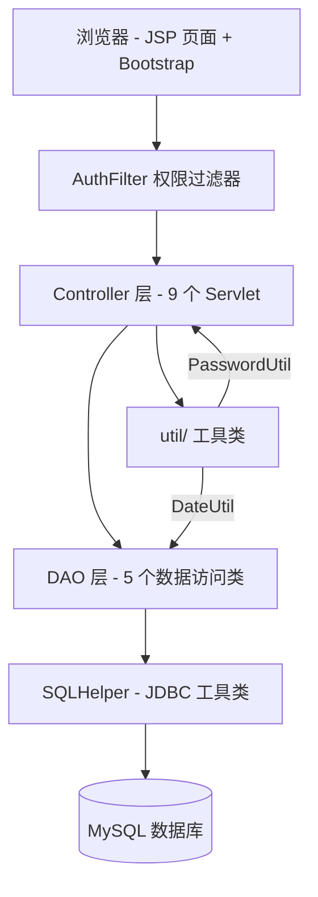

**请求处理链路：**

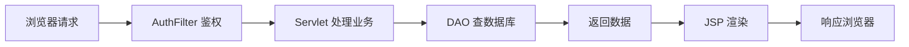

---

## 三、数据库设计（8 张表）

### 3.1 核心表关系图

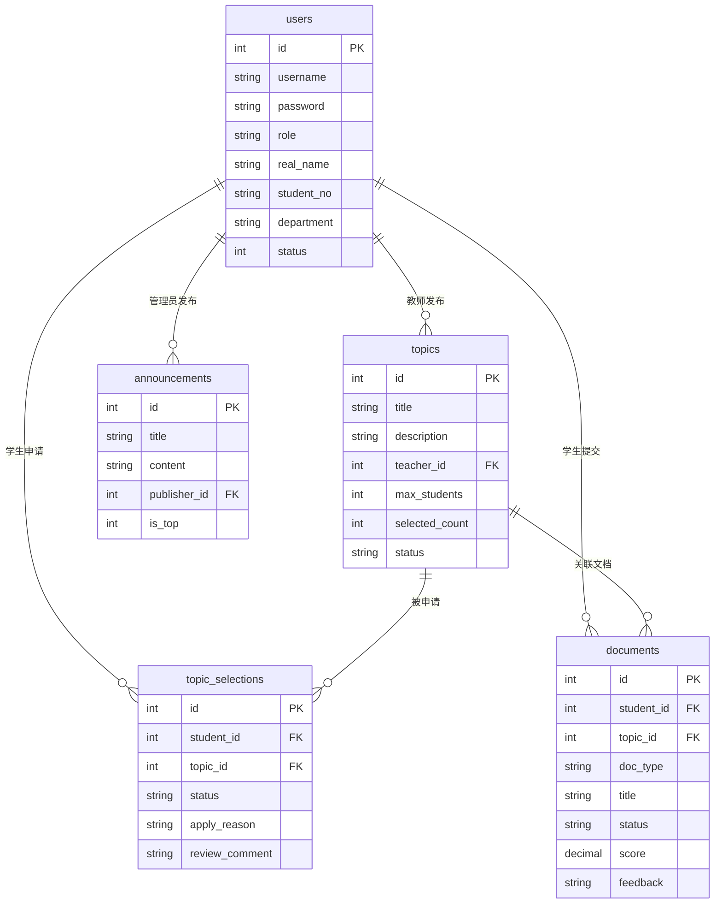

### 3.2 各表字段说明

| 表名 | 核心字段 | 说明 |
|------|---------|------|
| users | id, username, password(MD5), role, real_name, student_no, department, status | 所有用户统一存储，role 区分角色 |
| topics | id, title, description, teacher_id, max_students, selected_count, status | status: open/closed |
| topic_selections | id, student_id, topic_id, status, apply_reason, review_comment | status: pending/approved/rejected/cancelled |
| documents | id, student_id, topic_id, doc_type, title, content, file_path, status, score, feedback | doc_type: proposal/midterm/final |
| announcements | id, title, content, publisher_id, is_top | is_top=1 表示置顶 |
| defense_schedules | id, student_id, defense_time, room, score | 答辩安排（预留） |
| operation_logs | id, user_id, action, target, detail | 操作审计 |
| messages | id, sender_id, receiver_id, title, content, is_read | 站内信（预留） |

---

## 四、核心业务流程详解

### 4.1 用户认证流程

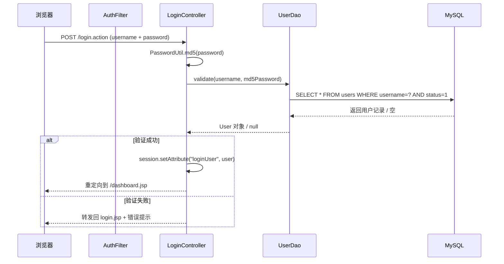

**角色跳转：** dashboard.jsp 是同一个页面，内部根据 `loginUser.role` 动态渲染不同面板内容。

**AuthFilter 鉴权逻辑：**

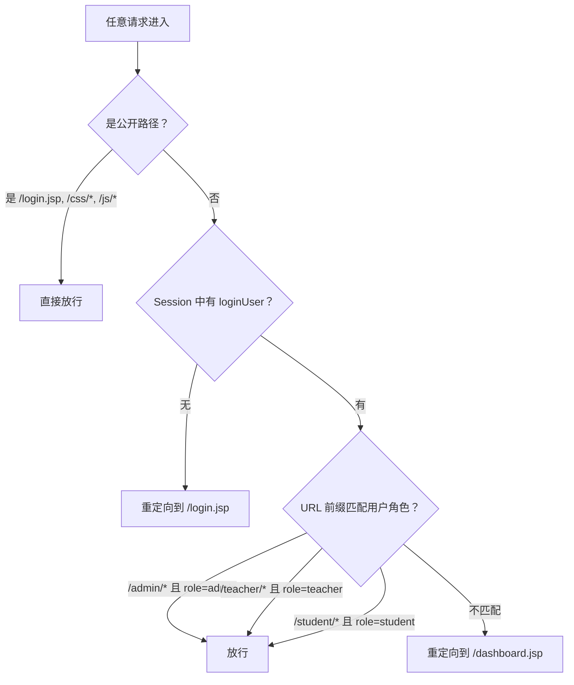

### 4.2 选题业务流程（核心流程）

这是系统最核心的业务，涉及学生、教师、课题三方交互：

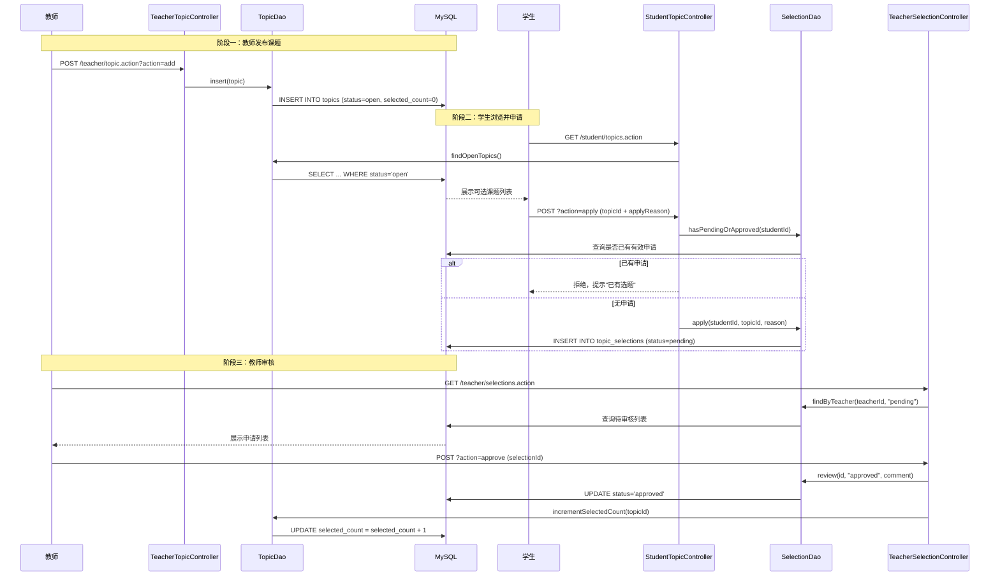

**选题状态机：**

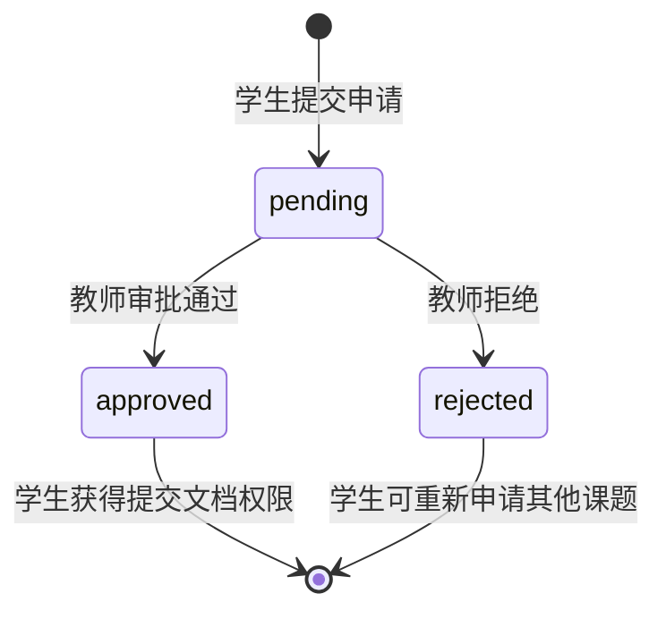

**课题名额控制逻辑：**

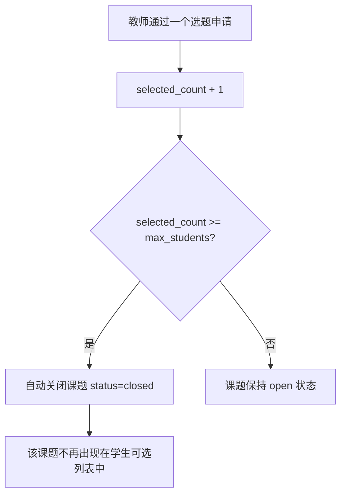

### 4.3 文档提交与评阅流程

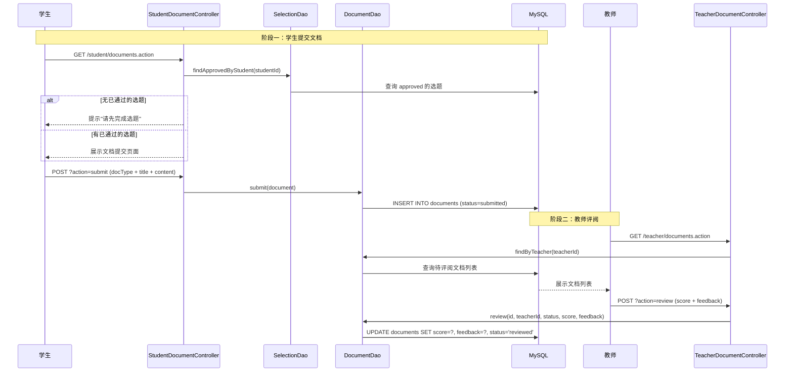

**文档类型说明：**
| 类型 | 含义 | 提交阶段 |
|------|------|---------|
| proposal | 开题报告 | 选题通过后第一步 |
| midterm | 中期检查报告 | 项目进行中 |
| final | 毕业论文/设计终稿 | 最终提交 |

**文档状态流转：**

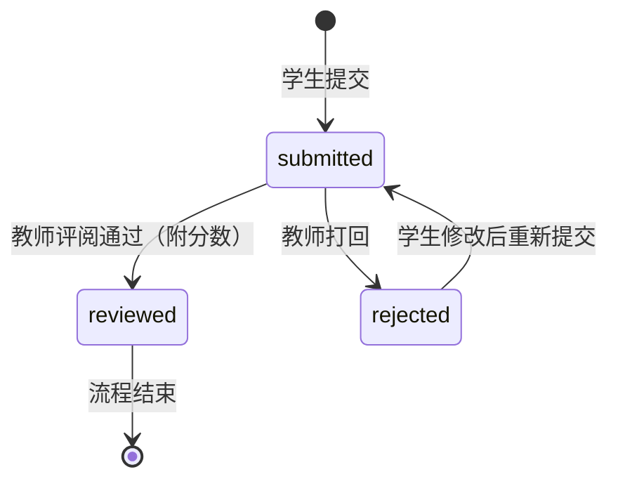

### 4.4 管理员业务流程

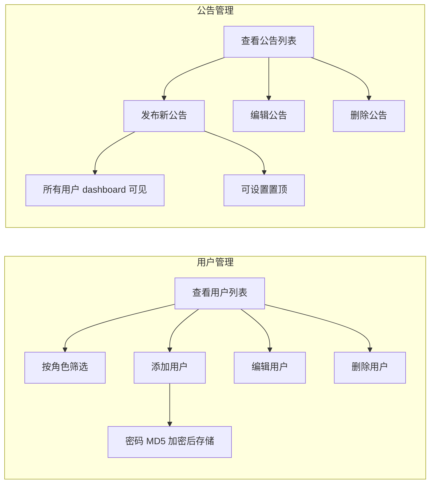

---

## 五、完整数据流图（端到端）

### 5.1 学生视角的完整生命周期

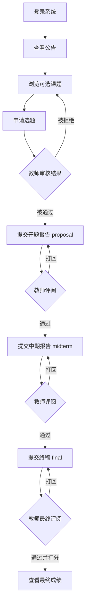

### 5.2 教师视角的完整生命周期

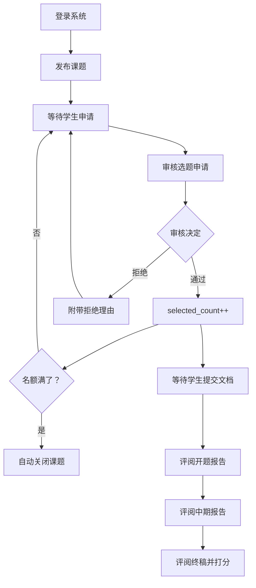

---

## 六、关键代码路径映射

| 业务操作 | Controller | DAO 方法 | 数据库表 |
|---------|-----------|---------|---------|
| 登录 | LoginController | UserDao.findByUsername() | users |
| 教师发布课题 | TeacherTopicController | TopicDao.add() | topics |
| 学生浏览课题 | StudentTopicController | TopicDao.findOpen() | topics |
| 学生申请选题 | StudentTopicController | SelectionDao.add() | topic_selections |
| 教师审核选题 | TeacherSelectionController | SelectionDao.updateStatus() | topic_selections |
| 学生提交文档 | StudentDocumentController | DocumentDao.add() | documents |
| 教师评阅文档 | TeacherDocumentController | DocumentDao.updateReview() | documents |
| 管理员管理用户 | AdminUserController | UserDao.add/update/delete() | users |
| 管理员发公告 | AdminAnnouncementController | AnnouncementDao.add() | announcements |

---

## 七、Session 与状态管理

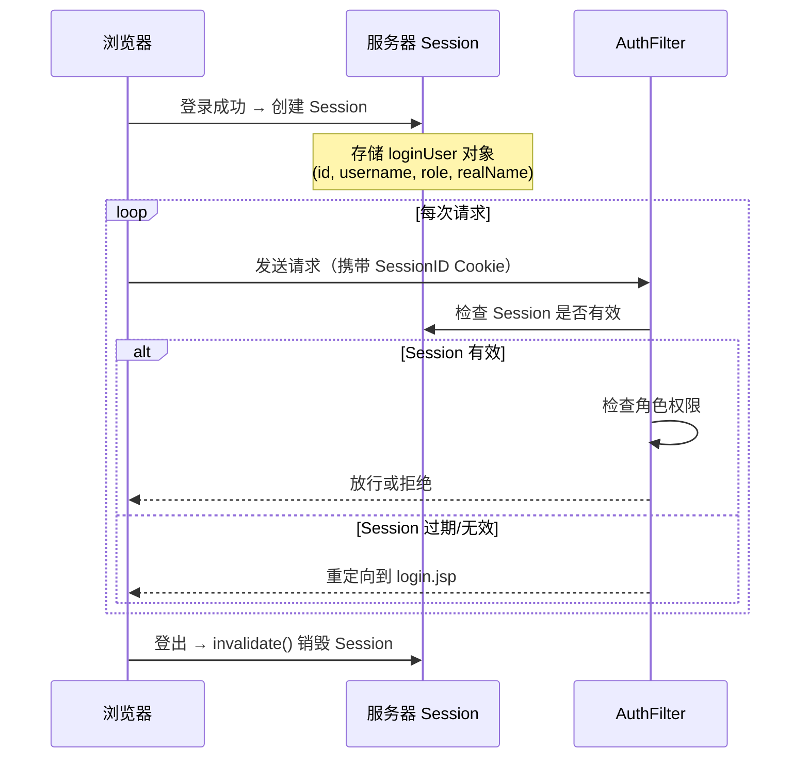

**Session 存储内容：**

| Key | Value | 用途 |
|-----|-------|------|
| loginUser | User 对象 | 包含 id、username、role、realName、department |

**生命周期：** 登录创建 → 每次请求校验 → 登出销毁 / 30分钟无操作自动过期

---

## 八、页面路由与导航结构

```
公开页面：
  /login.jsp              → 登录页

登录后公共页面：
  /dashboard.jsp          → 根据 role 动态渲染不同面板内容

管理员页面（/admin/*）：
  /admin/users.action     → 用户管理
  /admin/announcements.action → 公告管理

教师页面（/teacher/*）：
  /teacher/topics.action      → 我的课题管理
  /teacher/selections.action  → 选题审核
  /teacher/documents.action   → 文档评阅

学生页面（/student/*）：
  /student/topics.action      → 浏览课题 & 申请选题
  /student/my-selection.action → 我的选题状态
  /student/documents.action   → 提交文档
  /student/grades.action      → 查看成绩
```

---

## 九、业务规则约束总结

| 规则 | 说明 |
|------|------|
| 一个学生同时只能有一个有效选题 | pending 或 approved 状态算有效，rejected 不算 |
| 课题有名额限制 | selected_count >= max_students 时自动关闭 |
| 提交文档的前提 | 学生必须有 approved 状态的选题 |
| 教师只能管理自己的课题 | 查询和操作都限定 teacher_id = 当前登录教师 |
| 密码存储方式 | MD5 单向哈希，登录时比对哈希值 |
| 文档评阅权限 | 只有指导该学生的教师可以评阅其文档 |

---

## 十、预留功能（已建表未实现）

1. **答辩安排（defense_schedules）**：可分配答辩时间、教室、分组，记录答辩成绩
2. **站内信（messages）**：用户间消息通知，支持已读/未读状态
3. **操作日志（operation_logs）**：完整操作审计追踪

---

## 十一、测试账号

| 角色 | 用户名 | 密码 |
|------|--------|------|
| 管理员 | admin | admin123 |
| 教师 | teacher01 / teacher02 | 123456 |
| 学生 | student01 ~ student05 | 123456 |

---

## 十二、项目文件架构设计说明

### 12.1 为什么要这样分层？

本项目采用经典的 **MVC + DAO 分层架构**，这是 JavaWeb 项目的标准设计模式：

```
src/
├── bean/          ← Model 层（数据模型）
├── controller/    ← Controller 层（请求处理）
├── dao/           ← 数据访问层（操作数据库）
├── dbutil/        ← 基础设施层（JDBC 封装）
├── filter/        ← 过滤器层（横切关注点）
└── util/          ← 工具层（通用工具方法）
```

**分层的核心目的：职责分离，各管各的事。**

打个比方：如果把整个系统比作一家餐厅——
- **JSP 页面** = 前台服务员（负责跟客人打交道，展示菜单）
- **Controller** = 领班（接收点单，协调后厨）
- **DAO** = 厨师（真正操作食材/数据）
- **Bean** = 菜品标准（定义一道菜长什么样）
- **SQLHelper** = 厨房设备（锅碗瓢盆，谁都要用）
- **Filter** = 门卫（检查你有没有资格进来）

### 12.2 各模块详细职责

#### bean/ — 数据模型层（5 个类）

| 类名 | 职责 | 核心字段 |
|------|------|---------|
| User.java | 定义"用户"长什么样 | id, username, password, role, realName, studentNo, department |
| Topic.java | 定义"课题"长什么样 | id, title, description, teacherId, teacherName, maxStudents, selectedCount, status |
| TopicSelection.java | 定义"选题申请"长什么样 | id, studentId, topicId, status, applyReason, reviewComment |
| Document.java | 定义"提交文档"长什么样 | id, studentId, docType, title, content, filePath, status, score, feedback |
| Announcement.java | 定义"公告"长什么样 | id, title, content, publisherId, isTop |

**设计原因：** Bean 是纯数据容器（POJO），只有 getter/setter，不包含任何业务逻辑。它是各层之间传递数据的"标准格式"，就像快递的标准包装箱。

#### controller/ — 控制器层（9 个 Servlet）

| 类名 | URL 映射 | 职责 |
|------|---------|------|
| LoginController | /login.action | 处理登录请求，验证身份，创建 Session |
| LogoutController | /logout.action | 销毁 Session，退出登录 |
| AdminUserController | /admin/user.action | 管理员增删改查用户 |
| AdminAnnouncementController | /admin/announcement.action | 管理员管理公告 |
| TeacherTopicController | /teacher/topic.action | 教师管理自己的课题 |
| TeacherSelectionController | /teacher/selection.action | 教师审核学生选题 |
| TeacherDocumentController | /teacher/document.action | 教师评阅学生文档 |
| StudentTopicController | /student/topic.action | 学生浏览课题、申请选题 |
| StudentDocumentController | /student/document.action | 学生提交文档 |

**设计原因：** Controller 是"交通警察"，它不自己干活，只负责：
1. 接收浏览器请求（从 request 中取参数）
2. 调用 DAO 完成数据操作
3. 把结果塞进 request/session
4. 转发到对应的 JSP 页面展示

**为什么按角色分开写？** 因为不同角色的操作完全不同，分开后每个 Controller 只关心自己角色的事，代码清晰不混乱。

#### dao/ — 数据访问层（5 个类）

| 类名 | 职责 | 关键方法 |
|------|------|---------|
| UserDao | 操作 users 表 | findByUsername(), validate(), insert(), update(), delete(), countByRole() |
| TopicDao | 操作 topics 表 | findOpenTopics(), findByTeacher(), insert(), update(), delete() |
| SelectionDao | 操作 topic_selections 表 | apply(), review(), hasPendingOrApproved(), findByStudent(), findByTeacher() |
| DocumentDao | 操作 documents 表 | submit(), review(), findByStudent(), findByTeacher() |
| AnnouncementDao | 操作 announcements 表 | findAll(), insert(), update(), delete() |

**设计原因：** DAO 把所有 SQL 操作封装起来。Controller 不需要知道 SQL 怎么写，只需要调用 `topicDao.findOpenTopics()` 就能拿到数据。好处是：
- 如果将来换数据库（MySQL → PostgreSQL），只改 DAO 层，Controller 完全不动
- SQL 集中管理，不散落在各处，好维护

#### dbutil/ — 数据库工具层（1 个类）

| 类名 | 职责 |
|------|------|
| SQLHelper | JDBC 连接管理 + SQL 执行封装 |

**核心方法：**
- `getConnection()` — 创建数据库连接
- `queryList(sql, params)` — 执行查询，返回多行结果
- `queryScalar(sql, params)` — 执行查询，返回单个值
- `executeUpdate(sql, params)` — 执行增删改
- `executeInsert(sql, params)` — 执行插入并返回自增 ID

**设计原因：** 所有 DAO 都需要操作数据库，如果每个 DAO 都自己写 JDBC 连接代码会大量重复。SQLHelper 把重复的"获取连接 → 预编译 → 绑定参数 → 执行 → 关闭"封装成通用方法，所有 DAO 调用它即可。

#### filter/ — 过滤器层（1 个类）

| 类名 | 职责 |
|------|------|
| AuthFilter | 拦截所有请求，做登录检查和角色权限校验 |

**设计原因：** 权限检查是每个请求都要做的事（"横切关注点"）。如果在每个 Controller 里都写一遍 `if (session.getAttribute("loginUser") == null)`，代码重复且容易遗漏。用 Filter 统一拦截，一处配置全局生效。

#### util/ — 工具层（2 个类）

| 类名 | 职责 |
|------|------|
| PasswordUtil | MD5 密码哈希（加密存储，登录比对） |
| DateUtil | 数据库时间戳类型转换为 Java Date 类型 |

**设计原因：** 多个地方都需要做密码加密和日期转换，抽成工具类避免重复代码。

### 12.3 各层之间的调用关系（Mermaid 图）

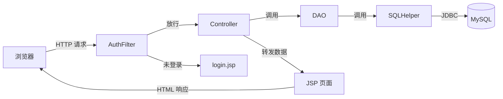

---

## 十三、最近代码改动分析（是否影响业务逻辑）

### 改动清单

| 文件 | 改动内容 | 影响范围 |
|------|---------|---------|
| src/dbutil/SQLHelper.java | JDBC URL 新增 `&connectionCollation=utf8mb4_unicode_ci` | 仅影响字符编码 |
| src/filter/AuthFilter.java | 新增 `request/response.setCharacterEncoding("UTF-8")` | 仅影响字符编码 |
| sql/init-db.bat | 新增数据库初始化脚本 | 便捷工具，不影响运行逻辑 |

### 结论：对原有业务逻辑零影响

这两处改动都是**编码修复**，目的是解决中文乱码问题：

1. **SQLHelper.java** — 加了 `connectionCollation=utf8mb4_unicode_ci`，确保 JDBC 连接和数据库的字符排序规则一致，避免中文字段查询/排序出现乱码。纯连接参数，不改变任何 SQL 逻辑。

2. **AuthFilter.java** — 加了 UTF-8 编码设置，确保从表单提交的中文内容（比如课题标题、申请理由）在 Controller 中能正确读取。这是全局生效的，所有请求都受益，但不改变任何业务判断逻辑。

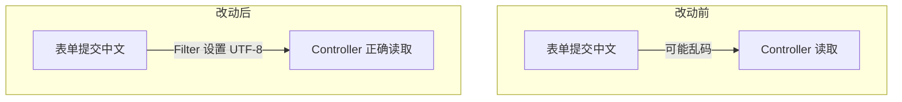


