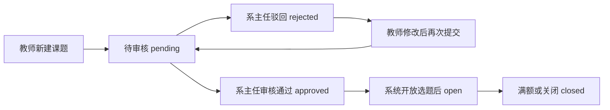

# 毕业设计管理系统缺失功能详细对照说明

生成日期：2026-06-22
项目位置：`D:\Myproject\jspproject\毕业设计管理系统`

## 1. 总体结论

当前项目已经不是空壳，已经具备一个三角色毕业设计管理系统的主要业务闭环：

- 管理员：用户管理、公告管理、答辩安排、统计分析、成绩导出、操作日志、站内消息。
- 教师：课题管理、选题审批、文档审核、学生进度查看、答辩安排查看、站内消息。
- 学生：浏览课题、申请选题、查看选题结果、提交阶段文档、查看成绩、查看答辩安排、站内消息。

但是如果严格对照题目中“人工智能学部本科生毕业设计管理系统——系统基础数据与毕设资料管理模块设计与实现”的完整需求，当前项目仍然缺少若干关键教务流程功能，尤其是：

1. 没有独立“系主任”角色。
2. 没有教师、学生基础数据 Excel 导入。
3. 没有课题审核流程。
4. 没有一轮、二轮选题流程控制。
5. 没有全局系统开放状态开关。
6. 没有教师分组管理。
7. 没有文件模板管理。
8. 没有用户个人中心和自助修改密码。
9. 没有完整的多条件信息查询与批量导出。
10. 没有完整评分体系中的自评、互评、答辩意见、综合成绩。

按完成度估算：

| 对照口径 | 当前完成度 | 说明 |
|---|---:|---|
| 三角色毕业设计管理系统 | 70% ~ 75% | 核心选题、文档、审核、成绩、公告、统计均已实现。 |
| 严格四角色完整版需求 | 55% ~ 60% | 缺系主任、二轮选题、系统开关、教师分组、数据导入等流程。 |
| 基础数据与毕设资料管理模块 | 65% ~ 70% | 用户数据、学院专业字典、文档资料管理已有；缺批量导入、模板管理、资料分类细化。 |

## 2. 当前已经实现的部分

### 2.1 用户与权限基础

当前项目已经实现三类用户：

- `admin`：管理员。
- `teacher`：教师。
- `student`：学生。

相关代码和页面：

- `src/filter/AuthFilter.java`
- `src/controller/LoginController.java`
- `src/controller/LogoutController.java`
- `src/controller/AdminUserController.java`
- `WebContent/login.jsp`
- `WebContent/admin/users.jsp`

已实现能力：

- 登录。
- 登出。
- Session 权限控制。
- 按角色访问 `/admin/`、`/teacher/`、`/student/` 页面。
- 管理员维护用户信息。
- 禁用用户后登录态失效。

### 2.2 基础数据

数据库中已经有以下基础数据表：

- `users`：用户。
- `colleges`：学院。
- `majors`：专业。
- `dictionary_items`：字典项。
- `system_configs`：系统配置。

相关脚本：

- `sql/init.sql`
- `sql/migrate_dictionary_config_20260622.sql`

已实现能力：

- 学院、专业数据初始化。
- 角色字典、文档类型字典、状态字典初始化。
- 用户基础信息存储。
- 页面上部分使用学院、专业、角色字典。

### 2.3 课题与选题

相关代码和页面：

- `src/controller/TeacherTopicController.java`
- `src/controller/StudentTopicController.java`
- `src/controller/TeacherSelectionController.java`
- `src/dao/TopicDao.java`
- `src/dao/SelectionDao.java`
- `WebContent/teacher/topics.jsp`
- `WebContent/teacher/selections.jsp`
- `WebContent/student/topics.jsp`
- `WebContent/student/my-selection.jsp`

已实现能力：

- 教师新增课题。
- 教师编辑课题。
- 教师删除课题。
- 学生浏览开放课题。
- 学生提交选题申请。
- 教师审批学生申请。
- 课题名额限制。
- 学生不能同时有多个待审或已通过选题。
- 课题满额后自动关闭。

### 2.4 文档资料管理

相关代码和页面：

- `src/controller/StudentDocumentController.java`
- `src/controller/TeacherDocumentController.java`
- `src/controller/DownloadController.java`
- `src/dao/DocumentDao.java`
- `src/dao/DocumentVersionDao.java`
- `WebContent/student/documents.jsp`
- `WebContent/teacher/documents.jsp`

已实现能力：

- 学生提交开题报告。
- 学生提交中期检查。
- 学生提交终稿。
- 支持附件上传。
- 教师下载和审核文档。
- 教师给分和填写反馈。
- 被退回后可重新提交。
- 保存文档版本历史。
- 限制文档阶段顺序：开题通过后才能交中期，中期通过后才能交终稿。

### 2.5 公告、消息、统计、答辩

相关代码和页面：

- `src/controller/AdminAnnouncementController.java`
- `src/controller/MessageController.java`
- `src/controller/AdminStatsController.java`
- `src/controller/AdminExportController.java`
- `src/controller/AdminDefenseController.java`
- `src/controller/AdminDefenseImportController.java`
- `WebContent/admin/announcements.jsp`
- `WebContent/admin/messages.jsp`
- `WebContent/admin/statistics.jsp`
- `WebContent/admin/defenses.jsp`
- `WebContent/teacher/messages.jsp`
- `WebContent/student/messages.jsp`
- `WebContent/teacher/defense.jsp`
- `WebContent/student/defense.jsp`

已实现能力：

- 管理员发布公告。
- 三类用户收发站内消息。
- 系统事件自动通知。
- 管理员查看统计图。
- 管理员导出成绩 Excel。
- 管理员维护答辩安排。
- 答辩安排支持 Excel 导入。
- 教师和学生查看答辩安排。

## 3. 详细缺失功能清单

## 3.1 缺少独立“系主任”角色

### 原需求

题目说明中存在四种用户：

1. 教务管理员。
2. 系主任。
3. 老师。
4. 学生。

其中系主任负责：

- 信息查询。
- 导出。
- 用户登录。
- 各功能系统开关。
- 教师分组。
- 信息发布。
- 审题。
- 确认题目与学生的一一对应关系。
- 组织第二轮选题。
- 手动分配未选题学生。

### 当前项目状态

当前数据库 `users.role` 只有：

- `admin`
- `teacher`
- `student`

当前权限控制也只判断这三类：

- `/admin/`
- `/teacher/`
- `/student/`

没有：

- `director`
- `dept_head`
- `系主任`

也没有对应页面目录：

- `WebContent/director/`
- `WebContent/dept/`

### 为什么算缺失

当前项目把系主任职责大多混入了管理员或教师：

- 课题审批由教师自己处理选题申请。
- 系统开关没有单独页面。
- 教师分组没有管理入口。
- 最终分配没有实现。

这和需求中的四角色流程不一致。

### 建议补法

数据库增加角色：

```sql
ALTER TABLE users MODIFY role ENUM('admin','director','teacher','student') NOT NULL;

INSERT INTO dictionary_items(dict_type, item_code, item_label, sort_order, status)
VALUES ('role', 'director', '系主任', 15, 1);
```

新增目录和页面：

- `WebContent/director/dashboard.jsp`
- `WebContent/director/topics-review.jsp`
- `WebContent/director/selection-rounds.jsp`
- `WebContent/director/teacher-groups.jsp`
- `WebContent/director/system-switches.jsp`

新增 Controller：

- `DirectorTopicReviewController`
- `DirectorSelectionController`
- `DirectorGroupController`
- `DirectorSystemConfigController`

修改 `AuthFilter.java`，增加 `/director/` 权限判断。

## 3.2 缺少教师和学生基础数据 Excel 导入

### 原需求

教务员应能导入：

- 有资格参加毕业设计的学生基本信息。
- 指导教师基本信息。

界面要求类似：

- 点击选择文件。
- 上传 Excel。
- 读取 Excel 内容。
- 写入数据库。
- 页面展示导入后的数据。

### 当前项目状态

当前已有 Excel 能力，但只用于答辩安排：

- `src/controller/AdminDefenseImportController.java`

管理员用户管理页面只能手动新增用户：

- `WebContent/admin/users.jsp`
- `src/controller/AdminUserController.java`

没有教师导入：

- 没有 `AdminTeacherImportController`
- 没有 `/admin/teacher-import.action`

没有学生导入：

- 没有 `AdminStudentImportController`
- 没有 `/admin/student-import.action`

### 为什么算缺失

题目明确强调“数据导入功能实现（教师数据输入）”和“数据导入功能实现（学生数据输入）”。当前项目没有这两个导入入口，只能逐条添加用户，不能满足批量基础数据维护。

### 建议补法

新增两个导入功能：

1. 教师 Excel 导入。
2. 学生 Excel 导入。

建议 Excel 字段：

教师表：

| 字段 | 说明 |
|---|---|
| username | 登录账号 |
| real_name | 姓名 |
| college | 学院 |
| major | 专业 |
| department | 院系 |
| email | 邮箱 |
| phone | 手机号 |

学生表：

| 字段 | 说明 |
|---|---|
| username | 登录账号 |
| student_no | 学号 |
| real_name | 姓名 |
| college | 学院 |
| major | 专业 |
| class_name | 班级 |
| email | 邮箱 |
| phone | 手机号 |

新增 Controller：

- `src/controller/AdminUserImportController.java`

新增页面入口：

- `WebContent/admin/users.jsp` 页面增加“导入教师 Excel”“导入学生 Excel”按钮。

可复用当前项目已有依赖：

- Apache POI 已在 `pom.xml` 中存在。

## 3.3 缺少课题审核流程

### 原需求

流程中明确要求：

1. 老师在规定时间段内出题。
2. 老师将已出好的题目交予系主任。
3. 系主任进行题目审核。
4. 系主任对部分题目进行修改与调整。
5. 确定所有题目，录入数据库。
6. 公布已确定的题目。

### 当前项目状态

当前课题表 `topics.status` 只有：

- `open`
- `closed`

教师新增课题时可以直接设置开放状态：

- `TeacherTopicController.java`
- `WebContent/teacher/topics.jsp`

学生只能看到开放课题：

- `TopicDao.findOpenTopics(...)`

### 为什么算缺失

当前流程是：

教师新增课题 -> 课题可开放 -> 学生可申请

需求流程应是：

教师提交课题 -> 系主任审核 -> 审核通过后公布 -> 学生才能选

当前少了：

- 待审核状态。
- 审核通过状态。
- 审核驳回状态。
- 审核意见。
- 审核人。
- 审核时间。
- 系主任审核页面。

### 建议补法

修改 `topics` 表：

```sql
ALTER TABLE topics
    MODIFY status ENUM('draft','pending','approved','rejected','open','closed') DEFAULT 'pending',
    ADD COLUMN review_comment TEXT DEFAULT NULL,
    ADD COLUMN reviewer_id INT DEFAULT NULL,
    ADD COLUMN review_time DATETIME DEFAULT NULL;
```

推荐状态流：



新增页面：

- `WebContent/director/topics-review.jsp`

新增 Controller：

- `DirectorTopicReviewController`

教师端也需要调整：

- 教师不能直接把新课题设置为 `open`。
- 教师只能提交审核或保存草稿。

## 3.4 缺少一轮、二轮选题流程

### 原需求

原流程中有明确的两轮选题：

1. 开启选题系统。
2. 学生第一轮选题。
3. 系主任确定题目与学生的一一对应性。
4. 确定第二轮选题学生名单和题目名单。
5. 关闭选题系统。
6. 再次开启选题系统。
7. 第二轮选题。
8. 关闭选题系统。
9. 系主任再次确认。
10. 对仍未选题学生进行手动分配。

### 当前项目状态

当前 `topic_selections` 表没有轮次字段。

当前选题状态只有：

- `pending`
- `approved`
- `rejected`
- `cancelled`

当前学生选题逻辑是：

- 学生只要没有 pending 或 approved 申请，就可以申请开放课题。
- 教师审批通过后即完成。

### 为什么算缺失

当前只有“单轮申请 + 教师审批”，没有：

- 第一轮。
- 第二轮。
- 轮次开始结束时间。
- 第一轮未中学生名单。
- 第二轮可选题目名单。
- 系主任统一确认。
- 最终未选学生强制分配。

### 建议补法

新增选题轮次表：

```sql
CREATE TABLE selection_rounds (
    id INT AUTO_INCREMENT PRIMARY KEY,
    round_no INT NOT NULL,
    name VARCHAR(50) NOT NULL,
    status ENUM('not_started','open','closed','confirmed') DEFAULT 'not_started',
    start_time DATETIME DEFAULT NULL,
    end_time DATETIME DEFAULT NULL,
    created_at DATETIME DEFAULT CURRENT_TIMESTAMP
);
```

修改选题表：

```sql
ALTER TABLE topic_selections
    ADD COLUMN round_id INT DEFAULT NULL,
    ADD FOREIGN KEY (round_id) REFERENCES selection_rounds(id);
```

新增功能：

- 系主任开启第一轮。
- 系主任关闭第一轮。
- 系主任确认第一轮结果。
- 系主任开启第二轮。
- 系主任关闭第二轮。
- 系主任确认第二轮结果。
- 查询未选题学生。
- 查询剩余可选课题。

## 3.5 缺少未选学生手动分配功能

### 原需求

流程第 17 步要求：

> 由系主任将未选题的学生手动分配未被选择的题目。

### 当前项目状态

当前只有学生主动申请，教师审批。

没有管理员或系主任替学生分配课题的 Controller 和页面。

### 为什么算缺失

真实毕业设计管理中，最后一定要保证学生与课题一一对应。当前系统无法处理：

- 学生一直未选题。
- 学生两轮都没中。
- 某些题目无人选择。
- 系主任最终兜底分配。

### 建议补法

新增页面：

- `WebContent/director/manual-assign.jsp`

页面显示两张表：

1. 未选题学生列表。
2. 剩余可分配题目列表。

新增 Controller：

- `DirectorManualAssignController`

核心逻辑：

```sql
-- 查询未选题学生
SELECT *
FROM users u
WHERE u.role='student'
  AND NOT EXISTS (
      SELECT 1
      FROM topic_selections s
      WHERE s.student_id=u.id
        AND s.status='approved'
  );

-- 查询未满额题目
SELECT *
FROM topics
WHERE status IN ('open','approved')
  AND selected_count < max_students;
```

分配时直接插入一条 `approved` 记录，并更新 `selected_count`。

## 3.6 缺少全局系统开放状态开关

### 原需求

开放状态需要控制：

- 教师出题系统开闭。
- 学生第一轮选题系统开闭。
- 学生第二轮选题系统开闭。
- 学生上传文档系统开闭。

教务员或系主任关闭系统后，用户不能继续操作。

### 当前项目状态

当前只有：

- `topics.status = open/closed`
- `system_configs` 表

但是没有页面和业务逻辑控制：

- 教师是否能出题。
- 学生是否能选题。
- 学生是否能上传开题报告。
- 学生是否能上传中期报告。
- 学生是否能上传终稿。

### 为什么算缺失

当前 `system_configs` 表只是配置项存储，没有真正变成“业务开关”。例如：

- 教师可以随时新增课题。
- 学生只要有开放课题就可以申请。
- 学生只要前置阶段通过就可以上传下一阶段。

这不符合“规定时间段内操作”的要求。

### 建议补法

在 `system_configs` 中增加：

```sql
INSERT INTO system_configs(config_key, config_value, description) VALUES
('switch.topic_submit', '0', '教师出题开关'),
('switch.selection_round1', '0', '第一轮选题开关'),
('switch.selection_round2', '0', '第二轮选题开关'),
('switch.upload_proposal', '0', '开题报告上传开关'),
('switch.upload_midterm', '0', '中期报告上传开关'),
('switch.upload_final', '0', '终稿上传开关');
```

新增管理页面：

- `WebContent/admin/system-switches.jsp`
- 或 `WebContent/director/system-switches.jsp`

在以下 Controller 中加开关判断：

- `TeacherTopicController.doPost`
- `StudentTopicController.doPost`
- `StudentDocumentController.doPost`

示例逻辑：

```java
if (!SystemConfigUtil.isEnabled("switch.topic_submit")) {
    WebUtil.redirect(request, response, "/teacher/topic.action?msg=system_closed");
    return;
}
```

## 3.7 缺少教师分组模块

### 原需求

题目六大模块之一包含：

> 教师分组模块

系主任也需要负责教师分组。

### 当前项目状态

当前只有答辩安排里的 `group_name` 字段：

- `defense_schedules.group_name`

但是没有真正的教师分组表：

- 没有 `teacher_groups`
- 没有 `teacher_group_members`

也没有教师分组页面和 Controller。

### 为什么算缺失

`group_name` 只是答辩安排文本字段，不能完成：

- 创建教师组。
- 指定组长。
- 分配组员。
- 按组管理答辩。
- 按组统计学生。
- 教师分组与题目/学生关联。

### 建议补法

新增表：

```sql
CREATE TABLE teacher_groups (
    id INT AUTO_INCREMENT PRIMARY KEY,
    group_name VARCHAR(100) NOT NULL,
    leader_id INT DEFAULT NULL,
    description TEXT,
    created_at DATETIME DEFAULT CURRENT_TIMESTAMP,
    FOREIGN KEY (leader_id) REFERENCES users(id)
);

CREATE TABLE teacher_group_members (
    id INT AUTO_INCREMENT PRIMARY KEY,
    group_id INT NOT NULL,
    teacher_id INT NOT NULL,
    FOREIGN KEY (group_id) REFERENCES teacher_groups(id),
    FOREIGN KEY (teacher_id) REFERENCES users(id),
    UNIQUE KEY uk_group_teacher (group_id, teacher_id)
);
```

新增页面：

- `WebContent/director/teacher-groups.jsp`

新增 Controller：

- `DirectorTeacherGroupController`

## 3.8 缺少文件模板管理

### 原需求

管理员模块要求包含：

> 文件模板管理

学生需要下载导师或管理员上传的相关参考资料和模板。

### 当前项目状态

当前项目有学生文档上传和教师下载审核，但没有文件模板表，也没有模板页面。

不存在：

- `file_templates` 表。
- `template_files` 表。
- 模板上传页面。
- 模板下载页面。

### 为什么算缺失

当前系统只能处理“学生提交材料”，不能处理“学校/管理员/教师发布模板材料”。这会影响：

- 开题报告模板。
- 中期检查模板。
- 论文格式模板。
- 答辩 PPT 模板。
- 源代码提交规范。

### 建议补法

新增表：

```sql
CREATE TABLE file_templates (
    id INT AUTO_INCREMENT PRIMARY KEY,
    title VARCHAR(200) NOT NULL,
    template_type ENUM('proposal','midterm','final','defense','other') NOT NULL,
    file_path VARCHAR(500) NOT NULL,
    uploader_id INT NOT NULL,
    status TINYINT DEFAULT 1,
    created_at DATETIME DEFAULT CURRENT_TIMESTAMP,
    FOREIGN KEY (uploader_id) REFERENCES users(id)
);
```

新增页面：

- `WebContent/admin/templates.jsp`
- `WebContent/student/templates.jsp`
- `WebContent/teacher/templates.jsp`

新增 Controller：

- `TemplateController`

功能：

- 管理员上传模板。
- 管理员删除模板。
- 教师和学生下载模板。
- 按模板类型筛选。

## 3.9 缺少个人中心和用户自助改密码

### 原需求

学生、教师登录后应能：

- 修改个人资料。
- 修改登录密码。

### 当前项目状态

当前管理员可以在用户管理中修改用户密码：

- `WebContent/admin/users.jsp`
- `AdminUserController`

但是学生和教师没有自己的个人中心页面。

不存在：

- `WebContent/profile.jsp`
- `ProfileController`
- `ChangePasswordController`

### 为什么算缺失

学生和教师登录后不能自助维护自己的基本信息和密码，只能依赖管理员。这不符合需求中“个人中心、个人信息”的功能描述。

### 建议补法

新增页面：

- `WebContent/profile.jsp`

新增 Controller：

- `ProfileController`

功能：

- 查看当前用户资料。
- 修改手机号。
- 修改邮箱。
- 修改密码。

密码修改建议要求：

- 输入旧密码。
- 输入新密码。
- 再次确认新密码。
- 新密码符合最小长度。
- 保存前使用 `PasswordUtil.hash()`。

## 3.10 缺少完整的信息查询功能

### 原需求

题目要求学生信息查询可以按以下条件：

- 学号。
- 姓名。
- 班级。
- 专业。
- 多条件组合查询。
- 查询整个班级或整个专业学生信息。
- 点击详情查看完整学生信息。

### 当前项目状态

当前管理员用户管理页面支持：

- 按角色筛选。
- 按学院筛选。
- 分页显示用户。

但是不完整支持：

- 学号精确查询。
- 姓名模糊查询。
- 班级查询。
- 专业查询。
- 组合查询。
- 学生详情页。
- 查询结果导出。

### 为什么算缺失

当前查询能力偏基础，无法完全覆盖题目中“信息查询功能实现”的要求。

### 建议补法

改造 `AdminUserController`：

增加查询参数：

- `studentNo`
- `realName`
- `className`
- `major`
- `college`
- `role`

改造 `UserDao.findAllPaged()` 和 `UserDao.countAll()`，增加多条件 SQL。

新增详情页：

- `WebContent/admin/user-detail.jsp`

新增导出：

- `/admin/user-export.action`

导出字段：

- 学号。
- 姓名。
- 学院。
- 专业。
- 班级。
- 指导教师。
- 选题。
- 开题状态。
- 中期状态。
- 终稿状态。
- 答辩状态。

## 3.11 缺少“批量修改”功能

### 原需求

教务员主页面中有：

> 批量修改

### 当前项目状态

当前没有批量修改页面和 Controller。

只能单个编辑用户、课题、答辩安排等。

### 为什么算缺失

管理员无法批量修改：

- 学生班级。
- 学生专业。
- 教师所属学院。
- 用户状态。
- 初始密码。
- 文档提交状态。

### 建议补法

新增页面：

- `WebContent/admin/batch-update.jsp`

新增 Controller：

- `AdminBatchUpdateController`

建议先实现最实用的两项：

1. 批量重置学生密码。
2. 批量修改学生学院、专业、班级。

## 3.12 缺少“重置学生密码”独立功能

### 原需求

教务员功能中明确包含：

> 重置学生密码

### 当前项目状态

当前管理员可以进入用户编辑弹窗修改某个用户的新密码。

但是没有独立的“重置学生密码”模块，也没有批量重置功能。

### 为什么算缺失

单个编辑密码只能算部分覆盖，不能算完整实现“重置学生密码”功能。

### 建议补法

新增按钮：

- 单个学生：重置为默认密码。
- 批量学生：按筛选结果重置。

新增接口：

- `/admin/reset-password.action`

重置策略：

- 默认密码：`123456`
- 或重置为学号后六位。

需要写操作日志。

## 3.13 缺少学生提问管理和老师答疑管理

### 原需求

学生模块中包含：

- 学生提问管理。
- 老师答疑管理。

教师模块中包含：

- 老师答疑管理。

### 当前项目状态

当前项目有站内消息：

- `MessageController`
- `messages` 表

站内消息可以用于老师和学生沟通，但它不是结构化的提问/答疑管理。

### 为什么算缺失

提问答疑管理通常需要：

- 问题标题。
- 问题内容。
- 所属课题。
- 提问学生。
- 回答教师。
- 问题状态。
- 提问时间。
- 回答时间。
- 是否公开给同课题学生。

当前消息只是点对点通信，没有形成“问题-答复-状态”的管理对象。

### 建议补法

新增表：

```sql
CREATE TABLE qa_questions (
    id INT AUTO_INCREMENT PRIMARY KEY,
    student_id INT NOT NULL,
    teacher_id INT NOT NULL,
    topic_id INT DEFAULT NULL,
    title VARCHAR(200) NOT NULL,
    question TEXT NOT NULL,
    answer TEXT DEFAULT NULL,
    status ENUM('unanswered','answered','closed') DEFAULT 'unanswered',
    created_at DATETIME DEFAULT CURRENT_TIMESTAMP,
    answered_at DATETIME DEFAULT NULL,
    FOREIGN KEY (student_id) REFERENCES users(id),
    FOREIGN KEY (teacher_id) REFERENCES users(id),
    FOREIGN KEY (topic_id) REFERENCES topics(id)
);
```

新增页面：

- `WebContent/student/questions.jsp`
- `WebContent/teacher/questions.jsp`

## 3.14 缺少完整评分模块

### 原需求

流程中包含：

- 教师填写自评意见。
- 教师填写互评意见。
- 输入成绩。
- 学生答辩。
- 输入答辩意见及成绩。

### 当前项目状态

当前已经实现：

- 文档审核分数。
- 文档审核反馈。
- 答辩分数。
- 答辩备注。
- 学生成绩查看。
- 管理员成绩导出。

但是没有：

- 指导教师评分。
- 评阅教师评分。
- 自评意见。
- 互评意见。
- 答辩委员会意见。
- 综合成绩计算。
- 权重配置。

### 为什么算缺失

当前成绩更像“阶段文档分数 + 答辩分数”，没有形成毕业设计完整评分体系。

### 建议补法

新增评分表：

```sql
CREATE TABLE grade_records (
    id INT AUTO_INCREMENT PRIMARY KEY,
    student_id INT NOT NULL,
    topic_id INT NOT NULL,
    teacher_score DECIMAL(5,2) DEFAULT NULL,
    teacher_comment TEXT DEFAULT NULL,
    reviewer_score DECIMAL(5,2) DEFAULT NULL,
    reviewer_comment TEXT DEFAULT NULL,
    defense_score DECIMAL(5,2) DEFAULT NULL,
    defense_comment TEXT DEFAULT NULL,
    final_score DECIMAL(5,2) DEFAULT NULL,
    created_at DATETIME DEFAULT CURRENT_TIMESTAMP,
    updated_at DATETIME DEFAULT CURRENT_TIMESTAMP ON UPDATE CURRENT_TIMESTAMP,
    FOREIGN KEY (student_id) REFERENCES users(id),
    FOREIGN KEY (topic_id) REFERENCES topics(id),
    UNIQUE KEY uk_grade_student (student_id)
);
```

可加权计算：

```text
综合成绩 = 指导教师成绩 * 30% + 评阅教师成绩 * 30% + 答辩成绩 * 40%
```

新增页面：

- `WebContent/teacher/grades.jsp`
- `WebContent/admin/grades.jsp`
- `WebContent/student/grades.jsp` 扩展显示综合成绩。

## 3.15 缺少“源代码、论文、参考文献”等资料分类

### 原需求

学生上传材料包括：

- 毕业论文。
- 源代码。
- 中期检查报告。
- 开题报告。
- 参考文献等材料。

### 当前项目状态

当前 `documents.doc_type` 只有：

- `proposal`
- `midterm`
- `final`

允许上传扩展名：

- `pdf`
- `doc`
- `docx`
- `zip`
- `rar`

### 为什么算缺失

当前可以用 `final` 加压缩包勉强覆盖论文和源码，但数据模型没有明确区分：

- 论文。
- 源代码。
- 参考文献。
- 答辩 PPT。
- 附件材料。

### 建议补法

扩展字典：

```sql
INSERT INTO dictionary_items(dict_type, item_code, item_label, sort_order, status) VALUES
('document_type', 'paper', '毕业论文', 40, 1),
('document_type', 'source_code', '源代码', 50, 1),
('document_type', 'reference', '参考文献', 60, 1),
('document_type', 'defense_ppt', '答辩PPT', 70, 1);
```

如果 MySQL `documents.doc_type` 仍是 ENUM，需要同步修改 ENUM：

```sql
ALTER TABLE documents
MODIFY doc_type ENUM('proposal','midterm','final','paper','source_code','reference','defense_ppt') NOT NULL;
```

## 3.16 缺少“教务员”和“管理员”职责区分

### 原需求

题目中一开始把用户分成：

- 教务管理员。
- 系主任。
- 老师。
- 学生。

后文又写：

- 学生。
- 教师。
- 管理员。

这说明“管理员”至少应覆盖教务员职责，但教务员职责中包含很多教务流程控制功能。

### 当前项目状态

当前 `admin` 主要负责：

- 用户 CRUD。
- 公告管理。
- 答辩安排。
- 统计导出。
- 操作日志。

但不负责：

- 教师数据导入。
- 学生数据导入。
- 系统开放状态。
- 二轮选题控制。
- 最终分配。
- 批量修改。
- 重置学生密码独立模块。

### 为什么算缺失

管理员角色有基础维护能力，但缺教务员流程管理能力。

### 建议补法

如果不想新增“教务员”和“系主任”两种角色，可以在现有 `admin` 下补齐教务功能：

- 数据导入。
- 系统开关。
- 课题审核。
- 二轮选题。
- 手动分配。
- 教师分组。

这样报告里可以解释为：

> 本系统将教务员和系主任的部分管理职责合并到管理员端实现。

但是如果严格按原题四角色，仍建议新增 `director`。

## 4. 按原六大模块逐项对照

| 原模块 | 当前完成情况 | 缺失说明 |
|---|---|---|
| 选题模块 | 部分完成 | 有学生申请、教师审批、名额限制；缺一轮二轮、系主任确认、手动分配、全局开关。 |
| 评分模块 | 部分完成 | 有文档评分、答辩评分；缺自评、互评、综合成绩、权重配置。 |
| 教师分组模块 | 基本未完成 | 只有答辩安排中的分组文本，没有教师组管理。 |
| 信息查询发布模块 | 部分完成 | 有公告、消息、统计、成绩导出；缺多条件查询、详情页、更多导出。 |
| 用户资料管理模块 | 部分完成 | 有管理员用户 CRUD；缺 Excel 导入、个人中心、自助改密、独立重置学生密码。 |
| 题目上传模块 | 部分完成 | 有教师出题；缺题目提交审核、系主任修改调整、题目公布流程。 |

## 5. 按三类用户功能逐项对照

## 5.1 学生端

| 要求 | 当前状态 | 说明 |
|---|---|---|
| 登录 | 已完成 | `/login.action` |
| 查看公告 | 已完成 | 仪表盘和公告数据 |
| 修改个人资料 | 缺失 | 无个人中心 |
| 修改登录密码 | 缺失 | 只能管理员改 |
| 选择课题 | 已完成 | `/student/topic.action` |
| 查看选题 | 已完成 | `student/my-selection.jsp` |
| 下载参考资料 | 部分缺失 | 可下载已存在文档附件，但没有模板/参考资料模块 |
| 上传开题报告 | 已完成 | `proposal` |
| 上传中期报告 | 已完成 | `midterm` |
| 上传毕业论文 | 部分完成 | 用 `final` 表示终稿，但没有单独论文/源码分类 |
| 查看阶段成绩 | 已完成 | `student/grades.jsp` |
| 学生提问 | 部分替代 | 站内消息可沟通，但没有问答管理 |
| 查看答辩安排 | 已完成 | `student/defense.jsp` |

## 5.2 教师端

| 要求 | 当前状态 | 说明 |
|---|---|---|
| 登录 | 已完成 | `/login.action` |
| 修改个人资料 | 缺失 | 无个人中心 |
| 修改密码 | 缺失 | 无自助改密 |
| 上传课题题目 | 已完成 | 教师课题 CRUD |
| 提交管理员或系主任审核 | 缺失 | 课题无审核状态 |
| 发布阶段任务 | 部分缺失 | 公告/消息可替代，但没有阶段任务表 |
| 上传资料给学生 | 缺失 | 没有教师资料/模板上传模块 |
| 下载学生阶段文档 | 已完成 | `DownloadController` |
| 审核文档 | 已完成 | 教师文档审核 |
| 打分 | 部分完成 | 文档打分有；综合评分缺 |
| 查看公告 | 已完成 | 仪表盘公告 |
| 发布公告 | 缺失或不建议 | 当前只有管理员公告，教师不能发公告 |
| 老师答疑 | 部分替代 | 用站内消息替代，不是结构化答疑 |
| 学生进度 | 部分完成 | `teacher/students.jsp` |

## 5.3 管理员端

| 要求 | 当前状态 | 说明 |
|---|---|---|
| 登录 | 已完成 | `/login.action` |
| 学生管理 | 已完成基础 CRUD | 缺导入、批量修改、详情页 |
| 教师管理 | 已完成基础 CRUD | 缺导入、教师分组 |
| 课题管理 | 部分缺失 | 没有管理员或系主任审题流程 |
| 文档管理 | 部分缺失 | 管理员不能集中管理全部文档 |
| 文件模板管理 | 缺失 | 没有模板表和页面 |
| 公告发布 | 已完成 | 管理员公告 CRUD |
| 统计图表 | 已完成 | ECharts |
| 导出 | 部分完成 | 成绩导出有；学生/教师/课题导出不足 |
| 重置密码 | 部分完成 | 单个编辑密码可做到，缺独立/批量重置 |
| 系统开关 | 缺失 | 没有开关页面和控制逻辑 |
| 数据导入 | 部分完成 | 只有答辩导入，缺教师/学生导入 |
| 操作日志 | 已完成 | `admin/logs.jsp` |

## 6. 最小补齐方案

如果时间有限，建议不要一次性补所有功能。优先补最能提高“对题程度”的 5 个功能。

### 第一优先级：系统开关

原因：

- 原需求反复强调“规定时间内开启/关闭系统”。
- 实现成本低。
- 对答辩和报告很有说服力。

涉及文件：

- `system_configs`
- `TeacherTopicController`
- `StudentTopicController`
- `StudentDocumentController`
- 新增 `admin/system-switches.jsp`

### 第二优先级：教师/学生 Excel 导入

原因：

- 题目截图参考中明确有“数据导入功能”。
- 当前项目已经有 POI 依赖和答辩导入代码，可复用。

涉及文件：

- 新增 `AdminUserImportController.java`
- 修改 `admin/users.jsp`
- 修改 `UserDao`

### 第三优先级：课题审核

原因：

- 原流程中“老师出题 -> 系主任审题 -> 公布题目”是核心流程。
- 当前项目这里和需求差距明显。

涉及文件：

- `topics` 表加审核字段。
- 新增审核页面。
- 修改教师出题逻辑。

### 第四优先级：个人中心

原因：

- 学生和教师模块要求中都提到个人资料和密码修改。
- 实现简单，展示效果明显。

涉及文件：

- 新增 `ProfileController`
- 新增 `profile.jsp`
- 修改侧边栏加入个人中心入口。

### 第五优先级：文件模板管理

原因：

- 题目明确要求管理员有“文件模板管理”。
- 和“毕设资料管理模块”最贴合。

涉及文件：

- 新增 `file_templates` 表。
- 新增模板上传、下载、列表页面。

## 7. 如果报告中要规避风险，建议这样写

不要写：

> 本系统完整实现了教务员、系主任、教师、学生四类用户的全部毕业设计管理流程。

建议写：

> 本系统以管理员、教师、学生三类用户为核心，实现了毕业设计管理中的用户管理、课题发布、学生选题、文档提交、教师审核、成绩查看、公告发布、答辩安排和统计导出等主要功能。对于原始需求中的系主任独立审题、教师分组、二轮选题、系统开放状态控制和基础数据批量导入等功能，当前系统预留了数据字典、系统配置和角色权限扩展基础，可作为后续版本继续完善。

也可以写：

> 本项目重点完成“系统基础数据与毕设资料管理模块”。其中基础数据部分已实现用户、学院、专业、角色字典和系统配置的数据库建模；毕设资料部分已实现开题报告、中期检查、终稿等阶段材料提交、附件上传、教师审核、反馈、评分和版本记录。后续可继续补充 Excel 批量导入、文件模板管理和系统开放状态控制，以进一步贴合教务实际流程。

## 8. 推荐下一版开发清单

| 优先级 | 功能 | 预计改动量 | 对完成度提升 |
|---|---|---:|---:|
| P0 | 系统开放状态开关 | 小 | 高 |
| P0 | 教师/学生 Excel 导入 | 中 | 高 |
| P1 | 课题审核流程 | 中 | 高 |
| P1 | 个人中心和自助改密 | 小 | 中 |
| P1 | 文件模板管理 | 中 | 高 |
| P2 | 一轮、二轮选题 | 大 | 高 |
| P2 | 手动分配未选学生 | 中 | 中 |
| P2 | 教师分组管理 | 中 | 中 |
| P3 | 完整评分体系 | 中 | 中 |
| P3 | 多条件查询与更多导出 | 中 | 中 |

## 9. 最终判断

当前项目适合定位为：

> 三角色毕业设计管理系统基础版 + 部分增强功能。

当前项目不适合定位为：

> 完整覆盖教务员、系主任、教师、学生四类用户的全流程毕业设计管理平台。

如果作为课程设计提交，建议主打：

- JSP + Servlet + MySQL 技术栈完整。
- 三角色权限清晰。
- 选题、文档、审核、成绩主链路跑通。
- 数据库设计较完整。
- 有统计、导出、答辩、消息、日志等扩展。

同时把缺失项写成“后续展望”，不要在报告里声称已经完全实现。
