# 人工智能学部本科生毕业设计管理系统课程设计报告

## 1. 引言

本课程设计题目为“人工智能学部本科生毕业设计管理系统”。本科毕业设计管理属于跨角色、跨阶段、强状态约束的业务流程。系统需要同时支持管理员、系主任、教师、学生四类角色，并围绕教师出题、课题审核、学生三志愿选题、教师审批、系主任兜底分配、阶段材料提交、论文评阅、答辩评分、最终成绩计算等环节形成闭环。

项目采用 JSP + Servlet + JDBC + MySQL 技术路线。前端使用 JSP、Bootstrap 和 JavaScript 完成页面展示、表单交互、状态提示和 CSRF 自动注入；后端通过 Servlet Controller 接收请求，DAO 层使用 JDBC、PreparedStatement 和事务操作 MySQL；系统通过 Session 保存登录态，通过 `AuthFilter` 进行统一登录校验、角色路径鉴权、CSRF 校验和上传目录直链拦截。

本次报告以旧版项目报告为基础，重点改写核心业务模块。前一版系统已经具备基础管理框架，对毕业设计真实流程中的“三志愿、两轮、教师确认、系主任兜底、论文评阅、三教师答辩评分、40/20/40 成绩构成”表达不足。本次课程设计重点修正这些核心流程，使系统从基础数据管理提升到完整毕业设计流程管理。

报告组织方式如下：第 2 章进行需求分析；第 3 章进行系统总体设计；第 4 章说明数据库设计；第 5 章展开关键模块设计与实现；第 6 章说明测试与运行验证；第 7 章总结开发过程、问题和收获。报告中使用 Mermaid 绘制流程图、ER 图和状态图，同时只保留少量关键页面截图，避免用大量页面截图堆叠内容。

---

## 2. 需求分析

需求分析是系统设计的基础。本系统围绕真实毕业设计管理逻辑展开：学生按轮次填报志愿，课题指导教师进行审批，两轮后仍未匹配的学生由系主任兜底；选题完成后，学生按阶段提交材料，并经过指导教师评分、评阅教师评分和答辩评分形成最终成绩。

### 2.1 业务需求

毕业设计管理的主线如下：

```text
管理员准备基础数据
  -> 教师提交课题
  -> 系主任/专业负责人审核课题
  -> 第一轮学生填报 1-3 个志愿
  -> 对应课题指导教师审批第一轮志愿
  -> 未匹配学生进入第二轮
  -> 第二轮学生再次填报 1-3 个志愿
  -> 对应课题指导教师审批第二轮志愿
  -> 两轮仍未匹配学生由系主任兜底分配
  -> 学生提交开题、中期、终稿
  -> 指导教师审核终稿并给出指导教师评分
  -> 系主任指定评阅教师
  -> 评阅教师评阅论文并评分
  -> 系主任指定三名答辩教师
  -> 三名教师独立评分
  -> 系统计算最终成绩
```

整体业务生命周期如下图所示。

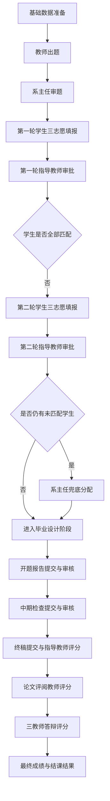

该流程中有三个关键点：

1. **学生选题采用志愿意向模型。** 学生提交志愿后进入教师审批环节，正式课题由审批结果或兜底分配结果确定。
2. **第一、第二轮志愿由对应课题指导教师审批。** 系主任负责课题审核、进度控制和两轮后的兜底分配。
3. **成绩采用毕业设计评价模型。** 毕业设计最终成绩由指导教师评分、评阅教师评分和答辩成绩共同形成。

### 2.2 角色需求

系统面向四类登录角色，同时教师在评阅和答辩阶段可能承担临时业务身份。

| 角色 | 核心需求 | 数据范围 |
|---|---|---|
| 管理员 | 用户管理、系统开关、公告、模板、全局统计、基础数据导入 | 全校范围 |
| 系主任 | 本专业课题审核、选题进度查看、两轮后兜底分配、论文评阅安排、答辩教师安排、成绩导出 | 本学院、本专业 |
| 教师 | 提交课题、审批自己课题收到的志愿、审核阶段材料、完成评阅或答辩评分任务 | 本人课题和被分配任务 |
| 学生 | 浏览本专业开放课题、填报三志愿、查看匹配结果、提交材料、查看成绩和答辩结果 | 本人数据、本专业课题 |
| 评阅教师 | 评阅被系主任分配的终稿论文，给出评分和意见 | 被分配论文 |
| 答辩教师 | 对被分配学生进行答辩评分和填写意见 | 被分配答辩任务 |

角色责任边界如下：

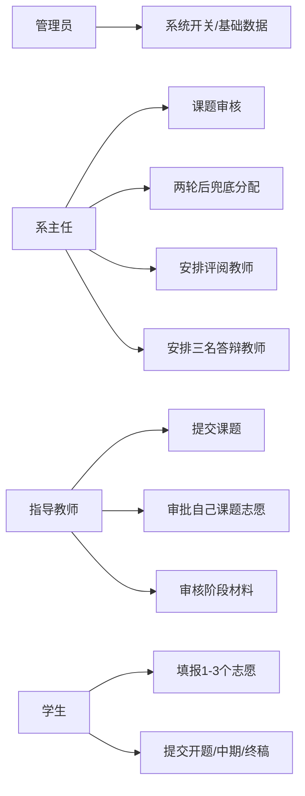

### 2.3 功能需求

系统功能需求按照业务链路划分为九类。

| 功能域 | 主要参与角色 | 需求说明 |
|---|---|---|
| 基础管理 | 管理员 | 用户、学院专业、公告、模板、系统开关、基础数据导入 |
| 课题管理 | 教师、系主任 | 教师提交课题，系主任审核通过后开放 |
| 三志愿选题 | 学生 | 每轮提交 1-3 个志愿，同轮不能重复 |
| 教师志愿审批 | 教师 | 只能审批自己课题收到的志愿，接收后生成最终分配 |
| 系主任兜底 | 系主任 | 两轮后仍未匹配学生由系主任在本专业范围内分配 |
| 阶段材料 | 学生、教师 | 开题、中期、终稿按顺序提交和审核 |
| 论文评阅 | 系主任、评阅教师 | 系主任指定非指导教师评阅终稿，评阅教师评分 |
| 答辩评分 | 系主任、答辩教师 | 系主任指定三名本专业教师，三人独立评分取平均 |
| 成绩管理 | 学生、系主任、管理员 | 按 40/20/40 计算最终成绩，答辩均分 60 分以上通过 |

其中选题模块必须满足：

1. 学生每轮至少 1 个志愿，最多 3 个志愿；
2. 一个课题在同一轮最多被 3 名学生表达意向；
3. 学生只能选择本专业、已审核开放、未被分配的课题；
4. 已有最终课题的学生不能继续选题；
5. 第一轮未匹配学生才能进入第二轮；
6. 第二轮仍未匹配学生才进入系主任兜底分配。

其中“每题每轮最多 3 名学生表达意向”用于限制志愿候选人数；教师审批完成后，正式分配结果仍按“一名学生对应一个课题、一个课题对应一名学生”保存。

### 2.4 成绩需求

毕业设计成绩采用三部分构成：

| 成绩组成 | 权重 | 说明 |
|---|---:|---|
| 指导教师评分 | 40% | 指导教师基于学生过程表现、工作量和终稿成果给出的评价 |
| 评阅教师评分 | 20% | 系主任指定非指导教师独立评阅论文后给出的评分和意见 |
| 答辩成绩 | 40% | 三名答辩教师评分的平均值 |

最终成绩公式：

```text
final_score = advisor_score * 0.4 + reviewer_score * 0.2 + defense_score * 0.4
```

结课判断规则：

- 三项成绩齐全后才计算最终成绩；
- 三名答辩教师均评分后才形成正式答辩结果；
- 答辩平均分达到 60 分及以上视为答辩通过；
- 最终成绩达到 60 分且答辩通过，才显示结课通过。

### 2.5 非功能需求

| 类型 | 需求说明 |
|---|---|
| 安全性 | 登录态校验、角色路径鉴权、CSRF 防护、上传下载鉴权 |
| 一致性 | 选题审批和兜底分配必须保证一人一题、一题一人 |
| 阶段控制 | 通过系统开关控制出题、第一轮、第二轮、兜底分配和材料上传 |
| 可追溯性 | 志愿表、最终分配表、文档表、答辩评分表保存关键业务结果，消息和日志辅助通知与追踪 |
| 数据范围 | 系主任只能处理本学院本专业，教师只能处理本人课题或被分配任务 |
| 可维护性 | Controller、DAO、Bean、Util 分层清晰，核心事务集中在 DAO |

---

## 3. 系统设计

### 3.1 概要设计

系统采用 MVC 分层结构。浏览器请求先经过 `AuthFilter`，再进入具体 Controller；Controller 调用 DAO 层完成数据库查询和事务处理；处理完成后转发 JSP 或重定向到对应页面。

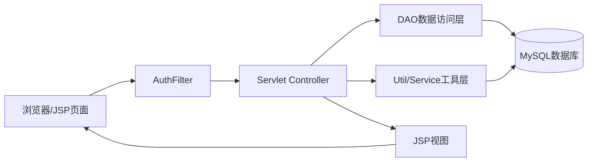

系统核心分层如下：

| 层次 | 目录或文件 | 职责 |
|---|---|---|
| View | `WebContent/**/*.jsp` | 页面展示、表单输入、状态徽章、表格和弹窗 |
| Controller | `src/controller` | 接收请求、参数校验、业务分派、forward/redirect |
| DAO | `src/dao` | SQL 查询、事务处理、结果集映射 |
| Bean | `src/bean` | 用户、课题、志愿、最终分配、文档、答辩等实体 |
| Filter | `src/filter/AuthFilter.java` | 登录、角色路径、CSRF、上传直链拦截 |
| Util | `src/util` | 系统开关、作用域、日志、消息、Web 工具等 |

### 3.2 详细设计

#### 3.2.1 后端模块划分

| 模块 | 关键 Controller / DAO | 说明 |
|---|---|---|
| 登录鉴权 | `LoginController`、`AuthFilter`、`UserDao` | 登录、退出、角色路径鉴权 |
| 系统开关 | `AdminSystemSwitchController`、`SystemSwitchUtil` | 管理出题、选题、上传、兜底分配开关 |
| 课题管理 | `TeacherTopicController`、`DirectorTopicReviewController`、`TopicDao` | 教师出题，系主任审核 |
| 三志愿填报 | `StudentTopicController`、`SelectionChoiceDao` | 学生提交 1-3 个志愿 |
| 教师志愿审批 | `TeacherChoiceReviewController`、`TeacherChoiceReviewDao` | 教师审批自己课题收到的志愿 |
| 最终分配 | `DirectorSelectionConfirmController`、`TopicAssignmentDao` | 系主任查看进度和兜底分配 |
| 阶段文档 | `StudentDocumentController`、`TeacherDocumentController`、`DocumentDao` | 开题、中期、终稿提交审核 |
| 论文评阅 | `DirectorPaperReviewController`、`TeacherPaperReviewController`、`DocumentDao` | 安排评阅教师和提交评阅分 |
| 答辩评分 | `DirectorDefenseController`、`TeacherDefenseController`、`DefenseScheduleDao` | 安排三名答辩教师，教师独立评分 |
| 成绩导出 | `AdminExportController`、`DirectorExportController` | 按 40/20/40 导出最终成绩 |

#### 3.2.2 前端模块划分

前端按角色分目录：

| 目录 | 页面示例 | 说明 |
|---|---|---|
| `WebContent/admin` | `users.jsp`、`system-switches.jsp` | 管理员基础管理 |
| `WebContent/director` | `selection-confirm.jsp`、`paper-review.jsp`、`defense.jsp` | 系主任专业管理 |
| `WebContent/teacher` | `choice-review.jsp`、`documents.jsp`、`paper-review.jsp`、`defense.jsp` | 教师审批与评分 |
| `WebContent/student` | `topics.jsp`、`my-selection.jsp`、`documents.jsp`、`grades.jsp` | 学生选题、材料和成绩 |

公共头部、侧边栏、状态徽章、分页和 CSRF 元信息放在 `WebContent/WEB-INF/includes` 中，减少页面重复。

### 3.3 流程控制设计

系统通过 `system_configs` 保存阶段开关，通过 `SystemSwitchUtil` 统一读取和更新。关键开关包括：

| 开关 | 含义 |
|---|---|
| `switch.topic_submit` | 教师出题开关 |
| `switch.selection` | 第一轮学生选题开放 |
| `switch.selection_round2` | 第二轮学生选题开放 |
| `switch.manual_assign` | 系主任强制分配阶段开放 |
| `switch.upload_proposal` | 开题报告上传开关 |
| `switch.upload_midterm` | 中期检查上传开关 |
| `switch.upload_final` | 终稿上传开关 |

阶段开关状态机如下：

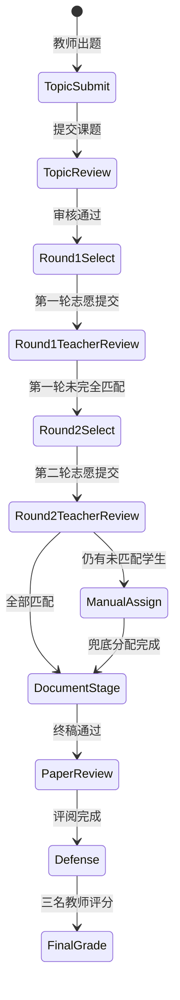

开启第二轮时关闭第一轮；开启强制分配时关闭第一、第二轮选题，避免多个阶段同时开放造成流程混乱。

### 3.4 功能设计

系统功能设计按业务主线组织，减少按页面数量进行机械罗列。

| 功能域 | 主要角色 | 已实现能力 | 关键约束 |
|---|---|---|---|
| 基础管理 | 管理员 | 用户、公告、模板、系统开关、导入 | 批量导入定位为基础数据准备 |
| 课题管理 | 教师、系主任 | 教师提交课题，系主任审核 | 未审核课题不对学生开放 |
| 三志愿选题 | 学生 | 每轮 1-3 个志愿，每题最多 3 个意向 | 同轮不重复，已有最终课题不能再选 |
| 教师审批 | 教师 | 接收或拒绝自己课题收到的志愿 | 只能审批本人课题 |
| 兜底分配 | 系主任 | 两轮后手工分配未匹配学生 | 仅本专业，且仅未匹配学生和未分配课题 |
| 阶段材料 | 学生、教师 | 开题、中期、终稿提交审核 | 中期依赖开题，终稿依赖中期 |
| 论文评阅 | 系主任、评阅教师 | 指定非指导教师评阅并评分 | 评阅教师不能是指导教师本人 |
| 答辩评分 | 系主任、答辩教师 | 指定三名教师，独立评分取平均 | 三名教师不能重复，必须本专业 |
| 成绩管理 | 学生、系主任、管理员 | 40/20/40 最终成绩和导出 | 答辩均分低于 60 不能结课 |

关键运行截图集中放在第 5 章关键模块和第 6 章测试验证中，主要覆盖学生三志愿、教师审批、论文评阅、答辩安排和最终成绩五个环节，避免用大量重复页面截图堆叠报告。

---

## 4. 数据库设计

### 4.1 数据库总体结构

数据库名称为 `graduation_design`。本次改进重点新增或强化了三类数据结构：

1. 三志愿与最终分配：`selection_applications`、`selection_choices`、`topic_assignments`；
2. 终稿评阅成绩：`documents` 中的 `advisor_score`、`paper_reviewer_id`、`reviewer_score` 等字段；
3. 三教师答辩评分：`defense_schedules`、`defense_committee_members`、`defense_scores`。

主要表如下：

| 表名 | 作用 |
|---|---|
| `users` | 管理员、系主任、教师、学生统一用户表 |
| `topics` | 毕业设计课题 |
| `selection_applications` | 学生某一轮提交的一组选题志愿 |
| `selection_choices` | 志愿明细，记录第 1、2、3 志愿 |
| `topic_assignments` | 最终一人一题分配结果 |
| `topic_selections` | 旧流程选题兼容表 |
| `documents` | 开题、中期、终稿及指导教师/评阅教师评分 |
| `document_versions` | 文档历史版本 |
| `defense_schedules` | 学生答辩主记录 |
| `defense_committee_members` | 三名答辩教师安排 |
| `defense_scores` | 答辩教师独立评分 |
| `system_configs` | 系统开关和业务参数 |
| `messages` | 站内消息 |
| `operation_logs` | 操作日志 |

### 4.2 核心表设计

#### 4.2.1 users

`users` 是统一用户表，通过 `role` 区分 `admin`、`director`、`teacher`、`student`。表中保存学院、专业、班级、职称、联系方式等信息。统一用户表可以让登录、消息、日志、作用域校验、评阅教师安排和答辩教师安排都基于同一个用户 ID 完成。

#### 4.2.2 topics

`topics` 保存教师提交的课题。关键字段包括标题、描述、教师 ID、学院、专业、最大人数、已选人数和状态。课题状态主要包括 `pending`、`open`、`closed`、`rejected`。只有审核通过并处于 `open` 的课题才能被学生填为志愿。

#### 4.2.3 selection_applications 与 selection_choices

`selection_applications` 表示学生在某一轮提交的一组选题志愿；`selection_choices` 表示该组志愿中的明细。

| 表 | 核心字段 | 说明 |
|---|---|---|
| `selection_applications` | `student_id`、`round`、`status`、`submit_time` | 学生某轮提交的一组志愿 |
| `selection_choices` | `application_id`、`topic_id`、`choice_rank`、`status` | 第 1、2、3 志愿明细 |

这种设计把“一次提交”和“多个志愿”分开，避免旧版只能表达单题申请的问题。

#### 4.2.4 topic_assignments

`topic_assignments` 表保存最终匹配结果。无论来源是第一轮教师接收、第二轮教师接收，还是系主任兜底分配，最终都写入该表。

| 字段 | 含义 |
|---|---|
| `student_id` | 最终匹配学生 |
| `topic_id` | 最终匹配课题 |
| `choice_id` | 来源志愿，兜底分配时为空 |
| `round` | 来源轮次 |
| `source` | `round1`、`round2`、`manual` |
| `confirmed_by` | 确认人，教师或系主任 |
| `confirm_comment` | 确认意见 |

该表通过唯一约束保证：

```text
UNIQUE(student_id)
UNIQUE(topic_id)
```

即一个学生最终只能有一个课题，一个课题最终也只能分配给一个学生。

#### 4.2.5 documents

`documents` 保存开题报告、中期检查和终稿。终稿通过后，该表还保存指导教师评分、评阅教师安排和评阅教师评分。

| 字段 | 含义 |
|---|---|
| `doc_type` | `proposal`、`midterm`、`final` |
| `status` | `submitted`、`reviewed`、`rejected` |
| `advisor_score` | 指导教师评分 |
| `advisor_comment` | 指导教师评语 |
| `paper_reviewer_id` | 系主任指定的论文评阅教师 |
| `reviewer_score` | 评阅教师评分 |
| `reviewer_comment` | 评阅教师意见 |

#### 4.2.6 defense_schedules、defense_committee_members、defense_scores

答辩采用一主两从结构。

| 表 | 作用 |
|---|---|
| `defense_schedules` | 学生答辩主记录，保存学生是否进入答辩和平均分 |
| `defense_committee_members` | 系主任指定的三名答辩教师 |
| `defense_scores` | 三名教师分别录入的答辩分和意见 |

`defense_scores` 中同一 `schedule_id + teacher_id` 唯一，保证同一教师对同一学生只保留一条评分，重复提交时更新自己的评分。

### 4.3 数据库 ER 图

核心实体关系如下：

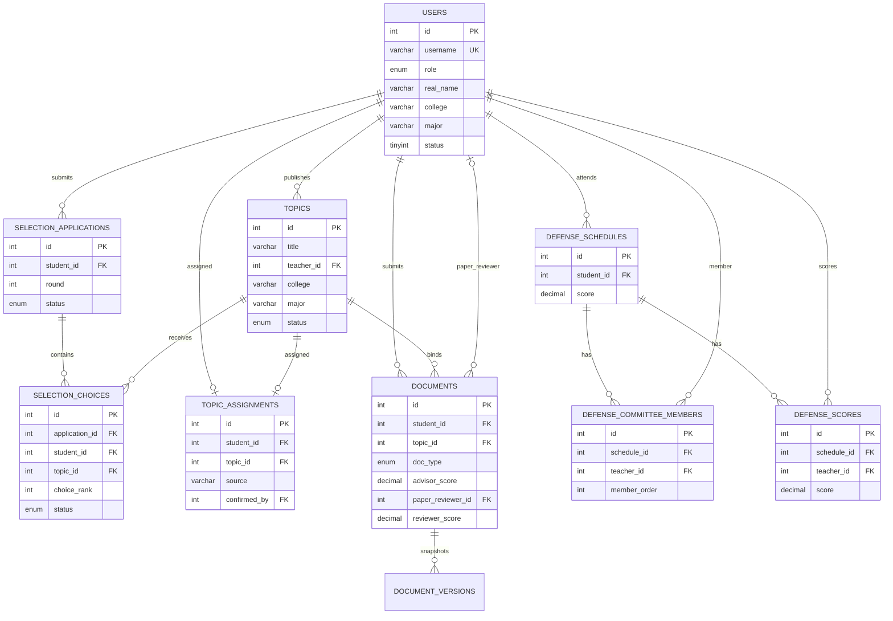

### 4.4 数据一致性设计

| 约束 | 实现方式 |
|---|---|
| 一个学生最终只能一个课题 | `topic_assignments.student_id` 唯一 |
| 一个课题最终只能一个学生 | `topic_assignments.topic_id` 唯一 |
| 同一轮同一学生只能有一组有效志愿 | `selection_applications` 状态和事务校验 |
| 同一组志愿不能重复课题 | `selection_choices(application_id, topic_id)` 唯一 |
| 每题每轮最多 3 个意向 | `submitChoices` 事务中统计并校验 |
| 三名答辩教师不能重复 | `defense_committee_members(schedule_id, teacher_id)` 唯一 |
| 答辩教师每人一条评分 | `defense_scores(schedule_id, teacher_id)` 唯一 |

候选阶段与正式分配阶段分开约束：同一课题在同一轮最多接收 3 名学生志愿意向，教师审批或系主任兜底完成后，正式结果统一写入 `topic_assignments`，并通过唯一约束保证最终一题一人。

---

## 5. 关键模块设计与实现

本章选取三个关键模块展开：三志愿两轮选题与教师审批模块、流程控制与系主任兜底分配模块、论文评阅与三教师答辩评分模块。这三个模块直接对应老师强调的核心功能。

### 5.1 三志愿两轮选题与教师审批模块

#### 5.1.1 流程分析

该模块的核心是：学生每轮填报 1-3 个志愿，志愿提交后交给对应课题指导教师审批，教师接收后生成最终分配结果。

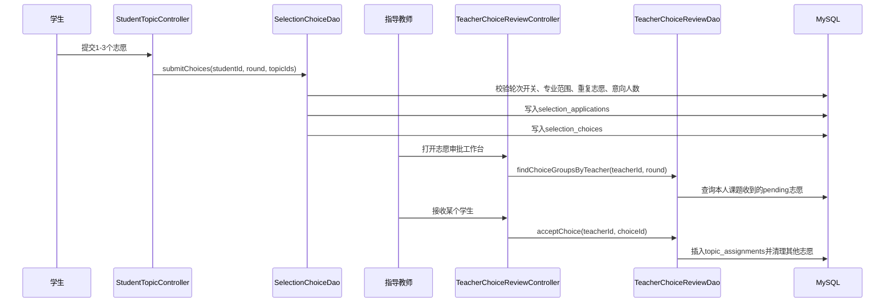

#### 5.1.2 学生志愿提交实现

学生提交志愿的入口在 `StudentTopicController`。核心调用如下：

```java
int result = new SelectionChoiceDao().submitChoices(
    user.getId(), round, parseTopicIds(request));
```

`SelectionChoiceDao.submitChoices` 首先校验当前轮次是否开放、志愿数量是否合法：

```java
if (!SystemSwitchUtil.isSelectionOpenForRound(normalizedRound)
        || SystemSwitchUtil.currentRound() != normalizedRound) {
    return ERR_SELECTION_CLOSED;
}
if (topicIds == null || topicIds.isEmpty() || topicIds.size() > choiceLimit) {
    return ERR_CHOICE_COUNT;
}
```

然后校验同一组志愿不能重复：

```java
Set<Integer> unique = new HashSet<Integer>();
for (Integer topicId : topicIds) {
    if (topicId == null || topicId.intValue() <= 0 || !unique.add(topicId)) {
        return ERR_DUPLICATE_CHOICE;
    }
}
```

提交过程使用事务，校验学生是否已有最终分配、课题是否属于学生专业、课题是否开放、该题目当前轮次意向人数是否已满。通过校验后，先写入申请批次，再写入志愿明细：

```sql
INSERT INTO selection_applications(student_id,round,status)
VALUES(?,?,'submitted');

INSERT INTO selection_choices(application_id,student_id,topic_id,round,choice_rank,status)
VALUES(?,?,?,?,?,'pending');
```

#### 5.1.3 教师审批实现

教师端入口为：

```text
/teacher/choice-review.action
```

教师只能看到自己课题收到的志愿，DAO 查询条件明确限定 `t.teacher_id=?`：

```sql
WHERE t.teacher_id=?
  AND c.round=?
  AND c.status='pending'
  AND a.status='submitted'
```

教师点击“接收”后，`TeacherChoiceReviewDao.acceptChoice` 在一个事务内完成：

```text
锁定 choice
校验 choice 属于当前教师课题
校验学生尚未有最终分配
校验课题尚未有最终分配
插入 topic_assignments
当前志愿置为 selected
该学生同轮其他 pending 志愿置为 not_selected
该题目其他 pending 候选置为 not_selected
课题状态置为 closed
提交事务
```

最终分配写入：

```sql
INSERT INTO topic_assignments(student_id,topic_id,choice_id,round,source,
confirmed_by,confirm_comment)
VALUES(?,?,?,?,?,?,?);
```

其中 `source` 为 `round1` 或 `round2`，`confirmed_by` 为当前教师 ID。

#### 5.1.4 运行效果

学生三志愿状态页面如下图所示。图中可以看到学生第一轮提交了三个志愿，当前三个志愿均未被接收，说明系统能够保留志愿顺序和每个志愿的审批状态。

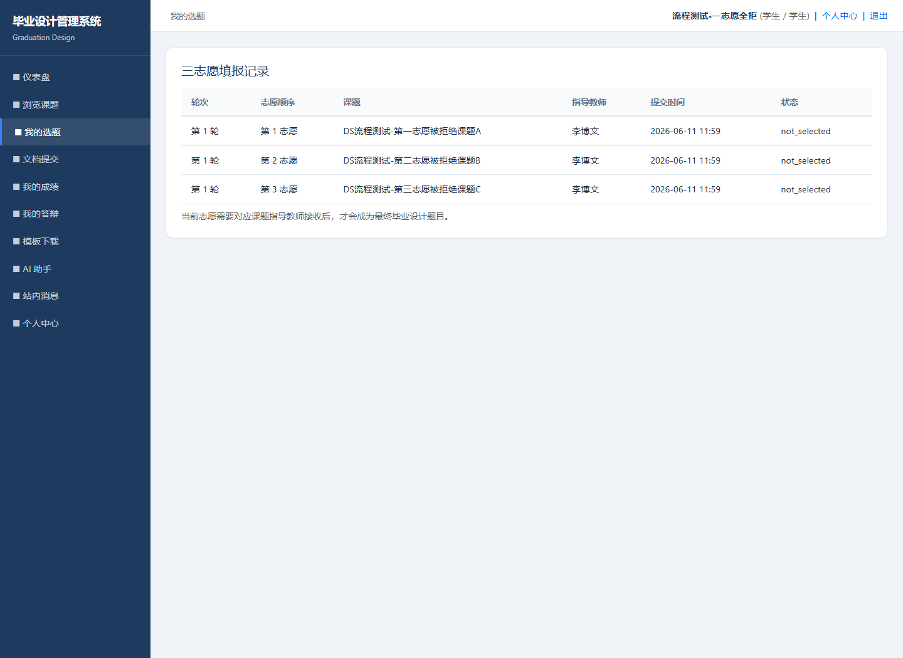

教师志愿审批页面可以按课题查看学生志愿顺序，并执行接收或不接收操作。

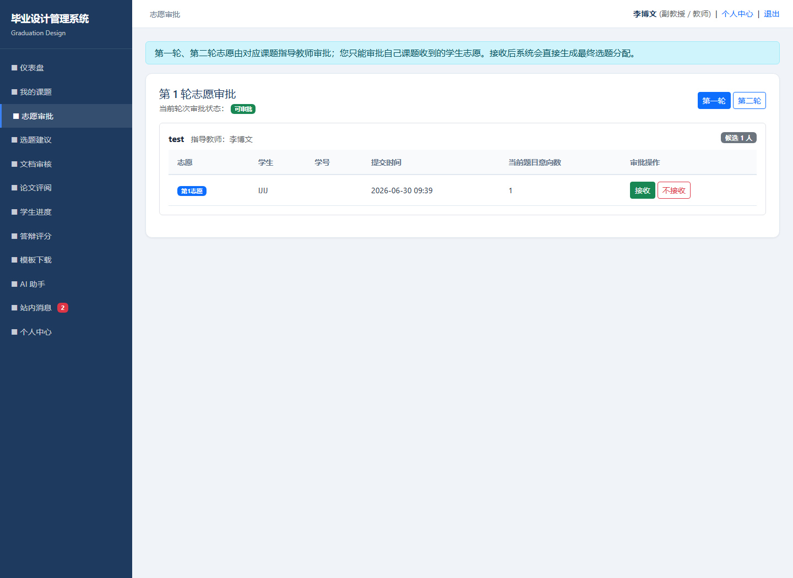

该模块明确了一二轮选题责任链：学生志愿递交给对应课题指导教师审批，审批结果再进入最终分配表。

### 5.2 流程控制与系主任兜底分配模块

#### 5.2.1 流程分析

系主任在选题流程中有两个主要职责：第一，审核本专业教师提交的课题；第二，两轮结束后，对仍未匹配的学生进行兜底分配。第一、第二轮常规志愿审批由对应课题指导教师完成。

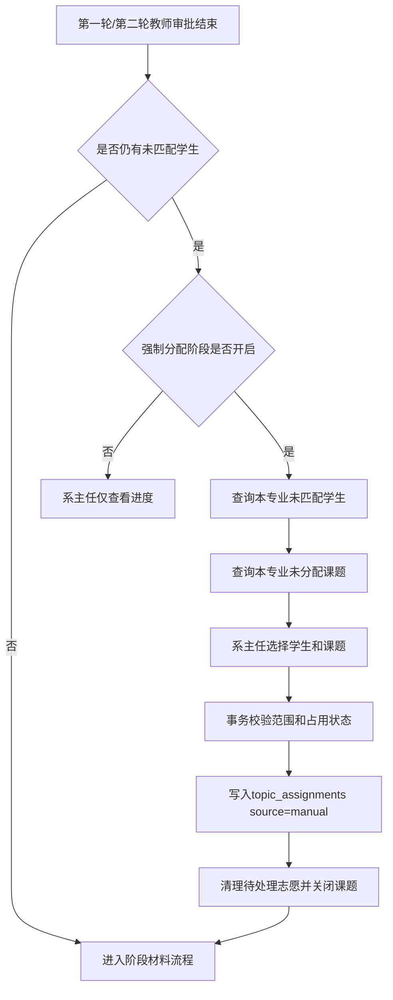

#### 5.2.2 阶段开关实现

系统通过 `SystemSwitchUtil` 定义关键开关：

```java
public static final String TOPIC_SUBMIT = "switch.topic_submit";
public static final String SELECTION = "switch.selection";
public static final String SELECTION_ROUND2 = "switch.selection_round2";
public static final String MANUAL_ASSIGN = "switch.manual_assign";
public static final String UPLOAD_PROPOSAL = "switch.upload_proposal";
public static final String UPLOAD_MIDTERM = "switch.upload_midterm";
public static final String UPLOAD_FINAL = "switch.upload_final";
```

开启第二轮时，系统关闭第一轮和兜底分配：

```java
if (SELECTION_ROUND2.equals(key)) {
    int changed = SystemConfigUtil.update(SELECTION_ROUND2, value);
    if (enabled) {
        SystemConfigUtil.update(SELECTION, "0");
        SystemConfigUtil.update(SELECTION_ROUND1, "0");
        SystemConfigUtil.update(MANUAL_ASSIGN, "0");
        SystemConfigUtil.update(CURRENT_ROUND, "2");
    }
    return changed;
}
```

开启强制分配时，系统关闭第一、第二轮选题：

```java
if (MANUAL_ASSIGN.equals(key)) {
    int changed = SystemConfigUtil.update(MANUAL_ASSIGN, value);
    if (enabled) {
        SystemConfigUtil.update(SELECTION, "0");
        SystemConfigUtil.update(SELECTION_ROUND1, "0");
        SystemConfigUtil.update(SELECTION_ROUND2, "0");
        SystemConfigUtil.update(CURRENT_ROUND, "2");
    }
    return changed;
}
```

#### 5.2.3 兜底分配实现

系主任兜底入口为：

```text
/director/selection-confirm.action
```

Controller 在执行分配前检查强制分配开关：

```java
if (!SystemSwitchUtil.isManualAssignOpen()) {
    WebUtil.redirect(request, response,
        "/director/selection-confirm.action?msg=assign_closed");
    return;
}
```

DAO 层 `TopicAssignmentDao.manualAssign` 使用事务校验学生和课题范围：

```sql
SELECT id FROM users
WHERE id=? AND role='student' AND status=1
  AND college=? AND major=?
FOR UPDATE;
```

```sql
SELECT status FROM topics
WHERE id=? AND college=? AND major=?
FOR UPDATE;
```

通过校验后写入最终分配：

```sql
INSERT INTO topic_assignments(student_id,topic_id,choice_id,round,source,
confirmed_by,confirm_comment)
VALUES(?,?,NULL,?,'manual',?,?);
```

#### 5.2.4 阶段材料顺序控制

选题完成后，学生提交材料必须满足前置阶段条件：

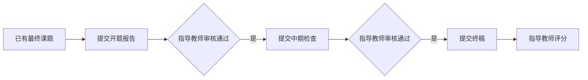

`DocumentDao.submit` 中通过 `prerequisiteType` 定义前置阶段：

```java
private String prerequisiteType(String docType) {
    if ("proposal".equals(docType)) return null;
    if ("midterm".equals(docType)) return "proposal";
    if ("final".equals(docType)) return "midterm";
    throw new IllegalArgumentException("invalid document type");
}
```

这样可以防止学生跳过开题或中期直接提交终稿。

### 5.3 论文评阅、三教师答辩评分与最终成绩模块

#### 5.3.1 流程分析

学生终稿通过后，进入评阅和答辩阶段。流程如下：

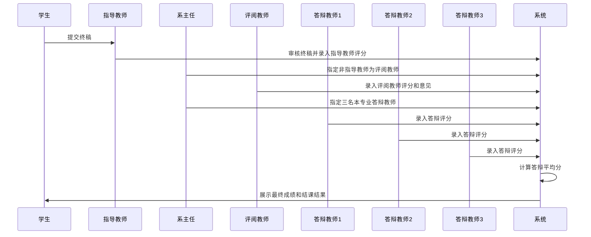

#### 5.3.2 指导教师评分

指导教师审核终稿时录入 `advisor_score` 和 `advisor_comment`。该评分表示指导教师对学生毕业设计过程和成果的评价。开题和中期属于阶段审核，最终成绩只计算指导教师评分、评阅教师评分和答辩平均分。

`DocumentDao.review` 对终稿通过时的指导教师评分进行校验：

```java
boolean finalDoc = isFinalDoc(id);
if ("reviewed".equals(status) && finalDoc
        && (advisorScore == null || !validScore(advisorScore))) {
    return 0;
}
```

#### 5.3.3 评阅教师评分

系主任端入口：

```text
/director/paper-review.action
```

教师端入口：

```text
/teacher/paper-review.action
```

系主任安排评阅教师时，系统要求评阅教师属于本专业，且不能是该学生的指导教师：

```java
if (studentId <= 0 || supervisorId == paperReviewerId) {
    conn.rollback();
    return 0;
}
```

评阅教师提交评分时写入：

```sql
UPDATE documents
SET reviewer_score=?, reviewer_comment=?, peer_review=?, reviewer_review_time=NOW()
WHERE id=? AND doc_type='final' AND status='reviewed'
  AND paper_reviewer_id=?;
```

教师端论文评阅页面如下图所示。评阅教师只能看到分配给自己的终稿论文，并在该页面录入评阅教师评分和评阅意见。

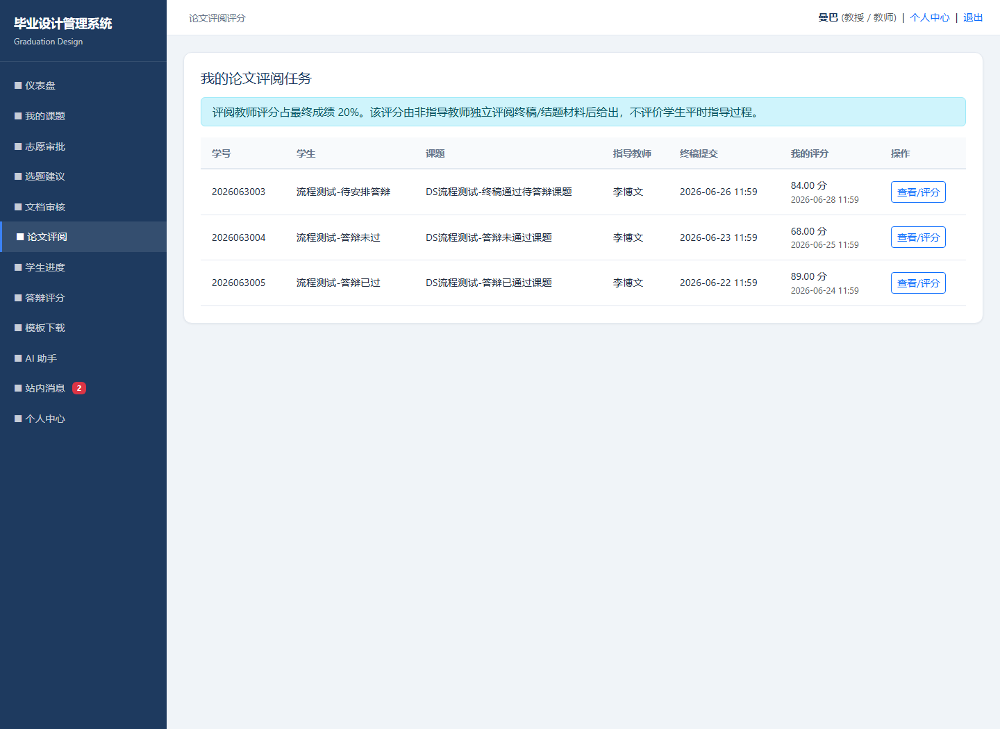

#### 5.3.4 三教师答辩评分

系主任答辩安排入口：

```text
/director/defense.action
```

系统要求每名学生必须指定三名答辩教师，且三名教师不能重复：

```java
if (teacherIds == null || teacherIds.length != 3) {
    return ERR_TEACHER_COUNT;
}
if (unique.size() != 3) {
    return ERR_DUPLICATE_TEACHER;
}
```

答辩教师必须是本学院、本专业教师或系主任：

```sql
SELECT 1 FROM users
WHERE id=? AND role IN ('teacher','director')
  AND status=1 AND college=? AND major=?
LIMIT 1;
```

教师端评分入口：

```text
/teacher/defense.action
```

评分时校验当前教师是否为该学生答辩委员：

```java
if (!isCommitteeMember(conn, scheduleId, teacherId)) {
    conn.rollback();
    return ERR_NOT_MEMBER;
}
```

评分写入 `defense_scores`，并通过 `ON DUPLICATE KEY UPDATE` 支持教师修改自己的评分：

```sql
INSERT INTO defense_scores(schedule_id,teacher_id,score,comment,score_time)
VALUES(?,?,?,?,NOW())
ON DUPLICATE KEY UPDATE
  score=VALUES(score),
  comment=VALUES(comment),
  score_time=NOW();
```

每次评分后重新计算平均分：

```sql
SELECT AVG(score) FROM defense_scores WHERE schedule_id=?;
```

系主任答辩安排页面如下图所示。

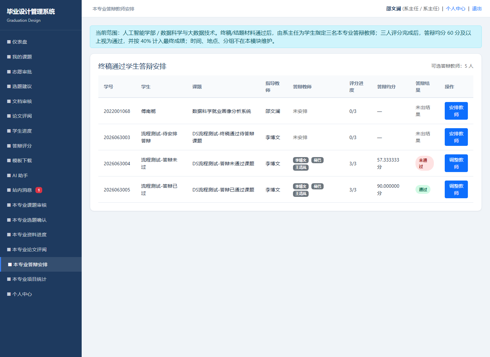

#### 5.3.5 最终成绩计算

学生成绩页面按 40/20/40 计算最终成绩：

```java
finalScore = advisorScore.multiply(new BigDecimal("0.4"))
    .add(reviewerScore.multiply(new BigDecimal("0.2")))
    .add(defenseScore.multiply(new BigDecimal("0.4")))
    .setScale(2, RoundingMode.HALF_UP);
```

结课结果同时检查最终成绩和答辩是否通过：

```java
boolean defensePassed = defense != null && defense.getScoreCount() >= 3
    && defenseScore.compareTo(new BigDecimal("60")) >= 0;
finalResult = defensePassed && finalScore.compareTo(new BigDecimal("60")) >= 0
    ? "通过" : "未通过";
```

学生成绩展示如下图所示。

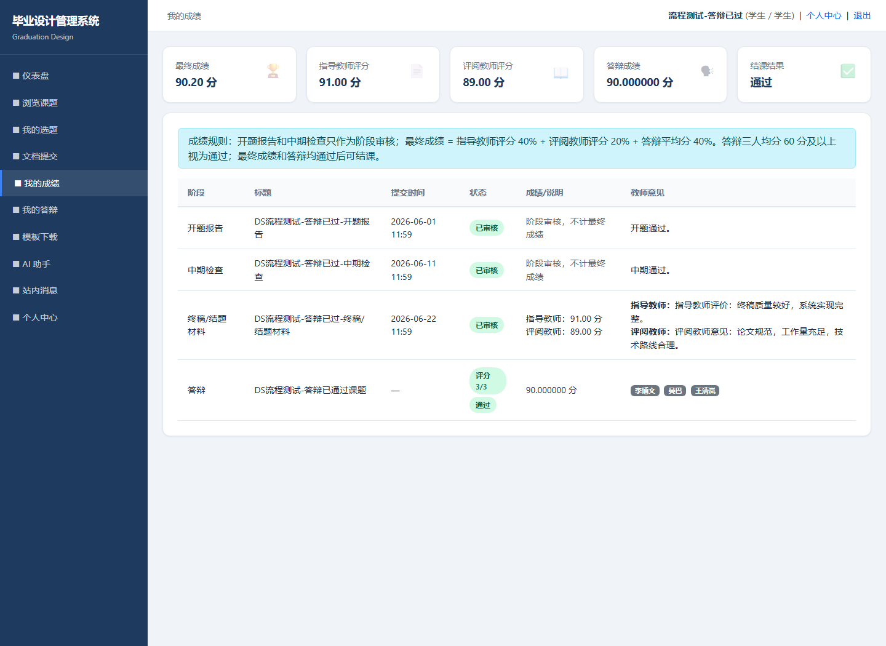

---

## 6. 测试与运行验证

### 6.1 测试方法

本项目采用以下方式进行验证：

1. 执行 Maven 测试，确认 Java 代码和 DAO 测试通过；
2. 执行 Maven 打包，确认 WAR 可正常构建；
3. 启动本地 Tomcat，访问 `http://localhost:8086/graduation-design/`；
4. 使用人工智能学部数据科学与大数据技术专业测试数据验证多种业务状态；
5. 对学生、教师、系主任关键页面进行截图验证。

已执行命令：

```powershell
mvn -q test
mvn -q package
```

验证时间为 2026 年 7 月 1 日，本次截图来自本地 Tomcat 运行环境 `http://localhost:8086/graduation-design/`。运行结果：测试通过，WAR 打包通过，关键页面可正常访问。

### 6.2 选题流程测试

| 编号 | 测试场景 | 已验证结果 |
|---|---|---|
| S1 | 学生提交 1 个志愿 | 通过，生成申请和志愿明细 |
| S2 | 学生提交 3 个志愿 | 通过，志愿顺序为 1、2、3 |
| S3 | 学生重复选择同一课题 | 通过，系统拒绝提交 |
| S4 | 一个课题已有 3 个 pending 意向 | 通过，第 4 个学生无法选择该题 |
| S5 | 教师查看志愿审批工作台 | 通过，只看到自己课题收到的志愿 |
| S6 | 教师接收某学生 | 通过，生成 `topic_assignments`，学生其他志愿失效 |
| S7 | 教师拒绝某学生 | 通过，该志愿变为 `not_selected` |
| S8 | 第二轮后仍未匹配 | 通过，系主任可在强制分配阶段兜底 |

学生三志愿状态截图见图 5-1，教师审批截图见图 5-2，测试章节不重复放图。

### 6.3 阶段材料测试

| 编号 | 测试场景 | 已验证结果 |
|---|---|---|
| D1 | 未获得课题学生提交材料 | 通过，系统拒绝提交 |
| D2 | 开题未通过时提交中期 | 通过，系统拒绝提交 |
| D3 | 中期未通过时提交终稿 | 通过，系统拒绝提交 |
| D4 | 终稿审核通过时未填写指导教师评分 | 通过，系统拒绝通过操作 |
| D5 | 材料被退回后重新提交 | 通过，允许重交并保留历史版本 |

### 6.4 论文评阅与答辩测试

| 编号 | 测试场景 | 已验证结果 |
|---|---|---|
| R1 | 系主任给终稿通过学生安排评阅教师 | 通过 |
| R2 | 系主任选择指导教师本人作为评阅教师 | 通过，系统拒绝 |
| R3 | 评阅教师进入评阅页面 | 通过，只能看到分配给自己的论文 |
| R4 | 评阅教师提交分数和意见 | 通过，写入评阅教师评分和意见 |
| B1 | 系主任指定三名答辩教师 | 通过 |
| B2 | 系主任选择重复教师 | 通过，系统拒绝 |
| B3 | 跨专业教师被选为答辩教师 | 通过，系统拒绝 |
| B4 | 未被指定教师尝试评分 | 通过，系统拒绝 |
| B5 | 三名教师分别评分 | 通过，系统计算平均分 |
| B6 | 答辩均分低于 60 | 通过，显示答辩未通过，不能结课 |
| B7 | 答辩均分达到 60 | 通过，显示答辩通过 |

### 6.5 测试数据说明

为覆盖真实业务状态，系统在人工智能学部数据科学与大数据技术专业中补充了以下测试学生：

| 测试账号 | 状态说明 |
|---|---|
| `dsflow_rejected` | 第一轮三个志愿均被拒绝，未匹配 |
| `dsflow_selected` | 已顺利填报并被教师接收 |
| `dsflow_final_ready` | 已完成终稿评阅，准备安排答辩 |
| `dsflow_defense_fail` | 已安排答辩，但三名教师均分低于 60，未通过 |
| `dsflow_defense_pass` | 已安排答辩，三名教师均分达到通过标准 |

测试账号与截图对应关系如下：

| 图号 | 登录角色/账号 | 页面 | 验证重点 |
|---|---|---|---|
| 图5-1 | 学生 `dsflow_rejected` | 我的选题 | 三志愿状态与全部未接收状态 |
| 图5-2 | 教师 `teacher_ds` | 志愿审批 | 教师查看本人课题收到的学生志愿 |
| 图5-3 | 教师 `test1` | 论文评阅 | 评阅教师查看被分配终稿并评分 |
| 图5-4 | 系主任 `director_ai_ds` | 答辩安排 | 系主任安排三名答辩教师 |
| 图5-5 | 学生 `dsflow_defense_pass` | 我的成绩 | 40/20/40 最终成绩和答辩通过结果 |

这些测试数据覆盖了从志愿失败到结课通过的多个状态，便于答辩时演示系统流程。

---

## 7. 系统开发过程总结

### 7.1 已实现模块

| 模块 | 完成情况 | 说明 |
|---|---|---|
| 登录与权限控制 | 已实现 | Session 登录态、角色路径鉴权、CSRF 防护 |
| 基础管理 | 已实现 | 用户、公告、模板、系统开关、批量导入 |
| 课题管理 | 已实现 | 教师提交课题，系主任审核课题 |
| 三志愿填报 | 已实现 | 每轮 1-3 个志愿，每题最多 3 个意向 |
| 教师志愿审批 | 已实现 | 教师审批自己课题收到的志愿 |
| 最终分配 | 已实现 | `topic_assignments` 统一保存最终一人一题 |
| 系主任兜底 | 已实现 | 两轮后未匹配学生由系主任强制分配 |
| 阶段材料 | 已实现 | 开题、中期、终稿顺序提交和审核 |
| 论文评阅 | 已实现 | 系主任安排评阅教师，评阅教师评分 |
| 答辩评分 | 已实现 | 系主任安排三名教师，教师独立评分 |
| 成绩计算 | 已实现 | 指导教师 40%、评阅教师 20%、答辩 40% |
| 统计导出 | 已实现 | 管理员和系主任导出成绩 |

### 7.2 相对旧版的主要改进

旧版基线为提交 `af66e11bdc20f60a90b20276332a14c38870a508`。相对旧版，本次改进如下：

| 对比项 | 旧版情况 | 新版改进 |
|---|---|---|
| 选题模型 | 单申请、单确认 | 一轮/二轮三志愿 |
| 题目限制 | 主要关注最终名额 | 增加每题每轮最多 3 个意向 |
| 审批责任 | 系主任常规确认边界不清 | 对应指导教师审批 |
| 系主任职责 | 常规确认与兜底职责混杂 | 审核课题、查看进度、两轮后兜底 |
| 最终结果 | 与志愿申请混在一起 | `topic_assignments` 单独保存最终结果 |
| 阶段材料 | 有提交审核但后续链路弱 | 强化开题、中期、终稿顺序 |
| 论文评阅 | 缺少独立评阅流程 | 新增系主任指定评阅教师和评阅评分 |
| 答辩评分 | 单个答辩分 | 三名教师分别评分取平均 |
| 成绩构成 | 终稿分/答辩分组合 | 指导教师 40%、评阅教师 20%、答辩 40% |

### 7.3 开发中遇到的问题及解决方案

| 问题 | 表现 | 解决方案 |
|---|---|---|
| 选题模型与最终分配混淆 | 志愿提交与正式课题确认边界不清 | 增加申请批次和志愿明细，把志愿和最终分配分开 |
| 审批责任链不清 | 第一、第二轮确认人边界不明确 | 新增教师志愿审批工作台，由课题指导教师审批 |
| 并发下可能重复匹配 | 多教师同时接收同一学生或同一课题 | 使用事务、`FOR UPDATE` 和唯一约束 |
| 阶段入口互斥不足 | 第一轮、第二轮、兜底阶段可能并行 | 使用系统开关自动互斥控制 |
| 评阅教师和指导教师混淆 | 指导教师可能评阅自己学生 | 安排评阅教师时排除指导教师本人 |
| 答辩评分维度不足 | 单个分数难以体现答辩小组评价 | 增加答辩教师表和答辩评分表，三人独立评分 |
| 成绩模型课程化 | 期中、期末、总评口径与毕业设计不匹配 | 改为指导教师、评阅教师、答辩三部分 |

### 7.4 尚可完善的方向

1. 增加“结束第一轮审批”“结束第二轮审批”等更细阶段收尾动作；
2. 增加答辩秘书、答辩组长等更真实的答辩组织角色；
3. 增加正式任务书模块，作为后续扩展功能；
4. 增加论文在线预览、查重接口和归档管理；
5. 增加更完整的端到端自动化测试；
6. 将权限从代码判断扩展为可配置 RBAC 权限表。

### 7.5 个人收获

通过本次课程设计，我进一步认识到业务系统开发应同时关注页面可用性、流程正确性、角色边界、状态迁移、权限控制和数据一致性。

本项目中比较具体的技术收获有两个：第一，在选题审批中使用事务、`FOR UPDATE` 和唯一约束共同保证一人一题、一题一人，避免并发条件下重复匹配；第二，通过阶段开关控制第一轮、第二轮、强制分配和材料上传，避免多个业务阶段同时开放造成流程混乱。

本项目中最重要的业务收获是重新理解毕业设计流程：学生选题采用三志愿意向填报；第一、第二轮志愿由对应指导教师审批；系主任的核心职责是审核题目、控制流程、兜底分配、安排评阅和安排答辩；毕业设计成绩由指导教师、评阅教师和答辩环节共同形成。

---

## 8. 结论

本次课程设计完成了人工智能学部本科生毕业设计管理系统的核心业务重构。系统不仅保留了原有的登录、用户、课题、文档、统计等基础能力，还重点补齐了三志愿两轮选题、教师审批、系主任兜底分配、阶段材料顺序控制、论文评阅教师评分、三教师答辩评分和最终成绩计算等核心流程。

最终成绩采用：

```text
最终成绩 = 指导教师评分 * 40% + 评阅教师评分 * 20% + 答辩平均分 * 40%
```

答辩通过要求三名答辩教师评分平均值达到 60 分及以上。整体上，本系统能够较完整地体现本科毕业设计从选题到结课的主要业务闭环，符合课程设计对需求分析、系统设计、数据库设计、关键模块实现、运行截图和测试验证的要求。
