# 毕业设计管理系统课程设计项目报告

## 一、项目概述

本项目是一个基于 JavaWeb 技术栈实现的课程设计大作业，项目名称为“毕业设计管理系统”。系统围绕高校毕业设计管理过程展开，面向管理员、教师和学生三类用户，完成账号登录、权限控制、课题管理、学生选题、选题审批、文档提交、文档审核、公告发布和成绩查看等功能。

项目采用 JSP + Servlet + MySQL 的经典 MVC 架构。前端页面使用 JSP 渲染，结合 Bootstrap 完成页面布局与样式；后端使用 Servlet 处理业务请求，DAO 层通过 JDBC 连接 MySQL 数据库；系统通过 Session 保存登录用户信息，并使用 Filter 对不同角色的访问权限进行统一控制。

## 二、开发环境与技术栈

| 项目 | 内容 |
|------|------|
| 开发语言 | Java 8 |
| Web 技术 | JSP、Servlet |
| 数据库 | MySQL 8 |
| 数据访问 | JDBC |
| 前端样式 | Bootstrap 5、CSS、JavaScript |
| 构建工具 | Maven |
| 服务器 | Tomcat Maven Plugin |
| 运行地址 | `http://localhost:8086/graduation-design/` |

## 三、系统角色与功能划分

系统按用户身份划分为三类角色。不同角色登录后进入同一个仪表盘页面，但页面内容会根据当前用户角色自动切换。

### 3.1 管理员功能

管理员主要负责系统基础数据维护，包括用户管理和公告管理。

管理员可以查看系统中的教师、学生账号信息，也可以新增、编辑和删除用户；公告管理模块支持发布公告、设置置顶公告、编辑公告内容和删除公告。公告会显示在各类用户的仪表盘中，用于发布毕业设计相关通知。

### 3.2 教师功能

教师主要负责课题和审核工作。教师可以发布毕业设计课题，设置课题最大可选人数，查看当前课题的选题人数和状态；当学生提交选题申请后，教师可以在选题审批页面进行批准或驳回。学生提交开题报告、中期检查和终稿后，教师可以在文档审核页面进行查看、评分和反馈。

### 3.3 学生功能

学生主要完成毕业设计流程中的申请和提交操作。学生登录后可以浏览可选课题，提交选题申请，查看自己的选题状态；选题通过后可以提交开题报告、中期报告和终稿文档，并在成绩页面查看教师给出的评分和反馈。

## 四、系统架构设计

项目采用 MVC 分层结构，各层职责清晰：

| 层次 | 对应目录 | 主要职责 |
|------|----------|----------|
| Model | `src/bean` | 定义用户、课题、选题、文档、公告等实体对象 |
| View | `WebContent` | JSP 页面展示与表单交互 |
| Controller | `src/controller` | 接收请求、调用 DAO、控制页面跳转 |
| DAO | `src/dao` | 封装数据库增删改查操作 |
| DB 工具 | `src/dbutil` | 管理 JDBC 连接与 SQL 执行 |
| Filter | `src/filter` | 登录校验与角色权限拦截 |
| Util | `src/util` | 密码 MD5 加密、日期转换等工具方法 |

系统请求处理流程如下：

1. 用户在浏览器访问 JSP 页面或提交表单。
2. `AuthFilter` 判断用户是否登录，以及当前角色是否有权限访问目标路径。
3. Controller 根据请求参数调用对应 DAO。
4. DAO 通过 `SQLHelper` 访问 MySQL 数据库。
5. Controller 将处理结果写入 request 或 session。
6. JSP 页面读取数据并渲染为 HTML 返回给浏览器。

## 五、数据库设计

系统数据库名为 `graduation_design`，初始化脚本位于 `sql/init.sql`。主要数据表如下：

| 表名 | 作用 |
|------|------|
| `users` | 存储管理员、教师、学生账号信息 |
| `topics` | 存储教师发布的毕业设计课题 |
| `topic_selections` | 存储学生选题申请及审核状态 |
| `documents` | 存储学生提交的开题、中期、终稿文档 |
| `announcements` | 存储系统公告 |
| `defense_schedules` | 预留答辩安排数据 |
| `operation_logs` | 预留操作日志数据 |
| `messages` | 预留站内消息数据 |

用户表使用 `role` 字段区分 `admin`、`teacher`、`student` 三类角色。密码采用 MD5 哈希后存储，登录时将用户输入的密码再次 MD5 后与数据库中的哈希值进行比对。

课题表通过 `teacher_id` 关联教师用户，选题表通过 `student_id` 和 `topic_id` 关联学生与课题，文档表通过 `student_id`、`topic_id`、`reviewer_id` 记录学生提交内容及教师审核结果。

## 六、项目运行方式

首次运行时需要先初始化数据库。由于 SQL 文件包含中文内容，导入时需要指定 UTF-8 编码，避免中文被导入成乱码。

```powershell
& "D:\MySQL\MySQL Server 8.0\bin\mysql.exe" --default-character-set=utf8mb4 -uroot -p12345 -e "source sql/init.sql"
```

然后在项目根目录执行 Maven 命令启动：

```powershell
mvn package
mvn tomcat7:run-war
```

启动成功后访问：

```text
http://localhost:8086/graduation-design/
```

演示账号如下：

| 角色 | 用户名 | 密码 |
|------|--------|------|
| 管理员 | admin | admin123 |
| 教师 | teacher01 | 123456 |
| 学生 | student01 | 123456 |

## 七、系统功能截图与说明

### 7.1 登录页面

登录页面是系统入口，用户输入用户名和密码后提交到 `login.action`，后端通过 `LoginController` 进行身份验证。登录成功后，系统将用户对象保存到 Session 中，并跳转到仪表盘页面。

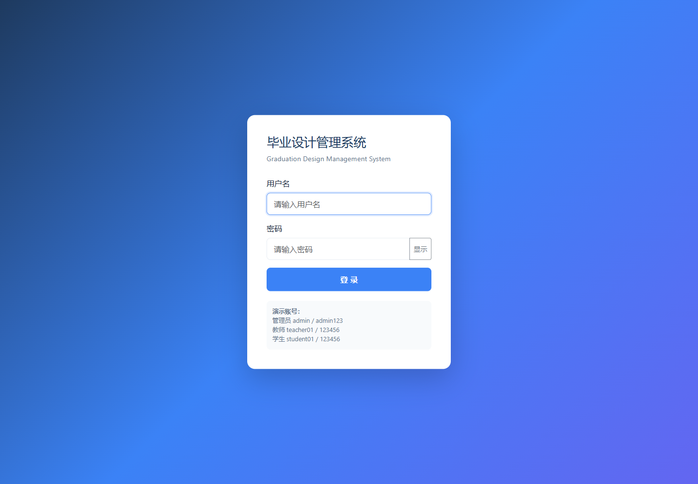

### 7.2 管理员仪表盘

管理员登录后可以看到系统总体统计信息，包括教师人数、学生人数、课题数量和已选题学生数量。页面下方展示系统公告，便于管理员快速查看当前通知内容。

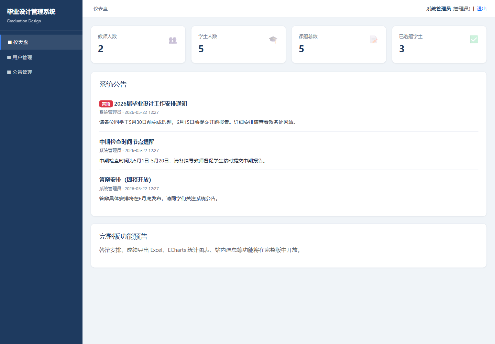

### 7.3 用户管理页面

用户管理页面用于维护系统账号。管理员可以查看全部用户，并按角色区分教师、学生和管理员账号。该模块对应 `AdminUserController` 和 `UserDao`，实现用户增删改查。

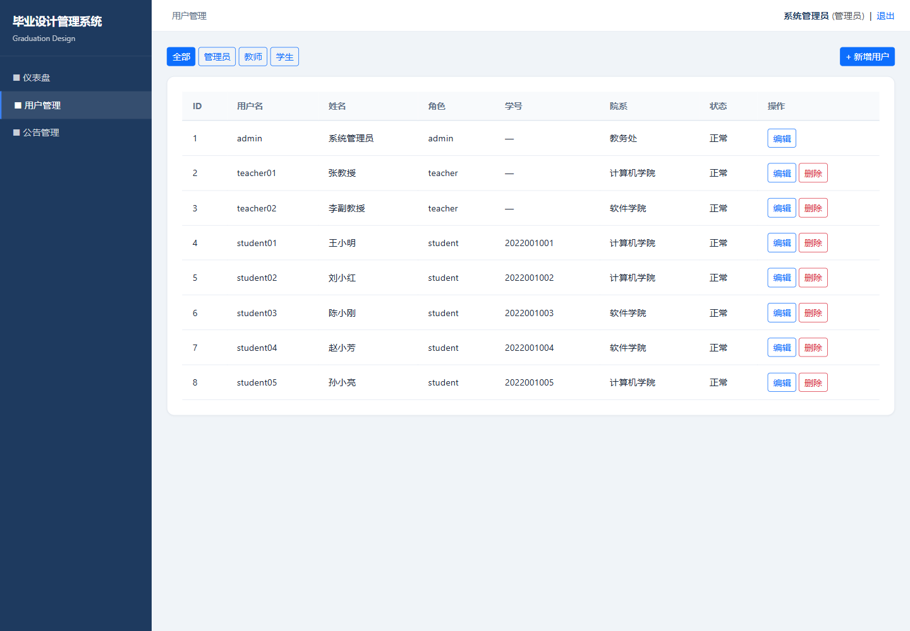

### 7.4 公告管理页面

公告管理页面用于发布和维护系统通知。管理员可以新增公告、编辑公告、删除公告，也可以设置公告置顶。置顶公告会优先显示在各角色首页。

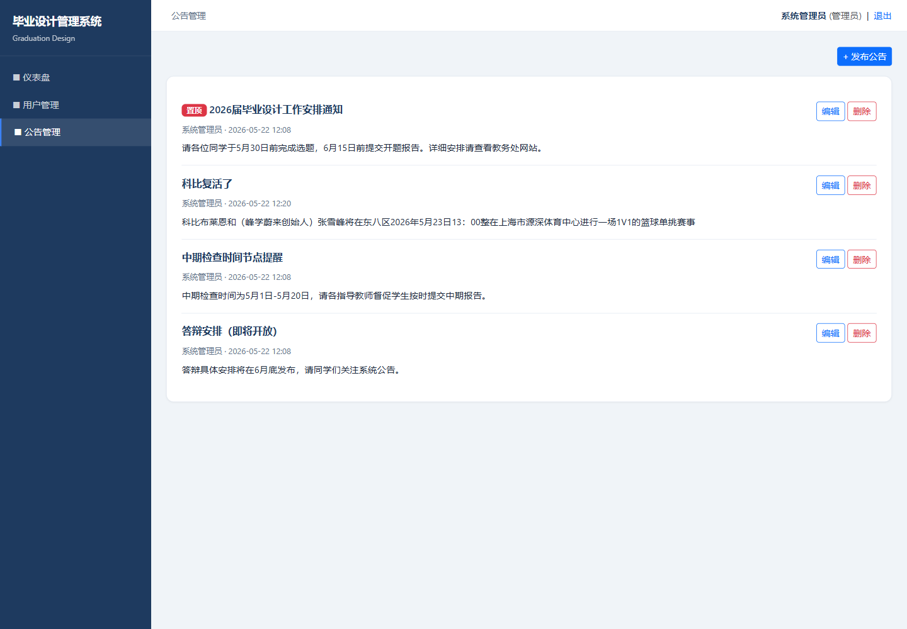

### 7.5 教师仪表盘

教师登录后可以看到自己发布的课题数量、待审核选题数量和待审核文档数量。该页面帮助教师快速掌握当前需要处理的毕业设计事务。

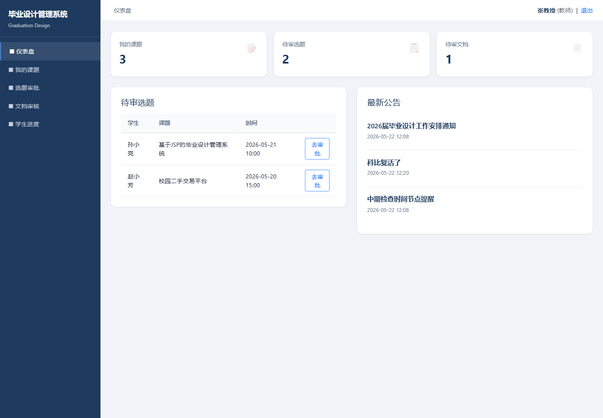

### 7.6 教师课题管理页面

教师可以在课题管理页面查看自己已发布的课题，并进行新增、编辑、删除等操作。每个课题包含题目、描述、最大人数、已选人数和开放状态。

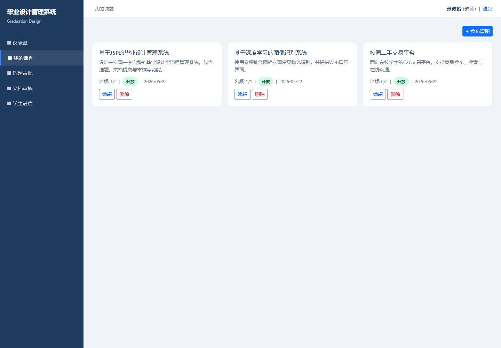

### 7.7 选题审批页面

学生提交选题申请后，教师可以在选题审批页面查看申请列表。教师根据学生申请理由选择批准或驳回，系统会更新选题申请状态。若课题名额达到上限，课题会自动关闭。

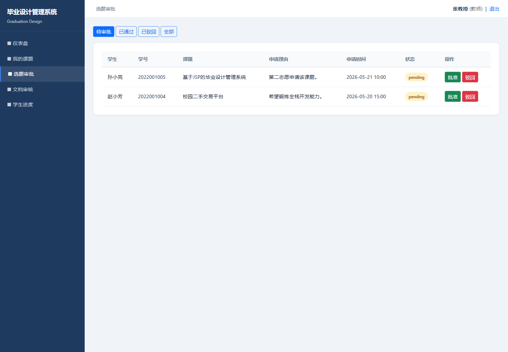

### 7.8 文档审核页面

文档审核页面用于教师查看学生提交的开题报告、中期检查和终稿文档。教师可以填写评分和反馈，系统将审核结果保存到 `documents` 表中。

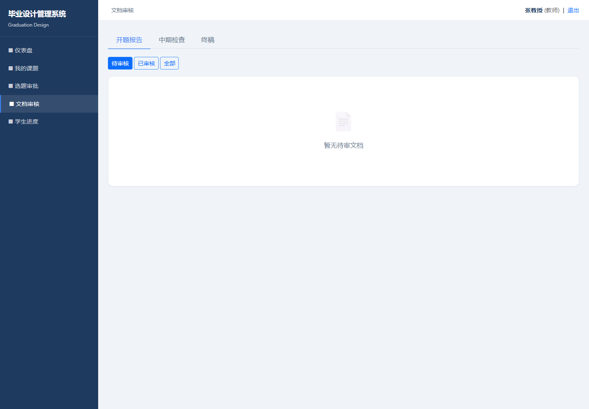

### 7.9 学生仪表盘

学生登录后可以看到自己的选题状态、已提交文档数量和系统公告数量。仪表盘集中展示学生当前毕业设计进度。

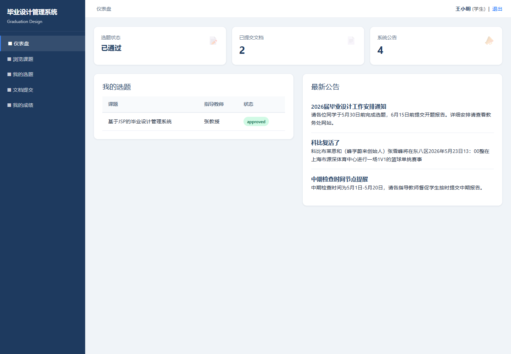

### 7.10 浏览课题页面

学生可以在浏览课题页面查看当前开放的毕业设计课题。页面展示课题名称、指导教师、课题描述、可选人数等信息，学生可以根据兴趣提交选题申请。

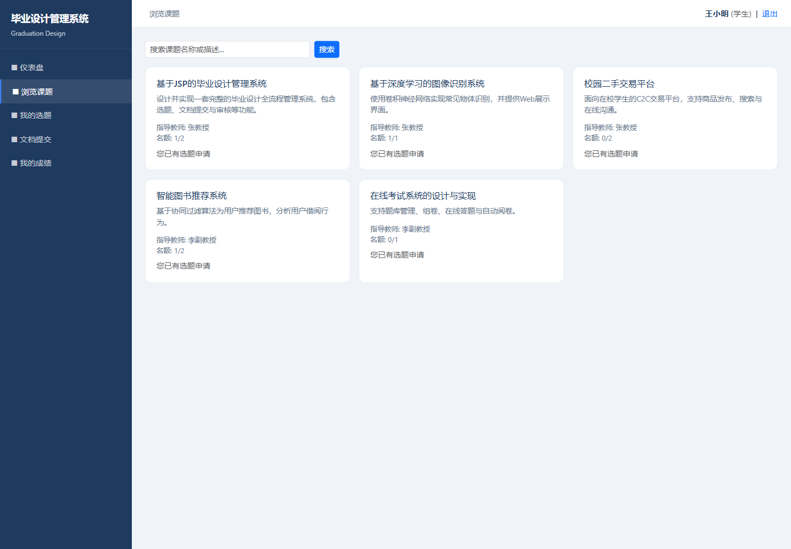

### 7.11 我的选题页面

我的选题页面展示学生已经提交的选题申请和审核状态。如果选题已通过，学生可以继续进入文档提交阶段；如果被驳回，则可以重新申请其他课题。

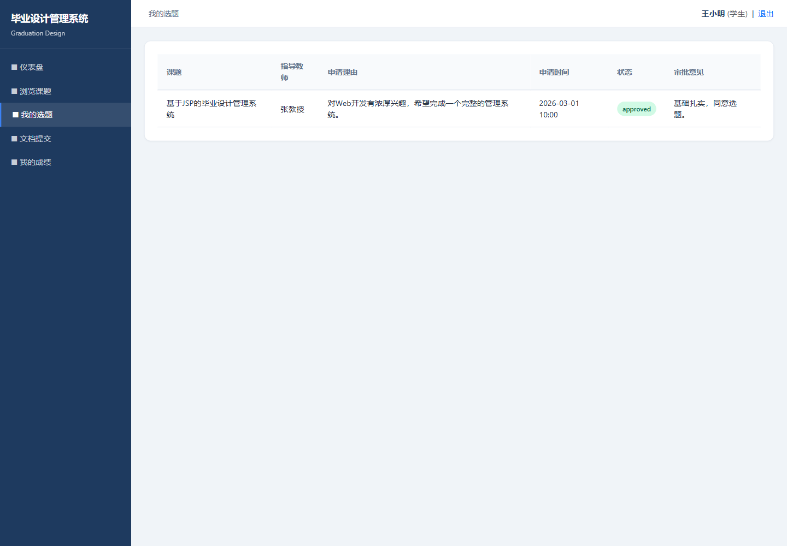

### 7.12 文档提交页面

学生在选题通过后可以提交毕业设计相关文档，包括开题报告、中期报告和终稿。提交内容会写入 `documents` 表，等待指导教师审核。

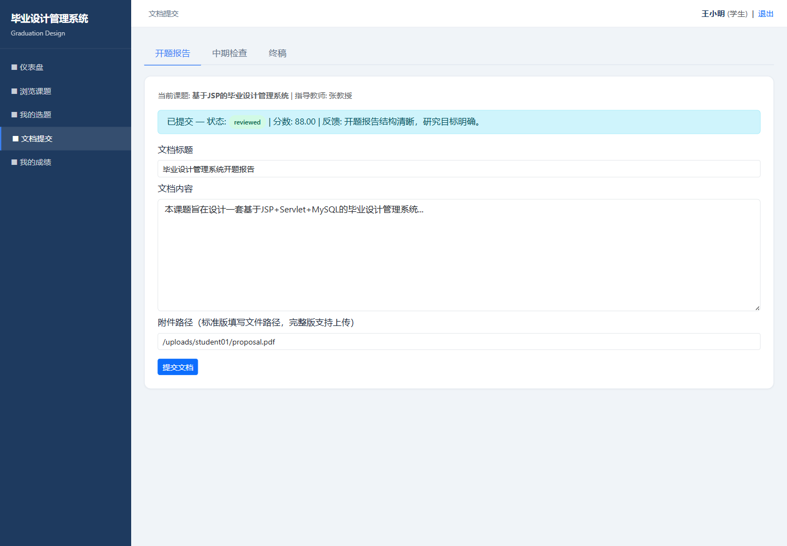

### 7.13 我的成绩页面

我的成绩页面展示学生文档审核结果，包括文档类型、状态、评分和教师反馈。学生可以通过该页面了解毕业设计各阶段完成情况。

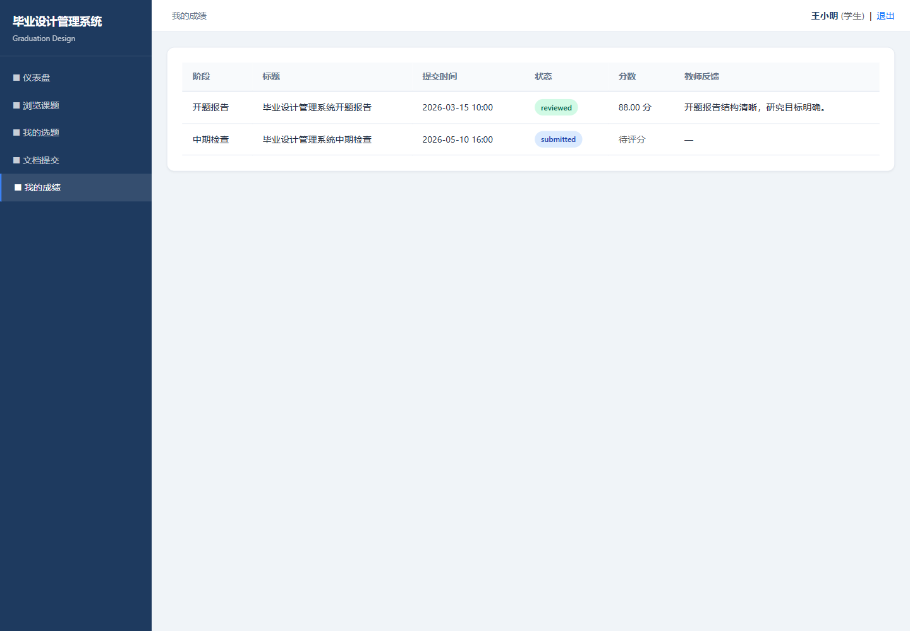

## 八、核心业务流程

### 8.1 登录与权限控制流程

用户提交用户名和密码后，`LoginController` 调用 `UserDao.validate()` 查询数据库。验证成功后，系统将 `loginUser` 保存到 Session 中。之后每次访问受保护页面时，`AuthFilter` 都会检查 Session 是否存在，并根据 URL 前缀判断角色是否匹配。

例如：

- `/admin/*` 只能由管理员访问。
- `/teacher/*` 只能由教师访问。
- `/student/*` 只能由学生访问。

如果未登录，系统会重定向到登录页；如果角色不匹配，系统会跳转回仪表盘，避免越权访问。

### 8.2 选题流程

教师先发布课题，学生在浏览课题页面提交申请。申请提交后，`topic_selections` 表中生成一条 `pending` 状态记录。教师在选题审批页面进行处理，批准后状态变为 `approved`，驳回后状态变为 `rejected`。

系统限制学生同时只能存在一个有效申请，避免重复选题。课题也设置了人数上限，当通过人数达到最大人数后，系统会将课题状态改为关闭。

### 8.3 文档提交与审核流程

学生必须在选题通过后才能提交文档。文档提交后进入 `submitted` 状态，教师审核后可更新为 `reviewed` 或 `rejected`，并填写评分和反馈。学生在成绩页面可以查看文档审核结果。

## 九、关键实现说明

### 9.1 数据库连接

数据库连接由 `SQLHelper` 统一管理。系统通过 JDBC URL 指定数据库地址、时区和字符编码，避免页面读取数据库时出现中文乱码。

### 9.2 密码处理

系统使用 `PasswordUtil.md5()` 对用户密码进行 MD5 哈希处理。数据库中保存哈希值，登录时对用户输入密码再次哈希后进行比较。

### 9.3 页面复用

系统将公共头部、侧边栏和底部拆分到 `WebContent/WEB-INF/includes/` 目录下，在不同 JSP 页面中通过 include 引入，减少重复代码，并保证整体页面风格一致。

### 9.4 角色化仪表盘

`dashboard.jsp` 根据当前 Session 中 `loginUser.role` 的值渲染不同内容，使管理员、教师和学生共用一个首页入口，但看到的统计指标和快捷功能不同。

## 十、测试与调试

项目测试主要围绕登录、角色权限、页面访问、数据库读写和中文编码展开。

测试过程中重点验证了以下内容：

1. 管理员账号 `admin / admin123` 可以正常登录，并访问用户管理、公告管理页面。
2. 教师账号 `teacher01 / 123456` 可以正常登录，并访问课题管理、选题审批、文档审核页面。
3. 学生账号 `student01 / 123456` 可以正常登录，并访问浏览课题、我的选题、文档提交和成绩页面。
4. 未登录用户访问受保护页面时会自动跳转到登录页。
5. 不同角色访问其他角色目录时会被拦截。
6. 数据库初始化脚本使用 `utf8mb4`，导入时指定 `--default-character-set=utf8mb4`，保证中文内容正常显示。

调试中遇到的主要问题包括中文乱码和演示账号登录失败。中文乱码的原因是 SQL 导入时未按 UTF-8 读取，导致数据库中实际保存为问号；解决方式是在导入命令中指定 `--default-character-set=utf8mb4`。登录失败的原因是部分演示账号的 MD5 哈希少了一位，修正为 `123456` 的正确 MD5 后登录恢复正常。

## 十一、项目总结

本项目完成了一个较完整的毕业设计管理系统课程设计，实现了三类角色的核心业务闭环。管理员可以维护基础数据和公告，教师可以发布课题并审核学生申请与文档，学生可以完成选题申请、文档提交和成绩查看。系统结构采用 MVC 分层设计，代码组织清晰，数据库表关系能够支撑毕业设计管理的主要业务流程。

通过本项目，进一步熟悉了 JSP、Servlet、JDBC、MySQL、Maven 和 Tomcat 的组合开发流程，也加深了对 Session 登录状态、Filter 权限控制、DAO 数据访问封装和中文编码处理的理解。项目仍有进一步扩展空间，例如完善文件上传、站内消息、答辩安排、操作日志和更细粒度的权限控制等功能。

