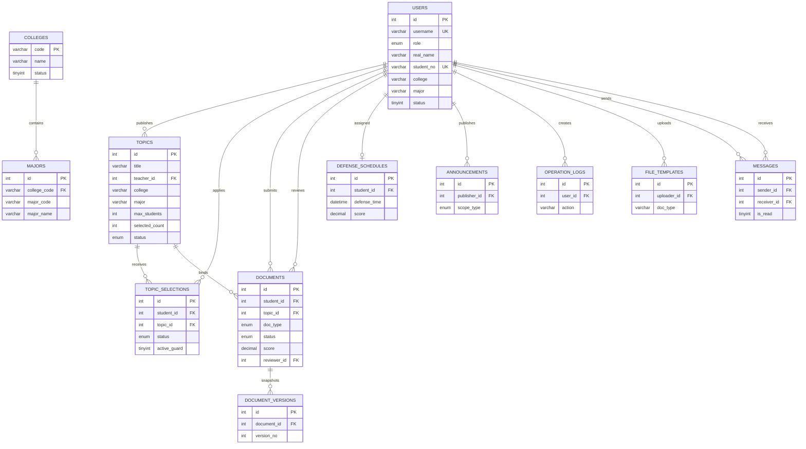

# 毕业设计管理系统课程设计项目报告

## 1. 引言

本课程设计完成的是一个面向高校毕业设计全过程的管理系统。毕业设计业务不是简单的单表增删改查，而是由教师出题、课题审核、学生选题、教师审批、阶段文档提交、文档评阅、答辩安排、成绩统计和结果导出等多个环节组成。系统需要同时服务管理员、系主任、教师和学生四类角色，并保证不同角色只能访问自己权限范围内的页面、接口和业务数据。

项目采用 JSP + Servlet + JDBC + MySQL 的 JavaWeb 技术路线。前端使用 JSP、Bootstrap 5、JavaScript、ECharts 和公共 `app.js` 完成页面交互、表单提示、CSRF 自动注入、AI 对话流式渲染和 Mermaid 图示渲染；后端使用 Servlet Controller 接收请求，DAO 层通过 JDBC、PreparedStatement 和 Druid 连接池访问 MySQL；系统通过 Session 保存登录态，通过 `AuthFilter` 统一处理登录校验、角色鉴权、CSRF 校验、安全响应头和上传目录直链拦截。

本报告按照“需求先行、设计承接、实现验证、总结反思”的逻辑组织：先说明项目背景和需求分析，再进入系统概要设计、详细设计、数据库设计、功能设计和非功能设计；随后选取 AI 辅助模块和 Session/身份鉴权上下文隔离机制两个关键模块展开；最后总结开发过程、已实现模块、未完成改进点、问题解决方案和个人收获。报告中的图片以架构图、ER 图、业务流程图、数据流图和关键运行截图为主，避免用大量页面截图堆叠内容。

## 2. 需求分析

需求分析是后续系统设计的依据。本系统不是单纯实现用户、课题、文档三张表的增删改查，而是要围绕高校毕业设计流程建立一套有角色边界、有业务状态、有数据范围控制的管理系统。

### 2.1 业务需求

毕业设计管理的主线可以概括为：管理员配置基础数据和系统规则，教师提交毕业设计课题，管理员或系主任审核课题，学生在本专业范围内申请课题，教师审批学生申请，学生按阶段提交文档，教师评阅文档，管理员或系主任进行统计、答辩安排和导出。系统需要保证流程前后有约束，例如未通过选题不能提交文档，未到对应阶段不能越级提交，课题未审核通过不能对学生开放。

业务生命周期如下图所示。


### 2.2 角色需求

系统面向四类角色。不同角色看到的菜单、能访问的 URL、能操作的数据范围均不同。

| 角色 | 核心需求 | 数据范围 |
|---|---|---|
| 管理员 | 用户管理、公告、系统开关、全校课题审核、答辩安排、统计导出、日志查看、模板管理、管理员端 AI | 全校范围 |
| 系主任 | 在教师能力基础上，审核本人学院和专业范围内的课题，查看本专业统计并导出 | 本学院本专业范围 |
| 教师 | 提交课题、维护本人课题、审批学生选题、评阅学生文档、查看指导学生进度、教师端 AI | 本人发布课题及其学生 |
| 学生 | 浏览本专业开放课题、申请选题、提交阶段文档、查看成绩和答辩、学生端 AI | 本人账号、本专业课题、本人文档 |

角色权限模型如下图所示。


### 2.3 功能需求

系统功能需求按照业务链路分为基础管理、课题管理、选题管理、文档管理、答辩统计、消息日志和 AI 辅助七类：

1. 基础管理：用户、学院专业字典、系统开关、公告、文件模板。
2. 课题管理：教师提交课题，管理员或系主任审核，课题按学院专业开放。
3. 选题管理：学生申请，教师审批，一人一题，名额满后关闭课题。
4. 文档管理：开题报告、中期检查、终稿提交、退回、重交、评分和历史版本。
5. 答辩统计：答辩时间地点维护，成绩统计，全校或本专业导出。
6. 消息日志：关键审批结果通知，登录、审核、导出、AI 使用等操作可追踪。
7. AI 辅助：管理员、教师、学生端复用同一 AI 组件，但会话必须按角色和用户隔离。

### 2.4 非功能需求

系统还需要满足以下非功能需求：

| 类型 | 需求说明 |
|---|---|
| 安全性 | 登录态校验、路径角色鉴权、CSRF 防护、上传下载鉴权、敏感信息不进入前端 |
| 可追溯性 | 关键业务操作写入 `operation_logs`，审批和消息结果可追踪 |
| 并发一致性 | 选题申请和审批不能出现一人多题、课题名额超限、重复提交等问题 |
| 可维护性 | 公共逻辑放入 Filter、Util、DAO、Service，减少 JSP 和 Controller 重复代码 |
| 可演示性 | 保留关键运行截图，更多使用 ER 图、数据流图和状态图说明设计思想 |

## 3. 系统设计

### 3.1 概要设计

系统采用 MVC 分层结构，核心请求从浏览器进入 `AuthFilter`，再进入对应 Controller、DAO 和数据库；页面渲染后再返回浏览器。整体结构如下图所示。


写操作采用 PRG（Post/Redirect/Get）模式，即 `POST 表单提交 -> Controller 处理业务 -> DAO 修改数据库 -> redirect 到 GET 页面 -> GET 重新查询最新数据`。

这种设计把页面展示、业务入口、数据访问和通用安全逻辑分开。JSP 负责页面渲染，Controller 负责请求分发和参数校验，DAO 负责数据库查询和事务，`AuthFilter` 负责统一的登录、角色和 CSRF 检查，避免每个业务控制器重复写同样的安全代码。

系统核心分层如下：

| 层次 | 目录或文件 | 职责 |
|---|---|---|
| View | `WebContent/**/*.jsp` | 页面展示、表单输入、状态徽章、图表容器、AI 面板 |
| Controller | `src/controller` | 接收请求、参数校验、业务分派、forward/redirect |
| DAO | `src/dao` | SQL 查询、事务处理、结果集映射 |
| Bean | `src/bean` | 用户、课题、选题、文档、消息、AI 历史等实体 |
| Filter | `src/filter/AuthFilter.java` | 编码、登录、角色路径、CSRF、上传直链拦截 |
| Util | `src/util` | 角色继承、作用域、CSRF、上传、日志、通知、AI 访问工具 |
| Service | `src/service` | 外部服务封装，例如 DeepSeek AI 流式接口 |
| JDBC 工具 | `src/util/SQLHelper.java` | JDBC 连接池、PreparedStatement 参数绑定和通用 SQL 执行 |

系统按四类角色组织：

| 角色 | 定位 | 主要能力 |
|---|---|---|
| 管理员 `admin` | 全校系统管理角色 | 用户、公告、系统开关、全校课题审核、答辩、统计、导出、日志、模板、管理员端 AI |
| 系主任 `director` | 教师上一级的专业管理角色 | 继承教师能力，额外管理本人专业范围内的课题审核、统计和导出 |
| 教师 `teacher` | 指导教师角色 | 提交课题、审批选题、审核文档、查看学生进度、教师端 AI |
| 学生 `student` | 毕业设计参与者 | 浏览本专业课题、申请选题、提交文档、查看成绩和答辩、学生端 AI |

### 3.2 详细设计

#### 3.2.1 后端模块划分

后端按角色和业务类型拆分 Controller。管理员模块位于 `/admin/*`，教师模块位于 `/teacher/*`，学生模块位于 `/student/*`，系主任额外管理模块位于 `/director/*`。这种 URL 设计让过滤器可以根据路径前缀做统一权限控制，也让页面菜单、后端入口和角色边界保持一致。

核心入口文件如下：

| 文件 | 说明 |
|---|---|
| `src/filter/AuthFilter.java` | 全局权限入口，负责登录、角色路径、CSRF、上传直链拦截 |
| `src/controller/LoginController.java` | 登录入口，认证通过后把 `loginUser` 写入 Session |
| `src/controller/AiAssistantController.java` | 管理员、教师、学生 AI 助手统一后端入口 |
| `src/service/DeepSeekAiService.java` | DeepSeek AI 请求、流式响应解析、角色系统提示构造 |
| `src/controller/AdminUserController.java` | 管理员用户管理 |
| `src/controller/AdminSystemSwitchController.java` | 系统开关管理 |
| `src/controller/TeacherTopicController.java` | 教师提交和管理课题 |
| `src/controller/TeacherSelectionController.java` | 教师审批选题 |
| `src/controller/StudentTopicController.java` | 学生浏览和申请课题 |
| `src/controller/StudentDocumentController.java` | 学生提交阶段文档 |
| `src/controller/TeacherDocumentController.java` | 教师审核阶段文档 |
| `src/controller/DirectorTopicReviewController.java` | 系主任本专业课题审核 |
| `src/controller/DirectorStatsController.java` | 系主任本专业统计 JSON |
| `src/controller/DirectorExportController.java` | 系主任本专业成绩导出 |
| `src/dao/SelectionDao.java` | 选题申请和审批事务 |
| `src/dao/DocumentDao.java` | 文档提交、审核和版本处理 |
| `src/dao/StatsDao.java` | 统计查询 |

#### 3.2.2 前端模块划分

前端使用 JSP 页面和公共 JS 文件组织。公共头部、侧边栏、分页、状态徽章、CSRF 元信息、AI 助手面板等内容放在 `WebContent/WEB-INF/includes` 中，具体业务页面通过 include 复用。全局脚本 `WebContent/js/app.js` 负责通用前端能力：

1. `showToast`：统一显示操作成功或失败提示。
2. `injectCsrfToken`：自动给所有 POST 表单注入 `_csrf` 隐藏字段，并处理 multipart 表单。
3. `initPageMessages`：根据 URL 中的 `msg` 或 `error` 参数显示对应中文提示。
4. `initAiAssistant`：初始化 AI 助手表单、流式读取 SSE、渲染 AI 回复和 Mermaid 图示。
5. 表单辅助能力：密码显示隐藏、确认弹窗、分数范围校验等。

AI 面板使用 `WebContent/WEB-INF/includes/ai-assistant-panel.jsp` 统一渲染，管理员、教师、学生端只需要设置 `aiRole`、`aiRoleName`、`aiAction` 和推荐问题数组，就可以复用同一套对话界面。

#### 3.2.3 请求与状态流转设计

系统典型登录流程如下：

```text
login.jsp -> POST /login.action -> LoginController
-> UserDao.validate
-> session.loginUser / session.loginTime
-> dashboard.jsp
```

受保护页面请求流程如下：

```text
请求 /admin/*、/teacher/*、/student/*、/director/*
-> AuthFilter 读取 Session
-> 重新查询数据库中的当前用户
-> 检查账号状态和角色是否变化
-> 根据 URL 前缀做角色鉴权
-> GET/HEAD 生成 CSRF Token
-> POST .action 校验 CSRF Token
-> 放行到 Controller 或 JSP
```

AI 请求流程如下：

```text
用户在 AI 面板输入问题
-> app.js 使用 fetch POST 到 /admin/ai.action、/teacher/ai.action 或 /student/ai.action
-> 请求携带 X-CSRF-Token 和 _csrf
-> AiAssistantController 再次检查 Session 用户和路径角色
-> 读取当前用户 Session 中的 AI 历史
-> DeepSeekAiService 构造 role + userId 隔离的 system prompt
-> 流式返回 text/event-stream
-> app.js 增量显示回复并渲染 Mermaid 图示
```

系统整体数据流如下图所示。该图把四类用户、业务处理层和数据库表之间的数据读写关系串起来，说明后续数据库设计不是孤立建表，而是服务于登录鉴权、课题、选题、文档、统计、消息日志和 AI 辅助等业务过程。


### 3.3 数据库设计

数据库名称为 `graduation_design`，初始化脚本为 `sql/init.sql`。当前主要表如下：

| 表名 | 作用 |
|---|---|
| `colleges` | 学院/学部字典 |
| `majors` | 专业字典 |
| `dictionary_items` | 角色、状态、文档类型等通用字典 |
| `system_configs` | 系统配置和业务开关 |
| `users` | 管理员、系主任、教师、学生统一用户表 |
| `topics` | 毕业设计课题 |
| `topic_selections` | 学生选题申请与审核结果 |
| `documents` | 学生当前阶段文档 |
| `document_versions` | 文档历史版本 |
| `announcements` | 公告，支持全局、学院、专业范围 |
| `defense_schedules` | 答辩安排 |
| `messages` | 站内消息 |
| `operation_logs` | 操作日志 |
| `file_templates` | 文件模板 |

核心表设计如下：

#### users

`users` 是统一用户表，通过 `role ENUM('admin','director','teacher','student')` 区分角色。该表同时保存 `college`、`major`、`class_name`、`department`、`email`、`phone` 等信息。统一用户表的好处是登录、消息、日志、AI 上下文隔离、权限判断都可以基于同一套用户 ID 完成。

#### topics

`topics` 记录课题信息，核心字段包括课题标题、描述、教师 ID、学院、专业、最大人数、已选人数和审核状态。课题状态为 `pending / open / closed / rejected`。教师提交课题后进入 `pending`，管理员或系主任审核通过后进入 `open`，学生才能看到。

#### topic_selections

`topic_selections` 记录学生选题申请。表中使用生成列 `active_guard` 和唯一索引 `uk_student_active_selection(student_id, active_guard)`，限制一个学生同一时间只能有一个 `pending` 或 `approved` 的有效选题。这一约束把“一人一题”从业务层下沉到数据库层。

#### documents 与 document_versions

`documents` 保存每个学生每个阶段的当前文档，通过 `UNIQUE(student_id, doc_type)` 保证同一阶段只有一条当前记录。`document_versions` 保存历史提交版本，方便追踪退回和重交过程。文档分数使用 `CHECK (score IS NULL OR (score >= 0 AND score <= 100))` 做数据库层约束。

#### operation_logs 与 messages

`operation_logs` 记录关键操作轨迹，例如登录、退出、新增用户、导入、导出、修改系统开关、提交课题、审核文档、AI 对话等。`messages` 保存站内消息，用于向学生和教师通知选题审批、文档审核、答辩安排等结果。

主要实体关系如下图（图3-3 数据库 ER 图）所示。


```mermaid
erDiagram
    COLLEGES ||--o{ MAJORS : contains
    USERS ||--o{ TOPICS : publishes
    USERS ||--o{ TOPIC_SELECTIONS : applies
    USERS ||--o{ DOCUMENTS : submits
    USERS ||--o{ DOCUMENTS : reviews
    USERS ||--o| DEFENSE_SCHEDULES : assigned
    USERS ||--o{ ANNOUNCEMENTS : publishes
    USERS ||--o{ OPERATION_LOGS : creates
    USERS ||--o{ FILE_TEMPLATES : uploads
    USERS ||--o{ MESSAGES : sends
    USERS ||--o{ MESSAGES : receives
    TOPICS ||--o{ TOPIC_SELECTIONS : receives
    TOPICS ||--o{ DOCUMENTS : binds
    DOCUMENTS ||--o{ DOCUMENT_VERSIONS : snapshots

    COLLEGES {
        varchar code PK
        varchar name
        tinyint status
    }
    MAJORS {
        int id PK
        varchar college_code FK
        varchar major_code
        varchar major_name
    }
    USERS {
        int id PK
        varchar username UK
        enum role
        varchar real_name
        varchar student_no UK
        varchar college
        varchar major
        tinyint status
    }
    TOPICS {
        int id PK
        varchar title
        int teacher_id FK
        varchar college
        varchar major
        int max_students
        int selected_count
        enum status
    }
    TOPIC_SELECTIONS {
        int id PK
        int student_id FK
        int topic_id FK
        enum status
        tinyint active_guard
    }
    DOCUMENTS {
        int id PK
        int student_id FK
        int topic_id FK
        enum doc_type
        enum status
        decimal score
        int reviewer_id FK
    }
    DOCUMENT_VERSIONS {
        int id PK
        int document_id FK
        int version_no
    }
    DEFENSE_SCHEDULES {
        int id PK
        int student_id FK
        datetime defense_time
        decimal score
    }
    ANNOUNCEMENTS {
        int id PK
        int publisher_id FK
        enum scope_type
    }
    OPERATION_LOGS {
        int id PK
        int user_id FK
        varchar action
    }
    FILE_TEMPLATES {
        int id PK
        int uploader_id FK
        varchar doc_type
    }
    MESSAGES {
        int id PK
        int sender_id FK
        int receiver_id FK
        tinyint is_read
    }
```

### 3.4 功能设计

功能设计承接前文需求分析，按业务主线而不是页面数量组织。管理员提供全校级基础维护和监控能力；系主任在教师能力基础上拥有本人专业范围内的审核和统计能力；教师负责课题、选题和文档评阅；学生完成选题申请、阶段文档提交和结果查看。系统实际页面较多，但报告中只保留关键运行截图，重点用流程图说明业务规则。

课题从教师提交到学生可选，并不是一个简单的新增记录过程，而是要经过审核、开放、名额控制和关闭。课题状态机如下图所示。


| 功能域 | 主要参与角色 | 已实现能力 | 关键约束 |
|---|---|---|---|
| 基础管理 | 管理员 | 用户、公告、系统开关、模板、日志、消息 | 仅管理员可访问全校级管理入口 |
| 专业管理 | 系主任 | 本专业课题审核、本专业统计、成绩导出 | 数据范围限制为当前系主任 `college + major` |
| 课题管理 | 教师、系主任、管理员 | 教师提交课题，管理员或系主任审核 | 未审核通过的课题不对学生开放 |
| 选题管理 | 学生、教师 | 学生申请，教师审批，一人一题，名额控制 | 数据库唯一索引和事务共同保证 |
| 文档管理 | 学生、教师 | 开题、中期、终稿提交和评阅，历史版本留存 | 未通过选题不能提交，阶段顺序受控 |
| 答辩统计 | 管理员、系主任 | 答辩安排、成绩统计、Excel 导出 | 管理员看全校，系主任看本专业 |
| AI 辅助 | 管理员、教师、学生 | 共用 AI 面板、SSE 流式输出、Mermaid 渲染 | Session 历史按 `role + userId` 隔离 |

关键运行效果选取两个页面作为代表：管理员仪表盘体现全校统计、公告和功能入口；系主任本专业课题审核页体现角色继承和专业范围隔离。


### 3.5 非功能设计

#### 3.5.1 安全设计

安全设计主要包括登录校验、路径角色鉴权、CSRF 防护、XSS 输出转义、文件上传白名单、下载鉴权和敏感错误脱敏。`AuthFilter` 统一设置安全响应头，禁止直接访问 `/uploads/*`，并对非安全 `.action` 请求校验 CSRF Token。上传文件由 `FileUploadUtil` 校验扩展名和大小，下载文件必须走 Controller 鉴权。

#### 3.5.2 日志设计

系统通过 `operation_logs` 表记录关键操作。业务代码使用 `OperationLogUtil.log(...)` 统一写日志，覆盖登录、退出、用户维护、导入导出、系统开关、课题审核、选题审批、文档审核、消息发送、AI 清空和 AI 对话等事件。日志设计保证系统操作可追溯，方便课程演示和问题定位。

#### 3.5.3 并发设计

并发重点在选题和文档提交。选题申请使用事务和 `SELECT ... FOR UPDATE` 锁定学生和课题，配合数据库唯一索引保证“一人一题”和名额不超限。文档提交使用事务检查已通过选题、前置阶段和当前文档状态，避免跳阶段提交和重复覆盖。

#### 3.5.4 可维护性与可演示性设计

可维护性方面，系统把角色判断、作用域计算、CSRF、文件上传、日志、消息、AI 路径角色识别、环境变量读取等逻辑封装为工具类或 Service，降低 Controller 复杂度。可演示性方面，项目提供 `seed_demo_data_20260622.sql` 和 `seed_showcase_data_20260623.sql`，补充多角色、多学院、多专业、多课题、多文档和统计图数据，使页面截图和答辩展示更完整。

## 4. 关键模块设计

本节只选择两个做得较好的模块展开，不把所有模块平均罗列。两个模块分别是“AI 辅助模块”和“Session/身份鉴权上下文隔离机制”。前者体现系统功能创新和前后端协同，后者体现整个系统最核心的登录态、安全边界和上下文隔离。

关键模块选取依据如下：

| 需求来源 | 对应设计 | 选择为关键模块的原因 |
|---|---|---|
| 功能需求中的 AI 辅助能力 | 公共 AI 面板、`app.js`、`AiAssistantController`、`DeepSeekAiService` | 体现系统功能创新，同时涉及前端流式交互、后端统一入口和角色上下文隔离 |
| 非功能需求中的身份安全、数据隔离和 CSRF 防护 | `LoginController`、`AuthFilter`、`RoleUtil`、`CsrfUtil`、Session | 是所有业务模块的基础，决定管理员、系主任、教师、学生能否在正确边界内操作 |
| 业务需求中的课题、选题、文档闭环 | `TopicDao`、`SelectionDao`、`DocumentDao`、数据库约束 | 已在系统功能设计、状态流转图和数据流图中说明；本节重点展开更具横切性的两个模块 |

### 4.1 关键模块一：AI 辅助模块

#### 4.1.1 流程分析

AI 辅助模块的目标是在管理员、教师、学生端提供统一但隔离的智能问答能力。它不是简单嵌入一个聊天框，而是和系统身份、角色、Session、CSRF、前端流式渲染结合在一起。该模块使用公共 `app.js` 驱动前端交互，后端由 `AiAssistantController` 统一处理不同角色的 AI 请求。

AI 请求流程如下图所示：


这个流程的优点是：管理员、教师、学生可以共用同一个前端组件和后端控制器，但实际上下文又按 `role + userId` 隔离，避免不同角色、不同用户之间共享 AI 历史。

#### 4.1.2 核心代码实现

前端公共 `app.js` 中的 `initAiAssistant()` 负责初始化 AI 面板。它从表单的 `data-action` 或 `window.GDMS_AI_CONFIG.action` 中读取接口地址，从 `<meta name="csrf-token">` 中读取 CSRF Token，然后通过 fetch 发送请求：

```javascript
function postAiStream(message, onDelta) {
  var params = new URLSearchParams({ message: message });
  if (csrf) params.set('_csrf', csrf);
  return fetch(action, {
    method: 'POST',
    headers: {
      'Content-Type': 'application/x-www-form-urlencoded;charset=UTF-8',
      'X-CSRF-Token': csrf
    },
    body: params.toString()
  }).then(function(r) {
    var contentType = r.headers.get('content-type') || '';
    if (contentType.indexOf('text/event-stream') < 0) {
      return r.text().then(function(text) {
        throw new Error(explainNonJsonResponse(r.status, text));
      });
    }
    return readEventStream(r.body, onDelta);
  });
}
```

后端 `AiAssistantController` 同时映射三个入口：

```java
@WebServlet({"/admin/ai.action", "/teacher/ai.action", "/student/ai.action"})
public class AiAssistantController extends HttpServlet {
    private static final int MAX_INPUT_LENGTH = 2000;
}
```

收到请求后，控制器先读取 Session 中的 `loginUser`，再根据当前路径识别要求角色，并调用 `RoleUtil.hasRole(user, pathRole)` 做二次校验：

```java
HttpSession session = request.getSession(false);
User user = session == null ? null : (User) session.getAttribute("loginUser");
if (user == null) {
    writeJson(response, false, "请先登录后再使用 AI 助手。", null);
    return;
}

String pathRole = AiAccessUtil.roleFromPath(request.getServletPath());
if (!RoleUtil.hasRole(user, pathRole)) {
    response.setStatus(HttpServletResponse.SC_FORBIDDEN);
    writeJson(response, false, "当前账号无权访问该角色的 AI 助手。", null);
    return;
}
```

AI 历史不写入全局变量，而是按当前用户的 Session key 保存：

```java
List<AiChatMessage> history = getHistory(session, user);
String reply = new DeepSeekAiService().streamChat(user, pathRole, history, message, consumer);
history.add(new AiChatMessage("user", message));
history.add(new AiChatMessage("assistant", reply));
trimHistory(history);
session.setAttribute(AiAccessUtil.sessionKey(user), history);
```

`DeepSeekAiService` 生成 system prompt 时，会把当前角色、用户 ID 和用户名写入提示，并明确要求上下文按角色和用户 ID 隔离：

```java
String base = "你是毕业设计管理系统中的" + roleName + "端 AI 助手。"
    + "当前会话只属于当前登录用户，用户ID=" + userId + "，用户名=" + username + "。"
    + "必须同时按角色和用户ID隔离上下文：不能泄露、推测或代替同级其他用户、其他角色用户的数据或操作。"
    + "不能输出 API Key、环境变量、服务器敏感配置。"
    + "回答使用中文，围绕毕业设计管理系统的实际业务，给出可执行、简洁的建议。";
```

#### 4.1.3 结果截图与使用技术

AI 模块在管理员、教师、学生端都可以复用同一套前端逻辑。页面上会显示当前用户、角色、模型名、推荐问题和隔离规则；AI 回复中如果包含 Mermaid 代码块，前端会自动渲染为流程图、状态图或时序图。该模块使用的技术包括 JSP include、Servlet、Session、CSRF Token、Fetch API、SSE 流式响应、DeepSeek API、Mermaid 渲染、`app.js` 公共组件化和角色上下文隔离。


### 4.2 关键模块二：Session 机制与身份鉴权上下文隔离

#### 4.2.1 流程分析

Session 机制是整个系统的核心点。系统中用户身份、角色权限、CSRF Token、AI 会话历史、登录失败锁定等都依赖 Session 或围绕 Session 进行校验。系统不是只在登录时判断一次身份，而是在每个受保护请求中通过 `AuthFilter` 重新读取数据库中的当前用户，防止账号被禁用或角色被修改后旧 Session 继续生效。

完整流程如下图所示：


这个机制解决了三个问题：第一，系统能知道当前请求是谁发起的；第二，系统能根据角色限制页面和接口；第三，系统能把 AI 对话、业务数据范围、操作日志都绑定到当前用户上下文。

#### 4.2.2 核心代码实现

登录成功时，`LoginController` 会把用户对象放入 Session，并且不把密码放入 Session：

```java
if (dao.validate(username, password)) {
    User user = dao.findByUsername(username);
    user.setPassword(null); // 安全：不在 session 中存储密码
    session.setAttribute("loginUser", user);
    session.setAttribute("loginTime", System.currentTimeMillis());
    LoginAttemptUtil.clear(session, username);
    OperationLogUtil.log(user.getId(), "LOGIN", user.getRole(), username + " 登录系统");
    WebUtil.redirect(request, response, "/dashboard.jsp");
}
```

`AuthFilter` 在每次受保护请求中读取并刷新当前用户：

```java
HttpSession session = request.getSession(false);
User user = session == null ? null : (User) session.getAttribute("loginUser");
if (user == null) {
    response.sendRedirect(ctx + "/login.jsp");
    return;
}

User currentUser = new UserDao().findById(user.getId());
if (currentUser == null || currentUser.getStatus() != 1
        || !currentUser.getRole().equals(user.getRole())) {
    session.invalidate();
    response.sendRedirect(ctx + "/login.jsp?error=account_changed");
    return;
}
session.setAttribute("loginUser", currentUser);
user = currentUser;
```

路径鉴权集中在过滤器中完成：

```java
if (path.startsWith("/admin/") && !"admin".equals(user.getRole())) {
    response.sendRedirect(ctx + "/dashboard.jsp");
    return;
}
if (path.startsWith("/director/") && !"director".equals(user.getRole())) {
    response.sendRedirect(ctx + "/dashboard.jsp");
    return;
}
if (path.startsWith("/teacher/") && !RoleUtil.hasRole(user, "teacher")) {
    response.sendRedirect(ctx + "/dashboard.jsp");
    return;
}
if (path.startsWith("/student/") && !"student".equals(user.getRole())) {
    response.sendRedirect(ctx + "/dashboard.jsp");
    return;
}
```

CSRF Token 也依赖当前 Session。安全方法生成 Token，非安全 `.action` 请求校验 Token：

```java
if (isSafeMethod(request.getMethod())) {
    CsrfUtil.getToken(session);
}

if (!isSafeMethod(request.getMethod()) && path.endsWith(".action")
        && !"/login.action".equals(path)) {
    if (!CsrfUtil.validate(request)) {
        response.sendError(HttpServletResponse.SC_FORBIDDEN, "CSRF token invalid");
        return;
    }
}
```

前端 `app.js` 会自动把 CSRF Token 注入所有 POST 表单：

```javascript
function injectCsrfToken() {
  var meta = document.querySelector('meta[name="csrf-token"]');
  if (!meta) return;
  var token = meta.getAttribute('content');
  document.querySelectorAll('form[method="post"], form[method="POST"]').forEach(function(form) {
    if (form.querySelector('input[name="_csrf"]')) return;
    var input = document.createElement('input');
    input.type = 'hidden';
    input.name = '_csrf';
    input.value = token;
    form.appendChild(input);
  });
}
```

#### 4.2.3 结果截图与使用技术

该模块的运行效果体现在四类角色访问不同页面时的隔离结果：管理员可访问全校管理页面；系主任可以进入教师端页面和本专业管理页面，但不能进入管理员页面；学生只能访问学生端页面。AI 会话、CSRF Token、登录用户和操作日志都绑定到当前 Session 和当前用户 ID。

该模块使用的技术包括 HttpSession、Servlet Filter、角色路径鉴权、数据库二次校验、CSRF Token、登录失败锁定、操作日志、`RoleUtil` 角色继承和前端自动 Token 注入。


## 5. 测试与运行验证

项目已执行 Maven 测试、WAR 打包、数据库演示数据脚本和 HTTP 冒烟验证。报告截图由 Playwright 对本地运行地址 `http://localhost:8086/graduation-design/` 采集，覆盖管理员、系主任、教师、学生四类角色。测试验证不是单纯确认页面能打开，而是确认需求分析中提出的角色边界、业务状态、数据范围和关键功能能够在运行系统中体现。

主要验证点包括：

1. Java 单元测试通过，WAR 打包成功。
2. 展示增强数据脚本可重复执行。
3. 系主任可以访问 `/teacher/*` 和 `/director/*`，但不能访问 `/admin/*`。
4. 教师不能访问系主任页面，学生不能访问教师页面。
5. 学生构造跨专业 URL 参数后，页面仍只显示本人专业课题。
6. 非管理员发布公告数量为 0，有效跨专业选题数量为 0。
7. AI 请求必须在登录 Session 中发起，且会被后端再次按路径角色校验。

教师文档审核页面用于验证“学生提交文档后由指导教师评阅”的业务闭环。


学生课题浏览页面用于验证“学生只能看到本专业开放课题”的数据范围控制。


## 6. 系统开发过程总结

### 6.1 已构建并实现的模块

本项目已经构建并实现了以下模块：

| 模块 | 完成情况 | 说明 |
|---|---|---|
| 登录与 Session 模块 | 已实现 | 支持登录、退出、Session 登录态、账号状态变化后二次校验 |
| 身份鉴权模块 | 已实现 | 管理员、系主任、教师、学生路径权限控制，系主任继承教师能力 |
| AI 辅助模块 | 已实现 | 管理员、教师、学生端 AI 助手，支持 SSE 流式输出、Mermaid 渲染、上下文隔离 |
| 用户管理模块 | 已实现 | 管理员维护账号，支持筛选、编辑、禁用、导入、批量重置学生密码 |
| 公告模块 | 已实现 | 管理员发布全局、学院、专业范围公告 |
| 系统开关模块 | 已实现 | 控制教师出题、学生选题、开题/中期/终稿上传入口 |
| 课题管理模块 | 已实现 | 教师提交课题，管理员或系主任审核，学生浏览开放课题 |
| 选题审批模块 | 已实现 | 学生申请，教师审批，控制一人一题和课题名额 |
| 文档管理模块 | 已实现 | 学生提交阶段文档，教师审核，历史版本留存 |
| 答辩安排模块 | 已实现 | 管理员维护答辩时间、地点、分组、成绩，支持导入 |
| 统计与导出模块 | 已实现 | 管理员全校统计导出，系主任本专业统计导出 |
| 文件模板模块 | 已实现 | 管理员上传模板，教师和学生下载模板 |
| 站内消息与日志模块 | 已实现 | 审批、导出、登录、AI 使用等关键操作可追踪 |

### 6.2 需要但尚未深入实现的模块

当前系统已经满足课程设计演示和核心业务闭环，但仍有继续完善空间：

1. **AI 与业务数据深度结合**：目前 AI 更偏向问答和写作辅助，后续可以在权限允许范围内读取当前用户真实课题、文档和统计数据，生成更贴近业务的建议。
2. **更细粒度权限表**：当前 RBAC 主要由代码实现，适合课程设计规模；如果系统扩大，可以增加角色表、权限表和角色权限关联表。
3. **更完整的流程配置**：目前毕业设计阶段固定为开题、中期、终稿，后续可以允许学院自定义流程节点。
4. **更多通知方式**：当前以站内消息为主，后续可扩展邮件、短信或企业微信通知。
5. **更完整的自动化测试**：当前已有测试和 HTTP 冒烟验证，后续可增加端到端 UI 自动化测试和并发压测。
6. **文件在线预览和查重**：当前重点是上传、下载、模板和版本，后续可接入在线预览、文档差异对比和查重服务。

### 6.3 开发中出现的问题及解决方案

| 问题 | 表现 | 解决方案 |
|---|---|---|
| 系主任定位不清晰 | 早期容易把系主任做成小管理员，权限过大 | 重新定义为 `director = teacher + director-extra`，只继承教师，不继承管理员 |
| Session 旧身份可能继续生效 | 管理员修改账号状态或角色后，旧 Session 可能仍能访问 | `AuthFilter` 每次请求都按用户 ID 重新查数据库，角色变化则销毁 Session |
| CSRF 容易漏加 | 多个 POST 表单手写隐藏字段容易遗漏 | 后端统一校验，前端 `app.js` 自动给 POST 表单注入 `_csrf` |
| AI 上下文容易串角色 | 管理员、教师、学生共用 AI 入口时可能混淆权限 | 后端按路径识别角色，Session 历史按 `role + userId` 隔离，system prompt 明确隔离规则 |
| AI 流式响应前端处理复杂 | SSE 分块返回时页面可能显示不完整或不能渲染图示 | `app.js` 实现 `readEventStream`，先增量显示纯文本，结束后再渲染 Mermaid |
| 数据范围不能只靠前端筛选 | 学生或系主任可能构造 URL 访问其他专业数据 | Controller 和 DAO 都按 Session 用户的 `college + major` 重新计算作用域 |
| 上传文件可能绕过权限访问 | 直接访问 `/uploads/...` 会绕过下载鉴权 | `AuthFilter` 禁止上传目录直链，下载统一走 Controller |
| 演示数据不足 | 统计图和审核页面不够直观 | 增加演示数据和展示增强脚本，重新采集多角色截图 |

### 6.4 系统开发对自己的意义

通过本次课程设计，我不只是完成了一组页面和数据库表，而是完整经历了一个业务系统从需求梳理、数据库建模、角色权限设计、Session 登录态维护、AI 辅助能力接入、前端交互、后端事务、运行截图验证到报告整理的全过程。

这个项目让我更清楚地理解了 JavaWeb 中 JSP、Servlet、Filter、Session、JDBC、MySQL 事务之间的配合关系。尤其是 Session 机制和身份鉴权上下文隔离，让我认识到真实系统不能只判断“有没有登录”，还要继续判断“当前用户是谁、角色有没有变化、当前路径是否允许、当前业务数据是否属于这个用户”。AI 模块的开发也让我体会到新功能不能脱离原系统安全边界，即使是智能问答，也要遵守用户身份、角色权限和上下文隔离。

对我个人来说，本项目最大的收获是把“页面能打开”推进到了“业务规则正确、身份边界清楚、上下文隔离明确、关键操作可追踪”。以后继续开发类似管理系统时，我会优先考虑 Session、权限、数据范围、日志、并发和可测试性，而不是只关注某个单独页面是否能完成增删改查。

## 7. 结论

本系统已经形成了从需求、概要设计、详细设计、数据库设计、功能设计、非功能设计、关键模块实现到开发过程总结的完整闭环。报告按照课程要求补充了引言、系统设计、关键模块设计和系统开发过程总结；关键模块控制为两个，分别围绕 AI 辅助模块和 Session/身份鉴权上下文隔离机制展开，并包含流程分析、核心代码、结果截图和使用技术说明。整体上，本项目能够满足毕业设计管理系统课程设计对系统结构、数据库设计、功能实现、非功能安全、关键代码说明和运行效果展示的要求。
